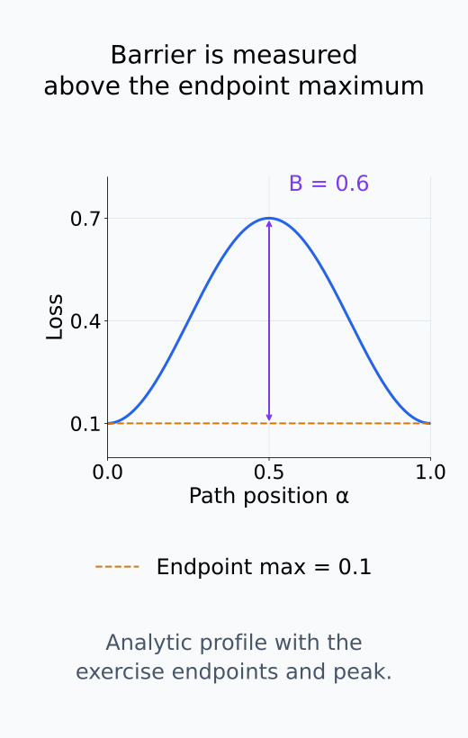
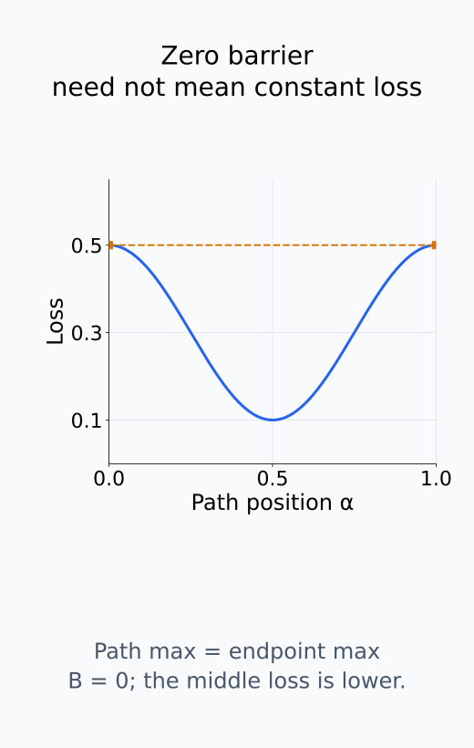
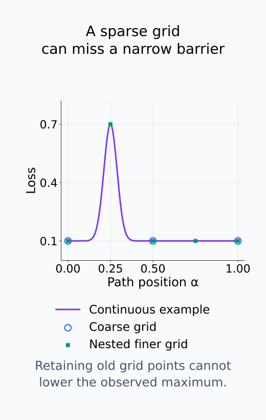
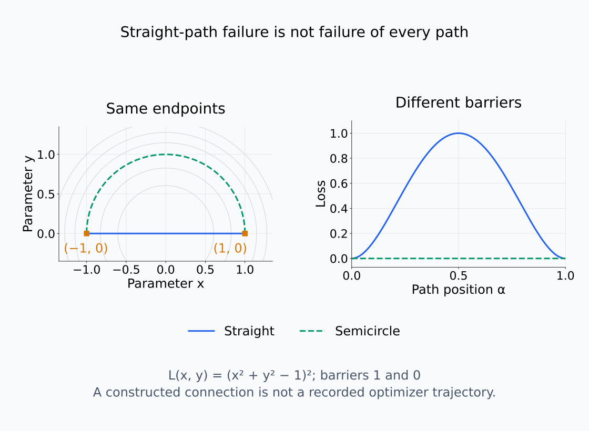
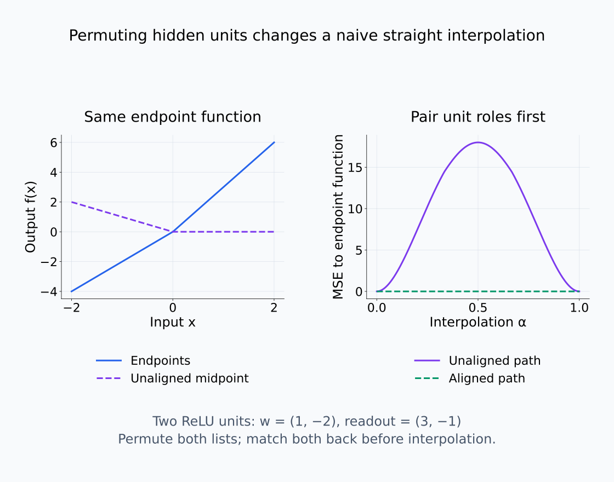
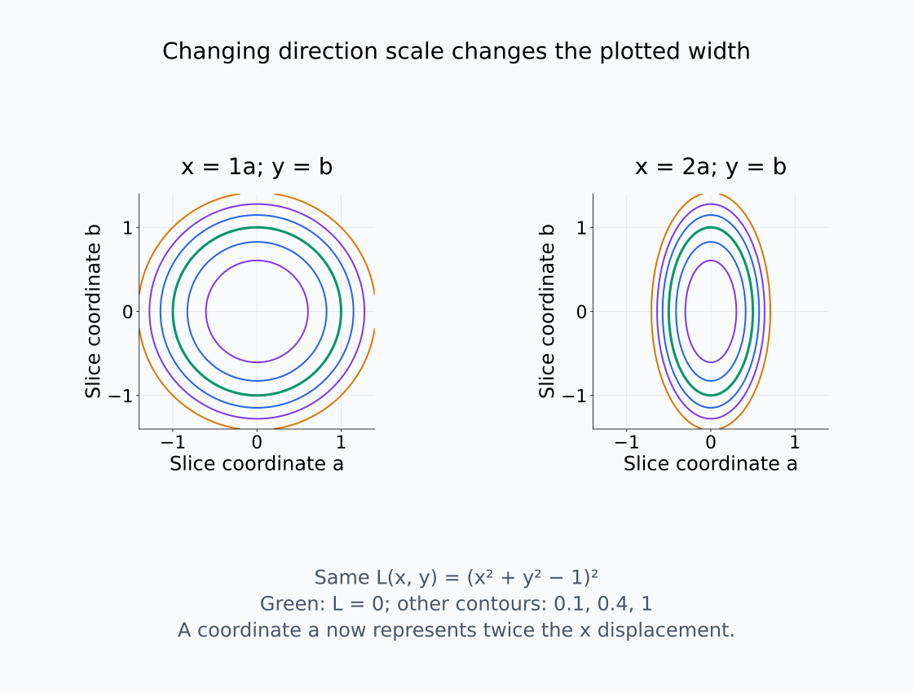

# I08-07. loss landscape와 mode connectivity

## 이 단원이 필요한 이유

두 checkpoint의 loss가 낮아도 그 사이가 낮은지는 별도 질문이다. 직선 보간의 barrier와 최적화된 곡선 경로는 서로 다른 증거를 준다. loss landscape 시각화는 고차원 함수를 선택한 저차원 단면으로 보는 것이므로 전체 지형으로 해석하면 안 된다.

## 학습 목표

- parameter path 위의 loss profile을 정의할 수 있다.
- straight interpolation barrier를 계산할 수 있다.
- low-loss curve와 실제 학습 궤적을 구분할 수 있다.
- 좌표와 normalization이 landscape 그림에 미치는 영향을 설명할 수 있다.

## 선수지식 확인

- 선수 단원: [I08-06 Hessian spectrum](I08-06-hessian-spectrum.md), [M01-11 방향미분과 gradient](../../part-1-foundations/M01/M01-11-directional-derivative-gradient.md)
- 확인 질문: 국소 Hessian 정보만으로 먼 두 minima 사이의 loss를 알 수 없는 이유는 무엇인가?

## 기호와 용어

| 기호·용어 | Common spoken reading | 의미 | shape·범위 |
|---|---|---|---|
| $\gamma(\alpha)$ | `gamma of alpha` | 두 지점을 잇는 parameter path | $[0,1]\to\mathbb R^p$ |
| $\gamma_{\mathrm{lin}}(\alpha)$ | `gamma lin of alpha` | straight interpolation | $\mathbb R^p$ |
| $B(\gamma)$ | `B of gamma` | endpoint 대비 최대 loss barrier | nonnegative scalar |
| mode connectivity | `mode connectivity` | 낮은 loss 경로로 해들이 연결되는 현상 | path property |
| basin | `basin` | 선택한 optimization·좌표에서 낮은 loss 주변 영역 | informal region |

## 1. 경로를 먼저 정한다

두 파라미터 $\theta_a,\theta_b$의 직선 경로는

$$
\gamma_{\mathrm{lin}}(\alpha)=(1-\alpha)\theta_a+\alpha\theta_b,
\qquad 0\le\alpha\le1
$$

이다. barrier를

$$
B(\gamma)=\max_\alpha L(\gamma(\alpha))-
\max\{L(\theta_a),L(\theta_b)\}
$$

로 정의할 수 있다. 평가 데이터와 $\alpha$ grid를 고정해야 값이 재현된다.

이 식은 경로의 가장 높은 loss가 두 endpoint 중 더 높은 loss를 얼마나 넘는지 측정한다. 경로에 양 끝이 포함되므로 연속 경로의 최대값은 endpoint 최대값보다 작을 수 없어 barrier가 음수가 되지 않는다. Barrier가 0이어도 경로의 loss가 일정하다는 뜻은 아니다. 더 낮은 loss를 지나거나 낮은 endpoint에서 높은 endpoint까지 올라갈 수 있다.

실제 grid에서 구한 최대값은 그 grid의 관찰값 중 최대값이다. 연속 경로 중간의 peak를 놓치면 barrier를 과소평가한다. 같은 경로와 데이터에서 기존 점들을 유지하며 grid를 더 촘촘히 하면 관찰한 최대값은 줄지 않는다. Grid 사이의 값을 측정하지 않고 연속 경로 전체의 최대값을 정확히 구했다고 보고하지 않는다.

barrier가 어느 높이 차이인지 확인한다.

<figure class="lesson-figure" markdown="1">

<figcaption>기존 문제의 endpoint loss 0.1과 peak 0.7을 갖는 수학적 profile을 그렸다. barrier는 loss의 절댓값 0.7이 아니라 두 endpoint 중 높은 값 위로 솟은 높이 0.6이다.</figcaption>
</figure>

barrier 0인 경로도 중간 loss가 달라질 수 있다.

<figure class="lesson-figure" markdown="1">

<figcaption>양 끝이 0.5이고 중간은 0.1인 수학적 profile이다. 경로의 최대값이 endpoint 최대값을 넘지 않으므로 B=0이지만 경로 loss는 일정하지 않다.</figcaption>
</figure>

grid의 관찰 최대값과 연속 경로의 최대값을 구분한다.

<figure class="lesson-figure" markdown="1">

<figcaption>연속인 수학적 profile의 α=0.25 부근 peak를 coarse grid 0,0.5,1은 놓친다. 기존 점을 유지한 finer grid는 이 peak를 포착한다. 연속곡선은 설명용 정답이며 실제 측정에서 보지 않은 중간값을 얻었다는 뜻은 아니다.</figcaption>
</figure>

## 2. 직선 실패는 연결 실패가 아니다

직선에 높은 barrier가 있어도 굽은 low-loss path가 존재할 수 있다. 반대로 선택한 곡선 하나가 낮다고 모든 점이나 모든 모델이 연결된다는 뜻은 아니다. mode connectivity는 경로 존재에 관한 주장이다.

실습의 두 endpoint는 $(1,0)$과 $(-1,0)$이다. 직선 경로 $(1-2\alpha,0)$는 중점에서 원점을 지나므로 $L(0,0)=(0-1)^2=1$이고, endpoint loss는 0이다. 반원 경로 $(\cos(\pi\alpha),\sin(\pi\alpha))$에서는 두 좌표의 제곱합이 1이라 경로 전체의 loss가 0이다. 같은 두 끝점을 잇더라도 선택한 경로에 따라 barrier가 1 또는 0이 된다. 직선 하나의 실패는 모든 경로가 실패한다는 증거가 아니다.

같은 endpoint를 잇는 두 경로를 parameter 공간과 loss profile에서 비교한다.

<figure class="lesson-figure lesson-figure--wide" markdown="1">

<figcaption>기존 실습의 L(x,y)=(x²+y²−1)²에서 직선은 원점을 지나 barrier 1을 만들고 반원은 단위원 위에 있어 loss 0을 유지한다. 왼쪽은 parameter 경로, 오른쪽은 그 경로에서 평가한 loss다. 이 연결 경로가 optimizer의 실제 이동 경로였다는 증거는 아니다.</figcaption>
</figure>

## 3. 대칭과 정렬

hidden-unit permutation을 정렬하지 않으면 기능적으로 같은 두 모델의 직선 중간이 unit을 섞어 높은 loss를 낼 수 있다. 따라서 connectivity 비교 전에 가능한 symmetry alignment를 기록한다.

loss 단면 그림도 방향 vector의 scale과 filter normalization에 따라 모양이 바뀐다. 그림은 정의한 slice의 측정 결과이다.

예를 들어 참조 weight $\theta_0$와 두 방향 $u,v$를 정하면 단면은 $L(\theta_0+au+bv)$를 잰 결과다. 방향 $u$를 두 배로 키우면 그림의 같은 가로 좌표 $a$가 두 배 큰 weight 이동을 뜻한다. 방향의 크기를 맞추는 normalization도 이 좌표와 실제 이동의 대응을 바꾼다. Loss 함수가 바뀐 것은 아니지만 보이는 barrier의 폭과 기울기는 달라질 수 있다. 두 방향 밖의 이동은 이 단면에서 확인할 수 없다.

unit의 대응을 바꾸면 보간 중간의 함수도 달라질 수 있다.

<figure class="lesson-figure lesson-figure--wide" markdown="1">

<figcaption>수학적 두 ReLU unit의 input weight (1,−2)와 readout (3,−1)을 함께 뒤집으면 endpoint 함수는 같다. 대응 unit을 정렬하지 않은 midpoint는 다른 함수이고, 고정 입력 −2,−1,0,1,2에서 endpoint 함수 대비 MSE가 증가한다. 두 목록을 함께 원래 순서로 맞춘 뒤 보간하면 이 예시의 barrier는 사라진다.</figcaption>
</figure>

방향의 scale이 좌표와 실제 이동의 대응을 바꾼다.

<figure class="lesson-figure lesson-figure--wide" markdown="1">

<figcaption>동일한 수학적 loss에서 x=a 대신 x=2a로 그리면 같은 실제 x 이동이 절반의 a 좌표로 표시된다. loss 함수를 바꾸지 않아도 contour의 가로 폭은 달라진다. 일반 고차원 모델의 이런 그림은 선택한 두 방향 밖의 지형을 보여 주지 않는다.</figcaption>
</figure>

## 4. CPU 실습

<!-- I08_EXAMPLE: i08_07_loss_path -->

$L(x,y)=(x^2+y^2-1)^2$의 원 위 두 점을 잇는다. 원점을 지나는 직선은 barrier가 있지만 반원 경로는 loss 0을 유지한다.

## 흔한 오해

### 오해 1. low-loss path가 실제 학습 경로다

연결 경로는 사후에 찾은 존재 증거일 수 있다. optimizer가 그 길을 지나갔다는 증거는 저장된 trajectory가 따로 필요하다.

### 오해 2. 2D contour가 전체 landscape다

고차원 공간에서 선택한 두 방향의 단면일 뿐이다. 다른 방향의 barrier와 flatness는 보이지 않는다.

## 연습문제

### 1. 중점

$\theta_a=0$, $\theta_b=2$인 1차원 직선 경로의 $\alpha=0.25$ 지점은 얼마인가?

해설 보기

$(1-0.25)0+0.25\times2=0.5$이다.

### 2. barrier

endpoint loss가 둘 다 0.1이고 경로 최대 loss가 0.7이면 barrier는 얼마인가?

해설 보기

$0.7-0.1=0.6$이다.

### 3. grid 오차

$\alpha$를 0, 0.5, 1에서만 평가하면 어떤 문제가 생길 수 있는가?

해설 보기

그 사이의 좁은 높은 barrier를 놓쳐 최대 loss를 과소평가할 수 있다.

### 4. 대칭

permutation alignment가 직선 barrier를 낮출 수 있는 이유를 설명하라.

해설 보기

같은 역할의 unit끼리 대응시켜 중간 weight가 서로 다른 기능을 부정확하게 섞는 일을 줄이기 때문이다.

### 5. 존재와 경로

낮은 곡선 하나를 찾으면 SGD가 그 경로를 지났다고 결론낼 수 있는가?

해설 보기

결론낼 수 없다. 실제 update와 checkpoint를 추적해야 한다.

### 6. 데이터 의존성

train loss 경로가 낮아도 test loss 경로를 별도로 재야 하는 이유는 무엇인가?

해설 보기

train objective가 같아도 일반화 행동은 경로에서 달라질 수 있다. 두 metric의 estimand가 다르다.

## 근거와 갱신 경계

mode connectivity의 기계론적 분석은 [Lubana et al. (2023)](https://proceedings.mlr.press/v202/lubana23a.html)을 참고한다. 이 단원은 curve optimization algorithm을 구현하지 않고 경로별 주장 차이를 다룬다.

## 단원 요약

- loss profile은 선택한 parameter path와 데이터에 의존한다.
- 직선 barrier가 곡선 경로의 부재를 뜻하지 않는다.
- low-loss path는 실제 optimizer trajectory가 아니다.
- symmetry alignment와 grid 해상도를 기록한다.

## 통과 기준

- path와 barrier를 정의하고 계산할 수 있는가?
- 직선 보간과 mode connectivity를 구분할 수 있는가?
- landscape slice의 한계를 설명할 수 있는가?

## 다음 단원

- [I08-08 influence function](I08-08-influence-function.md)

## 집필자 점검표

- [x] 경로와 barrier를 정의했다.
- [x] 실제 trajectory와 사후 경로를 구분했다.
- [x] 모든 문제에 해설이 있다.
- [x] Common spoken reading이 실제 영어 학술 발화이며 한글 음역이나 기계적 직역을 포함하지 않는다.
- [x] 주장 강도와 읽기 표기를 확인했다.
- [x] 내부 링크와 수식을 확인했다.
