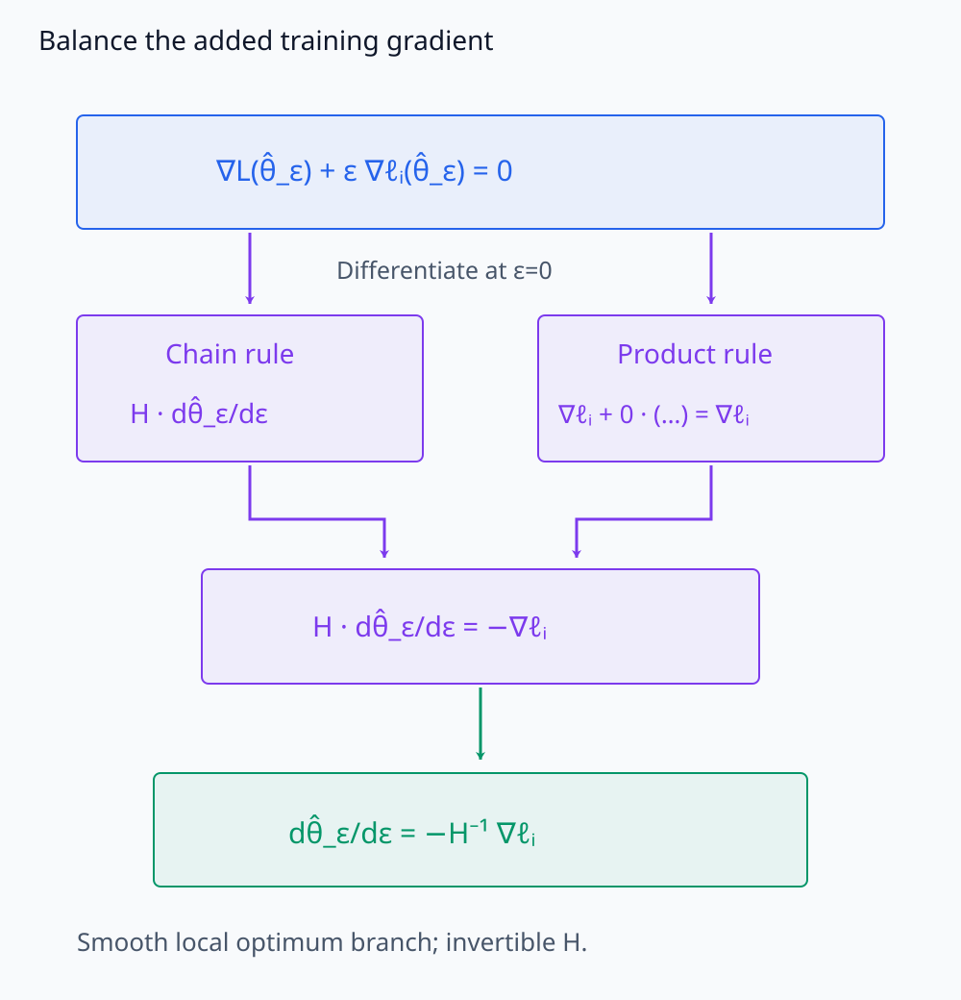
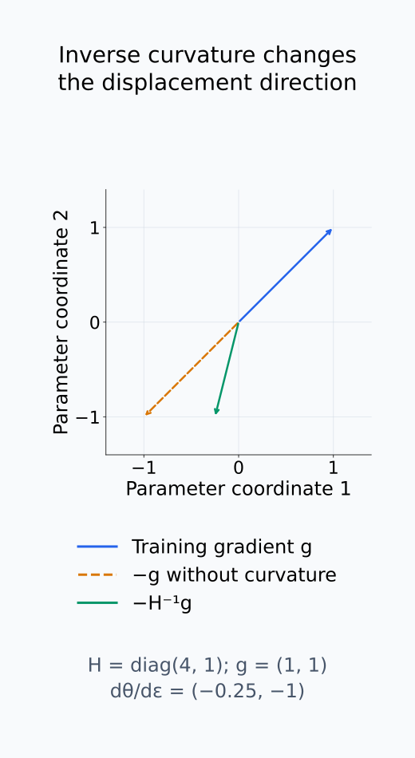
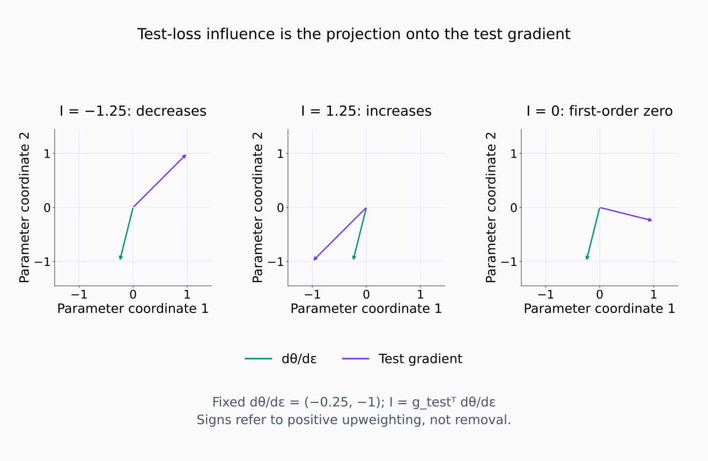
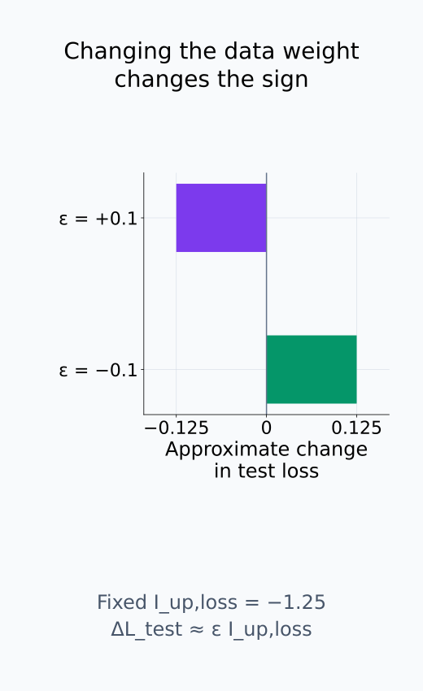
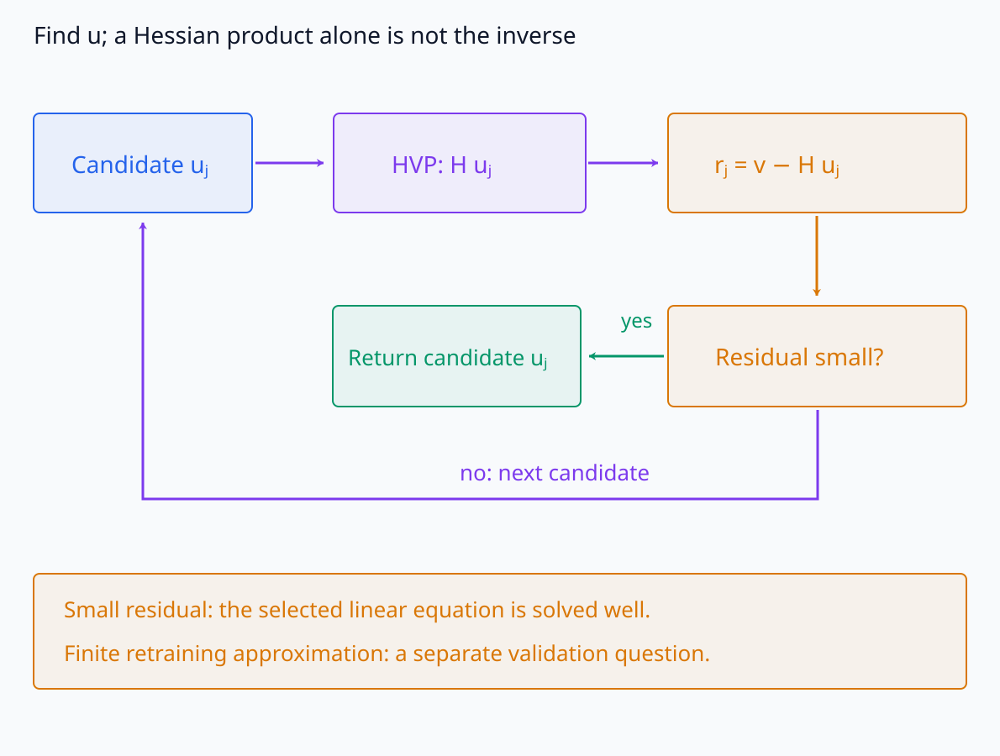
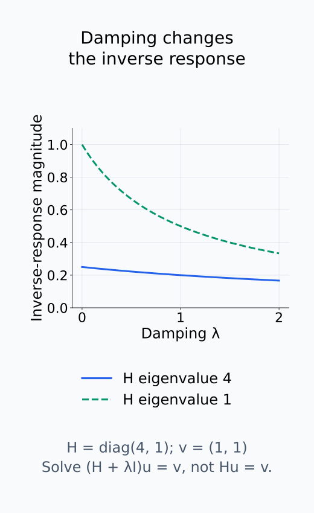
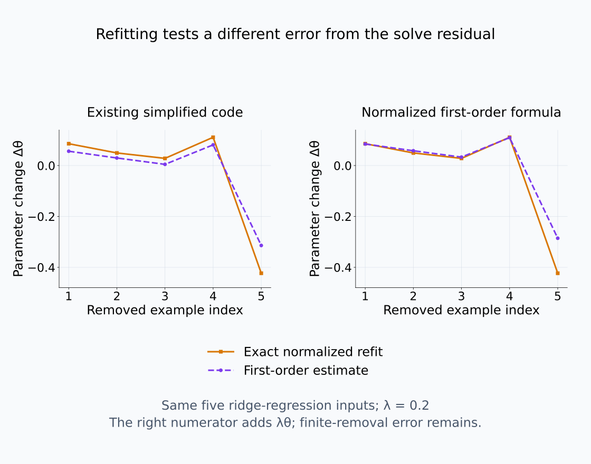

# I08-08. influence function

## 이 단원이 필요한 이유

특정 training example이 test prediction에 미친 영향을 정확히 알려면 그 example을 빼고 다시 학습하는 반사실을 비교해야 한다. influence function은 최적점 주변의 미소한 data weight 변화와 Hessian inverse를 사용해 이 retraining 효과를 근사한다. 계산이 빠른 대신 국소성·미분가능성·곡률 조건을 가진다.

## 학습 목표

- example upweighting에 대한 파라미터 변화를 유도할 수 있다.
- test loss influence 식의 부호와 항을 설명할 수 있다.
- HVP와 inverse-Hessian-vector product를 구분할 수 있다.
- 근사 결과를 leave-one-out retraining으로 검증하는 설계를 세울 수 있다.

## 선수지식 확인

- 선수 단원: [I08-07 loss landscape와 mode connectivity](I08-07-loss-landscape-mode-connectivity.md), [I08-06 Hessian spectrum](I08-06-hessian-spectrum.md), [M04-11 likelihood와 maximum likelihood](../../part-1-foundations/M04/M04-11-likelihood-maximum-likelihood.md)
- 확인 질문: $H^{-1}v$와 $Hv$는 같은 계산인가?

## 기호와 용어

| 기호·용어 | Common spoken reading | 의미 | shape·범위 |
|---|---|---|---|
| $z_i$ | `z sub i` | $i$번째 training example | sample |
| $\hat\theta_\varepsilon$ | `theta hat sub epsilon` | $z_i$를 $\varepsilon$만큼 upweight한 최적점 | $\mathbb R^p$ |
| $H_{\hat\theta}$ | `H sub theta hat` | empirical risk Hessian at optimum | $p\times p$ |
| $H^{-1}v$ | `H inverse v` | inverse-Hessian-vector product | $\mathbb R^p$ |
| leave-one-out | `leave one out` | 한 example을 제거한 retraining 비교 | counterfactual procedure |

## 1. Data weight를 미소하게 바꾼다

Empirical risk를 $L(\theta)$, 원래 최적점을 $\hat\theta$라 쓰자. 여기에 $\varepsilon\ell(z_i,\theta)$를 더한 최적점이 $\hat\theta_\varepsilon$이다. 양의 $\varepsilon$은 해당 예제의 loss 가중치를 늘린다. 이 최적점에서 gradient가 0이라는 조건은

$$
\nabla L(\hat\theta_\varepsilon)
+\varepsilon\nabla\ell(z_i,\hat\theta_\varepsilon)=0
$$

이다. 최적점이 $\varepsilon$에 따라 매끄럽게 움직이는 국소 branch에서 이 식을 미분한다. 첫 항의 chain rule은 Hessian과 최적점 변화율의 곱을 만든다. 둘째 항에서는 $\varepsilon$ 자체를 미분한 gradient가 남고, $\varepsilon$이 곱해진 다른 항은 0에서 사라진다. 따라서

$$
H_{\hat\theta}
\left.\frac{d\hat\theta_\varepsilon}{d\varepsilon}\right|_{\varepsilon=0}
+\nabla\ell(z_i,\hat\theta)=0.
$$

Hessian이 invertible이면 이 선형식을 풀어

$$
\left.\frac{d\hat\theta_\varepsilon}{d\varepsilon}\right|_{\varepsilon=0}
=-H_{\hat\theta}^{-1}\nabla_\theta\ell(z_i,\hat\theta).
$$

를 얻는다. 추가된 training gradient를 상쇄할 만큼 최적점을 움직이는 방향이다. 작은 양의 eigenvalue 방향에서는 같은 gradient 성분에도 더 큰 변위가 필요하므로 inverse curvature가 들어간다.

미분할 두 항과 inverse가 들어가는 위치를 구분한다.

<figure class="lesson-figure lesson-figure--wide" markdown="1">

<figcaption>매끄러운 국소 optimum branch에서 stationary 식을 ε로 미분한다. ε=0이면 product rule의 ε배 항은 사라지고 추가 training gradient가 남는다. 이를 상쇄하는 H dθ̂_ε/dε=−∇ℓᵢ를 풀어 inverse Hessian과 음수 부호를 얻는다.</figcaption>
</figure>

inverse curvature가 변위의 방향을 바꾸는 예시를 본다.

<figure class="lesson-figure" markdown="1">

<figcaption>H=diag(4,1), training gradient g=(1,1)인 수학적 예시다. curvature를 무시한 −g와 실제 변화율 −H⁻¹g=(−0.25,−1)은 방향이 다르다. 양의 곡률 1인 방향은 곡률 4인 방향보다 같은 gradient를 상쇄하는 변위가 크다.</figcaption>
</figure>

## 2. Test loss 영향

test example $z_{test}$의 loss 변화율은

$$
I_{\mathrm{up,loss}}(z_i,z_{test})
=-\nabla\ell(z_{test},\hat\theta)^\top
H_{\hat\theta}^{-1}\nabla\ell(z_i,\hat\theta).
$$

Test loss는 최적점 $\hat\theta_\varepsilon$를 통해 변한다. Chain rule에 따라 test gradient와 최적점 변화율의 내적을 구하면 위 식이 된다. 먼저 training gradient를 inverse Hessian으로 변환하고, test gradient와 내적해 test loss가 얼마나 변하는지 읽는다. 이 upweighting 정의에서는 양수가 test loss 증가, 음수가 감소를 뜻한다.

작은 가중치 변화의 loss 차이는 $\varepsilon I_{\mathrm{up,loss}}$로 근사한다. Regularization 없는 $n$개 loss의 단순 평균에서 예제 하나를 제거하는 것은 원래 $1/n$ 가중치를 없애는 $\varepsilon=-1/n$과 연결된다. 제거 근사의 부호는 upweighting과 반대다. 평균의 정규화와 regularization까지 바뀌는 retraining이라면 그 objective 변화도 포함해야 하므로, 제거라는 이름만으로 같은 계수를 사용하지 않는다.

같은 parameter 변화도 test gradient에 따라 다른 loss 영향을 준다.

<figure class="lesson-figure lesson-figure--wide" markdown="1">

<figcaption>같은 변화율 dθ/dε=(−0.25,−1)에 test gradient (1,1), (−1,−1), (1,−0.25)를 각각 내적하면 −1.25, 1.25, 0이 된다. 이 부호는 양의 upweighting에 따른 test loss의 일차 변화이며 마지막 경우도 고차 변화가 없다는 뜻은 아니다.</figcaption>
</figure>

upweighting의 부호를 removal에 그대로 붙이지 않는다.

<figure class="lesson-figure" markdown="1">

<figcaption>I_up,loss=−1.25를 고정해 ε를 +0.1에서 −0.1로 바꾸면 ε I의 부호가 뒤집힌다. ε=−1/n을 제거 근사로 쓰는 것은 regularization 없는 단순 평균 objective의 조건이며, normalized refit과 regularization이 달라지면 objective 변화도 함께 계산한다.</figcaption>
</figure>

## 3. 성립 조건과 검증

고전 유도는 smooth loss, invertible Hessian과 잘 정의된 국소 optimum을 사용한다. deep network에서는 Hessian이 singular·indefinite하고 training이 정확한 optimum이 아닐 수 있다. damping과 iterative solve는 계산을 가능하게 하지만 가정을 복구하는 마법이 아니다.

$H^{-1}v$를 구하는 것은 $Hu=v$를 만족하는 미지의 vector $u$를 찾는 일이다. HVP는 주어진 $u$를 $Hu$로 보내는 계산이며, inverse-Hessian solve는 이 곱을 반복 사용해 방정식의 해를 근사한다. 전체 inverse를 만들 필요는 없다. Damping을 넣어 $(H+\lambda I)u=v$를 풀었다면 원래 $Hu=v$와 다른 곡률을 사용한 것이므로 $\lambda$와 수치 잔차를 기록한다. 잔차가 작다는 것은 선택한 선형식을 잘 풀었다는 뜻이며, finite retraining 효과의 근사 오차까지 작다는 뜻은 아니다.

작은 모델에서는 실제 leave-one-out retraining 순위와 influence 순위를 비교한다. seed를 여러 개 쓰고 prediction target을 고정한다.

주어진 vector의 곱과 미지 vector를 찾는 반복 solve를 구분한다.

<figure class="lesson-figure lesson-figure--wide" markdown="1">

<figcaption>HVP는 주어진 후보 uⱼ를 H uⱼ로 보내는 연산이다. inverse solve는 이 곱을 반복 사용하여 Hu=v의 미지수 u를 찾는다. 잔차가 작아도 finite retraining 효과의 국소 근사가 정확하다는 결론은 별도 검증이 필요하다.</figcaption>
</figure>

damping의 값은 계산 안정성뿐 아니라 inverse response도 바꾼다.

<figure class="lesson-figure" markdown="1">

<figcaption>H=diag(4,1), v=(1,1)의 각 inverse response 크기는 1/(λ_i+λ)이다. damping을 추가하면 특히 낮은 곡률 방향의 변위가 달라진다. 따라서 λ를 기록하며 원래 Hu=v를 그대로 풀었다고 부르지 않는다.</figcaption>
</figure>

## 4. CPU 실습

<!-- I08_EXAMPLE: i08_08_influence_function -->

1차원 ridge regression에서 코드의 Hessian 기반 제거 근사와 실제 leave-one-out refit을 비교한다. 여기서 산출물은 test loss 변화가 아니라 scalar 파라미터 변화다. 코드의 `rank_correlation_proxy`는 `np.corrcoef`로 계산한 Pearson correlation이며 순위 상관계수를 직접 계산한 것은 아니다.

실습은 예제별 loss $(\theta x_i-y_i)^2/2$의 평균에 $\lambda\theta^2/2$를 더하고, refit할 때는 남은 $n-1$개 예제로 평균을 다시 낸다. 이 정규화 아래 원래 최적점에서의 제거 gradient 변화는 예제 gradient뿐 아니라 regularization gradient도 포함한다. 이에 대한 일차 변위는 $(\nabla\ell(z_i,\hat\theta)+\lambda\hat\theta)/[(n-1)H]$로 근사한다. 기존 코드의 근사값은 분자의 regularization 항을 생략한 단순화다. 원본 코드와 결과는 유지하되, 이를 정확한 normalized leave-one-out influence 공식의 검증으로 해석하지 않는다.

실습의 원 근사와 정규화 항을 포함한 식을 같은 refit에 비교한다.

<figure class="lesson-figure lesson-figure--wide" markdown="1">

<figcaption>기존 실습의 다섯 입력과 λ=0.2를 같은 closed form으로 계산한 parameter 변화다. 왼쪽은 원 코드의 생략된 regularization 분자, 오른쪽은 본문의 정규화에 맞춰 λθ를 더한 일차식이다. 오른쪽에서도 finite removal의 근사 오차가 남는다. 원 실습 코드·산출물은 수정하지 않았고 이것은 test loss나 rank correlation의 그림이 아니다.</figcaption>
</figure>

## 흔한 오해

### 오해 1. influence는 training example의 인과효과를 정확히 준다

근사는 특정 최적점 주변의 작은 weight 변화에 대한 것이다. finite removal과 전체 retraining 경로는 다를 수 있다.

### 오해 2. 큰 값은 example 내용 때문만이다

중복, gradient norm, curvature, target과 model state가 함께 값을 결정한다.

## 연습문제

### 1. shape

$\theta\in\mathbb R^p$일 때 $H^{-1}\nabla\ell_i$의 shape은 무엇인가?

해설 보기

$H^{-1}$는 $p\times p$, gradient는 길이 $p$이므로 결과는 $\mathbb R^p$이다.

### 2. 곡률

같은 gradient 방향에서 Hessian eigenvalue가 작으면 inverse-Hessian 변위는 어떻게 되는가?

해설 보기

역수가 커지므로 damping이 없다면 그 방향의 추정 변위가 커진다.

### 3. singular Hessian

Hessian이 singular하면 직접 inverse를 쓸 수 없는 이유는 무엇인가?

해설 보기

0 eigenvalue가 있어 inverse가 존재하지 않는다. damping이나 pseudo-inverse를 쓰면 estimand가 달라짐을 기록해야 한다.

### 4. 부호

loss influence의 부호를 보고 helpful 여부를 판단하기 전에 무엇을 확인해야 하는가?

해설 보기

upweighting·removal 정의, loss인지 score인지, 구현의 음수 부호 convention을 확인한다.

### 5. 검증

작은 데이터셋에서 가장 직접적인 ground-truth 근사 검사는 무엇인가?

해설 보기

각 example을 실제로 제거하고 같은 protocol로 재학습해 test target 변화를 비교한다.

### 6. 주장 비판

“influence 상위 문장에 model knowledge가 저장돼 있다”를 비판하라.

해설 보기

높은 국소 gradient 정렬이 지식의 유일한 저장 위치를 뜻하지 않는다. 중복 데이터와 학습 경로, 근사 오차를 함께 조사해야 한다.

## 근거와 갱신 경계

deep model prediction을 training data로 추적하는 influence 근사는 [Koh and Liang (2017)](https://proceedings.mlr.press/v70/koh17a.html)을 기준으로 한다. 논문도 비볼록·비미분 조건에서 이론이 깨질 수 있음을 구분하므로, 이 단원은 근사값을 retraining truth로 부르지 않는다.

## 단원 요약

- influence function은 data weight의 미소 변화에 대한 국소 근사이다.
- training gradient, inverse Hessian과 test gradient가 함께 들어간다.
- deep network에서는 damping·수치해와 이론 조건을 따로 기록한다.
- 가능한 범위에서 leave-one-out retraining으로 검증한다.

## 통과 기준

- influence 식의 각 항과 shape을 설명할 수 있는가?
- HVP와 inverse-Hessian solve를 구분할 수 있는가?
- 근사 검증 실험을 설계할 수 있는가?

## 다음 단원

- [I08-09 feature emergence](I08-09-feature-emergence.md)

## 집필자 점검표

- [x] 국소 근사의 조건을 명시했다.
- [x] retraining counterfactual과 구분했다.
- [x] 모든 문제에 해설이 있다.
- [x] Common spoken reading이 실제 영어 학술 발화이며 한글 음역이나 기계적 직역을 포함하지 않는다.
- [x] 주장 강도와 읽기 표기를 확인했다.
- [x] 내부 링크와 수식을 확인했다.
