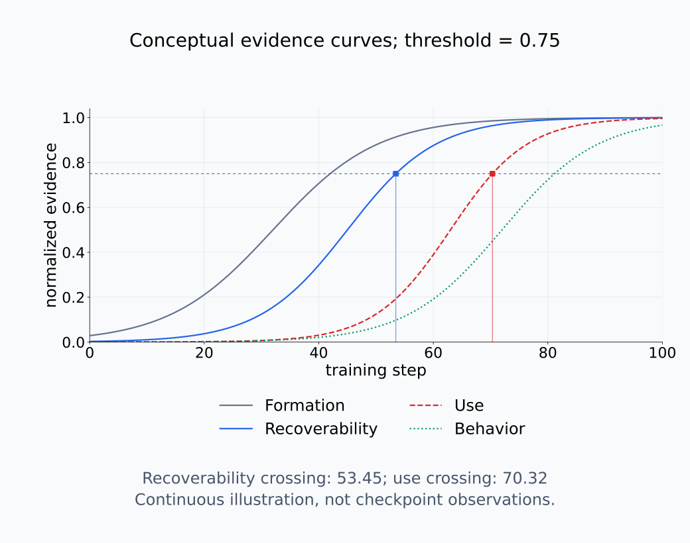
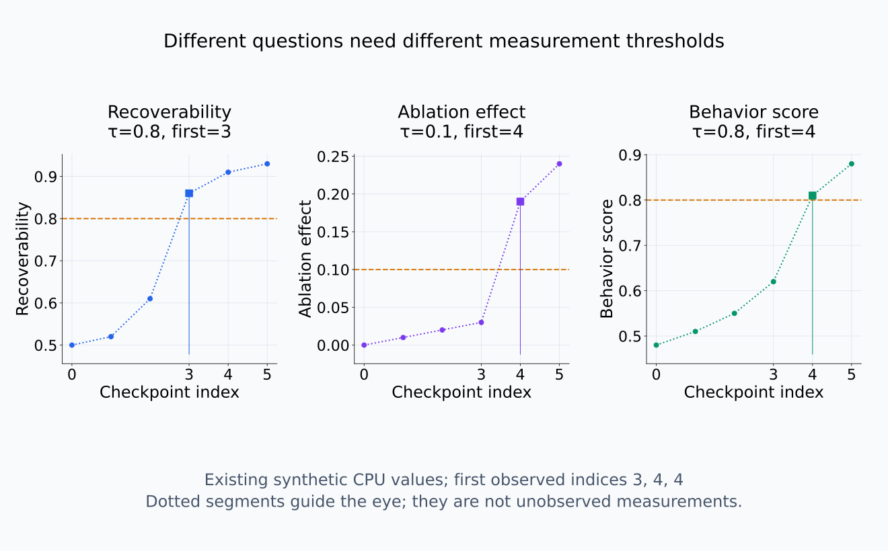
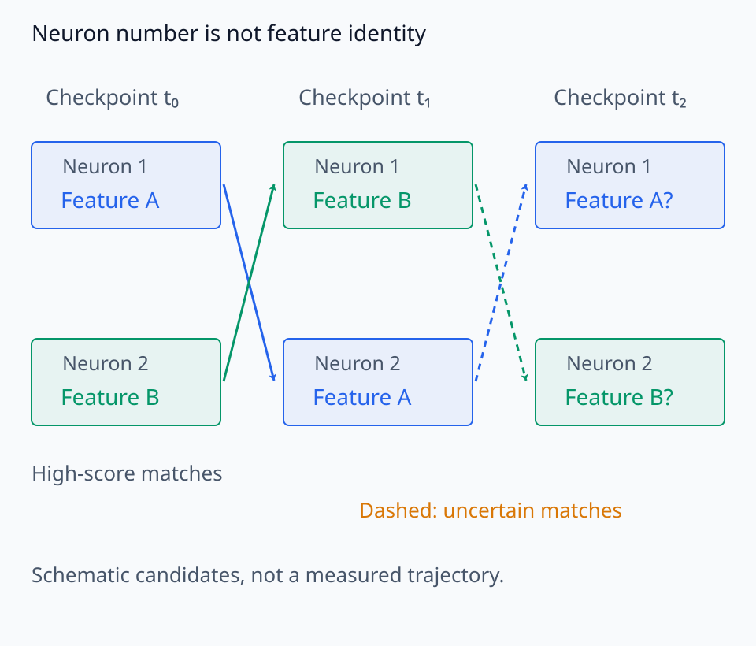
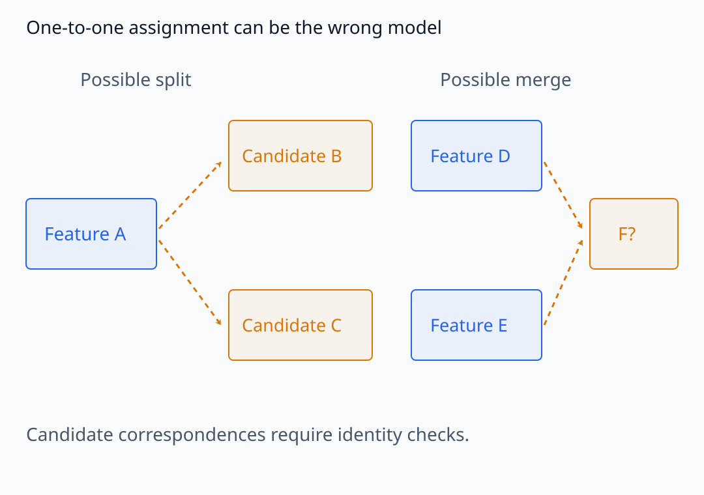
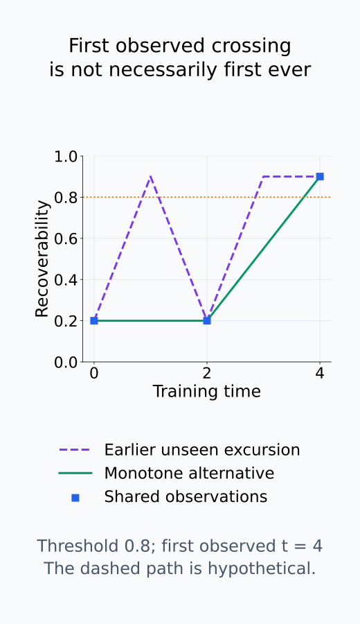
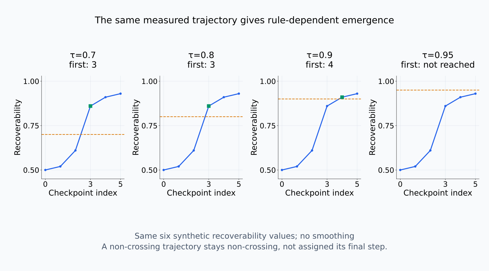
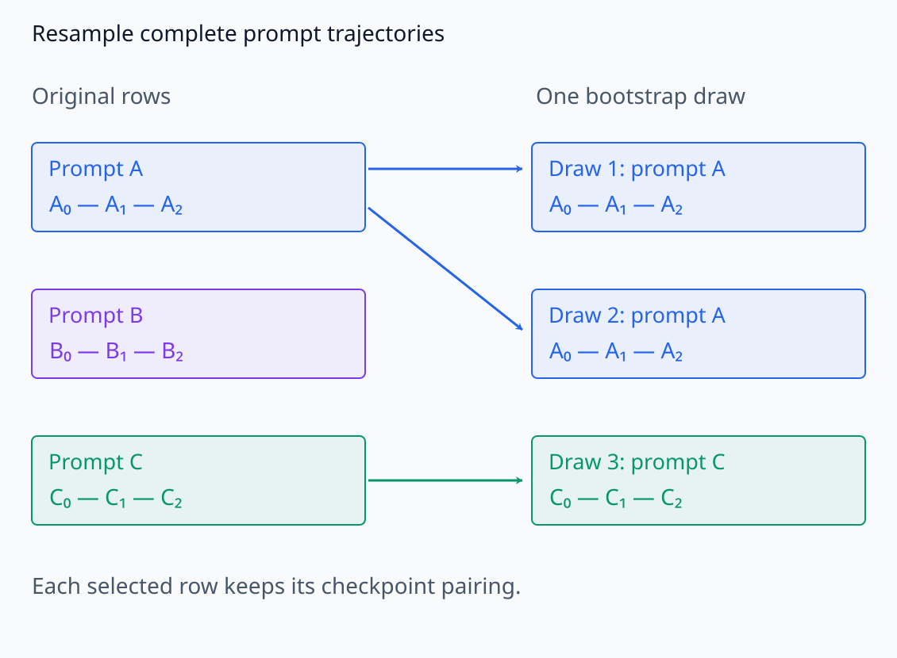

# I08-09. feature emergence

## 이 단원이 필요한 이유

feature가 “나타났다”는 말에는 여러 사건이 섞인다. activation geometry에서 방향이 생기는 시점, label을 복원할 수 있는 시점, 모델이 그 방향을 기능적으로 사용하는 시점과 행동 성능이 바뀌는 시점은 같지 않을 수 있다. 시간축 분석은 이 네 주장을 분리해야 한다.

## 학습 목표

- formation·recoverability·use·behavior를 별도 지표로 정의할 수 있다.
- checkpoint 사이 feature matching의 조건을 설명할 수 있다.
- threshold crossing과 uncertainty를 함께 보고할 수 있다.
- sparse 관측으로 순간적인 emergence를 단정하지 않을 수 있다.

## 선수지식 확인

- 선수 단원: [I08-08 influence function](I08-08-influence-function.md), [I08-03 representation alignment](I08-03-representation-alignment.md), [I07-12 necessity와 sufficiency](../I07/I07-12-necessity-sufficiency.md)
- 확인 질문: probe가 label을 복원한다는 결과가 모델의 정보 사용을 뜻하지 않는 이유는 무엇인가?

## 기호와 용어

| 기호·용어 | Common spoken reading | 의미 | shape·범위 |
|---|---|---|---|
| $F_t$ | `F sub t` | checkpoint $t$의 feature formation 지표 | scalar |
| $R_t$ | `R sub t` | held-out recoverability | $[0,1]$ 또는 score |
| $U_t$ | `U sub t` | intervention으로 잰 사용 효과 | signed scalar |
| $B_t$ | `B sub t` | 외부 행동 지표 | task-dependent |
| $\tau_R$ | `tau sub R` | recoverability threshold | scalar |

## 1. 네 사건을 분리한다

한 feature의 시간축 표를 다음처럼 설계한다.

| 질문 | 가능한 측정 | 허용되는 주장 |
|---|---|---|
| 형성됐는가 | variance, cluster separation, matched direction stability | 내부 구조가 관찰됐다 |
| 복원되는가 | held-out probe·decoder score | 정보가 읽힌다 |
| 사용되는가 | ablation·patching effect와 control | 정의한 행동에 기능적으로 관여한다 |
| 행동이 바뀌는가 | task accuracy, logit margin, calibration | 외부 metric이 변했다 |

한 열의 상승을 다른 열의 상승으로 대체하지 않는다.

<figure class="lesson-figure lesson-figure--wide" markdown="1">

<figcaption>같은 후보 feature에서도 구조 형성, probe 복원, 개입 효과와 행동 변화가 서로 다른 checkpoint에서 관찰될 수 있다.</figcaption>
</figure>

그림의 네 곡선은 보편적인 발생 순서를 주장하는 실제 측정값이 아니라, 서로 다른 측정이 같은 시점에 임계값을 넘을 필요가 없음을 보이는 개념도다. formation 지표가 먼저 변해도 probe가 그 구조를 안정적으로 읽는 데 더 많은 학습이 필요할 수 있다. recoverability가 높아진 뒤에도 모델 행동에 사용된다는 개입 증거는 늦게 나타나거나 끝내 관찰되지 않을 수 있다.

각 열에는 별도의 측정 오차와 대조군이 있다. formation에는 null geometry, recoverability에는 label permutation과 held-out 평가, use에는 random 또는 norm-matched intervention, behavior에는 task baseline이 필요하다. 네 score를 한 축에 정규화해 그린 그림은 시점을 비교하기 위한 요약이지 서로 다른 단위의 절댓값을 직접 비교한다는 뜻이 아니다.

서로 다른 지표의 관찰 crossing을 각자의 축에서 비교한다.

<figure class="lesson-figure lesson-figure--wide" markdown="1">

<figcaption>기존 CPU synthetic 값은 R의 threshold 0.8을 index 3에서, ablation effect의 threshold 0.1과 behavior의 threshold 0.8을 index 4에서 처음 넘는다. 지표마다 별도 축과 기준을 사용한다. 점 사이의 dotted 선은 눈을 돕는 연결이며 측정하지 않은 checkpoint의 실제 값이 아니다.</figcaption>
</figure>

## 2. 같은 feature를 추적하는 문제

좌표별 neuron ID는 checkpoint 사이 의미를 보장하지 않는다. activation profile, direction cosine, decoder vector와 maximal examples를 이용해 matching하고, one-to-one assignment 여부와 matching score를 기록한다. 낮은 score에서는 “같은 feature” 대신 “가장 가까운 후보”라고 쓴다.

matching은 먼저 어느 공간을 비교할지 고정해야 한다. 두 checkpoint의 neuron basis가 permutation이나 rotation으로 달라질 수 있다면 좌표를 직접 비교하지 않고 representation alignment를 적용한 뒤 방향을 맞춘다. 한 checkpoint의 feature가 다음 checkpoint에서 둘로 갈라지거나 여러 feature가 합쳐지는 경우에는 one-to-one assignment 자체가 부적절할 수 있다.

따라서 feature trajectory에는 score만 아니라 identity uncertainty도 함께 기록한다. 낮은 matching score 구간에서 보이는 급격한 score 변화는 실제 feature 변화가 아니라 다른 후보로 연결한 결과일 수 있다.

feature의 대응을 neuron 번호와 분리해서 따라간다.

<figure class="lesson-figure lesson-figure--wide" markdown="1">

<figcaption>neuron 번호가 그대로여도 후보 feature의 대응은 바뀔 수 있다는 schematic이다. 실선은 높은 score로 선택한 대응, 점선과 물음표는 identity가 불확실한 대응을 나타낸다. 실제 측정값이나 확정된 feature trajectory가 아니며 같은 공간으로 정렬한 뒤 matching 근거를 기록해야 한다.</figcaption>
</figure>

하나씩 짝짓기 어려운 대응 구조를 확인한다.

<figure class="lesson-figure lesson-figure--wide" markdown="1">

<figcaption>다음 checkpoint의 두 후보로 대응되거나 여러 후보가 하나로 대응되는 경우를 나눠 그렸다. 점선은 확인할 후보 관계이며 실제 feature의 분할·합병을 입증하지 않는다. 이런 경우에는 one-to-one matching 가정부터 점검해야 한다.</figcaption>
</figure>

## 3. Emergence time은 규칙에 의존한다

예를 들어

$$
t_R=\min\{t\in C:R_t\ge\tau_R\}
$$

로 recoverability emergence를 정의할 수 있다. $C$는 관찰한 checkpoint 집합이므로 이는 관찰값 중 처음 기준을 넘은 시점이다. 한 번도 넘지 않았다면 이 집합은 비어 있어 $t_R$을 정의할 수 없다. 마지막 checkpoint를 emergence time으로 대신 넣지 않고 관찰 구간에서 기준에 도달하지 않았다고 기록한다. Threshold, smoothing과 checkpoint grid를 바꾸면 $t_R$도 바뀐다. bootstrap interval이나 여러 seed의 crossing 분포를 함께 본다.

연속한 관측 checkpoint가 $t_1<t_2$이고 $R_{t_1}<\tau_R\le R_{t_2}$라면 이 구간에서 기준 아래의 관찰값이 기준 이상의 값으로 바뀌었다. $t_2$가 관찰상 첫 crossing이려면 이전에 관찰한 값들도 기준 아래여야 한다. 그래도 전체 학습 중 최초 도달이 반드시 $(t_1,t_2]$에 있다는 보장은 없다. 측정하지 않은 앞 구간에서 잠깐 넘었다가 내려왔을 수 있기 때문이다. 지표가 단조롭게 증가한다는 추가 조건에서는 이 구간으로 최초 도달을 좁힐 수 있다. `step $t_2$에서 갑자기 생겼다`고 쓰려면 더 촘촘한 관찰로 변화 폭과 지속성을 확인해야 한다.

Bootstrap으로 crossing의 불확실성을 구할 때는 같은 prompt의 여러 checkpoint 측정을 함께 재표집한다. 그래야 시간에 따른 대응을 보존한 새 궤적에서 crossing을 계산할 수 있다. 반복 중 기준을 넘지 않은 궤적도 남겨야 하며, 넘은 반복만 골라 평균 시점을 내면 빠른 도달 사례에 치우칠 수 있다.

threshold를 분석 결과를 본 뒤 유리하게 고르면 emergence time이 선택 편향을 갖는다. threshold와 smoothing 규칙은 분석 전에 정하거나, 여러 합리적인 설정에서 결론이 얼마나 달라지는지 sensitivity analysis로 보고한다.

관찰상 첫 crossing과 전체 학습 중 최초 도달을 구분한다.

<figure class="lesson-figure" markdown="1">

<figcaption>같은 t=0,2,4의 관찰값을 공유하는 두 수학적 경로다. 점선처럼 이전 미측정 구간에서 잠깐 threshold를 넘었을 가능성을 관찰점만으로 배제할 수 없다. 단조 증가라는 추가 조건이 있어야 t=2와 4 사이로 최초 도달을 좁힐 수 있다.</figcaption>
</figure>

같은 값에서도 threshold 규칙을 바꾸면 시점이 달라진다.

<figure class="lesson-figure lesson-figure--wide" markdown="1">

<figcaption>기존 CPU R 배열에 threshold만 바꾼 비교다. 0.7과 0.8은 index 3, 0.9는 index 4이며 0.95에는 도달하지 않는다. 마지막 index를 미도달 사례의 crossing으로 대체하지 않고 설정별 sensitivity를 보고한다.</figcaption>
</figure>

bootstrap에서 함께 다시 뽑아야 하는 단위를 확인한다.

<figure class="lesson-figure lesson-figure--wide" markdown="1">

<figcaption>한 bootstrap draw가 prompt A,A,C를 골랐다는 schematic이다. 각 prompt의 checkpoint 측정을 함께 가져와 새 trajectory를 만든다. 시간마다 서로 다른 prompt를 따로 뽑는 방법과 다르며, 새 trajectory의 미도달 사례도 버리지 않는다.</figcaption>
</figure>

## 4. CPU 실습

<!-- I08_EXAMPLE: i08_09_feature_emergence -->

synthetic trajectory에서 recoverability는 checkpoint 3, intervention use와 행동은 checkpoint 4에 threshold를 넘는다. 같은 feature의 여러 증거가 다른 시점에 나타날 수 있음을 보인다.

## 흔한 오해

### 오해 1. probe accuracy가 chance를 넘은 순간 feature가 탄생했다

probe capacity, 표본 크기와 threshold에 의존한다. 약한 구조가 이전부터 있었을 수도 있다.

### 오해 2. 한 seed의 급상승이 보편적 phase transition이다

다른 seed와 더 촘촘한 checkpoint에서 위치와 폭을 확인해야 한다.

## 연습문제

### 1. 주장 분류

held-out linear probe accuracy가 0.9이다. 네 열 중 어느 증거인가?

해설 보기

recoverability 증거이다. 사용이나 행동 변화는 별도로 재야 한다.

### 2. 사용 증거

feature 방향 ablation이 target logit을 낮추고 random-direction control은 거의 변하지 않았다. 어떤 열의 증거인가?

해설 보기

정의한 개입과 행동에 대한 use 증거이다. off-manifold 여부와 반복 단위도 확인한다.

### 3. threshold

$R=(0.5,0.7,0.85)$이고 $\tau_R=0.8$이면 첫 crossing index는 얼마인가?

해설 보기

0-based index 2이다. 실제 step을 보고할 때는 해당 checkpoint step으로 바꾼다.

### 4. matching

checkpoint마다 neuron 번호가 같은 것만으로 feature identity를 주장할 수 없는 이유는 무엇인가?

해설 보기

unit의 기능과 activation profile이 학습 중 바뀔 수 있으며 permutation·superposition도 있기 때문이다.

### 5. 시간 해상도

step 10000과 50000 사이에서 score가 상승했다. emergence step을 50000이라고 단정할 수 있는가?

해설 보기

관측상 첫 crossing일 뿐 실제 변화는 두 checkpoint 사이 어느 때든 일어났을 수 있다.

### 6. 종합 해석

recoverability는 높지만 ablation effect가 0에 가깝다. 가장 보수적인 결론은 무엇인가?

해설 보기

정보는 지정 probe로 복원되지만 정의한 개입과 행동에서는 사용 증거가 관찰되지 않았다고 쓴다.

## 근거와 갱신 경계

Pythia가 checkpoint를 이용한 학습 동역학 연구를 가능하게 한 설계는 [Biderman et al. (2023)](https://proceedings.mlr.press/v202/biderman23a.html)을 기준으로 한다. feature emergence의 보편적 순서를 가정하지 않으며, 실제 feature identity는 측정법마다 다시 검증해야 한다.

## 단원 요약

- formation, recoverability, use와 behavior는 다른 사건이다.
- feature matching에는 좌표 ID보다 activation·direction 근거가 필요하다.
- emergence time은 threshold와 checkpoint grid에 의존한다.
- 여러 seed와 개입 control 없이 급격한 탄생을 단정하지 않는다.

## 통과 기준

- 네 종류의 증거를 별도 열로 설계할 수 있는가?
- feature matching 불확실성을 보고할 수 있는가?
- threshold crossing의 시간 해상도 한계를 설명할 수 있는가?

## 다음 단원

- [I08-10 grokking과 phase transition](I08-10-grokking-phase-transition.md)

## 집필자 점검표

- [x] feature의 네 사건을 구분했다.
- [x] matching과 threshold 의존성을 명시했다.
- [x] 모든 문제에 해설이 있다.
- [x] Common spoken reading이 실제 영어 학술 발화이며 한글 음역이나 기계적 직역을 포함하지 않는다.
- [x] 주장 강도와 읽기 표기를 확인했다.
- [x] 내부 링크와 수식을 확인했다.
