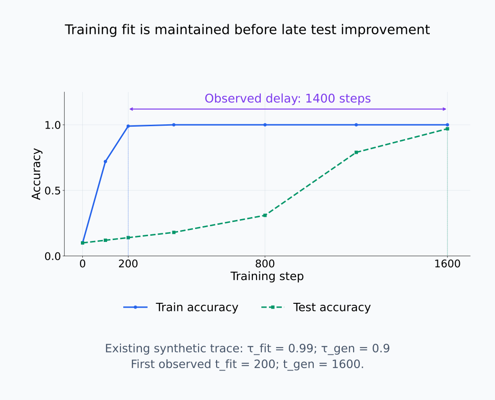
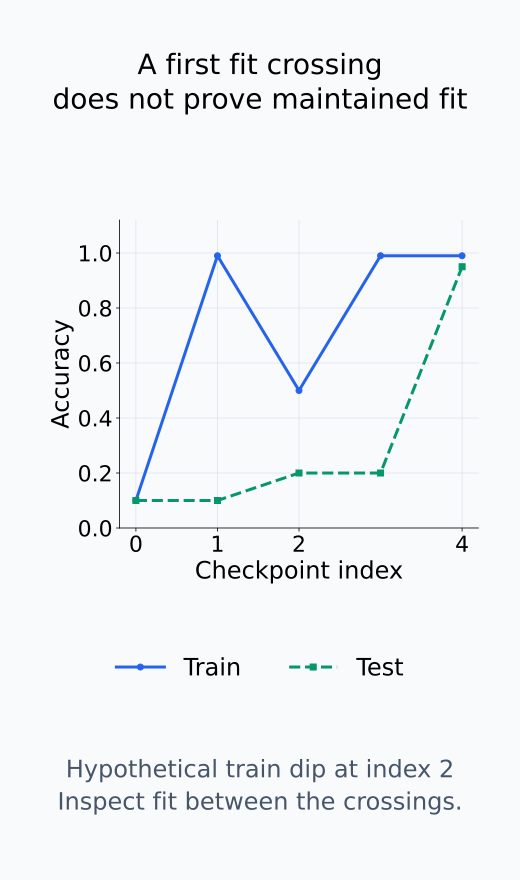
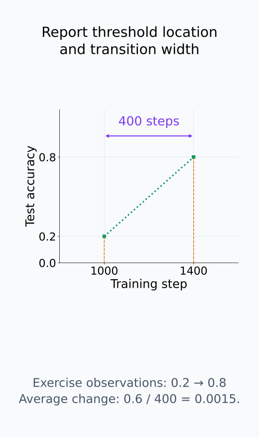
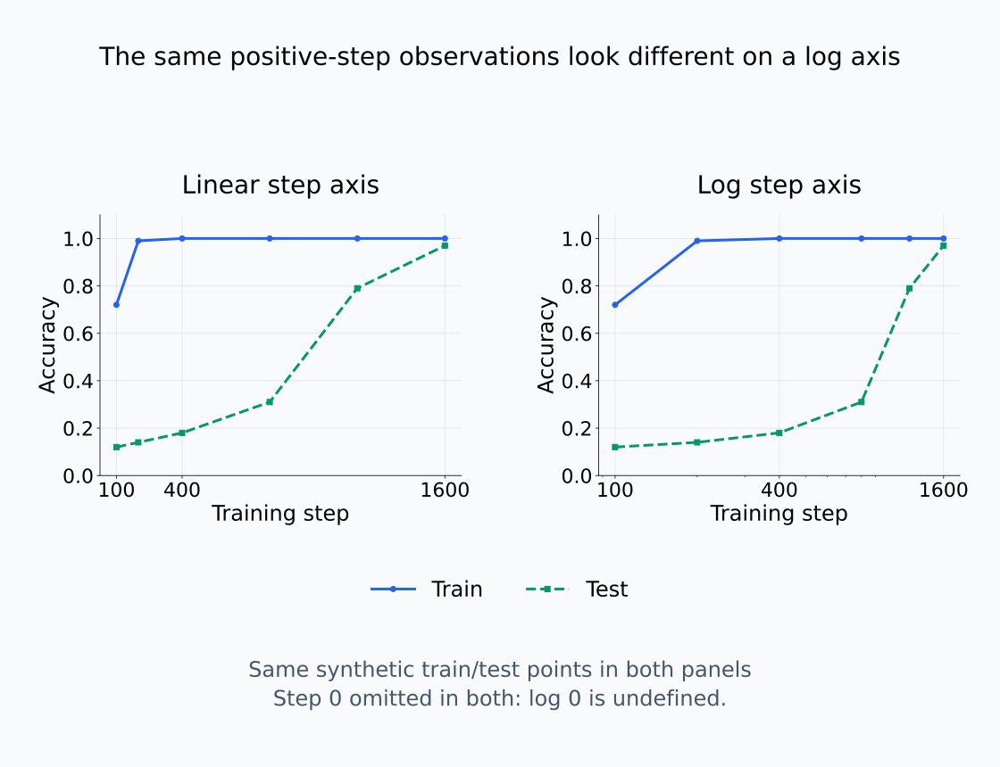
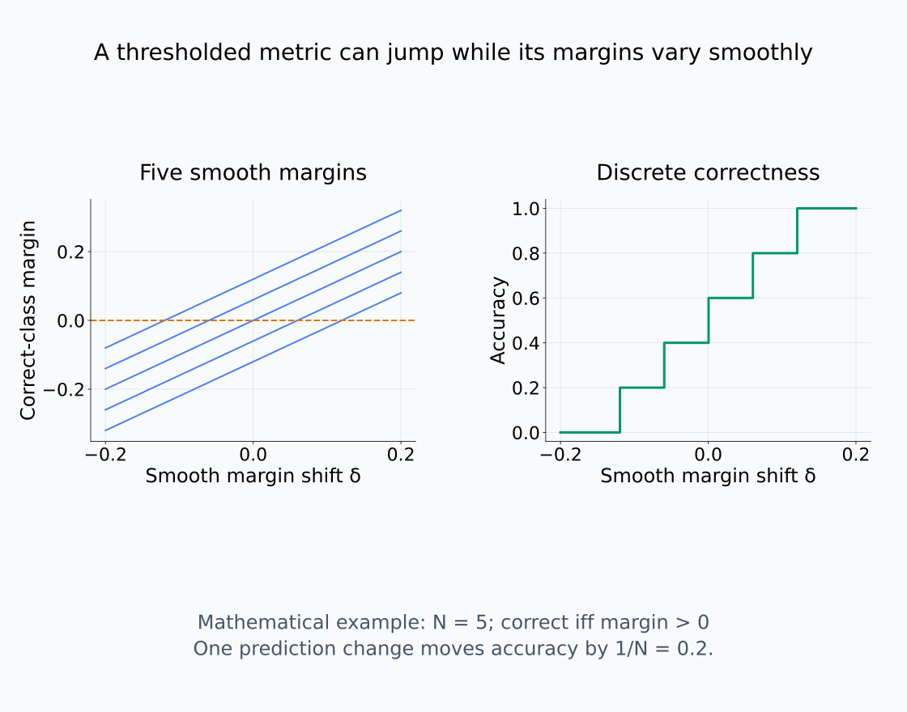

# I08-10. grokking과 phase transition

## 이 단원이 필요한 이유

grokking은 training 성능이 이미 포화된 뒤 test 성능이 늦게 상승하는 현상으로 보고됐다. 그러나 sparse evaluation, threshold와 축 선택은 완만한 변화를 갑작스러워 보이게 할 수 있다. “phase transition”이라는 표현을 쓰려면 관측 곡선, transition 폭과 대안 설명을 분리해야 한다.

## 학습 목표

- delayed generalization을 train·test curve로 정의할 수 있다.
- transition 위치와 폭을 측정할 수 있다.
- checkpoint 간격이 apparent abruptness에 미치는 영향을 설명할 수 있다.
- 한 toy task의 grokking을 일반 모델의 보편 법칙으로 확대하지 않을 수 있다.

## 선수지식 확인

- 선수 단원: [I08-09 feature emergence](I08-09-feature-emergence.md), [M04-03 확률변수와 분포](../../part-1-foundations/M04/M04-03-random-variables-distributions.md)
- 확인 질문: 두 측정점 사이의 곡선 모양을 두 점만으로 결정할 수 있는가?

## 기호와 용어

| 기호·용어 | Common spoken reading | 의미 | shape·범위 |
|---|---|---|---|
| $A_{train}(t)$ | `A train of t` | step $t$의 training accuracy | $[0,1]$ |
| $A_{test}(t)$ | `A test of t` | step $t$의 test accuracy | $[0,1]$ |
| $t_{fit}$ | `t fit` | training criterion을 처음 넘는 step | nonnegative integer |
| $t_{gen}$ | `t gen` | generalization criterion을 처음 넘는 step | nonnegative integer |
| transition width | `transition width` | 낮은 threshold에서 높은 threshold까지의 step 차이 | nonnegative scalar |

## 1. Delayed generalization

threshold $\tau_{fit},\tau_{gen}$을 정하고

$$
t_{fit}=\min\{t\in C:A_{train}(t)\ge\tau_{fit}\},\qquad
t_{gen}=\min\{t\in C:A_{test}(t)\ge\tau_{gen}\}
$$

로 정의한다. $t_{gen}\gg t_{fit}$이면 training fit 뒤 generalization이 지연됐다고 기술할 수 있다. threshold는 사전에 정하거나 sensitivity analysis를 한다.

$C$는 평가한 checkpoint 집합이고 두 시점은 각각의 accuracy가 기준에 처음 도달한 관찰 step이다. 어느 곡선이 기준에 도달하지 않으면 해당 시점과 둘의 차이는 정의할 수 없다. 두 시점의 차이를 delay로 보고하되, 그 사이에도 training 성능이 높은 상태를 유지하는지 함께 확인한다. 한 번 기준을 넘었다가 다시 떨어진 곡선의 두 첫 도달값만으로 training fit 이후의 지연된 일반화를 판정하지 않는다.

CPU 실습에서는 training accuracy가 step 200에서 0.99에 도달하고 이후 높은 값을 유지한다. Test accuracy는 step 1,600에서 0.9에 처음 도달하므로 관찰 delay는 $1600-200=1400$ step이다. 이 차이는 정한 기준과 관찰 grid에 대한 값이며, 미관찰 시점의 정확한 도달 시간을 나타내지 않는다.

train과 test의 관찰 시점 사이에서 무엇이 유지되는지 본다.

<figure class="lesson-figure lesson-figure--wide" markdown="1">

<figcaption>기존 synthetic CPU 값에서 train은 step 200에 0.99에 도달한 뒤 높은 상태를 유지한다. test는 0.9 기준을 step 1600에서 처음 넘으므로 관찰 delay는 1400 step이다. 이 그림은 정한 grid·기준의 결과이며 미관측 최초 도달의 정확한 시간이 아니다.</figcaption>
</figure>

첫 crossing만으로 부족한 경우를 따로 비교한다.

<figure class="lesson-figure" markdown="1">

<figcaption>train이 먼저 0.99를 넘었어도 중간에 0.5로 내려가는 수학적 반례다. CPU trace의 새 결과가 아니라 첫 crossing 두 개만으로 높은 train 성능이 계속 유지됐다고 판단할 수 없음을 보이는 예시다.</figcaption>
</figure>

## 2. 급격함을 측정한다

test accuracy가 0.2에서 0.8로 오르는 step 폭, local slope와 sigmoid fit 등을 사용할 수 있다. checkpoint 간격이 transition 폭보다 넓으면 실제 급격함을 식별할 수 없다.

낮은 기준과 높은 기준을 넘은 두 관찰 시점의 차이가 threshold 기반 폭이다. 그 사이 평균 기울기는 accuracy 차이를 step 차이로 나눈 값이다. 큰 변화량과 짧은 전환 폭은 별도 정보이므로 함께 보고한다. 또한 고정된 $N$개 test 문항의 accuracy는 정답 하나가 바뀔 때 $1/N$만큼 이동한다. 출력 margin의 작은 변화가 여러 문항의 정오를 동시에 바꾸면 accuracy가 급격히 움직일 수 있다. Loss나 margin의 변화와 함께 보아야 metric의 판정 경계를 내부 구조의 불연속으로 오해하지 않는다.

linear 축과 log step 축은 같은 데이터를 다르게 보이게 한다. raw step 표와 평가 빈도를 함께 제공한다.

지표를 미분 가능한 연속 곡선 $A(t)$로 근사하고 양의 $t$에서 가로 좌표를 $\log t$로 바꾸면, chain rule에 따라 $dA/d(\log t)=t\,dA/dt$이다. 같은 step당 변화율도 후반부의 log 축에서는 더 가파르게 보일 수 있다. 이는 곡선 근사의 좌표 변환이며, 이산 accuracy 관찰값 자체의 미분을 뜻하지 않는다. Step 0의 로그는 정의되지 않으므로 생략하거나 다른 변환을 사용했다면 그 규칙도 기록한다.

큰 변화량과 짧은 전환 폭을 같은 말로 쓰지 않는다.

<figure class="lesson-figure" markdown="1">

<figcaption>기존 문제의 0.2와 0.8 관찰 시점 차이는 400 step이고, 평균 변화율은 0.6/400=0.0015다. dotted 선은 두 점을 설명용으로 이은 것이며 실제 중간 궤적이나 정확한 연속 crossing을 측정했다는 뜻은 아니다.</figcaption>
</figure>

축만 바꿨을 때 같은 데이터가 어떻게 보이는지 비교한다.

<figure class="lesson-figure lesson-figure--wide" markdown="1">

<figcaption>같은 양의 step 관찰값만 사용해 선형 축과 log 축을 비교한다. log 축은 가로 거리와 시각적 기울기를 바꾸지만 값이나 raw step을 바꾸지 않는다. log 0은 정의되지 않아 양쪽에서 step 0을 생략했으며 이산 accuracy 자체를 미분한 그림이 아니다.</figcaption>
</figure>

연속 margin과 이산 정확도의 관계를 확인한다.

<figure class="lesson-figure lesson-figure--wide" markdown="1">

<figcaption>정답 margin이 양수일 때 정답으로 세는 수학적 N=5 예시다. 각 margin은 연속적으로 변해도 정오 판정이 바뀔 때 accuracy는 1/5씩 움직인다. metric의 급상승만으로 내부 구조의 불연속이나 이론적 phase transition을 증명하지 않는다.</figcaption>
</figure>

## 3. Phase transition이라는 말의 범위

물리학의 phase transition은 system size limit과 order parameter 같은 엄밀한 구조를 가진다. 기계학습 논문에서는 급격한 경험적 변화라는 느슨한 뜻으로도 쓴다. 이 교재에서는 “관측 지표의 급격한 전환”과 “이론적 phase transition”을 구분한다.

## 4. CPU 실습

<!-- I08_EXAMPLE: i08_10_grokking_transition -->

Synthetic trace에서 training accuracy는 step 200에 0.99에 도달하고 test accuracy는 step 1600에 0.9를 넘는다. 1400-step 지연은 정의한 threshold와 grid에 대한 결과이다.

## 흔한 오해

### 오해 1. test curve가 늦게 오르면 내부 알고리즘이 갑자기 생겼다

행동 curve만으로 내부 mechanism을 알 수 없다. representation과 intervention 지표를 함께 추적해야 한다.

### 오해 2. 한 seed의 곡선이면 현상이 확정된다

transition 위치와 발생 여부가 initialization, data split과 regularization에 의존할 수 있다.

## 연습문제

### 1. 지연 계산

$t_{fit}=500$, $t_{gen}=4500$이면 delay는 얼마인가?

해설 보기

$4500-500=4000$ step이다.

### 2. transition 폭

test accuracy가 step 1000에 0.2, step 1400에 0.8을 넘었다. threshold 기반 폭은 얼마인가?

해설 보기

400 step이다. 실제 crossing은 관측 간격 안에 있으므로 이 값도 grid 근사이다.

### 3. log axis

log step 축을 사용할 때 raw step도 제공해야 하는 이유는 무엇인가?

해설 보기

시각적 거리가 변형되므로 독자가 실제 학습 예산과 transition 간격을 확인할 수 있어야 한다.

### 4. 내부 증거

grokking 시점의 mechanism 변화를 조사하려면 어떤 추가 측정을 할 수 있는가?

해설 보기

고정 probe, representation alignment, feature activation과 ablation effect를 checkpoint마다 함께 잰다.

### 5. 재현성

transition이 5개 seed 중 2개에서만 나타났다. 무엇을 보고해야 하는가?

해설 보기

발생 비율, 각 seed의 곡선과 transition 위치 분포를 모두 보고한다. 평균 곡선만으로 숨기지 않는다.

### 6. 주장 비판

“정확도가 두 checkpoint 사이에 0.2에서 0.9로 올라 phase transition이 증명됐다”를 비판하라.

해설 보기

중간 관측이 없어 전환 폭을 알 수 없고 이론적 phase transition 조건도 제시되지 않았다. 관측상 큰 변화라고만 말할 수 있다.

## 근거와 갱신 경계

작은 알고리즘 데이터에서 delayed generalization을 보고한 원 연구는 [Power et al. (2022)](https://arxiv.org/abs/2201.02177)이다. task·dataset size·regularization에 따라 현상이 달라질 수 있으므로 일반 언어모델의 필수 단계로 취급하지 않는다.

## 단원 요약

- grokking은 training fit 뒤 지연된 test generalization으로 측정할 수 있다.
- transition 위치와 폭은 threshold와 grid에 의존한다.
- 행동 급상승은 내부 mechanism 급변의 직접 증거가 아니다.
- 여러 seed와 더 촘촘한 관측으로 재현성을 평가한다.

## 통과 기준

- delayed generalization과 transition 폭을 계산할 수 있는가?
- sparse checkpoint의 한계를 지적할 수 있는가?
- 경험적 전환과 이론적 phase transition을 구분할 수 있는가?

## 다음 단원

- [I08-11 seed와 데이터 순서](I08-11-seed-data-order.md)

## 집필자 점검표

- [x] grokking의 측정 정의를 제시했다.
- [x] 급격함과 phase transition 주장을 제한했다.
- [x] 모든 문제에 해설이 있다.
- [x] Common spoken reading이 실제 영어 학술 발화이며 한글 음역이나 기계적 직역을 포함하지 않는다.
- [x] 주장 강도와 읽기 표기를 확인했다.
- [x] 내부 링크와 수식을 확인했다.
