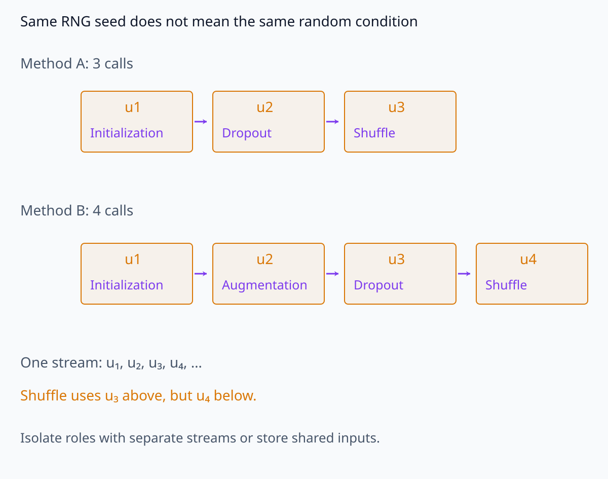
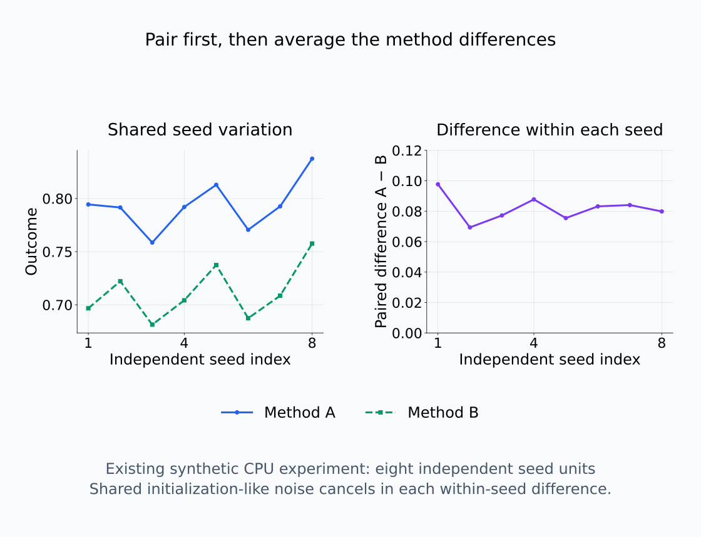
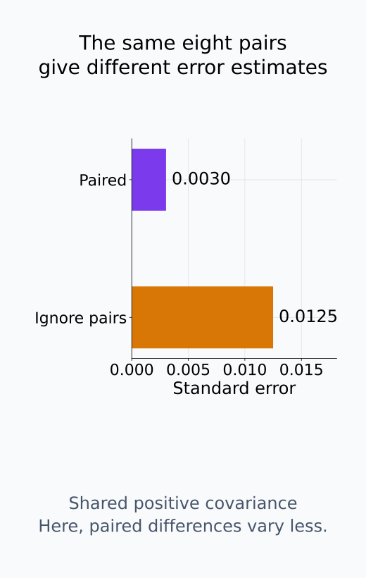
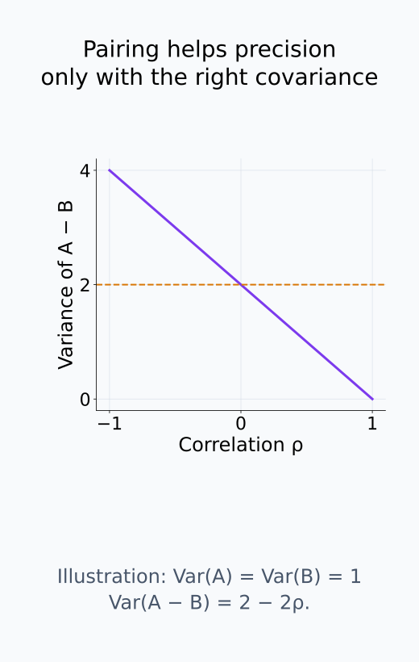
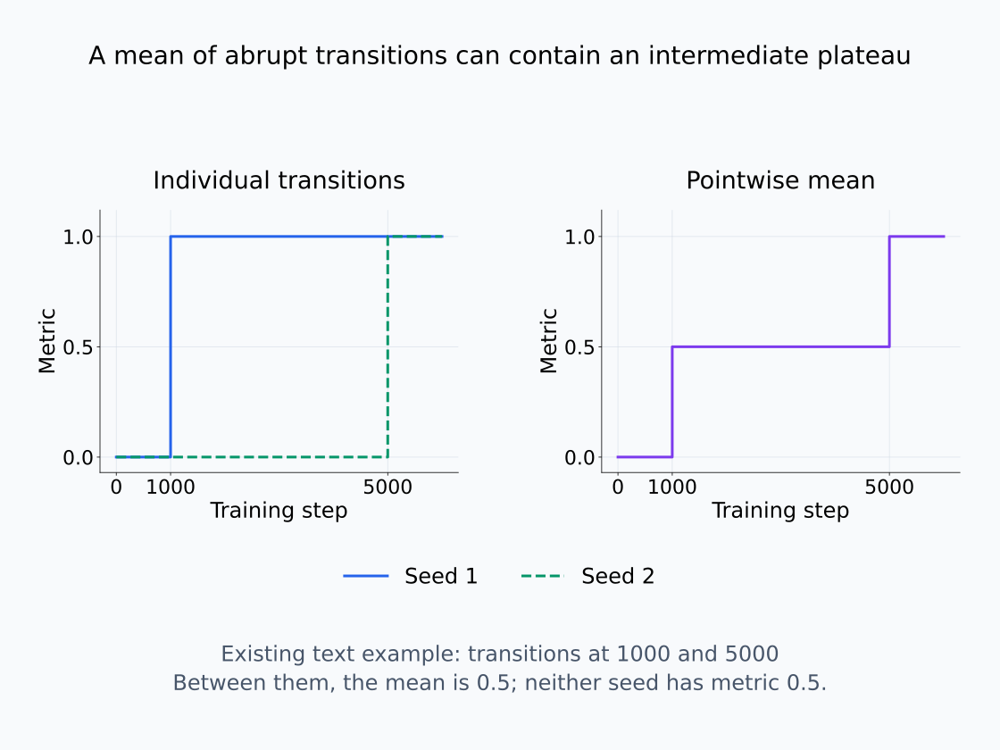

# I08-11. seed와 데이터 순서

## 이 단원이 필요한 이유

학습 궤적은 initialization, data order, dropout과 kernel 비결정성에 따라 달라진다. method A와 B를 서로 다른 seed로 실행하면 method 효과와 운 좋은 궤적을 분리하기 어렵다. 같은 random condition을 공유하는 paired design은 변동을 줄이고 실패 seed도 보존한다.

## 학습 목표

- 학습의 난수원을 목록화할 수 있다.
- paired seed design과 unpaired design을 구분할 수 있다.
- seed별 trajectory를 평균 이전에 검사할 수 있다.
- 재현성과 동일 결과 재생을 구분할 수 있다.

## 선수지식 확인

- 선수 단원: [I08-10 grokking과 phase transition](I08-10-grokking-phase-transition.md), [I08-05 mini-batch noise와 optimizer state](I08-05-minibatch-noise-optimizer-state.md), [M04-17 실험 설계와 재현성](../../part-1-foundations/M04/M04-17-experimental-design-reproducibility.md)
- 확인 질문: paired comparison이 experimental-unit 수준 공통 변동을 제거하는 원리는 무엇인가?

## 기호와 용어

| 기호·용어 | Common spoken reading | 의미 | shape·범위 |
|---|---|---|---|
| $Y_{r,A}(t)$ | `Y sub r A of t` | seed $r$, method A의 시간별 지표 | scalar trajectory |
| $\Delta_r(t)$ | `delta sub r of t` | 같은 seed의 paired 차이 | scalar trajectory |
| $\bar\Delta(t)$ | `delta bar of t` | seed 평균 paired 차이 | scalar trajectory |
| initialization seed | `initialization seed` | 초기 파라미터 난수원 | integer·RNG state |
| shuffle seed | `shuffle seed` | data order 난수원 | integer·RNG state |

## 1. Seed는 하나의 원인이 아니다

한 정수로 모든 library를 초기화하더라도 실제 난수원은 역할이 다르다. 연구 manifest에는 최소한 다음을 분리해 기록한다.

- model initialization
- dataset split과 shuffle
- dropout·augmentation
- probe·SAE initialization
- bootstrap·permutation test
- deterministic kernel 설정과 hardware

같은 seed 정수는 같은 난수를 같은 용도에 썼다는 증거까지 제공하지 않는다. Method를 바꿔 난수 호출의 횟수나 순서가 달라지면 이후 shuffle이나 dropout에 서로 다른 난수를 사용할 수 있다. 같은 구조의 모델에서 초기 weight와 data order를 공유하려면 저장한 초기값과 batch index sequence를 대응시킬 수 있어야 한다. 별도의 난수 흐름을 사용했다면 각 역할의 seed와 상태를 구분해 남긴다.

같은 seed에서 난수 호출 하나가 추가되는 경우를 비교한다.

<figure class="lesson-figure lesson-figure--wide" markdown="1">

<figcaption>같은 RNG를 같은 seed로 시작해도 method B가 augmentation 호출 하나를 추가하면 이후 dropout·shuffle에 배정되는 난수 위치가 밀린다는 schematic이다. 그림의 u들은 실제 실험값이 아니라 호출 순서다. 초기 weight와 batch index를 저장해 대응시키거나 역할별 stream과 상태를 분리해야 한다.</figcaption>
</figure>

## 2. Paired design

같은 seed와 data order에서 두 method를 비교해

$$
\Delta_r(t)=Y_{r,A}(t)-Y_{r,B}(t)
$$

를 만든다. seed별 공통 난이도가 상쇄되면 $\bar\Delta(t)$의 standard error가 줄어든다. pairing은 숨기지 말고 분석 단위와 함께 기록한다.

시점 $t$를 고정하고 seed 반복에 따른 두 결과를 $Y_A,Y_B$라 쓰면 $\operatorname{Var}(Y_A-Y_B)=\operatorname{Var}(Y_A)+\operatorname{Var}(Y_B)-2\operatorname{Cov}(Y_A,Y_B)$이다. 공통 조건에서 두 method가 함께 높거나 낮아져 covariance가 양수이면 차이의 분산이 줄어든다. Pairing만으로 정밀도가 자동으로 좋아지는 것은 아니다. 독립 seed가 $n$개라면 각 seed의 차이를 먼저 구하고, 그 차이의 표본 표준편차를 $\sqrt n$으로 나눠 평균 차이의 standard error를 추정한다. 같은 seed의 여러 checkpoint를 새로운 독립 seed처럼 세지 않는다.

seed의 공통 변동과 method 차이를 다른 축에서 읽는다.

<figure class="lesson-figure lesson-figure--wide" markdown="1">

<figcaption>기존 CPU synthetic 실험의 8개 paired 결과다. 같은 seed의 두 outcome은 공통 변동을 공유하고, A−B를 먼저 계산하면 이 변동이 상쇄된다. 왼쪽의 8개 seed가 독립 반복이며 동일 seed의 checkpoint를 별도 seed로 늘려 세지 않는다.</figcaption>
</figure>

동일한 결과에서 pairing을 사용하는 계산과 무시하는 계산을 비교한다.

<figure class="lesson-figure" markdown="1">

<figcaption>같은 8개 결과로 paired 차이의 표준편차/√8과, pairing을 무시한 두 분산 합의 standard error를 비교한다. 이 synthetic 예시에서는 양의 covariance로 paired 값이 작다. 모든 pairing이 자동으로 더 정밀하다는 뜻은 아니다.</figcaption>
</figure>

pairing이 정밀도를 높이는 조건을 확인한다.

<figure class="lesson-figure" markdown="1">

<figcaption>Var(A)=Var(B)=1인 수학적 예시에서 차이 분산은 2−2ρ다. 양의 correlation이면 줄고 음수이면 오히려 커진다. 따라서 공통 조건의 covariance 방향과 실제 seed 차이를 확인해야 한다.</figcaption>
</figure>

## 3. 평균이 숨기는 것

transition 위치가 seed마다 다르면 pointwise 평균 곡선은 어떤 seed에도 없던 완만한 전환을 만들 수 있다. seed별 crossing time, 발생 여부와 trajectory를 먼저 보고 그 다음 평균과 interval을 제시한다.

두 실행의 지표가 각각 step 1,000과 5,000에서 0에서 1로 바뀌었다고 하자. 그 사이의 평균은 0.5이지만, 개별 실행은 하나가 1이고 다른 하나가 0이다. 평균의 중간값은 두 실행 모두 절반만 변화했다는 뜻이 아니다. 전환이 일어나지 않은 실행도 평균에 들어가므로, 발생률과 발생한 실행의 시점 분포를 따로 보고한다.

재현성은 동일 seed에서 bitwise 같은 결과만을 뜻하지 않는다. 독립 seed·환경에서도 결론의 방향과 크기가 안정적인지 평가한다.

개별 전환을 보지 않으면 평균의 중간값을 오해할 수 있다.

<figure class="lesson-figure lesson-figure--wide" markdown="1">

<figcaption>본문의 두 실행은 각각 step 1000과 5000에서 0에서 1로 바뀐다. 그 사이 pointwise 평균 0.5는 서로 다른 상태의 혼합이지 각 실행의 절반 변화가 아니다. 각 seed의 trajectory와 발생 여부를 먼저 보고 평균을 해석한다.</figcaption>
</figure>

## 4. CPU 실습

<!-- I08_EXAMPLE: i08_11_seed_data_order -->

두 method가 같은 seed effect를 공유하는 synthetic paired experiment를 만든다. paired difference의 standard error가 독립 표본처럼 계산한 값보다 작다.

## 흔한 오해

### 오해 1. seed를 고정하면 uncertainty가 사라진다

고정 seed는 한 궤적을 재생하려는 조치다. 학습 절차의 seed 민감도는 여러 독립 실행으로 측정해야 한다.

### 오해 2. 좋은 seed만 보고해도 method 비교는 유효하다

결과를 보고 seed를 선택하면 selection bias가 생긴다. 사전 지정 seed 집합의 모든 실행을 보고한다.

## 연습문제

### 1. paired 차이

같은 세 seed에서 A가 $(0.8,0.7,0.9)$, B가 $(0.7,0.65,0.82)$이면 paired 차이를 구하라.

해설 보기

$(0.10,0.05,0.08)$이다.

### 2. 난수원

initialization seed는 같지만 shuffle seed가 다르면 무엇이 달라지는가?

해설 보기

초기 weight는 같아도 mini-batch gradient 순서와 optimizer trajectory가 달라질 수 있다.

### 3. 평균 곡선

두 seed의 transition이 각각 step 1000과 5000이면 평균 곡선의 완만한 상승을 어떻게 해석해야 하는가?

해설 보기

개별 실행이 완만했다는 증거가 아니다. seed별 transition 위치 차이가 평균에서 섞인 결과일 수 있다.

### 4. 실패 실행

OOM이나 divergence가 난 seed를 제외하면 어떤 편향이 생길 수 있는가?

해설 보기

성공하기 쉬운 실행만 남아 안정성과 성능을 과대평가한다. 실패율과 원인을 함께 보고한다.

### 5. bitwise 재현

다른 GPU에서 마지막 소수점이 달라도 결론이 재현될 수 있는가?

해설 보기

가능하다. 허용 오차와 통계적 결론이 유지되면 과학적 재현성이 있을 수 있다. bitwise 동일성은 더 강한 실행 조건이다.

### 6. 설계

method 효과와 initialization 효과를 동시에 추정하려면 어떻게 배치할 수 있는가?

해설 보기

여러 initialization seed 각각에 두 method를 paired 적용하고 seed를 block으로 분석한다.

## 근거와 갱신 경계

신경망 prediction의 seed별 churn과 randomness 원인은 [Nagarajan et al. (2021)](https://arxiv.org/abs/2102.03349)을 참고한다. deterministic 실행 가능성은 hardware와 library에 따라 달라지므로 manifest 환경 기록을 우선한다.

## 단원 요약

- initialization, shuffle와 분석 난수원을 분리해 기록한다.
- method 비교에는 같은 random condition의 paired design이 유리하다.
- seed별 transition을 본 뒤 평균한다.
- bitwise 재생과 결론의 재현성은 다른 기준이다.

## 통과 기준

- 난수원 목록과 paired 설계를 작성할 수 있는가?
- seed 평균이 transition을 흐리는 사례를 설명할 수 있는가?
- 실패 실행을 포함한 보고 규칙을 세울 수 있는가?

## 다음 단원

- [I08-12 데이터 귀인 입문](I08-12-data-attribution-introduction.md)

## 집필자 점검표

- [x] 난수원과 pairing을 구분했다.
- [x] 실패 seed와 평균의 한계를 설명했다.
- [x] 모든 문제에 해설이 있다.
- [x] Common spoken reading이 실제 영어 학술 발화이며 한글 음역이나 기계적 직역을 포함하지 않는다.
- [x] 주장 강도와 읽기 표기를 확인했다.
- [x] 내부 링크와 수식을 확인했다.
