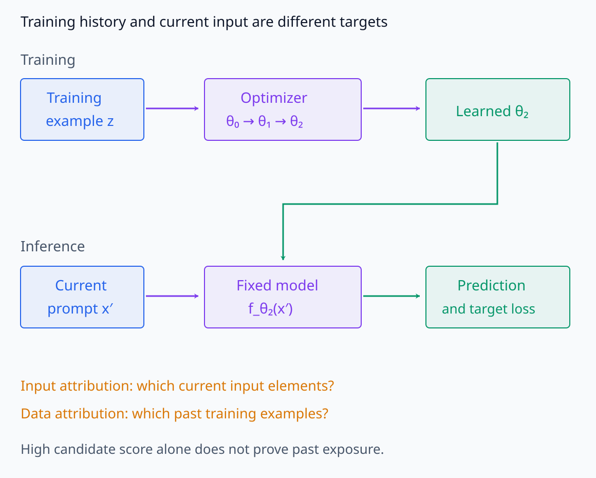
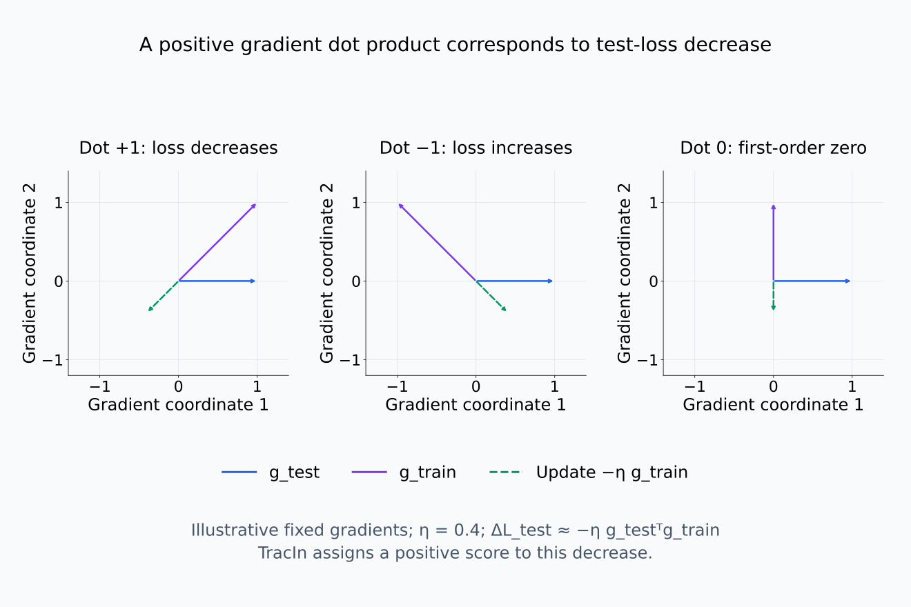
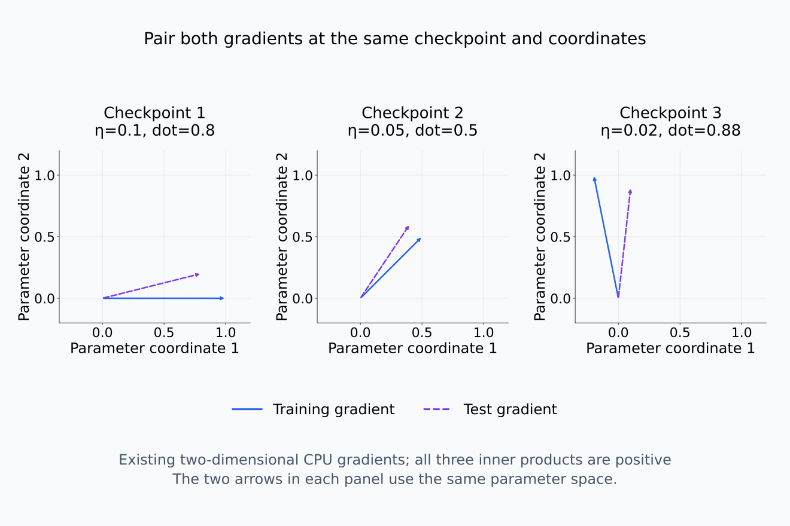
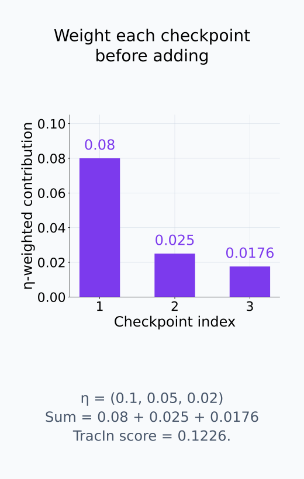
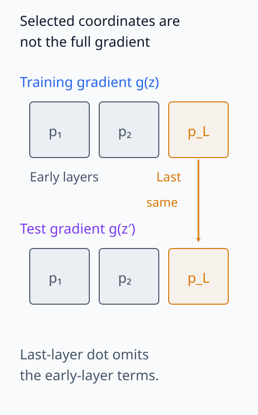
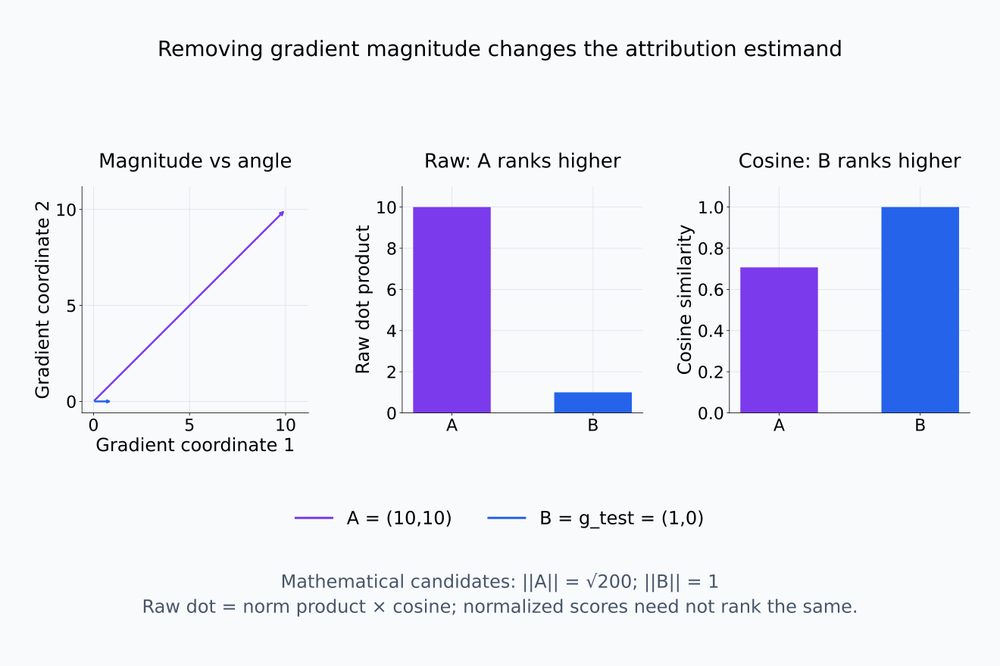

# I08-12. 데이터 귀인 입문

## 이 단원이 필요한 이유

feature attribution은 현재 입력의 어느 부분이 출력과 관련되는지 묻는다. 데이터 귀인(data attribution)은 어떤 training example이 현재 prediction과 학습 경로에 영향을 주었는지 묻는다. TracIn은 여러 checkpoint에서 training gradient와 test gradient의 정렬을 합해 이 관계를 근사한다.

## 학습 목표

- feature attribution과 data attribution을 구분할 수 있다.
- TracIn checkpoint score를 계산할 수 있다.
- gradient dot product의 부호를 해석할 수 있다.
- attribution 순위를 retraining effect와 동일시하지 않을 수 있다.

## 선수지식 확인

- 선수 단원: [I08-11 seed와 데이터 순서](I08-11-seed-data-order.md), [I08-08 influence function](I08-08-influence-function.md), [I07-02 gradient 기반 귀인](../I07/I07-02-gradient-attribution.md)
- 확인 질문: 두 gradient의 inner product가 양수라는 것은 두 update 방향 사이에서 무엇을 뜻하는가?

## 기호와 용어

| 기호·용어 | Common spoken reading | 의미 | shape·범위 |
|---|---|---|---|
| $z$ | `z` | 후보 training example | sample |
| $z'$ | `z prime` | 설명할 test example | sample |
| $g_t(z)$ | `g sub t of z` | checkpoint $t$에서 $z$의 loss gradient | $\mathbb R^p$ |
| $I_{\mathrm{TracIn}}(z,z')$ | `I TracIn of z comma z prime` | checkpoint gradient 정렬의 합 | signed scalar |
| proponent | `proponent` | test loss를 줄이는 방향으로 정렬된 example | convention-dependent |

## 1. 질문의 대상이 다르다

입력 token attribution은 inference graph의 현재 입력 요소를 대상으로 한다. 데이터 귀인은 training set의 example을 대상으로 하며, 학습 알고리즘을 설명의 일부로 포함한다. 같은 문장이 현재 prompt에 있다는 사실과 과거 training influence가 컸다는 사실은 다르다.

training과 inference의 입력이 연결되는 위치를 구분한다.

<figure class="lesson-figure lesson-figure--wide" markdown="1">

<figcaption>윗줄은 training example이 optimizer를 거쳐 parameter를 만드는 경로, 아랫줄은 현재 prompt가 고정 model로 들어가는 inference 경로다. 입력 token 귀인과 과거 data 귀인은 서로 다른 입력을 묻는다. 후보의 gradient score가 크다는 것만으로 실제 과거 학습에 사용됐다고 입증하지 않는다.</figcaption>
</figure>

## 2. TracIn checkpoint 근사

선택한 checkpoint 집합 $C$에서 단순한 score는

$$
I_{\mathrm{TracIn}}(z,z')
=\sum_{t\in C}\eta_t
\nabla_\theta\ell(z,\theta_t)^\top
\nabla_\theta\ell(z',\theta_t)
$$

이다. 두 gradient는 같은 checkpoint의 parameter를 같은 순서로 놓고 계산한다. 서로 다른 시점이나 대응하지 않는 parameter 좌표에서 구한 벡터를 내적하면 이 식의 update 해석이 성립하지 않는다.

부호는 loss의 1차 근사에서 나온다. 하나의 training example로 보통 SGD update를 한다면 parameter 변화는 $-\eta_t g_t(z)$다. 이 작은 변화가 test loss에 미치는 영향은

$$
\ell(z',\theta_t-\eta_t g_t(z))-\ell(z',\theta_t)
\approx-\eta_t g_t(z')^\top g_t(z)
$$

이다. 따라서 내적이 양수이면 training example의 update가 test loss를 줄이는 방향이고, 음수이면 늘리는 방향이다. 위 TracIn score는 loss **감소량** 쪽에 양의 부호를 붙인다. I08-08에서 양의 influence를 upweight에 따른 test loss **증가**로 정의한 것과 부호의 대상이 다르다. 값의 부호만 비교하지 말고 어느 변화량을 양수로 정의했는지 확인한다.

이 유도는 보통 SGD의 작은 update에 대한 근사다. Momentum이나 Adam의 실제 update에는 누적 상태와 좌표별 크기 조정이 들어가므로, raw gradient 내적만으로 그 update의 정확한 기여를 계산했다고 볼 수 없다.

gradient와 실제 SGD 이동의 부호를 함께 본다.

<figure class="lesson-figure lesson-figure--wide" markdown="1">

<figcaption>test gradient (1,0)를 고정한 수학적 예시다. update는 training gradient의 반대 방향이므로 양의 내적은 test loss 감소에 대응한다. TracIn의 양수는 이 감소량 쪽이며 upweighting의 loss 증가량에 양수를 붙인 influence convention과 구분한다.</figcaption>
</figure>

같은 checkpoint에서 짝지은 두 gradient의 방향을 확인한다.

<figure class="lesson-figure lesson-figure--wide" markdown="1">

<figcaption>기존 CPU 실습의 gradient 두 개를 같은 checkpoint의 같은 좌표축에 그렸다. 내적은 차례로 0.8, 0.5, 0.88이다. 서로 다른 checkpoint나 대응하지 않는 parameter 좌표를 섞은 내적은 이 update 해석과 다르다.</figcaption>
</figure>

내적과 learning rate가 합에 들어가는 크기를 비교한다.

<figure class="lesson-figure" markdown="1">

<figcaption>각 내적에 해당 learning rate 0.1,0.05,0.02를 곱한 기여는 0.08,0.025,0.0176이고 합은 0.1226이다. 모두 양수인 작은 checkpoint 근사이며 실제 제거 재학습 결과나 전체 loss 감소량의 정확한 합이라고 부르지 않는다.</figcaption>
</figure>

## 3. Checkpoint와 layer 선택

모든 step을 저장하지 않으므로 TracInCP는 일부 checkpoint만 합한다. 선택한 step, learning rate와 parameter subset이 score를 바꾼다. 마지막 layer만 쓰는 근사는 계산을 줄이지만 전체 network influence와 같지 않다.

checkpoint 근사는 각 example이 실제로 사용된 모든 update 시점의 loss 감소량을 그대로 더한 것이 아니다. 저장된 parameter에서 gradient를 다시 계산해 학습 중 관계를 근사하므로, 점수의 합이 실제 전체 loss 감소량과 일치한다는 보장은 없다. 같은 계산은 training set에 없던 후보에도 할 수 있다. 그런 후보의 점수가 크더라도 과거 학습에서 실제로 사용됐다는 증거는 아니다.

중복 example은 influence를 나눠 가질 수 있고, 큰 gradient norm이 semantic relevance보다 순위를 지배할 수 있다. 두 gradient가 모두 0이 아닐 때 내적은 두 norm의 곱에 두 벡터 사이 각도의 cosine을 곱한 값이다. 따라서 방향이 비슷해도 gradient가 작은 example은 raw score가 작을 수 있다. cosine으로 정규화하면 이 크기 정보를 제거하므로, cosine-normalized score와 raw dot product는 별도 estimand이다.

gradient의 어느 좌표를 남겼는지 확인한다.

<figure class="lesson-figure" markdown="1">

<figcaption>두 gradient의 같은 parameter block끼리 대응시켜야 한다. 주황색 p_L block만 내적하면 앞선 p₁,p₂ block의 기여가 빠진다. 마지막 layer subset에 대한 score를 계산한 것으로 보고하며 full-network influence로 확대하지 않는다.</figcaption>
</figure>

크기가 큰 후보와 방향이 더 맞는 후보의 순위가 달라질 수 있다.

<figure class="lesson-figure lesson-figure--wide" markdown="1">

<figcaption>g_test=(1,0), 후보 A=(10,10), B=(1,0)인 수학적 예시다. raw 내적은 A가 10, B가 1이지만 cosine은 A가 1/√2, B가 1이라 순위가 뒤집힌다. norm을 제거한 score와 raw dot product는 같은 estimand가 아니다.</figcaption>
</figure>

## 4. CPU 실습

<!-- I08_EXAMPLE: i08_12_data_attribution -->

세 checkpoint의 2차원 training·test gradient dot product에 learning rate를 곱해 합한다. 모든 항이 양수지만 이 값은 실제 example 제거 재학습 결과가 아니다.

## 흔한 오해

### 오해 1. top training example이 prediction을 복사해 넣었다

gradient alignment는 parameter update의 국소 관계다. 내용 중복, 여러 example의 공동 효과와 nonlinear training 경로를 분리하지 않는다.

### 오해 2. checkpoint를 더 많이 쓰면 무조건 정확하다

품질이 낮거나 거의 같은 checkpoint를 추가하면 비용만 늘 수 있다. target loss 변화가 큰 시점과 대표성을 검토한다.

## 연습문제

### 1. dot product

$g(z)=(1,2)$, $g(z')=(3,-1)$이면 inner product는 얼마인가?

해설 보기

$1\times3+2\times(-1)=1$이다.

### 2. learning rate

같은 dot product라도 $\eta_t$가 0이면 해당 checkpoint의 기여는 얼마인가?

해설 보기

0이다. 실제 update 크기를 근사식에 반영한다.

### 3. parameter subset

마지막 layer gradient만 쓴 score의 한계를 설명하라.

해설 보기

앞 layer를 통한 influence를 생략한다. 계산한 subset에 대한 gradient similarity라고 보고해야 한다.

### 4. 중복

같은 문장이 training set에 열 번 있으면 개별 influence 순위가 낮아질 수 있는 이유는 무엇인가?

해설 보기

유사한 update 기여가 여러 example에 분산되고 하나를 제거해도 나머지가 보상할 수 있기 때문이다.

### 5. 검증

상위 proponent를 제거한 재학습에서 prediction이 변하지 않았다. 가능한 설명 두 가지를 적어라.

해설 보기

TracIn 근사 오차가 크거나 중복·대체 training examples가 효과를 보상했을 수 있다.

### 6. 방법 비교

influence function과 TracIn의 핵심 차이 하나를 적어라.

해설 보기

influence function은 최적점 주변 Hessian inverse를 사용하고, TracIn은 여러 training checkpoint의 gradient alignment를 합한다.

## 근거와 갱신 경계

checkpoint를 이용한 gradient 기반 데이터 귀인은 [Pruthi et al. (2020)](https://proceedings.neurips.cc/paper/2020/hash/e6385d39ec9394f2f3a354d9d2b88eec-Abstract.html)을 기준으로 한다. 이 단원은 작은 gradient 계산을 다루며 대규모 corpus 검색의 저장·privacy 문제는 범위 밖이다.

## 단원 요약

- 데이터 귀인은 training example과 prediction의 학습 관계를 묻는다.
- TracIn은 checkpoint별 gradient dot product를 learning rate와 함께 합한다.
- checkpoint·layer·normalization 선택이 순위를 바꾼다.
- 점수는 실제 removal retraining effect가 아니다.

## 통과 기준

- feature attribution과 data attribution을 구분할 수 있는가?
- 작은 TracIn score를 계산할 수 있는가?
- 순위를 검증할 retraining 실험을 설계할 수 있는가?

## 다음 단원

- [I08-13 종합 실습: feature의 생애](I08-13-capstone-feature-lifecycle.md)

## 집필자 점검표

- [x] 데이터 귀인의 대상과 근사를 명시했다.
- [x] TracIn 식과 한계를 설명했다.
- [x] 모든 문제에 해설이 있다.
- [x] Common spoken reading이 실제 영어 학술 발화이며 한글 음역이나 기계적 직역을 포함하지 않는다.
- [x] 주장 강도와 읽기 표기를 확인했다.
- [x] 내부 링크와 수식을 확인했다.
