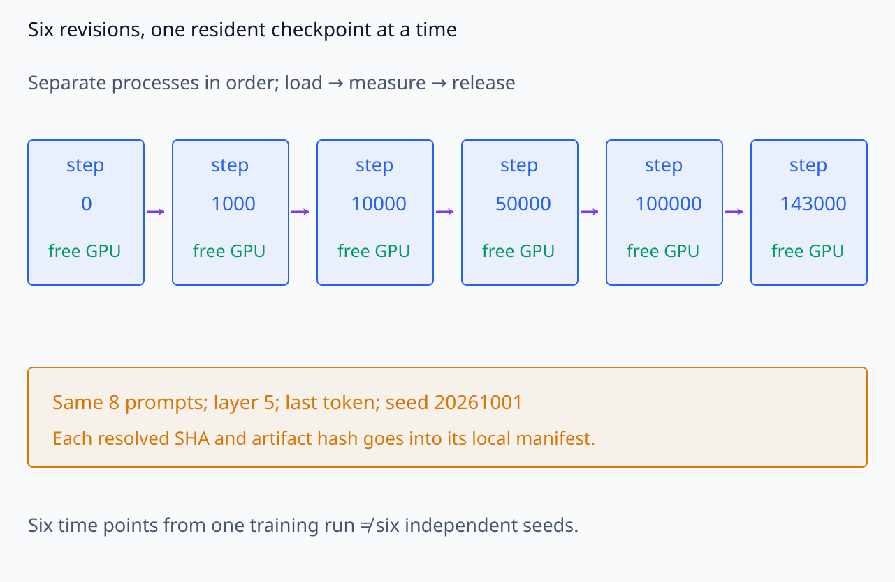
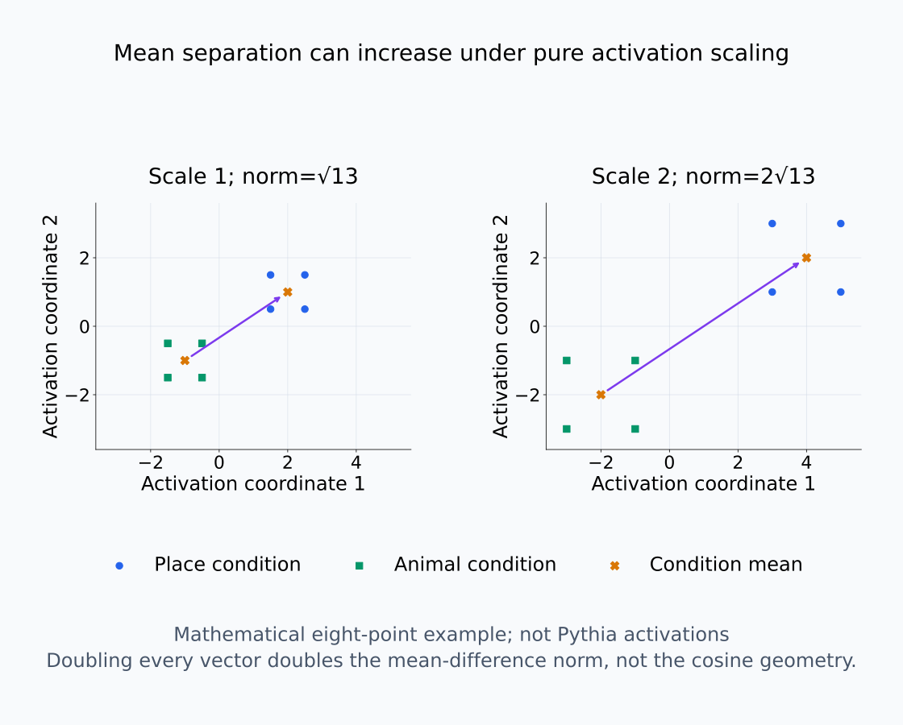
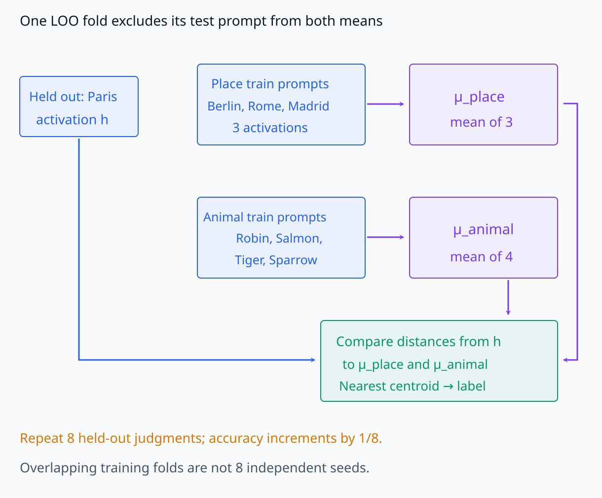
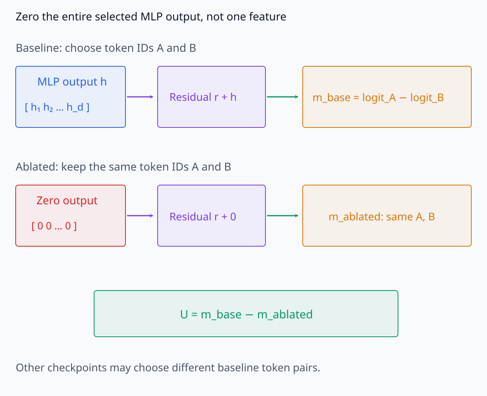
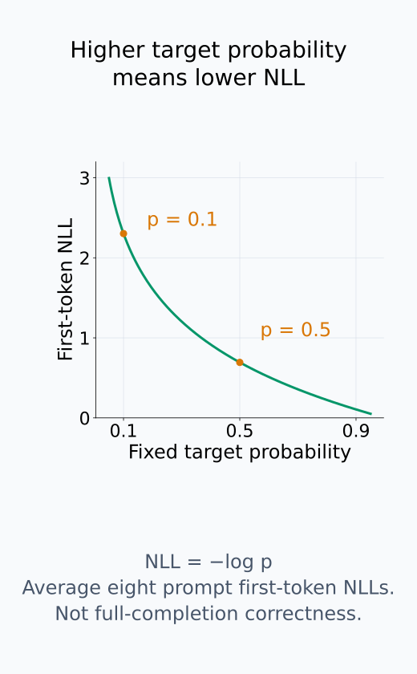
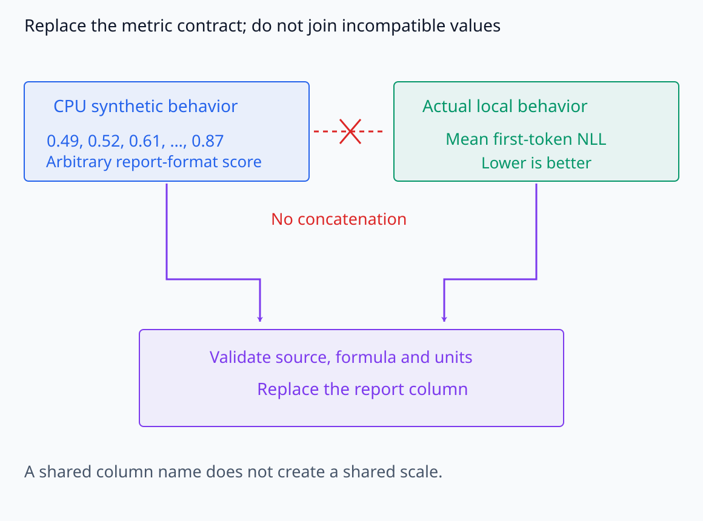

# I08-13. 종합 실습: feature의 생애

## 이 단원이 필요한 이유

학습 동역학 보고서는 checkpoint별 metric을 늘어놓는 데서 끝나지 않는다. 같은 입력과 feature 후보를 시간축에서 대응시키고, 형성·복원·사용·행동 증거를 별도 열로 유지해야 한다. 이 단원은 CPU 보고서 형식과 Pythia-160M 여섯 checkpoint의 로컬 GPU 측정을 연결한다.

## 학습 목표

- 여섯 checkpoint의 provenance와 비교 계약을 감사할 수 있다.
- feature formation·recoverability·use·behavior 표를 만들 수 있다.
- 변화 시점의 불확실성과 seed 한계를 보고할 수 있다.
- 관찰·probe·개입·행동 증거를 claim ledger로 종합할 수 있다.

## 선수지식 확인

- 선수 단원: [I08-01 checkpoint 연구 설계](I08-01-checkpoint-study-design.md), [I08-03 representation alignment](I08-03-representation-alignment.md), [I08-09 feature emergence](I08-09-feature-emergence.md), [I08-11 seed와 데이터 순서](I08-11-seed-data-order.md), [I08-12 데이터 귀인 입문](I08-12-data-attribution-introduction.md)
- 확인 질문: recoverability score가 높아진 시점과 intervention effect가 커진 시점을 별도로 기록해야 하는 이유는 무엇인가?

## 기호와 용어

| 기호·용어 | Common spoken reading | 의미 | shape·범위 |
|---|---|---|---|
| $T=(t_0,\ldots,t_5)$ | `T equals t sub zero through t sub five` | 여섯 checkpoint의 순서 | ordered tuple |
| $q_t$ | `q sub t` | matched feature direction | $\mathbb R^d$ |
| $R_t$ | `R sub t` | held-out recoverability | $[0,1]$ |
| $U_t$ | `U sub t` | zero-ablation으로 잰 margin 변화 | signed scalar |
| $B_t$ | `B sub t` | 고정 target first-token NLL | nonnegative scalar |
| claim ledger | `claim ledger` | 증거와 허용 주장을 대응한 표 | structured report |

## 1. 고정 실험 계약

실제 모델 측정은 다음 조건을 바꾸지 않는다.

- model: `EleutherAI/pythia-160m-deduped`
- revisions: `step0`, `step1000`, `step10000`, `step50000`, `step100000`, `step143000`
- prompts: place 4개와 animal 4개
- 위치: layer 5 MLP down projection, 마지막 token
- seed: 20261001
- behavior: 고정 target의 first-token negative log probability
- recoverability: activation의 leave-one-out nearest-centroid condition accuracy
- use proxy: 첫 prompt에서 해당 MLP output을 0으로 만든 뒤 고정 top-two logit margin 변화

여섯 실험은 별도 프로세스에서 순서대로 실행하므로 GPU에는 한 checkpoint만 올라간다. 각 revision의 resolved SHA와 artifact hash는 로컬 manifest에 남는다.

고정 revision 순서와 한 번에 한 checkpoint의 적재를 확인한다.

<figure class="lesson-figure lesson-figure--wide" markdown="1">

<figcaption>기존 step0,1000,10000,50000,100000,143000의 고정 실행 순서다. 한 checkpoint의 측정을 마치고 GPU를 해제한 다음 별도 프로세스로 다음 것을 실행한다. 그림은 실행 계약을 설명하며 이번 개정에서 새 모델 실행을 수행한 결과가 아니다. 여섯 checkpoint는 한 학습 경로의 여섯 시점이다.</figcaption>
</figure>

## 2. 네 열을 합치지 않는다

formation은 place·animal condition mean의 activation 차이와 checkpoint 간 정렬로 본다. recoverability는 held-out 분류 성능이다. use proxy는 zero-ablation effect이며 random position·random direction control이 없으므로 제한적 개입 증거다. behavior NLL은 외부 출력 변화이다.

실제 산출물의 formation 값은 place 4개와 animal 4개의 activation을 각각 평균한 뒤 두 평균 벡터의 차이의 L2 norm을 계산한 것이다. 이 값은 조건 사이 분리의 크기이지 특정 feature의 존재 여부를 직접 판정하는 값은 아니다. 모든 activation의 scale이 커져도 함께 커질 수 있다. $q_t$처럼 같은 feature 방향을 추적하려면 I08-03의 정렬과 I08-09의 matching을 별도로 검토해야 한다. 현재 산출물의 평균 차이 norm만으로 checkpoint 간 방향 대응까지 완료됐다고 볼 수 없다.

$R_t$는 한 prompt를 빼고 나머지 prompt로 place·animal 평균을 만든 뒤, 뺀 activation이 어느 평균에 더 가까운지 판정하는 과정을 여덟 번 반복한 정확도다. 평가할 prompt 자신은 그 회차의 평균 계산에 들어가지 않는다. 여덟 판정의 평균이므로 한 판정이 바뀌면 값이 $1/8$만큼 바뀐다. 다만 회차마다 평균을 만드는 prompt 대부분이 겹치므로 여덟 회차를 여덟 개의 독립 학습 실행으로 세지 않는다.

$U_t$는 첫 prompt의 MLP output 전체를 0으로 만들기 전과 후의 margin 차이다. 이때 baseline에서 선택한 두 token ID를 ablation 뒤에도 그대로 사용한다. ablation 뒤 새 top-two를 골라 비교하면 서로 다른 출력 차이를 빼게 되기 때문이다. 그러나 checkpoint끼리는 baseline top-two token이 달라질 수 있으므로, $U_t$의 시간 변화가 항상 같은 token 쌍의 지지를 비교하는 것은 아니다. 또한 이 개입은 $q_t$ 방향만 제거한 것이 아니므로 해당 feature 하나의 사용을 증명하지 않는다.

$B_t$는 각 prompt의 고정 target 첫 token에 대한 negative log probability를 여덟 prompt에서 평균한 값이다. target 확률이 커지면 NLL은 작아진다. top-1 token이 그대로여도 이 확률은 변할 수 있고, 첫 token의 확률이 개선됐다고 전체 completion이 정확해진 것은 아니다. 따라서 이 값과 activation 분리·분류 정확도·margin 변화를 같은 척도로 합치지 않는다.

여섯 checkpoint는 한 학습 경로에서 고른 시점이지 여섯 개의 독립 seed가 아니다. 따라서 보편적인 emergence step이나 phase transition을 추정하지 않는다.

mean 차이의 크기와 activation scale을 분리한다.

<figure class="lesson-figure lesson-figure--wide" markdown="1">

<figcaption>place·animal 각 4개를 가진 수학적 2D 예시이며 실제 Pythia activation이 아니다. 같은 점들을 두 배로 키우면 두 condition mean 차이 norm도 √13에서 2√13으로 커진다. 이 값의 증가만으로 새 semantic feature나 checkpoint 간 방향 matching을 증명하지 않는다.</figcaption>
</figure>

평가할 prompt를 평균 계산에서 어디서 빼는지 확인한다.

<figure class="lesson-figure lesson-figure--wide" markdown="1">

<figcaption>기존 여덟 prompt 중 Paris를 뺀 한 회차의 계산 구조다. place 평균은 나머지 3개, animal 평균은 4개로 만들고 평가할 activation은 두 평균 계산에서 제외한다. 이 판정을 prompt마다 반복한 accuracy는 1/8 단위지만 training fold가 겹쳐 8개 독립 seed는 아니다. 새 probe 결과값을 생성한 그림은 아니다.</figcaption>
</figure>

개입할 vector 범위와 비교할 token 쌍을 고정한다.

<figure class="lesson-figure lesson-figure--wide" markdown="1">

<figcaption>실제 구현은 layer 5의 마지막 token MLP output 전체를 0으로 만든다. baseline에서 고른 두 token ID를 ablation 뒤에도 그대로 써 U=m_base−m_ablated를 계산한다. 이 개입은 q_t 방향 하나만 지운 것이 아니고 checkpoint 간 baseline token 쌍도 달라질 수 있다.</figcaption>
</figure>

behavior 값이 좋아지는 방향을 확률과 함께 확인한다.

<figure class="lesson-figure" markdown="1">

<figcaption>고정 target 첫 token의 확률 p와 −log p의 수학적 관계다. 실제 값은 여덟 prompt의 첫-token NLL을 평균한 것이며 감소가 개선이다. top-1 token이 같아도 p는 변할 수 있고, 첫 token 확률이 높아졌다고 전체 completion의 정확성을 보장하지 않는다.</figcaption>
</figure>

## 3. CPU 보고서 형식

<!-- I08_EXAMPLE: i08_13_feature_lifecycle -->

CPU 예제의 숫자는 synthetic이다. 목적은 네 주장을 같은 표의 다른 열로 유지하고 실제 GPU manifest로 바꿔 넣을 보고서 구조를 검산하는 것이다.

CPU 표의 `behavior` 값 0.49에서 0.87로의 변화는 실제 target NLL을 계산한 결과가 아니다. 이 숫자를 실제 NLL과 그대로 이어 붙여 하나의 곡선으로 만들지 않는다. 실제 결과를 넣을 때에는 열 이름뿐 아니라 계산식·단위·좋아지는 방향을 함께 맞춘다. 특히 실제 behavior NLL은 감소하는 방향이 개선이므로 네 열이 모두 상승해야 한다는 규칙은 없다.

report 형식이 같아도 metric 단위가 같지는 않다.

<figure class="lesson-figure lesson-figure--wide" markdown="1">

<figcaption>기존 CPU behavior 0.49에서 0.87까지의 숫자는 actual NLL이 아니다. 실제 로컬 결과로 바꿔 넣을 때 source·계산식·단위·개선 방향을 확인해 열을 교체한다. 같은 이름의 두 숫자열을 하나의 시계열로 이어 붙이지 않는다.</figcaption>
</figure>

## 4. 실제 Pythia checkpoint 실행

<!-- GPU_EXPERIMENT: pythia_160m_step0_feature_lifecycle -->

<!-- GPU_EXPERIMENT: pythia_160m_step1000_feature_lifecycle -->

<!-- GPU_EXPERIMENT: pythia_160m_step10000_feature_lifecycle -->

<!-- GPU_EXPERIMENT: pythia_160m_step50000_feature_lifecycle -->

<!-- GPU_EXPERIMENT: pythia_160m_step100000_feature_lifecycle -->

<!-- GPU_EXPERIMENT: pythia_160m_step143000_feature_lifecycle -->

로컬 결과에서 checkpoint별 top token이 바뀌면 먼저 target tokenization과 prompt 길이를 확인한다. activation norm의 변화는 representation scale 변화일 수 있으므로 feature formation과 동일시하지 않는다.

## 5. Claim ledger

| 관찰 | 말할 수 있는 것 | 추가로 필요한 것 |
|---|---|---|
| condition mean 차이가 커짐 | 지정 activation dataset의 분리가 커짐 | 독립 prompt와 alignment 안정성 |
| held-out score 상승 | condition 정보 복원 가능성이 커짐 | probe control·seed 반복 |
| zero-ablation margin 변화 | 해당 component가 지정 margin에 관여함 | random control·다른 위치 개입 |
| target NLL 감소 | 지정 completion의 예측이 개선됨 | broader task와 독립 평가 |

여기서 NLL 행의 예측 개선은 앞서 고정한 첫 token에 한정된다. 다른 세 행이 함께 변해도 그 feature가 전체 completion의 개선을 일으켰다는 연결은 별도 증거가 필요하다.

시간 순서도 관찰한 checkpoint 집합 안에서 보고한다. 앞선 모든 관측이 기준보다 낮고 step50000에서 처음 높아졌다면 첫 관측 crossing은 step50000이다. 실제 최초 도달을 step10000과 step50000 사이로 한정하려면 step10000 이전에 기준을 넘었다가 다시 낮아지는 일이 없었다는 조건이 필요하다. 희소한 관측만으로 이 조건을 확인하지 못했다면 두 checkpoint 사이에서 관찰 값이 낮음에서 높음으로 바뀌었다고 쓰고, 실제 최초 도달 시점은 미확정으로 둔다.

## 흔한 오해

### 오해 1. 네 metric이 함께 오르면 하나의 feature가 원인이다

공동 시간 추세만으로 동일 feature의 인과사슬을 증명하지 못한다. matching과 개입 specificity가 필요하다.

### 오해 2. step0과 final 차이가 학습의 모든 단계를 설명한다

중간 checkpoint가 비단조 변화와 일시적 feature를 드러낼 수 있다. 여섯 점도 전체 154개 checkpoint보다 거칠다.

## 연습문제

### 1. 증거 분류

leave-one-out probe accuracy가 0.5에서 0.9로 올랐다. 어느 열의 증거인가?

해설 보기

recoverability 열이다. 모델의 기능적 사용을 바로 뜻하지 않는다.

### 2. 개입 부호

zero-ablation 뒤 top-two margin이 2.0에서 1.2로 변했다. 원래 margin을 유지하는 방향의 effect를 $m_{base}-m_{ablated}$로 정의하면 얼마인가?

해설 보기

$2.0-1.2=0.8$이다. 양수는 이 component가 원래 margin을 지지했음을 시사한다.

### 3. scale

activation norm이 모든 prompt에서 두 배가 됐지만 cosine geometry는 같다. 무엇을 조심해야 하는가?

해설 보기

norm 증가를 새 semantic feature 형성으로 해석하면 안 된다. normalization에 불변인 geometry와 행동 증거를 함께 본다.

### 4. 시간 위치

step10000에는 낮고 step50000에는 높은 use effect가 관찰됐다. emergence step을 어떻게 보고하는가?

해설 보기

첫 관측 crossing은 step50000이며 실제 전환은 10000과 50000 사이에 있다고 범위를 함께 쓴다.

### 5. 대조군

zero-ablation use 주장을 강화할 control 두 가지를 적어라.

해설 보기

같은 norm의 random direction 또는 random layer·token ablation, 그리고 matched clean/corrupt input control을 사용할 수 있다.

### 6. 최종 주장

single-seed Pythia 결과에서 네 metric이 순차적으로 상승했다. 가장 강하게 허용되는 결론은 무엇인가?

해설 보기

고정한 model run·prompt·layer에서 네 지표의 시간적 순서를 관찰했다고 말할 수 있다. seed 일반화나 feature가 행동 변화의 원인이라는 결론에는 반복·특이적 개입이 더 필요하다.

## 근거와 갱신 경계

Pythia의 공개 학습 궤적은 [Biderman et al. (2023)](https://proceedings.mlr.press/v202/biderman23a.html)을 기준으로 한다. checkpoint 기반 data influence의 비교 틀은 [Pruthi et al. (2020)](https://proceedings.neurips.cc/paper/2020/hash/e6385d39ec9394f2f3a354d9d2b88eec-Abstract.html)을 참고한다. 실제 로컬 숫자는 이 교재의 여덟 prompt와 단일 seed에만 적용한다.

## 단원 요약

- feature의 생애는 formation·recoverability·use·behavior를 별도 열로 추적한다.
- 실제 Pythia 여섯 checkpoint는 한 번에 하나씩 적재하고 provenance를 남긴다.
- synthetic CPU 결과와 실제 GPU 결과를 구분한다.
- single-seed·sparse-checkpoint 결과의 일반화 범위를 제한한다.

## 통과 기준

- 네 종류의 metric과 허용 주장을 대응할 수 있는가?
- checkpoint manifest의 revision·data·seed·metric을 감사할 수 있는가?
- 변화 시점과 개입 증거의 한계를 포함한 보고서를 쓸 수 있는가?

## 다음 단원

- 제4부 9단계 선택 심화는 연구 질문에 따라 모듈을 선택한다.

## 집필자 점검표

- [x] 여섯 checkpoint와 실행 순서를 고정했다.
- [x] feature의 네 증거를 분리했다.
- [x] CPU와 GPU 결과의 지위를 구분했다.
- [x] 모든 문제에 해설이 있다.
- [x] Common spoken reading이 실제 영어 학술 발화이며 한글 음역이나 기계적 직역을 포함하지 않는다.
- [x] 주장 강도와 읽기 표기를 확인했다.
- [x] 내부 링크와 수식을 확인했다.
