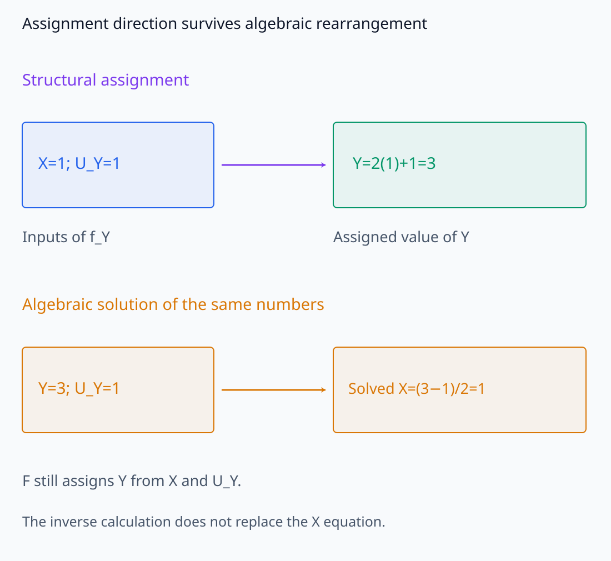
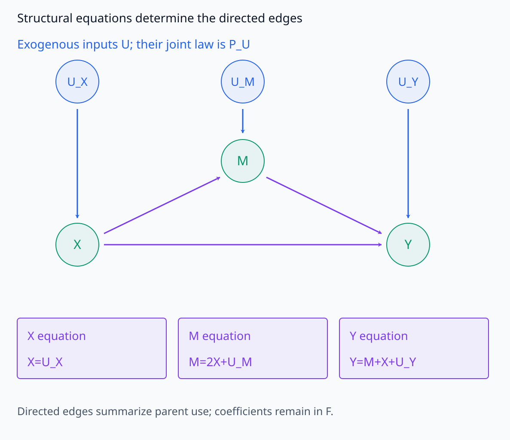
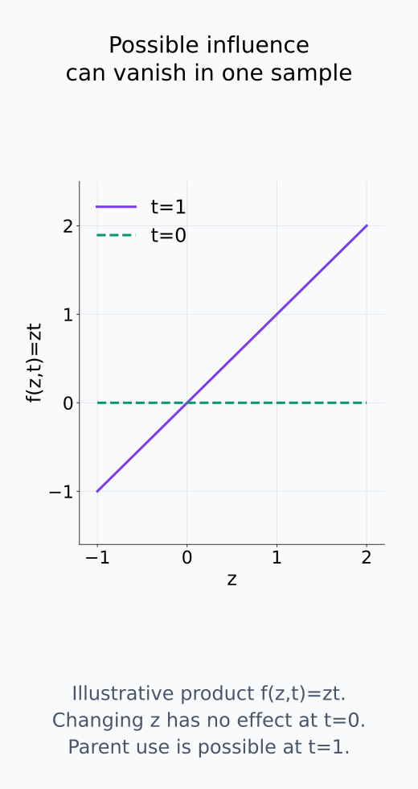
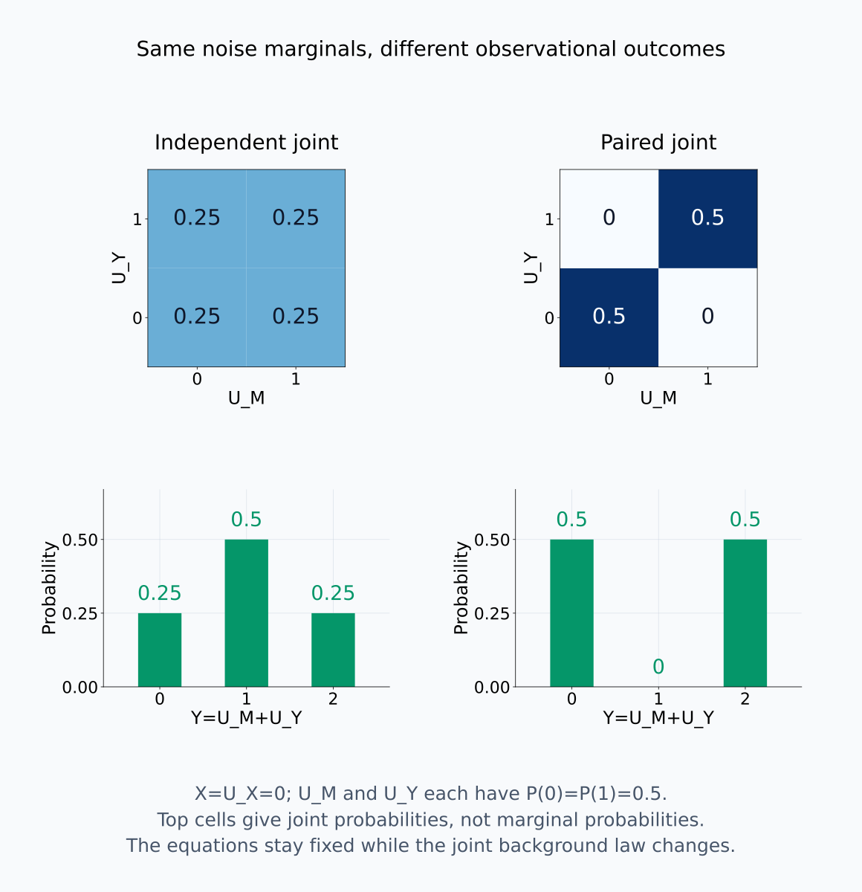
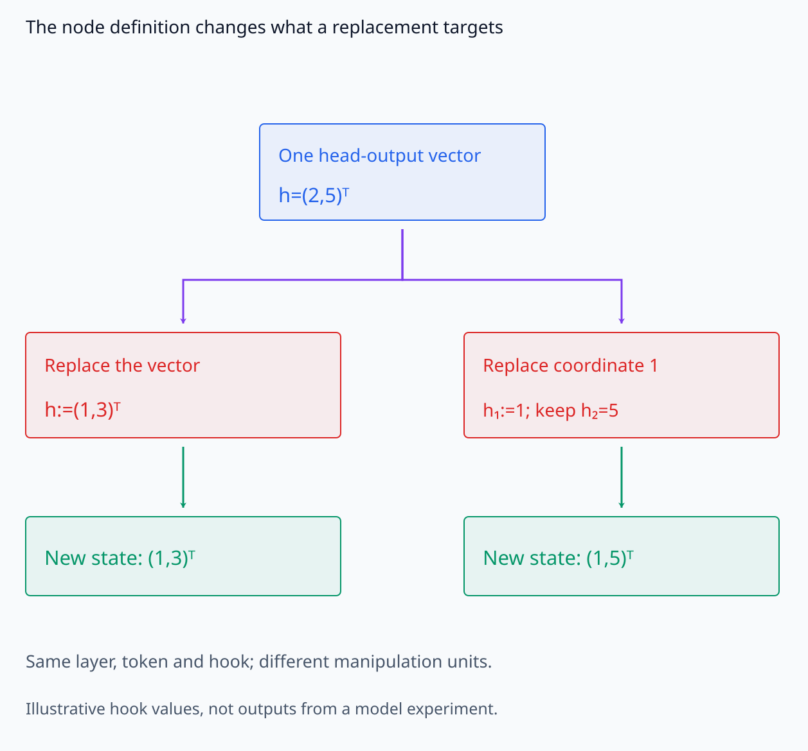
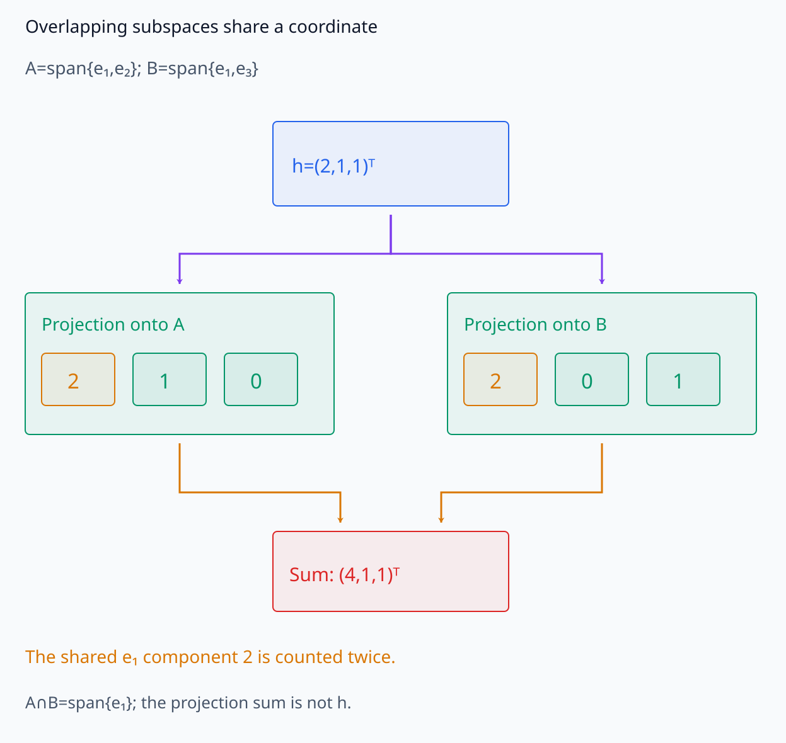
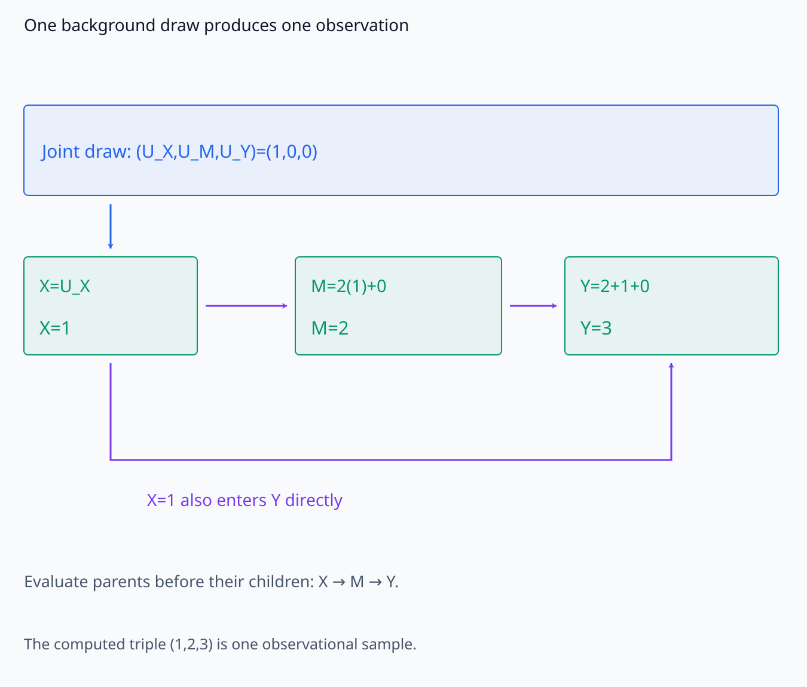
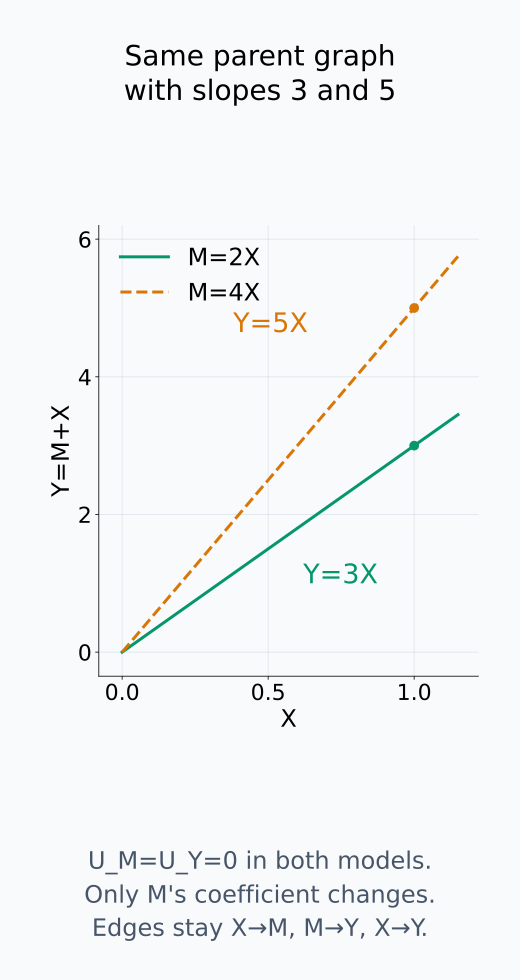

# A09-CAU-01. 구조적 인과모형

## 이 단원이 필요한 이유

correlation graph는 변수 사이의 통계적 연결을 그리지만 개입 결과를 정하지 않는다. structural causal model은 각 endogenous variable을 부모와 exogenous noise의 함수로 정의한다. model circuit에 causal language를 쓰려면 node, equation과 intervention target을 먼저 고정해야 한다.

## 학습 목표

- SCM의 exogenous variable, endogenous variable과 structural equation을 구분할 수 있다.
- structural equation에서 causal graph를 그릴 수 있다.
- observational distribution이 equation과 noise distribution에서 생성되는 방식을 설명할 수 있다.
- neural network computation graph를 SCM으로 읽을 때 필요한 변수 선택을 설명할 수 있다.

## 선수지식 확인

- 선수 단원: [M04-02 조건부확률과 Bayes 규칙](../../part-1-foundations/M04/M04-02-conditional-probability-bayes-rule.md), [M04-16 상관관계와 인과관계](../../part-1-foundations/M04/M04-16-correlation-causation.md), [I07-11 circuit을 그래프로 표현하기](../../part-3-interpretability/I07/I07-11-circuit-graph.md)
- 확인 질문: joint distribution만 알아도 어떤 equation을 바꾼 intervention 뒤의 distribution이 유일하게 정해지는가?

## 기호와 용어

| 기호·용어 | Common spoken reading | 의미 | shape·범위 |
|---|---|---|---|
| $\mathcal M=(U,V,F,P_U)$ | `the structural causal model M` | exogenous·endogenous variable, equation과 noise distribution의 묶음 | model object |
| $X=f_X(\operatorname{pa}_X,U_X)$ | `X equals f sub X of the parents of X and U sub X` | $X$의 structural equation | assignment |
| $\operatorname{pa}_X$ | `the parents of X` | graph에서 $X$로 직접 들어오는 변수 | set of variables |
| $G_{\mathcal M}$ | `the causal graph induced by M` | structural equation이 정한 directed graph | graph |

## 핵심 개념

### 변수와 값을 만드는 규칙

SCM $\mathcal M=(U,V,F,P_U)$에서 $U$는 model 안에서 생성 과정을 설명하지 않는 exogenous variable들의 묶음이고, $V$는 structural equation으로 값을 정하는 endogenous variable들의 묶음이다. exogenous라는 말은 현실에서 원인이 없다는 뜻이 아니다. 연구자가 어디까지 계산을 설명하고 무엇을 주어진 배경으로 둘지 정한 경계를 나타낸다. 각 $X\in V$에는

$$
X=f_X(\operatorname{pa}_X,U_X)
$$

가 있다. $\operatorname{pa}_X$는 $X$를 계산할 때 직접 사용하는 endogenous parent이고, $U_X$는 그 계산에 들어가는 exogenous variable이다. 같은 exogenous variable을 여러 equation이 공유할 수도 있다. $F$는 이 함수들의 묶음이다. 함수와 모든 입력값을 고정하면 $X$의 값도 정해진다. 따라서 noise를 포함하는 SCM에서도 randomness를 함수 자체에 따로 넣을 필요 없이 $U$의 변동으로 표현할 수 있다.

structural equation은 값을 할당하는 방향을 지정한다. $Y=2X+U_Y$를 대수적으로 $X=(Y-U_Y)/2$로 풀 수 있어도, 원래 model이 $Y$를 이용해 $X$를 생성한다고 바뀌지는 않는다. 개입할 때 어느 생성 규칙을 교체하는지도 이 방향에 따라 정한다.

할당 방향과 같은 수치의 역산을 아래 두 흐름으로 구분한다.

<figure class="lesson-figure lesson-figure--wide" markdown="1">

<figcaption>Y=2X+U_Y는 X와 U_Y를 받아 Y를 할당하는 규칙이다. 아래 역산은 이미 주어진 Y=3, U_Y=1에서 X=1을 푼 대수 계산이다. 같은 수치 관계를 거꾸로 풀었다고 X의 생성 규칙이나 개입 때 교체할 equation이 바뀌지는 않는다.</figcaption>

</figure>

### equation에서 graph로

endogenous variable $Z$를 바꾸었을 때 다른 입력을 고정한 $f_X$의 값이 달라질 수 있으면 graph에 $Z\to X$ edge를 둔다. 단지 함수의 argument 목록에 이름을 써 두었지만 계산에서 사용하지 않는 변수는 parent로 세지 않는다. edge는 허용된 입력 중 어느 경우에 직접 영향이 가능한지를 나타내며, 모든 sample에서 변화가 나타난다는 뜻은 아니다. 특정 입력에서는 곱의 다른 인자가 0이거나 nonlinear 함수가 포화되어 영향이 없을 수 있다.

이 directed graph는 parent 관계를 요약한다. 계수, 함수 형태와 noise distribution의 수치는 따로 필요하다. exogenous variable들의 의존성도 $P_U$에 포함해야 한다. 이를 생략한 endogenous directed edge만으로 confounding까지 표현했다고 할 수는 없다.

식에서 edge를 읽고, 그 edge의 영향이 특정 sample에서 사라질 수 있는 경우를 함께 본다.

<figure class="lesson-figure lesson-figure--wide" markdown="1">

<figcaption>파란 U는 model 바깥에서 주어진 배경이고 초록 X·M·Y는 structural equation으로 정한다. 보라색 edge는 식에서 사용한 endogenous parent를 나타내어 X→M, M→Y, X→Y가 된다. U의 joint law는 P_U에 따로 두며, 세 U를 나누어 그린 것만으로 독립이라고 가정하지 않는다.</figcaption>

</figure>

<figure class="lesson-figure" markdown="1">

<figcaption>설명용 함수 f(z,t)=zt에서 t=1이면 z를 바꿀 때 값이 달라지고, t=0이면 같은 z 변화에도 출력은 0이다. 허용 입력 중 직접 영향이 가능한 경우가 있으면 parent edge를 두지만 그 edge가 모든 sample에서 nonzero effect를 보장하지는 않는다.</figcaption>

</figure>

### noise distribution에서 관찰 분포로

$P_U$는 $U$ 전체의 joint distribution이다. 각 noise의 marginal distribution을 안다는 것과 joint distribution을 안다는 것은 다르다. 독립성을 가정하면 joint를 marginal의 곱으로 쓸 수 있지만, SCM이라는 이름만으로 독립성을 가정하지는 않는다.

acyclic SCM에서는 먼저 $u$를 $P_U$에서 하나 뽑고, 부모를 자식보다 먼저 계산하는 topological order로 모든 equation을 실행한다. 그 결과가 endogenous variable들의 한 관찰 sample이다. 이 과정을 반복해 얻는 분포가 observational distribution이다. 여기에는 noise의 독립성이 필요하지 않다. 반면 다음 단원의 parent별 probability factorization에는 추가 조건이 필요하다.

같은 noise marginal을 가진 두 joint에서 관찰 분포가 어떻게 달라지는지 비교한다.

<figure class="lesson-figure lesson-figure--wide" markdown="1">

<figcaption>X=U_X=0으로 고정한 같은 equation Y=U_M+U_Y에서 두 noise의 marginal은 각각 0·1에 확률 0.5다. 왼쪽 독립 joint는 네 조합을 확률 0.25씩, 오른쪽 joint는 (0,0)·(1,1)만 확률 0.5씩 갖는다. 같은 marginal이어도 Y의 확률 질량은 (0.25,0.5,0.25)와 (0.5,0,0.5)로 달라진다.</figcaption>

</figure>

### computation graph에서 node를 정한다

feed-forward neural network는 고정 parameter와 evaluation 설정 아래 input을 exogenous variable로, activation과 output을 endogenous variable로 두어 SCM으로 표현할 수 있다. input을 고정한 한 실행에서는 각 activation이 deterministic하게 정해지고, 여러 prompt의 분포를 주면 activation과 output에도 분포가 생긴다. dropout이나 sampling을 포함한다면 해당 random draw도 배경 변수와 실행 계약에 넣어야 한다.

neuron, head, subspace나 residual component 중 무엇을 node로 삼는지는 연구자가 정한다. head output을 vector node로 두면 그 vector를 교체하는 개입을 정의할 수 있다. 그 안의 한 좌표만 node로 두면 조작 대상이 달라진다. 서로 겹치는 subspace를 독립 node처럼 취급하려면 나머지 성분을 어떻게 유지하고 원래 activation을 어떻게 재구성하는지 먼저 정해야 한다. node grouping과 재구성 규칙이 허용 intervention과 causal claim의 범위를 정한다.

아래에서 vector와 한 좌표의 조작을 나누고, 공유 subspace 성분의 재구성 문제를 확인한다.

<figure class="lesson-figure lesson-figure--wide" markdown="1">

<figcaption>같은 hook의 설명용 vector h=(2,5)ᵀ를 놓고, vector node를 교체하면 두 성분이 (1,3)ᵀ로 바뀐다. 첫 좌표만 node로 잡으면 나머지 성분 5를 유지하여 (1,5)ᵀ가 된다. node grouping은 조작 단위를 바꾸므로 layer·token·hook을 같게 맞춰도 두 intervention은 다르다.</figcaption>

</figure>

<figure class="lesson-figure lesson-figure--wide" markdown="1">

<figcaption>설명용 h=(2,1,1)ᵀ를 A=span{e₁,e₂}와 B=span{e₁,e₃}에 사영하면 각각 (2,1,0)ᵀ와 (2,0,1)ᵀ다. A와 B가 공유하는 e₁ 성분 2가 두 사영에 모두 들어가 합은 (4,1,1)ᵀ가 된다. 겹치는 subspace를 node로 정할 때는 이처럼 공유 성분을 중복 세지 않도록 유지·재구성 규칙을 명시한다.</figcaption>

</figure>

## 작은 예제

$$
X=U_X,
\qquad M=2X+U_M,
\qquad Y=M+X+U_Y
$$

이면 graph에는 $X\to M$, $M\to Y$, $X\to Y$가 있다. $(U_X,U_M,U_Y)=(1,0,0)$인 한 sample은 $X=1$, $M=2$, $Y=3$ 순서로 계산한다. 식을 대입하면 $Y=3U_X+U_M+U_Y$이므로 $Y$의 분포에는 세 noise의 joint distribution이 관여한다. 독립 noise를 뽑는 것과 correlated noise를 뽑는 것은 같은 equation에서도 다른 관찰 분포를 만들 수 있다.

$M$의 계수 2를 4로 바꾸면 directed edge는 그대로지만 계산 결과는 달라진다. 같은 배경값을 유지하며 $X$를 한 단위 늘릴 때 $Y$는 원래 model에서 3, 바뀐 model에서 5만큼 증가한다. graph만으로 effect의 수치를 알 수 없는 이유다.

한 background를 실행하는 순서와 계수만 바꾼 두 model의 결과를 각각 따라가 보자.

<figure class="lesson-figure lesson-figure--wide" markdown="1">

<figcaption>(U_X,U_M,U_Y)=(1,0,0)을 한 번 뽑고 X=1, M=2, Y=3 순서로 계산한다. 아래 우회선은 X가 M을 거친 값뿐 아니라 Y의 식에도 직접 들어가는 항임을 표시한다. 이렇게 한 번 실행한 (X,M,Y)가 관찰 sample 하나다.</figcaption>

</figure>

<figure class="lesson-figure" markdown="1">

<figcaption>U_M=U_Y=0인 작은 예제에서 M=2X이면 Y=3X, M=4X이면 Y=5X다. directed parent 관계는 그대로지만 X의 한 단위 변화에 따른 Y 변화는 3과 5로 달라진다. graph의 모양만으로 effect 수치를 정하지 않는다.</figcaption>

</figure>

## 흔한 오해

- directed edge를 관찰 correlation에서 자동으로 읽을 수는 없다.
- computation graph edge가 있다고 그 component가 human-level concept의 원인이라는 뜻은 아니다.

## 연습문제

### 1. graph
$A=U_A$, $B=A+U_B$, $C=AB+U_C$에서 directed edge를 쓰라.

해설 보기

$A\to B$, $A\to C$, $B\to C$이다.

### 2. exogenous
위 model에서 $U_A,U_B,U_C$와 $A,B,C$ 중 endogenous variable은 무엇인가?

해설 보기

structural equation으로 정해지는 $A,B,C$가 endogenous variable이다.

### 3. same graph
두 SCM이 같은 graph를 가지면 intervention effect의 수치도 같은가?

해설 보기

같지 않을 수 있다. structural function과 exogenous distribution이 다르면 effect 크기와 형태가 달라진다.

### 4. 모델 해석
attention head 하나를 causal node로 정의하려면 어떤 output과 downstream edge를 명시해야 하는가?

해설 보기

어느 token position의 head output인지, residual stream에 더해지는 vector인지와 어떤 downstream computation을 결과로 측정하는지 명시한다.

## 근거와 갱신 경계

이 단원은 acyclic SCM을 사용한다. cyclic equilibrium model과 latent variable identification의 정밀 이론은 뒤 범위에 포함하지 않는다.

structural assignment와 exogenous dependence의 정의는 [Pearl, An Introduction to Causal Inference](https://ftp.cs.ucla.edu/pub/stat_ser/r354-reprint-corrected.pdf)의 3.1~3.2절을 기준으로 확인했다. 본문의 수치 전개는 위 예제의 equation을 직접 대입한 것이다.

## 단원 요약

- SCM은 variable, structural equation과 exogenous distribution을 묶는다.
- causal graph는 equation의 parent relation을 나타낸다.
- observational distribution만으로 equation replacement 결과가 자동 정해지지 않는다.
- neural circuit의 causal node는 분석 목적에 맞게 정의해야 한다.

## 통과 기준

- equation에서 graph와 variable type을 구분할 수 있는가?
- 내부 component를 causal node로 삼을 때 조작 단위를 적을 수 있는가?

## 다음 단원

- [A09-CAU-02 do 연산과 intervention](A09-CAU-02-do-operator-interventions.md)

## 집필자 점검표

- [x] SCM의 변수·equation·graph와 내부 node 선택을 설명했다.
- [x] 문제 4개에 해설이 있다.
- [x] Common spoken reading이 실제 영어 학술 발화이며 한글 음역이나 기계적 직역을 포함하지 않는다.
- [x] 선수지식과 링크를 확인했다.
