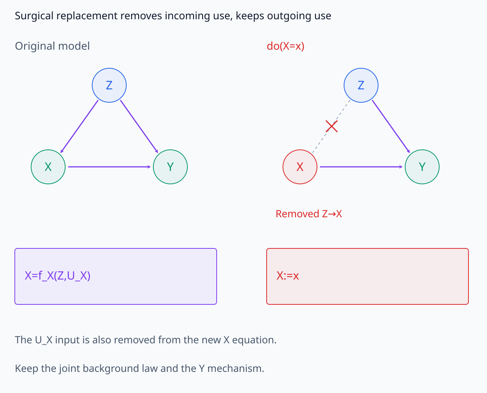
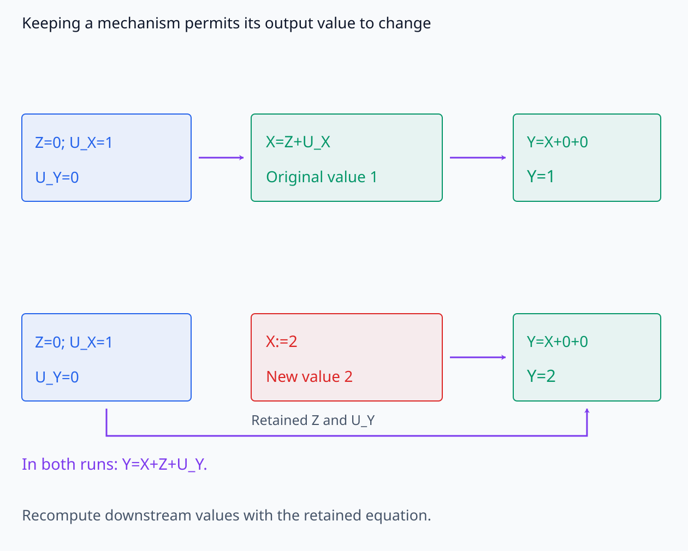
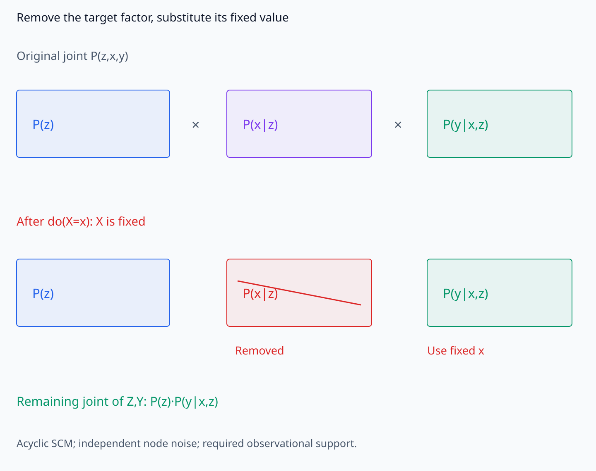
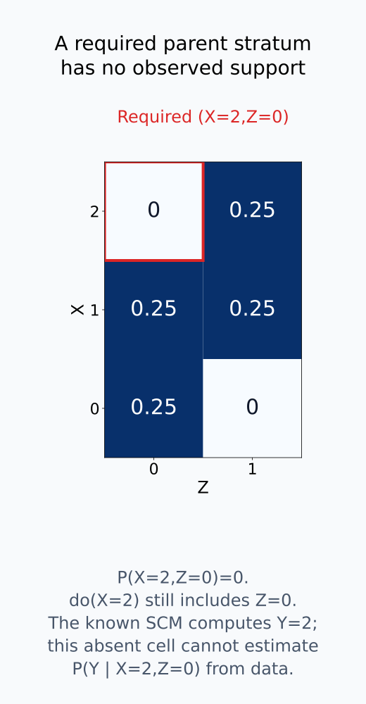
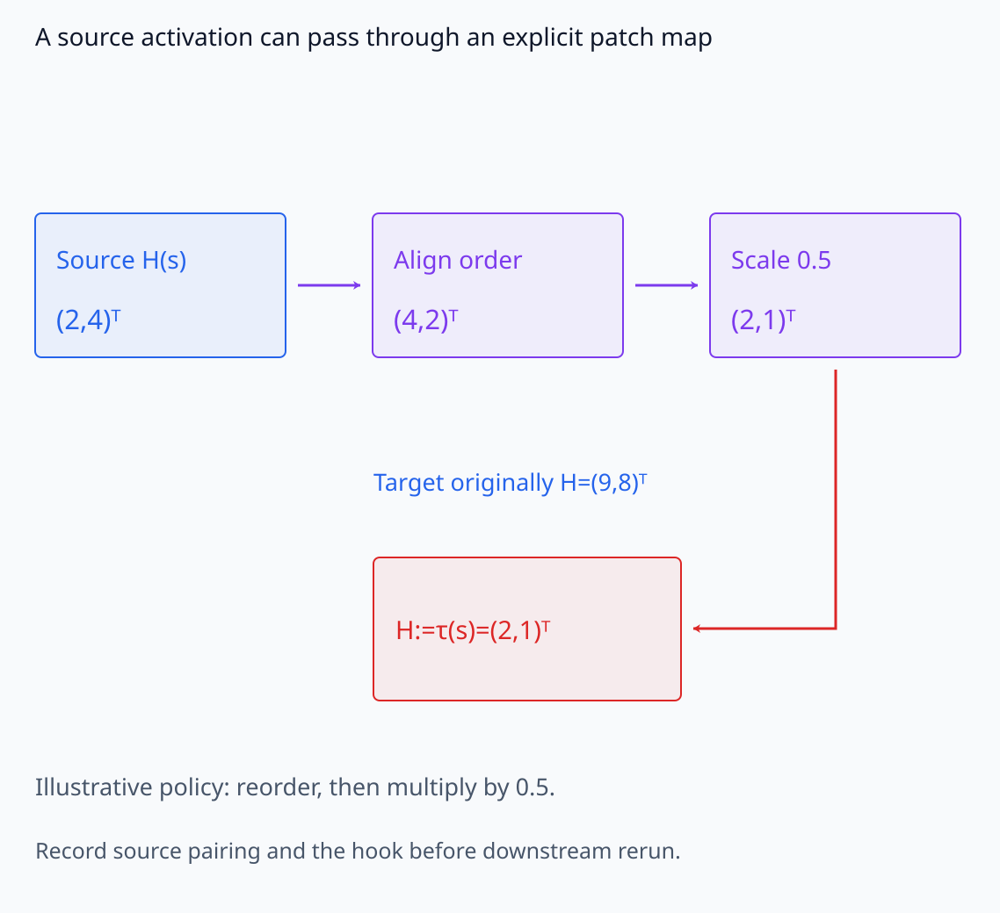
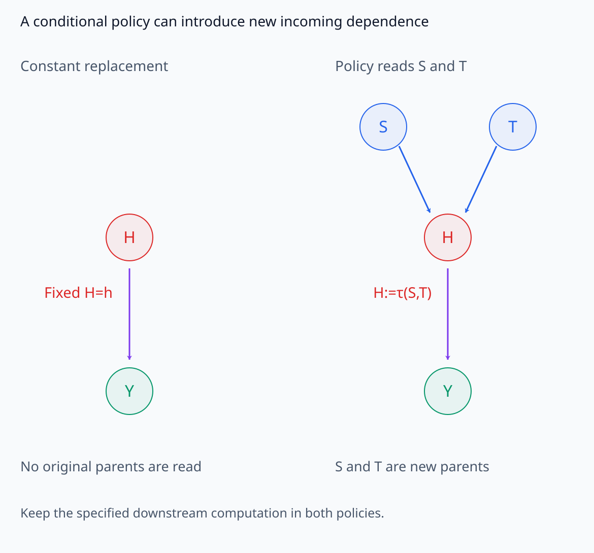
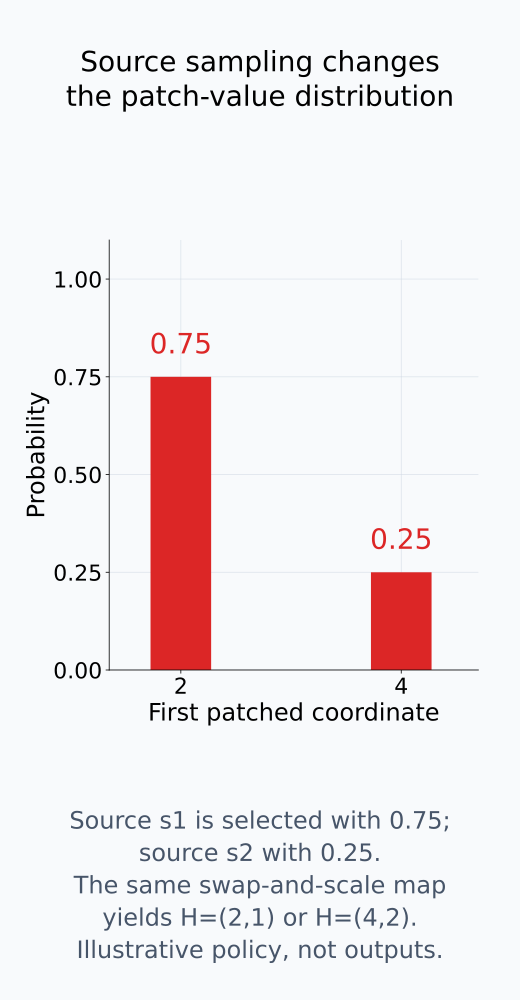
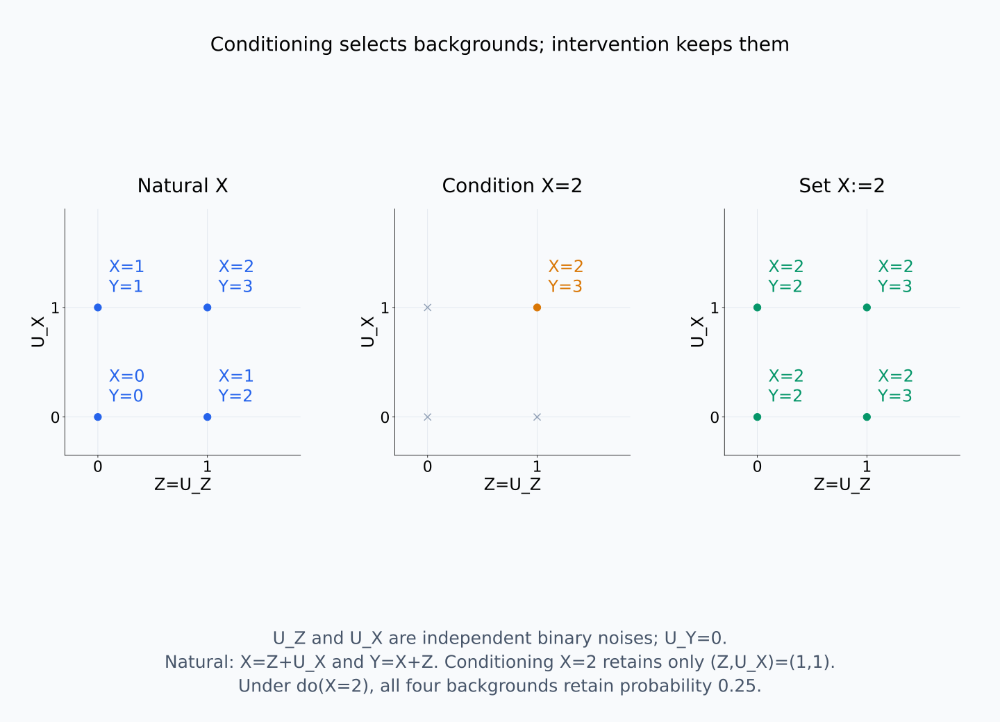
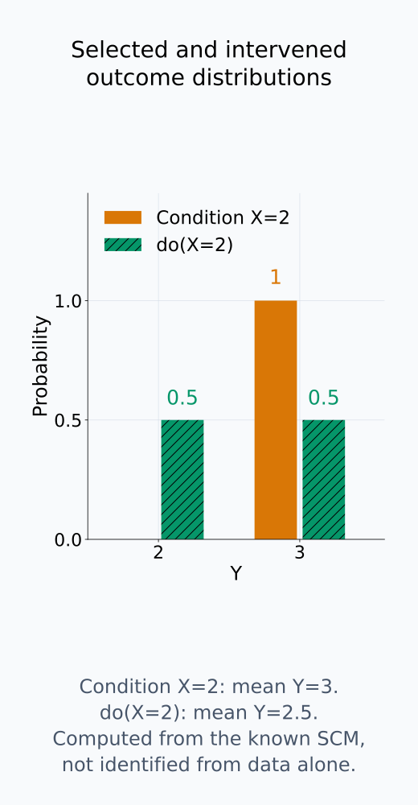

# A09-CAU-02. do 연산과 intervention

## 이 단원이 필요한 이유

conditioning은 관찰한 subset을 고르고 intervention은 structural equation을 바꾼다. activation ablation이나 patching을 causal experiment로 해석하려면 어떤 equation을 어떤 값 생성 규칙으로 교체했는지 적어야 한다.

## 학습 목표

- $P(Y\mid X=x)$와 $P(Y\mid\operatorname{do}(X=x))$를 구분할 수 있다.
- surgical intervention을 equation replacement로 표현할 수 있다.
- truncated factorization을 간단한 DAG에 적용할 수 있다.
- activation patching의 intervention policy를 명시할 수 있다.

## 선수지식 확인

- 선수 단원: [M04-16 상관관계와 인과관계](../../part-1-foundations/M04/M04-16-correlation-causation.md), [I07-05 관찰과 개입](../../part-3-interpretability/I07/I07-05-observation-intervention.md), [A09-CAU-01 구조적 인과모형](A09-CAU-01-structural-causal-models.md)
- 확인 질문: $X=x$인 sample만 고르는 일과 모든 unit의 $X$ equation을 constant $x$로 바꾸는 일은 왜 다른가?

## 기호와 용어

| 기호·용어 | Common spoken reading | 의미 | shape·범위 |
|---|---|---|---|
| $\operatorname{do}(X=x)$ | `do X equals x` | $X$ equation을 constant $x$로 교체하는 intervention | operation |
| $P(Y\mid\operatorname{do}(X=x))$ | `the distribution of Y under do X equals x` | interventional outcome distribution | probability distribution |
| $\mathcal M_x$ | `the intervened model M sub x` | $\operatorname{do}(X=x)$를 적용한 SCM | model object |
| $\tau(s)$ | `tau of source s` | source에서 교체할 activation 값을 정하는 patch policy | map |

## 핵심 개념

### mechanism 하나를 교체한다

intervention $\operatorname{do}(X=x)$는 원래 equation

$$
X=f_X(\operatorname{pa}_X,U_X)
$$

를 $X:=x$로 교체하고 나머지 equation과 exogenous joint distribution $P_U$는 유지한다. 새 equation은 원래 parent와 $U_X$를 읽지 않으므로 $X$로 들어오던 edge를 제거한다. $X$를 사용하는 downstream equation은 그대로 두어 새 값 $x$를 받아 계산한다. 따라서 outgoing edge까지 제거하거나 downstream activation을 원래 값으로 고정하는 조작은 이 intervention과 다르다.

여기서 나머지 mechanism을 유지한다는 것은 함수의 형태를 유지한다는 뜻이다. 그 함수의 입력과 출력값은 개입 때문에 달라질 수 있다. $X$를 patch한 뒤 downstream forward pass를 다시 계산하는 이유가 이것이다.

두 그림은 X로 들어오는 관계를 제거하는 일과 새 X를 받아 downstream 값을 다시 계산하는 일을 구분한다.

<figure class="lesson-figure lesson-figure--wide" markdown="1">

<figcaption>오른쪽은 X의 생성 규칙을 constant X:=x로 바꾸어 Z→X를 제거한다. 새 equation은 U_X도 읽지 않는다. Z→Y와 X→Y는 유지하므로 Y는 새 X와 원래 배경을 받아 다시 계산한다. 회색 점선과 빨간 ×는 제거한 관계를 비교용으로 표시한다.</figcaption>

</figure>

<figure class="lesson-figure lesson-figure--wide" markdown="1">

<figcaption>같은 배경 Z=0, U_X=1, U_Y=0에서 원래 X=1, Y=1이다. X:=2 뒤에도 Y=X+Z+U_Y라는 함수는 유지하지만 입력 X가 달라져 Y=2로 다시 계산한다. 나머지 mechanism을 유지한다는 조건은 downstream 값을 원래대로 얼려 둔다는 뜻이 아니다.</figcaption>

</figure>

### 선택한 unit과 바꾼 mechanism의 차이

conditioning $P(Y\mid X=x)$는 원래 data-generating process에서 $X=x$인 unit을 선택한다. 이 선택으로 background variable의 분포가 $P_U$에서 $P_U(\cdot\mid X=x)$로 달라질 수 있다. intervention에서는 unit을 $P_U$에서 뽑은 채 $X$ mechanism만 교체한다. 두 분포의 차이는 $X$의 값 자체보다 그 값을 어떤 과정으로 만들었는지에 있다.

예를 들어 $Z\to X$, $Z\to Y$, $X\to Y$인 acyclic model에서 각 변수의 noise가 서로 독립이라고 하자. 필요한 $(x,z)$ 조합이 관찰 support에 있어 conditional outcome을 정의할 수 있을 때, 이산 변수의 관찰과 개입을 비교하면

$$
P(y\mid X=x)=\sum_zP(y\mid x,z)P(z\mid X=x),
\qquad
P(y\mid\operatorname{do}(X=x))=\sum_zP(y\mid x,z)P(z)
$$

이다. 첫 식은 선택된 unit의 $Z$ 비율로 평균하고, 둘째 식은 원래 population의 $Z$ 비율로 평균한다. 같은 conditional outcome을 사용하더라도 평균의 가중치가 다르면 결과가 달라진다. 원래부터 $X$가 outcome의 배경과 독립인 경우 등에는 두 결과가 같을 수도 있다.

### truncated factorization의 조건과 대입

각 node의 exogenous noise가 서로 독립인 acyclic SCM에서는 joint distribution을 parent별 conditional probability의 곱으로 쓸 수 있다. 이때 $X$ equation을 교체한 model의 분포는 $X$의 factor를 제거하고 나머지 factor의 parent 값에 $X=x$를 대입하여 얻는다. 이 conditional probability를 관찰 분포에서 읽을 때는 개입 뒤 필요한 parent 조합에도 관찰 support가 있다고 가정한다. $V_{-X}$를 $X$를 제외한 endogenous variable들의 묶음이라고 쓰면

$$
P(V_{-X}=v_{-X}\mid\operatorname{do}(X=x))
=\left.\prod_{i:V_i\ne X}P(v_i\mid\operatorname{pa}_i)\right|_{X=x}
$$

이다. $X$ 자체도 joint에 포함하고 싶다면 $X=x$에 probability 1을 두는 factor를 추가한다. $Z,X,Y$ 예제에서는 $P(z)P(x\mid z)P(y\mid x,z)$에서 $P(x\mid z)$만 제거하므로 $P(z)P(y\mid x,z)$가 남는다. $Y$의 분포는 여기서 $z$를 합산해 구한다.

확률의 chain rule로 얻은 임의의 factorization은 이런 equation 교체를 정당화하지 않는다. 관찰 변수에 숨은 common cause가 있는데도 그 변수를 생략한 DAG의 conditional factor를 그대로 사용해서는 안 된다. 또한 관찰되지 않는 $(x,z)$ 조합의 conditional outcome은 관찰 자료만으로 추정할 수 없으므로, 관찰 분포로 이 식을 계산하려면 해당 조합의 support도 확인해야 한다.

factor를 제거하는 과정과 개입에 필요한 parent 조합의 support를 별도로 비교해 보자.

<figure class="lesson-figure lesson-figure--wide" markdown="1">

<figcaption>원래 causal factorization의 세 factor 중 P(x|z)를 제거하고, 남은 Y factor에서 parent X에 fixed value x를 대입한다. 남은 식은 X를 제외한 Z·Y의 joint이므로 P(z)·P(y|x,z)다. 관찰 conditional로 계산하려면 독립 noise를 갖는 acyclic SCM 조건과 필요한 parent 조합의 support를 함께 확인한다.</figcaption>

</figure>

<figure class="lesson-figure" markdown="1">

<figcaption>관찰 joint에서는 X=2, Z=0 cell의 probability가 0이다. do(X=2) 뒤에는 Z=0도 남으므로 이 조합의 outcome이 필요하지만 observational conditional P(Y|X=2,Z=0)을 자료에서 읽을 수 없다. 본문의 작은 예제는 알려진 Y equation으로 이 조합도 직접 계산하며, 관찰 identification과 이를 구분한다.</figcaption>

</figure>

### patch 값을 만드는 policy

activation patching에서 $H:=h$로 고정할 수도 있고 source prompt $s$에서 얻은 activation에 alignment와 scale correction을 적용한 $H:=\tau(s)$를 넣을 수도 있다. $s$를 고정한 한 실행에서는 constant replacement이지만, 여러 source를 평균하는 실험에서는 source 선택 분포와 target과의 pairing까지 policy의 일부다. source를 달리 뽑으면 같은 target node에서도 다른 effect를 측정한다.

token position·layer·head와 hook이 적용되는 시점을 고정하고, 교체한 node 뒤에서 계산을 다시 실행해야 한다. policy가 target 실행의 다른 변수도 읽는다면 그 의존성도 명시한다. 그런 policy의 새 equation에는 새로운 incoming dependence가 생길 수 있어, constant do의 모든 incoming edge 제거 설명을 그대로 적용할 수 없다. 일부 좌표만 교체한다면 나머지 좌표를 유지하는 규칙까지 조작 대상에 포함한다.

patch policy의 값 생성 과정, 새 parent 의존성, source 선택 분포는 서로 다른 질문이다.

<figure class="lesson-figure lesson-figure--wide" markdown="1">

<figcaption>설명용 policy τ는 source activation (2,4)ᵀ의 순서를 바꾸어 (4,2)ᵀ로 만들고 0.5를 곱해 (2,1)ᵀ를 target hook에 넣는다. 이는 해당 단원의 특정 모델 결과가 아니라 alignment·scale correction을 τ에 포함하는 예시다. source prompt와 target pairing 및 재계산 시작 hook도 함께 명시한다.</figcaption>

</figure>

<figure class="lesson-figure lesson-figure--wide" markdown="1">

<figcaption>왼쪽 constant replacement는 원래 parent 값을 읽지 않는다. 오른쪽 policy가 source S와 target 실행의 T를 읽어 H:=τ(S,T)를 만들면 새 incoming dependence S→H와 T→H가 생긴다. 이 경우에는 constant do의 모든 incoming edge 제거 설명을 그대로 적용하지 않고 policy의 입력을 graph와 equation에 명시한다.</figcaption>

</figure>

<figure class="lesson-figure" markdown="1">

<figcaption>source s₁=(2,4)ᵀ와 s₂=(4,8)ᵀ를 각각 확률 0.75·0.25로 선택하고 같은 순서 변경·0.5 scaling을 적용하면 patch 값은 (2,1)ᵀ·(4,2)ᵀ다. 그림은 첫 patch 좌표의 probability만 표시한다. 여러 source를 평균하는 실험에서는 이 선택 분포도 policy에 들어가며, 실제 output effect를 표시한 것이 아니다.</figcaption>

</figure>

## 작은 예제

$Z=U_Z$, $X=Z+U_X$, $Y=X+Z+U_Y$를 사용한다. $U_Z,U_X$는 서로 독립이며 각각 0과 1을 같은 확률로 갖고, $U_Y=0$으로 두자. $X=2$를 관찰한 unit에서는 $Z=1$, $U_X=1$만 가능하므로 $Y=3$이다.

$\operatorname{do}(X=2)$에서는 $Z$가 0과 1을 여전히 같은 확률로 갖는다. $Y=2+Z$이므로 outcome은 2 또는 3이고 평균은 2.5이다. 관찰 평균 3과 개입 평균 2.5의 차이는 관찰 선택이 $Z$의 비율을 바꾸었기 때문에 생긴다. 이 model에서는 실제 $X$ equation을 교체해 계산했으며, 자료에 없는 $(X=2,Z=0)$의 outcome을 관찰 자료만으로 추정한 것은 아니다.

같은 background 좌표에서 conditioning과 intervention을 비교한 뒤 outcome 분포를 계산한다.

<figure class="lesson-figure lesson-figure--wide" markdown="1">

<figcaption>U_Z와 U_X가 독립 binary이며 각각 0·1에 확률 0.5일 때 원래 background 조합 네 개의 확률은 0.25씩이다. X=2를 관찰하면 (1,1) 조합만 남지만 do(X=2)는 네 background를 그대로 유지하고 X 식만 교체한다. 오른쪽의 Y는 2와 3으로 나뉘며, 이는 알려진 SCM의 직접 계산이다.</figcaption>

</figure>

<figure class="lesson-figure" markdown="1">

<figcaption>X=2 관찰 선택에서는 Y=3에 probability 1을 두어 평균이 3이다. do(X=2)는 원래 Z 비율을 유지하므로 Y=2·3에 probability 0.5씩 두어 평균이 2.5다. 이 숫자는 observational conditional만으로 추정한 값이 아니라 본문 SCM의 equation을 바꾸어 계산한 값이다.</figcaption>

</figure>

## 흔한 오해

- activation을 저장해 보는 것은 observation이며 intervention이 아니다.
- 여러 node를 동시에 patch한 효과를 각 node의 개별 effect 합으로 볼 수는 없다.

## 연습문제

### 1. edge removal
$Z\to X$, $Z\to Y$, $X\to Y$ graph에서 $\operatorname{do}(X=x)$ 뒤 제거되는 edge는 무엇인가?

해설 보기

$X$로 들어오는 $Z\to X$가 제거된다. $X\to Y$와 $Z\to Y$는 유지된다.

### 2. factorization
$P(z,x,y)=P(z)P(x\mid z)P(y\mid x,z)$에서 $\operatorname{do}(X=x)$ 뒤 factorization을 쓰라.

해설 보기

$P(z,y\mid\operatorname{do}(x))=P(z)P(y\mid x,z)$이다.

### 3. policy
clean prompt의 layer 5 activation을 corrupted prompt에 넣는 intervention을 한 줄로 표현하라.

해설 보기

$H_5(\text{corrupted}):=H_5(\text{clean})$처럼 source와 target을 함께 적는다.

### 4. 모델 해석
zero ablation과 mean ablation의 effect가 다르면 무엇을 결론내리는가?

해설 보기

effect가 intervention value에 민감하다는 뜻이다. component의 단일한 causal effect로 합치지 말고 각 intervention policy의 effect를 따로 보고한다.

## 근거와 갱신 경계

do 연산은 modular structural equation replacement를 가정한다. 실제 neural intervention은 off-manifold state와 downstream normalization을 만들 수 있으므로 조작 타당성을 별도로 진단한다.

equation replacement와 truncated factorization의 독립 noise 조건은 [Pearl, An Introduction to Causal Inference](https://ftp.cs.ucla.edu/pub/stat_ser/r354-reprint-corrected.pdf)의 3.2.1~3.2.3절, 특히 Corollary 1을 기준으로 확인했다. 위 binary 예제는 명시한 SCM을 직접 계산한 것이다.

## 단원 요약

- conditioning은 unit 선택이고 do intervention은 equation replacement이다.
- surgical intervention은 target node로 들어오는 edge를 끊는다.
- truncated factorization은 intervention target의 conditional factor를 제거한다.
- patching은 source·target·alignment를 포함한 policy로 정의한다.

## 통과 기준

- conditioning과 intervention distribution을 구분할 수 있는가?
- 내부 patch를 재현 가능한 equation replacement로 쓸 수 있는가?

## 다음 단원

- [A09-CAU-03 confounding과 identifiability](A09-CAU-03-confounding-identifiability.md)

## 집필자 점검표

- [x] do 연산·truncated factorization·patch policy를 연결했다.
- [x] 문제 4개에 해설이 있다.
- [x] Common spoken reading이 실제 영어 학술 발화이며 한글 음역이나 기계적 직역을 포함하지 않는다.
- [x] 선수지식과 링크를 확인했다.
