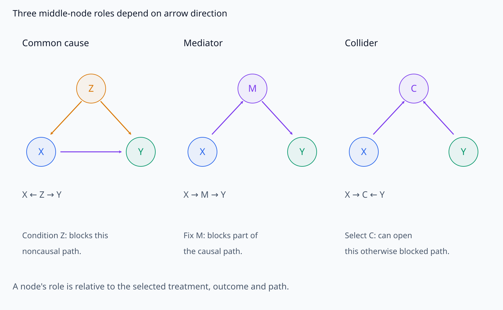
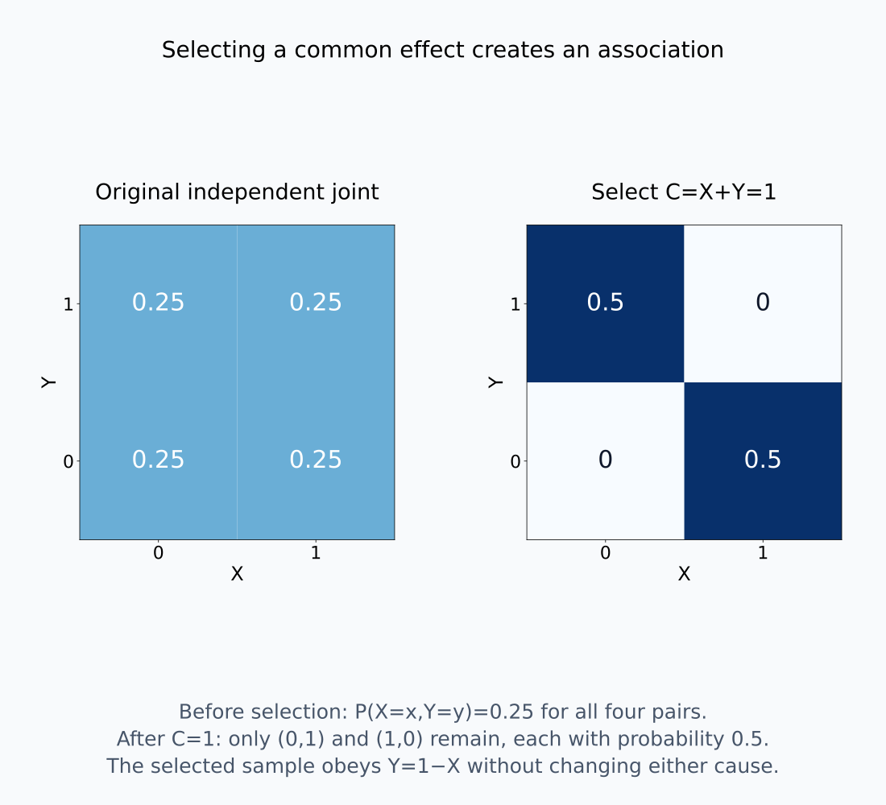
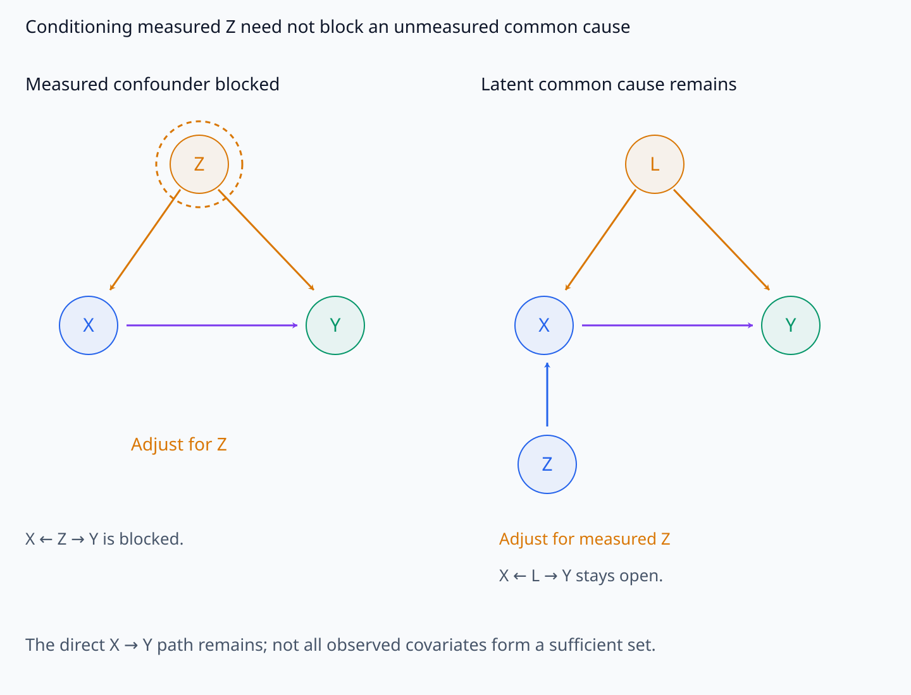
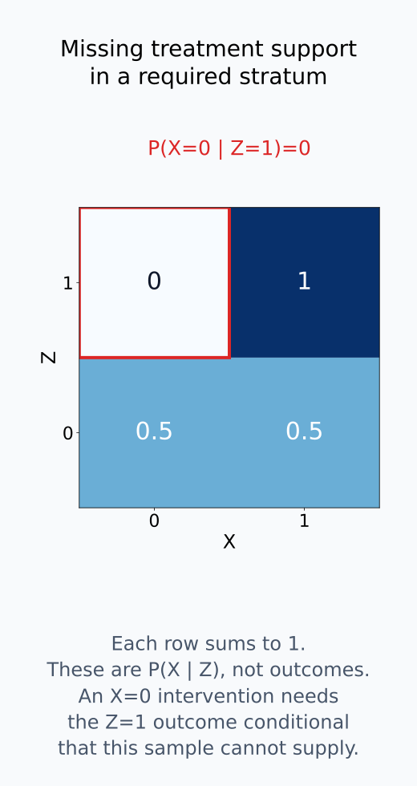
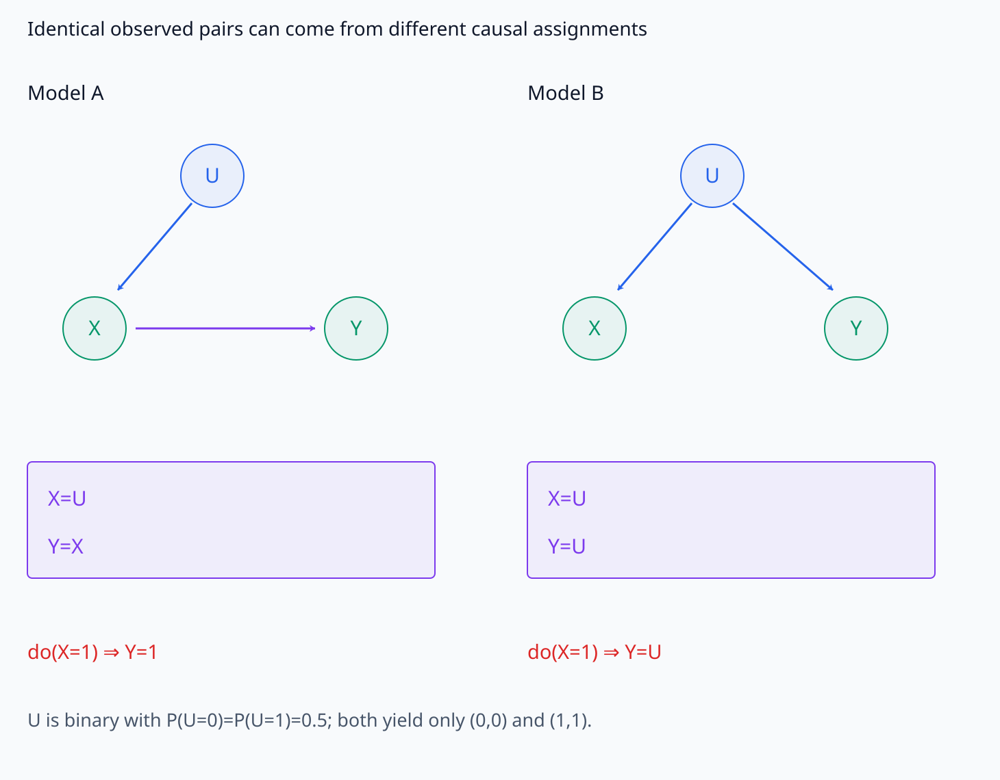
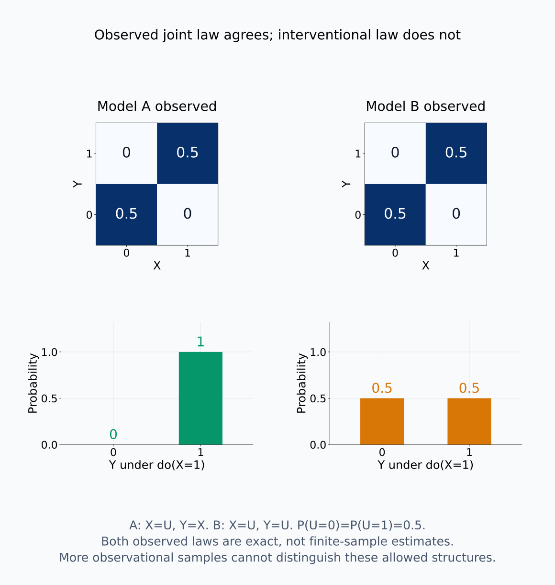
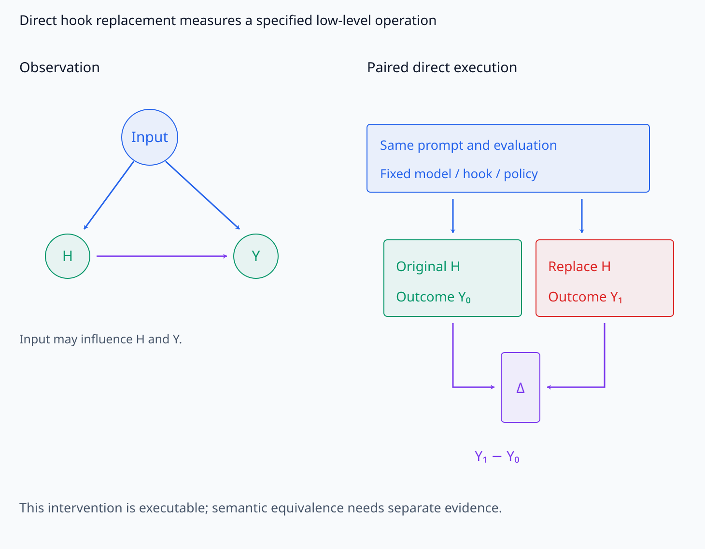
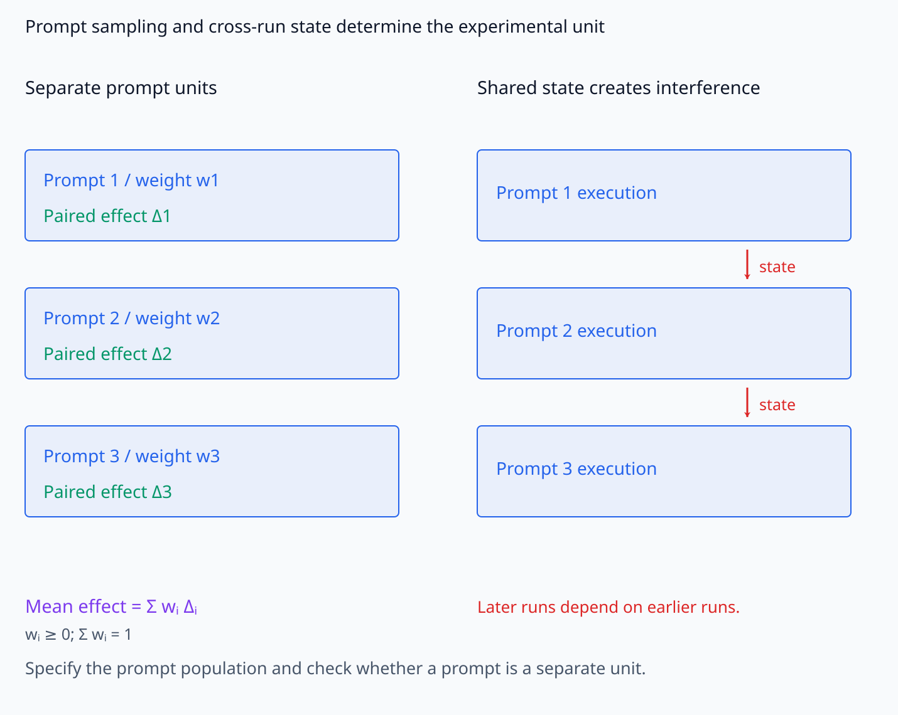
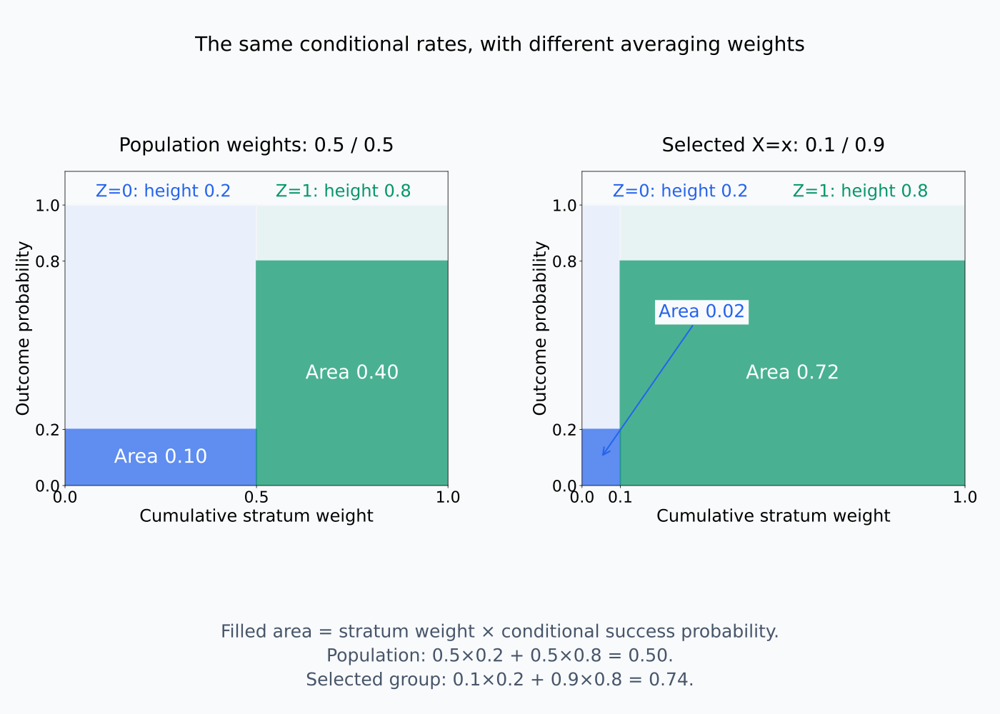

# A09-CAU-03. confounding과 identifiability

## 이 단원이 필요한 이유

common cause는 treatment와 outcome의 관찰 association에 causal path가 아닌 성분을 만든다. causal estimand를 observational distribution에서 계산하려면 graph와 가정이 identification formula를 허용해야 한다. 내부 activation과 output의 correlation에도 upstream input feature가 common cause로 작용할 수 있다.

## 학습 목표

- confounder, mediator와 collider를 graph에서 구분할 수 있다.
- backdoor adjustment formula를 적용할 수 있다.
- identifiability와 statistical estimation을 구분할 수 있다.
- 내부 intervention에서 direct execution과 observational identification의 역할을 구분할 수 있다.

## 선수지식 확인

- 선수 단원: [M04-02 조건부확률과 Bayes 규칙](../../part-1-foundations/M04/M04-02-conditional-probability-bayes-rule.md), [M04-16 상관관계와 인과관계](../../part-1-foundations/M04/M04-16-correlation-causation.md), [A09-CAU-02 do 연산과 intervention](A09-CAU-02-do-operator-interventions.md)
- 확인 질문: $Z$가 $X$와 $Y$의 common cause이면 $X$와 $Y$ 사이에 어떤 noncausal path가 열리는가?

## 기호와 용어

| 기호·용어 | Common spoken reading | 의미 | shape·범위 |
|---|---|---|---|
| $Z\to X$ and $Z\to Y$ | `Z causes both X and Y` | $Z$가 만든 backdoor path | graph pattern |
| $P(y\mid\operatorname{do}(x))$ | `the distribution of y under do x` | 식별하려는 interventional distribution | distribution |
| $\sum_zP(y\mid x,z)P(z)$ | `sum over z of P of y given x and z times P of z` | discrete backdoor adjustment | probability |
| $Y\perp X\mid Z$ | `Y is independent of X given Z` | conditional independence statement | relation |

## 핵심 개념

### common cause와 mediator와 collider

$Z\to X$, $Z\to Y$, $X\to Y$ graph에서 path $X\leftarrow Z\to Y$는 $X$를 바꾸어서 $Y$로 전달하는 directed path와 다르다. $Z$의 변동이 $X$와 $Y$를 함께 바꾸므로, 관찰한 $X$–$Y$ association에는 이 common cause의 영향도 섞일 수 있다. 이 관계에서 $Z$는 confounder 역할을 한다.

$X\to M\to Y$의 $M$은 mediator이다. $X$의 변화가 $M$을 거쳐 $Y$에 전달되므로, total effect를 구하려고 $M$을 고정하면 측정하려던 causal path의 일부를 차단한다. $X\to C\leftarrow Y$의 $C$는 collider이다. 이 path에서는 두 화살표가 $C$에서 만난다. $C$나 그 descendant를 조건화하지 않으면 collider가 path를 막지만, 조건화하면 path를 열 수 있다. 같은 변수가 어느 역할을 하는지는 비교하는 treatment·outcome과 path에 따라 정한다.

예를 들어 독립인 binary $X,Y$가 각각 0과 1을 같은 확률로 갖고 $C=X+Y$라고 하자. 원래 $X,Y$는 독립이지만 $C=1$인 sample만 고르면 $Y=1-X$이다. common effect를 고르는 것만으로 두 원인 사이에 association이 생긴다. 따라서 조건화할 변수가 많다는 이유만으로 confounding을 더 잘 통제했다고 판단할 수 없다.

node 역할은 화살표 방향으로, collider 선택의 효과는 joint probability 변화로 확인한다.

<figure class="lesson-figure lesson-figure--wide" markdown="1">

<figcaption>Z의 두 outgoing edge는 backdoor fork를 만들고 M은 X→Y causal chain 위에 있다. C에서는 X·Y의 화살표가 만나며 이 collider를 선택하면 원래 막힌 path를 열 수 있다. 아래 문장은 각 path에 대한 조건화·고정의 역할을 비교하며 다른 path의 존재 여부까지 보장하지 않는다.</figcaption>

</figure>

<figure class="lesson-figure lesson-figure--wide" markdown="1">

<figcaption>독립인 X·Y의 joint은 네 cell에 probability 0.25씩을 둔다. C=X+Y=1인 sample을 선택하면 (0,1)과 (1,0)만 남고 각각 probability 0.5다. 결과적으로 Y=1−X라는 관계가 생기며, 이는 X를 개입해 바꾼 결과가 아니라 common effect 선택으로 생긴 association이다.</figcaption>

</figure>

### backdoor set과 평균의 가중치

backdoor path는 $X$에서 시작할 때 첫 edge의 화살표가 $X$로 들어오는 path이다. adjustment set $Z$가 $X$의 descendant를 포함하지 않고 이런 path를 모두 막으면 backdoor criterion을 만족한다. 여기서 path를 막는다는 것은 path 위의 non-collider를 조건화하여 차단하거나 collider를 열지 않는 조건을 적용한다는 뜻이다. 관찰하지 못한 common cause도 필요한 경우 latent node로 표현해야 한다. 측정한 변수만 그린 graph에서 path가 없다는 이유로 충분한 set이라고 판단해서는 안 된다.

이 조건과 필요한 관찰 support 아래

$$
P(y\mid\operatorname{do}(x))
=\sum_z P(y\mid x,z)P(z)
$$

로 causal distribution을 식별할 수 있다. backdoor 조건은 같은 $z$ stratum 안의 관찰 outcome $P(y\mid x,z)$를 해당 stratum에 $x$를 설정한 outcome으로 사용할 근거를 준다. 그다음 모든 unit에 $x$를 설정한 population의 결과를 구하려고 원래 $P(z)$로 평균한다. 관찰된 treatment group의 $P(z\mid x)$를 사용하면 다시 선택된 group의 결과를 계산하게 된다.

discrete $Z$의 positivity는 $P(z)>0$인 필요한 stratum에서 $P(X=x\mid Z=z)>0$이어야 한다는 조건이다. 그 값이 0이면 outcome의 conditional probability를 자료에서 읽을 수 없다. 0보다 크더라도 너무 작으면 해당 조합의 sample이 적어 estimation이 불안정할 수 있다. continuous 변수에서는 합을 적분으로 바꾸며, positivity도 점의 probability가 아니라 필요한 값 주변의 support 또는 density로 해석한다.

충분한 adjustment set과 필요한 treatment support는 서로 다른 조건이다.

<figure class="lesson-figure lesson-figure--wide" markdown="1">

<figcaption>왼쪽의 Z를 조정하면 표시된 backdoor path X←Z→Y를 막는다. 오른쪽은 latent L이 X와 Y의 common cause이고 측정한 Z는 X의 parent일 뿐이므로 Z만 조정해도 X←L→Y가 남는다. 각 예시는 X→Y directed path를 유지하며, 측정 변수 목록만으로 충분한 adjustment set을 판정할 수 없다는 점을 보여 준다.</figcaption>

</figure>

<figure class="lesson-figure" markdown="1">

<figcaption>설명용 treatment probability에서 Z=0 stratum은 X=0·1을 모두 허용하지만 Z=1은 X=1만 허용한다. 빨간 빈 cell은 X=0 개입 평균에 필요한 Z=1 outcome을 관찰 자료에서 읽을 수 없는 이유를 표시한다. 표의 X probability는 outcome probability와 다르다.</figcaption>

</figure>

### identification과 estimation의 순서

identifiability는 주어진 인과 가정을 만족하고 같은 observational distribution을 만드는 model들이 목표 causal estimand에도 같은 값을 주는가를 묻는다. 모두 같으면 그 estimand를 관찰 분포의 함수로 표현할 수 있다. estimation은 finite data로 conditional probability와 population weight 등을 추정해 그 함수를 계산하는 단계다. identifiable하더라도 적은 sample·불균형한 stratum·부적절한 estimator 때문에 오차가 클 수 있다.

관찰 분포만으로 부족한 경우를 직접 비교해보자. $U$가 0과 1을 같은 확률로 가질 때, model A를 $X=U$, $Y=X$로, model B를 $X=U$, $Y=U$로 둔다. 두 model의 관찰 자료에서는 $(X,Y)=(0,0)$과 $(1,1)$만 같은 확률로 나타난다. 그러나 $\operatorname{do}(X=1)$ 뒤에는 A에서 $Y=1$이고 B에서는 여전히 $P(Y=1)=0.5$이다. 이 두 causal structure를 모두 허용하는 가정만으로는 effect를 식별할 수 없다. 관찰 sample을 늘려도 두 분포가 같다는 점은 바뀌지 않는다.

동일 관찰 joint을 만드는 equation과 그 equation을 교체한 결과를 비교해 보자.

<figure class="lesson-figure lesson-figure--wide" markdown="1">

<figcaption>A에서는 U→X→Y이고 B에서는 U가 X·Y의 common cause다. 원래 실행은 두 model 모두 X=Y=U를 만들지만 X:=1 뒤에는 A의 Y=X는 1이 되고 B의 Y=U는 원래 background를 유지한다. 허용하는 model 범위에 둘이 모두 있으면 관찰 joint만으로 이 개입 결과를 정할 수 없다.</figcaption>

</figure>

<figure class="lesson-figure lesson-figure--wide" markdown="1">

<figcaption>위쪽 두 joint은 같은 관찰 probability를 보여 준다. 아래쪽은 known equation에 do(X=1)을 적용한 분포로, A는 P(Y=1)=1이고 B는 P(Y=1)=0.5다. 관찰 sample을 더 많이 모아 위 joint을 더 정확히 추정해도 허용된 두 구조의 causal 차이는 사라지지 않는다.</figcaption>

</figure>

### 직접 실행하는 internal intervention

neural network에서는 같은 input property가 activation $H$와 output $Y$를 함께 결정할 수 있다. 따라서 $H$–$Y$ correlation을 관찰해 $H$ effect를 추정하려면 upstream influence를 구분하는 identification 문제가 생긴다. 반면 고정 model을 직접 실행해 지정한 hook에서 $H$를 교체할 수 있다면, 그 low-level intervention의 outcome은 실행으로 얻는다. 이때 관찰 conditional probability로 intervention을 대신 계산할 필요는 없다.

원래 실행과 개입 실행을 같은 prompt·평가 설정으로 pairing하고, 차이를 해당 prompt의 effect로 기록한다. prompt population 평균을 주장하려면 어떤 prompt를 어떤 비율로 sampling했는지 정해야 한다. 한 prompt의 개입이 다른 prompt 실행을 바꾸지 않는다는 조건도 필요하다. 공유 상태의 변화가 다음 실행에 영향을 주거나 batch 간 의존이 있다면 unit을 다시 정의한다. 직접 실행은 지정한 내부 조작을 측정할 근거이며, 그 조작이 human-level concept 변경과 같다는 주장은 별도 근거를 요구한다.

직접 hook을 조작하는 실행 설계와 prompt를 평균하는 sampling·unit 조건을 구분한다.

<figure class="lesson-figure lesson-figure--wide" markdown="1">

<figcaption>왼쪽은 같은 input이 H·Y를 함께 바꿀 수 있음을 보여 준다. 오른쪽은 prompt·평가·model을 고정한 두 실행에서 지정한 H만 조작해 Y₁−Y₀를 구한다. 숫자 결과를 제시한 것이 아니라 측정 설계이며, low-level 조작이 human-level concept 변경과 같다는 결론은 포함하지 않는다.</figcaption>

</figure>

<figure class="lesson-figure lesson-figure--wide" markdown="1">

<figcaption>왼쪽은 각 prompt의 paired effect와 sampling weight를 구분하며, wᵢ≥0·Σwᵢ=1로 평균한다. 오른쪽 빨간 화살표는 한 실행의 state가 다음 실행으로 전달되는 경우로, prompt 하나를 독립 unit으로 취급하는 조건을 다시 확인해야 한다. 표시된 Δ는 설계상의 기호이며 실험에서 측정한 값이 아니다.</figcaption>

</figure>

## 작은 예제

$Z$가 binary이고 $P(Z=1)=0.5$라고 하자. backdoor 조건과 positivity가 성립하며, $P(Y=1\mid X=x,Z=0)=0.2$, $P(Y=1\mid X=x,Z=1)=0.8$이면 개입 뒤의 확률은 $0.2\times0.5+0.8\times0.5=0.5$이다.

만약 관찰된 $X=x$ group에서는 $P(Z=1\mid X=x)=0.9$라면 관찰 확률은 $0.2\times0.1+0.8\times0.9=0.74$이다. stratum별 outcome은 같고 평균의 가중치만 다르다. 0.74를 모든 population에 $x$를 설정한 확률로 읽어서는 안 된다.

가중 평균은 stratum 비율을 너비, conditional outcome을 높이로 표시하면 면적으로 읽을 수 있다.

<figure class="lesson-figure lesson-figure--wide" markdown="1">

<figcaption>각 사각형의 너비는 Z stratum의 비율이고 채운 높이는 해당 stratum의 outcome probability다. 면적은 둘의 곱이므로 population 가중치 0.5·0.5에서는 0.10+0.40=0.50, 관찰 treatment group의 가중치 0.1·0.9에서는 0.02+0.72=0.74다. stratum별 outcome 높이는 바꾸지 않고 평균의 가중치만 바꿨다.</figcaption>

</figure>

## 흔한 오해

- 모든 pre-treatment variable을 조건화하면 되는 것은 아니다. collider conditioning은 path를 열 수 있다.
- graph에서 effect가 identifiable하다는 사실이 estimator의 low variance를 보장하지 않는다.

## 연습문제

### 1. roles
$X\to M\to Y$에서 $M$은 confounder인가 mediator인가?

해설 보기

$X$의 effect를 $Y$로 전달하는 causal path 위에 있으므로 mediator이다.

### 2. adjustment
$Z$가 binary일 때 backdoor formula를 두 항으로 펼쳐 쓰라.

해설 보기

$P(y\mid x,z=0)P(z=0)+P(y\mid x,z=1)P(z=1)$이다.

### 3. positivity
$Z=1$인 모든 unit에서 $X=1$만 관찰됐다. $Z=1$ stratum의 $X=0$ outcome을 standard adjustment로 추정할 수 있는가?

해설 보기

없다. 해당 stratum에서 $P(X=0\mid Z=1)=0$이므로 positivity가 깨진다.

### 4. 모델 해석
country token presence가 head activation과 capital-token logit을 함께 높인다. head의 causal effect를 확인하려면 무엇을 하는가?

해설 보기

country token 조건을 matched control로 고정하고 head activation을 ablate·patch해 logit effect를 측정한다. 관찰 correlation과 intervention effect를 따로 보고한다.

## 근거와 갱신 경계

backdoor adjustment는 causal graph가 맞고 adjustment set이 충분하다는 가정에 의존한다. do-calculus의 완전한 identification algorithm은 다루지 않는다.

backdoor criterion과 identifiability의 정의는 [Pearl, Causal Diagrams for Empirical Research](https://ftp.cs.ucla.edu/pub/stat_ser/R218-B.pdf)의 3.1절, Definition 3~4와 Theorem 1을 기준으로 확인했다. collider·가중 평균·두 model의 예제는 명시한 변수와 equation에서 직접 계산했다.

## 단원 요약

- confounding은 treatment와 outcome의 common cause가 만든다.
- backdoor set은 noncausal path를 막아 adjustment formula를 제공한다.
- identifiability는 infinite data 이전의 구조 문제이다.
- executable internal intervention도 population과 조작 타당성 가정을 필요로 한다.

## 통과 기준

- graph에서 confounder·mediator·collider를 구분할 수 있는가?
- identification과 finite-sample estimation을 구분할 수 있는가?

## 다음 단원

- [A09-CAU-04 mediation의 가정](A09-CAU-04-mediation-assumptions.md)

## 집필자 점검표

- [x] confounding·backdoor·identifiability와 내부 개입을 연결했다.
- [x] 문제 4개에 해설이 있다.
- [x] Common spoken reading이 실제 영어 학술 발화이며 한글 음역이나 기계적 직역을 포함하지 않는다.
- [x] 선수지식과 링크를 확인했다.
