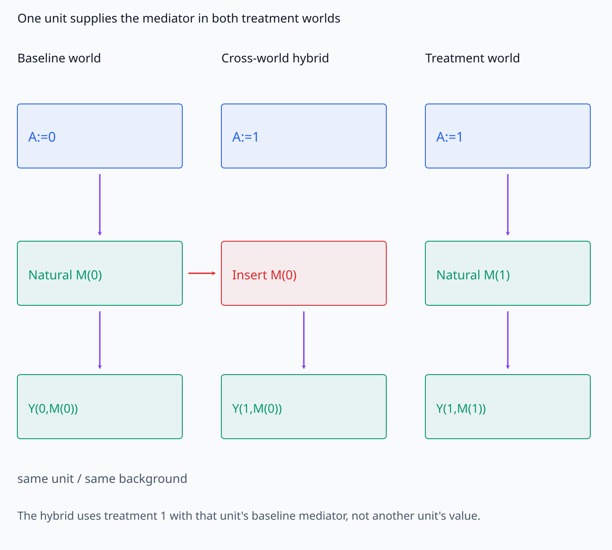
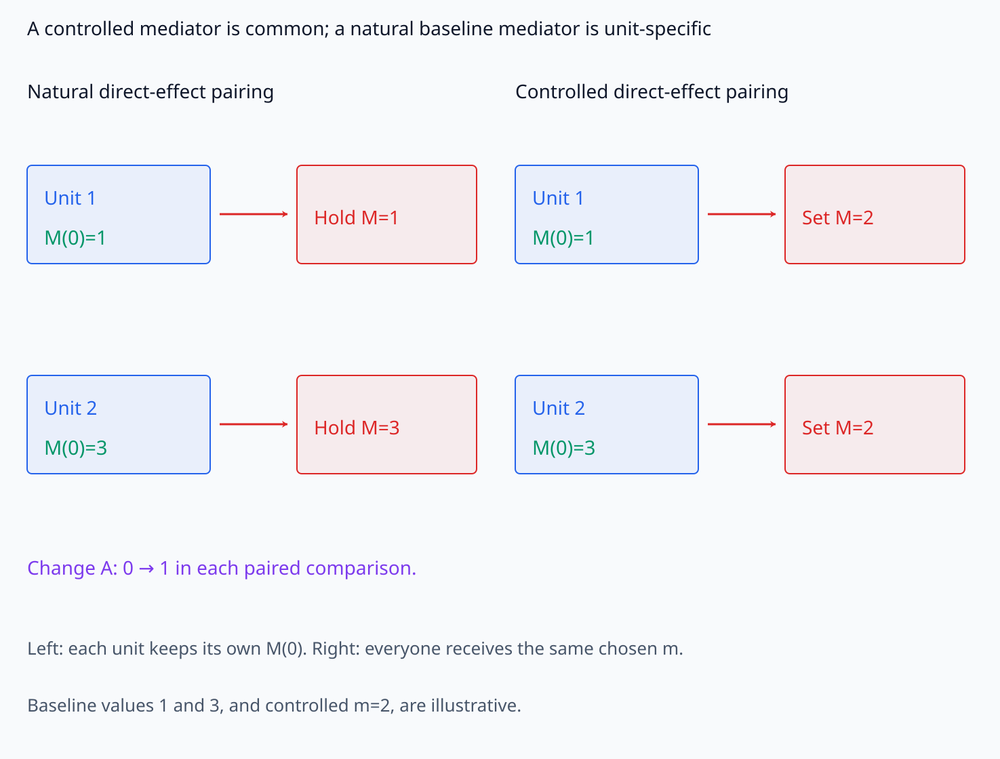
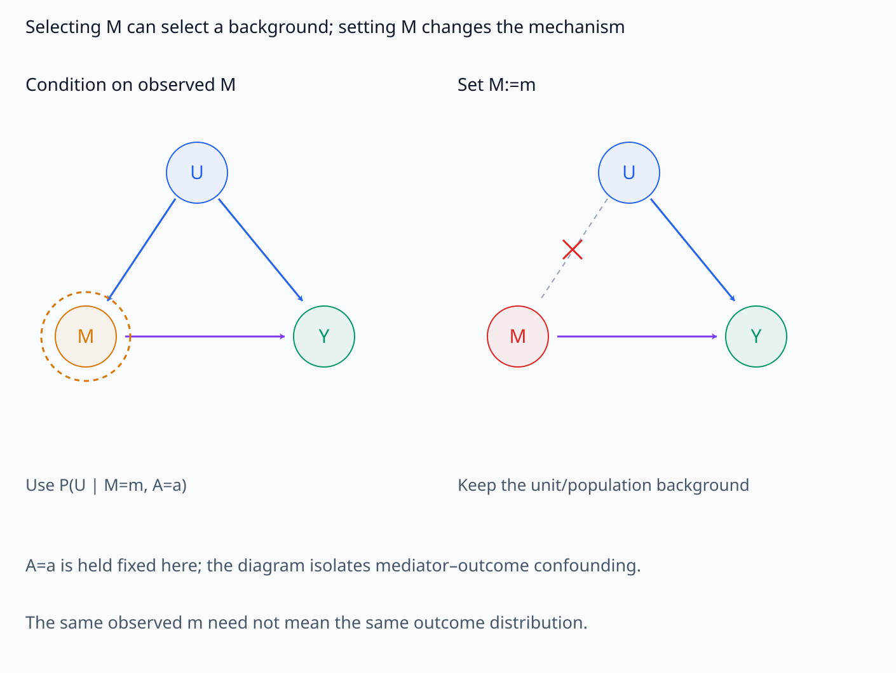
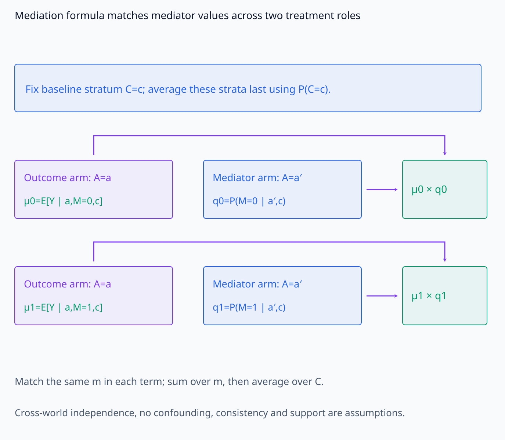
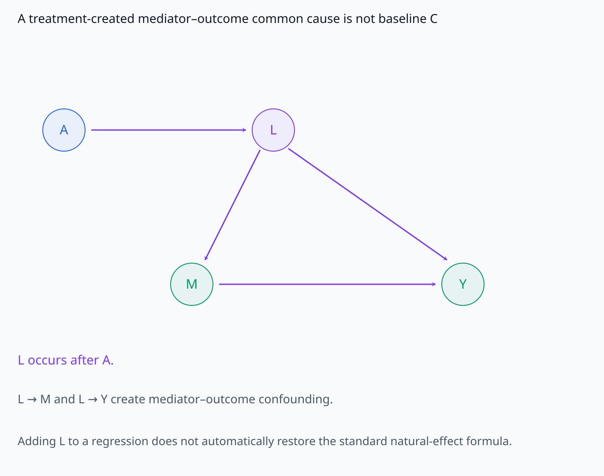
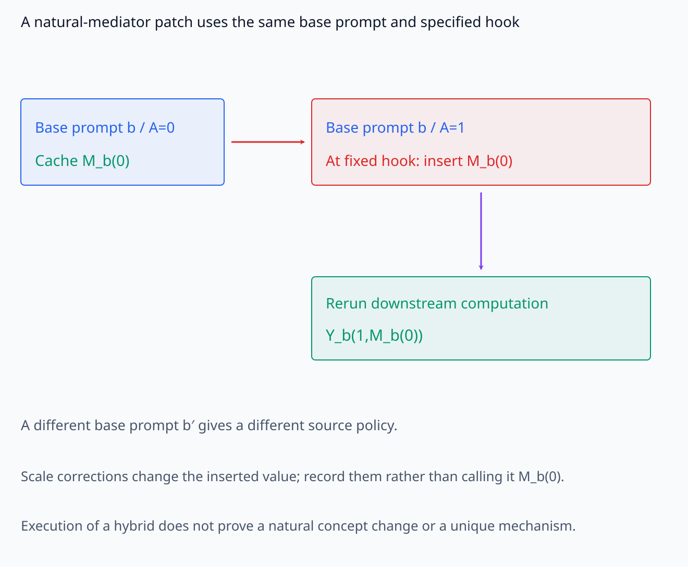
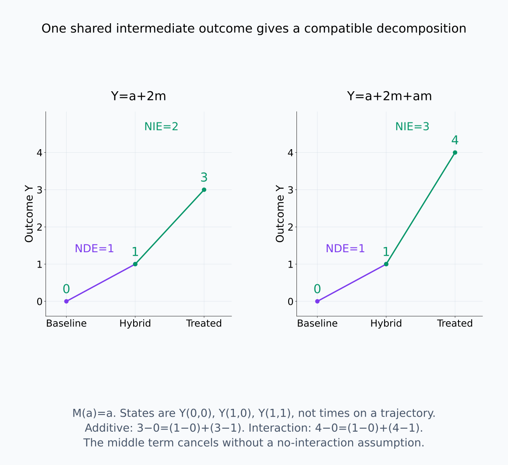
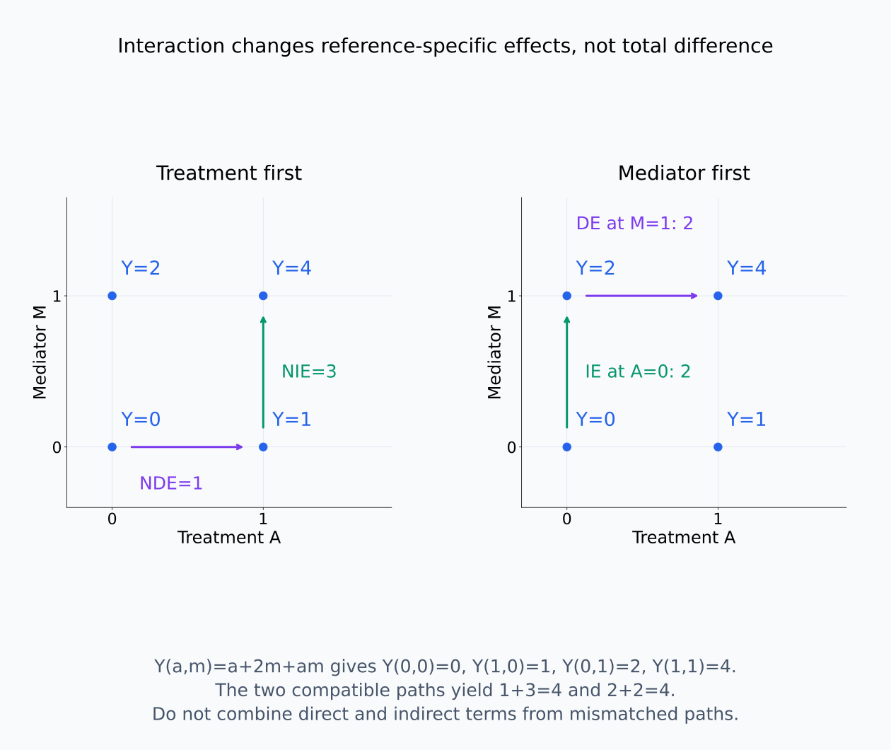
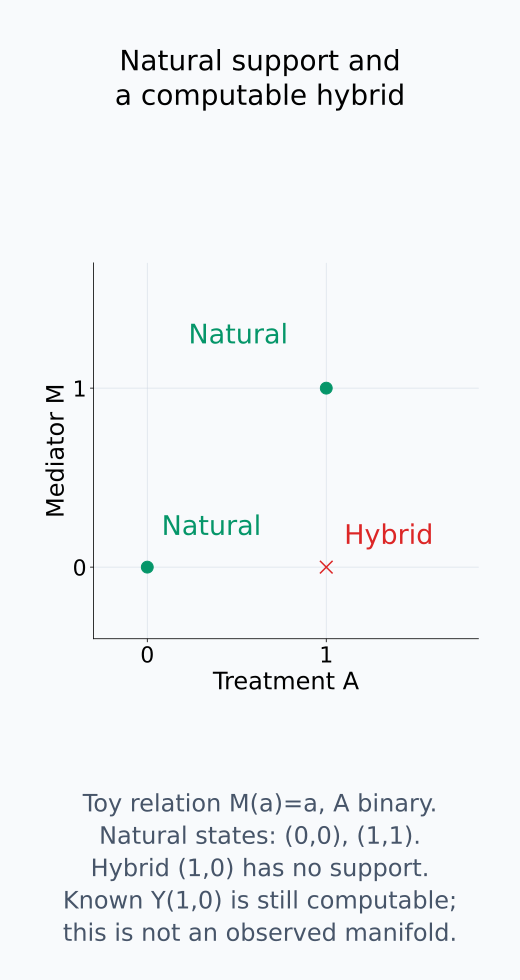

# A09-CAU-04. mediation의 가정

## 이 단원이 필요한 이유

treatment effect가 내부 component를 거쳐 전달된다고 주장하려면 total effect와 direct·indirect effect를 정의해야 한다. mediator를 conditioning하는 회귀계수만으로 path-specific causal effect가 나오지 않는다. natural effect는 서로 다른 intervention world의 potential outcome을 함께 사용하므로 강한 가정을 요구한다.

## 학습 목표

- total, natural direct와 natural indirect effect를 potential outcome으로 쓸 수 있다.
- mediator conditioning과 mediator intervention을 구분할 수 있다.
- natural effect identification에 필요한 가정을 설명할 수 있다.
- neural mediation 결과에서 interaction과 off-manifold 문제를 진단할 수 있다.

## 선수지식 확인

- 선수 단원: [M04-16 상관관계와 인과관계](../../part-1-foundations/M04/M04-16-correlation-causation.md), [I07-13 mediation과 counterfactual](../../part-3-interpretability/I07/I07-13-mediation-counterfactual.md), [A09-CAU-03 confounding과 identifiability](A09-CAU-03-confounding-identifiability.md)
- 확인 질문: $A\to M\to Y$에서 $M$을 관찰값으로 조건화하는 것과 $M$ equation을 바꾸는 것은 왜 다른가?

## 기호와 용어

| 기호·용어 | Common spoken reading | 의미 | shape·범위 |
|---|---|---|---|
| $M(a)$ | `M under treatment a` | treatment $a$ 아래 mediator potential outcome | mediator-valued |
| $Y(a,m)$ | `Y under treatment a and mediator m` | treatment와 mediator를 함께 정한 outcome | outcome-valued |
| $\operatorname{NDE}$ | `the natural direct effect` | mediator를 baseline world에 둔 direct effect | scalar expectation |
| $\operatorname{NIE}$ | `the natural indirect effect` | treatment를 고정하고 mediator world를 바꾼 effect | scalar expectation |
| $C$ | `C` | treatment 이전의 adjustment covariate 묶음 | treatment의 descendant 제외 |

## 핵심 개념

### 같은 unit의 두 world를 비교한다

binary treatment $A\in\{0,1\}$, mediator $M$, outcome $Y$를 생각한다. $M(a)$는 한 unit에 treatment $a$를 설정했을 때 자연스럽게 계산되는 mediator 값이다. $Y(a,m)$은 같은 unit의 treatment를 $a$로, mediator를 $m$으로 함께 설정했을 때의 outcome이다. 이 비교에서는 unit의 배경 조건을 유지한다. unit마다 $M(a)$와 $Y(a,m)$의 값이 다를 수 있고, $E$는 고정한 population의 unit들에 대한 평균이다.

total effect는

$$
\operatorname{TE}
=E[Y(1,M(1))-Y(0,M(0))]
$$

이다. 한 가지 compatible decomposition은

$$
\operatorname{NDE}
=E[Y(1,M(0))-Y(0,M(0))],
$$

$$
\operatorname{NIE}
=E[Y(1,M(1))-Y(1,M(0))]
$$

이다. NDE에서는 mediator를 각 unit의 baseline 값 $M(0)$으로 유지하며 treatment만 바꾼다. NIE에서는 treatment를 1에 유지하며 mediator를 $M(0)$에서 $M(1)$로 바꾼다. $M(0)$은 population의 평균 mediator나 다른 unit에서 임의로 뽑은 값이 아니다.

NDE와 NIE를 더하면 중간 항 $Y(1,M(0))$가 소거되어 $\operatorname{TE}=\operatorname{NDE}+\operatorname{NIE}$가 된다. 이 등식에는 additive outcome model이나 no-interaction 가정이 필요하지 않다. 반대로 NDE의 mediator를 $M(1)$로 고정한 채 NIE도 treatment 1에서 정의하면 같은 중간 항이 소거되지 않는다. interaction이 있을 때는 어떤 reference world에서 각 effect를 정의했는지 명시해야 한다.

$Y(1,M(0))$는 treatment 1의 outcome computation에 treatment 0에서 생겼을 mediator를 넣는 cross-world counterfactual이다. 두 world를 서로 다른 두 사람이나 두 prompt로 해석하는 것이 아니라, 같은 unit의 두 설정에서 얻은 값을 조합한다.

같은 unit의 mediator 출처를 먼저 고정하고 세 world를 비교한다.

<figure class="lesson-figure lesson-figure--wide" markdown="1">

<figcaption>세 column은 서로 다른 사람이 아니라 같은 unit의 설정이다. 가운데는 treatment 1을 사용하지만 mediator 입력을 그 unit의 baseline M(0)로 교체해 Y(1,M(0))를 계산한다. 빨간 옆 화살표가 cross-world mediator의 출처를 표시한다.</figcaption>

</figure>

### mediator를 고르는 것과 설정하는 것

$E[Y\mid A=a,M=m]$은 실제로 그 treatment와 mediator를 관찰한 unit을 선택한 평균이다. $E[Y(a,m)]$은 population의 unit들에 treatment와 mediator를 설정한 평균이다. mediator와 outcome의 common cause가 있으면 $M=m$ 선택으로 그 배경의 비율도 달라지므로 두 평균은 같지 않을 수 있다.

mediator를 모든 unit에서 같은 $m$으로 고정하고 treatment를 바꾸는 controlled direct effect는 $E[Y(1,m)-Y(0,m)]$이다. NDE는 이와 달리 각 unit의 $M(0)$을 유지한다. 이 구분 때문에 mediator를 회귀의 covariate로 넣은 treatment coefficient를 곧바로 NDE라고 읽을 수 없다. 먼저 그 회귀가 어떤 intervention outcome을 추정하며 어떤 functional form과 identification 가정을 사용하는지 확인해야 한다.

조건화와 setting, 그리고 controlled 값과 natural baseline 값은 각각 다른 구분이다.

<figure class="lesson-figure lesson-figure--wide" markdown="1">

<figcaption>설명용 unit 1·2의 baseline mediator를 1·3으로 두었다. NDE는 각 unit의 M(0)를 유지하고 A를 바꾸며, controlled direct effect는 두 unit 모두 같은 chosen m=2를 받게 하고 A를 바꾼다. 이 baseline 값들은 아래 M(a)=a의 수치 예제와 별개의 정의 설명용 값이다.</figcaption>

</figure>

<figure class="lesson-figure lesson-figure--wide" markdown="1">

<figcaption>이 graph는 A=a를 고정한 뒤 mediator–outcome common cause U만 분리해 그린다. 관찰 M=m 선택은 배경을 P(U|M=m,A=a)로 고를 수 있지만 M:=m은 mediator mechanism만 교체하고 U→Y를 유지한다. 같은 mediator 숫자가 두 평균의 동일성을 보장하지 않는다.</figcaption>

</figure>

### natural effect를 관찰 자료로 식별하는 조건

정의를 쓸 수 있다는 것과 그 값을 observational data에서 알 수 있다는 것은 별개다. baseline covariate $C$로 treatment–outcome과 treatment–mediator의 confounding을 통제하고, treatment와 $C$를 고정한 뒤 mediator–outcome의 confounding도 충분히 통제해야 한다. treatment만 randomize해도 mediator가 randomize되는 것은 아니다.

natural effect에는 다른 world의 mediator와 outcome 사이의 결합도 필요하다. 한 가지 충분한 가정은 $C$를 고정했을 때 $Y(a,m)$과 $M(a')$가 독립이라는 cross-world independence이다. 여기에는 $a\ne a'$도 포함한다. 이는 같은 unit에서 두 값을 함께 관찰해 검증할 수 있는 독립성이 아니다. 적절한 독립 noise SCM이나 그에 대응하는 강한 sequential ignorability 가정으로 이 조건을 정당화해야 한다. 각 관계의 관찰 correlation만 작다는 것은 이 가정을 대신하지 못한다.

위 no-confounding·cross-world 조건과 consistency, 필요한 treatment·mediator 값의 positivity가 성립하면, 이산 $C,M$에 대해 standard mediation formula는

$$
E[Y(a,M(a'))]
=\sum_{c,m}E[Y\mid A=a,M=m,C=c]
P(M=m\mid A=a',C=c)P(C=c)
$$

이다. outcome 평균은 treatment $a$의 조건을 사용하고 mediator의 가중치는 treatment $a'$의 분포를 사용한다. 마지막으로 원래 population의 $C$ 비율로 평균한다. 이 식에 $(a,a')=(1,0),(0,0),(1,1)$을 넣고 해당 평균을 빼면 위 NDE·NIE·TE를 얻는다. 필요한 mediator 값이 outcome을 평가하는 treatment group에서도 관찰 support에 있어야 한다. continuous 변수에서는 해당 합을 적분으로 바꾼다.

consistency는 관찰한 treatment와 자연 mediator에 대응하는 outcome이 이 notation의 outcome과 같아야 한다는 조건이다. mediator 값을 만드는 방식 자체가 별도 영향을 준다면 $Y(a,m)$만으로 조작을 충분히 정의하지 못한다. 또한 treatment가 만든 변수 $L$이 mediator와 outcome의 common cause라면, baseline $C$만으로 위 가정을 충족하지 못할 수 있다. $L$을 회귀에 추가하는 것만으로 standard natural effect formula가 자동 복구되지는 않는다.

mediation formula가 값을 맞추는 위치와 treatment-created confounding의 위치를 따로 보자.

<figure class="lesson-figure lesson-figure--wide" markdown="1">

<figcaption>각 row는 같은 mediator 값 m을 맞춰 outcome arm의 treatment a 평균과 mediator arm의 treatment a′ 확률을 곱하는 항이다. 예시 row m=0·1을 합친 뒤 C population 비율로 평균한다. 값의 routing만 표시했으며 cross-world independence와 나머지 identification 가정이 관찰 화살표만으로 검증된다는 뜻은 아니다.</figcaption>

</figure>

<figure class="lesson-figure lesson-figure--wide" markdown="1">

<figcaption>L은 A 이후에 생기고 M·Y의 common cause다. 이 구조에서는 baseline C로 조정하는 standard mediation formula의 가정이 충족되지 않을 수 있다. 그림은 L을 회귀에 추가하면 해결된다는 표시가 아니라, treatment가 confounding 구조 자체에 관여하는 위치를 보여 준다.</figcaption>

</figure>

### 내부 patch가 나타내는 counterfactual

neural network에서는 같은 base prompt의 treatment 0·1 변형을 정의하고, 같은 model·평가 조건에서 얻은 $M(0)$을 treatment 1 계산에 patch하여 $Y(1,M(0))$를 직접 실행할 수 있다. 이 low-level outcome을 계산할 때 observational identification formula로 우회할 필요는 없다. source가 다른 base prompt이거나 treatment 이외의 정보도 함께 달라지면, 그 결과는 명시한 source policy의 effect이며 자동으로 위 natural effect와 같아지지 않는다.

mediator의 layer·token·head 또는 좌표 범위를 정하고, 교체하지 않은 계산과 downstream 재계산 규칙을 유지한다. scale correction이나 normalization을 추가했다면 그것도 outcome 정의에 포함한다. 원래의 $M(0)$이 아닌 값을 넣고 같은 natural effect라고 보고해서는 안 된다. 이렇게 정의한 hybrid state가 자연 실행의 joint activation relation을 벗어날 수도 있다. 이는 수치 outcome을 실행할 수 없다는 뜻이 아니라, 그 outcome을 자연적인 concept 변화나 유일한 mechanism으로 해석할 추가 근거가 필요하다는 뜻이다.

같은 base prompt에서 mediator를 가져와 정해 둔 hook에 넣는 경로를 확인한다.

<figure class="lesson-figure lesson-figure--wide" markdown="1">

<figcaption>같은 base prompt b의 treatment 0에서 저장한 M_b(0)를 treatment 1의 지정 hook에 넣고 downstream을 다시 계산한다. source가 다른 base prompt이면 source policy가 달라지고 scale correction을 적용하면 원래 M_b(0)와 다른 값을 넣는다. 실행 가능한 hybrid라고 해서 natural concept 변화나 유일한 mechanism이 입증되는 것은 아니다.</figcaption>

</figure>

## 작은 예제

$Y(a,m)=a+2m$, $M(a)=a$이면 $M(0)=0$, $M(1)=1$이고, 필요한 세 outcome은 $Y(0,0)=0$, $Y(1,0)=1$, $Y(1,1)=3$이다. 따라서 $\operatorname{TE}=3-0=3$, $\operatorname{NDE}=1-0=1$, $\operatorname{NIE}=3-1=2$이다.

같은 식에 interaction 항 $am$을 더하면 $Y(1,1)=4$가 되어 TE는 4, 위 reference의 NDE는 1, NIE는 3이다. 합의 등식은 유지된다. mediator를 $M(1)$로 유지하는 direct effect는 $Y(1,1)-Y(0,1)=4-2=2$로 달라진다. 이를 treatment 0에 고정한 indirect effect $Y(0,1)-Y(0,0)=2$와 짝지어야 합이 4이다.

이 예제는 equation을 알고 직접 계산한 것이다. 자연 관찰에서는 $M=A$만 나타나므로 $(A=1,M=0)$의 positivity가 없다. 따라서 위 cross-world outcome을 observational conditional 평균에서 식별할 수 있다는 예제로 읽어서는 안 된다.

known equation의 세 outcome과 두 reference 경로를 직접 비교한다.

<figure class="lesson-figure lesson-figure--wide" markdown="1">

<figcaption>세 위치는 baseline Y(0,M(0)), hybrid Y(1,M(0)), treated Y(1,M(1))다. additive model의 0→1→3은 NDE 1·NIE 2이고 interaction model의 0→1→4는 NDE 1·NIE 3이다. 중간 outcome을 같은 것으로 쓰므로 interaction이 있어도 두 interval의 합은 TE다.</figcaption>

</figure>

<figure class="lesson-figure lesson-figure--wide" markdown="1">

<figcaption>Y(a,m)=a+2m+am의 네 outcome은 0·1·2·4다. treatment를 먼저 바꾸는 경로는 1+3, mediator를 먼저 바꾸는 경로는 2+2로 모두 total difference 4가 된다. reference를 바꾸면 항의 값도 바뀌므로 서로 다른 경로의 direct·indirect 값을 임의로 섞어 더하지 않는다.</figcaption>

</figure>

<figure class="lesson-figure" markdown="1">

<figcaption>M(a)=a의 자연 상태는 (A,M)=(0,0)·(1,1)에만 있다. 필요한 hybrid (1,0)은 알려진 outcome equation으로 계산할 수 있지만 자연 관찰 support에는 없다. 이는 이 toy model의 joint relation을 보여 주며 실제 모델의 activation manifold를 측정한 그림은 아니다.</figcaption>

</figure>

## 흔한 오해

- mediator를 regression covariate로 넣은 뒤 treatment coefficient가 direct effect가 되는 것은 아니다.
- indirect effect가 크다는 사실만으로 mediator가 유일한 mechanism이라고 말할 수 없다.

## 연습문제

### 1. effects
$Y(a,m)=2a+m$, $M(0)=1$, $M(1)=4$일 때 TE, NDE와 NIE를 구하라.

해설 보기

TE는 $Y(1,4)-Y(0,1)=6-1=5$, NDE는 $Y(1,1)-Y(0,1)=3-1=2$, NIE는 $Y(1,4)-Y(1,1)=6-3=3$이다.

### 2. cross-world
$Y(1,M(0))$가 cross-world quantity인 이유는 무엇인가?

해설 보기

treatment 1 아래 outcome equation에 treatment 0 아래 생성됐을 mediator value를 함께 사용하기 때문이다.

### 3. confounding
unobserved $Z$가 $M$과 $Y$를 함께 만든다면 mediator–outcome effect를 regression으로 식별할 수 있는가?

해설 보기

일반적으로 식별할 수 없다. $Z$를 충분히 control하거나 다른 identification 설계가 필요하다.

### 4. 모델 해석
single-head patch가 total logit effect의 70%를 복원했다. 무엇을 추가로 확인해야 mediation claim을 강화할 수 있는가?

해설 보기

source·target pairing, matched random-head patch, mediator interaction, off-manifold 진단과 다른 path를 함께 patch했을 때의 nonadditivity를 확인한다.

## 근거와 갱신 경계

natural effect notation은 binary treatment와 한 mediator를 기준으로 한다. stochastic intervention effect와 여러 mediator의 general identification은 다루지 않는다.

natural/controlled effect와 cross-world 조건은 [Pearl, Direct and Indirect Effects](https://ftp.cs.ucla.edu/pub/stat_ser/R273-U.pdf)의 3.2~3.4절을, compatible decomposition과 standard mediation formula의 sufficient assumptions는 [Imai·Keele·Yamamoto](https://imai.fas.harvard.edu/research/files/mediation.pdf)의 3.1~3.3절·Theorem 1을 기준으로 확인했다. 위 두 outcome model은 직접 계산했다.

## 단원 요약

- total effect는 treatment world 전체의 outcome 차이이다.
- natural direct·indirect effect는 cross-world mediator value를 사용한다.
- mediation identification은 여러 no-confounding 가정을 요구한다.
- 내부 patching은 cross-world quantity를 실행해도 조작 타당성을 자동 보장하지 않는다.

## 통과 기준

- TE, NDE와 NIE를 potential outcome으로 계산할 수 있는가?
- neural mediation claim의 confounding·interaction·off-manifold 한계를 적을 수 있는가?

## 다음 단원

- [A09-CAU-05 counterfactual과 potential outcome](A09-CAU-05-counterfactual-potential-outcomes.md)

## 집필자 점검표

- [x] natural effect 정의와 cross-world identification 가정을 설명했다.
- [x] 문제 4개에 해설이 있다.
- [x] Common spoken reading이 실제 영어 학술 발화이며 한글 음역이나 기계적 직역을 포함하지 않는다.
- [x] 선수지식과 링크를 확인했다.
