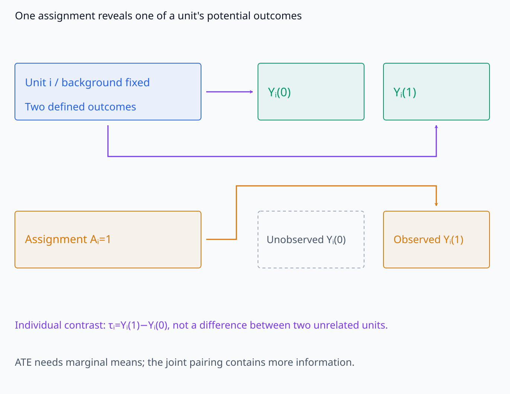
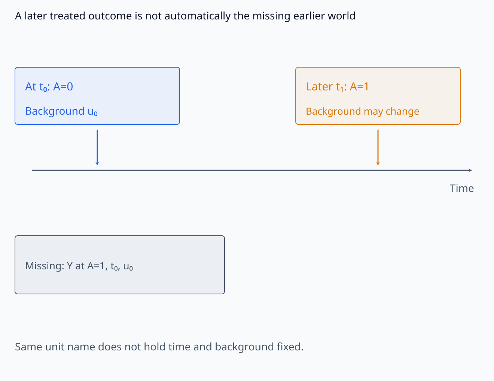
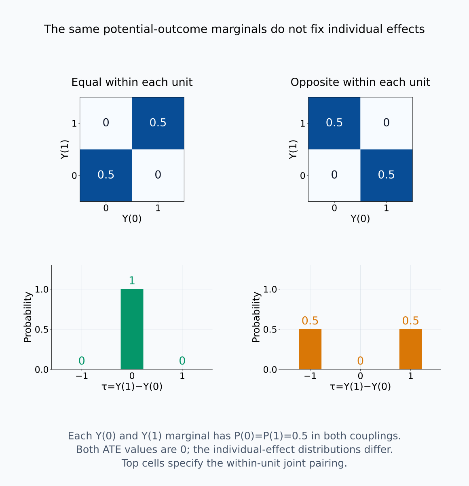
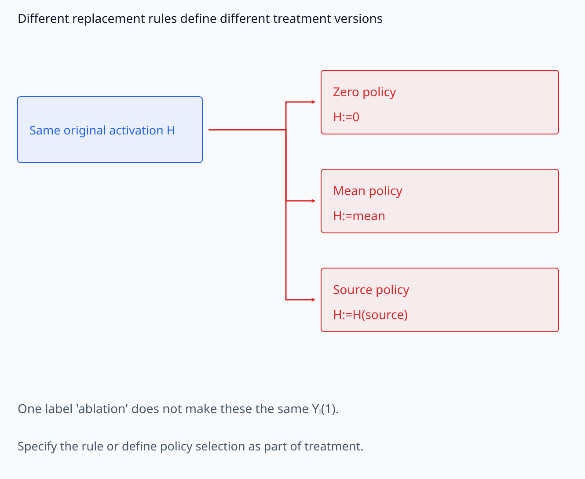
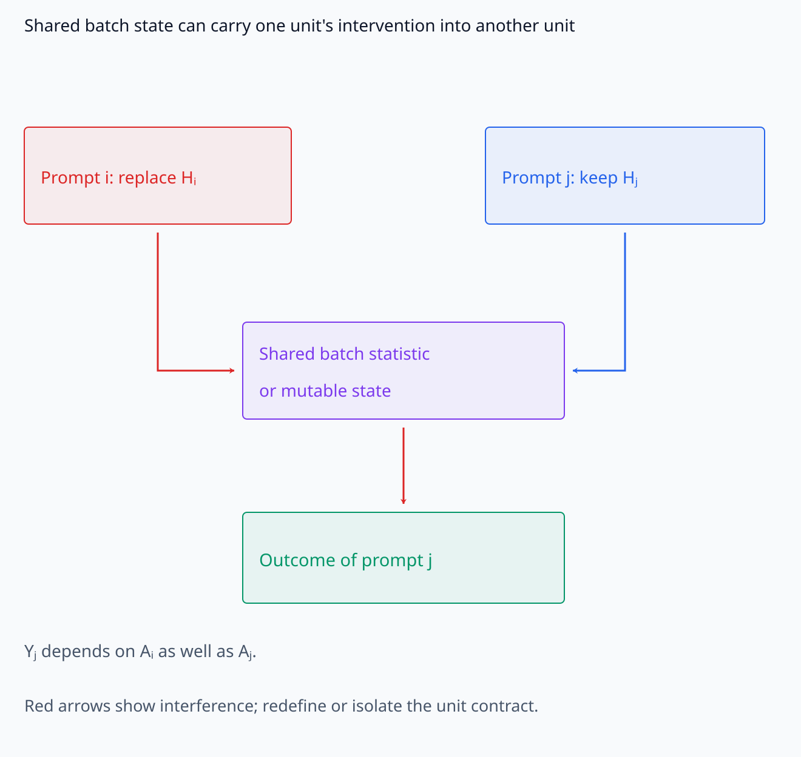
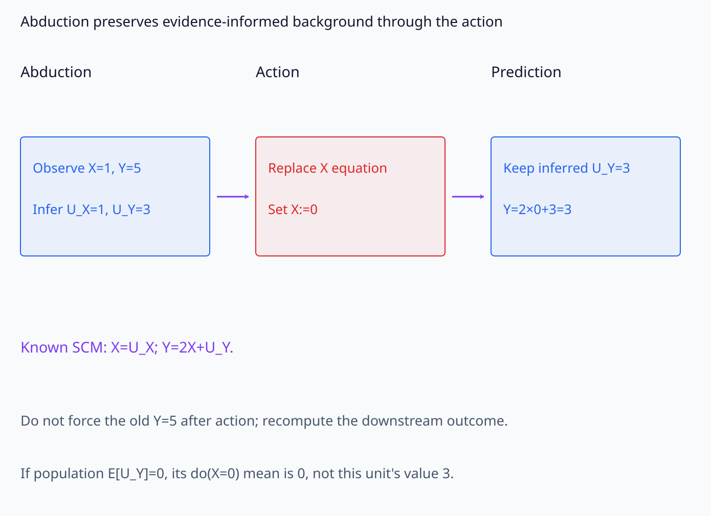
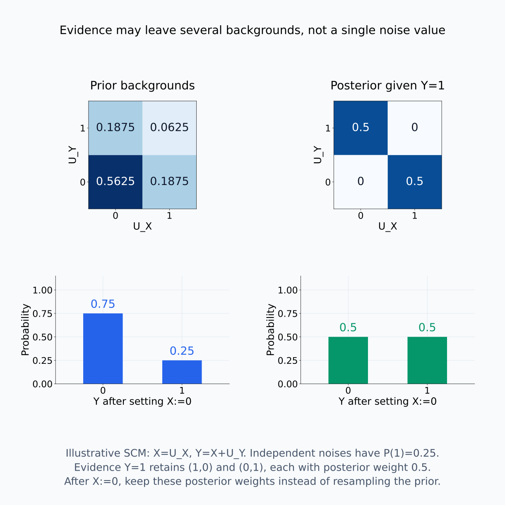
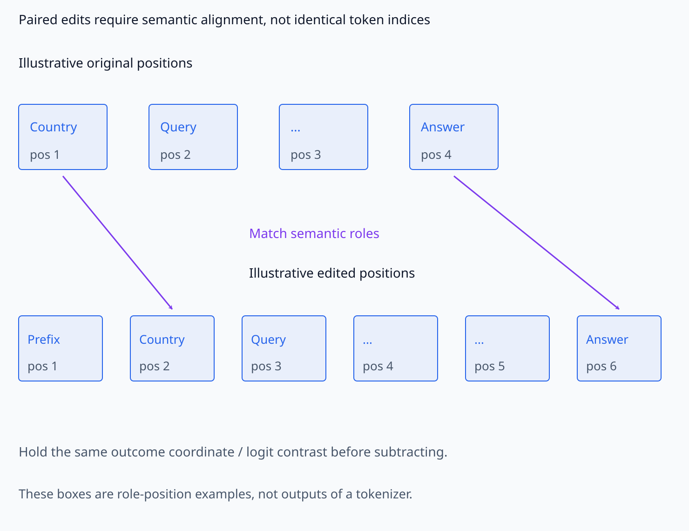
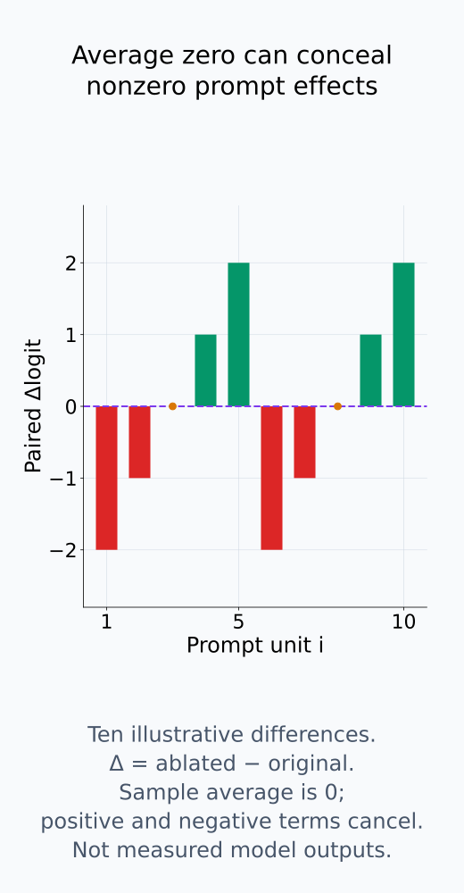

# A09-CAU-05. counterfactual과 potential outcome

## 이 단원이 필요한 이유

causal effect는 같은 unit에 서로 다른 treatment를 적용했을 outcome의 차이로 정의하지만 현실에서는 한 world만 관찰한다. model은 같은 stored input에 여러 internal intervention을 실행할 수 있어 paired counterfactual을 계산하기 쉽지만, unit과 intervention이 일관되게 정의됐는지는 별도로 확인해야 한다.

## 학습 목표

- individual treatment effect와 average treatment effect를 쓸 수 있다.
- fundamental problem of causal inference를 설명할 수 있다.
- consistency, no interference와 exchangeability의 역할을 구분할 수 있다.
- SCM counterfactual의 abduction–action–prediction 절차를 설명할 수 있다.

## 선수지식 확인

- 선수 단원: [M04-07 추정, 편향과 분산](../../part-1-foundations/M04/M04-07-estimation-bias-variance.md), [M04-17 실험 설계와 재현성](../../part-1-foundations/M04/M04-17-experimental-design-reproducibility.md), [A09-CAU-04 mediation의 가정](A09-CAU-04-mediation-assumptions.md)
- 확인 질문: 한 사람에게 treatment 0과 1의 outcome을 같은 시점에 모두 관찰할 수 없는 이유는 무엇인가?

## 기호와 용어

| 기호·용어 | Common spoken reading | 의미 | shape·범위 |
|---|---|---|---|
| $Y_i(1)$ | `the potential outcome for unit i under treatment one` | unit $i$의 treated outcome | scalar or vector |
| $Y_i(0)$ | `the potential outcome for unit i under treatment zero` | unit $i$의 control outcome | scalar or vector |
| $\tau_i=Y_i(1)-Y_i(0)$ | `tau sub i equals Y sub i under treatment one minus Y sub i under treatment zero` | individual treatment effect | scalar or vector contrast |
| $\operatorname{ATE}=E[Y(1)-Y(0)]$ | `the average treatment effect` | population average causal effect | scalar or vector contrast |

## 핵심 개념

### individual effect와 population 평균

unit $i$의 potential outcome을 $Y_i(1)$과 $Y_i(0)$로 정의하면 individual effect는

$$
\tau_i=Y_i(1)-Y_i(0)
$$

이다. 두 항은 같은 unit의 배경 조건과 outcome 정의를 유지한 contrast이다. 관찰한 서로 다른 두 unit의 outcome 차이는 treatment뿐 아니라 그들의 배경 차이도 포함할 수 있다. average treatment effect는 $E[\tau]=E[Y(1)]-E[Y(0)]$로 정의한다. 이 기댓값들이 존재한다고 가정하며, vector outcome이면 성분별 평균을 계산한다.

같은 사람이 같은 시점과 같은 배경에서 두 treatment를 모두 받을 수는 없으므로, 일반적인 관찰 자료에서는 한 potential outcome만 보인다. 이것이 fundamental problem of causal inference이다. 나중에 다른 treatment를 적용한 결과는 시간과 배경이 바뀌었을 수 있어 자동으로 원래 시점의 나머지 potential outcome이 되지 않는다.

ATE는 두 marginal 평균의 차이이므로 모든 unit의 두 outcome을 함께 알아야만 추정할 수 있는 것은 아니다. 아래의 consistency와 no interference가 성립하고 random assignment가 potential outcome과 독립이며 두 treatment를 받을 가능성이 있으면, 각 group의 관찰 평균으로 각 population potential outcome 평균을 추정할 수 있다. randomization은 한 번의 finite sample에서 두 group의 배경을 정확히 일치시키지는 않는다. assignment의 randomness가 남으므로 평균 차이의 불확실성도 보고한다. 또한 두 marginal 분포를 알더라도 어느 $Y(1)$과 어느 $Y(0)$가 같은 사람에 속하는지 모르면 individual effect의 분포까지 정해지지는 않는다.

정의된 두 world 중 어떤 값이 관찰되는지, 시간 변경과 marginal pairing 문제를 나누어 보자.

<figure class="lesson-figure lesson-figure--wide" markdown="1">

<figcaption>unit i의 두 potential outcome을 정의하더라도 Aᵢ=1로 관찰하는 값은 Yᵢ(1) 하나다. 회색 상자는 값이 0이라는 표시가 아니라 같은 시점·배경에서 관찰하지 못한 Yᵢ(0)이다. individual effect는 같은 unit의 두 항 차이며 unrelated unit 두 명의 차와 다르다.</figcaption>

</figure>

<figure class="lesson-figure lesson-figure--wide" markdown="1">

<figcaption>같은 unit에 나중에 treatment 1을 적용했어도 시간과 배경이 달라질 수 있다. 아래 상자가 요구하는 값은 원래 t₀·u₀에서 A=1이었을 outcome이다. 그림은 later-time 관측을 사용할 수 없다는 일반 금지가 아니라 두 값을 같은 counterfactual pair로 읽는 데 추가 조건이 필요함을 보여 준다.</figcaption>

</figure>

<figure class="lesson-figure lesson-figure--wide" markdown="1">

<figcaption>두 경우 모두 Y(0)와 Y(1)의 marginal은 0·1에 probability 0.5씩이므로 ATE는 0이다. 첫 coupling은 같은 unit의 두 값이 같아 τ=0이고, 두 번째는 서로 반대여서 τ=−1·1이 반씩이다. marginal만 알아도 평균 차이는 정하지만 individual effect 분포는 joint pairing에 달려 있다.</figcaption>

</figure>

### 세 가정이 연결하는 대상

consistency는 실제로 $A=a$를 받은 unit의 observed outcome이 정의한 $Y(a)$와 같다는 조건이다. 이를 적용하려면 treatment가 무엇인지 충분히 구체적이어야 한다. 같은 이름의 ablation에 zero·mean·source replacement를 섞으면 서로 다른 policy의 outcome을 하나의 $Y(1)$로 정의하게 된다. 각 policy를 별도 treatment로 구분하거나 policy 선택 규칙까지 정한다.

no interference는 한 unit의 treatment가 다른 unit의 outcome을 바꾸지 않는다는 조건이다. 이 조건이 없으면 $Y_i(a)$에는 unit $i$의 treatment만 적어서는 충분하지 않다. 다른 unit들의 treatment도 결과에 관여하기 때문이다. batch normalization statistic이나 공유 상태가 다른 prompt 실행을 바꾼다면 prompt 하나를 독립 조작 unit으로 보는 계약을 바꿔야 한다.

observational study에서는 treatment 이전의 measured covariate $Z$를 조건으로 $A\perp(Y(0),Y(1))\mid Z$라는 conditional exchangeability를 가정할 수 있다. 같은 $z$ stratum 안에서 treatment 선택이 potential outcome의 분포를 추가로 선택하지 않는다는 뜻이다. consistency와 이 조건을 함께 쓰면 $E[Y(a)\mid Z=z]=E[Y\mid A=a,Z=z]$로 연결할 수 있다. 필요한 stratum의 positivity도 성립할 때 이 평균을 원래 $P(z)$로 평균해 population effect를 얻는다. 관찰한 몇 개 covariate가 균형을 이룬 것만으로 측정하지 않은 배경까지 exchangeable하다고 확인되지는 않는다.

treatment 버전을 바꾸는 경로와 unit 사이에 전달되는 경로를 구분한다.

<figure class="lesson-figure lesson-figure--wide" markdown="1">

<figcaption>같은 original H에서 zero·mean·source replacement로 갈라지는 세 branch는 서로 다른 값 생성 규칙이다. 모두 ablation이라고 부른다는 이유로 하나의 Yᵢ(1)로 합치지 않는다. consistency를 적용하려면 policy를 별도 treatment로 구분하거나 선택 규칙까지 treatment 정의에 포함한다.</figcaption>

</figure>

<figure class="lesson-figure lesson-figure--wide" markdown="1">

<figcaption>빨간 경로는 prompt i의 treatment가 공유 batch statistic 또는 mutable state를 거쳐 prompt j의 outcome에 영향을 주는 경우다. 이때 Yⱼ(Aⱼ)만으로는 설정을 충분히 적지 못하며 다른 unit의 treatment도 결과에 관여한다. 특정 Transformer가 batch normalization을 사용한다는 주장이 아니라 no-interference 조건을 깨는 구조 예시다.</figcaption>

</figure>

### abduction–action–prediction

SCM에서 관찰 증거 $e$를 가진 unit의 counterfactual을 계산할 때는 다음 세 단계를 따른다.

1. abduction: 원래 equation과 증거를 이용해 $P(U\mid e)$를 추론한다. 증거가 exogenous 값을 유일하게 정하면 한 값 $u$를 얻지만, 여러 배경이 같은 관찰을 만들 수 있으면 posterior distribution을 유지한다.
2. action: 원하는 treatment의 structural equation을 교체한다. 이 단계에서 원래 증거를 다시 새 equation에 강제로 맞추지는 않는다.
3. prediction: 첫 단계의 같은 $u$, 또는 같은 posterior의 각 $u$를 새 equation에 넣어 outcome을 계산한다. 여러 $u$가 남으면 그 outcome을 posterior weight로 평균한다.

population 전체에 intervention한 outcome은 $P_U$로 평균한다. 관찰 증거가 있는 unit의 counterfactual은 $P(U\mid e)$로 평균하므로 두 질문은 다를 수 있다. abduction 뒤 noise를 원래 marginal에서 새로 뽑으면 그 unit의 배경 정보를 버린다.

예를 들어 $X=U_X$, $Y=2X+U_Y$에서 $X=1,Y=5$를 관찰했다면 abduction으로 $U_X=1,U_Y=3$을 얻는다. action으로 $X:=0$을 설정하고 prediction에서 같은 $U_Y=3$을 사용하면 counterfactual $Y=3$이다. 이때 원래 $Y=5$까지 계속 고정하는 것은 downstream outcome을 다시 계산하는 조작이 아니다. 만약 population에서 $E[U_Y]=0$이라면 population의 $\operatorname{do}(X=0)$ outcome 평균은 0으로, 위 unit의 counterfactual과 다르다.

증거가 noise를 한 값으로 정하는 예제와 posterior 여러 값을 남기는 예제를 비교한다.

<figure class="lesson-figure lesson-figure--wide" markdown="1">

<figcaption>본문 equation에서 X=1·Y=5를 보고 U_X=1·U_Y=3을 추론한 뒤 X:=0으로 바꾸어 같은 U_Y=3에서 Y=3을 계산한다. action 뒤 원래 Y=5도 강제로 유지하는 것은 downstream prediction이 아니다. population E[U_Y]=0의 개입 평균 0과 이 unit의 counterfactual 3은 평균하는 배경이 다르다.</figcaption>

</figure>

<figure class="lesson-figure lesson-figure--wide" markdown="1">

<figcaption>설명용 SCM X=U_X, Y=X+U_Y에서 독립 noise 각각 P(1)=0.25로 두고 Y=1만 관찰했다고 하자. 가능한 (U_X,U_Y)=(1,0)·(0,1)의 prior mass가 둘 다 0.1875라 posterior는 각각 0.5다. X:=0 뒤 Y=U_Y는 posterior에서 0·1이 반씩이지만 population에서는 P(Y=1)=0.25다. 증거가 noise를 한 점으로 정하지 않는 예시이며 실제 모델 결과가 아니다.</figcaption>

</figure>

### paired model 실행의 unit

deterministic model은 같은 stored prompt에 두 internal intervention을 실행해 paired outcome을 얻을 수 있다. parameter·hook 위치·평가 mode·outcome metric을 고정하고, treatment 이외의 배경은 두 실행에서 유지한다. stochastic 실행이라면 어떤 random draw를 공통 배경으로 유지하고 무엇을 평균할지 정한다. 두 forward pass를 실행했다는 사실만으로 현실의 두 potential outcome을 함께 관찰한 것은 아니다. 고정한 계산 model의 두 조작 결과를 계산한 것이다.

prompt edit를 treatment로 둘 때는 같은 base unit에서 무엇을 바꾸는지 정의한다. edit가 다른 task 정보까지 바꾸거나 token 수가 달라지면, semantic pairing·target position·source–target alignment를 계약에 넣어야 한다. outcome의 좌표와 의미가 달라진 두 값을 그대로 빼면 지정한 treatment effect를 측정하지 못한다.

token index 대신 semantic role을 맞추고 동일 outcome 좌표를 유지한다.

<figure class="lesson-figure lesson-figure--wide" markdown="1">

<figcaption>네 칸·여섯 칸은 tokenizer output이 아니라 위치가 달라지는 설명용 role 배열이다. Country와 Answer의 대응 위치를 먼저 맞추고 같은 outcome 좌표·logit contrast를 유지해야 의미 있는 paired difference를 구한다. 동일 stored model의 두 실행을 계산하는 일은 현실의 두 potential outcome을 함께 관찰한 것과 구분한다.</figcaption>

</figure>

## 작은 예제

10개 prompt마다 $Y_i(1)$을 ablation 뒤 target logit, $Y_i(0)$을 원래 target logit으로 정의하면 $\tau_i$는 ablation 뒤에서 원래 값을 뺀 차이다. sample average effect는 $\hat\tau=10^{-1}\sum_{i=1}^{10}\tau_i$이다. 음수이면 정의한 ablation이 그 logit을 낮춘 것이다. effect의 부호를 읽기 전에 두 treatment의 순서를 확인한다.

이 평균은 우선 해당 10개 prompt의 결과다. 독립적으로 sampling한 prompt가 목표 population을 대표한다는 조건 아래 population ATE의 추정으로 해석한다. 한 prompt의 여러 token을 별도 independent unit으로 중복 세지 않고 prompt별 difference를 먼저 만든다. 결과가 0에 가깝다면 모든 prompt에서 effect가 작은지, 양수와 음수가 상쇄됐는지도 분포를 확인한다.

평균이 0인 설명용 paired effect에서도 prompt별 차이는 남을 수 있다.

<figure class="lesson-figure" markdown="1">

<figcaption>설명용 10개 paired effect를 (−2,−1,0,1,2,−2,−1,0,1,2)로 두면 평균은 0이지만 모든 effect가 0인 것은 아니다. 각 점은 prompt별 ablated−original difference이며 token을 별도 independent unit으로 늘리지 않는다. 이 값은 실제 실험에서 측정한 logit 결과가 아니다.</figcaption>

</figure>

## 흔한 오해

- model에서 두 forward pass를 실행할 수 있다는 사실이 현실 세계 counterfactual의 식별을 해결하지 않는다.
- average effect가 0이어도 positive·negative individual effect가 상쇄됐을 수 있다.

## 연습문제

### 1. individual effect
$Y_i(1)=5$, $Y_i(0)=2$이면 $\tau_i$를 구하라.

해설 보기

$\tau_i=5-2=3$이다.

### 2. ATE
세 unit의 paired effect가 $(2,-1,5)$이면 sample average effect는 얼마인가?

해설 보기

$(2-1+5)/3=2$이다.

### 3. interference
한 prompt의 intervention이 batch normalization statistic을 통해 다른 prompt output을 바꾸면 어떤 가정이 깨지는가?

해설 보기

unit 간 interference가 생긴다. prompt를 독립 unit으로 보는 no-interference 가정이 깨진다.

### 4. 모델 해석
clean prompt와 corrupted prompt의 token 수가 다르다. paired counterfactual patch를 위해 무엇을 고정해야 하는가?

해설 보기

unit의 semantic relation, target token position, source–target alignment rule과 outcome definition을 사전에 고정한다.

## 근거와 갱신 경계

potential outcome 표기는 binary treatment를 중심으로 설명한다. continuous treatment, interference network와 partial identification은 다루지 않는다.

exchangeability와 consistency·positivity·no interference의 역할은 [Hernán, Beyond Exchangeability](https://doi.org/10.1177/0962280211398037)를, 증거로 갱신한 배경 분포를 intervention 뒤에도 유지하는 계산은 [Balke·Pearl, Counterfactuals and Policy Analysis in Structural Models](https://arxiv.org/pdf/1302.4929)의 2~3절을 기준으로 확인했다. 본문의 linear equation 예제는 직접 대입했다.

## 단원 요약

- causal effect는 같은 unit의 potential outcome contrast로 정의한다.
- 현실 data에서는 두 potential outcome을 함께 관찰할 수 없다.
- ATE identification은 consistency, assignment와 interference 가정에 의존한다.
- model intervention에서도 unit·pairing·outcome 계약이 필요하다.

## 통과 기준

- individual effect와 ATE를 계산할 수 있는가?
- SCM counterfactual의 세 단계와 paired model intervention의 한계를 설명할 수 있는가?

## 다음 단원

- [A09-CAU-06 causal abstraction](A09-CAU-06-causal-abstraction.md)

## 집필자 점검표

- [x] potential outcome·ATE·SCM counterfactual과 model pairing을 연결했다.
- [x] 문제 4개에 해설이 있다.
- [x] Common spoken reading이 실제 영어 학술 발화이며 한글 음역이나 기계적 직역을 포함하지 않는다.
- [x] 선수지식과 링크를 확인했다.
