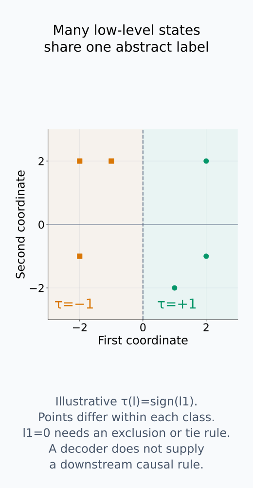
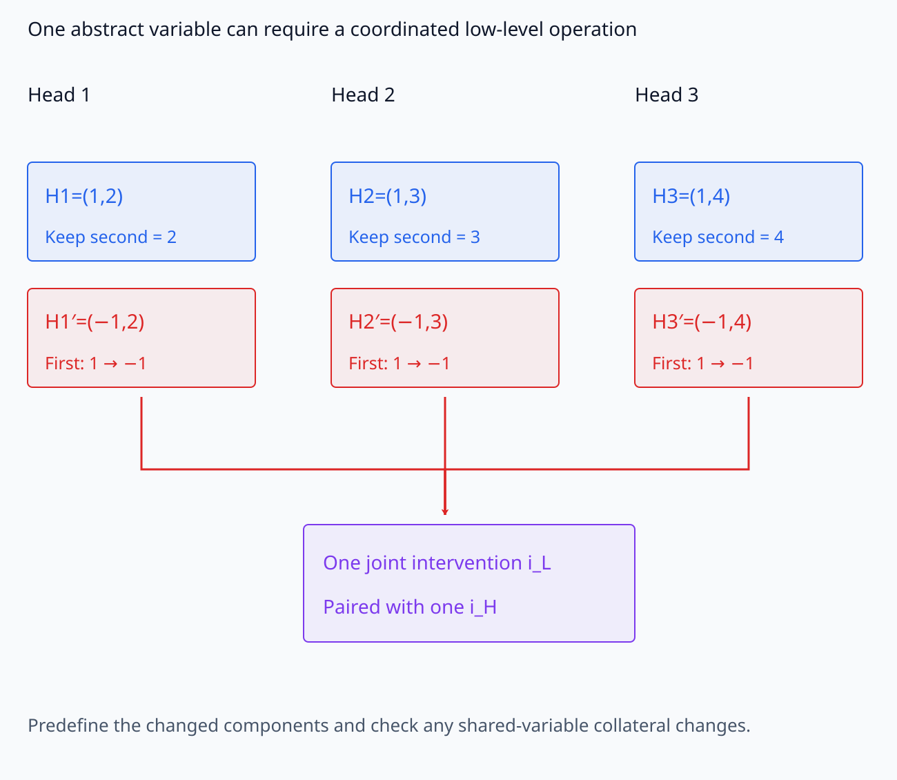
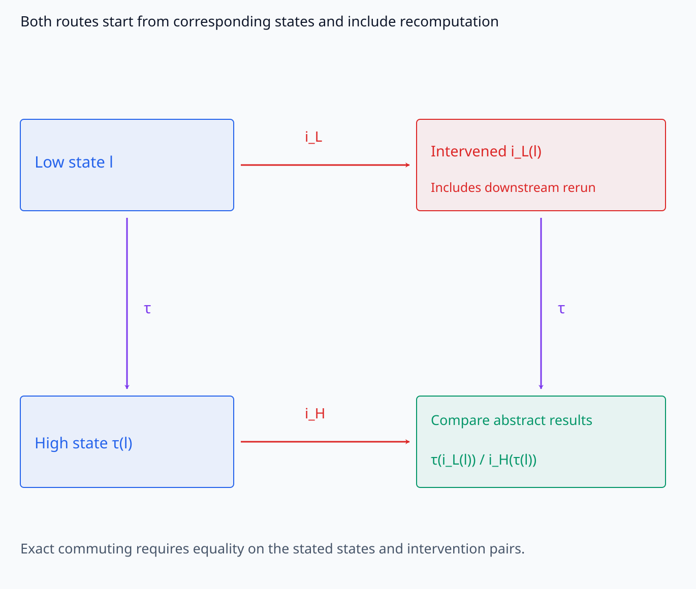
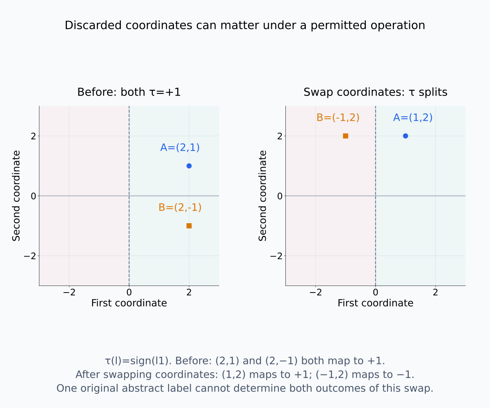
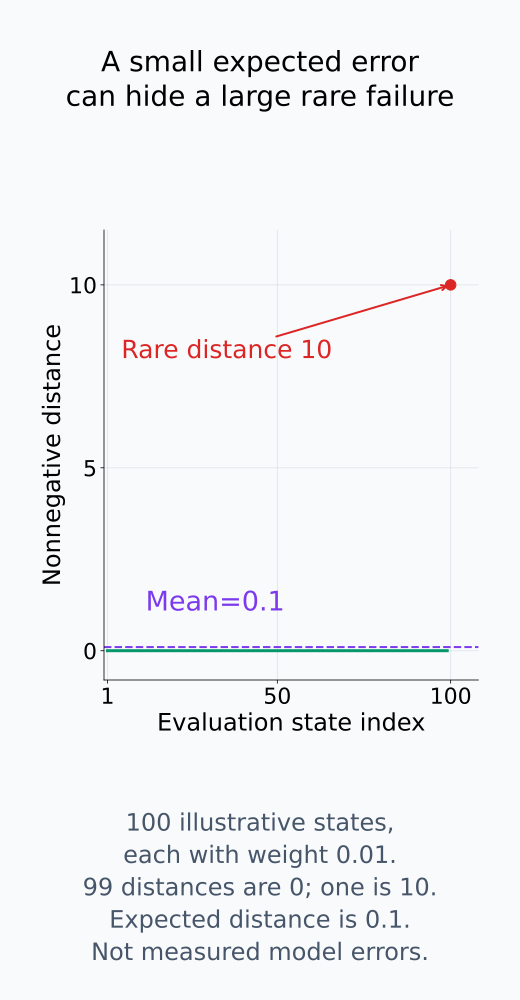
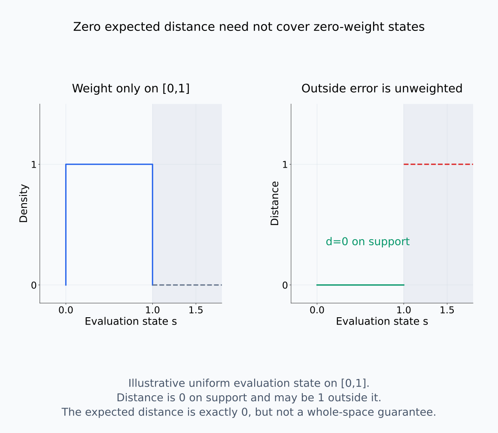
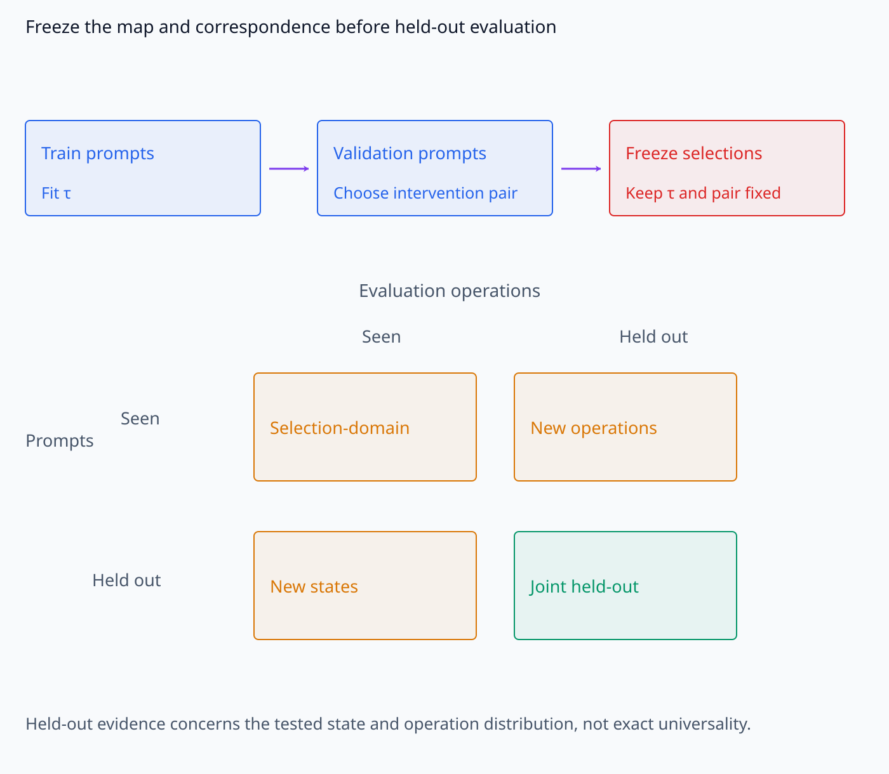
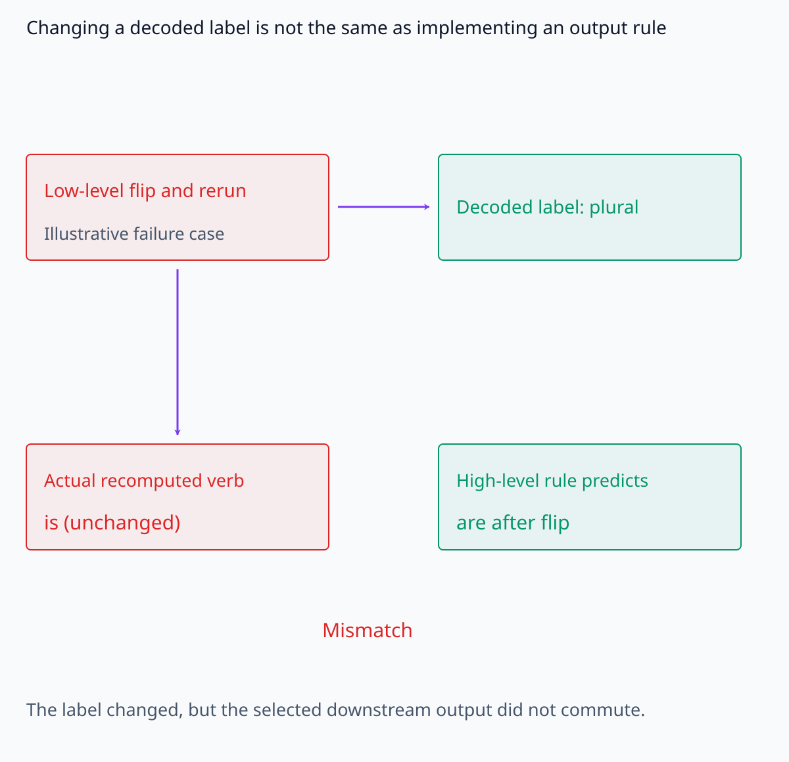
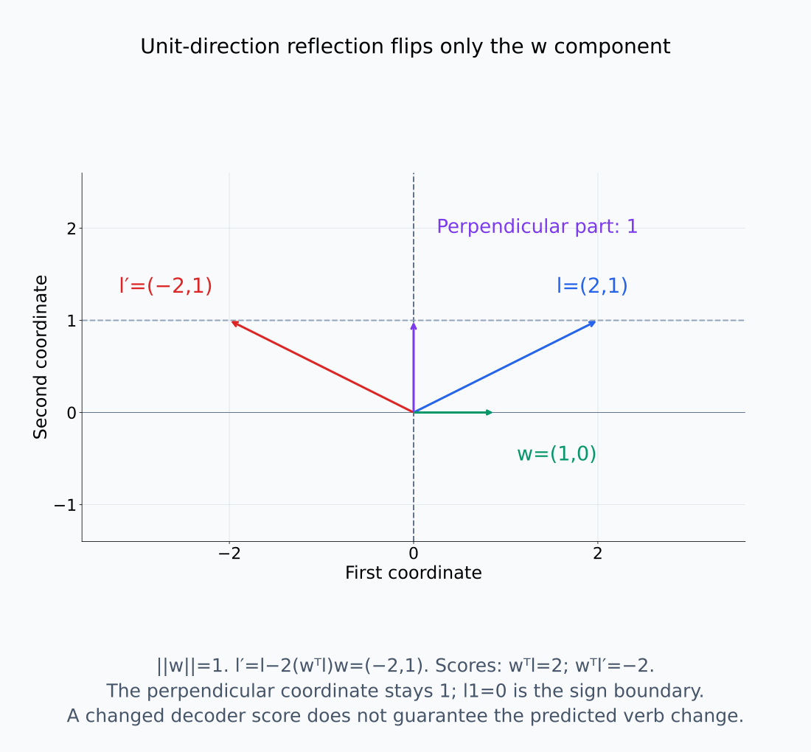

# A09-CAU-06. causal abstraction

## 이 단원이 필요한 이유

mechanistic interpretation은 neuron과 activation의 low-level computation이 variable·rule로 표현한 high-level algorithm을 구현한다고 주장한다. observational prediction이 맞는 것만으로 구현 관계를 정할 수 없다. 대응하는 intervention이 두 수준에서 같은 결과를 만들어야 causal abstraction claim이 성립한다.

## 학습 목표

- low-level state와 high-level state를 잇는 abstraction map을 정의할 수 있다.
- low-level intervention과 high-level intervention의 대응을 쓸 수 있다.
- intervention commuting condition을 설명할 수 있다.
- approximate abstraction error와 held-out intervention을 설계할 수 있다.

## 선수지식 확인

- 선수 단원: [M03-02 선형사상과 행렬 표현](../../part-1-foundations/M03/M03-02-linear-maps-matrix-representation.md), [I07-11 circuit을 그래프로 표현하기](../../part-3-interpretability/I07/I07-11-circuit-graph.md), [A09-CAU-02 do 연산과 intervention](A09-CAU-02-do-operator-interventions.md)
- 확인 질문: high-level variable 하나가 low-level neuron 하나와 일대일 대응하지 않아도 되는 이유는 무엇인가?

## 기호와 용어

| 기호·용어 | Common spoken reading | 의미 | shape·범위 |
|---|---|---|---|
| $\tau:\mathcal L\to\mathcal H$ | `tau maps the low-level state space L to the high-level state space H` | low-level state를 high-level state로 요약하는 map | function |
| $i_L$ | `i sub L` | low-level intervention과 뒤따르는 재계산 | operation |
| $i_H$ | `i sub H` | high-level intervention과 뒤따르는 재계산 | operation |
| $\epsilon_{\mathrm{abs}}$ | `epsilon sub abs` | 두 intervention path의 output discrepancy | nonnegative scalar |

## 핵심 개념

### state를 요약하는 map과 계산 규칙

low-level model state $l\in\mathcal L$을 high-level state $h=\tau(l)\in\mathcal H$로 보낸다. $l$에는 많은 activation 값이 들어가고, $h$에는 subject number 같은 소수의 해석 가능한 variable이 들어갈 수 있다. $\tau$는 neuron 이름을 바꾸는 작업이 아니라 여러 수치 상태를 같은 abstract state로 묶는 map이다. 따라서 일대일 대응이나 역함수가 필요하지 않다.

그렇지만 state space와 decoder만 정하면 high-level *causal model*이 완성되는 것은 아니다. abstract variable에서 downstream output을 계산하는 규칙도 정해야 한다. `plural`을 정확히 decode하는 probe는 그 정보가 activation에서 읽힌다는 증거다. 해당 정보를 바꿨을 때 verb prediction도 high-level rule에 따라 변하는지는 별도의 질문이다.

다음 좌표면은 decoder가 여러 state를 하나의 label로 묶는 관계를 보여 준다.

<figure class="lesson-figure" markdown="1">

<figcaption>설명용 τ(l)=sign(l₁)는 서로 다른 여러 low-level state를 같은 +1 또는 −1 label에 보낸다. 회색 l₁=0 경계는 제외하거나 tie rule을 따로 정할 부분이다. 이 partition은 decoder의 요약이며 downstream 계산 규칙을 정의한 것이 아니다.</figcaption>

</figure>

### intervention pair와 두 경로

high-level intervention $i_H$마다 대응 low-level intervention $i_L$를 정한다. 이때 대응은 관찰된 output에 맞춰 사후에 이름 붙이는 것이 아니라, 어느 component를 어떤 값으로 바꾸는지 미리 정한 조작 규칙이다. 하나의 abstract variable이 여러 head에 분산돼 있으면 coordinated intervention을 사용할 수 있다. 같은 좌표가 다른 variable도 나타내면 그 variable을 얼마나 보존했는지도 확인해야 한다.

여기서는 입력과 random draw를 고정한 deterministic 실행을 비교한다. 식의 $i_L(l)$과 $i_H(h)$에는 값을 덮어쓰는 순간뿐 아니라 **각 model의 규칙으로 downstream을 다시 계산한 결과**까지 포함한다. 동일한 입력·배경에 대응하는 $l$과 $h=\tau(l)$에서 출발해야 두 경로의 차이를 개입 대응의 차이로 읽을 수 있다.

다음 수치 조작에서는 여러 component의 변경 부분과 유지 부분을 함께 추적한다.

<figure class="lesson-figure lesson-figure--wide" markdown="1">

<figcaption>설명용 세 head H₁=(1,2), H₂=(1,3), H₃=(1,4)의 first coordinate를 함께 1→−1로 바꾸고 second coordinate 2·3·4를 유지한다. 이 joint i_L을 하나의 i_H에 대응시킬 수 있지만, 공유 좌표에 다른 variable이 있으면 실제 보존 여부를 별도로 확인한다. 이 수치 조작만으로 causal abstraction이 성립한다고 주장하지 않는다.</figcaption>

</figure>

### commuting condition이 비교하는 것

exact causal abstraction은 정한 허용 state와 intervention pair 전체에서 두 경로가 같은 abstract outcome을 만드는 조건을 요구한다.

$$
\tau\bigl(i_L(l)\bigr)
=i_H\bigl(\tau(l)\bigr)
$$

왼쪽은 low-level 조작과 재계산을 먼저 한 뒤 $\tau$로 요약한다. 오른쪽은 원래 상태를 요약한 뒤 high-level 조작과 재계산을 한다. **서로 다른 수준에서 계산했는데도 같은 abstract 결과에 도착한다**는 뜻이 commuting이다. 비교 대상에 downstream output을 포함했다면 intermediate label만 같아서는 등식이 성립하지 않는다. 두 수준의 output을 같은 값 공간으로 옮기는 대응도 정해야 한다.

예를 들어 $\tau(l_1)=\tau(l_2)$인데 대응 low-level 개입 뒤 요약한 결과가 서로 다르면, high-level state 하나만으로 그 개입 결과를 정할 수 없다. 버린 정보가 허용 개입의 결과에 영향을 준 것이다. 그런 state까지 범위에 포함하려면 abstraction이나 개입 대응을 수정해야 한다. 반대로 한 prompt에서 등식이 맞았다는 사실은 아직 검사하지 않은 모든 state에서의 등식을 증명하지 않는다.

다음 두 그림은 경로의 일치 조건과 그 조건이 실패하는 좌표 반례를 보여 준다.

<figure class="lesson-figure lesson-figure--wide" markdown="1">

<figcaption>위쪽 경로는 low-level intervention과 재계산을 먼저 하고 τ로 요약한다. 왼쪽에서 아래로 내려가는 경로는 먼저 τ(l)를 얻고 high-level intervention과 재계산을 한다. 오른쪽 아래에서는 같은 abstract outcome·output 기준으로 두 결과를 비교하며, intermediate label만 맞는 것은 충분하지 않다.</figcaption>

</figure>

<figure class="lesson-figure lesson-figure--wide" markdown="1">

<figcaption>설명용 τ(l)=sign(l₁)에서 state A=(2,1)ᵀ와 state B=(2,−1)ᵀ는 모두 +1이다. i_L이 두 좌표를 바꾸면 (1,2)ᵀ·(−1,2)ᵀ가 되어 τ 결과가 +1·−1로 갈린다. 원래 abstract label 하나가 버린 두 번째 좌표 때문에 같은 i_H 결과 하나로 두 경로를 모두 설명할 수 없다.</figcaption>

</figure>

### approximate error와 평가 범위

approximate abstraction은 distance $d_{\mathcal H}$를 정하고

$$
\epsilon_{\mathrm{abs}}
=E\left[d_{\mathcal H}\left(\tau(i_L(L)),i_H(\tau(L))\right)\right]
$$

를 측정한다. 이 식에서는 intervention pair를 고정하고 평가 state $L$의 분포에 대해 평균한다. 여러 pair를 함께 평가하려면 pair의 sampling 분포도 정해야 한다. categorical outcome의 불일치를 0 또는 1로 세는 것과 continuous score의 차이를 재는 것은 서로 다른 error다. 비교할 variable·output, 거리와 가중치를 먼저 고정한다.

평균 error가 작다는 것은 그 평가 분포에서 두 경로가 대체로 가깝다는 뜻이다. 드문 prompt에서 큰 오류가 나거나, sampling하지 않은 개입에서 실패할 수도 있다. nonnegative distance의 기댓값이 정확히 0이어도 분포가 가중치 0을 준 state의 성공까지 보장하지는 않는다.

$\tau$는 probe, sparse feature, subspace projection이나 discrete decoder가 될 수 있다. map과 개입 방향을 같은 prompt의 성공률로 고르고 그 성공률을 최종 결과로 보고하면, 잘 맞는 조합을 선택한 효과가 섞인다. training에서 map을 학습하고 validation에서 대응 규칙을 고른 뒤, 그 선택을 고정한 채 held-out prompt·intervention에서 검사한다. 이는 정한 평가 범위에서의 일반화 증거이며 전 범위의 exact abstraction 증명은 아니다.

평균·평가 support·hold-out 대상은 다음 그림에서 각각 구분한다.

<figure class="lesson-figure" markdown="1">

<figcaption>100개 설명용 state에 weight 0.01씩을 두고 99개의 distance를 0, 마지막 하나를 10으로 두면 ε_abs는 0.1이다. 작은 평균이 모든 state에서 작은 distance를 뜻하지 않는 관계를 그리며 실제 모델의 error 측정값이 아니다.</figcaption>

</figure>

<figure class="lesson-figure lesson-figure--wide" markdown="1">

<figcaption>설명용 평가 분포는 state s∈[0,1]에만 weight를 주고 그 범위의 distance는 0이다. 범위 밖 distance가 1이어도 그 state의 weight가 0이면 기댓값은 0이다. zero expected nonnegative distance는 평가 분포에서 almost-sure 성공을 뜻하지만 전체 허용 state의 성공을 자동 증명하지 않는다.</figcaption>

</figure>

<figure class="lesson-figure lesson-figure--wide" markdown="1">

<figcaption>상단은 training에서 τ를 학습하고 validation에서 intervention 대응을 고른 뒤 고정하는 순서다. 하단의 두 축은 새 prompt와 새 operation이라는 별개의 평가 차원이며 오른쪽 아래는 둘을 함께 hold out한 경우다. 이 평가의 성공은 tested distribution의 일반화 근거이지 exact universality 증명이 아니다.</figcaption>

</figure>

## 작은 예제

high-level variable가 `subject number`이고 low-level state가 residual subspace라면 $\tau$는 singular/plural score를 추출한다. high-level flip intervention에 대응해 low-level direction을 반전했을 때 downstream verb-number output도 예측대로 바뀌는지 검사한다.

score와 label은 구분한다. score가 $w^\top l$이고 label이 $\operatorname{sign}(w^\top l)$이면, 두 label만 쓰는 범위에서는 score가 0인 state를 제외하거나 tie-breaking 규칙을 따로 정한다. $\|w\|=1$일 때 $l'=l-2(w^\top l)w$는 $w$ 방향 성분을 반전하고 수직 성분은 유지한다. 따라서 $w^\top l'=-w^\top l$이지만, 이 계산만으로 downstream verb prediction의 반전까지 보장되지는 않는다.

high-level rule이 number flip 뒤 `is` 대신 `are`를 예측한다면 low-level 재계산 결과도 같은 기준에서 비교해야 한다. decoder label만 `plural`로 바뀌고 verb output이 그대로라면 state의 조작은 성공했어도 그 rule의 causal implementation은 확인되지 않은 것이다.

다음 좌표 그림과 실패 장면은 score 반전과 downstream output의 일치를 구분한다.

<figure class="lesson-figure lesson-figure--wide" markdown="1">

<figcaption>이 장면은 실제 실험 결과가 아니라 본문의 실패 조건을 그린다. decoder label은 plural로 바뀌었지만 low-level downstream verb는 is에 남고 high-level rule은 are를 요구한다. label 조작 성공과 rule의 causal implementation 성공은 비교 대상이 다르다.</figcaption>

</figure>

<figure class="lesson-figure lesson-figure--wide" markdown="1">

<figcaption>||w||=1인 w=(1,0)ᵀ에서 l=(2,1)ᵀ에 l′=l−2(wᵀl)w를 적용하면 l′=(−2,1)ᵀ다. first-coordinate score는 2→−2로 바뀌지만 perpendicular 성분 1은 유지한다. 수치 reflection이 decoder sign을 바꾸어도 downstream verb output의 반전은 별도 계산으로 확인해야 한다.</figcaption>

</figure>

## 흔한 오해

- high-level variable을 잘 decode하는 것만으로 causal abstraction이 성립하지 않는다.
- 한 intervention에서 commuting한 결과가 모든 high-level operation의 구현을 보장하지 않는다.

## 연습문제

### 1. map
$\tau(l)=\operatorname{sign}(w^\top l)$이면 high-level state space는 어떤 두 값으로 둘 수 있는가?

해설 보기

$\{-1,+1\}$ 또는 대응하는 두 symbolic label로 둘 수 있다.

### 2. commuting
low-level flip 뒤 $\tau$ 값은 바뀌었지만 downstream high-level output은 예측대로 변하지 않았다. causal abstraction이 통과하는가?

해설 보기

통과하지 않는다. state decoding만 바뀌고 intervention consequence가 high-level model과 일치하지 않는다.

### 3. selection
abstraction map을 고른 prompt와 같은 prompt에서 error를 보고하면 어떤 bias가 생기는가?

해설 보기

map과 intervention을 data에 맞춘 selection bias가 생긴다. held-out prompt와 operation이 필요하다.

### 4. 모델 해석
하나의 high-level variable이 여러 head에 분산돼 있다. low-level intervention을 어떻게 정의하는가?

해설 보기

해당 variable을 보존·변경하는 joint subspace 또는 여러 node의 coordinated intervention을 정의하고 dimension-matched control과 비교한다.

## 근거와 갱신 경계

이 단원은 intervention correspondence와 commuting condition을 실험 설계 수준에서 다룬다. category theory 기반 abstraction formalism의 완전한 정의는 범위 밖이다.

- [Geiger et al., *Causal Abstraction: A Theoretical Foundation for Mechanistic Interpretability* (2025), §2.3–2.4](https://www.jmlr.org/papers/volume26/23-0058/23-0058.pdf): deterministic model의 intervention correspondence와 exact/approximate transformation. 본문의 state-level 식은 개입 후 재계산을 포함하는 간략 표기이며, 논문의 전체 정의에 필요한 map과 intervention 구조의 조건을 대신하지 않는다.
- [Rubenstein et al., *Causal Consistency of Structural Equation Models* (2017), §4.2–4.3](https://arxiv.org/pdf/1707.00819): stochastic SEM에서는 대응 개입 후 분포를 abstraction map으로 옮겨 비교한다. 위의 고정 실행별 등식을 단순한 평균 output의 일치로 바꾸어 stochastic exact abstraction의 정의라고 사용하지 않는다.

## 단원 요약

- causal abstraction은 low-level state를 high-level variable로 잇는다.
- 두 수준의 intervention이 대응 결과를 만들어야 한다.
- decoding accuracy와 intervention consistency는 다른 증거이다.
- abstraction map은 held-out prompt와 intervention에서 검증한다.

## 통과 기준

- abstraction map과 intervention pair를 정의할 수 있는가?
- observational decoding과 causal implementation claim을 구분할 수 있는가?

## 다음 단원

- [A09-CAU-07 내부 개입의 외적 타당성](A09-CAU-07-external-validity-internal-interventions.md)

## 집필자 점검표

- [x] abstraction map·intervention correspondence·held-out 검증을 설명했다.
- [x] 문제 4개에 해설이 있다.
- [x] Common spoken reading이 실제 영어 학술 발화이며 한글 음역이나 기계적 직역을 포함하지 않는다.
- [x] 선수지식과 링크를 확인했다.
