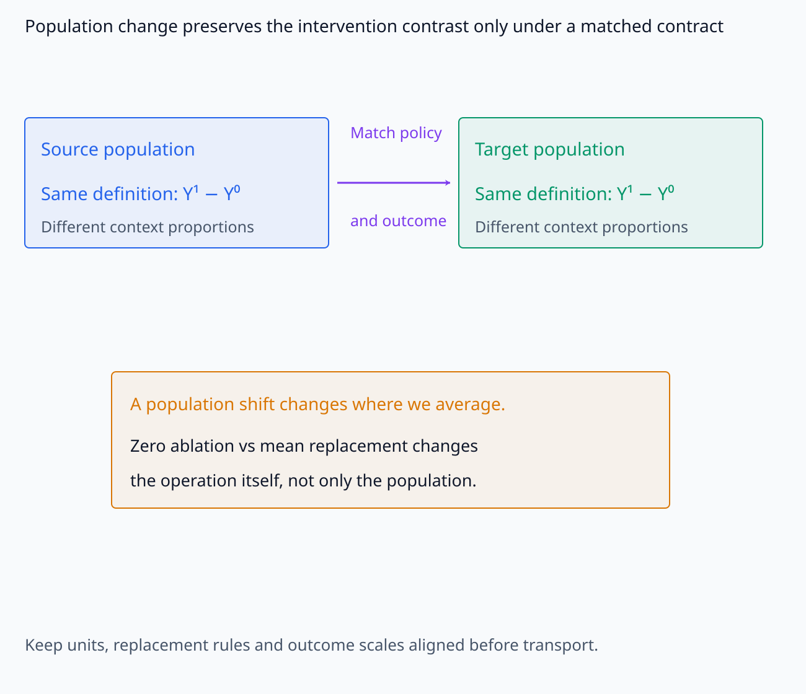
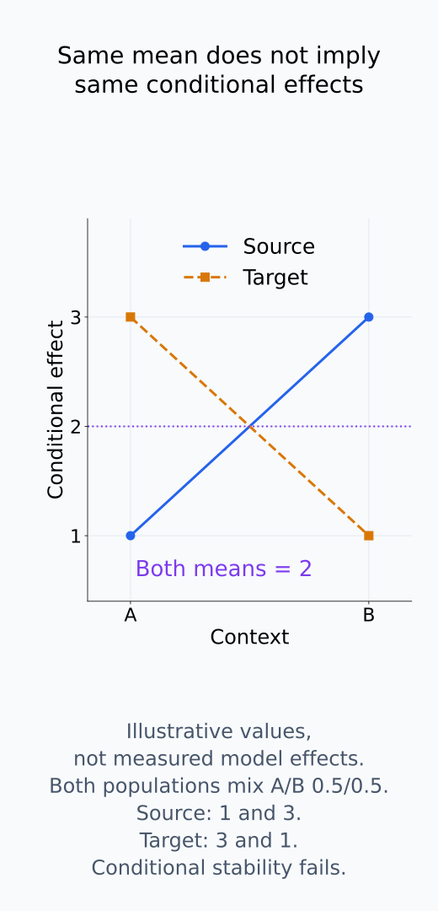
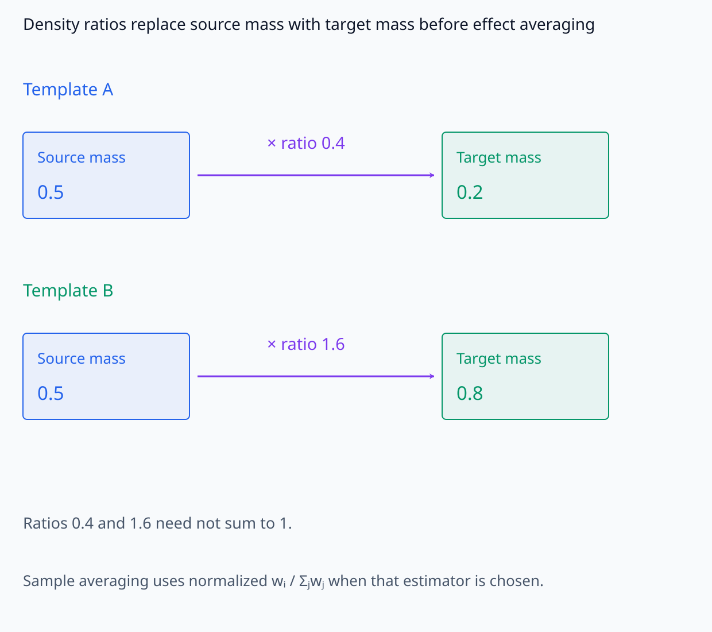
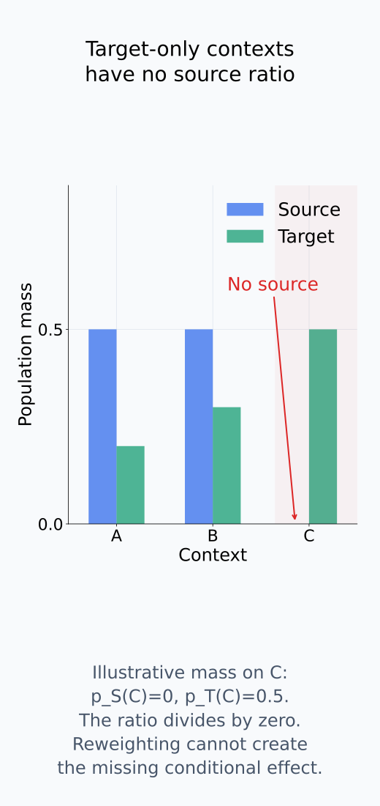
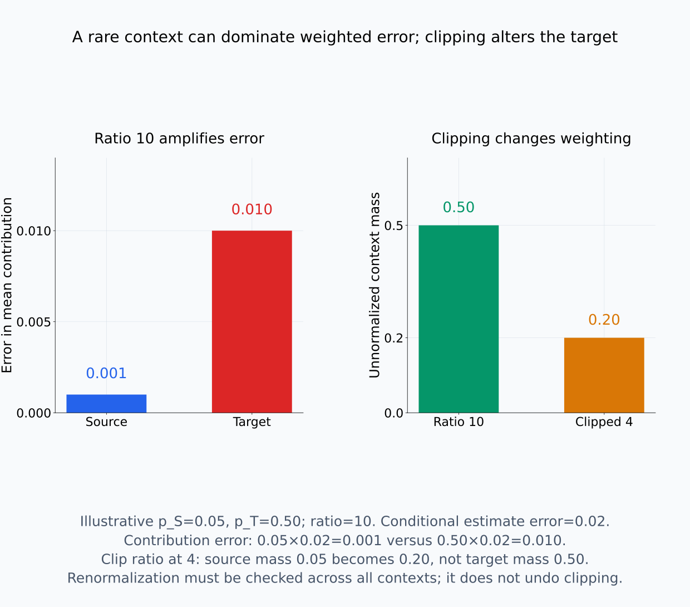
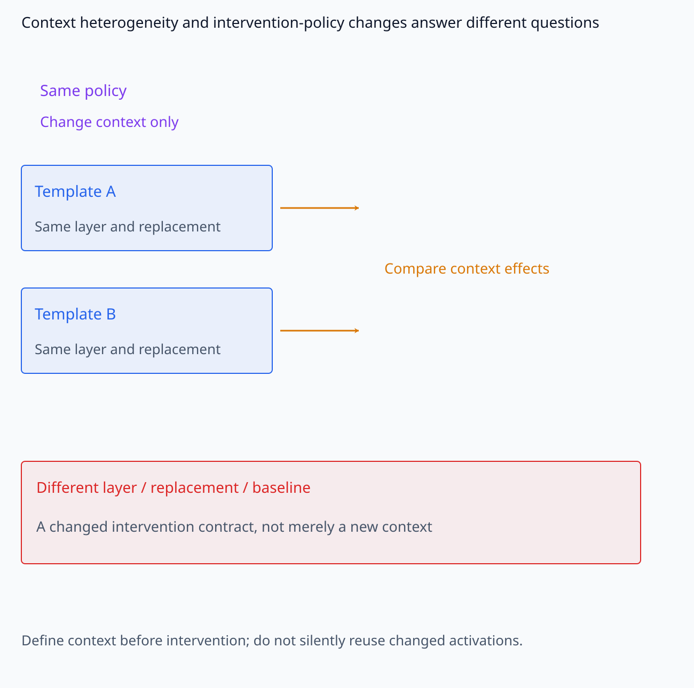
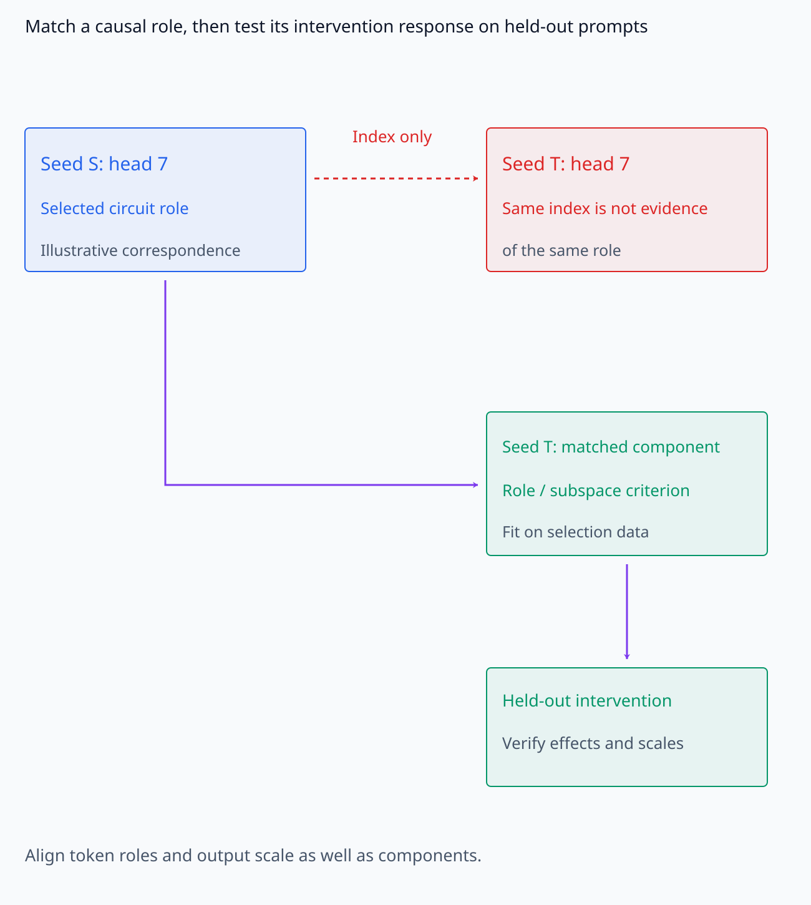
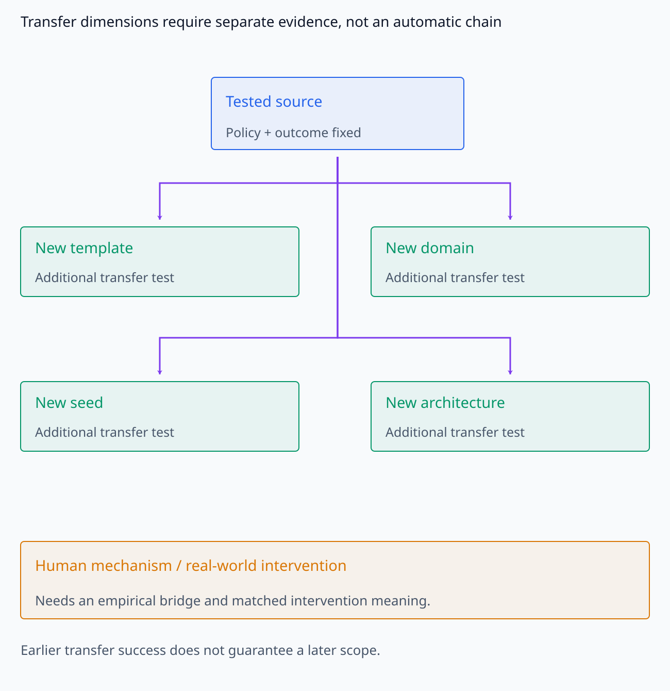
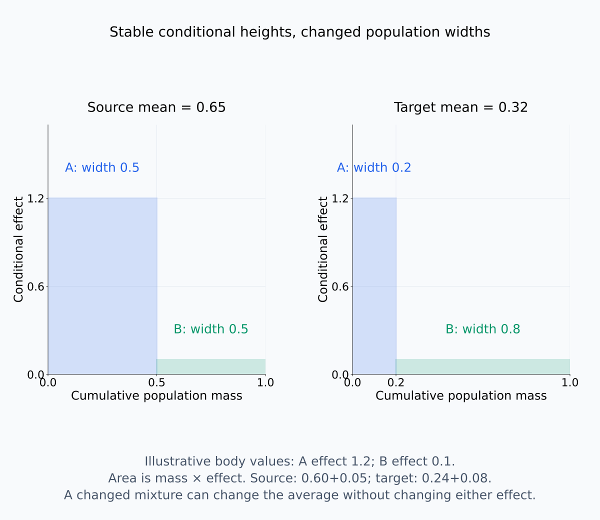
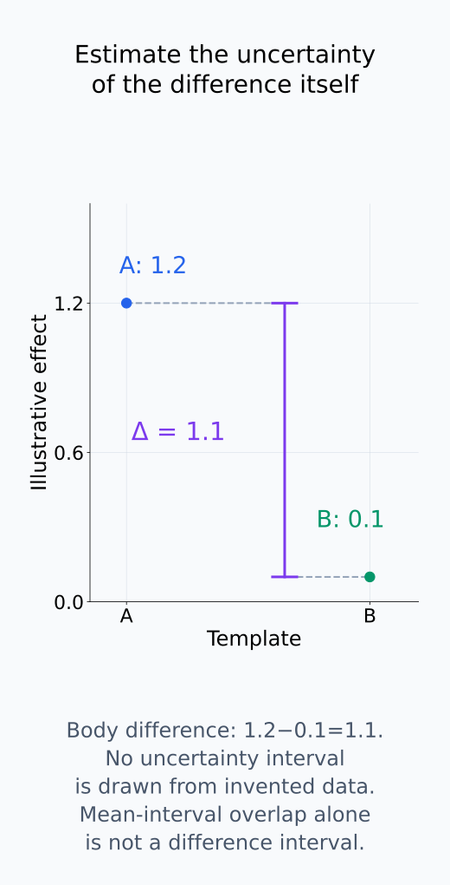

# A09-CAU-07. 내부 개입의 외적 타당성

## 이 단원이 필요한 이유

한 prompt template와 model checkpoint에서 측정한 내부 intervention effect는 그 실험 population에 대한 결과이다. 다른 prompt, language, model seed나 architecture로 효과를 옮기려면 effect heterogeneity와 support overlap을 검사해야 한다. model 내부 인과효과를 인간의 reasoning mechanism으로 확장하는 주장에는 별도의 연결 가정이 필요하다.

## 학습 목표

- source population effect와 target population effect를 구분할 수 있다.
- covariate shift 아래 transport weighting의 조건을 설명할 수 있다.
- prompt·seed·checkpoint에 따른 effect heterogeneity를 분석할 수 있다.
- 내부 개입 결과가 허용하는 외적 claim의 범위를 정할 수 있다.

## 선수지식 확인

- 선수 단원: [M04-17 실험 설계와 재현성](../../part-1-foundations/M04/M04-17-experimental-design-reproducibility.md), [I07-14 off-manifold intervention](../../part-3-interpretability/I07/I07-14-off-manifold-intervention.md), [I07-15 대조군과 통계 검증](../../part-3-interpretability/I07/I07-15-controls-statistical-validation.md), [A09-CAU-05 counterfactual과 potential outcome](A09-CAU-05-counterfactual-potential-outcomes.md)
- 확인 질문: average intervention effect가 같은 두 dataset에서도 subgroup effect가 다를 수 있는가?

## 기호와 용어

| 기호·용어 | Common spoken reading | 의미 | shape·범위 |
|---|---|---|---|
| $P_S$ | `P sub S` | intervention을 실행한 source distribution | distribution |
| $P_T$ | `P sub T` | claim을 옮기려는 target distribution | distribution |
| $\tau(x)$ | `tau of x` | context $x$에서의 conditional intervention effect | scalar or vector contrast |
| $w(x)=p_T(x)/p_S(x)$ | `w of x equals p sub T of x over p sub S of x` | covariate-shift transport weight | nonnegative scalar |

## 핵심 개념

### 같은 contrast를 다른 population에서 평균한다

source와 target population의 average effect를

$$
\tau_S=E_{X\sim P_S}[Y^1-Y^0],
\qquad
\tau_T=E_{X\sim P_T}[Y^1-Y^0]
$$

로 구분한다. $Y^1-Y^0$는 같은 unit에 적용한 두 개입의 contrast이고, $S$와 $T$는 그 contrast를 어느 population에서 평균하는지를 나타낸다. 이 표기에서는 두 population의 개입 규칙과 outcome 정의가 대응한다고 전제한다. 한쪽은 zero ablation, 다른 쪽은 mean replacement라면 population만 바꾼 같은 effect라고 볼 수 없다.

context $X=x$ 안에서도 여러 prompt나 배경값이 있을 수 있으므로 conditional effect는 $\tau_S(x)=E_S[Y^1-Y^0\mid X=x]$처럼 그 context 안의 평균이다. target에도 $\tau_T(x)$를 정의한다. 두 conditional effect가 같다면 공통 함수 $\tau(x)$를 쓸 수 있다. subgroup effect가 같아도 subgroup 비율이 달라지면 전체 평균은 달라진다. 반대로 전체 평균이 우연히 같아도 conditional effect가 같다는 결론은 나오지 않는다.

다음 그림은 같은 contrast의 계약과 평균 일치의 한계를 구분한다.

<figure class="lesson-figure lesson-figure--wide" markdown="1">

<figcaption>source와 target에서 같은 Y¹−Y⁰를 평균하려면 개입 policy와 outcome 정의가 대응해야 한다. population 비율 변경과 zero ablation→mean replacement 같은 조작 변경은 구분한다.</figcaption>

</figure>

<figure class="lesson-figure" markdown="1">

<figcaption>설명용 source effect는 A·B에서 1·3, target effect는 3·1이고 두 population의 비율은 모두 0.5·0.5다. 평균은 둘 다 2지만 각 context의 conditional effect는 다르다. 전체 평균 일치만으로 transportability를 확인할 수 없다.</figcaption>

</figure>

### transport weight가 바꾸는 평균의 비율

conditional effect $\tau(x)$가 population 사이에서 유지되고 target support가 source support 안에 있으면

$$
\tau_T=E_{P_S}[w(X)\tau(X)],
\qquad
w(x)=\frac{p_T(x)}{p_S(x)}
$$

처럼 reweight할 수 있다. 여기서 $p_S,p_T$는 동일한 context 공간의 확률 질량함수 또는 같은 기준으로 정의한 density다. discrete context에서는 중간 계산이

$$
\tau_T
=\sum_x p_T(x)\tau(x)
=\sum_{x:p_S(x)>0}p_S(x)\frac{p_T(x)}{p_S(x)}\tau(x)
$$

이다. source 평균에 이미 들어 있는 비율 $p_S(x)$를 $w(x)$로 바꿔 target 비율 $p_T(x)$를 만드는 것이다. continuous context에서는 합 대신 적분을 사용한다. 필요한 평균이 유한하고, target이 양의 확률을 주는 영역을 source가 빠뜨리지 않아야 한다. source에 없는 context는 분모가 0이라 이 방법으로 복구할 수 없다.

weighting은 **context가 얼마나 자주 나타나는지**를 바꾼다. 같은 context에서 effect 자체가 달라지는 문제를 고치지는 않는다. 관찰 자료에서 $\tau_S(x)$를 먼저 추정한다면 앞 단원의 consistency·exchangeability·positivity 조건도 별도로 필요하다. model에서 paired 개입을 직접 실행했더라도 conditional effect가 target에서 유지된다는 가정이 자동으로 따라오지는 않는다.

큰 weight는 source에서 드문 context가 target 평균에 크게 기여한다는 뜻이다. 그 context의 추정 오차도 증폭될 수 있다. finite sample의 $w_i$는 보통 합이 1인 비율이 아니다. $\sum_i w_i\widehat\tau_i/\sum_i w_i$에 쓰는 normalized weight는 $w_i/\sum_j w_j$로 따로 구분한다. weight를 잘라 안정화하면 원래 target 평균과 다른 가중 평균을 계산할 수 있으므로 처리 규칙을 밝혀야 한다.

다음 세 그림에서 mass의 변환, 빠진 support와 weight 처리의 영향을 따로 추적한다.

<figure class="lesson-figure lesson-figure--wide" markdown="1">

<figcaption>source mass p_S(x)에 ratio p_T(x)/p_S(x)를 곱하면 target mass p_T(x)가 된다. 0.4·1.6은 합이 1인 sample 기여 비율이 아니며, normalized weight wᵢ/Σⱼwⱼ와 구분한다.</figcaption>

</figure>

<figure class="lesson-figure" markdown="1">

<figcaption>설명용 context C는 target에서 mass 0.5를 갖지만 source mass는 0이다. 없는 context의 effect는 ratio weighting으로 만들어 낼 수 없으며, target support가 source support 안에 있다는 조건이 필요한 이유다.</figcaption>

</figure>

<figure class="lesson-figure lesson-figure--wide" markdown="1">

<figcaption>설명용 희소 context에서 source mass 0.05, target mass 0.50이면 ratio는 10이다. 같은 conditional-effect 추정 오차도 weighted contribution에서 더 크게 반영된다. ratio를 4로 자르면 이 context의 unnormalized mass는 0.20이 되며 원래 target mass 0.50과 달라진다. renormalization을 하더라도 전체 분포를 다시 확인해야 한다.</figcaption>

</figure>

### effect heterogeneity와 model 대응

내부 intervention에서는 prompt topic, syntax, token position에 따라 effect가 달라질 수 있다. context를 나누어 subgroup contrast와 그 차이를 확인한다. layer와 baseline value를 바꾸는 것은 조작 대상·policy의 변경이므로, 동일한 개입 아래 context 차이와 구분해 기록한다. 개입 뒤 변한 activation을 아무 설명 없이 baseline context로 사용하지 않는다.

model seed·checkpoint가 바뀌면 node correspondence도 다시 정의해야 한다. neuron index를 그대로 맞추는 대신 function, subspace나 circuit role을 alignment 기준으로 쓸 수 있다. 다만 activation similarity가 높은 component를 찾았다는 사실만으로 같은 intervention effect가 보장되지는 않는다. 대응 규칙을 selection data에서 정한 뒤 별도 prompt에서 조작 결과를 확인한다. tokenizer나 output scale이 달라지면 token 위치와 outcome의 대응도 함께 정해야 한다.

context 비교와 policy 변경, model 간 component 대응은 다음 두 그림처럼 분리한다.

<figure class="lesson-figure lesson-figure--wide" markdown="1">

<figcaption>같은 layer·replacement를 적용한 template A·B의 비교는 context heterogeneity를 묻는다. layer·baseline·replacement를 바꾸면 조작 계약도 바뀌므로 population 차이와 별도로 기록한다.</figcaption>

</figure>

<figure class="lesson-figure lesson-figure--wide" markdown="1">

<figcaption>같은 head index는 causal role의 대응 증거가 아니다. 그림의 seed 대응은 설명용이며 실제 model alignment 결과가 아니다. selection data에서 role·subspace 대응을 고른 뒤 별도 prompt에서 개입 response와 token role·output scale의 대응을 확인한다.</figcaption>

</figure>

### 확인한 transfer와 외적 claim

외적 타당성은 단계별로 확장한다. 같은 template의 held-out prompt, 새 template, 새 data domain, 새 seed, 새 architecture 순으로 transfer를 검사한다. neural intervention effect가 human cognition이나 사회적 outcome에 같은 mechanism으로 작용한다는 결론에는 별도 empirical bridge가 필요하다.

이 순서는 범위를 기록하는 틀이지, 앞 단계의 성공이 다음 단계의 성공을 보장하는 법칙은 아니다. 평가 prompt의 sampling 규칙, 성공한 subgroup과 실패한 subgroup, model·개입 대응을 함께 써야 “어디까지 옮겨졌는가”를 판단할 수 있다. internal activation의 조작과 인간이나 현실의 개입은 대상과 policy가 다르므로, 이름이 같은 concept를 사용했다는 이유만으로 동일한 causal effect가 되지 않는다.

다음 연결선은 확인할 transfer 범위를 나타내며 자동적인 일반화 보장은 아니다.

<figure class="lesson-figure lesson-figure--wide" markdown="1">

<figcaption>새 template·domain·seed·architecture는 각각 다른 transfer 범위다. 연결선은 추가로 확인할 대상을 나타낼 뿐 성공의 자동 전파를 뜻하지 않는다. model 내부 조작을 human mechanism으로 옮기는 주장에는 별도의 empirical bridge가 필요하다.</figcaption>

</figure>

## 작은 예제

template A에서 head ablation의 평균 logit effect가 1.2이고 template B에서 0.1이면 pooled average만 보고하지 않는다. template별 effect와 interaction interval을 제시하고 target population의 template mixture를 명시한다.

두 template를 source에서 반씩 보았다면 평균은 $0.5(1.2)+0.5(0.1)=0.65$다. conditional effect가 유지되고 target 비율이 A 0.2, B 0.8이라면 target 평균은 $0.2(1.2)+0.8(0.1)=0.32$다. density ratio weight는 A에서 $0.2/0.5=0.4$, B에서 $0.8/0.5=1.6$이다. source 평균에 이 weight를 곱하면 $0.5(0.4)(1.2)+0.5(1.6)(0.1)=0.32$로 같은 결과가 나온다.

template effect 차이는 $1.2-0.1=1.1$이다. 여기서 interaction interval은 이 차이의 불확실성 구간을 뜻한다. 두 평균의 구간이 겹치는지만 볼 것이 아니라, sampling 단위를 반영해 차이 자체의 구간을 구한다. 연습문제의 normalized weight처럼 합이 1인 값을 주었다면 density ratio와 혼동하지 않고 평균에 직접 사용하는 기여 비율로 읽는다.

다음 면적과 높이 차이는 population 평균과 subgroup contrast라는 서로 다른 수치를 보여 준다.

<figure class="lesson-figure lesson-figure--wide" markdown="1">

<figcaption>본문의 두 template effect 1.2·0.1을 높이로, population 비율을 폭으로 그렸다. conditional effect가 유지되어도 A·B의 폭이 source 0.5·0.5에서 target 0.2·0.8로 바뀌면 전체 면적은 0.65→0.32가 된다.</figcaption>

</figure>

<figure class="lesson-figure" markdown="1">

<figcaption>본문 수치에서 template effect 차이는 1.2−0.1=1.1이다. 이 그림은 차이의 계산만 보여 준다. uncertainty interval은 실제 sampling 단위를 반영해 별도로 추정해야 하며 두 평균 구간의 겹침만으로 대체하지 않는다.</figcaption>

</figure>

## 흔한 오해

- 여러 prompt를 썼다는 사실만으로 target domain 전체의 대표성이 확보되지는 않는다.
- 같은 architecture의 다른 seed에서 neuron index가 같다고 causal role이 대응하는 것은 아니다.

## 연습문제

### 1. transport
$P_S$에서 두 context effect가 $(1,3)$이고 target weight가 normalized $(0.25,0.75)$이면 target average effect는 얼마인가?

해설 보기

$0.25(1)+0.75(3)=2.5$이다.

### 2. positivity
target에만 있는 language가 source experiment에 전혀 없으면 weighting으로 transport할 수 있는가?

해설 보기

없다. target support가 source support 밖에 있어 positivity가 깨진다.

### 3. heterogeneity
overall effect가 0이지만 두 template effect가 $+2$와 $-2$이다. 무엇을 보고해야 하는가?

해설 보기

template별 effect와 target mixture를 보고한다. pooled zero를 effect 부재로 해석하지 않는다.

### 4. 모델 해석
한 model seed의 head 7이 필요하다는 결과를 다른 seed로 옮길 때 어떤 correspondence를 먼저 정하는가?

해설 보기

activation similarity만이 아니라 input–output role, path effect와 held-out intervention response로 대응 circuit component를 정한다.

## 근거와 갱신 경계

transport weighting 식은 conditional effect transportability와 covariate shift를 가정한다. selection diagram과 general transport formula는 다루지 않는다.

- [Dahabreh et al., *Extending inferences from a randomized trial to a new target population*, §4와 §8](https://arxiv.org/pdf/1805.00550): population 간 conditional effect의 안정성·positivity와 큰 weight의 문제. trial의 treatment 대비와 model의 internal intervention이 같은 조작이라는 뜻은 아니다.
- [Sugiyama et al., *Covariate Shift Adaptation by Importance Weighted Cross Validation* (2007), §2.1–2.2](https://jmlr.org/papers/volume8/sugiyama07a/sugiyama07a.pdf): 입력 density ratio가 평균의 분포를 바꾸는 importance weighting. 이 연산 자체가 causal identification 조건을 제공하지는 않는다.

## 단원 요약

- causal effect는 source population과 intervention policy에 상대적이다.
- transport에는 support overlap과 effect stability가 필요하다.
- prompt·template·seed·checkpoint는 effect modifier가 될 수 있다.
- model 내부 effect를 인간 수준 mechanism으로 옮기려면 별도 증거가 필요하다.

## 통과 기준

- source·target effect와 transport 가정을 적을 수 있는가?
- 내부 개입 claim을 확인한 domain과 model 범위에 한정할 수 있는가?

## 다음 단원

- [A09-CAU-08 종합 실습: circuit 수준 인과 주장](A09-CAU-08-capstone-circuit-causal-claims.md)

## 집필자 점검표

- [x] population transport·effect heterogeneity·model correspondence를 설명했다.
- [x] 문제 4개에 해설이 있다.
- [x] Common spoken reading이 실제 영어 학술 발화이며 한글 음역이나 기계적 직역을 포함하지 않는다.
- [x] 선수지식과 링크를 확인했다.
