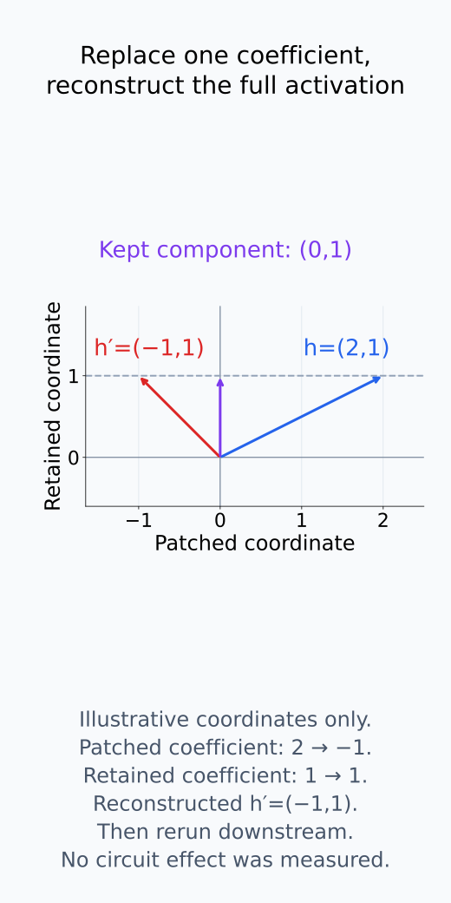
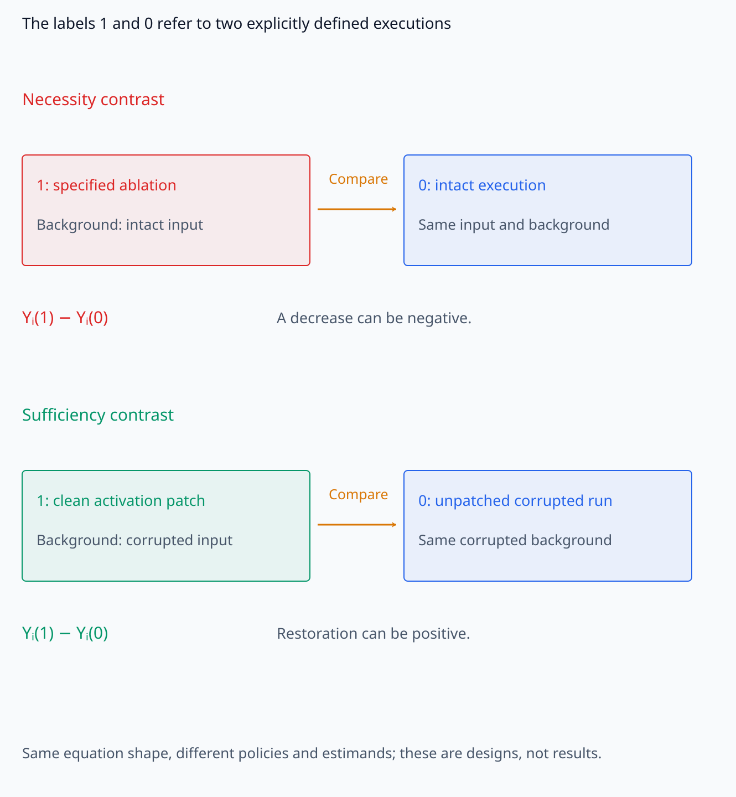
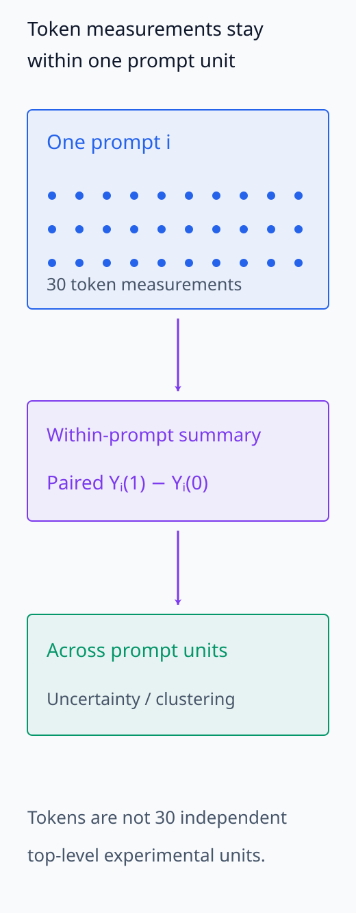
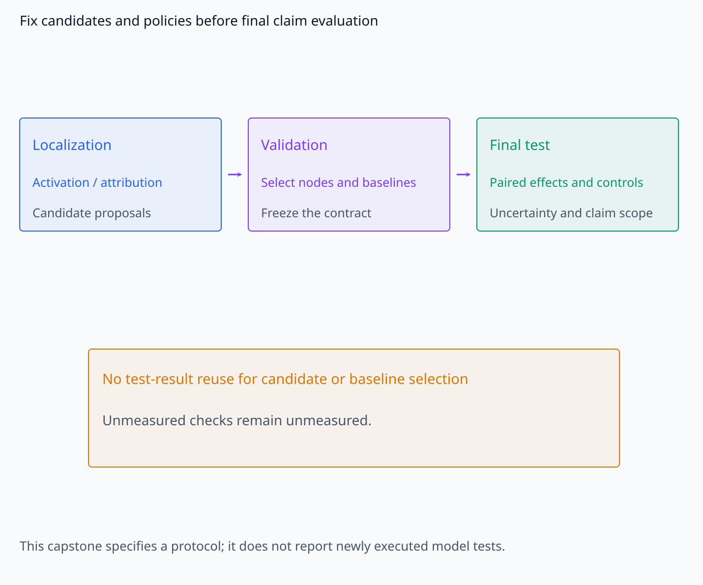
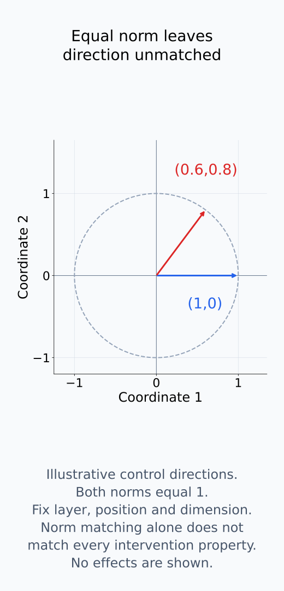
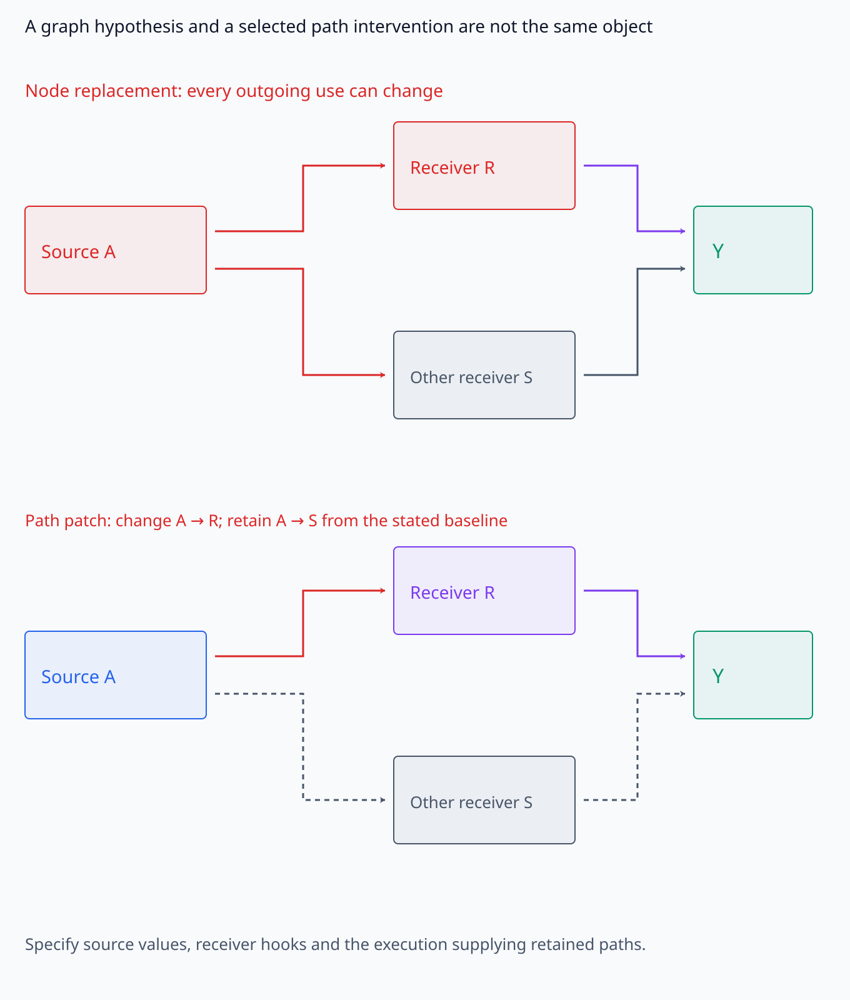
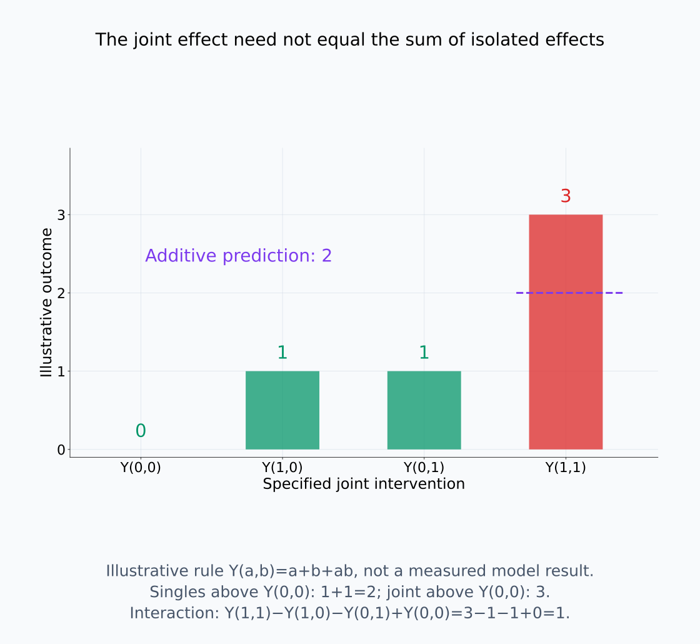
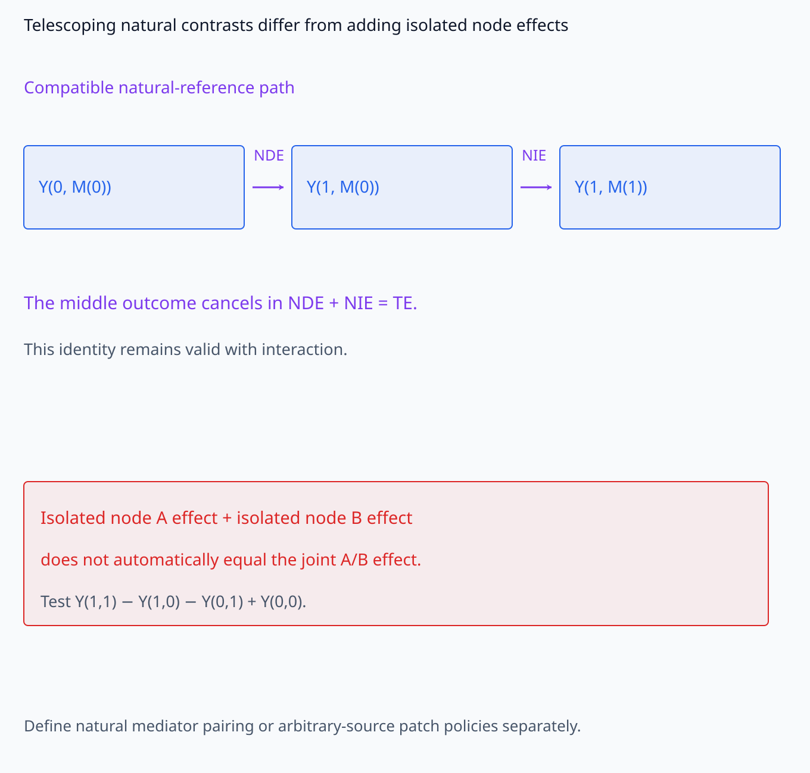
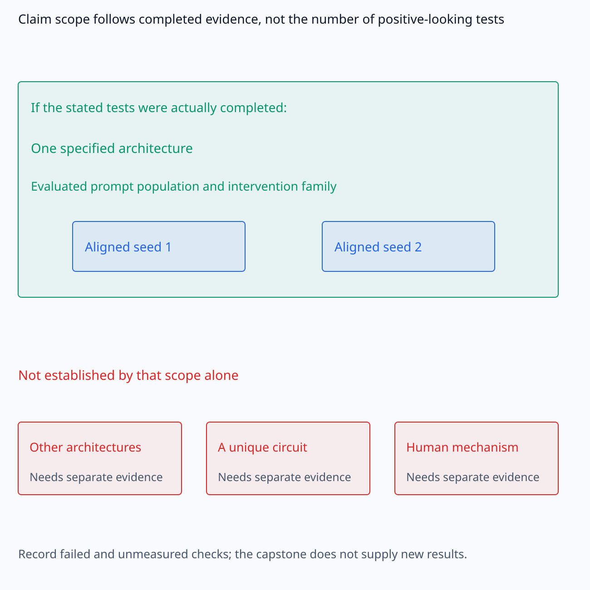

# A09-CAU-08. 종합 실습: circuit 수준 인과 주장

## 이 단원이 필요한 이유

circuit claim은 높은 attribution score나 ablation effect 하나로 완성되지 않는다. variable·graph·intervention·counterfactual·control·population을 한 계약에 묶고, necessity·sufficiency·mediation·abstraction의 증거를 각각 기록해야 한다. 이 실습은 claim strength를 측정 결과에 맞추는 최종 틀을 만든다.

## 학습 목표

- circuit hypothesis를 SCM과 potential outcome으로 표현할 수 있다.
- node·path intervention과 matched control을 설계할 수 있다.
- mediation과 causal abstraction 검증을 held-out data에 배치할 수 있다.
- internal·behavioral·external claim을 증거 수준에 맞춰 작성할 수 있다.

## 선수지식 확인

- 선수 단원: [CAU-01 SCM](A09-CAU-01-structural-causal-models.md), [CAU-02 do 연산](A09-CAU-02-do-operator-interventions.md), [CAU-03 identification](A09-CAU-03-confounding-identifiability.md), [CAU-04 mediation](A09-CAU-04-mediation-assumptions.md), [CAU-05 potential outcome](A09-CAU-05-counterfactual-potential-outcomes.md), [CAU-06 causal abstraction](A09-CAU-06-causal-abstraction.md), [CAU-07 외적 타당성](A09-CAU-07-external-validity-internal-interventions.md)
- 확인 질문: 한 component의 necessity와 sufficiency를 모두 보였어도 유일한 mechanism이라고 결론내릴 수 없는 이유는 무엇인가?

## 기호와 용어

| 기호·용어 | Common spoken reading | 의미 | shape·범위 |
|---|---|---|---|
| $C=(V_C,E_C)$ | `the circuit C with nodes V sub C and edges E sub C` | 검증할 circuit hypothesis | directed graph |
| $Y_i(z)$ | `the outcome for prompt i under intervention z` | prompt별 potential outcome | scalar or vector |
| $\tau_C=E[Y(1)-Y(0)]$ | `the average intervention effect of circuit C` | circuit intervention의 평균 effect | scalar or vector contrast |
| $\epsilon_{\mathrm{abs}}$ | `epsilon sub abs` | high·low-level intervention 불일치 | nonnegative scalar |

## 분석 계약

behavior $Y$와 experimental unit인 prompt를 먼저 정한다. clean·corrupted prompt pair, model·checkpoint·token 위치를 고정한다. circuit node는 residual component나 aligned subspace로 정의하고 edge는 downstream information transfer hypothesis로 정의한다. node 선택용 validation set과 final test set을 분리한다.

graph는 검증할 계산 경로의 가설이고, intervention은 그 가설을 시험하는 구체적인 조작이다. 두 node를 연결해 그렸다고 그 edge를 분리해 조작할 수 있는 것은 아니다. path patching에서는 어느 source 값을 어느 receiver에 전달하고 다른 path는 어떤 실행의 값으로 유지하는지 정해야 한다. node가 subspace이면 좌표를 추출한 뒤 원래 activation에 어떻게 재구성하는지도 계약에 포함한다.

$Y_i(1)$과 $Y_i(0)$의 1·0은 “clean/corrupted”나 “개입/무개입”으로 자동 결정되지 않는다. 비교마다 두 실행을 명시한다. 예를 들어 necessity 대비에서는 1을 ablation, 0을 intact 실행으로 둘 수 있다. sufficiency 대비에서는 1을 corrupted input에 지정 clean activation을 patch한 실행, 0을 patch하지 않은 corrupted 실행으로 둘 수 있다. 이 경우 두 대비는 같은 수식 형태를 쓰더라도 다른 estimand다.

outcome이 높을수록 behavior가 잘 유지된다는 기준이라면 ablation contrast는 음수, 복원 contrast는 양수가 될 수 있다. 부호를 통일하려고 정의를 조용히 바꾸지 않는다. 같은 prompt의 두 실행에서 model과 조작 밖의 배경을 고정하고, 반복 token 측정은 prompt 안에서 요약한다. candidate 선택, baseline 선택과 최종 claim 평가에 같은 test 결과를 재사용하지 않는다.

이 실습은 분석 계약을 작성하는 단계다. 아래 검사를 새 모델에서 모두 실행했다는 결과를 제공하지 않는다. 실행하지 않은 항목은 `미측정`으로 남기고, 실제로 확보한 결과에 한해서 결론을 작성한다.

다음 네 그림에서 subspace 재구성, 두 실행의 대비, prompt unit과 자료 분리 계약을 각각 추적한다.

<figure class="lesson-figure" markdown="1">

<figcaption>설명용 h=(2,1)ᵀ에서 first-coordinate subspace coefficient 2를 −1로 교체하면 재구성한 h′=(−1,1)ᵀ다. second coefficient 1은 유지한 채 full activation을 downstream에 전달한다. 이 예시는 subspace patch의 좌표 계약이며 실제 circuit 효과를 측정한 결과가 아니다.</figcaption>

</figure>

<figure class="lesson-figure lesson-figure--wide" markdown="1">

<figcaption>necessity의 1·0은 ablation·intact, sufficiency의 1·0은 corrupted 실행의 clean patch·unpatched 실행으로 정의한 예다. Yᵢ(1)−Yᵢ(0)의 모양이 같아도 background와 policy가 달라 서로 다른 estimand다. 부호 문장은 가능한 방향이며 측정값이 아니다.</figcaption>

</figure>

<figure class="lesson-figure lesson-figure--tall" markdown="1">

<figcaption>30개 점은 한 prompt 내부의 반복 token 측정이다. prompt 안에서 두 실행의 outcome을 요약해 paired contrast를 만들고 prompt 단위의 불확실성을 분석한다. token 수가 최상위 experimental unit 수가 되지는 않는다.</figcaption>

</figure>

<figure class="lesson-figure lesson-figure--wide" markdown="1">

<figcaption>localization은 후보를 제안하고 validation은 node·baseline 계약을 선택·고정한다. final test 결과를 다시 후보 선택에 쓰지 않는다. 이 capstone은 실행 설계이므로 실제로 수행하지 않은 검사는 미측정으로 남긴다.</figcaption>

</figure>

## 측정 절차

1. observational activation과 attribution으로 candidate를 고르되 이 결과는 localization evidence로만 기록한다.
2. node ablation과 activation patching으로 prompt별 paired necessity·sufficiency effect를 계산한다.
3. path patching으로 candidate edge effect를 측정하고 same-norm random path control과 비교한다.
4. mediator patch를 사용해 total·direct·indirect contrast를 계산하고 interaction을 검사한다.
5. source pairing, zero·mean·resample baseline과 off-manifold distance를 바꿔 robustness를 평가한다.
6. high-level variable과 low-level intervention의 causal abstraction error를 held-out operation에서 측정한다.
7. 새 template와 model seed에서 aligned circuit의 effect를 반복해 외적 타당성 범위를 정한다.

### necessity와 sufficiency의 비교 대상

ablation으로 score가 떨어졌다는 것은 지정한 제거 조작이 그 behavior에 영향을 주었다는 증거다. “반드시 필요하다”는 더 강한 표현에는 behavior의 성공 기준·허용 오차, baseline과 다른 경로의 보상 가능성이 필요하다. zero replacement가 전체 계산을 손상시켰다면 특정 정보의 necessity만 분리해 확인한 것이 아니다. matched control은 같은 layer·위치·차원이나 norm의 일반적 교란과 candidate에 특이적인 효과를 비교한다. norm만 같다고 조작의 모든 성질이 같아지는 것은 아니다.

patching의 sufficiency도 주변 model을 제거한 독립적인 충분조건이 아니다. corrupted 실행의 나머지 계산은 그대로 둔 채 지정 source·component를 바꾸어 behavior를 어느 정도 복원하는지를 본다. 따라서 “이 background와 patch 규칙에서 복원에 충분했다”라고 한정한다. 다른 circuit이 같은 조건에서 복원할 수 있는지는 별도로 검사해야 한다.

다음 좌표 그림은 norm을 맞춘 조작에도 남는 방향 차이를 보여 준다.

<figure class="lesson-figure" markdown="1">

<figcaption>설명용 perturbation 방향 (1,0)ᵀ와 (0.6,0.8)ᵀ는 norm이 모두 1이지만 방향은 다르다. layer·위치·차원까지 맞추더라도 norm 일치만으로 모든 조작 성질이 같아지지는 않는다. 이 좌표 그림은 control의 조건을 보여 주며 실제 효과의 차이를 측정한 것이 아니다.</figcaption>

</figure>

### path와 mediation의 interaction

node 전체를 바꾼 효과와 한 receiver로 가는 전달만 바꾼 효과는 서로 다른 조작 결과다. path별 effect를 단순히 더하면 같은 정보를 두 번 셀 수 있고, downstream nonlinear 연산의 interaction을 놓칠 수 있다. node A·B의 joint intervention을 검사할 때 같은 background·policy에서의 outcome을 $Y(0,0),Y(1,0),Y(0,1),Y(1,1)$로 쓰면 interaction contrast는

$$
Y(1,1)-Y(1,0)-Y(0,1)+Y(0,0)
$$

이다. 이것이 0이 아니면 이 네 조작 결과를 독립적인 두 effect의 합으로 설명할 수 없다. A·B는 여기서 두 intervention target의 이름이며, treatment와 mediator의 natural effect 표기를 대신하지 않는다.

CAU-04에서 reference를 맞춘 natural direct·indirect effect가 total effect로 합쳐지는 것은 중간항 소거에 의한 identity다. 그 identity는 interaction이 있어도 유지된다. 반면 개별 node patch effect를 합쳐 joint effect라고 부르는 것은 별도의 additivity 가정이다. mediator patch도 동일 unit의 natural mediator인지 임의 source policy인지 먼저 정해야 하고, 관찰 자료의 natural effect 식별에는 해당 단원의 추가 가정이 필요하다.

다음 세 그림은 조작할 path, joint interaction과 natural contrast의 identity를 구분한다.

<figure class="lesson-figure lesson-figure--wide" markdown="1">

<figcaption>상단은 node A를 바꿔 모든 outgoing use에 영향을 줄 수 있는 조작이고, 하단은 receiver R로 가는 전달만 지정값으로 바꾸는 path patch 계약이다. 회색 점선의 다른 path는 어느 baseline 실행 값으로 유지하는지 정해야 한다. 그림의 edge는 가설이며 실제 hook 구현이나 측정 완료를 뜻하지 않는다.</figcaption>

</figure>

<figure class="lesson-figure lesson-figure--wide" markdown="1">

<figcaption>설명용 rule Y(a,b)=a+b+ab에서 Y(0,0)=0, Y(1,0)=1, Y(0,1)=1, Y(1,1)=3이다. interaction contrast는 3−1−1+0=1이므로 개별 effect의 합 2가 joint effect 3을 설명하지 못한다. 실제 model이나 본 실습의 측정값이 아니다.</figcaption>

</figure>

<figure class="lesson-figure lesson-figure--wide" markdown="1">

<figcaption>상단 natural contrast는 같은 reference의 중간 outcome Y(1,M(0))가 소거되어 NDE+NIE=TE가 된다. 이 identity는 interaction이 있어도 성립한다. 하단의 개별 node effect 합을 joint effect로 부르는 것은 별도의 additivity 조건이며 같은 논리가 아니다.</figcaption>

</figure>

### abstraction과 transfer의 후속 확인

patch 효과가 크다는 것만으로 high-level algorithm의 구현 관계가 정해지는 것은 아니다. high-level model의 variable·rule과 개입 대응을 고정한 뒤 두 수준의 재계산 결과를 비교한다. selection에 사용하지 않은 prompt와 operation의 error를 구분해 기록한다. 새 seed에서는 숫자 index가 아니라 미리 정한 component 대응을 평가하고, 새 architecture를 검사하지 않았다면 그 범위는 결론에 포함하지 않는다.

## 결과 기록표

| 증거 | 허용 claim | 추가로 필요한 증거 |
|---|---|---|
| attribution | candidate localization | intervention |
| ablation | 지정 조작의 effect와 한정된 necessity 증거 | 성공 기준·redundancy·baseline control |
| patching | 지정 source·background에서 복원과 sufficiency 증거 | source specificity·off-manifold 진단 |
| path effect | 지정 graph edge의 effect | alternate path·interaction control |
| mediation | 정의한 contrast의 indirect effect | identification assumptions |
| abstraction | tested operation의 implementation consistency | unseen operation·domain |
| seed transfer | aligned circuit의 제한적 재현 | architecture·population transfer |

이 표의 행은 서로 대체할 수 있는 점수가 아니다. attribution으로 위치를 좁힌 뒤 개입으로 effect를 확인하고, mediation·abstraction으로 어떤 경로나 rule의 주장인지 구체화한다. 다만 모든 논문이 표의 모든 claim을 할 필요는 없다. node effect만 측정했다면 그 결과에 해당하는 행에서 결론을 멈춘다.

보고서에는 각 contrast의 두 policy, prompt sampling, outcome과 부호, paired effect와 불확실성, control 결과를 함께 남긴다. 두 seed에서 성공했다면 “평가한 두 seed에서 재현됐다”라고 쓴다. 모든 seed, 유일한 circuit, 인간 reasoning mechanism을 확인했다는 표현으로 넓히지 않는다. 실패나 `미측정` 항목도 claim 범위를 결정하는 정보다.

다음 포함 관계는 실제로 확보한 증거 안에서 결론의 범위를 정하는 방식이다.

<figure class="lesson-figure lesson-figure--wide" markdown="1">

<figcaption>그림은 해당 검사를 실제로 완료했을 경우 허용되는 한정된 결론을 나타낸다. 평가한 두 seed·prompt population·architecture 밖의 일반화, circuit의 유일성, human mechanism은 그 결과만으로 확인되지 않는다. 이 단원 자체는 새 실험 결과를 제공하지 않는다.</figcaption>

</figure>

## 흔한 오해

- 여러 positive test를 통과해도 test들이 같은 prompt와 selection을 재사용하면 독립된 증거가 아니다.
- circuit completeness는 관찰한 behavior와 intervention family에 상대적이다.

## 연습문제

### 1. unit
한 prompt에서 30개 token effect를 얻었다. paired uncertainty의 최상위 unit을 무엇으로 두는가?

해설 보기

prompt를 최상위 unit으로 두고 token effect를 prompt 안에서 요약하거나 clustered inference를 사용한다.

### 2. sufficiency
candidate circuit만 clean activation으로 patch해 behavior가 복원됐지만 full-model ablation에서 alternate circuit도 같은 복원을 보였다. 어떤 claim을 피하는가?

해설 보기

candidate circuit이 유일한 sufficient mechanism이라는 claim을 피한다. redundant sufficient path가 있을 수 있다.

### 3. mediation
node A와 B를 함께 patch한 effect가 개별 effect 합보다 크다. path effect를 어떻게 다루는가?

해설 보기

interaction을 명시하고 additive mediation decomposition을 그대로 적용하지 않는다. joint intervention contrast를 별도 estimand로 보고한다.

### 4. final claim
held-out prompt와 두 seed에서 node·path effect는 재현됐지만 새 architecture는 평가하지 않았다. 결론을 작성하라.

해설 보기

지정 architecture의 두 seed와 평가한 prompt population에서 aligned circuit intervention effect가 재현됐다고 쓴다. 다른 architecture로의 일반화는 주장하지 않는다.

## 근거와 갱신 경계

이 실습은 circuit claim의 분석 계약과 증거 사다리를 제공한다. 모든 latent confounding을 제거하거나 high-level algorithm의 유일성을 증명하지 않는다.

- [Wang et al., *Interpretability in the Wild: a Circuit for Indirect Object Identification in GPT-2 small*, §4](https://arxiv.org/pdf/2211.00593): circuit의 성능 복원과 completeness·minimality를 구분하는 실험적 검증. 본문의 necessity·sufficiency 비교는 해당 논문의 점수나 실험 결과를 그대로 재현한 것이 아니다.

## 단원 요약

- circuit claim은 graph, intervention family와 population에 상대적이다.
- necessity·sufficiency·path·mediation은 서로 다른 estimand이다.
- causal abstraction은 high·low-level intervention correspondence를 검증한다.
- 외적 타당성은 prompt, seed와 architecture 단계별로 확장한다.

## 통과 기준

- graph–unit–intervention–control–estimand–claim 계약을 완성할 수 있는가?
- positive result와 미검증 범위를 한 문단에 함께 쓸 수 있는가?

## 다음 단원

- A09 선택 심화 7개 모듈의 통합 감사로 넘어간다.

## 집필자 점검표

- [x] circuit 수준 causal claim의 증거 사다리와 외적 범위를 완성했다.
- [x] 문제 4개에 해설이 있다.
- [x] Common spoken reading이 실제 영어 학술 발화이며 한글 음역이나 기계적 직역을 포함하지 않는다.
- [x] 선수지식과 링크를 확인했다.
