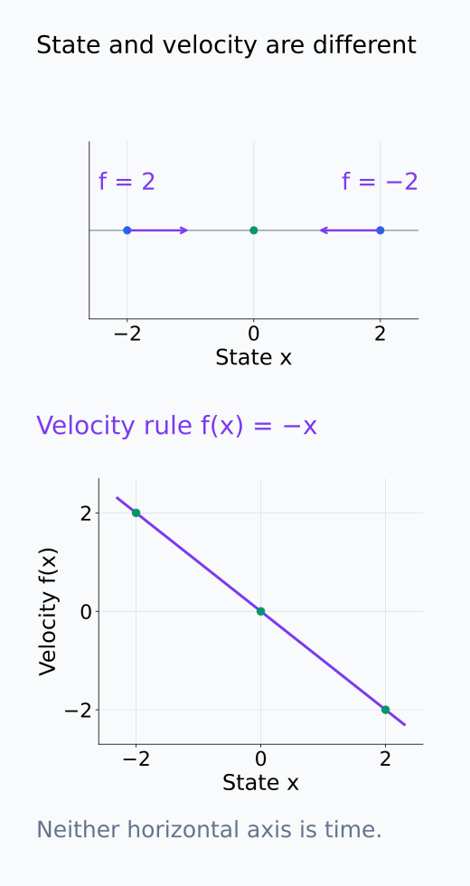
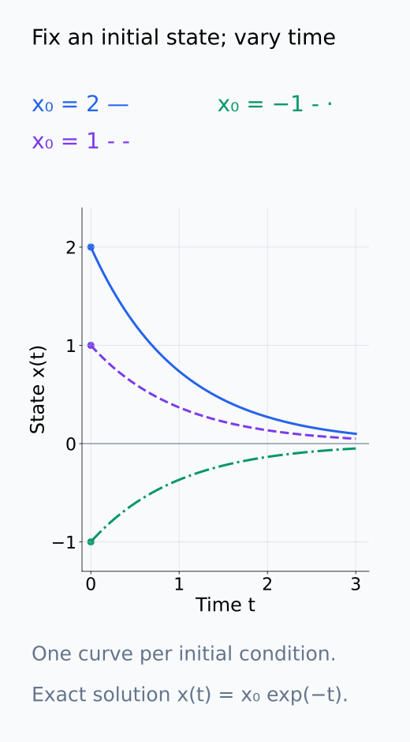
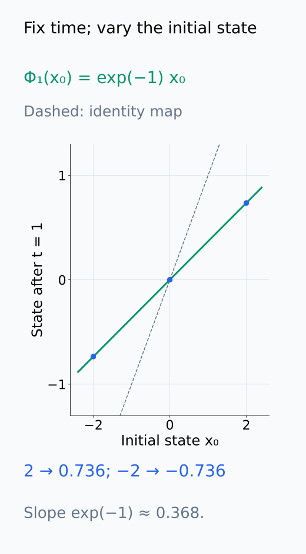
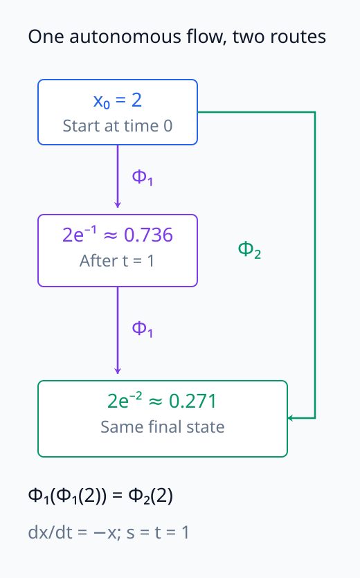
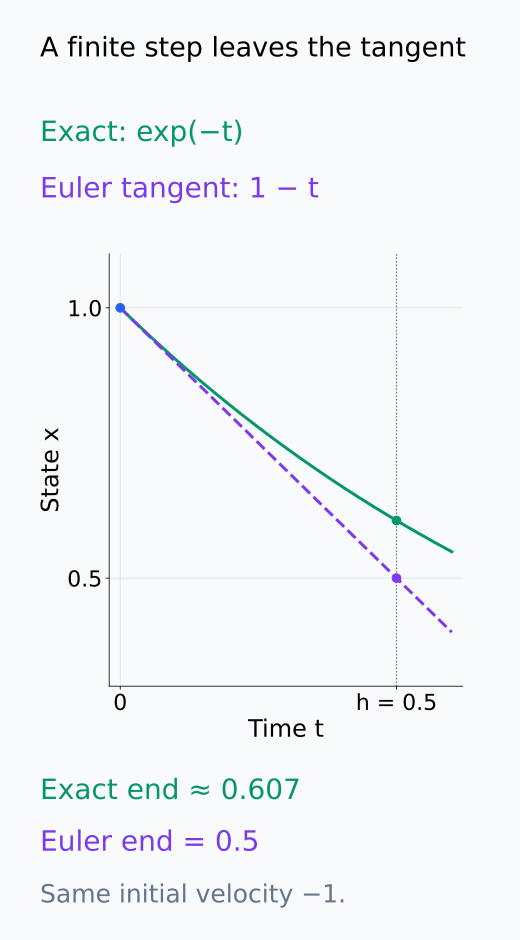
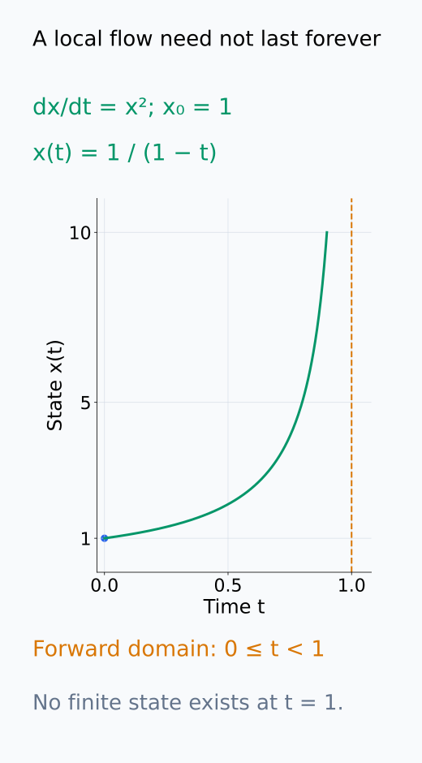
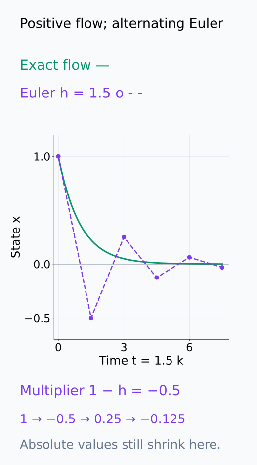

# A09-DYN-01. 미분방정식과 흐름

## 이 단원이 필요한 이유

학습을 parameter update의 목록으로만 보면 시간에 따른 구조를 놓친다. ordinary differential equation은 현재 state가 순간 변화율을 정하는 계를 기술하고, flow는 초기조건 전체가 시간에 따라 이동하는 map을 뜻한다.

## 학습 목표

- autonomous ODE의 state와 vector field를 구분할 수 있다.
- solution trajectory와 flow map을 구분할 수 있다.
- Euler discretization을 gradient descent와 연결할 수 있다.
- 존재·유일성 가정이 필요한 이유를 설명할 수 있다.

## 선수지식 확인

- 선수 단원: [M01-03 미분](../../part-1-foundations/M01/M01-03-derivative-instantaneous-rate.md), [M01-06 연쇄법칙](../../part-1-foundations/M01/M01-06-composition-chain-rule.md), [M03-10 total derivative](../../part-1-foundations/M03/M03-10-total-derivative-differential.md)
- 확인 질문: derivative가 현재 state의 함수라는 말은 무엇을 뜻하는가?

## 기호와 용어

| 기호·용어 | Common spoken reading | 의미 | shape·범위 |
|---|---|---|---|
| $\dot x=f(x)$ | `x dot equals f of x` | autonomous ODE | $x\in\mathbb R^d$ |
| $x(t;x_0)$ | `x at time t given x naught` | 초기값 $x_0$의 trajectory | vector |
| $\Phi_t(x_0)$ | `Phi sub t of x naught` | time-$t$ flow map | state to state |
| $h$ | `h` | discretization step | positive scalar |

## 핵심 개념

### State와 vector field

autonomous ODE

$$
\dot x(t)=f(x(t)),\qquad x(0)=x_0
$$

에서 $x(t)\in\mathbb R^d$는 시간 $t$의 state이고, $\dot x(t)$는 각 성분의 순간 변화율을 모은 벡터다. $f:\mathbb R^d\to\mathbb R^d$는 주어진 state에서 다음 순간 어느 방향으로 얼마나 빠르게 움직일지를 정하는 vector field이다. $f$의 입력은 시간 자체가 아니라 현재 state이므로 autonomous라고 부른다. 시간에 따른 변화를 다루지 않는다는 뜻은 아니다. $x(t)$가 바뀌면 $f(x(t))$도 바뀔 수 있다.

해를 구한다는 것은 모든 시간에서 이 변화율 조건을 만족하면서 $x(0)=x_0$에서 출발하는 함수 $t\mapsto x(t)$를 찾는다는 뜻이다. 처음의 velocity $f(x_0)$만 알면 출발 방향은 알 수 있지만, 이후에는 이동한 위치에서 velocity를 다시 평가해야 한다.

아래 두 축에서 state와 velocity를 구분해 읽는다.

<figure class="lesson-figure" markdown="1">

<figcaption>위의 state 축에서는 −2가 오른쪽, 2가 왼쪽으로 움직인다. 아래 f(x) = −x의 세 점은 같은 state에서의 순간 velocity가 각각 2, 0, −2임을 보여 준다. 아래 가로축도 시간 t가 아니라 state x이다.</figcaption>

</figure>

### Trajectory와 flow map

초기값 하나를 고정한 해 $t\mapsto x(t;x_0)$는 solution trajectory이다. 반대로 시간 $t$를 고정하고 초기값을 바꾸면 $x_0\mapsto x(t;x_0)$라는 flow map $\Phi_t$를 얻는다. trajectory는 시간에서 state로 가는 함수이고, flow map은 초기 state에서 나중 state로 가는 함수다.

해가 유일하고 필요한 시간까지 존재하면

$$
\Phi_0(x_0)=x_0,\qquad
\Phi_{t+s}(x_0)=\Phi_t(\Phi_s(x_0))
$$

가 성립한다. 오른쪽은 먼저 $s$만큼 이동한 뒤 그 위치를 새 초기값으로 삼아 $t$만큼 더 이동하는 계산이다. autonomous 계에서는 같은 위치의 velocity 규칙이 시간에 따라 달라지지 않고, 유일성이 두 계산 경로를 같은 해로 연결한다. 이 관계는 양쪽 해가 정의되는 시간 범위에서만 사용한다.

시간을 움직이는 읽기와 초기값을 움직이는 읽기를 아래 그림에서 비교한다.

<figure class="lesson-figure" markdown="1">

<figcaption>x₀를 하나 고르면 가로축 t를 따라 그 초기값의 곡선 하나를 읽는다. 예를 들어 파란 x₀ = 2의 곡선은 x(t) = 2e⁻ᵗ이다. 다른 두 곡선은 다른 초기조건의 해이지 같은 실행의 이후 위치가 아니다.</figcaption>

</figure>

<figure class="lesson-figure" markdown="1">

<figcaption>시간 t = 1을 고정했다. 이제 가로축은 초기값 x₀, 세로축은 그 초기값이 한 시간 뒤 도착한 state이다. 기울기 e⁻¹인 map은 양수와 음수 초기값 모두를 0 쪽으로 수축시킨다.</figcaption>

</figure>

<figure class="lesson-figure" markdown="1">

<figcaption>s = t = 1, x₀ = 2로 두 경로를 비교했다. 왼쪽은 첫 도착점을 새 초기값으로 넣는 계산이며, 오른쪽 Φ₂는 처음 state에 한 번 적용한다. 두 경로가 같은 마지막 상자에 도착하는 것이 flow 합성 관계이다.</figcaption>

</figure>

### Euler method와 gradient descent

Euler method는

$$
x_{k+1}=x_k+h f(x_k)
$$

로 연속 trajectory를 근사한다. 미분의 1차 근사 $x(t+h)\approx x(t)+h\dot x(t)$에 $\dot x(t)=f(x(t))$를 대입한 식이다. Euler method는 한 step 동안 velocity를 출발점의 값 $f(x_k)$로 고정한다. 실제 해는 그 사이의 위치에서도 velocity가 달라질 수 있으므로 finite step이 정확한 flow와 같지는 않다.

$f(\theta)=-\nabla L(\theta)$이면 $\theta_{k+1}=\theta_k-h\nabla L(\theta_k)$가 되어 gradient descent의 learning rate를 $h$에 대응시킬 수 있다. 이는 동일한 loss의 정확한 gradient를 쓰는 update의 대응이다. momentum이나 stochastic sampling이 있는 optimizer는 해당 state와 noise를 별도로 고려해야 한다.

아래 곡선과 접선은 한 Euler step의 서로 다른 끝점을 보여 준다.

<figure class="lesson-figure" markdown="1">

<figcaption>a = 1, x₀ = 1, h = 0.5의 설명용 step이다. Euler는 출발점의 velocity −1을 고정해 x₁ = 0.5로 가지만 정확한 해는 e⁻⁰·⁵ ≈ 0.607에 도착한다. 두 계산은 출발점과 접선 기울기를 공유할 뿐 finite step의 끝점은 다르다.</figcaption>

</figure>

### 존재·유일성과 시간 범위

flow map의 출력이 하나로 정해지려면 초기값에서 출발하는 해가 존재하고 유일해야 한다. 대표적인 충분조건은 $f$가 초기값 근처에서 locally Lipschitz라는 것이다. 이는 그 근방의 두 state $u,v$에 대해 어떤 유한한 $K$가 있어 $\|f(u)-f(v)\|_2\le K\|u-v\|_2$라는 뜻이다. state가 조금 달라졌을 때 velocity 차이가 이 비율을 넘지 않도록 제한한다. 연속인 1차 편미분을 갖는 $f$는 이 국소 조건을 만족한다.

이 조건은 짧은 시간의 존재·유일성을 보장하며 모든 시간의 존재까지 보장하지는 않는다. 예를 들어 $\dot x=x^2$, $x_0>0$의 해 $x(t)=x_0/(1-x_0t)$는 $t=1/x_0$에서 발산한다. 따라서 $\Phi_t$를 사용할 때는 해당 초기값의 해가 시간 $t$까지 존재하는지도 확인한다.

국소 존재와 전시간 존재의 차이는 아래 시간 경계에서 확인할 수 있다.

<figure class="lesson-figure" markdown="1">

<figcaption>x₀ = 1인 기존 예제의 해는 x(t) = 1/(1 − t)이다. f(x) = x²는 매끄럽지만 이 초기값의 forward 해는 t = 1까지 존재하지 않는다. 점선은 해가 도달한 state가 아니라 유한시간 경계이다.</figcaption>

</figure>

## 작은 예제

$\dot x=-ax$, $a>0$의 해는 $x(t)=x_0e^{-at}$이다. 미분하면 $\dot x(t)=-ax_0e^{-at}=-ax(t)$이고 $x(0)=x_0$이므로 초기값과 ODE를 모두 만족한다. flow는 $\Phi_t(x_0)=e^{-at}x_0$이며 $t>0$에서 모든 초기값을 0으로 수축시킨다.

같은 계의 Euler step은 $x_{k+1}=(1-ah)x_k$이다. 실제 한 step의 배율 $e^{-ah}$와 비교하면 $e^{-ah}\approx1-ah$라는 1차 근사임을 볼 수 있다. 연속 해의 배율은 양수이지만 $ah>1$이면 Euler 배율은 음수가 되어 부호가 번갈아 바뀐다. 작은 step의 계산식 대응과 장기 거동의 일치는 구분해야 한다.

연속 해와 Euler의 부호 변화는 아래 동일한 시간 축에서 비교한다.

<figure class="lesson-figure" markdown="1">

<figcaption>a = 1, h = 1.5이면 Euler 배율은 1 − ah = −0.5이다. 따라서 1, −0.5, 0.25, −0.125로 부호가 바뀌지만 정확한 e⁻ᵗ는 항상 양수이다. 이 예에서는 Euler의 절댓값도 줄어들며, 모든 큰 step이 발산한다고 뜻하지는 않는다.</figcaption>

</figure>

## 흔한 오해

- vector field는 trajectory 하나가 아니라 가능한 모든 state의 velocity 규칙이다.
- 작은 learning rate라도 discrete optimizer와 ODE가 자동으로 같은 장기 거동을 갖는 것은 아니다.

## 연습문제

### 1. 해 확인
$x(t)=x_0e^{2t}$가 $\dot x=2x$를 만족하는지 확인하라.

해설 보기

$\dot x=2x_0e^{2t}=2x(t)$이고 $x(0)=x_0$이므로 만족한다.

### 2. flow 성질
$\Phi_t(x)=e^{-t}x$에서 $\Phi_t(\Phi_s(x))=\Phi_{t+s}(x)$임을 보이라.

해설 보기

$e^{-t}(e^{-s}x)=e^{-(t+s)}x$이다.

### 3. Euler step
$\dot x=-x$, $x_0=1$, $h=0.1$에서 첫 step을 구하라.

해설 보기

$x_1=1+0.1(-1)=0.9$이다.

### 4. 학습 해석
optimizer log를 ODE trajectory로 해석하기 전에 기록할 두 항목을 쓰라.

해설 보기

실제 step size schedule과 optimizer state·update rule을 기록해야 한다. stochastic gradient의 sampling 규칙도 필요하다.

## 근거와 갱신 경계

ODE·flow·Euler method는 dynamical systems의 표준 정의를 따른다. 국소 Lipschitz 조건과 국소 flow의 정의는 [CMU의 존재·유일성 강의노트](https://www.math.cmu.edu/~gautam/c/2026-632/notes/existence.html)를 기준으로 확인했다. 이 단원은 Picard–Lindelöf theorem의 증명을 다루지 않는다.

## 단원 요약

- vector field는 state별 velocity를 정한다.
- trajectory는 한 초기값의 해이고 flow는 초기값 전체의 이동 map이다.
- Euler method는 ODE를 discrete update로 근사한다.
- optimizer와 연속시간 모델의 일치는 가정과 오차 분석이 필요하다.

## 통과 기준

- ODE·trajectory·flow를 구분할 수 있는가?
- Euler update를 계산하고 근사의 한계를 말할 수 있는가?

## 다음 단원

- [A09-DYN-02 fixed point와 선형 안정성](A09-DYN-02-fixed-points-linear-stability.md)

## 집필자 점검표

- [x] ODE와 flow의 타입을 구분했다.
- [x] 문제 4개에 해설이 있다.
- [x] Common spoken reading이 실제 영어 학술 발화이며 한글 음역이나 기계적 직역을 포함하지 않는다.
- [x] 선수지식과 링크를 확인했다.
