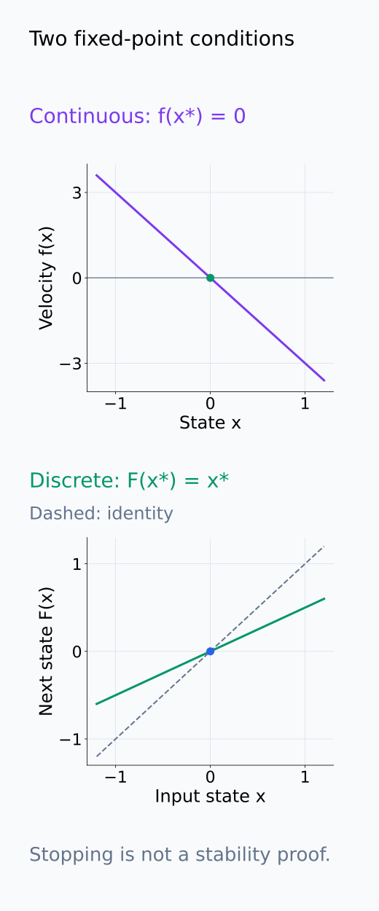
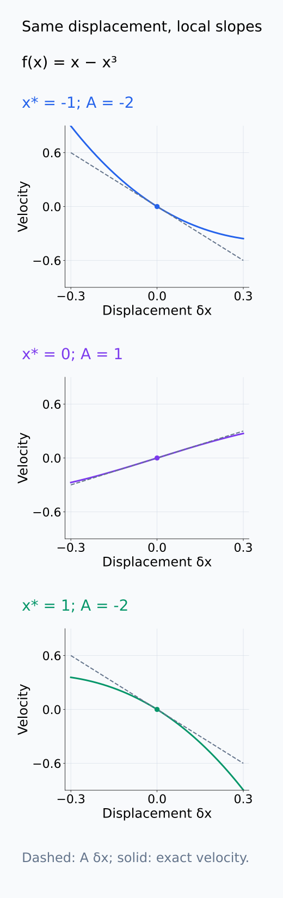
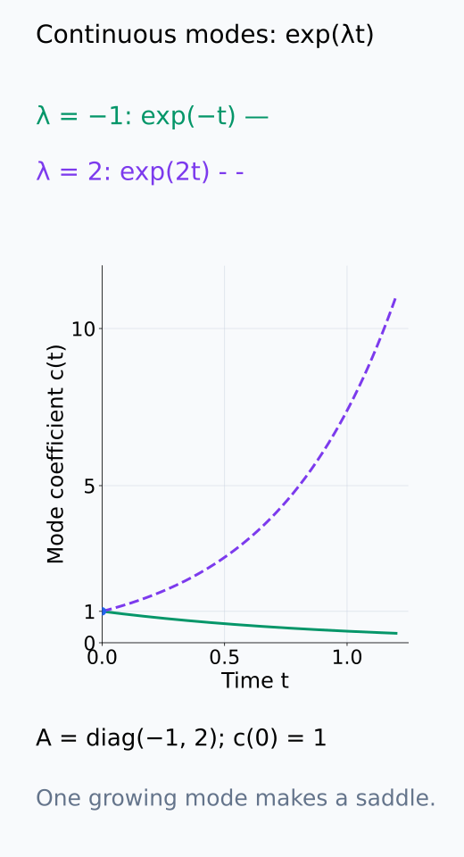
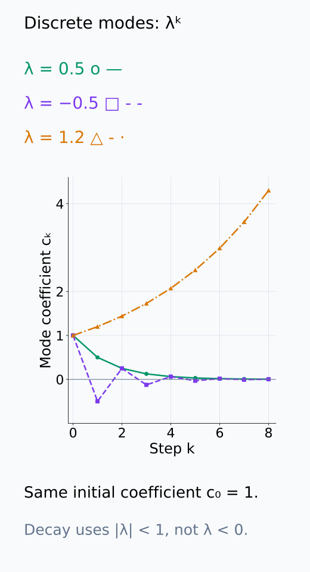
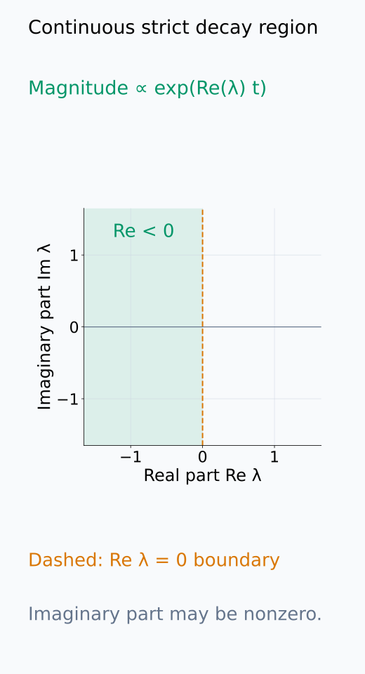
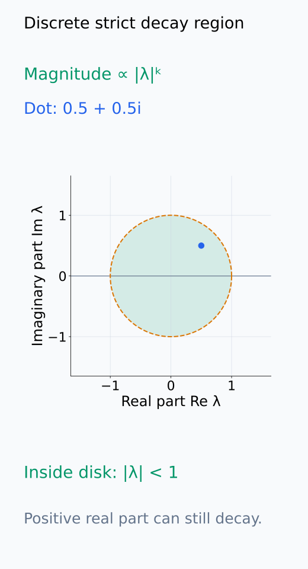
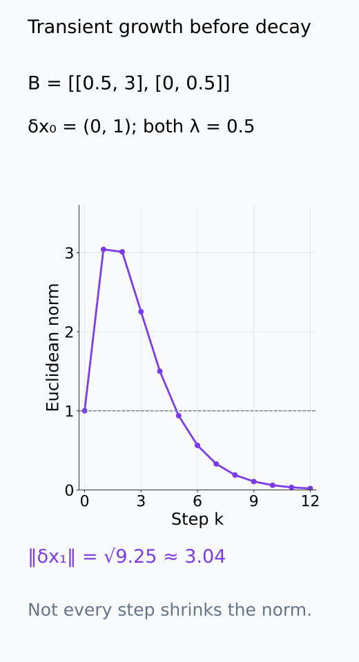
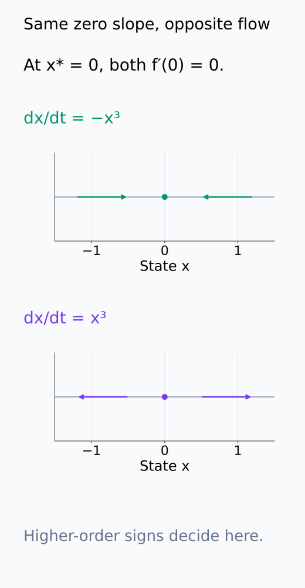

# A09-DYN-02. fixed point와 선형 안정성

## 이 단원이 필요한 이유

학습이나 recurrent computation이 어느 state 근처에 머무는지 알려면 fixed point와 그 주변의 perturbation이 커지는지 줄어드는지를 봐야 한다. Jacobian eigenvalue는 nonlinear dynamics의 국소 안정성을 일차 근사로 판정한다.

## 학습 목표

- continuous·discrete fixed point 조건을 쓸 수 있다.
- Jacobian linearization을 계산할 수 있다.
- eigenvalue로 hyperbolic fixed point의 국소 안정성을 판정할 수 있다.
- non-hyperbolic case에서 선형화가 결론을 주지 못함을 설명할 수 있다.

## 선수지식 확인

- 선수 단원: [A09-DYN-01 미분방정식과 흐름](A09-DYN-01-odes-flows.md), [M02-11 고유값](../../part-1-foundations/M02/M02-11-eigenvalues-eigenvectors.md), [M03-11 Jacobian](../../part-1-foundations/M03/M03-11-jacobian.md)
- 확인 질문: matrix power에서 eigenvalue magnitude가 반복 적용에 미치는 영향은 무엇인가?

## 기호와 용어

| 기호·용어 | Common spoken reading | 의미 | shape·범위 |
|---|---|---|---|
| $x^*$ | `x star` | fixed point | state |
| $A=Df(x^*)$ | `A equals D f at x star` | linearization matrix | $d\times d$ |
| $\lambda_i(A)$ | `lambda sub i of A` | $A$의 eigenvalue | complex scalar |
| $\delta x$ | `delta x` | fixed point 주변 perturbation | vector |

## 핵심 개념

### Fixed point와 perturbation

continuous system $\dot x=f(x)$의 fixed point는 $f(x^*)=0$이다. 그 점에서 velocity가 0이므로 $x(t)=x^*$라는 상수 함수가 해가 된다. discrete map $x_{k+1}=F(x_k)$에서는 $F(x^*)=x^*$가 같은 역할을 한다. 연속 계에서는 변화율이 0인지, 이산 계에서는 update 후의 state가 그대로인지 확인한다.

fixed point를 찾는 일과 안정성을 판정하는 일은 다르다. locally asymptotically stable하다는 것은 충분히 가까운 초기값의 해가 그 점 근처에 머물며 시간이 지나면 그 점으로 수렴한다는 뜻이다. 점에 정확히 놓았을 때 멈춘다는 조건만으로 주변 해의 수렴을 알 수는 없다.

아래 두 교점은 continuous와 discrete의 서로 다른 멈춤 조건이다.

<figure class="lesson-figure" markdown="1">

<figcaption>위는 기존 −3x 예제의 velocity가 0인 점, 아래는 기존 0.5x map과 identity의 교점이다. 둘 다 x* = 0이지만 연속계는 세로값 0을, 이산계는 입력과 같은 세로값을 확인한다. 이 그림은 멈춤 조건이며 주변 수렴은 별도로 판정한다.</figcaption>

</figure>

### Jacobian linearization

$x=x^*+\delta x$로 두면 $\delta x$는 fixed point로부터의 변위다. $x^*$가 시간에 따라 움직이지 않으므로 $\dot{\delta x}=\dot x$이다. $f$가 근방에서 연속인 2차 편미분을 갖는다고 두면 Taylor 전개는

$$
\dot{\delta x}=Df(x^*)\delta x+O(\|\delta x\|^2).
$$

$f(x^*)$ 항은 fixed point 조건으로 사라진다. $A=Df(x^*)$를 쓰면 남은 일차식은 $\dot{\delta x}\approx A\delta x$이다. $O(\|\delta x\|^2)$는 생략한 항의 크기가 근방에서 어떤 상수 곱하기 $\|\delta x\|^2$ 이하라는 뜻이다. $f$가 연속인 1차 편미분만 갖는 경우에는 이 제곱 차수 대신, 변위 크기로 나눈 나머지가 0으로 가는 일차 근사를 사용한다.

같은 변위를 각 fixed point에 더한 결과를 아래 국소 좌표에서 비교한다.

<figure class="lesson-figure lesson-figure--tall" markdown="1">

<figcaption>각 패널의 가로축은 원래 x가 아니라 해당 x*로부터의 δx이다. 정확한 f(x* + δx)와 접선 Aδx가 원점에서 만나며, ±1에서는 A = −2, 0에서는 A = 1이다. 멀어질수록 일차식과 실제 곡선의 차이가 보인다.</figcaption>

</figure>

### Continuous·discrete 안정성 기준

연속 선형계의 eigenvector 방향에서 perturbation의 계수 $c(t)$는 $\dot c=\lambda c$를 만족하므로 $c(t)=c(0)e^{\lambda t}$이다. 복소 eigenvalue의 허수부는 회전·진동에 대응하고 크기의 지수적 증감은 real part가 정한다. 모든 eigenvalue의 real part가 음수이면 비선형 계의 fixed point도 locally asymptotically stable하다. 하나라도 양수이면 불안정하다. 이 국소 판정은 $f$가 근방에서 연속 미분 가능하다는 조건에서 사용한다.

discrete map에서도 $F$가 fixed point 근방에서 연속 미분 가능하다고 둔다. $B=DF(x^*)$에 대해 $\delta x_{k+1}\approx B\delta x_k$이고, eigenvector 방향의 계수는 반복마다 $\lambda$를 곱해 $c_k=\lambda^kc_0$가 된다. 따라서 모든 eigenvalue magnitude가 1보다 작으면 fixed point가 locally asymptotically stable하고, 하나라도 1보다 크면 불안정하다. 이 기준은 장기 수렴을 뜻한다. 일반 행렬에서는 Euclidean norm이 매 step 감소한다는 뜻이 아니며, 수렴 전에 일부 perturbation이 커질 수도 있다.

연속 계에서 real part가 0인 eigenvalue가 없거나, 이산 계에서 magnitude가 1인 eigenvalue가 없으면 hyperbolic fixed point라고 부른다. 이 조건에서는 선형화로 안정·불안정 방향을 판정할 수 있다. 주변에서 계산한 Jacobian 하나가 멀리 떨어진 초기값의 거동까지 결정하지는 않는다.

시간 배율, complex plane의 판정 영역, 초기 norm 변화는 아래에서 따로 읽는다.

<figure class="lesson-figure" markdown="1">

<figcaption>기존 diag(−1, 2) 문제의 두 eigenmode를 각각 c(0) = 1로 비교했다. 첫 방향은 e⁻ᵗ로 줄고 둘째는 e²ᵗ로 커진다. 전체 state의 안정성은 감소하는 방향 하나가 아니라 모든 방향을 함께 확인해야 한다.</figcaption>

</figure>

<figure class="lesson-figure" markdown="1">

<figcaption>설명용 multiplier 0.5, −0.5, 1.2를 같은 c₀ = 1에서 반복했다. 음수여도 magnitude가 1보다 작으면 부호를 바꾸며 줄어든다. 1.2는 양수라는 이유가 아니라 magnitude가 1보다 커서 증가한다.</figcaption>

</figure>

<figure class="lesson-figure" markdown="1">

<figcaption>가로축은 Re λ, 세로축은 Im λ이다. 초록 영역은 연속 eigenmode의 크기가 지수적으로 줄어드는 Re λ < 0이며, 점선 축 Re λ = 0은 이 충분조건에서 제외한다. 허수부가 0이 아니어도 왼쪽 반평면에 있으면 감쇠한다.</figcaption>

</figure>

<figure class="lesson-figure" markdown="1">

<figcaption>이산계는 원점으로부터의 거리 |λ|가 1보다 작은지를 본다. 예시 λ = 0.5 + 0.5i는 real part가 양수지만 |λ| = √0.5 < 1이므로 해당 mode가 줄어든다. 점선 unit circle 위는 strict 판정의 경계다.</figcaption>

</figure>

<figure class="lesson-figure" markdown="1">

<figcaption>설명용 B = [[0.5, 3], [0, 0.5]], δx₀ = (0, 1)을 반복했다. 첫 state는 (3, 0.5)여서 norm이 1에서 약 3.04로 커진다. 두 eigenvalue는 모두 0.5이며 이후 수렴한다. spectral 판정은 매 step의 Euclidean norm 수축과 다르다.</figcaption>

</figure>

### 경계 eigenvalue와 higher-order term

경계 eigenvalue 방향에서는 선형화가 perturbation의 감쇠나 증가를 결정하지 못할 수 있다. 예를 들어 $\dot x=-x^3$과 $\dot x=x^3$은 모두 0에서 derivative가 0이다. 첫 번째 계는 양수에서 감소하고 음수에서 증가해 0으로 수렴하지만, 두 번째 계는 0의 양쪽에서 멀어진다. 같은 일차식이라도 higher-order term의 부호에 따라 안정성이 달라진다.

경계 eigenvalue가 있더라도 다른 방향에 양의 real part나 1보다 큰 magnitude가 있으면 그 방향만으로 불안정을 판정할 수 있다. 결론을 유보해야 하는 것은 선형화가 안정성을 확정하지 못한 경우다. gradient flow에서는 $Df=-\nabla^2 L$이므로 Hessian의 zero eigenvalue가 이런 경계 방향에 대응한다.

동일한 zero derivative가 다른 주변 흐름과 양립하는 모습을 아래 state 축에서 확인한다.

<figure class="lesson-figure" markdown="1">

<figcaption>0에서 derivative는 두 계 모두 0이다. 위 −x³는 양쪽에서 0으로, 아래 x³는 양쪽에서 바깥으로 흐른다. 경계 eigenvalue 0이라는 같은 일차 정보가 두 higher-order 거동을 구별하지 못한다.</figcaption>

</figure>

## 작은 예제

$\dot x=x-x^3$에서 $f(x)=x(1-x^2)=0$을 풀면 fixed point는 $-1,0,1$이다. $f'(x)=1-3x^2$이므로 $0$ 근방의 perturbation은 $\dot{\delta x}\approx\delta x$로 커지고, $\pm1$ 근방에서는 $\dot{\delta x}\approx-2\delta x$로 줄어든다. 따라서 $0$은 불안정하고 $\pm1$은 locally asymptotically stable하다.

## 흔한 오해

- loss gradient가 0이라는 사실만으로 minimum이나 stable point가 보장되지 않는다.
- Jacobian eigenvalue는 전역 basin 크기를 알려주지 않는다.

## 연습문제

### 1. continuous stability
$\dot x=-3x$의 fixed point와 안정성을 구하라.

해설 보기

$x^*=0$이고 derivative가 $-3<0$이므로 locally asymptotically stable하다.

### 2. discrete stability
$x_{k+1}=0.5x_k$의 fixed point와 multiplier를 구하라.

해설 보기

$x^*=0$, multiplier는 $0.5$이며 magnitude가 1보다 작아 안정하다.

### 3. saddle
$A=\operatorname{diag}(-1,2)$인 linear system의 0은 안정한가?

해설 보기

아니다. 두 번째 방향 eigenvalue가 양수여서 perturbation이 지수적으로 커지는 saddle이다.

### 4. 학습 해석
Hessian이 singular한 stationary point에서 gradient flow 안정성을 선형화만으로 확정하기 어려운 이유는 무엇인가?

해설 보기

zero eigenvalue 방향에서는 일차 변화가 없으므로 higher-order loss geometry가 거동을 결정할 수 있다.

## 근거와 갱신 경계

fixed point linearization과 hyperbolic stability criterion은 dynamical systems의 표준 결과를 따른다. center manifold theory는 범위 밖이다.

## 단원 요약

- fixed point는 dynamics가 멈추는 state이다.
- Jacobian은 fixed point 주변 perturbation dynamics를 일차 근사한다.
- continuous system은 real part, discrete system은 magnitude를 본다.
- 경계 eigenvalue에서는 higher-order 분석이 필요하다.

## 통과 기준

- 간단한 nonlinear system의 fixed point와 stability를 구할 수 있는가?
- continuous·discrete 판정 기준을 구분할 수 있는가?

## 다음 단원

- [A09-DYN-03 phase portrait와 bifurcation](A09-DYN-03-phase-portrait-bifurcation.md)

## 집필자 점검표

- [x] 선형 안정성의 적용 조건과 한계를 밝혔다.
- [x] 문제 4개에 해설이 있다.
- [x] Common spoken reading이 실제 영어 학술 발화이며 한글 음역이나 기계적 직역을 포함하지 않는다.
- [x] 선수지식과 링크를 확인했다.
