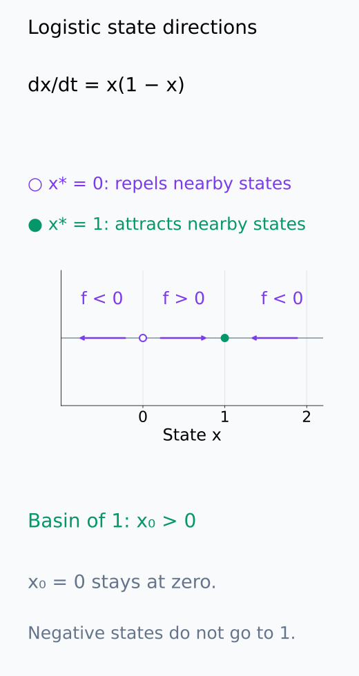
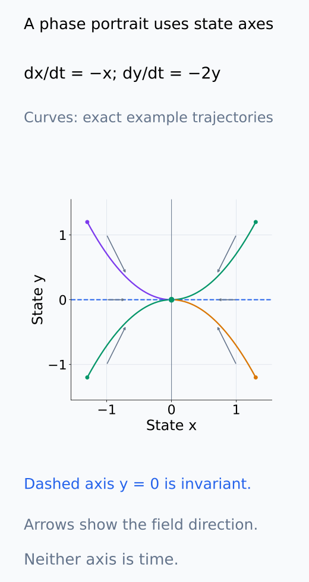
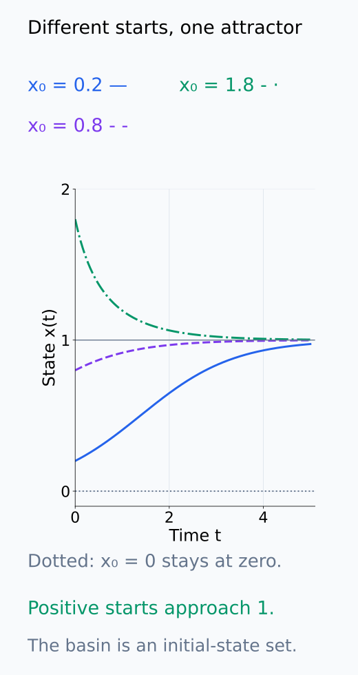
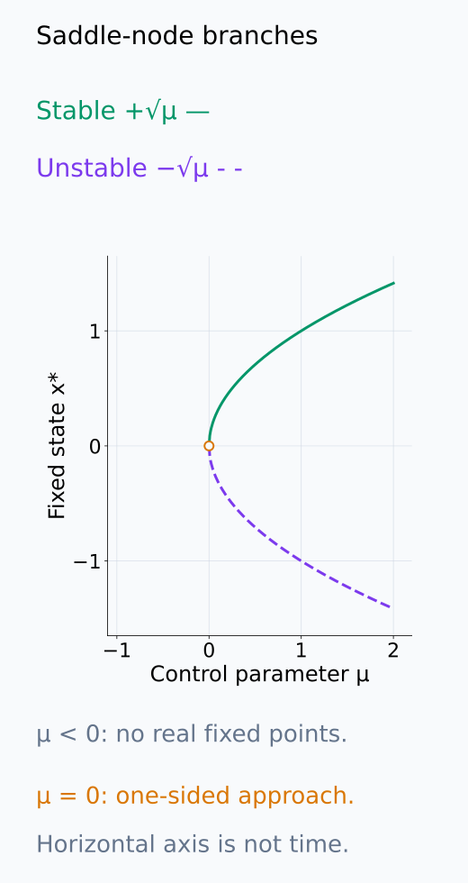
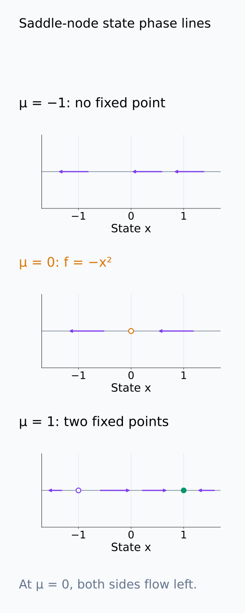
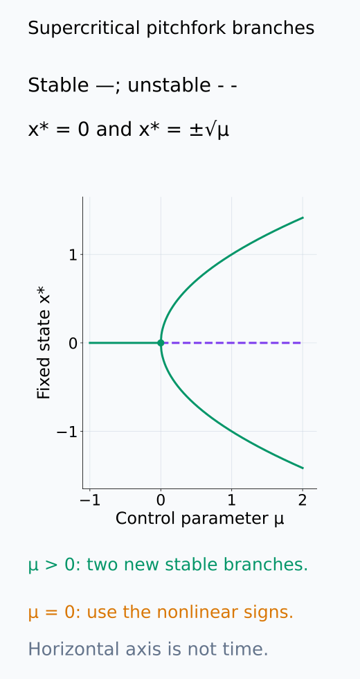
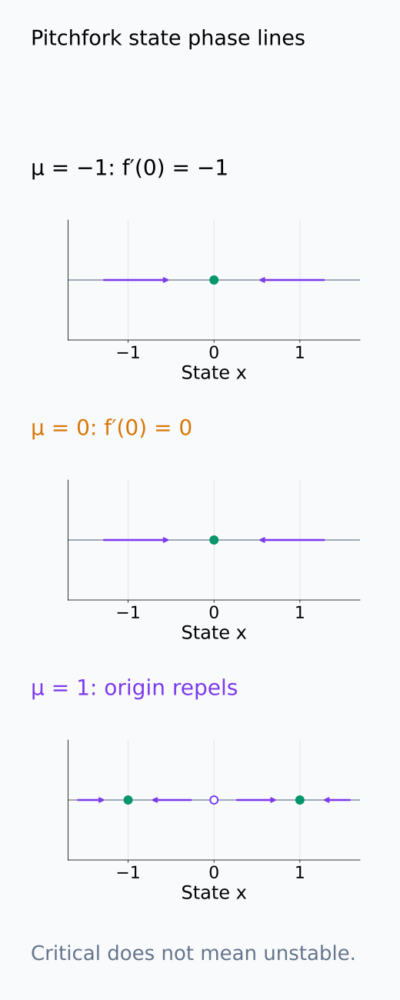
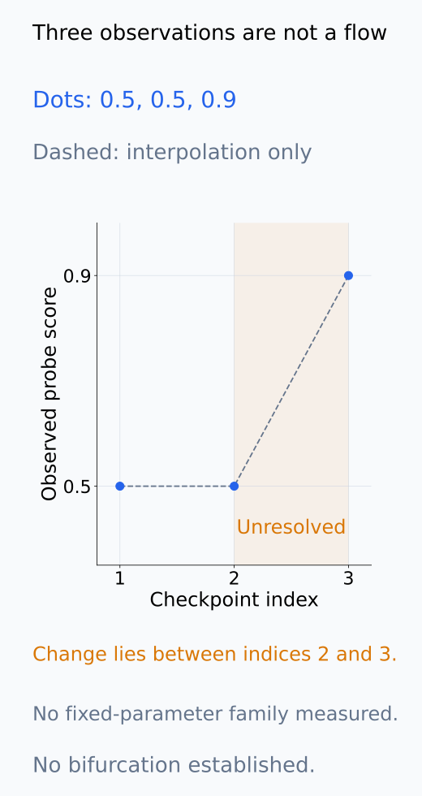

# A09-DYN-03. phase portrait와 bifurcation

## 이 단원이 필요한 이유

한 trajectory만 보면 초기조건과 parameter가 달라질 때 가능한 거동을 알기 어렵다. phase portrait는 state space 전체의 흐름을 요약하고, bifurcation은 parameter 변화로 fixed point나 안정성이 질적으로 바뀌는 지점을 나타낸다.

## 학습 목표

- phase line·phase portrait를 그릴 수 있다.
- basin of attraction을 정의할 수 있다.
- saddle-node·pitchfork bifurcation의 간단한 normal form을 분석할 수 있다.
- 제한된 checkpoint 변화와 phase transition 주장을 구분할 수 있다.

## 선수지식 확인

- 선수 단원: [A09-DYN-02 fixed point와 선형 안정성](A09-DYN-02-fixed-points-linear-stability.md)
- 확인 질문: fixed point 하나의 안정성과 state space 전체의 거동은 왜 다른 정보인가?

## 기호와 용어

| 기호·용어 | Common spoken reading | 의미 | shape·범위 |
|---|---|---|---|
| $\mu$ | `mu` | control parameter | scalar |
| $\mathcal B(x^*)$ | `the basin of x star` | $x^*$로 수렴하는 초기값 집합 | subset of state space |
| $\dot x=\mu-x^2$ | `x dot equals mu minus x squared` | saddle-node normal form | scalar ODE |
| $\dot x=\mu x-x^3$ | `x dot equals mu x minus x cubed` | supercritical pitchfork form | scalar ODE |

## 핵심 개념

### Phase line과 phase portrait

1차원 계 $\dot x=f(x)$에서는 먼저 $f(x)=0$인 fixed point를 state 축에 표시한다. 그 점들 사이에서 $f(x)>0$이면 $x$가 증가하므로 오른쪽, $f(x)<0$이면 왼쪽으로 흐른다. 이것이 phase line이다. 가로축은 시간이 아니라 가능한 state 값이다. 해의 유일성이 있는 계에서는 trajectory가 fixed point를 통과해 반대쪽으로 넘어가지 않으므로, 각 구간의 흐름과 경계점을 함께 읽는다.

2차원 이상에서 phase portrait는 vector field의 방향, fixed point, invariant set과 representative trajectory를 함께 표시한다. invariant set은 그 안에서 출발한 해가 계속 그 안에 머무는 집합이다. fixed point 하나도 이런 집합이며, 여러 초기값의 해를 함께 보면 어디에 머물거나 어디로 접근하는지를 비교할 수 있다. 단일 trajectory를 시간에 따라 그린 그래프와는 표시 대상이 다르다.

state 축의 방향과 여러 초기값의 2차원 곡선을 아래에서 따로 읽는다.

<figure class="lesson-figure" markdown="1">

<figcaption>가로축은 시간 아닌 state x이다. 0의 왼쪽은 왼쪽으로 흐르고, 양수 구간은 1의 양쪽에서 1을 향한다. 열린 0은 그 점에서 시작하면 그대로 머문다는 경계이며, 1로 가는 초기값 집합은 x₀ > 0이다.</figcaption>

</figure>

<figure class="lesson-figure" markdown="1">

<figcaption>설명용 선형계 ẋ = −x, ẏ = −2y이다. 선은 서로 다른 초기조건의 정확한 trajectory이며, 작은 화살표는 field 방향이다. 점선 x축에서 시작한 해는 y = 0을 유지하므로 그 축은 invariant set이다. 축 모두 state 성분이며 시간은 별도 축이 아니다.</figcaption>

</figure>

### Basin of attraction

attractor의 basin은 그 attractor로 수렴하는 초기조건 집합이다. fixed point $x^*$의 경우에는

$$
\mathcal B(x^*)=\{x_0:\ x(t;x_0)\to x^*\text{ as }t\to\infty\}
$$

로 쓴다. 이 정의에는 해가 모든 양의 시간에 존재한다는 조건도 포함한다. 국소 안정성은 충분히 가까운 초기값의 수렴을 말하고, basin은 얼마나 멀리 있는 초기값까지 같은 점으로 가는지 나타낸다. Jacobian 하나의 eigenvalue만으로 basin의 경계까지 찾을 수는 없다.

아래 시간 그래프는 basin 안의 여러 초기값과 경계의 다른 해를 비교한다.

<figure class="lesson-figure" markdown="1">

<figcaption>같은 logistic 계에서 x₀ = 0.2, 0.8, 1.8은 모두 1로 간다. 하지만 x₀ = 0인 점선 해는 계속 0이다. 이 곡선들은 몇 초기값의 예이고, 전체 basin (0, ∞)의 판단은 앞 state 축의 모든 구간을 확인한 결과다.</figcaption>

</figure>

### Parameter와 bifurcation branch

bifurcation에서는 $\dot x=f(x;\mu)$라는 계의 모음을 비교한다. 각 trajectory에서는 control parameter $\mu$를 고정하고, 서로 다른 $\mu$에서 fixed point와 안정성이 어떻게 달라지는지 본다. $x^*(\mu)$를 그린 branch의 가로축은 시간이나 state가 아니라 parameter이다.

saddle-node normal form $\dot x=\mu-x^2$의 fixed point 조건은 $x^2=\mu$다. $\mu<0$이면 실수 해가 없고, $\mu=0$이면 두 branch가 0에서 만나며, $\mu>0$이면 $x=\pm\sqrt\mu$가 생긴다. derivative는 $-2x$이므로 양의 branch는 안정하고 음의 branch는 불안정하다. $\mu=0$에서는 derivative가 0이므로 phase line의 부호를 직접 본다. $\dot x=-x^2$는 양쪽에서 왼쪽으로 흐르므로 오른쪽에서는 0에 접근하지만 왼쪽에서는 멀어진다.

supercritical pitchfork form $\dot x=\mu x-x^3$의 조건은 $x(\mu-x^2)=0$이다. $x=0$은 모든 $\mu$에서 fixed point이고 그 derivative는 $\mu$다. $\mu<0$에서는 안정하고 $\mu>0$에서는 불안정하다. $\mu>0$일 때 추가되는 $x=\pm\sqrt\mu$의 derivative는 $\mu-3\mu=-2\mu<0$이므로 두 branch가 모두 안정하다. 정확히 $\mu=0$에서는 $\dot x=-x^3$의 부호로 0의 수렴을 확인한다. 선형화의 경계점과 불안정한 점을 같은 것으로 취급하지 않는다.

두 normal form은 parameter에 따라 fixed point의 수나 안정성이 바뀌는 계산 예다. bifurcation은 이런 invariant structure의 질적 변화를 뜻하며, 관측값이 빠르게 변한다는 뜻만은 아니다.

parameter 축의 branch와 parameter를 고정한 state 축의 방향을 아래 그림에서 연결한다.

<figure class="lesson-figure" markdown="1">

<figcaption>가로축은 control parameter μ이고 세로축은 fixed state x*이다. μ > 0에서 위 +√μ는 안정, 아래 −√μ는 불안정이며 μ < 0에는 실수 branch가 없다. 한 곡선을 시간에 따른 trajectory로 읽지 않는다.</figcaption>

</figure>

<figure class="lesson-figure lesson-figure--tall" markdown="1">

<figcaption>각 행의 μ는 고정되어 있다. μ = 0에서는 f = −x²라 양쪽 화살표가 왼쪽이어서 0의 오른쪽은 접근하고 왼쪽은 멀어진다. 따라서 branch의 만남을 양쪽에서 안정한 점으로 표시하지 않는다.</figcaption>

</figure>

<figure class="lesson-figure" markdown="1">

<figcaption>0 branch는 μ < 0에서 안정, μ > 0에서 불안정이다. μ > 0의 새 ±√μ branch는 둘 다 안정하다. 정확히 μ = 0의 점은 derivative가 0이며, 다음 state 축의 nonlinear 방향으로 수렴을 확인한다.</figcaption>

</figure>

<figure class="lesson-figure lesson-figure--tall" markdown="1">

<figcaption>μ = −1과 μ = 0은 모두 양쪽에서 0으로 흐르지만 후자는 f′(0) = 0인 경계이다. μ = 1에서는 0의 주변 방향이 바깥으로 바뀌고 −1과 1이 각각 받는다. 선형화 경계와 불안정을 구별하는 비교다.</figcaption>

</figure>

### Training checkpoint와 구조 변화

학습 중 probe score가 증가하는 것은 한 optimizer 경로에서 측정한 값의 변화다. 고정된 $\mu$별로 가능한 trajectory와 fixed point를 비교한 결과가 아니므로, finite training checkpoints에서 metric이 꺾였다는 사실만으로 bifurcation을 확정할 수 없다. learning rate를 control parameter로 비교하더라도 같은 state/update 정의를 유지하고 그에 따른 안정성이나 attractor 구조가 달라지는지 확인해야 한다. 시간에 따라 schedule 자체가 바뀌는 계는 위의 고정-parameter normal form과 구분한다.

아래 세 관측점에서는 보간선과 실제 관측을 구분한다.

<figure class="lesson-figure" markdown="1">

<figcaption>기존 문제의 세 score를 관측점으로 표시했다. 점선은 그 점들을 잇는 보간일 뿐 실제 실행의 모든 시점을 관측한 선이 아니다. 마지막 두 점 사이의 변화만 확인했으며 control parameter별 invariant structure나 bifurcation을 보여 주지 않는다.</figcaption>

</figure>

## 작은 예제

$\dot x=x(1-x)$에서는 0과 1이 fixed point이다. $0<x<1$이면 velocity가 양수이고 $x>1$이면 음수이므로 양의 초기값은 양쪽에서 1에 접근한다. $x_0=0$은 그대로 0에 머물고, $x_0<0$에서는 velocity가 음수여서 1로 가지 않는다. 따라서 $\mathcal B(1)=(0,\infty)$이다. 1의 국소 안정성뿐 아니라 state 축의 각 구간을 확인해야 이 basin을 얻을 수 있다.

## 흔한 오해

- loss curve의 elbow는 자동으로 dynamical bifurcation이 아니다.
- 2차원 projection의 phase portrait는 원래 고차원 dynamics의 topology를 보존하지 않을 수 있다.

## 연습문제

### 1. phase line
$\dot x=x(1-x)$에서 $x<0$, $0<x<1$, $x>1$의 흐름 방향을 적어라.

해설 보기

각각 음수, 양수, 음수이므로 왼쪽, 오른쪽, 왼쪽 방향이다.

### 2. saddle-node
$\mu=4$일 때 $\dot x=\mu-x^2$의 fixed point와 안정성을 구하라.

해설 보기

$x=\pm2$이고 derivative $-2x$에 따라 $-2$는 불안정, $2$는 안정하다.

### 3. pitchfork
$\mu<0$에서 $\dot x=\mu x-x^3$의 실수 fixed point와 0의 안정성을 구하라.

해설 보기

fixed point는 0뿐이며 derivative가 $\mu<0$이므로 안정하다.

### 4. phase transition 주장
checkpoint 세 개의 probe score가 $0.5,0.5,0.9$이면 bifurcation 증거로 충분한가?

해설 보기

아니다. 측정 오차·checkpoint 해상도·control parameter와 invariant structure를 확인하지 못했으므로 관측된 급변으로만 보고한다.

## 근거와 갱신 경계

phase portrait와 normal form은 [MIT의 1차원 flows·bifurcations 강의노트](https://ocw.mit.edu/courses/12-006j-nonlinear-dynamics-chaos-fall-2022/resources/mit12_006jf22_lec2-3/)의 표준 예를 기준으로 확인했다. 고차원 bifurcation classification과 chaos는 다루지 않는다.

## 단원 요약

- phase portrait는 가능한 state-space 거동을 요약한다.
- basin은 같은 attractor로 가는 초기값 집합이다.
- bifurcation은 parameter에 따른 질적 구조 변화다.
- sparse checkpoint의 metric 급변은 bifurcation의 충분한 증거가 아니다.

## 통과 기준

- 1차원 phase line과 normal form을 분석할 수 있는가?
- 학습 metric의 급변과 dynamical bifurcation을 구분할 수 있는가?

## 다음 단원

- [A09-DYN-04 Markov process](A09-DYN-04-markov-process.md)

## 집필자 점검표

- [x] phase portrait와 bifurcation의 증거 수준을 구분했다.
- [x] 문제 4개에 해설이 있다.
- [x] Common spoken reading이 실제 영어 학술 발화이며 한글 음역이나 기계적 직역을 포함하지 않는다.
- [x] 선수지식과 링크를 확인했다.
