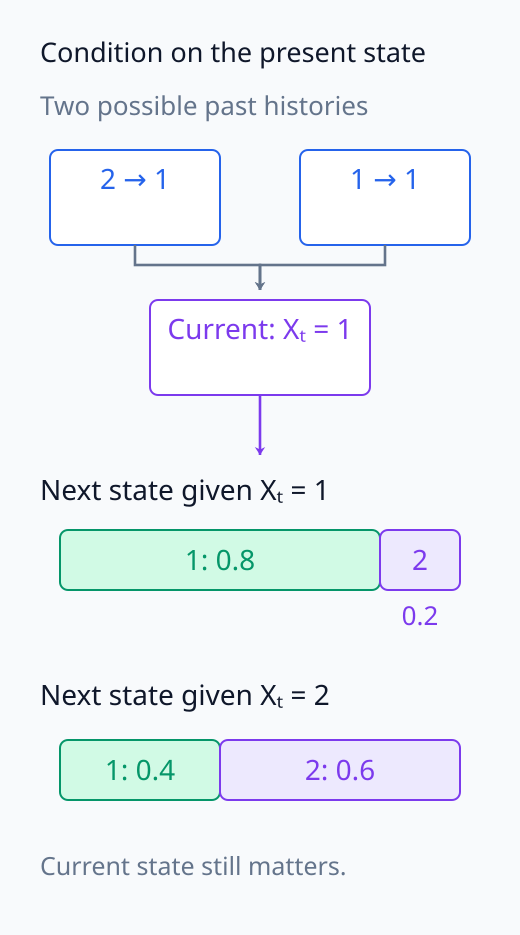
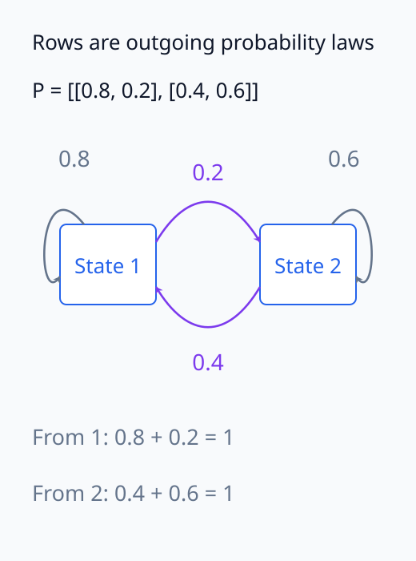
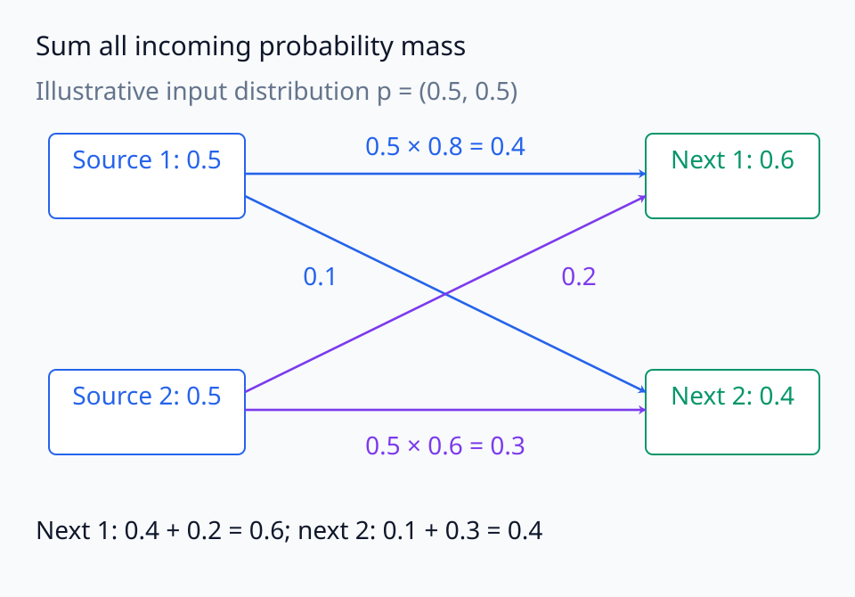
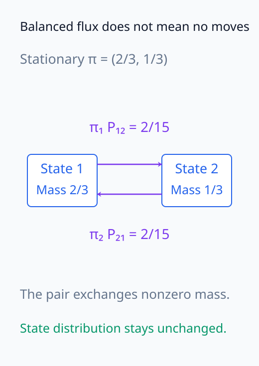
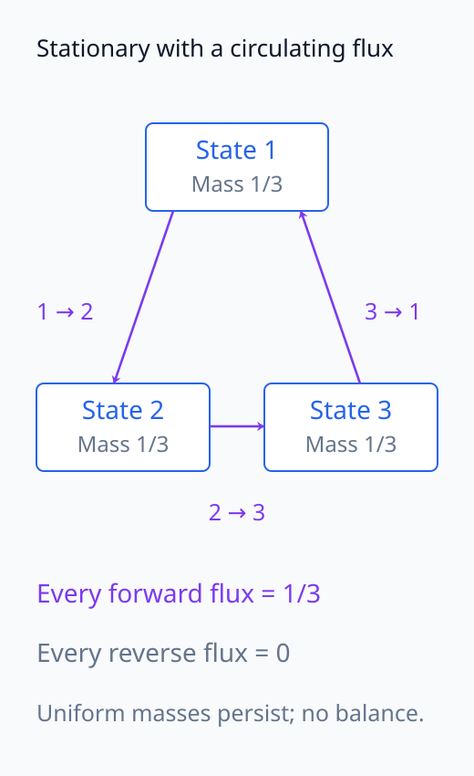
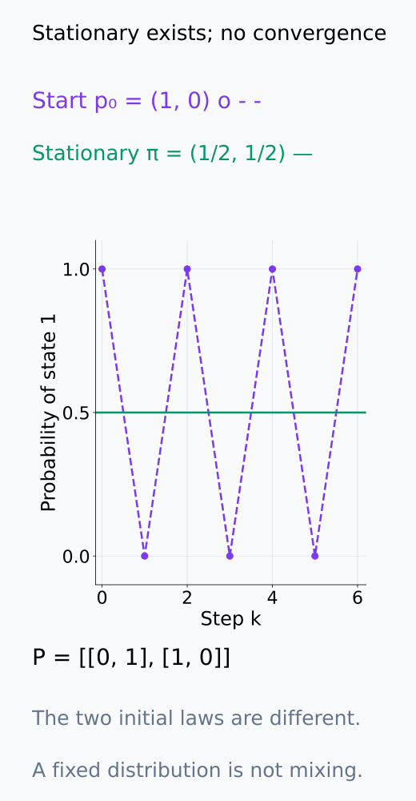
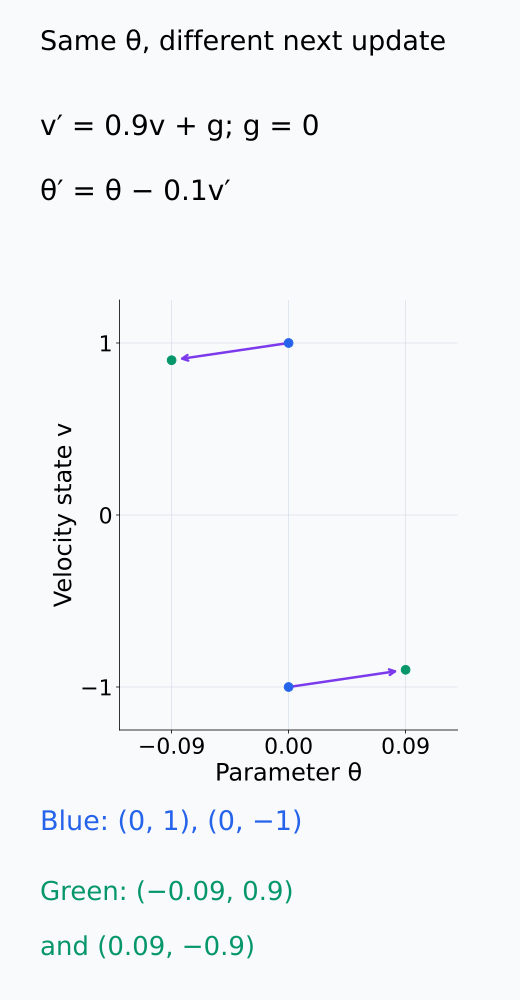

# A09-DYN-04. Markov process

## 이 단원이 필요한 이유

mini-batch sampling이나 noisy update를 확률적 state transition으로 보면 deterministic trajectory만으로는 설명하지 못하는 분포 변화를 다룰 수 있다. Markov property는 미래가 현재 state를 조건으로 과거와 독립이라는 모델링 가정이다.

## 학습 목표

- Markov property를 조건부확률로 쓸 수 있다.
- transition matrix로 분포를 한 step 전파할 수 있다.
- stationary distribution과 detailed balance를 구분할 수 있다.
- state 정의가 Markov 가정의 타당성을 바꾸는 이유를 설명할 수 있다.

## 선수지식 확인

- 선수 단원: [M04-02 조건부확률](../../part-1-foundations/M04/M04-02-conditional-probability-bayes-rule.md), [M04-03 확률변수](../../part-1-foundations/M04/M04-03-random-variables-distributions.md), [M02-11 고유값](../../part-1-foundations/M02/M02-11-eigenvalues-eigenvectors.md)
- 확인 질문: 조건부독립은 어떤 변수를 조건으로 삼는지에 왜 의존하는가?

## 기호와 용어

| 기호·용어 | Common spoken reading | 의미 | shape·범위 |
|---|---|---|---|
| $X_t$ | `X sub t` | time $t$의 random state | state space-valued |
| $P_{ij}$ | `P sub i j` | $i$에서 $j$로 갈 확률 | $[0,1]$ |
| $\pi$ | `pi` | stationary distribution | probability vector |
| $\pi_iP_{ij}=\pi_jP_{ji}$ | `pi sub i P sub i j equals pi sub j P sub j i` | detailed balance | pairwise condition |

## 핵심 개념

### 현재 state를 조건으로 삼는다는 뜻

이 단원에서는 먼저 이산 시간 $t=0,1,\ldots$의 state $X_t$를 다룬다. Markov property는

$$
P(X_{t+1}\mid X_t,\ldots,X_0)=P(X_{t+1}\mid X_t)
$$

이다. 양쪽은 다음 state의 조건부분포를 나타낸다. 현재 state $X_t$를 알려준 뒤에는 과거 $X_{t-1},\ldots,X_0$를 더 알려줘도 다음 state의 분포가 달라지지 않는다는 뜻이다. $X_t$와 $X_{t+1}$ 자체가 독립이라는 뜻은 아니다. 다음 state가 현재 state에 강하게 의존해도 Markov일 수 있다.

아래 분포 막대에서 현재 state 조건과 과거의 추가 정보를 구분한다.

<figure class="lesson-figure" markdown="1">

<figcaption>기존 P에서 Xₜ = 1이면 과거 경로가 2 → 1이든 1 → 1이든 다음 분포는 (0.8, 0.2)이다. 하지만 현재 state가 2이면 (0.4, 0.6)이다. 과거의 추가 정보가 필요 없다는 것과 현재 state의 영향이 없다는 것은 다르다.</figcaption>

</figure>

### Transition matrix와 분포 전파

finite state chain에서 $P_{ij}=P(X_{t+1}=j\mid X_t=i)$라고 두며, 이 값이 $t$에 의존하지 않는 time-homogeneous 계를 생각한다. 각 행은 출발 state 하나의 다음-state 분포이므로 $P_{ij}\ge0$이고 $\sum_jP_{ij}=1$이다. Markov property와 time-homogeneous 조건은 별개다. Markov 계여도 transition 규칙이 시간에 따라 달라질 수 있다.

현재 분포를 row vector $p_t$로 쓰면 전체 확률의 법칙으로

$$
p_{t+1}(j)=\sum_i p_t(i)P_{ij},\qquad p_{t+1}=p_tP
$$

를 얻는다. state $j$로 들어오는 확률을 가능한 모든 출발 state $i$에 걸쳐 더한 것이다. 한 실행은 state 하나를 방문하지만, $p_t$는 여러 가능한 실행의 state 확률을 표현한다. 행 분포 관례이므로 곱의 순서는 $p_tP$다.

각 행의 출구 확률과 도착점에서 더하는 질량을 아래 두 그림으로 읽는다.

<figure class="lesson-figure" markdown="1">

<figcaption>화살표의 출발점이 P의 행, 도착점이 열이다. state 1의 두 출구는 0.8 + 0.2, state 2의 두 출구는 0.4 + 0.6으로 각각 1이다. 같은 state로 돌아오는 경로도 다음-state 분포에 포함한다.</figcaption>

</figure>

<figure class="lesson-figure lesson-figure--wide" markdown="1">

<figcaption>설명용 pₜ = (0.5, 0.5)를 기존 P로 전파했다. next 1에는 source 1의 질량 0.4와 source 2의 질량 0.2가 들어온다. next 2에도 두 출발점의 0.1과 0.3을 더한다. 이것이 row-vector 곱 pₜP의 성분별 합이다.</figcaption>

</figure>

### Stationarity와 detailed balance

stationary distribution은 확률벡터 $\pi$가 $\pi=\pi P$를 만족하는 것이다. 이 분포로 시작하면 다음 step에도 같은 분포이며, chain이 실제로 멈췄다는 뜻은 아니다. state 사이를 이동하면서 전체 분포를 유지할 수 있다.

detailed balance는 모든 state pair에 대해 $\pi_iP_{ij}=\pi_jP_{ji}$가 성립한다는 조건이다. 왼쪽은 stationary 분포에서 한 step에 $i$에서 $j$로 이동하는 확률이고 오른쪽은 역방향 확률이다. 이를 $i$에 대해 더하면

$$
(\pi P)_j=\sum_i\pi_iP_{ij}
=\pi_j\sum_iP_{ji}=\pi_j
$$

가 된다. 마지막 합은 $P$의 $j$번째 행을 더하므로 1이다. 따라서 detailed balance는 stationarity를 보장한다. 반대는 성립하지 않는다. 세 state가 $1\to2\to3\to1$로만 이동하는 chain에서는 균등분포가 stationary지만, 예를 들어 $1\to2$의 확률 flow는 $1/3$이고 $2\to1$은 0이므로 detailed balance가 아니다.

stationary 분포의 존재와 다른 초기분포에서의 수렴도 구분한다. 두 state를 매번 번갈아 방문하는 chain은 $(1/2,1/2)$가 stationary지만, $(1,0)$으로 시작한 분포는 $(0,1)$과 $(1,0)$을 반복한다. stationary 식 하나로 mixing 속도나 수렴을 주장할 수 없다.

아래 그림은 분포 유지, pair별 상쇄, 다른 초기분포의 수렴을 각각 구분한다.

<figure class="lesson-figure" markdown="1">

<figcaption>기존 작은 예제의 π를 썼다. 두 방향의 이동 확률은 각각 2/15로 0이 아니지만 서로 상쇄한다. 전체 분포가 유지되는 것과 한 실행의 state가 움직이지 않는 것은 다른 말이다.</figcaption>

</figure>

<figure class="lesson-figure" markdown="1">

<figcaption>본문의 1 → 2 → 3 → 1 순환이다. 각 state는 한 step에 질량 1/3을 내보내고 똑같이 1/3을 받으므로 균등분포가 유지된다. 그러나 각 pair의 역방향 flow는 0이라 detailed balance는 성립하지 않는다.</figcaption>

</figure>

<figure class="lesson-figure" markdown="1">

<figcaption>본문의 두 state 교대 chain에서 p₀ = (1, 0)으로 시작했다. state 1의 확률은 1과 0을 반복하며 stationary 값 1/2로 수렴하지 않는다. 초록 선은 다른 초기분포 π = (1/2, 1/2)를 택했을 때의 불변분포이다.</figcaption>

</figure>

### Optimizer에서 state를 정의하기

momentum SGD의 다음 parameter는 현재 parameter와 누적 velocity에 의존한다. 같은 parameter에 도달한 두 실행도 velocity가 다르면 다음 update가 다르므로 parameter만 기록하면 과거가 추가 정보를 줄 수 있다. Adam에서는 두 moment가 같은 역할을 한다. parameter와 필요한 optimizer state를 함께 포함하면 현재 state에서 다음 update를 기술할 수 있다.

이때 sampling 규칙도 확인한다. 매 step 독립적으로 batch를 뽑는 조건과 epoch 안에서 한 번씩 방문하도록 shuffle하는 조건은 다르다. 후자에서는 남은 sample이나 순서가 다음 batch 분포에 영향을 줄 수 있다. schedule이 step 번호에 의존하면 시간에 따른 transition으로 기술하거나 step 번호도 state에 포함한다. optimizer moment를 더했다는 사실만으로 모든 sampling·schedule의 기억이 해결되는 것은 아니다.

같은 parameter의 다음 update가 갈라지는 이유를 아래 확장 state 좌표에서 확인한다.

<figure class="lesson-figure" markdown="1">

<figcaption>설명용 v′ = 0.9v + g, θ′ = θ − 0.1v′이고 두 실행 모두 θ = 0, g = 0이다. v = 1이면 θ′ = −0.09, v = −1이면 θ′ = 0.09로 갈라진다. parameter만 같다는 정보는 다음 update를 정하기에 부족하다.</figcaption>

</figure>

## 작은 예제

$P=\begin{bmatrix}0.8&0.2\\0.4&0.6\end{bmatrix}$에서 $\pi=(q,1-q)$라고 두면 첫 성분의 stationary 조건은 $q=0.8q+0.4(1-q)$이다. $0.6q=0.4$를 풀면 $q=2/3$이므로 $\pi=(2/3,1/3)$이다. $1\to2$의 flow는 $(2/3)(1/5)=2/15$, $2\to1$은 $(1/3)(2/5)=2/15$라 detailed balance도 만족한다. 분포 보존은 행벡터 곱으로, 두 방향 상쇄는 개별 pair의 곱으로 확인한다.

## 흔한 오해

- Markov라는 말은 state들이 독립이라는 뜻이 아니다.
- stationary distribution은 chain이 어느 초기분포에서나 빠르게 수렴한다는 뜻이 아니다.

## 연습문제

### 1. 한 step 전파
$p_0=(1,0)$과 위 $P$에서 $p_1$을 구하라.

해설 보기

$p_1=p_0P=(0.8,0.2)$이다.

### 2. stationary 확인
$\pi=(2/3,1/3)$에 $P$를 곱해 stationary임을 확인하라.

해설 보기

첫 성분은 $2/3\cdot0.8+1/3\cdot0.4=2/3$, 둘째는 $1/3$이다.

### 3. Markov state
momentum SGD에서 parameter만 기록하면 과거가 필요한 이유는 무엇인가?

해설 보기

다음 update가 누적 velocity에 의존하며 그 값은 parameter만으로 복원되지 않기 때문이다.

### 4. stationarity
$\pi P=\pi$만 확인해 convergence 속도를 알 수 있는가?

해설 보기

없다. irreducibility·aperiodicity와 transition spectrum 등 mixing 정보를 추가로 봐야 한다.

## 근거와 갱신 경계

Markov property·stationarity·detailed balance는 확률과정의 표준 정의를 따른다. 일반 state space의 measure-theoretic kernel은 다루지 않는다.

## 단원 요약

- Markov property는 현재 state가 과거 정보를 충분히 담는다는 가정이다.
- transition matrix는 state distribution을 전파한다.
- detailed balance는 stationarity보다 강하다.
- optimizer의 state 정의에는 moment와 schedule을 포함할 수 있다.

## 통과 기준

- transition matrix로 분포를 계산할 수 있는가?
- stationary·detailed balance·mixing을 구분할 수 있는가?

## 다음 단원

- [A09-DYN-05 Langevin dynamics](A09-DYN-05-langevin-dynamics.md)

## 집필자 점검표

- [x] Markov state와 optimizer state를 연결했다.
- [x] 문제 4개에 해설이 있다.
- [x] Common spoken reading이 실제 영어 학술 발화이며 한글 음역이나 기계적 직역을 포함하지 않는다.
- [x] 선수지식과 링크를 확인했다.
