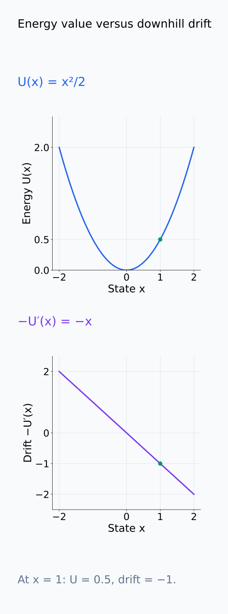
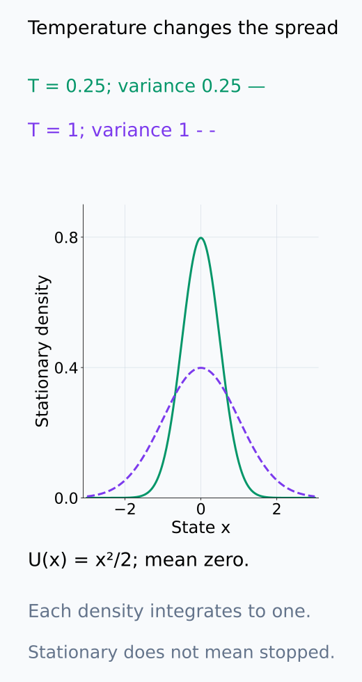
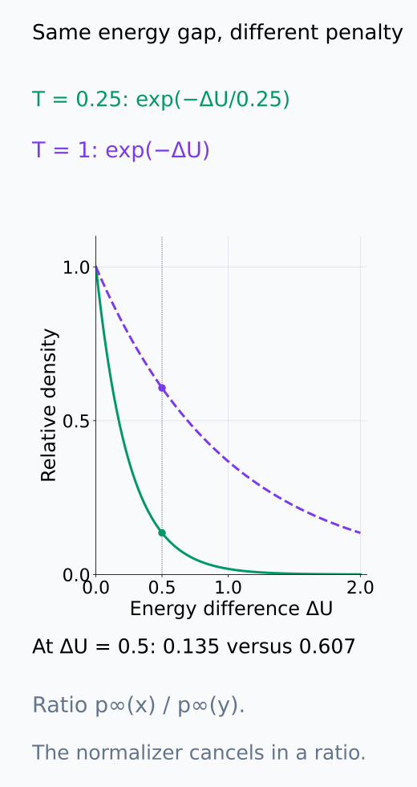
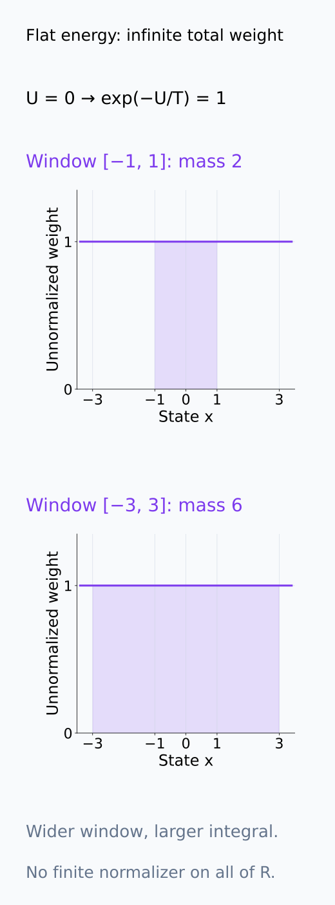
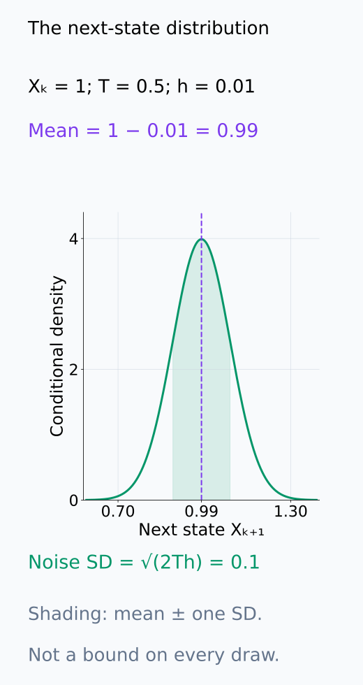
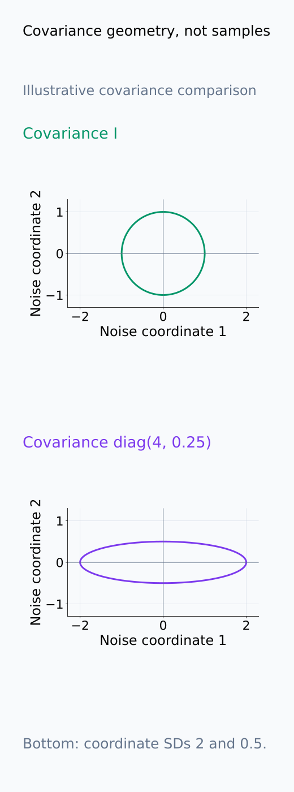
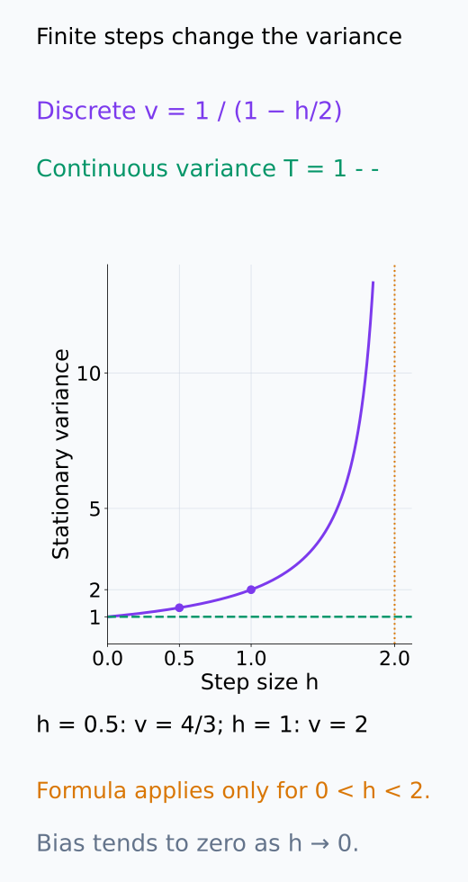

# A09-DYN-05. Langevin dynamics

## 이 단원이 필요한 이유

gradient 방향의 drift와 random fluctuation을 함께 쓰면 optimization noise와 sampling을 같은 수학적 틀에서 비교할 수 있다. Langevin dynamics는 energy landscape를 따라 내려가는 힘과 diffusion을 결합한다.

## 학습 목표

- overdamped Langevin equation의 drift와 diffusion을 구분할 수 있다.
- temperature가 stationary density에 미치는 영향을 설명할 수 있다.
- Euler–Maruyama update를 계산할 수 있다.
- SGD noise와 isotropic Langevin noise의 차이를 말할 수 있다.

## 선수지식 확인

- 선수 단원: [A09-DYN-01 미분방정식과 흐름](A09-DYN-01-odes-flows.md), [A09-DYN-04 Markov process](A09-DYN-04-markov-process.md), [M04-05 주요 분포](../../part-1-foundations/M04/M04-05-common-distributions.md)
- 확인 질문: deterministic gradient step에 Gaussian perturbation을 더하면 다음 state는 무엇이 되는가?

## 기호와 용어

| 기호·용어 | Common spoken reading | 의미 | shape·범위 |
|---|---|---|---|
| $U(x)$ | `U of x` | potential 또는 energy | scalar |
| $T$ | `temperature T` | noise scale | positive scalar |
| $W_t$ | `W sub t` | Brownian motion | stochastic process |
| $dX_t=-\nabla U(X_t)dt+\sqrt{2T}\,dW_t$ | `d X sub t equals minus the gradient of U at X sub t d t plus the square root of two T d W sub t` | overdamped Langevin equation | vector SDE |

## 핵심 개념

### Drift와 diffusion의 역할

overdamped Langevin dynamics는

$$
dX_t=-\nabla U(X_t)dt+\sqrt{2T}\,dW_t
$$

이다. $X_t\in\mathbb R^d$는 random state이고 $U:\mathbb R^d\to\mathbb R$는 energy다. 이 표기에서는 마찰·이동성의 상수를 1로 둔다. overdamped는 velocity를 별도의 state로 추적하지 않고 위치의 변화만 기술한다는 뜻이다.

첫 항의 $-\nabla U$는 현재 위치에서 낮은 energy 방향의 평균 이동을 정하는 drift이다. noise를 빼면 앞 단원의 gradient flow가 된다. 둘째 항에서는 각 좌표의 Brownian motion이 독립인 표준 $d$차원 $W_t$를 사용한다. 시간 $h$의 increment $W_{t+h}-W_t$는 평균 0, covariance $hI$이므로 diffusion에 의한 변위의 covariance는 $2ThI$이다. 같은 $T$ 아래 모든 방향의 noise 크기가 같다는 의미에서 isotropic이다. Brownian 경로는 일반적인 미분 가능한 곡선이 아니므로 $dW_t$를 유한한 순간 velocity로 나누어 해석하지 않는다.

현재 energy와 drift는 아래 같은 state 축에서 서로 다른 세로값으로 읽는다.

<figure class="lesson-figure lesson-figure--tall" markdown="1">

<figcaption>기존 U(x) = x²/2 예제이다. energy U(1) = 1/2와 drift −U′(1) = −1은 다른 수치이다. 이동 방향은 높은 energy라는 말만으로 정하지 않고 현재 위치의 negative gradient로 정한다.</figcaption>

</figure>

### Temperature와 stationary density

충분히 매끄러운 $U$, 해의 전시간 존재와 적절한 경계 조건 아래 stationary density는

$$
p_\infty(x)\propto e^{-U(x)/T}
$$

가 된다. 이를 확률밀도로 쓰려면 $Z=\int_{\mathbb R^d}e^{-U(x)/T}\,dx$가 유한해야 하며 $p_\infty(x)=Z^{-1}e^{-U(x)/T}$로 정규화한다. confinement는 멀리 갈수록 energy가 충분히 증가해 이런 정규화와 안정적인 거동이 가능하도록 하는 조건이다. 예를 들어 $U=0$인 전체 $\mathbb R^d$에서는 상수 함수를 정규화할 수 없으므로 위 형태의 stationary 확률밀도가 없다.

두 위치의 density 비는 $p_\infty(x)/p_\infty(y)=e^{-(U(x)-U(y))/T}$이다. energy 차이가 같아도 $T$가 작을수록 높은 energy의 상대적 density를 더 억제한다. stationary는 이 분포로 시작하면 분포가 유지된다는 뜻이다. 한 sample path가 minimum에서 멈춘다는 뜻이나 모든 초기분포에서 빠르게 이 분포에 도달한다는 뜻은 아니다.

정규화된 density, 상대 density, 정규화할 수 없는 weight를 아래에서 구분한다.

<figure class="lesson-figure" markdown="1">

<figcaption>U = x²/2에서 T = 0.25와 T = 1을 비교했다. 두 밀도는 각각 적분이 1이고 variance가 T이다. 낮은 T의 높은 peak와 좁은 폭은 정규화된 분포의 모양이며, sample path가 원점에서 멈춘다는 뜻은 아니다.</figcaption>

</figure>

<figure class="lesson-figure" markdown="1">

<figcaption>가로축 ΔU = U(x) − U(y), 세로축 p∞(x)/p∞(y)이다. ΔU = 0.5에서 T = 0.25이면 e⁻² ≈ 0.135, T = 1이면 e⁻⁰·⁵ ≈ 0.607이다. 이 비에서는 정규화 상수 Z가 상쇄된다.</figcaption>

</figure>

<figure class="lesson-figure lesson-figure--tall" markdown="1">

<figcaption>U = 0이면 exp(−U/T) = 1이다. 표시한 창 [−1, 1]의 weight 적분은 2, [−3, 3]에서는 6으로 커진다. 창을 무한히 넓히면 유한한 Z가 없으며, 이 그림의 높이 1은 확률밀도로 정규화된 값이 아니다.</figcaption>

</figure>

### Euler–Maruyama step

step $h$의 Euler–Maruyama update는

$$
X_{k+1}=X_k-h\nabla U(X_k)+\sqrt{2Th}\,\xi_k,
\qquad \xi_k\sim\mathcal N(0,I)
$$

이다. drift는 step 시작점에서 고정하고 $h$를 곱한다. Brownian increment는 $\sqrt h\,\xi_k$로 표현하며, 매 step 새로운 독립 표준 Gaussian vector $\xi_k$를 뽑는다. 따라서 noise에는 $h$가 아니라 $\sqrt h$를 곱한다. 이 update에서 다음 state의 조건부 평균은 $X_k-h\nabla U(X_k)$이고 조건부 covariance는 $2ThI$이다.

이는 연속 SDE의 수치 근사다. drift를 step 동안 고정했으므로 finite $h$에서 stationary distribution에 bias가 생길 수 있고, 너무 큰 $h$에서는 연속 계와 다른 불안정 거동도 생길 수 있다. 아래 quadratic 예제에서 그 차이를 계산한다.

아래 한-step 분포에서 평균 이동과 noise의 spread를 따로 확인한다.

<figure class="lesson-figure" markdown="1">

<figcaption>Xₖ = 1, U = x²/2, T = 0.5, h = 0.01의 설명용 한 step이다. drift 후 평균은 0.99이고 noise coefficient는 기존 계산의 0.1이다. 음영 0.89~1.09는 평균에서 표준편차 하나의 구간이며 noise가 항상 이 범위 안에 있다는 뜻은 아니다.</figcaption>

</figure>

### Mini-batch SGD와의 차이

Langevin update는 위치와 무관한 covariance $2ThI$를 갖는 Gaussian noise를 명시적으로 더한다. mini-batch SGD의 noise는 batch gradient와 mean gradient의 차이에서 생기므로 parameter와 sample 구성에 따라 방향별 분산이 달라질 수 있다. 평균이 0인 noise라는 공통점만으로 두 계가 같아지는 것은 아니다. covariance가 거의 isotropic인지, 현재 위치에서 일정한지, batch 사이의 의존성이 있는지 확인해야 scalar temperature로 대응시킬 수 있는지를 판단할 수 있다.

방향별 covariance 차이는 아래 좌표 geometry로 비교한다.

<figure class="lesson-figure lesson-figure--tall" markdown="1">

<figcaption>위는 covariance I의 isotropic geometry, 아래는 설명용 diag(4, 0.25)의 geometry이다. 아래의 좌표별 표준편차는 2와 0.5라 방향마다 spread가 다르다. 아래는 가능한 covariance 차이를 그린 것이며 실제 SGD 실험이나 Gaussian 분포 가정을 뜻하지 않는다.</figcaption>

</figure>

## 작은 예제

$U(x)=x^2/2$이면 drift는 $-x$이고 stationary density는 $e^{-x^2/(2T)}$를 정규화한 평균 0, variance $T$인 Gaussian이다. 연속 계는 원점 방향의 drift와 noise가 균형을 이루는 분포를 유지한다.

Euler–Maruyama는 $X_{k+1}=(1-h)X_k+\sqrt{2Th}\,\xi_k$이다. $0<h<2$이고 stationary variance를 $v$라고 두면 독립 noise의 분산을 더해 $v=(1-h)^2v+2Th$를 얻는다. 따라서 $v=2Th/(2h-h^2)=T/(1-h/2)$이다. $h\to0$에서는 $T$에 가까워지지만 finite $h$에서는 연속 계의 variance보다 크다. 이 차이가 discretization bias의 구체적인 예다.

아래 곡선은 finite step의 variance bias와 적용 시간 간격 범위를 보여 준다.

<figure class="lesson-figure" markdown="1">

<figcaption>기존 variance 식에 T = 1을 넣었다. h = 0.5이면 v = 4/3, h = 1이면 v = 2로 연속 variance 1보다 크다. 곡선은 0 < h < 2에서만 stationary variance 식으로 사용하며, h = 2는 그 범위의 경계이다.</figcaption>

</figure>

## 흔한 오해

- mini-batch SGD noise는 일반적으로 constant isotropic Gaussian이 아니다.
- finite-step Langevin update가 정확히 $e^{-U/T}$를 sampling한다고 단정할 수 없다.

## 연습문제

### 1. drift
$U(x)=2x^2$의 Langevin drift를 구하라.

해설 보기

$\nabla U=4x$이므로 drift는 $-4x$이다.

### 2. noise scale
$T=0.5$, $h=0.01$에서 update noise coefficient $\sqrt{2Th}$를 구하라.

해설 보기

$\sqrt{0.01}=0.1$이다.

### 3. temperature
$T$가 작아지면 $p_\infty(x)\propto e^{-U(x)/T}$는 어떻게 변하는가?

해설 보기

높은 energy가 더 강하게 억제되어 minimum 부근에 집중한다.

### 4. SGD 비교
SGD를 Langevin dynamics로 근사할 때 noise covariance를 측정해야 하는 이유는 무엇인가?

해설 보기

SGD noise는 parameter 위치와 batch 구성에 따라 anisotropic·state-dependent일 수 있어 isotropic temperature 하나로 표현되지 않을 수 있기 때문이다.

## 근거와 갱신 경계

overdamped Langevin equation과 Gibbs stationary density는 [Pavliotis의 저자 공개 원고](https://www.ma.imperial.ac.uk/~pavl/PavliotisBook.pdf)의 4.5절을 기준으로 확인했다. Metropolis correction과 underdamped dynamics는 다루지 않는다.

## 단원 요약

- Langevin dynamics는 gradient drift와 Brownian diffusion을 결합한다.
- temperature는 stationary density의 집중 정도를 조절한다.
- Euler–Maruyama noise는 $\sqrt h$ scale이다.
- SGD noise를 Langevin noise와 같다고 두려면 covariance 가정이 필요하다.

## 통과 기준

- quadratic potential의 drift와 stationary variance를 설명할 수 있는가?
- finite-step·SGD 근사의 한계를 말할 수 있는가?

## 다음 단원

- [A09-DYN-06 확률미분방정식 입문](A09-DYN-06-stochastic-differential-equations.md)

## 집필자 점검표

- [x] drift·diffusion·temperature를 구분했다.
- [x] 문제 4개에 해설이 있다.
- [x] Common spoken reading이 실제 영어 학술 발화이며 한글 음역이나 기계적 직역을 포함하지 않는다.
- [x] 선수지식과 링크를 확인했다.
