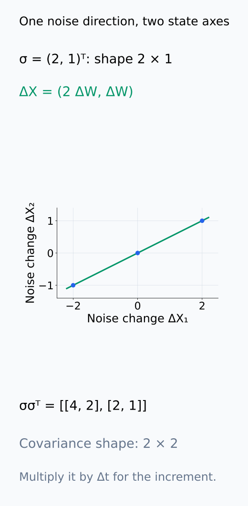
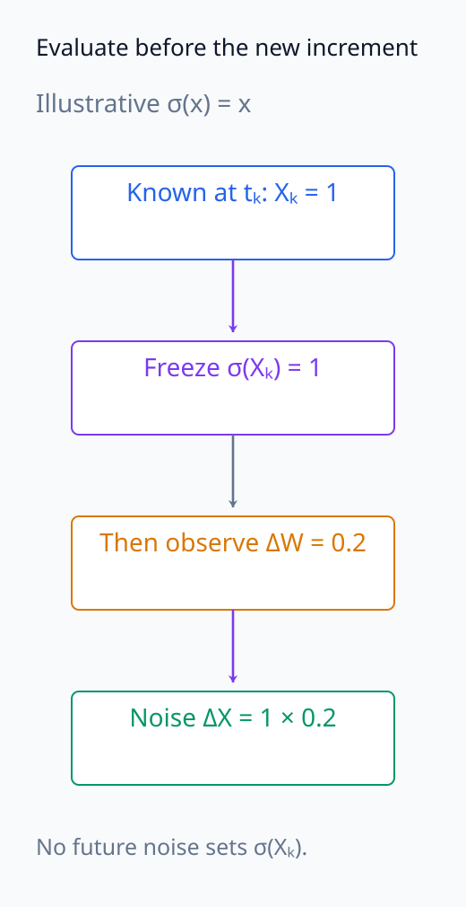
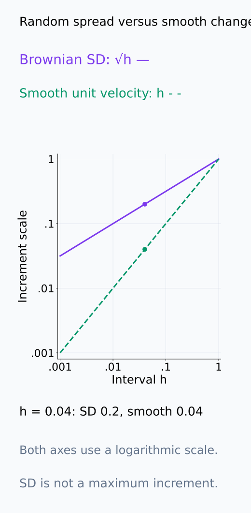
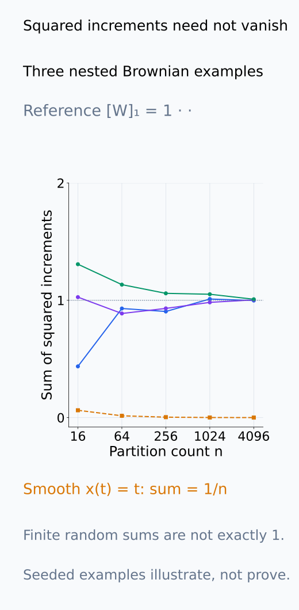
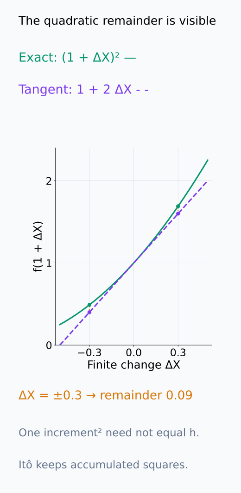
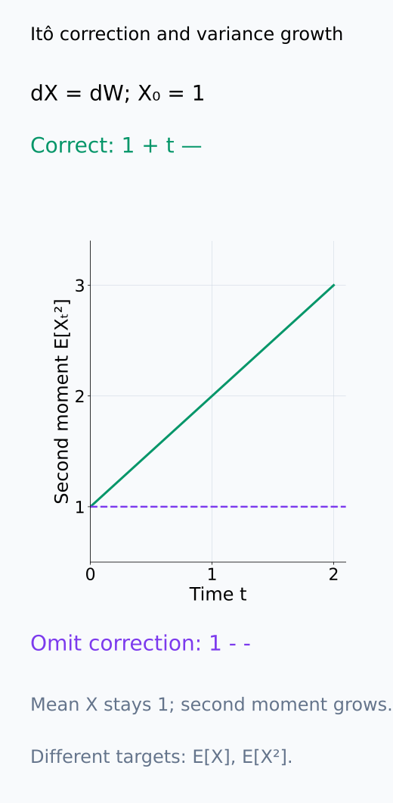

# A09-DYN-06. 확률미분방정식 입문

## 이 단원이 필요한 이유

Brownian path는 보통의 의미로 미분할 수 없으므로 random forcing이 있는 dynamics는 ordinary derivative만으로 다룰 수 없다. stochastic differential equation은 drift와 diffusion을 infinitesimal increment의 규칙으로 정의한다.

## 학습 목표

- Itô SDE의 drift와 diffusion coefficient를 읽을 수 있다.
- Brownian increment의 scale을 설명할 수 있다.
- Itô formula의 quadratic variation term을 계산할 수 있다.
- Euler–Maruyama simulation과 연속 SDE를 구분할 수 있다.

## 선수지식 확인

- 선수 단원: [A09-DYN-05 Langevin dynamics](A09-DYN-05-langevin-dynamics.md), [M04-04 기댓값과 분산](../../part-1-foundations/M04/M04-04-expectation-variance-covariance.md)
- 확인 질문: variance가 시간에 비례하는 Gaussian increment의 표준편차는 어떤 scale인가?

## 기호와 용어

| 기호·용어 | Common spoken reading | 의미 | shape·범위 |
|---|---|---|---|
| $dX_t=b(X_t,t)dt+\sigma(X_t,t)dW_t$ | `d X sub t equals b of X sub t and t d t plus sigma of X sub t and t d W sub t` | Itô SDE | stochastic increment |
| $b$ | `b` | drift coefficient | vector |
| $\sigma$ | `sigma` | diffusion coefficient | matrix |
| $[W]_t=t$ | `the quadratic variation of W at t equals t` | Brownian quadratic variation | scalar |

## 핵심 개념

### Itô SDE의 coefficient와 적분 의미

$X_t\in\mathbb R^d$, $W_t\in\mathbb R^m$이면 drift $b(X_t,t)$는 $d$차원 벡터이고 diffusion coefficient $\sigma(X_t,t)$는 $d\times m$ 행렬이다. noise의 입력 방향을 $\sigma$가 state의 변화 방향으로 보낸다. 위치와 시간을 고정한 작은 step에서 noise 변위의 covariance는 $\sigma\sigma^\top\Delta t$에 대응한다. $\sigma$ 자체가 covariance는 아니다.

SDE 표기는 다음 적분 관계를 짧게 쓴 것이다.

$$
X_t=X_0+\int_0^t b(X_s,s)\,ds
+\int_0^t\sigma(X_s,s)\,dW_s.
$$

첫 적분은 보통의 시간 적분이고 둘째는 Itô stochastic integral이다. 둘째는 각 짧은 구간의 시작 시점에 알려진 coefficient에 그 구간의 Brownian increment를 곱해 더하는 방식으로 정의한다. 이 선택 때문에 미래 noise를 미리 보고 coefficient를 정하지 않는다. 해의 존재와 적분 가능성을 위한 coefficient 조건 아래 이 관계를 사용하며, 여기서는 적분의 엄밀한 구성은 다루지 않는다.

noise의 방향 mapping과 coefficient 평가 순서를 아래에서 나누어 읽는다.

<figure class="lesson-figure" markdown="1">

<figcaption>설명용 d = 2, m = 1, σ = (2, 1)ᵀ이다. scalar ΔW가 ΔX = (2ΔW, ΔW)로 가므로 noise 변위는 한 직선 위에 있다. σ는 2×1 mapping이고 covariance는 σσᵀΔt = [[4, 2], [2, 1]]Δt인 2×2 행렬이다.</figcaption>

</figure>

<figure class="lesson-figure" markdown="1">

<figcaption>설명용 σ(x) = x와 시작 Xₖ = 1을 썼다. 새 increment 0.2를 알기 전에 coefficient 1을 정해 곱한다. 이는 전체 SDE를 정확히 푸는 과정이 아니라 Itô sum의 시작점 평가 순서를 보여 주는 한 increment이다.</figcaption>

</figure>

### Brownian increment와 quadratic variation

표준 1차원 Brownian motion의 시간 $\Delta t$ increment는

$$
\Delta W\sim\mathcal N(0,\Delta t),
$$

이다. 겹치지 않는 구간의 increment는 독립이고 평균은 0이다. variance가 $\Delta t$이므로 표준편차는 $\sqrt{\Delta t}$이다. 이는 확률적 크기의 척도이며 모든 increment가 그 값 이하라는 뜻은 아니다.

시간 구간 $[0,t]$를 $n$개로 나누고 각 increment의 제곱을 더하면, 각 항의 평균은 $t/n$이고 합의 평균은 $t$다. 격자를 촘촘히 하면 제곱합이 $t$에서 일정 크기 이상 벗어날 확률이 0으로 간다. 이런 확률적 수렴을 통해 $[W]_t=t$라는 quadratic variation을 얻는다. 연속 미분 가능한 곡선에서는 변위가 구간 길이에 비례해 제곱합이 0으로 가지만, Brownian motion에서는 noise의 누적 제곱이 남는다.

아래 두 척도와 제곱합을 비교해 ordinary 미분과 다른 누적 항을 확인한다.

<figure class="lesson-figure" markdown="1">

<figcaption>기존 Δt = 0.04에서 Brownian 표준편차는 0.2이고, 속도 1인 매끄러운 곡선의 변위는 0.04이다. 위 곡선은 확률적 spread이지 모든 ΔW의 최대값이 아니다. 로그 축에서 작은 h의 두 척도 차이를 비교한다.</figcaption>

</figure>

<figure class="lesson-figure" markdown="1">

<figcaption>시간 [0, 1]에서 3개의 설명용 Brownian increment 경로를 고정 seed로 생성했다. coarse increment는 같은 fine increment를 묶은 합이다. 세 경로의 유한 제곱합은 매번 정확히 1이 아니며, 이 그림 자체가 확률적 수렴의 증명은 아니다. 매끄러운 x(t) = t의 제곱합은 정확히 1/n이다.</figcaption>

</figure>

### Itô formula에서 남는 2차 항

이제 $X_t,W_t$가 scalar이고 $f$가 연속인 2차 미분을 갖는 시간에 의존하지 않는 함수라고 두자. scalar Itô formula는

$$
df(X_t)=f'(X_t)dX_t+\frac12f''(X_t)\sigma(X_t,t)^2dt
$$

이다. $dX_t=b\,dt+\sigma\,dW_t$를 대입하면 drift 쪽은 $f'b\,dt+\tfrac12f''\sigma^2dt$이고 noise 쪽은 $f'\sigma\,dW_t$이다. 시간·위치에 의존하는 coefficient들은 현재 $(X_t,t)$에서 평가한다.

이 추가 항은 Taylor 전개의 $\tfrac12 f''(X_t)(\Delta X)^2$에서 온다. noise 부분 $\sigma\Delta W$를 제곱하면 시간 크기의 항이 남기 때문에 ordinary chain rule처럼 버릴 수 없다. 흔히 쓰는 $(dW_t)^2=dt$는 이런 누적 quadratic variation을 나타내는 계산 규칙이며 개별 유한 increment의 제곱이 정확히 $\Delta t$라는 등식은 아니다.

아래 포물선의 finite 제곱항을 개별 increment의 dt 등식과 혼동하지 않는다.

<figure class="lesson-figure" markdown="1">

<figcaption>현재 X = 1에서 f(x) = x²를 그렸다. ΔX = ±0.3이면 접선과 실제 제곱값의 차이는 (ΔX)² = 0.09이다. 예를 들어 h = 0.04의 Brownian increment가 0.3일 수도 있으며 그 제곱이 h와 같지는 않다. Itô의 dt 항은 이런 제곱의 누적에서 나온다.</figcaption>

</figure>

### Euler–Maruyama와 정확도의 대상

Euler–Maruyama는 $t_k=kh$에서

$$
X_{k+1}=X_k+h\,b(X_k,t_k)
+\sigma(X_k,t_k)\sqrt h\,\xi_k,
\qquad \xi_k\sim\mathcal N(0,I_m)
$$

로 근사한다. coefficient는 시작점에서 평가하며 서로 다른 step의 $\xi_k$는 독립이다. seed를 바꾸면 noise 경로 자체가 달라지므로 두 실행의 차이를 곧바로 수치 오차라고 할 수 없다.

strong convergence는 같은 Brownian path를 사용했을 때 근사 state와 연속 해의 차이가 줄어드는지를 묻는다. weak convergence는 여러 경로에서 측정한 $\mathbb E[f(X_t)]$ 같은 분포의 통계가 가까워지는지를 묻는다. step 크기가 다른 경로를 paired 비교하려면 작은 step의 increment들을 더해 큰 step의 increment로 써야 한다. 같은 seed 번호만 지정하고 서로 다른 크기의 Gaussian을 생성하는 방식은 같은 Brownian path라는 보장이 없다.

같은 경로의 coarse noise는 아래처럼 fine increment를 더해 맞춘다.

<figure class="lesson-figure" markdown="1">

<figcaption>설명용 fine increment 0.1, −0.2, 0.3, 0.05의 합은 coarse ΔW = 0.25이다. 같은 양 끝값을 공유하도록 묶는 계산이지 coarse Gaussian을 별도로 새로 뽑는 계산이 아니다. 선은 저장된 점을 잇는 안내이며 그 사이의 실제 Brownian path를 관측한 선으로 읽지 않는다.</figcaption>

</figure>

## 작은 예제

$dX_t=\sigma dW_t$에서 $\sigma$와 $X_0$가 상수라고 두자. $f(x)=x^2$는 $f'=2x$, $f''=2$이므로 Itô formula에 대입하면 $d(X_t^2)=2X_t\sigma dW_t+\sigma^2dt$이다. 이를 적분하고 기대값을 취하면 stochastic integral의 기대값은 0이어서 $\mathbb E[X_t^2]=X_0^2+\sigma^2t$를 얻는다. $X_t=X_0+\sigma W_t$의 평균은 $X_0$, variance는 $\sigma^2t$이므로 같은 결과를 확률 계산으로도 확인할 수 있다. correction 항을 버리면 이 분산 증가를 놓친다.

보정항이 복원하는 second moment의 증가를 아래 시간 축에서 확인한다.

<figure class="lesson-figure" markdown="1">

<figcaption>기존 상수 X₀, σ 예제에 X₀ = 1, σ = 1을 넣었다. 올바른 E[Xₜ²]는 1 + t로 증가하고, 보정항을 버리면 증가량 t를 놓친다. 세로축은 X의 평균이 아니라 X²의 기대값이다.</figcaption>

</figure>

## 흔한 오해

- $dW_t/dt$를 보통의 finite random variable처럼 다루면 안 된다.
- SDE trajectory 하나가 distribution-level dynamics를 대표하지 않는다.

## 연습문제

### 1. increment scale
$\Delta t=0.04$일 때 표준 Brownian increment의 표준편차를 구하라.

해설 보기

$\sqrt{0.04}=0.2$이다.

### 2. Itô term
$dX_t=dW_t$, $f(x)=x^2$에서 $df$를 구하라.

해설 보기

$df=2X_t dW_t+dt$이다.

### 3. Euler–Maruyama
$dX=-Xdt+dW$, $X_0=1$, $h=0.01$, $\xi_0=0$이면 $X_1$은 얼마인가?

해설 보기

$X_1=1-0.01=0.99$이다.

### 4. 분석 단위
서로 다른 seed의 SDE path를 비교할 때 paired design이 가능한 경우를 설명하라.

해설 보기

두 조건에 같은 Brownian increment sequence를 사용하면 common-random-number pairing으로 dynamics 차이의 variance를 줄일 수 있다.

## 근거와 갱신 경계

Itô SDE·quadratic variation·Itô formula는 [Pavliotis의 저자 공개 원고](https://www.ma.imperial.ac.uk/~pavl/PavliotisBook.pdf)의 1.3절과 3.2~3.4절을 기준으로 확인했다. measure-theoretic construction과 Stratonovich integral은 다루지 않는다.

## 단원 요약

- Brownian increment의 크기는 $\sqrt{dt}$ scale이다.
- 그 제곱은 $dt$ scale이라 Itô correction을 만든다.
- Euler–Maruyama는 연속 SDE의 finite-step 근사다.
- path-level과 distribution-level 주장을 구분한다.

## 통과 기준

- Brownian increment와 Itô correction을 계산할 수 있는가?
- SDE simulation의 step·seed 의존성을 설명할 수 있는가?

## 다음 단원

- [A09-DYN-07 SGD의 연속시간 근사](A09-DYN-07-continuous-time-sgd.md)

## 집필자 점검표

- [x] Itô calculus가 ordinary calculus와 다른 지점을 밝혔다.
- [x] 문제 4개에 해설이 있다.
- [x] Common spoken reading이 실제 영어 학술 발화이며 한글 음역이나 기계적 직역을 포함하지 않는다.
- [x] 선수지식과 링크를 확인했다.
