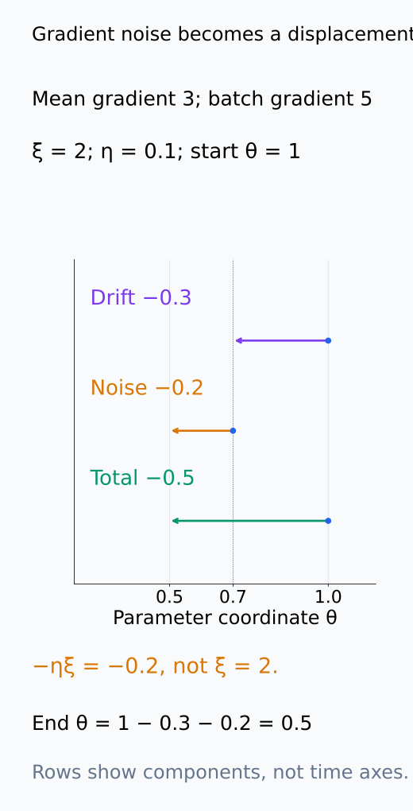
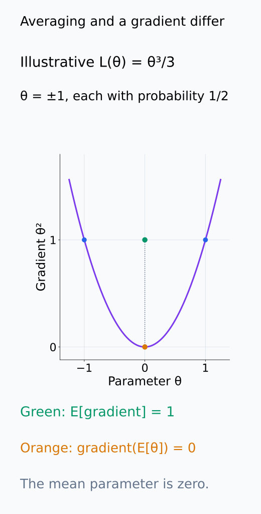
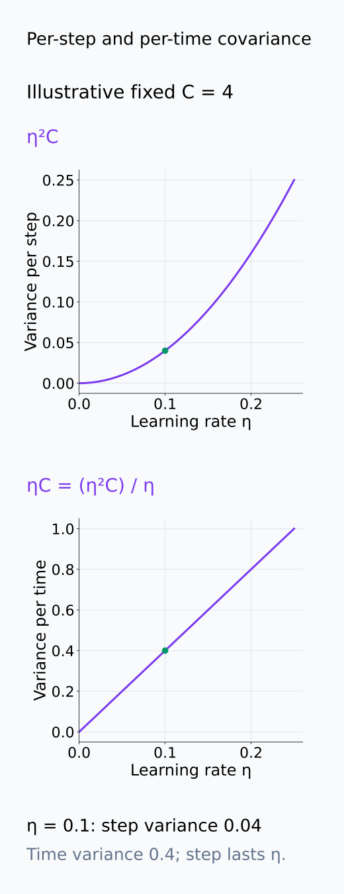
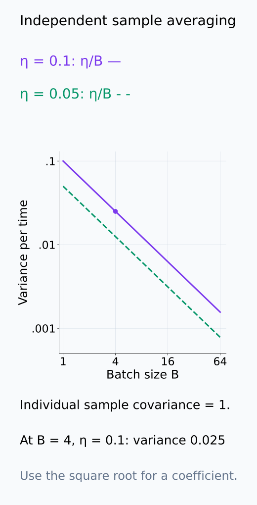
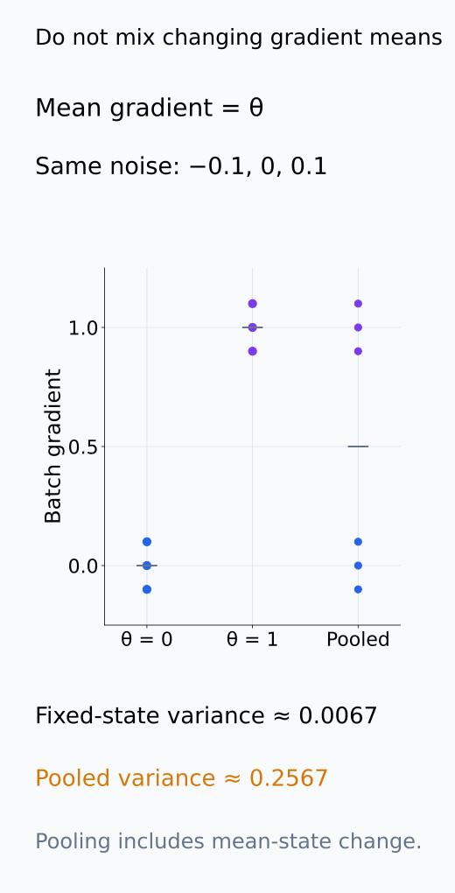
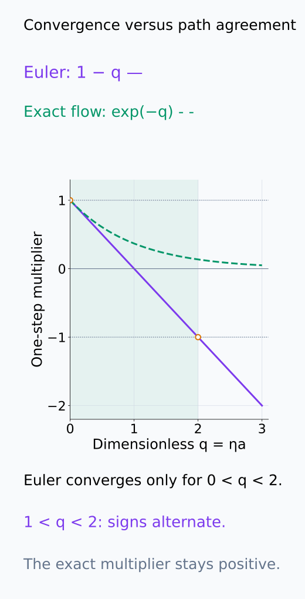

# A09-DYN-07. SGD의 연속시간 근사

## 이 단원이 필요한 이유

SGD update를 ODE나 SDE로 근사하면 learning rate, batch noise와 loss geometry가 만드는 평균적 거동을 분석할 수 있다. 그러나 momentum, adaptive state, finite step과 non-Gaussian noise를 지우면 실제 optimizer와 다른 모델이 된다.

## 학습 목표

- SGD update를 mean gradient와 noise로 분해할 수 있다.
- gradient flow와 diffusion approximation의 역할을 구분할 수 있다.
- learning rate·batch size가 근사 noise scale에 미치는 영향을 설명할 수 있다.
- 연속시간 근사의 타당성을 진단하는 측정 항목을 제시할 수 있다.

## 선수지식 확인

- 선수 단원: [A09-DYN-06 확률미분방정식](A09-DYN-06-stochastic-differential-equations.md), [I08-04 SGD dynamics](../../part-3-interpretability/I08/I08-04-sgd-as-dynamics.md), [I08-05 mini-batch noise](../../part-3-interpretability/I08/I08-05-minibatch-noise-optimizer-state.md)
- 확인 질문: mini-batch gradient와 full gradient의 차이는 어떤 random variable인가?

## 기호와 용어

| 기호·용어 | Common spoken reading | 의미 | shape·범위 |
|---|---|---|---|
| $g_B(\theta)$ | `g sub B of theta` | mini-batch gradient | parameter-shaped vector |
| $\xi_B(\theta)$ | `xi sub B of theta` | gradient noise | zero-mean under sampling assumptions |
| $C(\theta)$ | `C of theta` | gradient-noise covariance | PSD matrix |
| $\eta$ | `eta` | learning rate | positive scalar |
| $S(\theta)$ | `S of theta` | $SS^\top=C$를 만족하는 noise coefficient | $d\times d$ |
| $\Theta_t$ | `Theta sub t` | 연속시간 근사의 random parameter | $d$차원 벡터 |

## 핵심 개념

### Mean gradient와 noise 분해

loss $L$과 sampling 규칙을 고정하고 mini-batch gradient를

$$
g_B(\theta)=\nabla L(\theta)+\xi_B(\theta)
$$

로 쓴다. $\xi_B=g_B-\nabla L$라는 차이의 정의는 항상 가능하지만, $\mathbb E_B[\xi_B\mid\theta]=0$은 batch gradient가 같은 $L$의 unbiased estimator라는 조건에서 성립한다. 균등 sampling과 sample loss의 평균을 쓰는 경우가 대표적인 예다. 서로 다른 weighting이나 sampling을 쓰면 평균 gradient 자체가 달라질 수 있다.

plain SGD는 $\theta_{k+1}=\theta_k-\eta\nabla L(\theta_k)-\eta\xi_k$이다. $C(\theta)=\mathbb E_B[\xi_B\xi_B^\top\mid\theta]$를 gradient-noise covariance라고 두면, zero-mean 조건 아래 한 update의 noise covariance는 $\eta^2C(\theta_k)$이다. gradient의 noise와 parameter 변위의 noise를 구분해야 learning rate의 제곱을 놓치지 않는다.

gradient noise와 parameter 변위의 부호·크기를 아래 좌표에서 구분한다.

<figure class="lesson-figure" markdown="1">

<figcaption>기존 gradient 3, batch gradient 5의 noise는 ξ = 2이다. 설명용 θₖ = 1, η = 0.1을 쓰면 평균 변위 −0.3과 noise 변위 −0.2를 더해 θₖ₊₁ = 0.5가 된다. gradient noise ξ와 실제 parameter noise −ηξ는 부호와 단위가 다르다.</figcaption>

</figure>

### Time scale과 gradient flow

constant learning rate $\eta$에 대해 한 step의 시간 길이를 $\eta$로 두고 $t_k=k\eta$라고 쓰자. update를 시간 길이로 나누면

$$
\frac{\theta_{k+1}-\theta_k}{\eta}
=-\nabla L(\theta_k)-\xi_k
$$

이다. noise를 제외하고 작은 step에서 연속 변화를 근사하면 gradient flow

$$
\dot\theta=-\nabla L(\theta)
$$

를 얻는다. step index $k$를 그대로 시간으로 쓰면 평균 변화율에 $\eta$가 붙으므로, 어떤 시간 축을 선택했는지 명시해야 한다. 또한 stochastic 실행의 기대 parameter가 이 ODE를 정확히 만족한다는 뜻은 아니다. 비선형 loss에서는 일반적으로 $\mathbb E[\nabla L(\theta)]\ne\nabla L(\mathbb E[\theta])$이다.

평균을 내는 순서가 바뀌면 아래 서로 다른 두 target 점을 얻을 수 있다.

<figure class="lesson-figure" markdown="1">

<figcaption>설명용 L(θ) = θ³/3이라 ∇L = θ²이고 θ = −1, 1을 각각 확률 1/2로 두었다. mean parameter는 0이지만 mean gradient는 1이다. 평균 parameter에서 gradient를 한 번 평가하는 점 (0, 0)은 gradient를 먼저 계산해 평균낸 점 (0, 1)과 다르다.</figcaption>

</figure>

### Diffusion coefficient와 batch size

작은 step에서 covariance를 맞추는 대표적인 SDE는

$$
d\Theta_t=-\nabla L(\Theta_t)\,dt
+\sqrt\eta\,S(\Theta_t)\,dW_t,
\qquad S(\theta)S(\theta)^\top=C(\theta)
$$

이다. $\Theta_t,W_t$를 $d$차원, $S$를 $d\times d$로 둘 수 있다. $C$가 positive-semidefinite이므로 행렬 제곱근으로 이런 $S$를 정할 수 있다. 길이 $\eta$의 Brownian increment의 covariance는 $\eta I$이므로 이 SDE의 시작점 coefficient를 고정한 noise 변위 covariance는 $\eta\cdot\eta SS^\top=\eta^2C$이다. SGD의 noise 부호가 음수인 것은 대칭인 Gaussian increment의 부호를 바꿔 대응시킨다.

이 계산은 local mean·covariance를 맞추는 이유를 설명한다. gradient noise가 정확히 Gaussian이라는 결론이나 개별 SGD path를 그대로 재현한다는 결론은 아니다. 짧은 시간의 weak approximation에는 loss/coefficient의 regularity, noise moment와 sampling의 시간 의존성에 관한 조건이 필요하며, 더 높은 정확도에는 drift correction도 필요할 수 있다.

개별 sample gradient를 독립적으로 뽑고 $B$개의 평균을 쓰면 batch noise covariance는 개별 sample covariance의 $1/B$이다. 이 convention에서 SDE diffusion covariance의 시간당 크기는 $\eta C\propto\eta/B$이고 coefficient의 크기는 $\sqrt{\eta/B}$에 비례한다. 복원 없는 sampling, batch 간 의존이나 loss의 합/평균 convention이 바뀌면 같은 식을 그대로 적용하지 않는다. learning rate와 batch size뿐 아니라 $C$의 방향별 구조가 있어야 noise를 정할 수 있다.

한 step과 시간당 covariance, SDE의 두 √η, batch 평균의 scaling을 아래에서 따로 읽는다.

<figure class="lesson-figure" markdown="1">

<figcaption>설명용 scalar C = 4를 고정했다. 한 step의 시간 길이를 η로 두면 update covariance는 η²C이고 시간당 covariance는 (η²C)/η = ηC이다. η = 0.1의 0.04와 0.4는 같은 양의 서로 다른 계산이 아니라 시간 단위가 다른 두 측정이다.</figcaption>

</figure>

<figure class="lesson-figure lesson-figure--wide" markdown="1">

<figcaption>η = 0.1, C = 4, S = 2인 설명용 scalar 계산이다. 오른쪽은 길이 η의 increment와 coefficient √ηS가 각각 √η를 포함해 step 표준편차 ηS = 0.2를 만든다. 왼쪽의 −ηξ와 covariance만 맞춘 것이며 두 noise path를 합하거나 개별 SGD 경로를 복제한 계산이 아니다.</figcaption>

</figure>

<figure class="lesson-figure" markdown="1">

<figcaption>개별 sample gradient의 covariance 1과 독립 평균 batch를 가정한 설명용 계산이다. 시간당 covariance는 η/B라 B를 두 배로 하면 절반, η를 두 배로 하면 두 배가 된다. noise coefficient는 이 covariance의 제곱근이며, 다른 sampling·loss convention에는 이 곡선을 자동 적용하지 않는다.</figcaption>

</figure>

### 근사의 타당성을 확인하는 항목

실제 진단에는 relative update norm, gradient-noise mean·covariance, autocorrelation, learning-rate schedule, momentum·Adam moment를 포함한다. 같은 parameter에서 여러 batch gradient를 비교하면 drift에서 noise를 분리할 수 있다. 서로 다른 checkpoint의 gradient를 섞으면 parameter 이동에 따른 mean gradient 변화까지 noise로 계산할 수 있다.

relative update가 작더라도 gradient가 빠르게 달라지는 방향에서는 finite-step 오차가 클 수 있다. lag autocorrelation은 독립 Brownian increment 근사에 빠진 기억이 있는지 확인하고, optimizer moment는 state 자체를 확장해야 하는지 확인한다. 근사의 오차는 동일한 시간 범위와 관측 통계를 정해 비교한다. finite horizon의 통계가 잘 맞아도 rare transition이나 장기 stationary behavior의 정확성을 보장하지 않는다.

고정 checkpoint 비교와 이동한 checkpoint의 pooling 차이를 아래에서 확인한다.

<figure class="lesson-figure" markdown="1">

<figcaption>설명용 ∇L(θ) = θ에서 각 고정 state의 세 batch noise를 −0.1, 0, 0.1로 같게 두었다. 균등한 세 값의 variance는 각각 약 0.0067이다. 두 state를 똑같이 섞은 variance 약 0.2567에는 mean gradient가 0에서 1로 바뀐 차이도 포함된다.</figcaption>

</figure>

## 작은 예제

scalar quadratic $L(\theta)=a\theta^2/2$, $a>0$의 gradient flow는 $\theta(t)=\theta_0e^{-at}$이다. gradient descent는 $(1-\eta a)^k\theta_0$이고 같은 시간 $t_k=k\eta$의 flow는 $e^{-ak\eta}\theta_0$이다. $e^{-a\eta}\approx1-a\eta$로 한 step의 배율을 비교한다.

연속 해는 항상 0으로 수렴하지만 이산 update는 $|1-\eta a|<1$, 즉 $0<\eta a<2$일 때 수렴한다. 그중 $1<\eta a<2$에서는 부호가 번갈아 바뀌며, 이는 연속 해에 없는 거동이다. 장기 수렴 조건을 만족하는 것과 연속 경로의 모양을 잘 근사하는 것은 서로 다른 조건이다.

아래 multiplier 곡선은 이산 수렴과 연속 경로 대응의 조건을 구별한다.

<figure class="lesson-figure" markdown="1">

<figcaption>가로축 q = ηa이다. Euler는 0 < q < 2에서 multiplier의 magnitude가 1보다 작고, 1 < q < 2에서는 음수여서 부호를 바꾼다. 정확한 한-step flow 배율 e⁻ᑫ는 모든 q > 0에서 양수이고 1보다 작다. 회색 경계 ±1 위는 strict 수렴 범위가 아니다.</figcaption>

</figure>

## 흔한 오해

- batch size만으로 SGD temperature가 유일하게 정해지는 것은 아니다.
- AdamW를 parameter-only gradient flow로 쓰면 moment state와 weight decay 분리를 놓친다.

## 연습문제

### 1. noise 분해
$\nabla L=3$, mini-batch gradient가 5이면 $\xi_B$는 얼마인가?

해설 보기

$5-3=2$이다.

### 2. quadratic flow
$L(\theta)=\theta^2$, $\theta_0=2$일 때 gradient flow 해를 구하라.

해설 보기

$\dot\theta=-2\theta$이므로 $\theta(t)=2e^{-2t}$이다.

### 3. Euler stability
$L(\theta)=a\theta^2/2$의 gradient descent가 scalar 방향에서 수렴하려면 $|1-\eta a|<1$이어야 한다. $a>0$일 때 $\eta$ 범위를 구하라.

해설 보기

$0<\eta a<2$이므로 $0<\eta<2/a$이다.

### 4. 근사 진단
gradient noise의 lag-1 autocorrelation이 크면 white-noise SDE 근사에 어떤 문제가 생기는가?

해설 보기

연속 근사가 독립 increment를 가정하면 시간 상관을 잃는다. colored noise나 확장 state가 필요할 수 있다.

## 근거와 갱신 경계

SGD diffusion 근사의 가정과 한계는 [Mandt et al.](https://www.jmlr.org/papers/v18/17-214.html)과 [Li et al.](https://www.jmlr.org/papers/v20/17-526.html)의 연속시간 분석을 출발점으로 삼는다. 이 결과를 모든 deep-network training regime에 자동 적용하지 않는다.

## 단원 요약

- SGD는 mean gradient와 sampling noise로 분해할 수 있다.
- gradient flow는 평균 drift의 연속시간 이상화다.
- diffusion approximation은 noise covariance와 scaling 가정이 필요하다.
- finite step·state·autocorrelation을 측정해 근사의 범위를 제한한다.

## 통과 기준

- SGD update에서 drift와 noise를 분리할 수 있는가?
- 연속시간 근사에 필요한 진단을 세 가지 이상 말할 수 있는가?

## 다음 단원

- [A09-DYN-08 종합 실습: 학습 궤적 분석](A09-DYN-08-capstone-learning-trajectories.md)

## 집필자 점검표

- [x] 연속시간 근사의 적용 조건과 실패 모드를 밝혔다.
- [x] 문제 4개에 해설이 있다.
- [x] Common spoken reading이 실제 영어 학술 발화이며 한글 음역이나 기계적 직역을 포함하지 않는다.
- [x] 선수지식과 링크를 확인했다.
