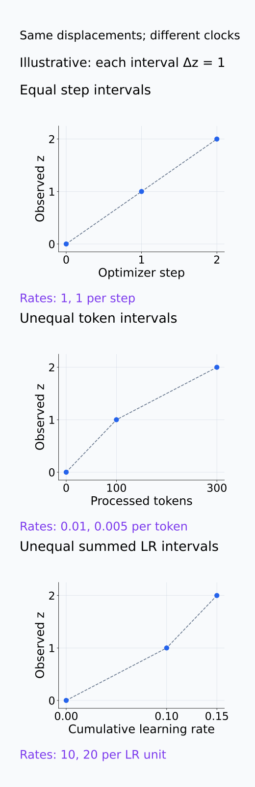
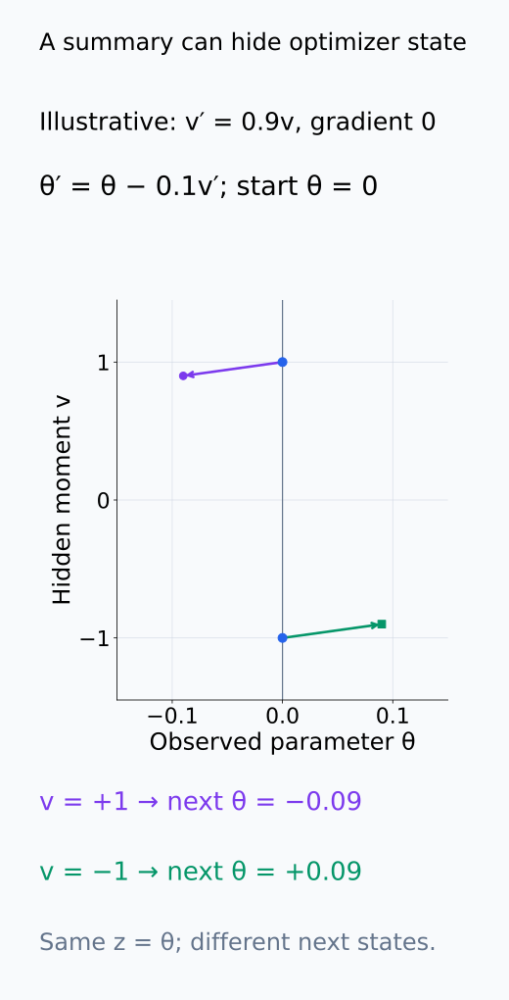
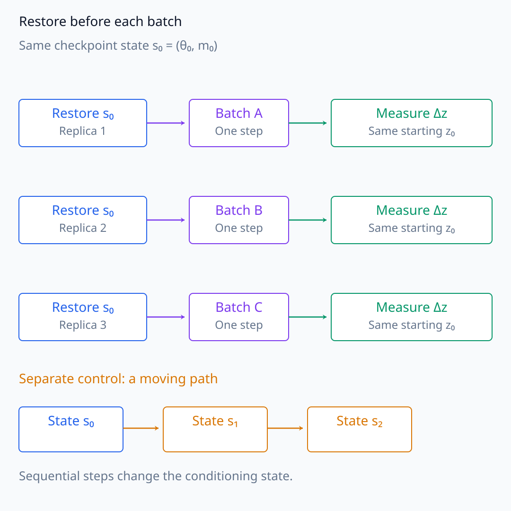
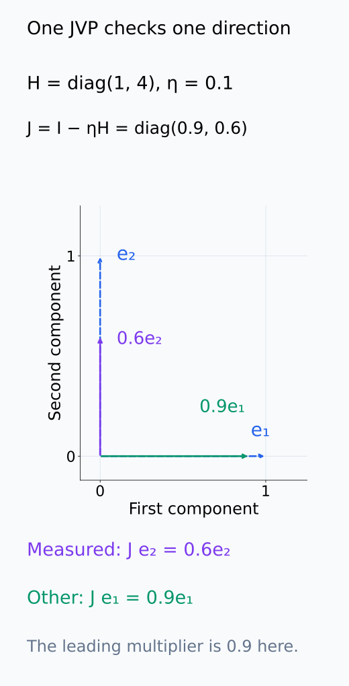
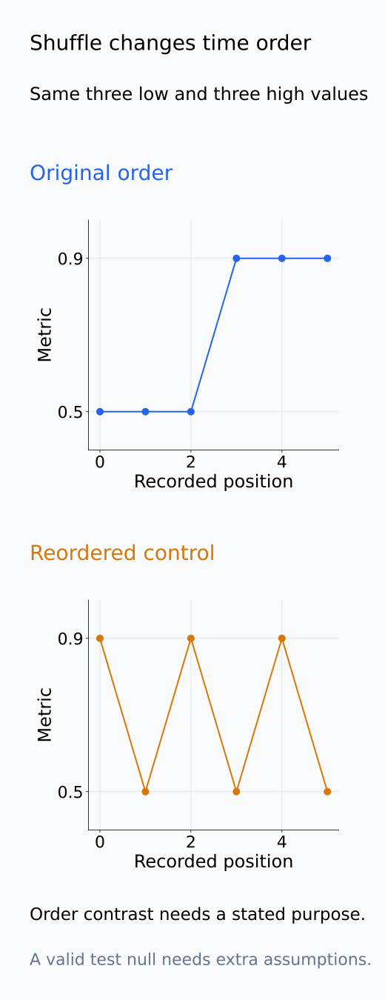
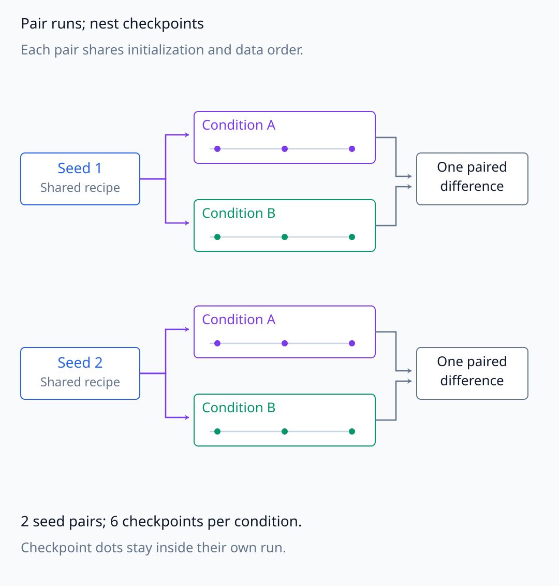

# A09-DYN-08. 종합 실습: 학습 궤적 분석

## 이 단원이 필요한 이유

checkpoint 몇 개를 선으로 잇는 것만으로 learning dynamics를 설명할 수 없다. time coordinate, state, distance, stochastic repetition과 interpolation error를 고정해야 trajectory·stability·transition 주장을 분리할 수 있다.

## 학습 목표

- 학습 궤적 분석의 state와 time을 정의할 수 있다.
- drift·noise·local stability의 측정 계획을 세울 수 있다.
- paired seed와 checkpoint resolution을 포함한 control을 설계할 수 있다.
- 관측된 궤적에서 허용되는 주장 강도를 판정할 수 있다.

## 선수지식 확인

- 선수 단원: [A09-DYN-01~07](A09-DYN-07-continuous-time-sgd.md)
- 확인 질문: optimizer step과 processed token 수 중 어느 것을 time으로 쓸지는 왜 결과를 바꾸는가?

## 기호와 용어

| 기호·용어 | Common spoken reading | 의미 | shape·범위 |
|---|---|---|---|
| $z_k$ | `z sub k` | checkpoint state summary | vector |
| $\Delta z_k$ | `delta z sub k` | successive displacement | vector |
| $\hat b(z)$ | `b hat of z` | empirical local drift | vector |
| $\hat C(z)$ | `C hat of z` | empirical update covariance | PSD matrix |

## 분석 계약

claim은 “고정한 training recipe에서 paired seed의 checkpoint summary가 재현 가능한 drift와 변동 패턴을 보인다”로 제한한다. state에는 parameter projection, function metric, representation statistic와 optimizer state 중 질문에 필요한 항목을 명시한다.

time axis는 optimizer step, processed token, cumulative learning rate 중 하나를 사전에 선택한다. checkpoint 사이를 선형 interpolation할 때 실제 update path를 관측한 것으로 표현하지 않는다.

선택한 시간 값을 $\tau_k$라고 쓰면 관측 변위는 $\Delta z_k=z_{k+1}-z_k$이고 시간당 평균 이동은 $\Delta z_k/(\tau_{k+1}-\tau_k)$에 대응한다. step 간격이 같은 기록과 token 간격이 같은 기록은 같은 단위의 drift가 아니다. cumulative learning rate를 쓰면 checkpoint 사이에 수행한 각 update의 learning rate를 합해 시간 간격을 계산한다. 비교 조건에 따라 이 시간 좌표도 달라질 수 있으므로 recipe와 함께 기록한다.

$z_k$가 parameter의 projection이나 metric 요약이면 원래 optimizer state를 전부 담지 못할 수 있다. 동일한 $z$에 도달해도 숨은 parameter·moment가 다르면 다음 이동의 분포가 다르다. 따라서 $\hat b(z)$는 선택한 요약과 조건에서 측정한 경험적 평균으로 보고하며, $z$만으로 닫힌 Markov dynamics를 얻었다고 가정하지 않는다.

아래 시간축과 확장 state 좌표에서 같은 관측이 숨기는 차이를 확인한다.

<figure class="lesson-figure lesson-figure--tall" markdown="1">

<figcaption>설명용 z = 0, 1, 2라는 같은 세 관측을 그렸다. 각 구간 Δz = 1이어도 step 간격 1, token 간격 100·200, 누적 learning rate 간격 0.1·0.05가 서로 다른 rate를 만든다. 선은 관측점을 비교하는 안내다.</figcaption>

</figure>

<figure class="lesson-figure" markdown="1">

<figcaption>설명용 v′ = 0.9v, θ′ = θ − 0.1v′, gradient 0인 한 step을 그렸다. 두 시작 상태의 관측 z = θ는 모두 0이지만 숨은 v = ±1 때문에 다음 θ′는 ∓0.09이다. z만 같다고 같은 next-state law를 얻는 것은 아니다.</figcaption>

</figure>

## 측정 절차

1. 같은 initialization과 data order를 공유하는 paired condition을 만든다.
2. 고정 checkpoint에서 loss, function distance, update norm과 summary state를 기록한다.
3. repeated micro-batch gradient로 $\hat b$와 $\hat C$를 추정한다.
4. local Jacobian 또는 Hessian-vector product로 안정성 지표를 구한다.
5. checkpoint density를 늘린 sensitivity analysis와 time-shuffle null을 수행한다.

batch 반복은 checkpoint를 고정한 상태에서 수행한다. 같은 parameter에서 여러 gradient를 구하면 gradient mean과 covariance를 추정할 수 있지만, 이것이 곧 summary $z$의 update covariance는 아니다. plain SGD의 parameter update는 gradient에 $-\eta$를 곱하므로 covariance에 $\eta^2$를 곱한다. 선형 projection $z=A\theta$라면 projected update covariance는 $\eta^2ACA^\top$이다. 비선형 metric 요약이나 momentum·Adam update를 측정하려면 같은 checkpoint의 parameter와 optimizer state를 매번 복원한 복사본에서 one-step update를 적용하고 실제 $\Delta z$를 계산한다. 연달아 optimizer를 진행하면 조건을 고정한 noise 반복이 아니라 움직이는 경로를 측정하게 된다.

복원한 반복의 기준 state와 covariance가 projection을 거치는 계산을 아래에서 구별한다.

<figure class="lesson-figure lesson-figure--wide" markdown="1">

<figcaption>왼쪽은 각 batch 전에 같은 parameter와 optimizer state를 복원해 Δz를 같은 기준에서 측정한다. 오른쪽은 한 실행을 연달아 진행해 시작 state를 바꾼다. 그림의 숫자 0·1·2는 state index이며 실제 측정값을 뜻하지 않는다.</figcaption>

</figure>

<figure class="lesson-figure" markdown="1">

<figcaption>설명용 C = [[4, 1], [1, 1]], η = 0.1, A = (1, 1)이다. 위 contour는 update covariance η²C의 ellipse이고, 선형 summary Δz = Δθ₁ + Δθ₂의 variance는 η²ACAᵀ = 0.07이다. 아래 ±√0.07은 covariance 척도이며 모든 update가 들어오는 확률적 경계가 아니다.</figcaption>

</figure>

국소 안정성도 어느 update를 선형화하는지 정한다. parameter-only gradient flow에서는 loss Hessian의 음수가 drift Jacobian이고, plain gradient descent에서는 update Jacobian이 $I-\eta H$이다. moment가 있는 optimizer는 확장 state의 update를 선형화해야 한다. JVP·HVP 한 번은 선택한 방향의 반응만 주므로 leading rate를 보고하려면 고유값 추정 절차와 오차도 정해야 한다. 학습 중 움직이는 checkpoint에서 측정한 국소 민감도를 fixed point의 장기 안정성과 동일시하지 않는다.

아래 두 방향의 반응을 비교하면 단일 JVP가 측정한 범위가 드러난다.

<figure class="lesson-figure" markdown="1">

<figcaption>설명용 H = diag(1, 4), η = 0.1에서 discrete Jacobian은 J = diag(0.9, 0.6)이다. e₂의 JVP는 0.6e₂라는 선택 방향의 반응을 주지만, 다른 e₁의 multiplier 0.9가 더 크다. 이 한 그림의 J와 checkpoint를 실제 optimizer의 장기 안정성으로 일반화하지 않는다.</figcaption>

</figure>

checkpoint 간격을 줄이는 sensitivity analysis는 보간으로 만든 점을 늘리는 것이 아니라 실제로 더 촘촘히 저장한 state를 비교하는 것이다. metric 급변이 보이면 우선 인접 관측 시점 사이의 change point 후보 구간을 보고한다. time shuffle은 기록된 값의 순서 정보를 지운 대조다. 시간 상관이 있는 자료에서는 임의 순열을 곧바로 유효한 유의성 검정의 null로 쓸 수 없으므로, 순서 의존성 대조인지 검정인지 구분하고 후자에는 해당 null의 가정을 명시한다.

아래 실제 관측점과 보간점, 순서를 바꾼 대조를 각각 읽는다.

<figure class="lesson-figure lesson-figure--tall" markdown="1">

<figcaption>설명용 sparse 관측은 step 0·10·20의 0.5·0.5·0.9이다. 가운데 빈 원을 보간해 늘려도 후보 구간 (10, 20]은 줄지 않는다. 아래처럼 실제 step 14의 0.5와 step 15의 0.9를 추가 관측한 경우에는 후보 구간 (14, 15]을 보고할 수 있다.</figcaption>

</figure>

<figure class="lesson-figure" markdown="1">

<figcaption>두 패널은 설명용 값 0.5 세 개와 0.9 세 개를 그대로 가진다. 순서를 바꾸면 연속된 낮은 값과 높은 값의 시간 구조가 달라진다. 이 대조 그림만으로 시간 상관 자료에 유효한 유의성 검정이나 p-value를 얻었다고 주장하지 않는다.</figcaption>

</figure>

## 결과 기록표

| 질문 | estimand | measurement | 주요 한계 |
|---|---|---|---|
| 평균 이동 | 고정 state·조건의 경험적 drift | 조건을 맞춘 반복 평균 $\Delta z/\Delta\tau$ | projection·숨은 state |
| stochasticity | 고정 checkpoint의 update covariance | 복원한 state에서 batch별 one-step $\Delta z$ | sampling 가정·state 누락 |
| 국소 안정성 | leading local rate | JVP·HVP | linearization |
| transition | change point interval | dense checkpoints | resolution·multiple testing |

paired seed는 조건 간 차이를 계산할 때 같은 initialization과 data order를 공유하는 run을 짝짓는 단위다. 각 run 안의 여러 checkpoint를 독립 seed처럼 세지 않는다. drift의 시간 구간과 covariance를 측정한 batch 반복 횟수를 따로 적고, 안정성 지표에는 continuous drift인지 discrete update인지 표시한다. 이 기록이 있어야 표의 네 행이 같은 trajectory를 보더라도 서로 다른 estimand라는 점을 유지할 수 있다.

아래 중첩 구조에서 조건 차이를 계산하는 seed pair와 checkpoint를 구분한다.

<figure class="lesson-figure lesson-figure--wide" markdown="1">

<figcaption>구조를 설명하려고 2개의 seed pair와 각 run 안의 3개 checkpoint를 그렸다. 같은 seed의 A·B는 initialization과 data order를 공유하고, checkpoint는 해당 run 안에 중첩된다. 각 조건의 점 6개를 독립 seed 6개로 세지 않으며 조건 차이는 seed pair 단위로 계산한다.</figcaption>

</figure>

## 흔한 오해

- smooth한 plot은 underlying continuous path를 관측했다는 뜻이 아니다.
- seed 평균 trajectory는 개별 run이 실제로 지나간 trajectory가 아닐 수 있다.

## 연습문제

### 1. time axis
batch size가 run마다 다를 때 optimizer step만 맞추면 공정한가?

해설 보기

일반적으로 아니다. processed example·token과 learning-rate schedule을 함께 맞추거나 차이를 estimand에 포함해야 한다.

### 2. interpolation
두 checkpoint 사이의 straight line loss가 낮으면 실제 SGD가 그 선을 지났다고 말할 수 있는가?

해설 보기

없다. 이는 별도 interpolation path의 측정이며 실제 update path 증거가 아니다.

### 3. noise covariance
같은 checkpoint에서 여러 mini-batch gradient가 필요한 이유는 무엇인가?

해설 보기

conditional mean과 covariance를 추정하려면 batch sampling 반복이 필요하기 때문이다.

### 4. transition claim
metric change point가 seed마다 크게 다르면 어떤 결론이 적절한가?

해설 보기

recipe 아래 transition timing의 변동성이 크다고 보고하고 단일 step의 보편적 phase transition 주장을 피한다.

## 근거와 갱신 경계

이 실습은 ODE·SDE 근사를 checkpoint 연구 설계와 연결한다. 특정 optimizer가 특정 SDE를 따른다는 결론을 미리 두지 않으며 empirical residual 진단으로 근사 범위를 정한다.

## 단원 요약

- state·time·metric을 먼저 고정한다.
- drift·noise·stability를 서로 다른 estimand로 측정한다.
- dense checkpoint와 paired seed로 resolution·variance를 평가한다.
- interpolation과 실제 학습 path를 구분한다.

## 통과 기준

- 학습 궤적의 claim–estimand–measurement–control을 작성할 수 있는가?
- 연속시간 해석이 실패할 수 있는 진단을 제시할 수 있는가?

## 다음 단원

- 다음 선택 모듈은 A09-SYM이다.

## 집필자 점검표

- [x] 학습 궤적 분석 계약과 주장 한계를 포함했다.
- [x] 문제 4개에 해설이 있다.
- [x] Common spoken reading이 실제 영어 학술 발화이며 한글 음역이나 기계적 직역을 포함하지 않는다.
- [x] 선수지식과 링크를 확인했다.
