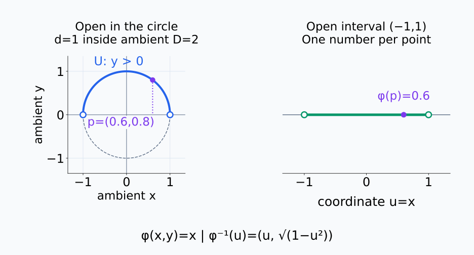
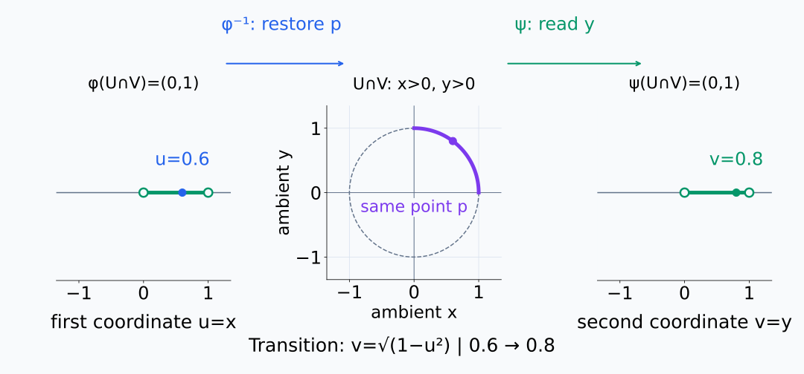
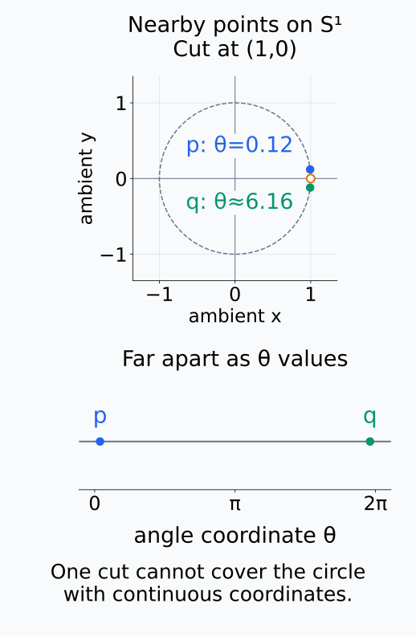
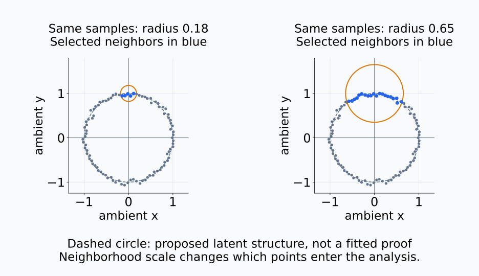
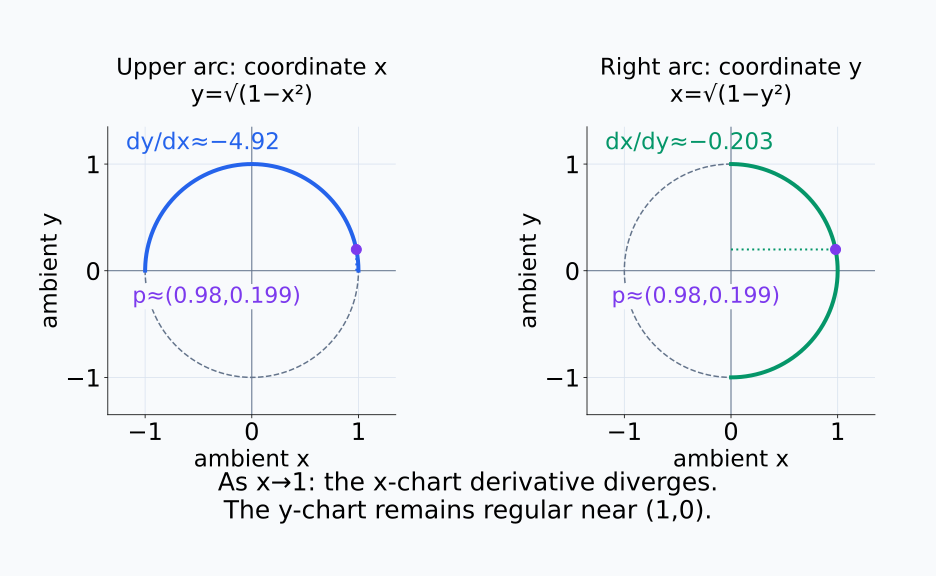
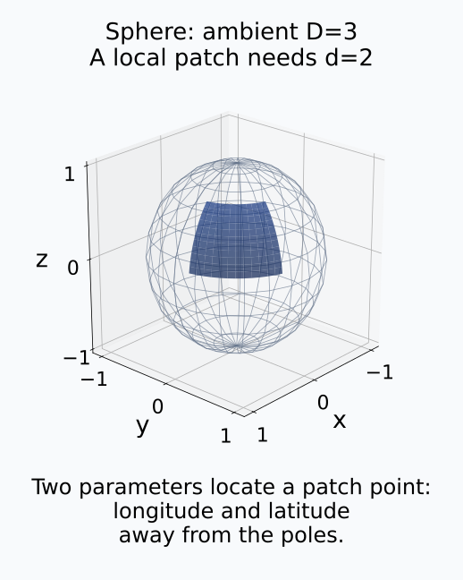
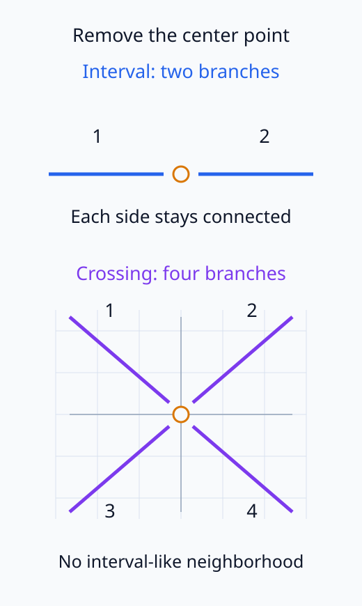

# A09-GEO-01. manifold와 local coordinate

## 이 단원이 필요한 이유

고차원 activation이 실제로는 몇 개 자유도 근처에 놓인다는 가설은 manifold 언어로 표현할 수 있다. manifold는 휘어진 그림 자체가 아니라 각 점 주변을 Euclidean coordinate로 기술할 수 있는 공간이다. global embedding dimension과 local intrinsic dimension을 구분해야 한다.

## 학습 목표

- manifold의 local Euclidean 조건을 설명할 수 있다.
- chart와 coordinate map을 구분할 수 있다.
- sphere에 하나의 global chart가 부족한 이유를 설명할 수 있다.
- activation cloud를 manifold라고 부를 때 필요한 가정을 열거할 수 있다.

## 선수지식 확인

- 선수 단원: [M01-10 다변수함수와 편미분](../../part-1-foundations/M01/M01-10-multivariable-partial-derivatives.md), [M02-02 선형결합과 span](../../part-1-foundations/M02/M02-02-linear-combinations-span.md), [M03-01 추상 벡터공간](../../part-1-foundations/M03/M03-01-abstract-vector-spaces.md)
- 확인 질문: $\mathbb R^D$ 안의 부분집합과 $d$차원 좌표공간은 어떻게 다른가?

## 기호와 용어

| 기호·용어 | Common spoken reading | 의미 | shape·범위 |
|---|---|---|---|
| $\mathcal M$ | `M calligraphic` | manifold | topological or smooth space |
| $(U,\varphi)$ | `U comma phi` | chart와 coordinate map | $\varphi:U\to\mathbb R^d$ |
| $d$ | `d` | intrinsic dimension | nonnegative integer |
| $D$ | `capital D` | ambient dimension | $D\ge d$ |

## 핵심 개념

### 국소 좌표로 기술한다는 뜻

$d$차원 manifold의 local Euclidean 조건은 각 점 $p$에 대해 그 점을 포함하는 열린 영역 $U$와 $\mathbb R^d$의 열린집합 사이에 일대일 대응이 있다는 뜻이다. 대응 함수와 역함수가 모두 연속이어야 한다. 이렇게 좌표를 붙였다가 되돌려도 주변 점들의 연결 관계가 끊기지 않는 대응을 homeomorphism이라고 한다. 여기서 $U$가 열려 있다는 조건은 manifold 안에서의 조건이다. 원의 열린 호는 원에서는 열린 영역이지만 $\mathbb R^2$의 작은 원판을 포함하는 영역은 아니다.

이 조건은 주변 점을 $d$개의 수로 기술할 수 있다는 말이지, 그 영역의 길이와 각도가 Euclidean 공간과 같다는 말은 아니다. 길이를 비교하는 metric은 GEO-03에서 별도로 정의한다.

다음 그림에서 열린 반원의 각 점과 열린 interval의 좌표값을 대응시켜 읽는다.

<figure class="lesson-figure lesson-figure--wide" markdown="1">

<figcaption>파란 열린 호는 원 안에서 열린 영역이다. 양 끝의 빈 원은 제외된 점이며, p=(0.6,0.8)는 좌표 u=0.6에 대응한다. 이 대응만으로 길이나 각도의 보존을 주장하지 않는다.</figcaption>
</figure>

### chart와 좌표값

chart는 영역과 대응 함수를 묶은 $(U,\varphi)$이고, coordinate map은 그중 함수 $\varphi$다. $\varphi(p)$는 이 함수를 점에 적용해서 얻은 $d$개의 좌표값이다. 따라서 같은 점에 다른 chart를 쓰면 좌표값도 달라질 수 있다.

두 chart $(U,\varphi)$와 $(V,\psi)$가 겹칠 때는 같은 점의 좌표를 바꾸는 transition map $\psi\circ\varphi^{-1}$를 사용한다. 먼저 $\varphi^{-1}$로 첫 좌표에서 manifold의 점을 복원하고, 그 점에 $\psi$를 적용해 둘째 좌표를 얻는다. 이 계산의 정의역은 겹치는 영역의 좌표 $\varphi(U\cap V)$이며, 도착점은 $\psi(U\cap V)$다.

smooth manifold에서는 공간 전체를 덮는 chart들을 선택하고, 겹치는 곳의 transition map과 역방향 map이 smooth하도록 요구한다. 여기서 smooth는 좌표공간에서 모든 차수의 편미분이 존재하고 연속이라는 뜻이다. 각 chart의 숫자 표현이 달라도 이 호환 조건 아래에서 미분을 이어서 사용할 수 있다. 단순한 local Euclidean 조건에 이러한 smooth 구조를 더하는 것이다.

좌표 0.6을 먼저 원의 점으로 복원한 뒤 다른 좌표 0.8을 읽는 순서를 다음 그림에서 확인한다.

<figure class="lesson-figure lesson-figure--wide" markdown="1">

<figcaption>위쪽 호 U와 오른쪽 호 V가 겹치는 첫 사분면에서 두 좌표값은 같은 점 p를 나타낸다. transition은 u를 점으로 복원하고 v를 읽는 합성이며, 이 겹침에서는 v=√(1−u²)이다.</figcaption>
</figure>

원 $S^1\subset\mathbb R^2$은 ambient dimension 2지만 intrinsic dimension 1이다. 각도 하나로 대부분을 표시할 수 있으나 한 점에서 좌표가 끊기므로 여러 chart가 필요하다.

원의 점은 두 ambient 좌표를 갖지만 원을 따라 움직일 때 두 값을 독립적으로 바꿀 수 없다. $x^2+y^2=1$이라는 관계를 지켜야 하기 때문이다. 한 열린 호 안에서는 각도 하나로 점을 정하므로 intrinsic dimension은 1이다. 다만 원 전체에서 각도를 한 범위로 자르면 그 범위의 양 끝에 가까운 수들이 원에서는 서로 가까운 점을 나타낸다. 한 chart가 모든 점을 연속적으로 구분하지 못하는 이유다.

원의 절개점 가까이에 있는 두 점과 각도 interval의 양 끝을 비교한다.

<figure class="lesson-figure" markdown="1">

<figcaption>p와 q는 원에서 가까이 있지만 0과 2π 사이의 각도 표현에서는 양 끝에 놓인다. 절개점 (1,0)을 포함해 원 전체를 하나의 연속적인 좌표 영역으로 덮을 수는 없다.</figcaption>
</figure>

activation 표본 $x_1,\ldots,x_n\in\mathbb R^D$은 유한 point cloud다. 이 표본만으로 smooth manifold의 존재가 증명되지는 않는다. 가설의 대상은 표본 자체보다, 표본이 나온 분포가 어떤 낮은 차원의 매끄러운 공간 근처에 놓인다는 구조다. 같은 표본도 선택한 neighborhood와 noise 처리에 따라 다른 국소 차원으로 보일 수 있다. noise scale, sampling density, neighborhood와 dimension estimator를 명시한다.

같은 표본에서도 neighborhood 반지름을 바꾸면 분석에 들어오는 점들이 달라진다.

<figure class="lesson-figure lesson-figure--wide" markdown="1">

<figcaption>교육용 noisy cloud에서 주황 원의 반지름만 0.18에서 0.65로 바꾸었다. 파란 표본의 범위가 달라지며, 점선 원은 가정한 잠재 구조이지 표본으로 증명한 manifold가 아니다. 차원 추정 결과를 제시하는 그림은 아니다.</figcaption>
</figure>

## 작은 예제

위쪽 반원에서는 $x\in(-1,1)$를 좌표로 써서 $y=\sqrt{1-x^2}$로 점을 복원할 수 있다. coordinate map은 $(x,y)$에서 $x$를 꺼내고, 역함수는 $x$를 $(x,\sqrt{1-x^2})$로 보낸다. 양 끝에 다가가면 $dy/dx=-x/\sqrt{1-x^2}$의 크기가 발산하므로 이 chart는 그 점들까지 매끄럽게 확장되지 않는다. 원의 오른쪽 끝 근처에서는 대신 $y$를 좌표로 쓰고 $x=\sqrt{1-y^2}$로 복원하면 된다. 한 좌표법이 막혀도 원 자체가 매끄럽지 않은 것은 아니다.

같은 점을 두 chart로 표시하고 오른쪽 끝 근처의 복원 기울기를 비교한다.

<figure class="lesson-figure lesson-figure--wide" markdown="1">

<figcaption>p≈(0.98,0.199)에서 x를 좌표로 복원하면 dy/dx≈−4.92이고, y를 좌표로 복원하면 dx/dy≈−0.203이다. 오른쪽 끝 (1,0)에서는 첫 좌표법이 막히지만 둘째 좌표법은 계속 사용할 수 있다.</figcaption>
</figure>

구면 $S^2$ 전체에도 하나의 global chart를 붙일 수 없다. 그 이유는 위도·경도 좌표의 극점 문제에만 한정되지 않는다. Euclidean 공간에서 닫히고 유계인 집합이 갖는 compact 성질은 연속 함수의 이미지에도 보존된다. 구면은 compact이므로 연속 coordinate map의 이미지도 compact이어야 하지만, $\mathbb R^2$의 비어 있지 않은 열린집합은 compact일 수 없다. 따라서 구면 전체를 chart의 정의역으로 쓰면서 그 이미지가 열린 좌표 영역이라는 조건을 만족시킬 수 없다. 여러 local chart로 덮는 것은 이 조건과 충돌하지 않는다.

구면의 국소 patch와 구면을 담는 세 좌표축을 분리해 읽는다.

<figure class="lesson-figure" markdown="1">

<figcaption>구면은 세 ambient 좌표로 표현되지만 파란 patch 안의 점은 두 자유도로 정한다. 극점에서 떨어진 이 patch의 위도·경도 좌표를 구면 전체의 global chart로 확장한다는 뜻은 아니다.</figcaption>
</figure>

## 흔한 오해

- 좌표선이 휘었다는 말과 manifold 자체의 intrinsic curvature는 같지 않다.
- PCA가 낮은 rank를 보였다는 사실만으로 nonlinear manifold가 확인된 것은 아니다.

교차점 반례에서는 가운데 점을 제거한 뒤 남는 연결 갈래의 수를 비교한다.

<figure class="lesson-figure" markdown="1">

<figcaption>열린 interval의 가운데 점을 제거하면 두 갈래가 남는다. X 모양의 교차점에서는 네 갈래가 남으므로 그 근방을 하나의 열린 interval과 같은 방식으로 좌표화할 수 없다.</figcaption>
</figure>

## 연습문제

### 1. 차원
$S^2\subset\mathbb R^3$의 intrinsic·ambient dimension을 적어라.

해설 보기

intrinsic dimension은 2, ambient dimension은 3이다.

### 2. 좌표
같은 점이 두 chart에서 다른 숫자로 표현돼도 모순이 아닌 이유는 무엇인가?

해설 보기

좌표는 chart에 의존하며 transition map이 두 표현을 연결하기 때문이다.

### 3. 반례
두 직선이 교차한 X 모양이 교차점 근처에서 1차원 manifold가 아닌 이유를 설명하라.

해설 보기

교차점을 제거하면 네 갈래가 남아 열린 interval의 근방과 위상적으로 같지 않다.

### 4. 모델 해석
activation manifold 주장을 위해 point cloud 외에 기록할 항목 두 가지를 적어라.

해설 보기

neighborhood scale과 intrinsic-dimension estimator, sampling dataset·noise model 등을 기록한다.

## 근거와 갱신 경계

정의와 chart 표준은 John M. Lee의 [*Introduction to Smooth Manifolds*, Chapter 1](https://sites.math.washington.edu/~lee/Books/ISM/c01.pdf)의 통상 정의를 따른다. 이 단원은 topological manifold의 분리·가산성 조건을 완전 전개하지 않는다.

## 단원 요약

- manifold는 국소적으로 $\mathbb R^d$ 좌표를 갖는다.
- 좌표는 점이 아니라 chart에 따른 표현이다.
- intrinsic dimension과 ambient dimension은 다르다.
- 유한 activation cloud는 manifold 가설의 관측 표본일 뿐이다.

## 통과 기준

- chart·transition map·두 차원을 구분할 수 있는가?
- manifold가 아닌 교차점 반례를 설명할 수 있는가?

## 다음 단원

- [A09-GEO-02 tangent space와 cotangent space](A09-GEO-02-tangent-cotangent.md)

## 집필자 점검표

- [x] local coordinate와 ambient space를 구분했다.
- [x] 문제 4개에 해설이 있다.
- [x] Common spoken reading이 실제 영어 학술 발화이며 한글 음역이나 기계적 직역을 포함하지 않는다.
- [x] 선수지식과 링크를 확인했다.
