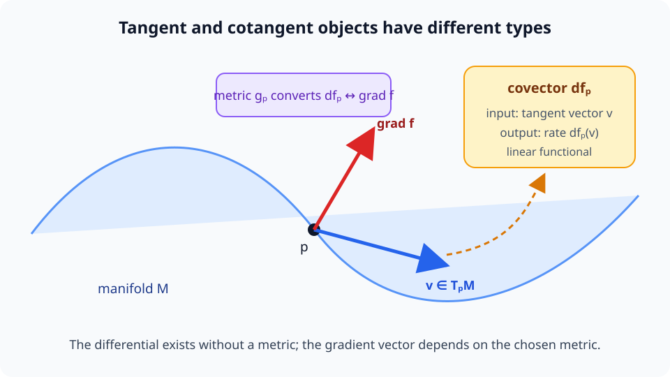

# A09-GEO-02. tangent space와 cotangent space

## 이 단원이 필요한 이유

manifold의 점은 일반적으로 서로 더할 수 없지만 한 점에서 가능한 순간 속도는 vector space를 이룬다. differential은 이 tangent vector를 scalar 변화율로 보내는 cotangent vector다. gradient는 metric을 선택한 뒤에야 differential에서 얻어진다.

## 학습 목표

- curve velocity로 tangent vector를 정의할 수 있다.
- tangent와 cotangent의 pairing을 계산할 수 있다.
- differential과 gradient를 구분할 수 있다.
- decoder Jacobian으로 latent tangent를 ambient 방향에 보낼 수 있다.

## 선수지식 확인

- 선수 단원: [A09-GEO-01 manifold와 local coordinate](A09-GEO-01-manifold-local-coordinate.md), [M03-10 total derivative와 differential](../../part-1-foundations/M03/M03-10-total-derivative-differential.md)
- 확인 질문: linear functional은 vector를 어떤 종류의 값으로 보내는가?

## 기호와 용어

| 기호·용어 | Common spoken reading | 의미 | shape·범위 |
|---|---|---|---|
| $T_p\mathcal M$ | `the tangent space of M at p` | $p$에서 가능한 속도 | $d$차원 vector space |
| $T_p^*\mathcal M$ | `the cotangent space of M at p` | tangent vector의 linear functional | dual space |
| $df_p$ | `d f at p` | $f$의 differential | $T_p\mathcal M\to\mathbb R$ |
| $\langle df_p,v\rangle$ | `the pairing of d f at p and v` | $v$ 방향 변화율 | scalar |

## 핵심 개념 1. tangent vector는 점이 아니라 가능한 순간 속도다

manifold $\mathcal M$ 위의 curve

$$
\gamma:(-\epsilon,\epsilon)\to\mathcal M,
\qquad
\gamma(0)=p
$$

를 생각하자. $t=0$에서의 속도 $\dot\gamma(0)$은 $p$를 지나면서 manifold 위에 머무르는 한 가지 움직임이다. 같은 점 $p$를 지나고 모든 smooth 함수에 같은 방향미분을 주는 curve들은 같은 tangent vector를 나타낸다고 본다. 이렇게 얻은 모든 속도의 집합이 $T_p\mathcal M$이다.

tangent vector는 $p$에서 다른 점 $q$로 향하는 displacement가 아니다. 서로 다른 점의 tangent space $T_p\mathcal M$과 $T_q\mathcal M$은 별도의 vector space다. 두 tangent vector를 직접 비교하려면 chart, connection 또는 ambient embedding처럼 비교 규칙을 추가해야 한다.

## 핵심 개념 2. 좌표는 tangent vector의 성분을 제공한다

local coordinate를 $x^1,\ldots,x^d$라고 하면 tangent basis를

$$
\frac{\partial}{\partial x^1}\bigg|_p,
\ldots,
\frac{\partial}{\partial x^d}\bigg|_p
$$

로 쓸 수 있다. tangent vector $v$는

$$
v
=
\sum_{i=1}^d v^i
\frac{\partial}{\partial x^i}\bigg|_p
$$

처럼 좌표 성분 $v^i$로 표현된다. chart를 바꾸면 성분과 basis는 함께 바뀌지만 기하학적 tangent vector 자체는 같은 대상을 나타낸다.

embedding된 surface에서는 tangent vector를 ambient vector로 그릴 수 있다. 그러나 이 그림은 선택한 embedding의 도움을 받은 표현이다. 추상 manifold에서 tangent vector를 정의하는 데 ambient 공간은 필수가 아니다.

## 핵심 개념 3. cotangent vector는 속도를 변화율로 읽는다

cotangent space $T_p^*\mathcal M$는 tangent space의 dual space다. 즉, covector $\omega_p$는

$$
\omega_p:T_p\mathcal M\to\mathbb R
$$

인 linear functional이다. smooth function $f:\mathcal M\to\mathbb R$의 differential은 대표적인 covector이며

$$
df_p(v)
=
\left.\frac{d}{dt}f(\gamma(t))\right|_{t=0}
$$

로 정의한다. 여기서 $\dot\gamma(0)=v$다. 입력은 tangent vector이고 출력은 그 방향으로 움직일 때 $f$가 변하는 scalar rate다.

<figure class="lesson-figure" markdown="1">

<figcaption>파란색 v는 manifold를 따라 가능한 속도이고, covector df_p는 이 속도를 scalar 변화율로 읽는다. 빨간색 gradient는 metric을 선택한 뒤에만 같은 정보를 vector로 표현한다.</figcaption>
</figure>

그림에서 tangent vector와 covector는 서로 다른 화살표 종류가 아니라 타입이 다른 객체다. $df_p(v)$라는 pairing은 추가 좌표나 metric 없이 정의된다. 반면 `covector가 가리키는 방향`을 그리려면 covector를 vector로 바꾸는 규칙이 필요하다.

## 핵심 개념 4. gradient는 metric에 의존한다

점 $p$에서 metric $g_p$를 선택하면 모든 covector $df_p$에 대해

$$
df_p(v)
=
g_p\bigl(\operatorname{grad} f,v\bigr)
\qquad
\text{for every }v\in T_p\mathcal M
$$

를 만족하는 유일한 gradient vector $\operatorname{grad}f$가 정해진다. Euclidean coordinate에서는 metric matrix가 identity라 differential의 성분과 gradient의 성분이 같아 보인다. 일반 metric matrix $\mathbf G$에서는 column 좌표로

$$
\operatorname{grad}f
=
\mathbf G^{-1}(df)
$$

에 해당하는 변환이 필요하다. 따라서 differential은 함수와 점에서 정해지지만 gradient의 길이와 방향은 metric 선택에 의존한다.

## 핵심 개념 5. Jacobian은 tangent vector를 다음 공간으로 보낸다

smooth map $F:\mathcal M\to\mathcal N$의 differential $dF_p$는

$$
dF_p:T_p\mathcal M\to T_{F(p)}\mathcal N
$$

인 linear map이다. 좌표를 고르면 이 map의 행렬이 Jacobian이다. decoder $F:\mathbb R^d\to\mathbb R^D$에서 latent velocity $u$의 ambient tangent는

$$
J_F(z)u\in\mathbb R^D
$$

다. $J_F(z)$의 column space는 그 점에서 decoder image가 움직일 수 있는 1차 방향을 나타낸다. finite step $F(z+u)-F(z)$와 tangent approximation $J_F(z)u$를 같다고 두려면 $u$가 충분히 작아야 한다.

## 작은 예제

원 $\gamma(t)=(\cos t,\sin t)$에서

$$
\dot\gamma(t)=(-\sin t,\cos t)
$$

이므로 $t=0$의 tangent는 $(0,1)$이다. 점 $p=(1,0)$에서 원의 tangent space는 $(0,1)$의 모든 scalar 배로 이루어진 1차원 vector space다. 반지름 방향 $(1,0)$은 원 위 curve의 속도가 아니므로 $T_pS^1$에 속하지 않는다.

$f(x,y)=y$라면 $df_p(v_1,v_2)=v_2$다. tangent $v=(0,3)$과 pairing하면 $df_p(v)=3$을 얻는다. 이 계산은 $v$의 두 번째 성분을 읽는 covector 작용이며, 아직 gradient vector를 정하지 않아도 수행할 수 있다.

## 흔한 오해

- tangent vector는 반드시 manifold 위의 다른 점을 가리키는 화살표가 아니다.
- differential과 gradient는 Euclidean 좌표에서 수치가 같아 보일 뿐 타입이 다르다.

## 연습문제

### 1. tangent
$\gamma(t)=(\cos t,\sin t)$의 $t=\pi/2$ tangent를 구하라.

해설 보기

$\dot\gamma(t)=(-\sin t,\cos t)$이므로 $(-1,0)$이다.

### 2. pairing
$df=(2,-1)$, $v=(3,4)$인 좌표에서 $df(v)$를 구하라.

해설 보기

$2\cdot3-1\cdot4=2$이다.

### 3. 타입
metric 없이 $df$를 tangent vector라고 부를 수 없는 이유는 무엇인가?

해설 보기

$df$는 tangent vector를 scalar로 보내는 dual object이며 vector로 바꾸는 식별에는 metric이 필요하다.

### 4. Jacobian
$J_F\in\mathbb R^{D\times d}$, $u\in\mathbb R^d$일 때 $J_Fu$의 shape은 무엇인가?

해설 보기

$\mathbb R^D$의 ambient tangent vector다.

## 근거와 갱신 경계

curve velocity와 derivation 정의는 smooth manifold의 표준적 동치 정의다. 이 단원은 vector bundle의 formal construction은 생략한다.

## 단원 요약

- tangent space는 한 점에서 가능한 curve 속도의 vector space다.
- cotangent vector는 tangent vector에 작용하는 linear functional이다.
- gradient는 differential과 metric으로부터 정해진다.
- Jacobian은 map 사이 tangent vector를 전달한다.

## 통과 기준

- curve에서 tangent를 계산할 수 있는가?
- differential·gradient·Jacobian의 타입을 구분할 수 있는가?

## 다음 단원

- [A09-GEO-03 metric과 길이](A09-GEO-03-metric-length.md)

## 집필자 점검표

- [x] tangent와 cotangent 타입을 구분했다.
- [x] 문제 4개에 해설이 있다.
- [x] Common spoken reading이 실제 영어 학술 발화이며 한글 음역이나 기계적 직역을 포함하지 않는다.
- [x] 선수지식과 링크를 확인했다.
