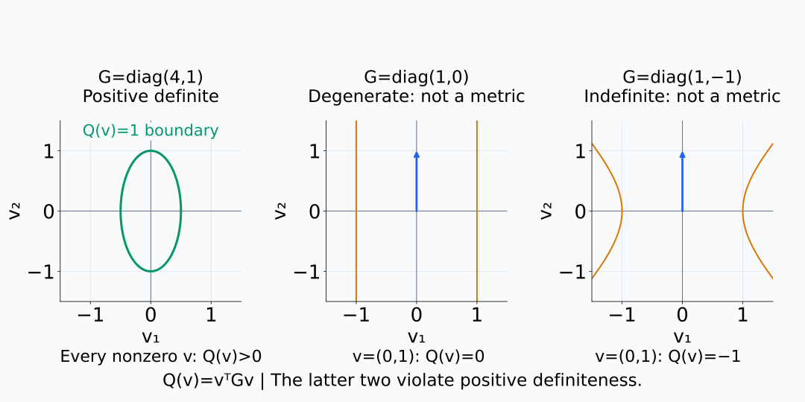
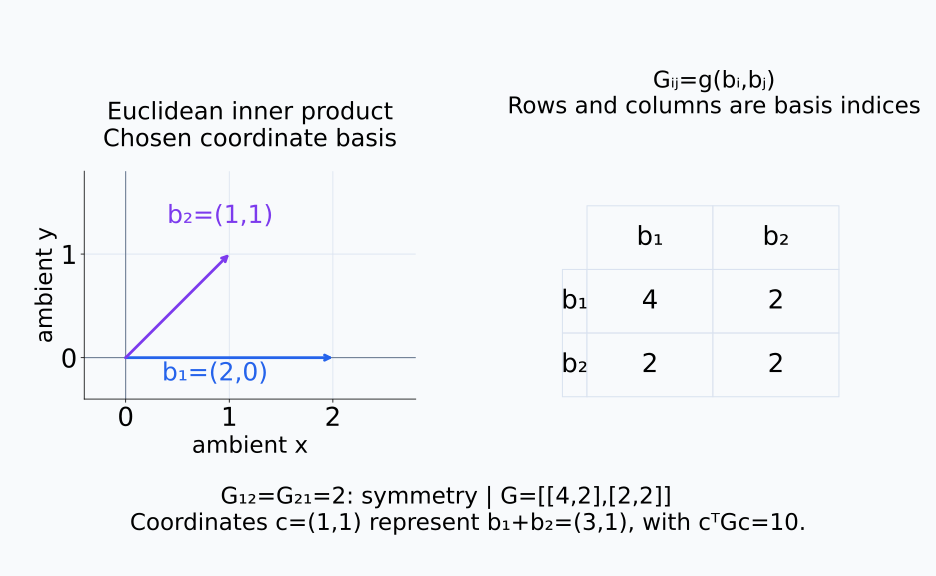
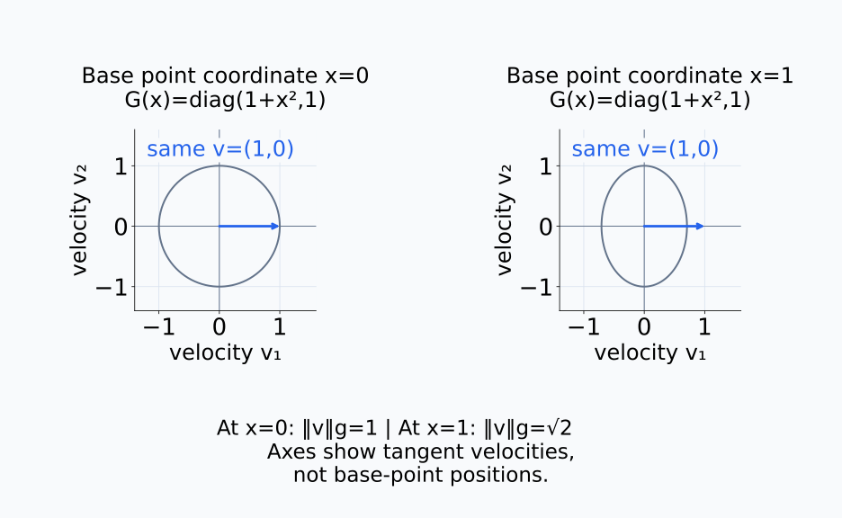
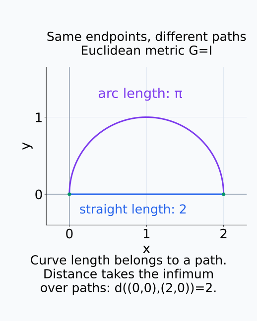
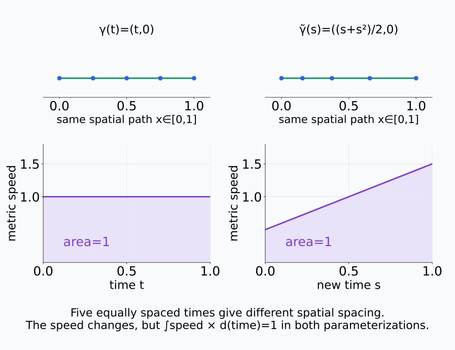
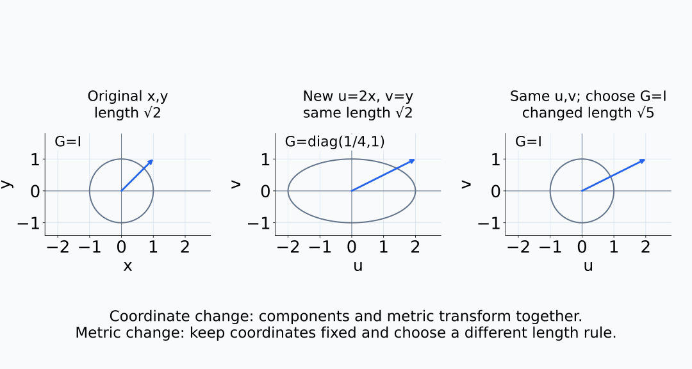
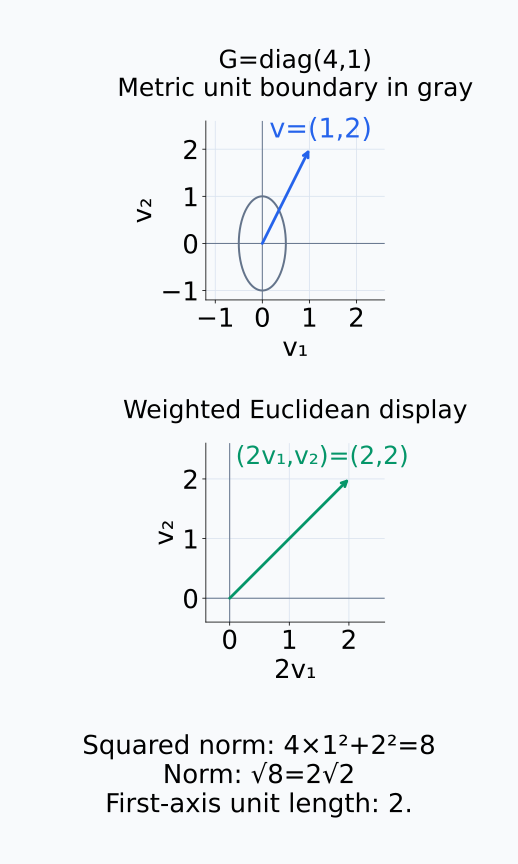

# A09-GEO-03. metric과 길이

## 이 단원이 필요한 이유

coordinate 차이의 Euclidean norm을 representation 거리로 쓰면 좌표 선택을 geometry로 오해할 수 있다. Riemannian metric은 각 tangent space에서 길이와 각도를 정하며, curve length와 geodesic distance의 출발점이 된다.

## 학습 목표

- Riemannian metric의 positive-definite bilinear 조건을 설명할 수 있다.
- 좌표 metric matrix로 tangent norm을 계산할 수 있다.
- curve length가 재매개화에 불변임을 설명할 수 있다.
- metric 선택이 activation 거리 해석을 바꾸는 이유를 말할 수 있다.

## 선수지식 확인

- 선수 단원: [A09-GEO-02 tangent space와 cotangent space](A09-GEO-02-tangent-cotangent.md), [M02-03 내적, 길이와 각도](../../part-1-foundations/M02/M02-03-inner-product-length-angle.md)
- 확인 질문: positive-definite matrix가 만드는 quadratic form은 왜 음수가 되지 않는가?

## 기호와 용어

| 기호·용어 | Common spoken reading | 의미 | shape·범위 |
|---|---|---|---|
| $g_p(u,v)$ | `g at p of u comma v` | $p$의 tangent inner product | scalar |
| $G(x)$ | `G of x` | 좌표에서의 metric matrix | $d\times d$ positive definite |
| $\|v\|_{g,p}$ | `the g norm of v at p` | metric tangent norm | nonnegative scalar |
| $L_g(\gamma)$ | `the g length of gamma` | curve의 metric length | nonnegative scalar |

## 핵심 개념

Riemannian metric은 각 $p$에 smooth하게 변하는 inner product $g_p$를 배정한다.

inner product는 두 tangent vector 각각에 대해 선형이고, $g_p(u,v)=g_p(v,u)$이며, $v\ne0$이면 $g_p(v,v)>0$인 함수다. Bilinear는 한쪽 vector를 고정했을 때 다른 쪽의 합과 scalar 배를 그대로 보존한다는 뜻이다. Positive-definite 조건 덕분에 0이 아닌 속도에 0의 길이를 주지 않는다. smooth하게 변한다는 조건은 선택한 chart에서 metric의 계수들이 점의 좌표에 따라 매끄럽게 변한다는 뜻이다.

다음 세 quadratic form에서 비영속도에 양수 값을 주는 조건을 비교한다.

<figure class="lesson-figure lesson-figure--wide" markdown="1">

<figcaption>G=diag(4,1)은 비영속도에 양수 squared norm을 준다. 반면 v=(0,1)에 대해 diag(1,0)은 0, diag(1,−1)은 −1을 주므로 Riemannian metric의 positive-definite 조건을 만족하지 않는다. 각 곡선은 Q(v)=1인 집합이다.</figcaption>
</figure>

좌표 basis의 각 쌍에 inner product를 적용한 값을 $G(x)$의 원소로 모으면

$$
g_p(u,v)=u^\top G(x)v,
\qquad
\|v\|_{g,p}=\sqrt{v^\top G(x)v}.
$$

를 얻는다. $x$는 현재 점 $p$의 좌표이고 $u,v$는 그 점에서의 속도 성분이다. 같은 차원의 배열이어도 점의 좌표와 tangent 속도는 역할이 다르다. $G(x)$는 대칭 positive-definite matrix이며, quadratic form은 선택한 basis에서의 inner product를 행렬 곱으로 계산한 것이다. chart를 바꾸면 속도 성분과 metric matrix를 함께 바꿔야 같은 길이를 얻는다.

metric matrix의 행·열은 좌표 basis의 쌍을 가리킨다.

<figure class="lesson-figure lesson-figure--wide" markdown="1">

<figcaption>교육용 basis b₁=(2,0), b₂=(1,1)의 쌍별 내적을 오른쪽 G에 넣었다. 좌표 c=(1,1)은 ambient vector (3,1)을 나타내며, cᵀGc=10은 그 vector의 squared length와 일치한다.</figcaption>
</figure>

같은 속도 성분을 넣어도 base point의 metric이 다르면 길이는 달라진다.

<figure class="lesson-figure lesson-figure--wide" markdown="1">

<figcaption>교육용 smooth metric G(x)=diag(1+x²,1)에서 회색 단위 경계는 점의 좌표 x에 따라 달라진다. 같은 속도 v=(1,0)의 길이는 x=0에서 1, x=1에서 √2이다. 패널 축은 점의 위치가 아니라 tangent 속도 성분이다.</figcaption>
</figure>

곡선은 조각마다 미분 가능하고 속도가 연속이라고 하자. 각 순간의 metric 속도에 작은 시간 간격을 곱하면 그 구간에서 움직인 길이를 근사한다. 이를 경로 전체에 적분한 curve length는

$$
L_g(\gamma)=\int_a^b
\sqrt{\dot\gamma(t)^\top G(\gamma(t))\dot\gamma(t)}\,dt
$$

이다. 이 식의 $\gamma(t)$와 $\dot\gamma(t)$는 해당 chart에서 표현한 위치와 속도다. 곡선이 하나의 chart를 벗어나면 여러 좌표 구간에서 계산한 길이를 합한다. 같은 점을 지나는 서로 다른 경로는 길이가 다를 수 있다. 경로로 연결되는 두 점 사이의 metric distance는 그 점들을 잇는 경로들의 길이의 하한으로 정하며, 한 점의 tangent norm과 구분한다.

같은 두 끝점을 잇는 두 경로와 두 점 사이의 거리를 구분한다.

<figure class="lesson-figure" markdown="1">

<figcaption>G=I인 평면에서 직선 경로의 길이는 2이고 위쪽 반원 경로의 길이는 π이다. 두 점 사이의 거리는 경로별 길이의 하한인 2이며, 아무 경로의 길이와 같다고 할 수는 없다.</figcaption>
</figure>

### 속도를 바꿔도 길이가 같은 이유

새 시간 구간과 원래 시간 구간 사이의 매끄러운 일대일 대응 $t=\tau(s)$로 시간을 바꾸고 $\widetilde\gamma(s)=\gamma(\tau(s))$라 쓰자. chain rule에 의해 새 속도는 $\dot\gamma(\tau(s))\tau'(s)$다. norm은 scalar 배의 절댓값을 밖으로 꺼낼 수 있으므로

$$
\|\widetilde\gamma'(s)\|_g
=\|\dot\gamma(\tau(s))\|_g\,|\tau'(s)|.
$$

증가하는 재매개화에서는 $dt=\tau'(s)ds$로 적분 변수를 바꾸면 원래 길이 적분으로 돌아간다. 감소하는 재매개화도 절댓값과 뒤집힌 적분 경계가 같은 길이를 준다. 같은 경로를 같은 횟수로 통과하면서 속도나 진행 방향만 바꾼 경우다. 앞뒤로 되돌아가 같은 구간을 여러 번 통과하는 움직임까지 하나의 일대일 재매개화로 볼 수는 없다.

같은 경로의 점 간격과 속도 적분 면적을 함께 비교한다.

<figure class="lesson-figure lesson-figure--wide" markdown="1">

<figcaption>교육용 직선 γ(t)=(t,0)를 t=(s+s²)/2로 재매개화했다. 같은 시간 간격의 점들은 다르게 배치되고 속도도 1에서 0.5+s로 바뀌지만, 두 속도 그래프 아래 면적은 모두 1이다. 이 시간 변환은 [0,1] 사이의 증가하는 일대일 대응이다.</figcaption>
</figure>

### 좌표 변경과 metric 변경

activation space의 Euclidean metric, covariance whitening metric과 decoder-induced metric은 다른 질문을 만든다. metric을 사후에 성능이 좋아 보이는 것으로 고르면 선택 편향이 생긴다.

Euclidean metric은 raw activation 좌표의 차이를 재고, whitening metric은 선택한 데이터에서 추정한 변동 크기에 맞춰 방향별 차이를 조정한다. decoder-induced metric은 latent 변화가 출력에서 얼마나 크게 나타나는지 잰다. 같은 geometry를 다른 chart로 표현하는 경우에는 metric도 좌표에 맞춰 변환해 길이를 보존한다. 반면 같은 좌표에 다른 metric을 지정하면 실제로 길이를 재는 규칙을 바꾸므로 거리가 달라져도 모순이 아니다.

좌표를 바꾸며 길이를 보존하는 경우와 같은 좌표에 새 metric을 지정하는 경우를 나눠 본다.

<figure class="lesson-figure lesson-figure--wide" markdown="1">

<figcaption>(1,1)을 u=2x, v=y 좌표의 (2,1)로 표현하면서 G도 diag(1/4,1)로 바꾸면 길이 √2를 보존한다. 오른쪽처럼 같은 새 좌표에 G=I를 지정하면 길이를 재는 규칙 자체가 바뀌어 √5가 된다.</figcaption>
</figure>

## 작은 예제

$G=\operatorname{diag}(4,1)$에서 $v=(1,2)$의 squared norm은 $4+4=8$, norm은 $2\sqrt2$이다.

행렬 곱을 풀면 $v^\top Gv=4v_1^2+v_2^2$다. 첫 좌표의 단위 속도는 길이 2, 둘째 좌표의 단위 속도는 길이 1로 측정한다. 대각 원소는 길이가 아니라 squared norm의 가중치이므로 마지막에 제곱근을 취한다.

첫 성분을 두 배로 표시하면 이 metric norm을 Euclidean 길이 계산으로 확인할 수 있다.

<figure class="lesson-figure" markdown="1">

<figcaption>위 패널은 속도 (1,2)와 metric의 단위 경계이고, 아래 패널은 계산을 위한 weighted 표시 (2,2)다. squared norm은 8, norm은 2√2이며, 가중치 4를 길이 4로 읽지 않는다.</figcaption>
</figure>

## 흔한 오해

- metric은 두 점의 거리 함수만을 뜻하지 않고 tangent inner product field를 뜻한다.
- coordinate가 nonlinear하다는 말만으로 공간에 intrinsic curvature가 생기지 않는다.

## 연습문제

### 1. norm
$G=\operatorname{diag}(9,1)$, $v=(1,0)$의 metric norm을 구하라.

해설 보기

$\sqrt9=3$이다.

### 2. angle
$G=I$이고 $u=(1,0)$, $v=(1,1)$일 때 cosine을 구하라.

해설 보기

$u^\top v/(\|u\|\|v\|)=1/\sqrt2$이다.

### 3. position dependence
$G(x)$가 점마다 달라지면 같은 좌표 velocity의 길이가 달라질 수 있는가?

해설 보기

그렇다. norm은 velocity와 현재 점의 metric matrix에 함께 의존한다.

### 4. 모델 해석
cosine distance와 whitening distance를 비교할 때 먼저 고정할 것은 무엇인가?

해설 보기

데이터, centering·normalization, covariance 추정법과 연구 질문에 맞는 metric 선택 규칙이다.

## 근거와 갱신 경계

metric·curve length 정의는 Riemannian geometry의 표준 정의를 따른다. 정의와 경로 길이의 관계는 Danny Calegari의 [*Notes on Riemannian Geometry*, §3.1](https://math.uchicago.edu/~dannyc/courses/riem_geo_2013/riem_geo_notes.pdf)을 참고할 수 있다. 이 단원은 distance completeness와 Hopf–Rinow theorem은 다루지 않는다.

## 단원 요약

- metric은 tangent space마다 inner product를 준다.
- curve length는 metric matrix와 velocity로 계산한다.
- 같은 좌표 차이도 metric에 따라 길이가 달라진다.
- activation geometry에서는 metric 선택을 분석 계약에 포함한다.

## 통과 기준

- metric norm과 curve length를 계산할 수 있는가?
- 좌표·metric·distance를 구분할 수 있는가?

## 다음 단원

- [A09-GEO-04 pullback metric과 Jacobian](A09-GEO-04-pullback-metric.md)

## 집필자 점검표

- [x] metric과 좌표 거리를 구분했다.
- [x] 문제 4개에 해설이 있다.
- [x] Common spoken reading이 실제 영어 학술 발화이며 한글 음역이나 기계적 직역을 포함하지 않는다.
- [x] 선수지식과 링크를 확인했다.
