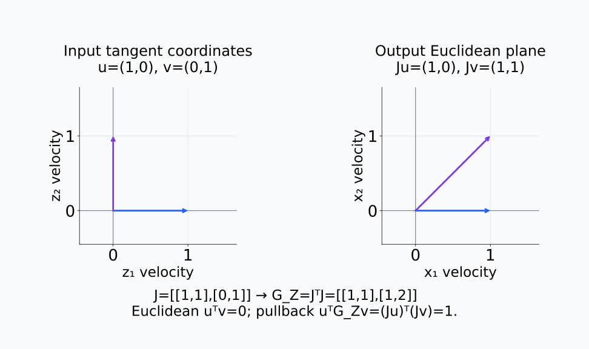
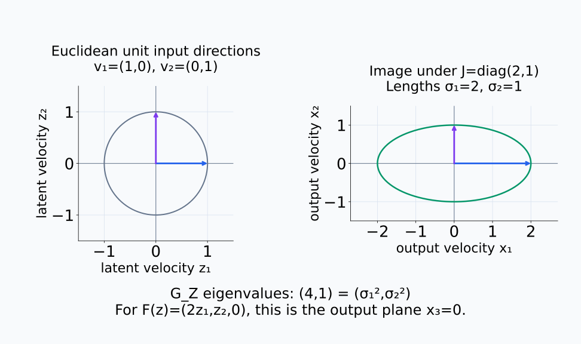
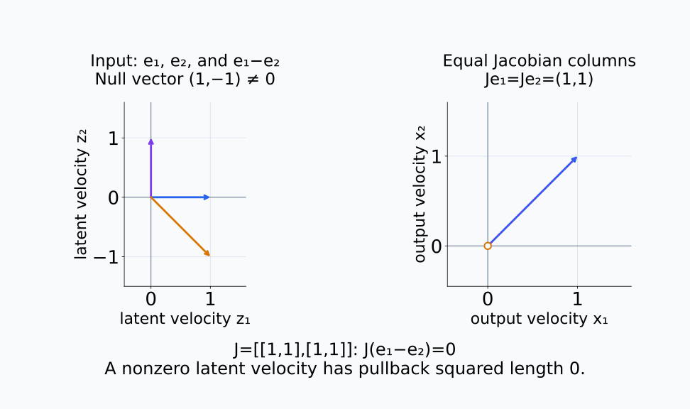
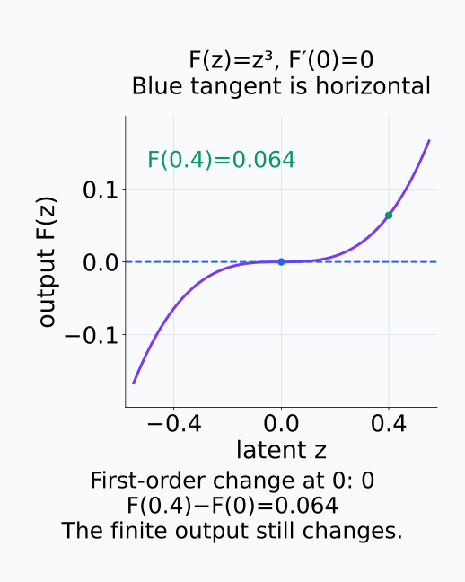
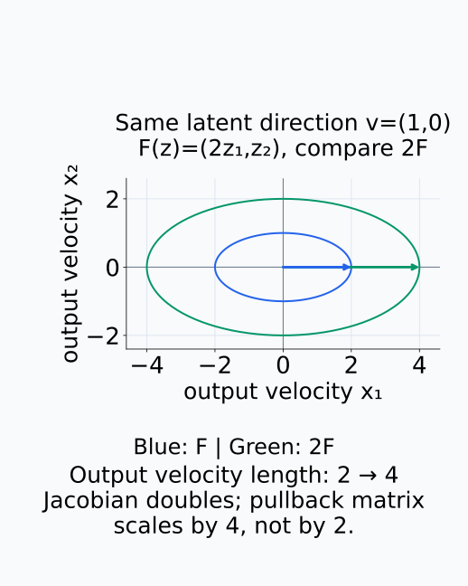
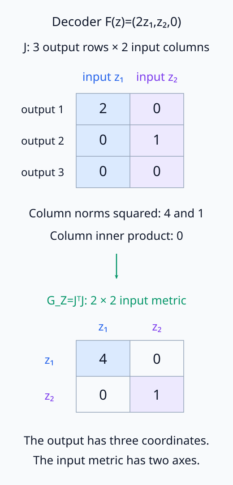

# A09-GEO-04. pullback metric과 Jacobian

## 이 단원이 필요한 이유

latent variable의 작은 변화가 activation이나 output에서 얼마나 크게 나타나는지는 coordinate 차이만으로 알 수 없다. map의 Jacobian이 출력 공간의 metric을 입력 공간으로 옮기면, 입력 방향별 민감도를 길이와 각도로 해석할 수 있다.

## 학습 목표

- pullback metric을 Jacobian으로 계산할 수 있다.
- Jacobian의 singular value와 국소 길이 왜곡을 연결할 수 있다.
- rank가 떨어질 때 metric이 퇴화하는 이유를 설명할 수 있다.
- decoder-induced geometry가 답하는 질문을 구분할 수 있다.

## 선수지식 확인

- 선수 단원: [A09-GEO-03 metric과 길이](A09-GEO-03-metric-length.md), [M03-11 Jacobian](../../part-1-foundations/M03/M03-11-jacobian.md)
- 확인 질문: Jacobian은 작은 입력 변화와 작은 출력 변화를 어떻게 연결하는가?

## 기호와 용어

| 기호·용어 | Common spoken reading | 의미 | shape·범위 |
|---|---|---|---|
| $F:Z\to X$ | `F from Z to X` | representation 또는 decoder map | smooth map |
| $J_F(z)$ | `the Jacobian of F at z` | $F$의 국소 선형화 | $n\times d$ |
| $F^*g$ | `the pullback of g by F` | $X$의 metric을 $Z$로 옮긴 bilinear form | full column rank이면 metric |
| $G_Z(z)$ | `G sub Z of z` | 좌표 pullback metric | $d\times d$ |

## 핵심 개념

$X$의 metric을 Euclidean inner product로 고정한다.

입력 방향 $u,v$를 먼저 $J_F(z)u,J_F(z)v$라는 출력 속도로 보낸 뒤, 출력 공간에서 내적을 계산한다. 이를 입력 공간의 계산으로 다시 쓰면

$$
(J_F(z)u)^\top(J_F(z)v)
=u^\top\bigl(J_F(z)^\top J_F(z)\bigr)v
$$

다. 따라서 입력 tangent vector 사이의 bilinear form을 나타내는 행렬은

$$
G_Z(z)=J_F(z)^\top J_F(z)
$$

이다. $v\in T_zZ$에 대해

$$
\|v\|_{G_Z}^2=v^\top J_F(z)^\top J_F(z)v=\|J_F(z)v\|_2^2
$$

이므로 입력 tangent vector의 길이를 출력의 순간 속도 norm으로 잰다. 일반 nonlinear map의 유한 출력 변화량과는 구분한다. $G_Z$의 대각 원소는 Jacobian 각 열의 squared norm이고, 비대각 원소는 서로 다른 열의 내적이다. 입력 좌표축 방향들이 출력에서 얼마나 길고 서로 얼마나 겹치는지를 함께 기록한다.

두 입력 방향을 출력으로 보낸 뒤 내적을 계산하는 순서를 그림에서 따라간다.

<figure class="lesson-figure lesson-figure--wide" markdown="1">

<figcaption>교육용 J=[[1,1],[0,1]]에서 입력 u=(1,0), v=(0,1)은 Euclidean 내적 0을 갖지만, 출력 Ju=(1,0), Jv=(1,1)의 내적은 1이다. 입력에서 G_Z=JᵀJ로 계산한 pairing도 같은 1을 준다.</figcaption>
</figure>

### singular value와 길이 배율

$J_F$의 right singular vector는 주된 입력 방향이고 singular value는 그 방향의 국소 확대율이다. SVD는 단위 right singular vector를 대응하는 단위 left singular vector의 $\sigma_i$배로 보낸다. 그러므로 그 입력 방향의 출력 길이는 $\sigma_i$, squared length는 $\sigma_i^2$다. 같은 right singular vector는 $J_F^\top J_F$의 eigenvector이며 eigenvalue는 $\sigma_i^2$다. pullback metric의 eigenvalue를 길이 배율로 읽으려면 제곱근을 취해야 한다.

단위 입력 방향과 Jacobian이 만든 출력 타원을 비교한다.

<figure class="lesson-figure lesson-figure--wide" markdown="1">

<figcaption>첫 단위 방향은 길이 2, 둘째 단위 방향은 길이 1로 보내진다. singular value는 (2,1), pullback eigenvalue는 그 제곱인 (4,1)이다. 오른쪽 타원은 입력의 Euclidean 단위 원을 출력으로 보낸 모습이며, 출력의 단위 길이 경계가 아니다.</figcaption>
</figure>

### 언제 metric이 되는가

$J_F$가 full column rank이면 $G_Z$는 positive definite이다. 입력의 어떤 0이 아닌 vector도 Jacobian을 통과한 뒤 0이 되지 않아 $v^\top G_Zv=\|J_Fv\|_2^2>0$이기 때문이다. $F$가 smooth하고 이 조건을 모든 점에서 만족하면 pullback은 입력 공간의 Riemannian metric이다. 임의의 $F$에서 자동으로 보장되는 조건은 아니다.

rank가 떨어지면 어떤 $v\ne0$에 대해 $J_Fv=0$이므로 그 방향의 길이가 0이 된다. 행렬은 여전히 positive semidefinite이지만, tangent vector의 norm을 정하는 positive-definite metric 조건은 만족하지 않는다. 예를 들어 두 열이 같으면 $v=(1,-1)$은 한 열을 더하고 같은 열을 빼므로 출력 속도가 0이다.

이때 구분되지 않는 것은 1차 변화다. $F(z)=z^3$는 $z=0$에서 derivative가 0이지만 0이 아닌 작은 $z$는 0이 아닌 출력을 만든다. 따라서 null direction이 있다는 사실만으로 유한 이동 뒤의 출력도 같거나 그 정보가 완전히 사라졌다고 결론 내리지 않는다.

서로 같은 Jacobian 열은 입력의 두 방향을 출력에서 겹치게 만든다.

<figure class="lesson-figure lesson-figure--wide" markdown="1">

<figcaption>교육용 J=[[1,1],[1,1]]의 두 열이 같아 Je₁와 Je₂는 오른쪽의 같은 vector다. 주황 입력 e₁−e₂=(1,−1)은 0이 아니지만 출력 속도는 빈 주황 원으로 표시한 0이며, pullback squared length도 0이다.</figcaption>
</figure>

1차 변화가 0인 점에서도 유한 출력 변화는 남을 수 있다.

<figure class="lesson-figure" markdown="1">

<figcaption>F(z)=z³의 z=0 접선은 수평이고 Jacobian도 0이다. 그러나 F(0.4)−F(0)=0.064이므로 1차 null 방향이라는 사실을 유한 이동의 출력 동일성으로 확대할 수 없다.</figcaption>
</figure>

### decoder가 정하는 기하의 질문

decoder-induced metric은 지정한 decoder를 통해 같은 latent 속도가 출력에서 얼마나 크게 드러나는지 묻는다. latent 표본의 분산이 큰 방향이나 의미적으로 중요한 방향을 직접 고르는 계산은 아니다. 출력의 단위를 바꾸거나 다른 decoder를 선택하면 이 길이 규칙도 바뀐다. 두 decoder를 비교할 때에는 latent point와 방향의 대응, 출력 metric과 scale을 함께 고정한다.

같은 latent 방향에서도 decoder의 출력 scale을 바꾸면 길이 규칙이 달라진다.

<figure class="lesson-figure" markdown="1">

<figcaption>교육용 F(z)=(2z₁,z₂)와 2F를 같은 출력 좌표와 Euclidean metric에서 비교했다. 같은 latent 방향 (1,0)의 출력 길이는 2에서 4로 바뀌며, pullback matrix는 4배가 된다. 큰 길이가 의미 중요도나 latent 분산을 뜻하는 것은 아니다.</figcaption>
</figure>

## 작은 예제

$F(z_1,z_2)=(2z_1,z_2,0)$이면 $J_F=\operatorname{diag}(2,1)$에 영행을 붙인 행렬이고, $G_Z=\operatorname{diag}(4,1)$이다. $z_1$ 방향의 작은 이동은 출력에서 두 배로 확대된다.

첫 열 $(2,0,0)$의 squared norm은 4이고 둘째 열 $(0,1,0)$의 squared norm은 1이다. 두 열의 내적은 0이므로 $G_Z$의 비대각 원소도 0이다. 출력이 3차원이어도 입력 tangent vector는 2차원이므로 pullback matrix는 $2\times2$다. 이 예제는 선형 map이라 finite step의 출력 변화도 Jacobian 계산과 정확히 같다.

Jacobian의 출력 행 수와 pullback의 입력 축 수를 구분한다.

<figure class="lesson-figure" markdown="1">

<figcaption>본문 decoder의 Jacobian은 출력 3행·입력 2열이다. 각 열의 squared norm 4와 1, 열 사이 내적 0을 입력 축 쌍에 넣으면 G_Z는 2×2가 된다. 영행 하나가 있어도 두 입력 열은 독립이므로 positive definite이다.</figcaption>
</figure>

## 흔한 오해

- $J_F^\top J_F$는 모든 상황에서 입력 공간의 유일한 metric이 아니다. 선택한 map과 출력 metric에 의존한다.
- 큰 singular value가 곧 의미적으로 중요한 feature라는 결론을 주지는 않는다.

## 연습문제

### 1. pullback 계산
$F(z_1,z_2)=(z_1+z_2,z_1-z_2)$의 $G_Z$를 구하라.

해설 보기

$J_F=\begin{bmatrix}1&1\\1&-1\end{bmatrix}$이므로 $G_Z=J_F^\top J_F=2I$이다.

### 2. singular value
$J_F$의 singular value가 $(3,1)$이면 대응하는 두 right singular vector 방향의 길이는 각각 몇 배가 되는가?

해설 보기

각각 3배와 1배가 된다. squared length의 배율은 각각 9와 1이다.

### 3. rank deficiency
$J_F$의 두 열이 같으면 $G_Z$가 positive definite일 수 있는가?

해설 보기

없다. 열이 선형 종속이므로 null direction이 존재하고 그 방향의 pullback length가 0이다.

### 4. 모델 해석
두 decoder의 pullback metric을 비교할 때 고정해야 할 조건을 두 가지 쓰라.

해설 보기

같은 latent point·방향과 같은 출력 metric이 필요하다. preprocessing과 scale도 함께 고정해야 한다.

## 근거와 갱신 경계

pullback metric과 immersion 조건은 differential geometry의 표준 정의를 따른다. 이 단원은 non-Euclidean output metric의 일반식과 measure pullback은 다루지 않는다.

## 단원 요약

- pullback metric은 map 뒤에서 생기는 길이 변화를 입력 공간에 기록한다.
- Euclidean output에서는 $J_F^\top J_F$로 계산한다.
- singular value는 방향별 국소 확대율이다.
- rank가 떨어지면 구분되지 않는 국소 방향이 생긴다.

## 통과 기준

- 간단한 map의 pullback metric을 계산할 수 있는가?
- Jacobian spectrum과 국소 왜곡을 구분해 설명할 수 있는가?

## 다음 단원

- [A09-GEO-05 geodesic과 connection](A09-GEO-05-geodesic-connection.md)

## 집필자 점검표

- [x] pullback metric과 Jacobian을 연결했다.
- [x] 문제 4개에 해설이 있다.
- [x] Common spoken reading이 실제 영어 학술 발화이며 한글 음역이나 기계적 직역을 포함하지 않는다.
- [x] 선수지식과 링크를 확인했다.
