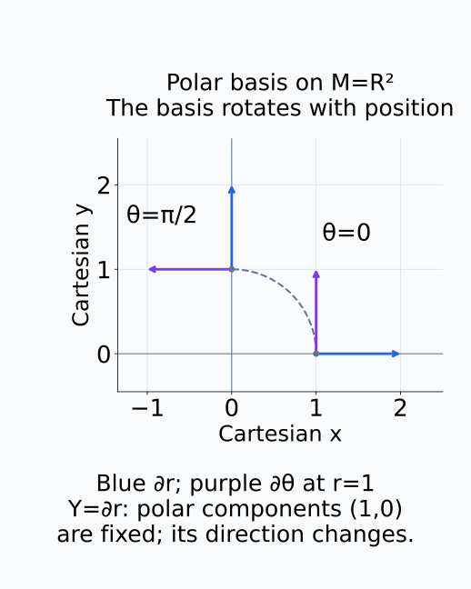
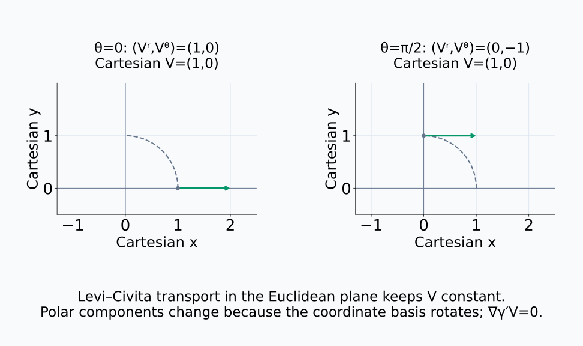
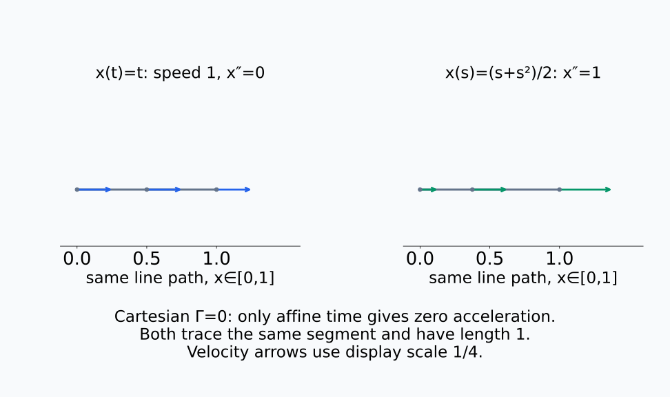
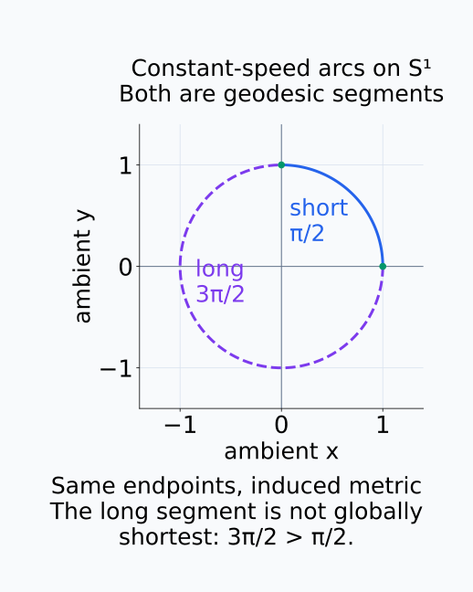
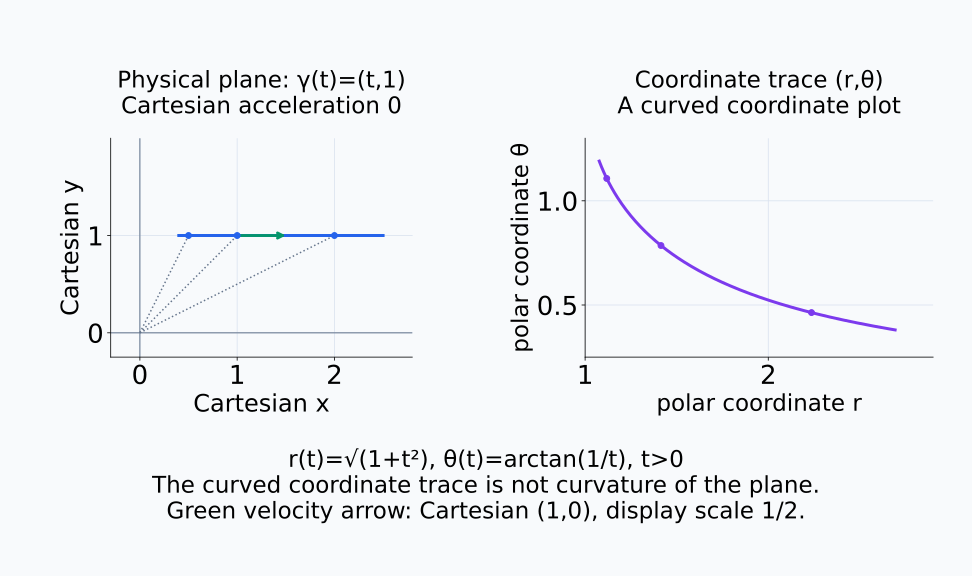
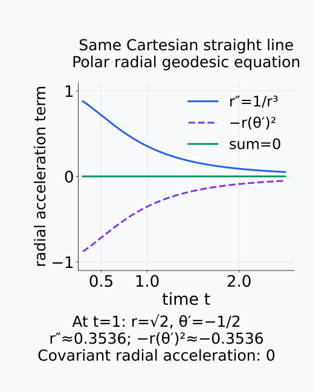

# A09-GEO-05. geodesic과 connection

## 이 단원이 필요한 이유

서로 다른 점의 tangent vector는 서로 다른 vector space에 속하므로 그대로 뺄 수 없다. connection은 vector를 manifold를 따라 비교하는 규칙을 주고, geodesic은 그 규칙에서 방향이 스스로 변하지 않는 curve이다.

## 학습 목표

- connection이 필요한 이유를 설명할 수 있다.
- covariant derivative와 parallel transport의 역할을 구분할 수 있다.
- geodesic equation의 항을 읽을 수 있다.
- 좌표의 직선과 geodesic을 구분할 수 있다.

## 선수지식 확인

- 선수 단원: [A09-GEO-03 metric과 길이](A09-GEO-03-metric-length.md), [A09-GEO-04 pullback metric과 Jacobian](A09-GEO-04-pullback-metric.md)
- 확인 질문: 서로 다른 점의 tangent vector가 같은 vector space에 속한다고 가정하면 무엇을 놓치는가?

## 기호와 용어

| 기호·용어 | Common spoken reading | 의미 | shape·범위 |
|---|---|---|---|
| $\nabla_XY$ | `the covariant derivative of Y along X` | $X$ 방향에서 $Y$의 변화 | vector field |
| $\Gamma^k_{ij}$ | `Gamma k i j` | 좌표 connection coefficient | scalar field |
| $\nabla_{\dot\gamma}\dot\gamma$ | `the covariant acceleration along gamma` | curve의 intrinsic acceleration | tangent vector |
| $\gamma$ | `gamma` | manifold 위의 curve | $[a,b]\to M$ |

## 핵심 개념

### 다른 점의 vector를 미분하는 규칙

vector field $Y$는 각 점 $p$에 $Y(p)\in T_pM$을 배정한다. 곡선을 따라 $Y$가 어떻게 변하는지 보려 해도 서로 다른 점의 vector는 서로 다른 tangent space에 속한다. 좌표 성분만 미분하면 그 성분을 표현한 basis의 변화가 빠진다. connection $\nabla$는 이 변화를 함께 처리하여, $X$ 방향에서 $Y$의 변화를 현재 점의 tangent vector로 나타내는 규칙이다.

coordinate basis에서는

$$
(\nabla_XY)^k
=\sum_{i=1}^d X^i\partial_iY^k
+\sum_{i=1}^d\sum_{j=1}^d\Gamma^k_{ij}X^iY^j
$$

로 쓴다. $k$는 계산할 출력 성분이고 $i,j$는 합할 좌표 성분의 번호다. $\partial_iY^k$는 $i$번째 좌표를 바꿀 때 $Y$의 $k$번째 성분이 변하는 비율이다. 첫 항은 이 성분의 변화를 $X$의 속도로 합한다. 둘째 항은 $j$번째 basis를 $i$번째 방향으로 바꿀 때 생기는 변화를 $k$번째 basis로 표현한 계수 $\Gamma^k_{ij}$로 보정한다.

Riemannian metric에는 metric과 양립하고 torsion이 없는 Levi–Civita connection이 하나 존재한다. metric과 양립한다는 조건은 두 vector의 내적을 미분할 때 각 vector의 covariant derivative로 곱의 미분법을 적용할 수 있다는 뜻이다. torsion-free 조건은 좌표 basis에서 $\Gamma^k_{ij}=\Gamma^k_{ji}$로 나타난다. 이 단원의 길이와 geodesic에 관한 설명은 이 Levi–Civita connection을 사용한다.

아래 그림의 두 위치에서 파란 basis와 보라 basis의 방향을 비교한다.

<figure class="lesson-figure" markdown="1">

<figcaption>여기서 manifold는 평면 R²이며 점선 원호는 그 위의 경로다. r=1에서 ∂r와 ∂θ의 방향은 위치에 따라 바뀐다. Y=∂r의 polar 성분은 (1,0)으로 같아도 평면에서 보이는 vector의 방향은 다르다.</figcaption>
</figure>

### 변화율과 parallel transport

covariant derivative는 지정한 vector가 곡선을 따라 얼마나 변하는지 계산한다. parallel transport는 반대로, 시작 vector를 주고 covariant derivative가 0이 되도록 곡선을 따라 vector를 이어 가는 과정이다. 곡선 위 vector를 $V(t)$라 쓰면 조건은 $\nabla_{\dot\gamma}V=0$이다. component가 같은 숫자를 유지해야 한다는 조건은 아니다. basis가 변하면 component도 바뀌어야 같은 규칙에서 변화율이 0이 된다.

Levi–Civita parallel transport는 vector의 metric 길이와 함께 옮긴 vector들 사이의 내적을 보존한다. 하지만 끝점 두 개만으로 비교 규칙이 끝나는 것은 아니다. 일반적으로 어느 경로를 따라 옮겼는지도 중요하며, 이 경로 의존성을 GEO-06의 curvature와 연결한다.

아래 그림에서는 같은 transport를 Cartesian vector와 polar 성분으로 각각 읽는다.

<figure class="lesson-figure lesson-figure--wide" markdown="1">

<figcaption>평면의 Levi–Civita transport로 옮긴 녹색 vector는 Cartesian 표현에서 계속 (1,0)이다. 그러나 회전하는 polar basis에서는 성분이 (1,0)에서 (0,−1)로 바뀐다. 성분의 변화와 covariant derivative가 0이라는 조건은 모순되지 않는다.</figcaption>
</figure>

### curve 자신의 속도를 비교한다

geodesic은

$$
\nabla_{\dot\gamma}\dot\gamma=0,
\qquad
\ddot\gamma^k
+\sum_{i=1}^d\sum_{j=1}^d
\Gamma^k_{ij}\dot\gamma^i\dot\gamma^j=0
$$

을 만족한다. 자신의 속도를 곡선을 따라 parallel transport하는 조건이다. 좌표 속도 성분의 미분이 $\ddot\gamma^k$이고, 그 속도를 표현한 basis의 변화가 뒤의 합이다. $\Gamma^k_{ij}$는 현재 위치 $\gamma(t)$에서 계산하며 각 $k=1,\ldots,d$에 이 식을 적용한다. 좌표 가속도가 0이 아니어도 두 항이 상쇄되면 covariant acceleration은 0이다.

0이 아닌 속도로 움직이는 geodesic은 일정한 metric 속도로 매개화되어 있으며, 끝점을 고정한 길이 변화에 대해 stationary하다. 충분히 짧은 구간은 두 점 사이의 최단 경로이지만 긴 구간까지 전역 최단이라는 보장은 없다. 길이는 GEO-03의 재매개화 아래에서 유지되지만 이 가속도 0의 식에는 매개화 조건도 들어간다. 같은 경로를 시간에 따라 빨라지고 느려지게 바꾸면 geodesic 경로를 따라가더라도 그 매개화가 위 식을 만족하지 않을 수 있다.

아래 두 장면에서 같은 경로와 같은 매개화를 구분한다.

<figure class="lesson-figure lesson-figure--wide" markdown="1">

<figcaption>x(t)=t와 x(s)=(s+s²)/2는 모두 [0,1]의 선분을 따라가며 길이는 1이다. 하지만 오른쪽은 시간이 지날수록 속도가 커져 Cartesian 가속도가 1이다. 속도 화살표는 실제 vector의 1/4 배율로 표시했다.</figcaption>
</figure>

아래 원 위의 두 경로는 같은 끝점을 연결하지만 길이가 다르다.

<figure class="lesson-figure" markdown="1">

<figcaption>원 S¹의 유도 metric에서 일정한 속도의 두 원호는 geodesic segment다. 파란 짧은 원호의 길이는 π/2이고 보라 긴 원호의 길이는 3π/2이다. 긴 원호의 각 작은 구간이 국소 최단이어도 전체가 같은 두 끝점 사이의 최단 경로는 아니다.</figcaption>
</figure>

## 작은 예제

Euclidean plane의 Cartesian coordinate에서는 $\Gamma^k_{ij}=0$이므로 geodesic equation은 $\ddot\gamma=0$이다. 해는 일정한 속도의 직선이다. polar coordinate에서는 같은 직선에 nonzero coordinate acceleration이 나타날 수 있다.

$\gamma(t)=(t,1)$을 $t>0$에서 polar coordinate로 쓰면 $r(t)=\sqrt{t^2+1}$, $\theta(t)=\arctan(1/t)$다. $r''=1/r^3$이므로 radial coordinate acceleration은 0이 아니다. 하지만 polar coordinate의 radial geodesic 식은 $r''-r(\theta')^2=0$이며, $\theta'=-1/r^2$를 넣으면 $1/r^3-r/r^4=0$이 된다. Cartesian 직선의 같은 움직임을 다른 좌표로 표현했을 뿐, nonzero coordinate acceleration 때문에 평면이 휘어진 것은 아니다.

아래 그림에서 물리적 평면의 경로와 polar 좌표값의 그래프를 따로 읽는다.

<figure class="lesson-figure lesson-figure--wide" markdown="1">

<figcaption>왼쪽의 γ(t)=(t,1)은 평면의 직선이다. 오른쪽은 같은 점들의 좌표값 (r,θ)을 그린 것으로 곡선처럼 보인다. 표시된 녹색 속도 vector의 Cartesian 값은 (1,0)이며 그림에서는 1/2 배율로 줄였다. 좌표값 그래프의 휘어짐은 평면의 intrinsic curvature를 뜻하지 않는다.</figcaption>
</figure>

아래 그래프의 두 항을 합하면 coordinate acceleration과 covariant acceleration의 차이를 확인할 수 있다.

<figure class="lesson-figure" markdown="1">

<figcaption>같은 직선에서 파란 radial coordinate acceleration r″=1/r³과 보라 connection 항 −r(θ′)²가 상쇄된다. t=1에서는 약 0.3536과 −0.3536이며, 녹색 합은 0이다. radial 좌표 성분의 가속도만 보아서는 geodesic 여부를 판단할 수 없다.</figcaption>
</figure>

## 흔한 오해

- 모든 geodesic이 전역 최단 경로는 아니다.
- Christoffel symbol은 tensor가 아니며 coordinate를 바꾸면 0이 되거나 생길 수 있다.

## 연습문제

### 1. Euclidean geodesic
$\gamma(t)=p+tv$가 Cartesian Euclidean space에서 geodesic인지 확인하라.

해설 보기

$\ddot\gamma=0$이고 connection coefficient도 0이므로 geodesic equation을 만족한다.

### 2. 비교 규칙
서로 다른 두 점의 tangent vector를 비교하려면 어떤 추가 구조가 필요한가?

해설 보기

connection 또는 그것이 정하는 parallel transport 규칙이 필요하다.

### 3. coordinate effect
polar coordinate에서 직선의 coordinate acceleration이 0이 아닐 수 있는 이유는 무엇인가?

해설 보기

coordinate basis가 위치에 따라 변하며 Christoffel term이 그 변화를 보정하기 때문이다.

### 4. 표현 경로
activation interpolation을 geodesic이라고 부르기 전에 확인할 조건을 두 가지 쓰라.

해설 보기

사용한 manifold와 metric을 명시하고, 그 interpolation이 해당 metric의 geodesic equation이나 길이 최소 조건을 만족하는지 확인해야 한다.

## 근거와 갱신 경계

connection·parallel transport·geodesic 정의는 Riemannian geometry의 표준 정의를 따른다. Danny Calegari의 [*Notes on Riemannian Geometry*, §§3.2–4.2](https://math.uchicago.edu/~dannyc/courses/riem_geo_2013/riem_geo_notes.pdf)에서 해당 정의와 Levi–Civita 조건을 확인할 수 있다. geodesic completeness와 exponential map의 전역 성질은 다루지 않는다.

## 단원 요약

- connection은 서로 다른 tangent space의 vector를 비교하게 한다.
- Christoffel term은 coordinate basis의 변화를 보정한다.
- geodesic은 covariant acceleration이 0인 curve이다.
- 좌표 직선과 intrinsic geodesic은 구분해야 한다.

## 통과 기준

- geodesic equation의 두 항을 설명할 수 있는가?
- activation interpolation을 geodesic이라 부르기 위한 조건을 말할 수 있는가?

## 다음 단원

- [A09-GEO-06 intrinsic·extrinsic curvature](A09-GEO-06-intrinsic-extrinsic-curvature.md)

## 집필자 점검표

- [x] connection과 geodesic의 역할을 구분했다.
- [x] 문제 4개에 해설이 있다.
- [x] Common spoken reading이 실제 영어 학술 발화이며 한글 음역이나 기계적 직역을 포함하지 않는다.
- [x] 선수지식과 링크를 확인했다.
