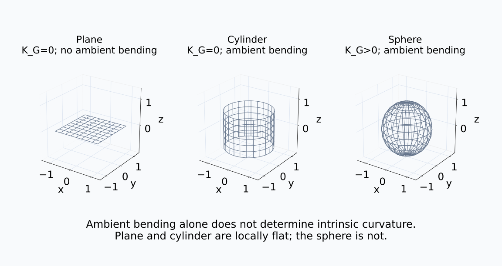
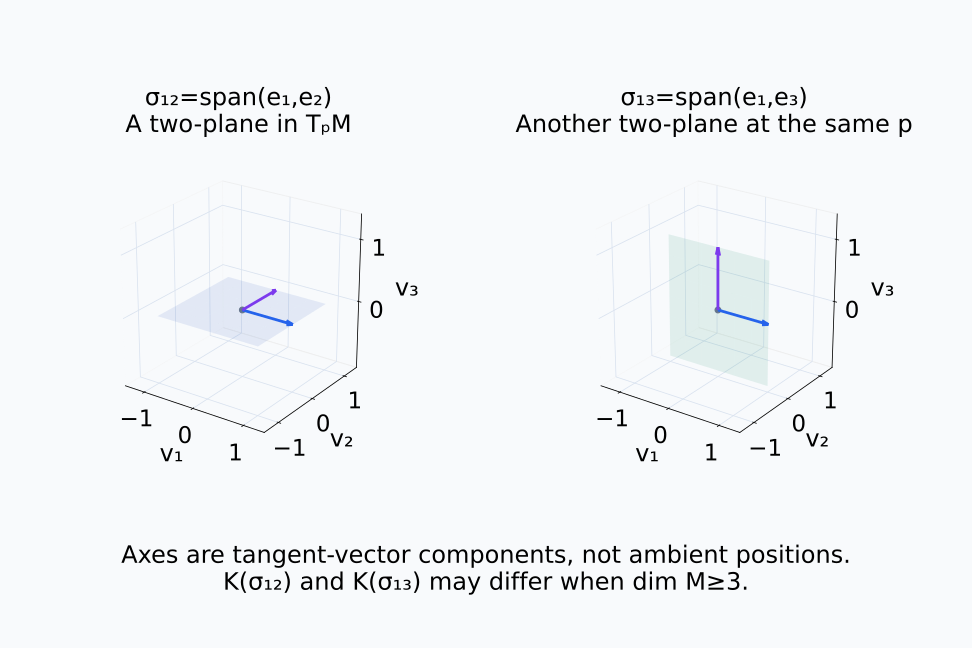
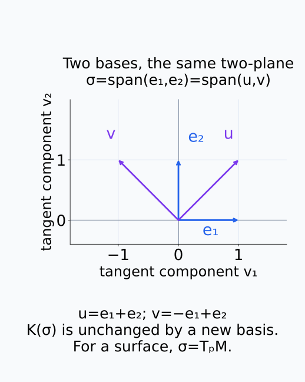
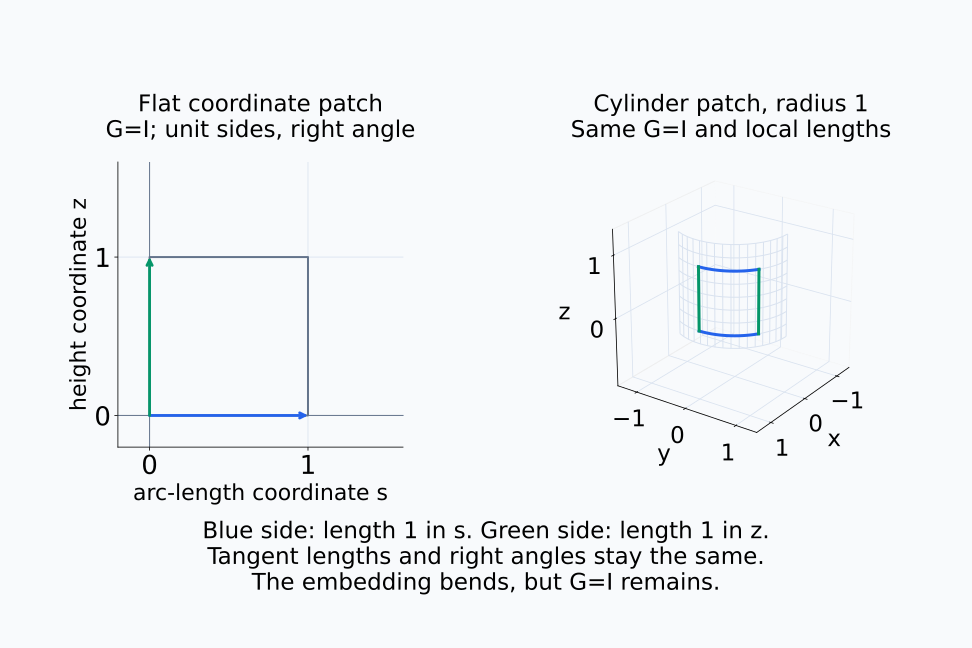
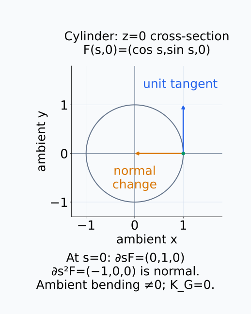
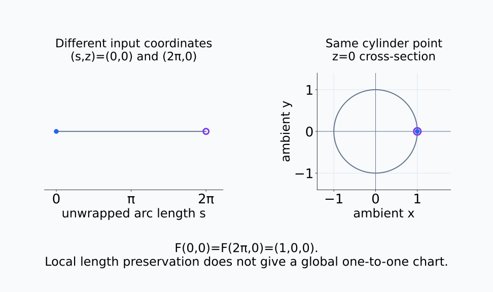
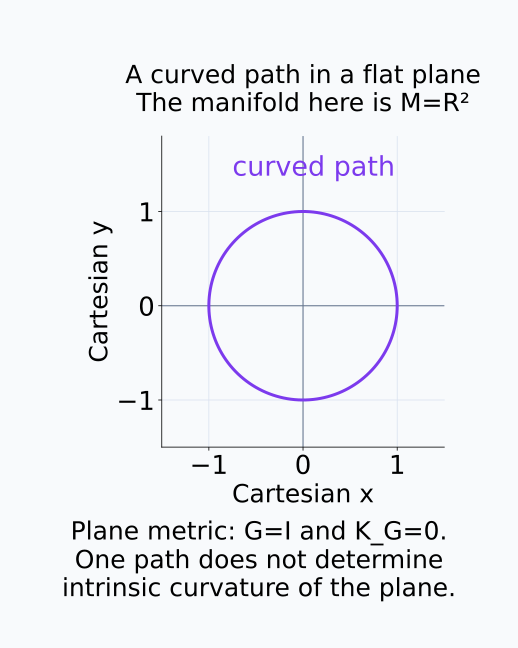
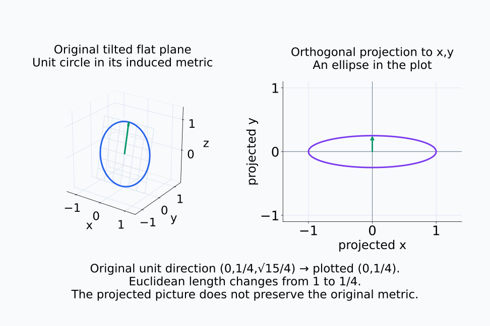

# A09-GEO-06. intrinsic·extrinsic curvature

## 이 단원이 필요한 이유

representation이 고차원 공간에서 굽어 보인다는 관찰은 두 종류의 curvature를 섞기 쉽다. intrinsic curvature는 manifold 내부의 metric만으로 측정하고, extrinsic curvature는 ambient space 안에 어떻게 놓였는지를 측정한다.

## 학습 목표

- intrinsic curvature와 extrinsic curvature를 구분할 수 있다.
- plane과 cylinder의 예로 차이를 설명할 수 있다.
- sectional curvature가 보는 대상을 말할 수 있다.
- embedding의 시각적 굽음을 intrinsic geometry로 단정하지 않을 수 있다.

## 선수지식 확인

- 선수 단원: [A09-GEO-05 geodesic과 connection](A09-GEO-05-geodesic-connection.md)
- 확인 질문: 좌표선이 휘어 보인다는 사실만으로 metric의 curvature를 알 수 있는가?

## 기호와 용어

| 기호·용어 | Common spoken reading | 의미 | shape·범위 |
|---|---|---|---|
| $R(X,Y)Z$ | `R of X comma Y applied to Z` | Riemann curvature operator | tangent vector |
| $K(\sigma)$ | `the sectional curvature of sigma` | tangent two-plane $\sigma$의 curvature | scalar |
| $\mathrm{II}(u,v)$ | `the second fundamental form of u comma v` | ambient normal 방향 굽음 | normal vector |
| $K_G$ | `Gaussian curvature` | surface의 intrinsic curvature | scalar |

## 핵심 개념

Riemann curvature는 covariant derivative의 순서가 일반적으로 교환되지 않는 정도를 잰다.

$$
R(X,Y)Z=\nabla_X\nabla_YZ-\nabla_Y\nabla_XZ-\nabla_{[X,Y]}Z.
$$

첫 두 항은 $Z$를 두 방향으로 covariant derivative할 때 순서를 바꾼 차이다. 그러나 방향장 $X,Y$ 자체도 위치에 따라 바뀔 수 있다. $[X,Y]$는 scalar 함수 $f$에 대해 $[X,Y]f=X(Yf)-Y(Xf)$로 정하는 방향장이다. 여기서 $X(Yf)$는 $Y$ 방향미분으로 얻은 scalar 함수를 다시 $X$ 방향으로 미분한다는 뜻이다. 마지막 항은 이 방향장 변화에서 오는 차이를 빼므로, vector field의 미분 순서 차이 중 connection의 curvature를 남긴다. 좌표 basis 방향들은 서로 교환되어 $[X,Y]=0$이지만, curved 공간에서는 앞의 두 covariant derivative가 여전히 교환되지 않을 수 있다.

### 내부 metric과 ambient 굽음

intrinsic curvature는 지정한 metric과 그 Levi–Civita connection으로 계산한다. 다른 공간에 어떻게 그려 넣었는지 몰라도 정의할 수 있다. 반면 second fundamental form은 tangent vector를 표면을 따라 바깥 공간에서 미분한 뒤, 현재 tangent space에 수직인 성분을 남긴다. 표면 내부의 변화와 바깥 공간 쪽으로 꺾이는 변화를 분리하는 것이다. 이는 선택한 ambient embedding과 그 metric에 의존한다.

아래 세 표면에서 ambient 모양과 Gaussian curvature를 따로 비교한다.

<figure class="lesson-figure lesson-figure--wide" markdown="1">

<figcaption>평면과 cylinder는 내부 metric에서 모두 Gaussian curvature가 0이다. cylinder와 sphere는 모두 ambient 공간에서 굽어 보이지만 sphere의 Gaussian curvature는 양수다. 바깥에서 보이는 굽음만으로 내부 curvature를 분류할 수 없다.</figcaption>
</figure>

### sectional curvature가 붙는 대상

sectional curvature는 한 점의 tangent two-plane마다 intrinsic curvature를 준다. 여기서 two-plane은 tangent space 안의 2차원 선형 부분공간이며, 그 점에서 선형 독립인 두 vector가 만드는 span이다. ambient 공간에 그린 임의의 평면이나 manifold 위의 작은 평면 조각을 뜻하지 않는다. 같은 two-plane의 basis를 바꿔도 $K(\sigma)$는 같고, 차원이 3 이상이면 같은 점에서 고른 two-plane에 따라 값이 달라질 수 있다. 2차원 surface에서는 tangent space 자체가 유일한 two-plane이며 그 sectional curvature가 Gaussian curvature다.

아래 그림의 축은 manifold의 점 좌표가 아니라 한 점에서의 tangent vector 성분이다.

<figure class="lesson-figure lesson-figure--wide" markdown="1">

<figcaption>같은 점 p의 3차원 tangent space에서 σ₁₂=span(e₁,e₂)와 σ₁₃=span(e₁,e₃)는 서로 다른 two-plane이다. 이 그림은 ambient 표면 조각이 아니라 vector space 안의 선형 부분공간을 표시한다. 두 sectional curvature 값이 같아야 한다는 보장은 없다.</figcaption>
</figure>

아래에서는 plane 자체를 바꾸는 대신 같은 plane의 basis만 바꾼다.

<figure class="lesson-figure" markdown="1">

<figcaption>파란 basis와 보라 basis는 같은 σ를 생성하므로 K(σ)는 같다. manifold가 surface이면 TₚM 자체가 2차원이어서 이런 two-plane은 하나뿐이며, 그 값이 Gaussian curvature다.</figcaption>
</figure>

plane과 cylinder의 표면은 국소적으로 길이를 보존하며 펼칠 수 있으므로 둘 다 Gaussian curvature가 0이다. 그러나 cylinder는 3차원 ambient space에서 extrinsically curved이다. sphere는 Gaussian curvature가 양수이므로 plane에 distortion 없이 펼칠 수 없다.

## 작은 예제

종이를 말아 cylinder로 만들 때 종이 위 짧은 선분의 길이와 각도는 바뀌지 않는다. embedding은 굽었지만 intrinsic metric은 평평하게 유지된다.

반지름 $r>0$인 cylinder의 작은 영역을 $F(s,z)=(r\cos(s/r),r\sin(s/r),z)$로 표시하자. $s$는 둘레를 따른 길이, $z$는 높이다. 두 좌표 방향의 출력 속도는

$$
\partial_sF=(-\sin(s/r),\cos(s/r),0),
\qquad
\partial_zF=(0,0,1)
$$

이다. 두 vector는 길이 1이고 서로 수직이므로 GEO-04의 $J_F^\top J_F$는 identity다. 펼친 평면의 좌표 $(s,z)$와 같은 metric을 갖는 이유다. 하지만 $s$로 한 번 더 미분하면 $\partial_s^2F=(-\cos(s/r)/r,-\sin(s/r)/r,0)$이라는 0이 아닌 normal vector를 얻는다. 따라서 intrinsic metric은 평평해도 ambient embedding은 굽을 수 있다.

이 대응은 국소적이다. cylinder의 둘레 전체를 돌면 원래 점으로 돌아오는 주기성이 있으므로 cylinder와 평면이 전역적으로 같은 공간이라는 결론은 아니다.

아래 펼친 좌표 patch와 cylinder patch의 대응하는 변을 비교한다.

<figure class="lesson-figure lesson-figure--wide" markdown="1">

<figcaption>반지름 1인 cylinder에서 s는 둘레를 따른 길이이고 z는 높이다. 파란 변과 녹색 변은 펼치기 전후에 각각 길이 1이며 서로 직각이다. 3차원에서 경계가 굽어 보여도 이 좌표의 metric은 G=I다.</figcaption>
</figure>

아래 단면에서 단위 접선의 변화가 어느 방향으로 나가는지 확인한다.

<figure class="lesson-figure" markdown="1">

<figcaption>z=0 단면의 s=0에서 파란 ∂sF=(0,1,0)는 단위 접선이다. 주황 ∂s²F=(−1,0,0)는 cylinder의 normal 방향이므로 ambient 굽음은 0이 아니다. 이것은 내부 Gaussian curvature가 0인 사실과 양립한다.</figcaption>
</figure>

아래에서 서로 다른 입력 좌표가 cylinder의 같은 점으로 돌아오는 것도 확인한다.

<figure class="lesson-figure lesson-figure--wide" markdown="1">

<figcaption>둘레를 한 바퀴 돌면 F(0,0)=F(2π,0)=(1,0,0)이다. 파란 점과 보라 테두리 점은 입력 좌표에서 떨어져 있지만 출력에서는 겹친다. 국소 길이 보존은 전역적인 일대일 대응을 뜻하지 않는다.</figcaption>
</figure>

### 경로의 굽음과 공간의 curvature

공간 안의 한 경로가 휘는 것과 그 공간의 intrinsic curvature는 구분한다. 평면 위에 그린 원형 경로는 휘지만 평면의 intrinsic curvature는 0이다. activation trajectory 하나의 모양도 manifold 전체의 curvature를 직접 정하지 않는다. 여기에 2차원 projection까지 적용하면 길이와 각도도 달라질 수 있으므로, 그림의 굽음을 원래 공간의 metric curvature로 읽을 수 없다.

아래 원은 manifold 전체가 아니라 평면 위의 한 경로다.

<figure class="lesson-figure" markdown="1">

<figcaption>보라 원형 경로는 휘지만 여기서 manifold는 평면 R²이다. 평면의 Euclidean metric은 G=I이고 Gaussian curvature는 0이다. 한 경로의 모양과 공간의 curvature는 서로 다른 대상에 대한 정보다.</figcaption>
</figure>

아래 projection의 같은 녹색 방향을 보면 그림이 원래 길이를 보존하지 않는다는 것을 알 수 있다.

<figure class="lesson-figure lesson-figure--wide" markdown="1">

<figcaption>왼쪽의 기울어진 평면은 내부적으로 flat하며 파란 원은 그 유도 metric의 단위 원이다. x,y projection 뒤에는 보라 타원이 되고 단위 방향 (0,1/4,√15/4)의 표시 길이는 1/4로 줄어든다. 원래 metric을 확인하지 않고 projection의 모양이나 거리를 곧바로 기하 추정치로 사용할 수 없다.</figcaption>
</figure>

## 흔한 오해

- 2차원 projection이 휘어 보인다는 사실은 원래 representation manifold의 curvature 추정치가 아니다.
- nonlinear map의 image가 반드시 nonzero intrinsic curvature를 갖는 것은 아니다.

## 연습문제

### 1. cylinder
cylinder의 Gaussian curvature와 extrinsic bending을 각각 설명하라.

해설 보기

Gaussian curvature는 0이지만 ambient 3차원 공간에서는 normal 방향으로 굽어 있다.

### 2. sphere
sphere를 plane에 길이 보존으로 펼칠 수 없는 이유를 curvature로 설명하라.

해설 보기

sphere는 양의 intrinsic Gaussian curvature를 갖고 plane은 0이므로 local isometry로 전체를 펼칠 수 없다.

### 3. 좌표선
flat plane에 polar coordinate를 쓰면 coordinate line이 휘어진다. intrinsic curvature도 생기는가?

해설 보기

생기지 않는다. coordinate 표현은 바뀌지만 plane의 intrinsic curvature는 0이다.

### 4. 모델 해석
PCA plot에서 class trajectory가 굽어 보일 때 curvature 주장에 필요한 추가 검증을 두 가지 쓰라.

해설 보기

projection distortion을 통제하고, 원래 공간에서 정의한 metric과 neighborhood에 따른 curvature estimator의 안정성을 확인해야 한다.

## 근거와 갱신 경계

Riemann tensor·sectional curvature·second fundamental form의 구분은 differential geometry의 표준 정의를 따른다. Danny Calegari의 [*Notes on Riemannian Geometry*, §§3.4, 5.1, 5.3](https://math.uchicago.edu/~dannyc/courses/riem_geo_2013/riem_geo_notes.pdf)에서 정의를 확인할 수 있다. Gauss equation과 curvature tensor의 성분 계산은 범위 밖이다.

## 단원 요약

- intrinsic curvature는 manifold 내부의 metric으로 정한다.
- extrinsic curvature는 ambient embedding에 의존한다.
- cylinder는 intrinsic하게 flat이지만 extrinsically curved이다.
- representation plot의 굽음을 curvature로 바로 해석하면 안 된다.

## 통과 기준

- plane·cylinder·sphere의 curvature 차이를 설명할 수 있는가?
- 시각적 굽음에서 intrinsic 주장으로 넘어갈 때 필요한 검증을 말할 수 있는가?

## 다음 단원

- [A09-GEO-07 activation manifold 분석의 함정](A09-GEO-07-activation-manifold-pitfalls.md)

## 집필자 점검표

- [x] intrinsic·extrinsic curvature를 구분했다.
- [x] 문제 4개에 해설이 있다.
- [x] Common spoken reading이 실제 영어 학술 발화이며 한글 음역이나 기계적 직역을 포함하지 않는다.
- [x] 선수지식과 링크를 확인했다.
