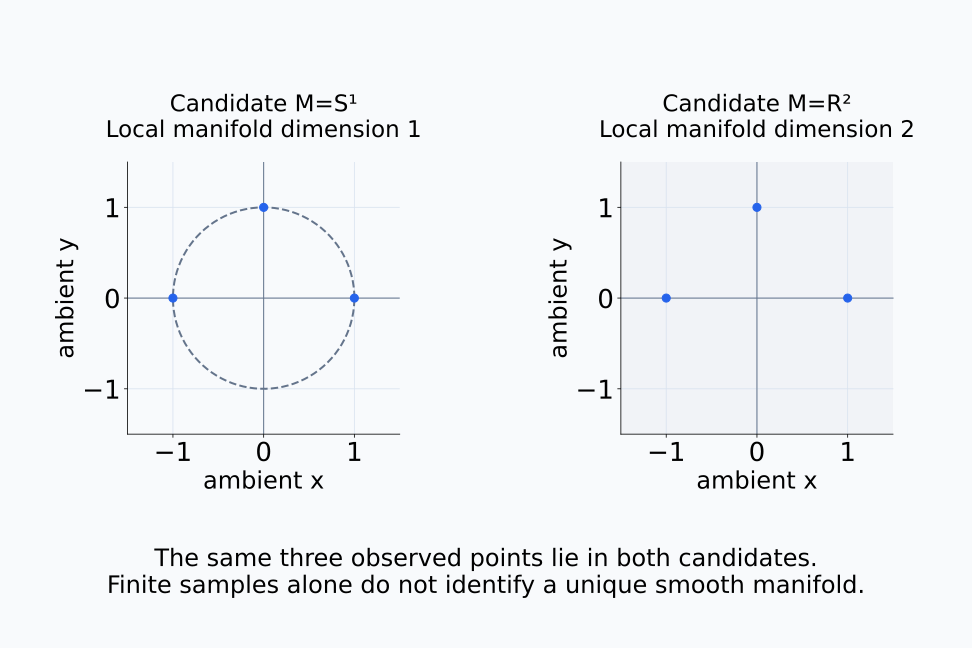
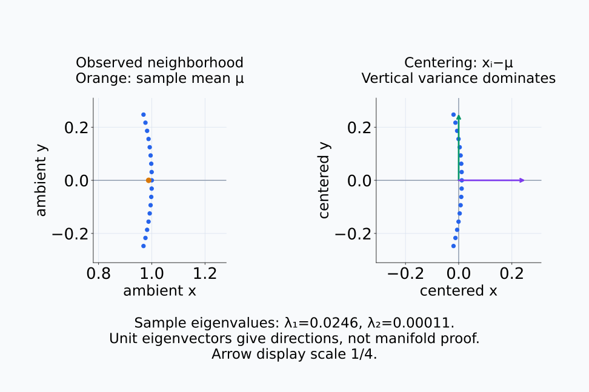
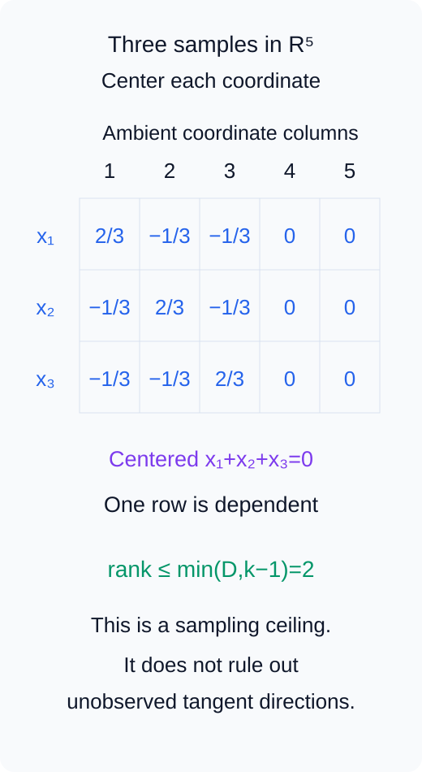
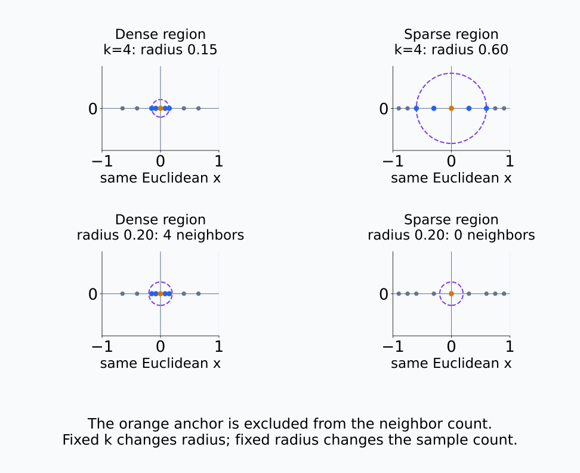
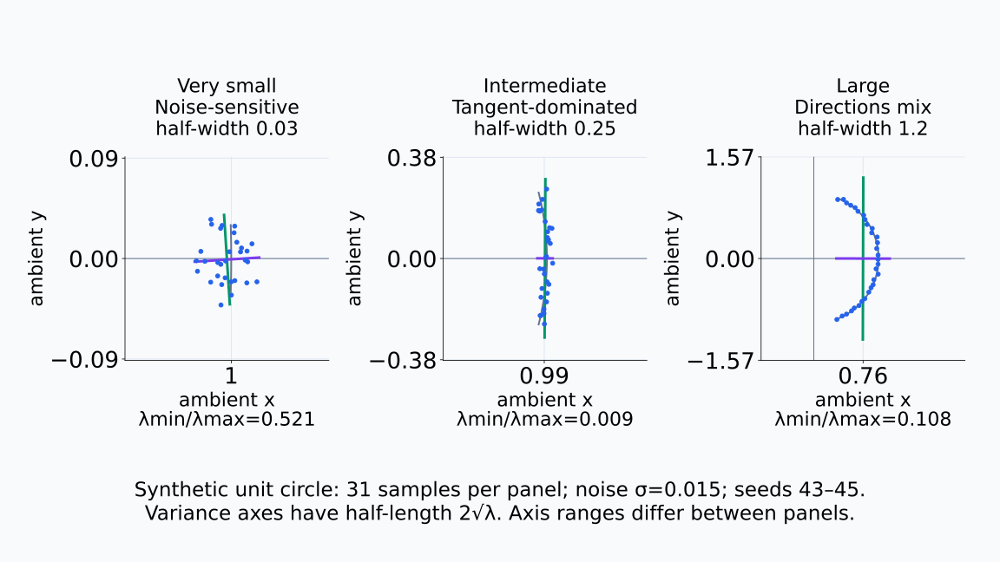
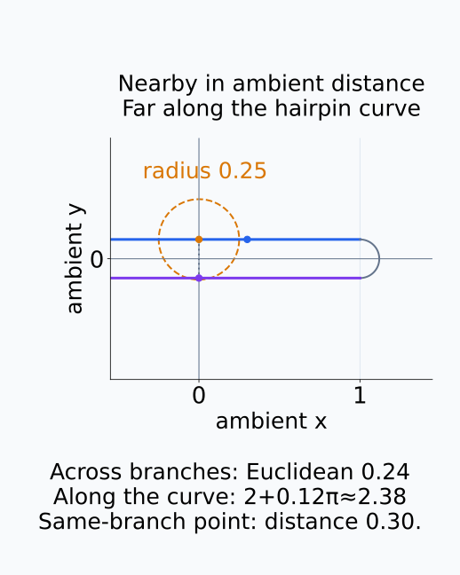
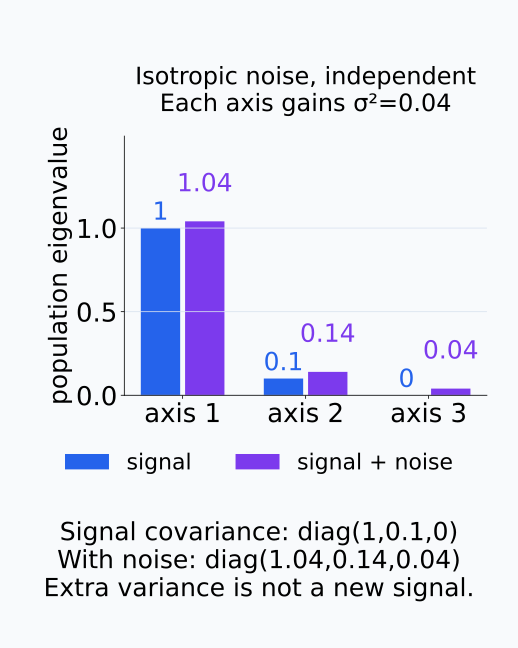
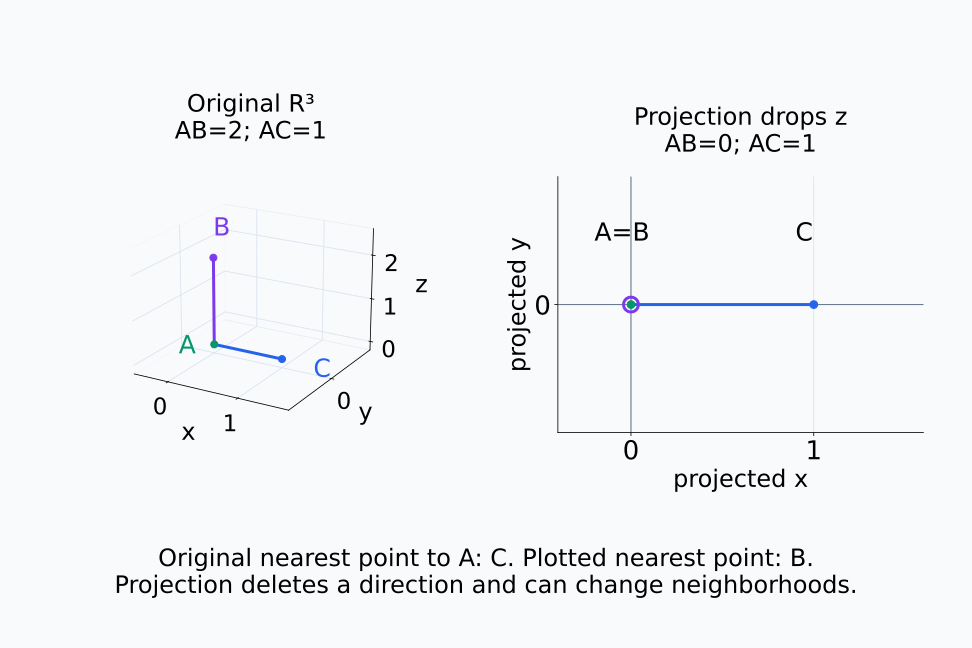
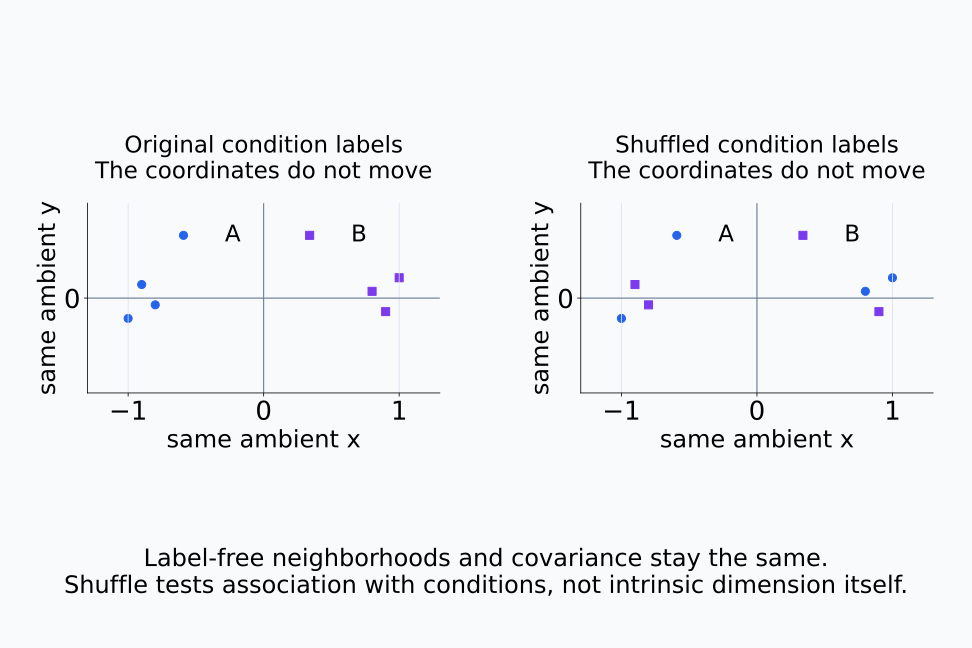
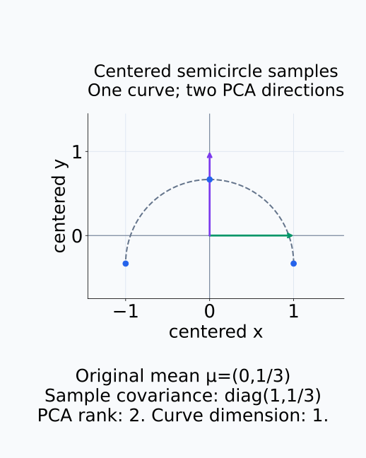

# A09-GEO-07. activation manifold 분석의 함정

## 이 단원이 필요한 이유

유한한 activation sample이 낮은 차원 manifold 근처에 있다는 가정은 유용하지만 자동으로 참이 되지 않는다. neighborhood·metric·noise·estimator를 바꾸면 dimension과 curvature 추정치가 크게 달라질 수 있으므로 분석 계약과 null control이 필요하다.

## 학습 목표

- manifold hypothesis와 관측 데이터의 차이를 설명할 수 있다.
- neighborhood scale이 기하 추정에 미치는 영향을 설명할 수 있다.
- projection artifact와 ambient noise를 진단할 수 있다.
- activation geometry 주장에 필요한 control을 설계할 수 있다.

## 선수지식 확인

- 선수 단원: [A09-GEO-01 manifold와 local coordinate](A09-GEO-01-manifold-local-coordinate.md), [A09-GEO-06 intrinsic·extrinsic curvature](A09-GEO-06-intrinsic-extrinsic-curvature.md), [I06-08 CCA, CKA와 RSA](../../part-3-interpretability/I06/I06-08-cca-cka-rsa.md)
- 확인 질문: finite point cloud 자체가 smooth manifold라는 결론을 보장하는가?

## 기호와 용어

| 기호·용어 | Common spoken reading | 의미 | shape·범위 |
|---|---|---|---|
| $\mathcal{N}_k(x)$ | `the k nearest neighborhood of x` | $x$의 국소 표본 | finite set |
| $\hat d(x)$ | `d hat of x` | 추정한 local dimension | nonnegative scalar |
| $\varepsilon$ | `epsilon` | neighborhood radius 또는 noise scale | positive scalar |
| $P_r$ | `P sub r` | rank-$r$ projection | linear map |

## 핵심 개념

activation sample $x_1,\ldots,x_n\in\mathbb R^D$에서 local PCA를 쓰면 $x$ 주변 covariance의 leading eigenspace를 tangent space의 근사로 삼는다. 그러나 너무 작은 neighborhood는 sample 부족과 noise에 민감하고, 너무 큰 neighborhood는 curvature와 서로 다른 branch를 한 평면에 섞는다.

아래의 같은 세 점은 차원이 다른 두 후보 공간에 모두 들어간다.

<figure class="lesson-figure lesson-figure--wide" markdown="1">

<figcaption>세 관측점은 원 S¹에도 평면 R²에도 속한다. 점선 원과 평면은 서로 다른 후보 공간이며 파란 표본은 동일하다. 유한한 점들의 배치만으로 그 점들을 생성한 smooth manifold와 차원을 유일하게 정할 수 없다.</figcaption>
</figure>

### local PCA에서 실제로 계산하는 것

$\mathcal N_k(x)$의 표본을 이웃의 평균으로 centering한 뒤 covariance를 계산한다. 단위 eigenvector는 변동을 재는 축이며 eigenvalue는 그 축에서의 분산이다. leading eigenspace는 선택한 큰 eigenvalue들의 방향을 모은 부분공간이다. 매끄러운 공간의 작은 영역에서는 tangent 방향의 변화가 먼저 나타나므로 이를 tangent의 근사로 사용할 수 있다. noise가 낮고 이웃 표본이 그 방향들을 충분히 포함한다는 조건이 필요하다. 표본의 주된 변동 방향을 구한 계산 자체가 smooth manifold의 존재를 증명하지는 않는다.

$k$개 표본을 centering한 데이터 행렬의 rank는 최대 $\min(D,k-1)$이다. centering 뒤 행들의 합이 0이라는 선형 관계가 있기 때문이다. 따라서 $k=5$인 이웃에서 covariance의 nonzero eigenvalue가 최대 4개라는 사실은 높은 intrinsic dimension을 배제하는 증거가 아니다. 표본 수가 만든 한계일 수 있다. 추정 차원에는 eigenvalue cutoff나 누적 분산 기준도 들어가므로 단순한 covariance rank와 $\hat d(x)$를 구분한다.

아래 합성 원호 표본을 centering한 뒤 주된 분산 방향을 확인한다.

<figure class="lesson-figure lesson-figure--wide" markdown="1">

<figcaption>주황 표본 평균을 빼면 같은 원호 표본이 오른쪽처럼 원점 근처에 놓인다. 여기서는 수직 방향 분산이 수평 방향보다 크다. 녹색·보라 화살표는 unit eigenvector의 방향을 1/4 배율로 표시했으며, 화살표 길이 자체가 eigenvalue는 아니다.</figcaption>
</figure>

아래 행렬에서는 centering이 만드는 행의 선형 관계를 직접 읽는다.

<figure class="lesson-figure" markdown="1">

<figcaption>원래 R⁵의 첫 세 좌표축 unit vector를 표본으로 삼아 평균을 뺀 예다. 세 행의 합은 0이므로 rank는 최대 2다. 표본 수가 만든 이 상한을 관측하지 못한 tangent 방향이 없다는 증거로 바꿀 수 없다.</figcaption>
</figure>

### neighborhood를 줄이거나 늘릴 때

표본 수 $k$를 고정해도 밀도가 낮은 영역의 이웃은 더 넓게 퍼질 수 있다. 반대로 radius를 고정하면 영역별 표본 수가 달라진다. 따라서 $k$와 실제 이웃 거리 범위를 함께 기록한다.

원의 $(1,0)$ 근처에서 작은 각도 $t$에 대해 $\sin t\approx t$, $\cos t\approx1-t^2/2$다. 접선 쪽 좌표는 각도에 비례해 변하지만 normal 쪽 좌표는 각도의 제곱 크기로 변한다. 충분히 작은 영역에서는 tangent 변화가 우세하다. 영역을 넓히면 이 normal 변화와 점마다 돌아가는 tangent 방향도 covariance에 섞인다. 반대로 영역을 지나치게 줄이면 신호의 변화량 자체가 작아져 noise와 표본 오차에 묻힐 수 있다.

아래에서는 같은 k와 같은 radius가 각각 무엇을 고정하는지 비교한다.

<figure class="lesson-figure lesson-figure--wide" markdown="1">

<figcaption>주황 anchor를 제외하고 k=4를 고르면 조밀한 영역의 radius는 0.15, 성긴 영역은 0.60이다. 반대로 radius를 0.20으로 고정하면 이웃 수는 각각 4와 0이다. 같은 k라도 같은 공간적 범위를 보는 것은 아니다.</figcaption>
</figure>

아래 합성 원호의 세 scale은 noise와 curvature가 covariance에 섞이는 방식을 비교한다.

<figure class="lesson-figure lesson-figure--wide" markdown="1">

<figcaption>각 패널은 원 위의 합성 표본 31개와 좌표별 noise σ=0.015를 사용한다. 너무 작은 원호에서는 noise가 상대적으로 커지고, 중간 원호에서는 접선 방향 분산이 우세하며, 큰 원호에서는 회전하는 방향과 굽음이 함께 섞인다. 분산축 반길이는 2√λ이고 패널별 좌표축 범위는 다르다. 수치는 실제 모델 측정값이 아니다.</figcaption>
</figure>

주요 실패 원인은 다음과 같다.

- prompt distribution이 제한되어 관측하지 못한 방향이 있다.
- token position·layer·normalization을 섞어 서로 다른 population을 합친다.
- ambient noise가 작은 singular value를 부풀린다.
- self-intersection 근처에서 먼 manifold branch가 Euclidean nearest neighbor가 된다.
- PCA·UMAP 같은 projection의 시각적 구조를 원공간 구조로 해석한다.

아래 hairpin에서 원래 곡선을 따라 가까운 점과 ambient 거리로 가까운 점을 구분한다.

<figure class="lesson-figure" markdown="1">

<figcaption>주황 anchor의 radius 0.25 안에는 반대 branch의 보라 점이 들어오지만 같은 branch에서 0.30 떨어진 파란 점은 빠진다. 보라 점까지 곡선을 따라 가는 거리는 약 2.38이다. 실제 self-intersection이 없어도 branch가 가까우면 ambient nearest neighbor가 국소 곡선 이웃과 달라질 수 있다.</figcaption>
</figure>

### noise와 projection이 바꾸는 것

예를 들어 신호와 독립이고 평균 0인 isotropic noise가 각 ambient 좌표에 분산 $\sigma^2$를 더하면 population covariance는 신호 covariance에 $\sigma^2I$를 더한 값이다. 원래 작던 eigenvalue도 커지므로 이를 모두 의미 있는 tangent 방향으로 세면 차원을 과대평가할 수 있다. 실제 유한 표본의 covariance에는 이 population 관계 외에 추정 오차도 남는다.

PCA의 낮은 차원 직교 projection은 선택하지 않은 방향의 차이를 없앤다. 원공간에서 떨어진 점들이 projection 뒤 가까워질 수 있는 이유다. UMAP처럼 nonlinear하게 배치한 좌표에서는 그림의 두 점 사이 거리와 원래 metric의 거리가 같은 양이라는 보장도 없다. 그림의 분리를 확인하려면 같은 표본의 원래 metric에서 이웃이나 within·between distance를 다시 계산한다.

아래 population covariance 예에서 noise가 각 eigenvalue에 더하는 양을 확인한다.

<figure class="lesson-figure" markdown="1">

<figcaption>독립 isotropic noise의 분산이 0.04이면 signal covariance diag(1,0.1,0)에 0.04I가 더해진다. 세 번째 양의 eigenvalue 0.04는 이 예에서 noise 때문에 생긴 분산이며 새로운 signal 방향의 증거가 아니다. 실제 유한 표본에는 추가 추정 오차가 남는다.</figcaption>
</figure>

아래 세 점에서는 projection이 가까운 이웃의 순서를 바꾼다.

<figure class="lesson-figure lesson-figure--wide" markdown="1">

<figcaption>원공간에서 A=(0,0,0), B=(0,0,2), C=(1,0,0)이므로 A에 더 가까운 점은 C다. z 방향을 없앤 projection에서는 A와 B가 겹쳐 더 가까운 점이 B로 바뀐다. projection 뒤의 이웃 관계를 원공간의 이웃 관계로 대신할 수 없다.</figcaption>
</figure>

### control마다 답하는 질문

따라서 scale sweep, bootstrap, shuffled label, matched random subspace, repeated seed와 held-out prompt를 함께 사용한다. estimator가 안정적이라는 결과와 manifold가 실제 계산의 원인이라는 결과는 별개의 주장이다.

scale sweep은 이웃 범위에 대한 민감도를, bootstrap은 선택한 표집 단위의 변동을 확인한다. 같은 prompt의 여러 token이 종속돼 있다면 token을 모두 독립 재표집한 불확실성으로 prompt 일반화를 주장하지 않는다. Label shuffle은 조건 이름과 기하 구조의 대응을 검토한다. label을 쓰지 않는 local PCA의 dimension은 label만 섞어도 그대로이므로, shuffle 자체를 intrinsic dimension의 검증으로 삼을 수 없다. held-out prompt와 반복 seed는 관측한 구조가 다른 표본이나 학습 실행에도 유지되는지 묻는다.

아래 label shuffle에서는 표본의 좌표를 그대로 두고 condition만 바꾼다.

<figure class="lesson-figure lesson-figure--wide" markdown="1">

<figcaption>원형 A와 사각형 B의 배정은 바뀌지만 점의 좌표는 이동하지 않는다. label을 쓰지 않는 이웃과 전체 covariance는 그대로다. 이 control은 기하 측정값과 condition의 대응을 검토하며, intrinsic dimension 자체를 검증하지 않는다.</figcaption>
</figure>

## 작은 예제

원 위의 점을 아주 작은 neighborhood로 보면 local PCA dimension은 1에 가깝다. 반원을 한꺼번에 묶으면 두 principal direction이 필요해져 dimension을 2로 과대평가할 수 있다.

반원의 세 점 $(-1,0),(0,1),(1,0)$을 묶으면 평균은 $(0,1/3)$이고, 분모 2를 쓰는 표본 covariance는 $\operatorname{diag}(1,1/3)$이다. 두 eigenvalue가 모두 양수지만 원의 intrinsic dimension은 여전히 1이다. 서로 다른 국소 방향을 한꺼번에 설명하는 선형 부분공간의 차원과, 각 점 주변에서 필요한 manifold 좌표 수가 다르기 때문이다.

아래 centered 세 점의 두 PCA 방향과 원의 좌표 차원을 구분한다.

<figure class="lesson-figure" markdown="1">

<figcaption>본문의 세 점에서 평균 (0,1/3)을 뺀 결과다. 녹색·보라 unit eigenvector에 대응하는 eigenvalue는 각각 1과 1/3이어서 sample covariance rank는 2다. 그러나 표본을 생성한 원의 local coordinate는 여전히 하나다. 전 구간의 선형 분산 차원과 국소 manifold 차원은 같은 양이 아니다.</figcaption>
</figure>

## 흔한 오해

- 좋은 2차원 시각화는 low intrinsic dimension의 증거가 아니다.
- local dimension이 작다는 사실은 feature가 disentangled되었다는 뜻이 아니다.

## 연습문제

### 1. scale sweep
$k=5$에서 $\hat d=1$, $k=200$에서 $\hat d=8$이라면 어느 값을 정답으로 택해야 하는가?

해설 보기

하나를 임의로 택하면 안 된다. sample 안정성과 curvature bias가 균형을 이루는 scale 구간을 사전 기준과 bootstrap으로 평가해야 한다.

### 2. projection artifact
2차원 UMAP에서 두 cluster가 떨어져 보인다. 원공간 분리를 확인하는 검사는 무엇인가?

해설 보기

원래 metric에서 held-out classification 또는 within·between distance를 계산하고 random-label·random-projection control과 비교한다.

### 3. population 혼합
서로 다른 token position을 합치면 local dimension이 커질 수 있는 이유는 무엇인가?

해설 보기

각 position이 다른 mean이나 tangent direction을 가지면 합친 covariance가 population 간 변화를 새로운 차원으로 센다.

### 4. 주장 강도
안정적인 local dimension 추정만으로 activation manifold가 모델의 출력을 인과적으로 결정한다고 말할 수 있는가?

해설 보기

없다. 이는 기술적 구조에 대한 증거이며 인과 주장은 해당 방향을 조작하는 intervention과 적절한 control이 필요하다.

## 근거와 갱신 경계

이 단원은 local PCA와 neighborhood 기반 point-cloud 분석의 일반적 식별 한계를 정리한다. 특정 manifold-learning 알고리즘의 최신 순위나 기본 hyperparameter는 고정하지 않는다.

## 단원 요약

- finite activation sample은 manifold 자체가 아니다.
- neighborhood scale과 noise가 dimension·curvature 추정을 바꾼다.
- projection의 모양은 원공간 geometry의 직접 증거가 아니다.
- scale sweep·bootstrap·null control·held-out 검증이 필요하다.

## 통과 기준

- activation manifold 분석의 실패 원인을 세 가지 이상 말할 수 있는가?
- 기술적 geometry 주장과 인과 주장을 구분할 수 있는가?

## 다음 단원

- [A09-GEO-08 종합 실습: 국소 표현 기하](A09-GEO-08-capstone-local-geometry.md)

## 집필자 점검표

- [x] activation manifold 분석의 식별 한계를 설명했다.
- [x] 문제 4개에 해설이 있다.
- [x] Common spoken reading이 실제 영어 학술 발화이며 한글 음역이나 기계적 직역을 포함하지 않는다.
- [x] 선수지식과 링크를 확인했다.
