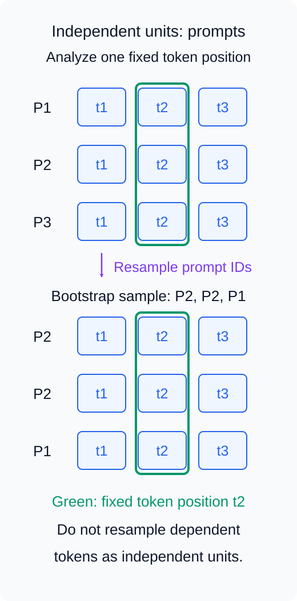
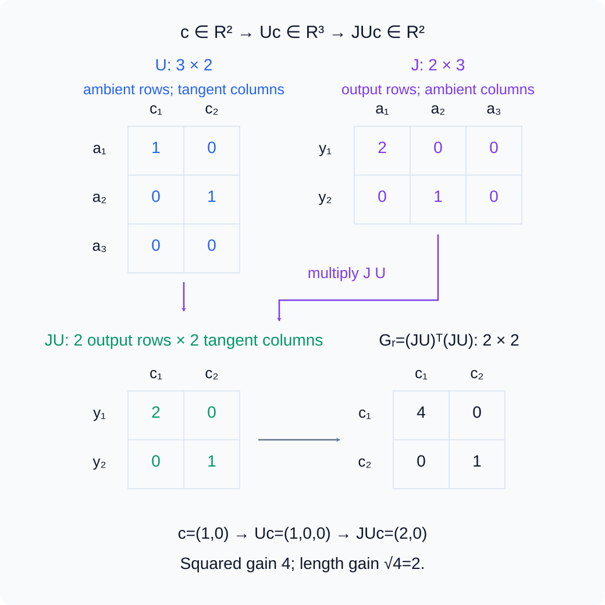
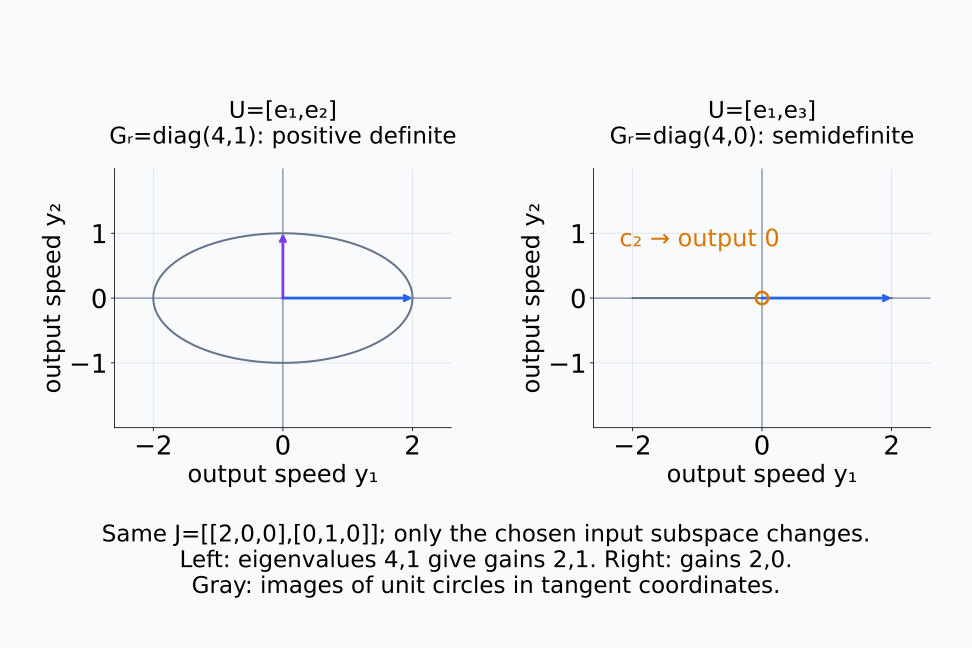
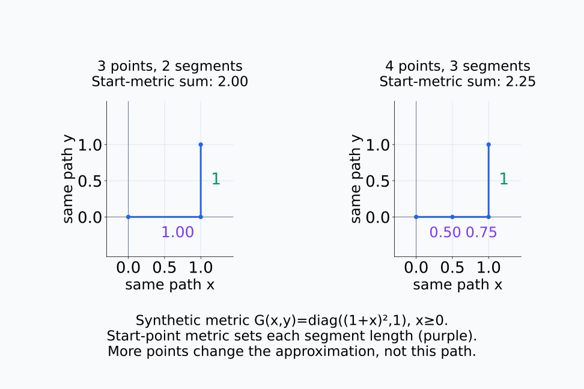
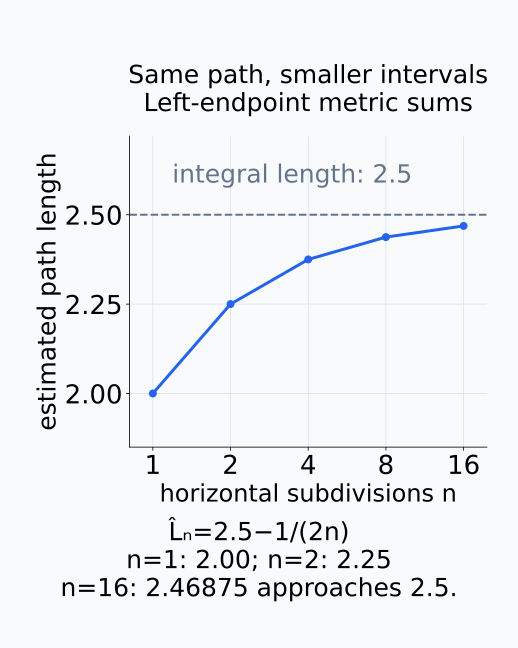
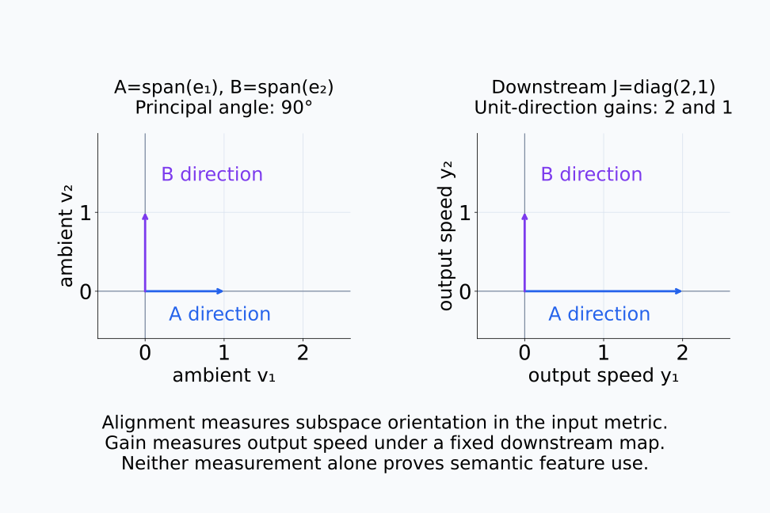
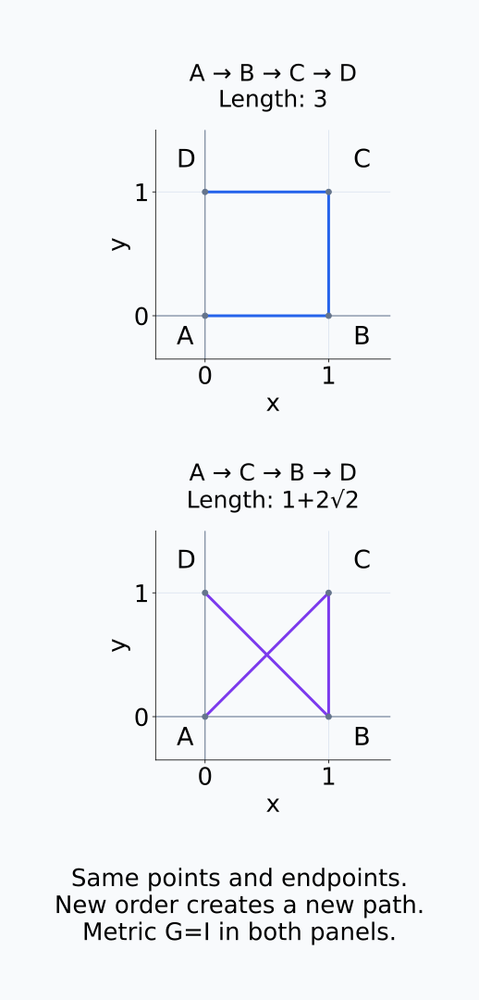

# A09-GEO-08. 종합 실습: 국소 표현 기하

## 이 단원이 필요한 이유

국소 표현 기하 분석은 dataset·layer·token·metric·neighborhood를 먼저 고정해야 재현할 수 있다. 이 실습은 local PCA, Jacobian, pullback metric과 경로 길이를 하나의 claim–estimand–measurement 구조로 묶는다.

## 학습 목표

- 국소 표현 기하 분석의 experimental unit을 정의할 수 있다.
- tangent space와 pullback metric의 추정 절차를 설계할 수 있다.
- bootstrap과 null control을 포함한 결과표를 만들 수 있다.
- 관측 결과에 맞는 주장 강도를 선택할 수 있다.

## 선수지식 확인

- 선수 단원: [A09-GEO-01~07](A09-GEO-07-activation-manifold-pitfalls.md)
- 확인 질문: neighborhood size를 결과를 본 뒤 고르면 어떤 선택 편향이 생기는가?

## 기호와 용어

| 기호·용어 | Common spoken reading | 의미 | shape·범위 |
|---|---|---|---|
| $X_\ell$ | `X sub ell` | layer $\ell$의 activation matrix | $n\times D$ |
| $U_r(x)$ | `U sub r of x` | local PCA tangent basis | $D\times r$ |
| $J_h(x)$ | `the Jacobian of h at x` | downstream map의 Jacobian | matrix |
| $\widehat L(\gamma)$ | `L hat of gamma` | 이산 경로의 추정 길이 | nonnegative scalar |

## 분석 계약

claim은 “고정한 layer와 token 위치에서 condition별 activation은 반복 표본에서 안정적인 국소 tangent structure 차이를 보인다”로 제한한다. experimental unit은 독립 prompt이고, 같은 prompt의 token을 독립 반복으로 세지 않는다.

사전에 다음을 고정한다.

1. model checkpoint, prompt set, layer, token 위치와 normalization
2. Euclidean 또는 사전 지정 metric
3. neighborhood 후보와 선택 규칙
4. local dimension threshold와 bootstrap 횟수
5. random-label·matched Gaussian·random-subspace control

아래 bootstrap에서는 prompt ID를 다시 뽑되 분석할 token 위치를 유지한다.

<figure class="lesson-figure" markdown="1">

<figcaption>각 행은 독립 prompt이고 같은 행의 token들은 종속된 한 묶음이다. 녹색 t2는 고정한 분석 위치다. bootstrap에서 P2가 두 번 뽑히면 그 prompt의 묶음이 두 번 들어간다. token을 흩어 독립 반복처럼 다시 뽑는 방식과 구분한다.</figcaption>
</figure>

## 측정 절차

각 anchor $x$에서 neighborhood covariance를 만들고 leading eigenvector $U_r(x)$를 구한다. $U_r(x)$의 열은 서로 직교하는 unit eigenvector $r$개이며, 선택한 local tangent 근사의 basis다. 이것이 실제 tangent space라는 판단에는 GEO-07의 표본·noise·scale 조건이 남아 있다.

다른 입력과 model 상태를 고정한 downstream map $h:\mathbb R^D\to\mathbb R^m$이 미분 가능하고 출력 metric이 Euclidean이면 $U_r^\top J_h^\top J_hU_r$로 tangent-restricted pullback metric을 계산한다. tangent의 좌표 $c\in\mathbb R^r$를 ambient 방향 $U_rc$로 보내고, 이를 다시 출력 속도 $J_hU_rc$로 보내는 계산이다. 따라서

$$
\|J_hU_rc\|_2^2
=c^\top\bigl(U_r^\top J_h^\top J_hU_r\bigr)c
$$

다. $J_h$는 $m\times D$, restricted matrix는 $r\times r$이며 모두 같은 anchor에서 평가한다. PCA 좌표에서 Euclidean norm이 1인 eigenvector $c$의 eigenvalue는 출력 squared gain이고 길이 gain은 그 제곱근이다. 다른 입력 metric에서 길이가 1인 방향의 gain을 묻는 경우에는 그 metric의 입력 norm도 반영해야 한다. $J_hU_r$가 full column rank일 때에만 이 제한 행렬이 positive definite이다. 일부 tangent 근사 방향이 출력에서 1차적으로 사라지면 semidefinite이다.

아래 숫자 행렬에서 U의 tangent 열이 J의 ambient 열을 거쳐 어디로 가는지 확인한다.

<figure class="lesson-figure lesson-figure--wide" markdown="1">

<figcaption>이 합성 예의 U는 R³ 안의 두 tangent 방향을 선택하고 J는 R³의 방향을 R² 출력 속도로 보낸다. JU의 행은 출력 좌표, 열은 tangent 좌표다. restricted metric의 두 축은 모두 tangent 좌표이며, c=(1,0)의 출력 속도 (2,0)는 squared gain 4와 length gain 2에 대응한다.</figcaption>
</figure>

아래에서는 J를 고정한 채 선택한 tangent 근사 부분공간만 바꾼다.

<figure class="lesson-figure lesson-figure--wide" markdown="1">

<figcaption>U=[e₁,e₂]에서는 JU가 두 방향을 모두 구분해 restricted eigenvalue가 4,1이고 length gain은 2,1이다. U=[e₁,e₃]에서는 두 번째 방향이 출력에서 1차적으로 사라져 eigenvalue가 4,0이다. ambient J의 rank뿐 아니라 실제 선택한 JU의 full column rank를 확인해야 한다.</figcaption>
</figure>

이산 경로 $x_0,\ldots,x_T$에서는 $\Delta x_t=x_{t+1}-x_t$로 두고 길이를

$$
\widehat L(\gamma)=\sum_{t=0}^{T-1}
\sqrt{\Delta x_t^\top G(x_t)\Delta x_t}
$$

로 근사한다. $T+1$개의 점 사이에 $T$개의 구간이 있으며 각 변위를 구간 시작점의 metric으로 잰다. 같은 좌표 표현의 충분히 작은 구간에서 metric 속도의 적분을 이 합으로 근사하는 것이다. 구간이 길거나 metric이 크게 바뀌면 더 잘게 나눈 결과와 비교해야 한다. 임의의 activation 점들을 이은 합이 manifold 위 실제 경로의 길이나 두 점 사이 최단 거리와 자동으로 같아지는 것은 아니다.

아래 같은 경로에서 구간 시작점의 metric을 적용하는 위치를 읽는다.

<figure class="lesson-figure lesson-figure--wide" markdown="1">

<figcaption>합성 metric G(x,y)=diag((1+x)²,1)에서 (0,0)→(1,0)→(1,1)을 따라간다. 왼쪽의 구간 길이 근사는 1+1=2다. 오른쪽은 수평 구간을 둘로 나누어 시작점 x=0과 x=0.5의 metric을 적용하므로 0.5+0.75+1=2.25다. 점 3개는 구간 2개, 점 4개는 구간 3개다.</figcaption>
</figure>

아래에서는 같은 synthetic path를 더 잘게 나누어 근사값을 비교한다.

<figure class="lesson-figure" markdown="1">

<figcaption>앞 그림의 수평 부분을 n등분하면 L̂ₙ=2.5−1/(2n)이다. 구간을 줄일수록 근사값이 같은 경로의 적분 길이 2.5에 접근한다. 이는 합성 metric의 수치 확인이며 임의 activation 점들의 연결이 manifold 경로나 geodesic이라는 증거는 아니다.</figcaption>
</figure>

prompt bootstrap으로 median과 interval을 보고하고, 같은 절차를 null data에 적용한다. 같은 prompt에서 나온 activation들은 하나의 재표집 묶음으로 다룬다. 이웃 covariance나 tangent basis도 재추정했는지, 이미 구한 anchor별 측정값만 재표집했는지를 구분해 기록한다. 두 방식의 interval은 포함하는 추정 변동이 다르다.

## 결과 기록표

| 항목 | estimand | measurement | control | 허용 주장 |
|---|---|---|---|---|
| local dimension | condition별 median $d$ | local PCA spectrum | Gaussian·shuffle | 기술적 차이 |
| tangent alignment | subspace similarity | principal angles | random subspace | 정렬 차이 |
| pullback sensitivity | tangent direction별 gain | restricted metric eigenvalue의 제곱근 | matched norm | 국소 민감도 |
| path length | condition별 metric length | discrete sum | permuted path | 경로 구조 |

local dimension의 label shuffle은 계산한 차원과 condition 이름의 대응을 검토한다. label을 쓰지 않는 이웃 구조 자체가 검증되는 것은 아니다. tangent alignment는 같은 ambient 좌표와 metric에서 부분공간을 비교한 결과이고, pullback sensitivity는 고정한 downstream map의 출력 속도 크기다. 서로 다른 측정량을 모두 semantic feature의 사용 증거로 합치지 않는다.

permuted path는 점들의 순서를 바꿔 다른 경로를 만든다. 따라서 길이 차이는 순서에 대한 경로 구조의 증거이지, manifold의 intrinsic dimension이나 geodesic 여부를 직접 판정한 결과가 아니다. 각 행의 허용 주장은 그 행에서 계산한 estimand와 control의 범위로 제한한다.

아래에서 부분공간의 정렬과 출력 속도 gain이 측정하는 대상을 나누어 읽는다.

<figure class="lesson-figure lesson-figure--wide" markdown="1">

<figcaption>왼쪽의 principal angle 90°는 같은 ambient 내적에서 두 부분공간의 방향 관계다. 오른쪽의 고정 J=diag(2,1)는 unit 방향의 출력 속도 크기를 각각 2와 1로 만든다. 정렬과 gain은 다른 측정량이며, 어느 쪽도 그 자체로 semantic feature의 사용을 입증하지 않는다.</figcaption>
</figure>

아래에서는 같은 점들과 끝점을 유지하면서 중간 순서만 바꾼다.

<figure class="lesson-figure" markdown="1">

<figcaption>Euclidean metric에서 A→B→C→D의 길이는 3이고 A→C→B→D는 1+2√2다. 표본점 집합과 끝점은 같지만 순서를 바꾸면 다른 경로가 된다. permuted path와의 길이 차이를 intrinsic dimension이나 geodesic 판정으로 읽을 수 없다.</figcaption>
</figure>

## 흔한 오해

- 작은 bootstrap interval은 systematic bias가 없다는 뜻이 아니다.
- tangent alignment와 causal feature reuse는 같은 주장이 아니다.

## 연습문제

### 1. experimental unit
prompt 하나에서 얻은 100개 token activation을 독립 표본 100개로 세도 되는가?

해설 보기

일반적으로 안 된다. 같은 prompt와 sequence의 token은 의존하므로 prompt 단위 bootstrap 또는 의존 구조를 반영한 resampling이 필요하다.

### 2. tangent comparison
두 $r$차원 tangent subspace의 정렬을 비교할 수 있는 측정량을 쓰라.

해설 보기

principal angles 또는 그 cosine인 singular value를 사용할 수 있다. 같은 preprocessing과 ambient inner product를 고정해야 한다.

### 3. metric ablation
Euclidean metric에서만 condition 차이가 보이고 whitening metric에서는 사라졌다. 무엇을 보고해야 하는가?

해설 보기

결론이 metric 선택에 민감하다고 보고하고 두 metric이 제거하거나 강조하는 변동을 설명한다. 한 결과만 선택해 일반화하지 않는다.

### 4. claim ledger
특정 tangent direction을 ablate하자 output이 변했다. 이것만으로 그 방향이 유일한 causal mechanism인가?

해설 보기

아니다. intervention effect의 증거이지만 off-manifold perturbation, 대체 경로와 비특이적 norm effect를 통제해야 유일성 주장을 강화할 수 있다.

## 근거와 갱신 경계

이 실습은 앞 단원의 표준 differential geometry와 point-cloud 추정 원칙을 재현 가능한 분석 계약으로 묶는다. 특정 모델에서의 수치 결과는 제공하지 않으며 model·dataset이 바뀌면 estimand와 control을 다시 검토한다.

## 단원 요약

- experimental unit과 geometry 선택을 분석 전에 고정한다.
- local PCA와 Jacobian은 tangent structure와 local sensitivity를 측정한다.
- bootstrap과 null control을 같은 pipeline에 적용한다.
- 기술적 차이·intervention effect·mechanism 주장의 강도를 구분한다.

## 통과 기준

- claim–estimand–measurement–control 표를 완성할 수 있는가?
- 결과가 metric과 neighborhood에 민감할 때 결론을 제한할 수 있는가?

## 다음 단원

- 다음 선택 모듈은 A09-DYN이다.

## 집필자 점검표

- [x] 국소 표현 기하 분석 계약을 완성했다.
- [x] 문제 4개에 해설이 있다.
- [x] Common spoken reading이 실제 영어 학술 발화이며 한글 음역이나 기계적 직역을 포함하지 않는다.
- [x] 선수지식과 링크를 확인했다.
