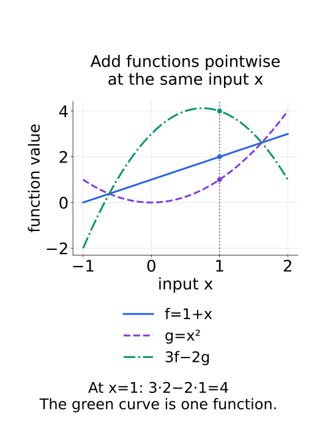
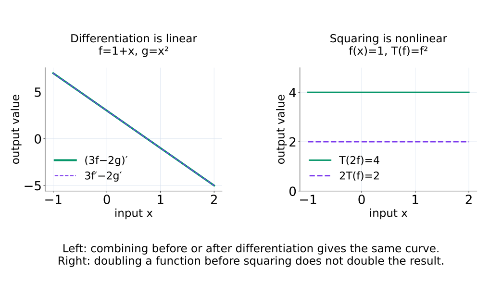
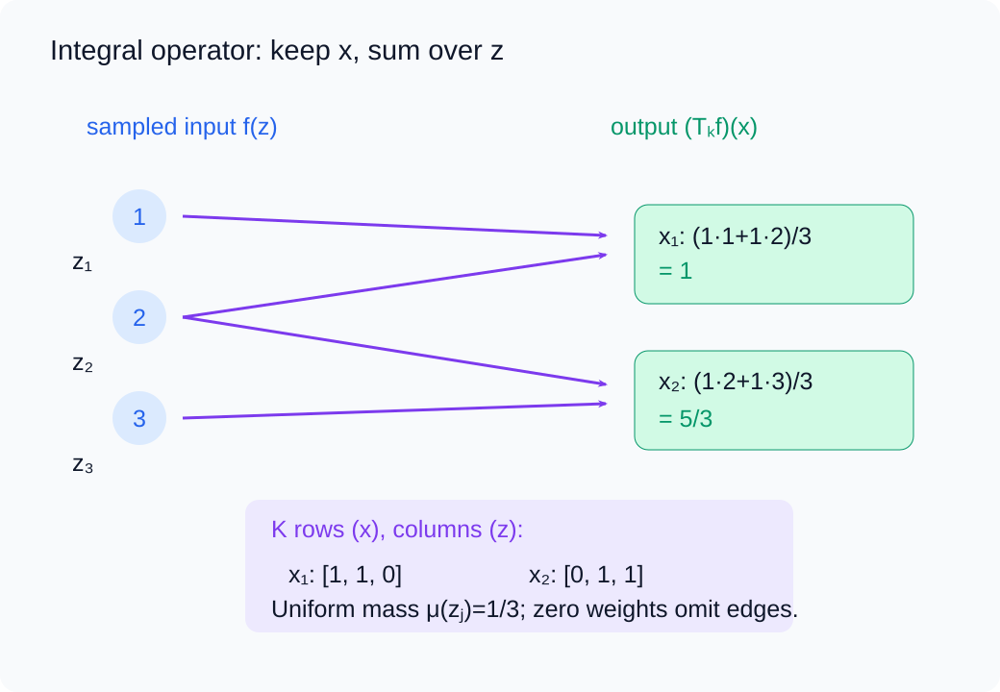
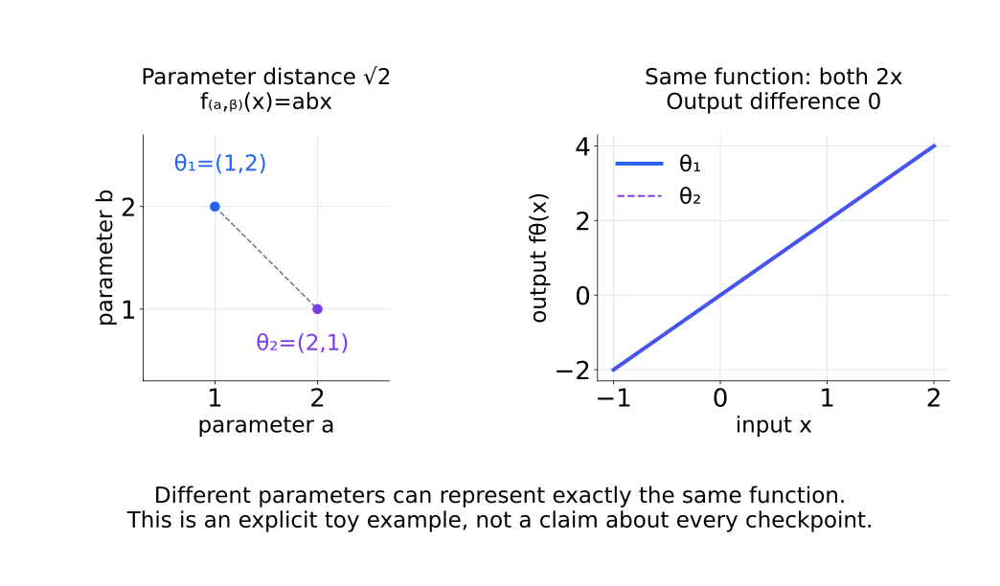
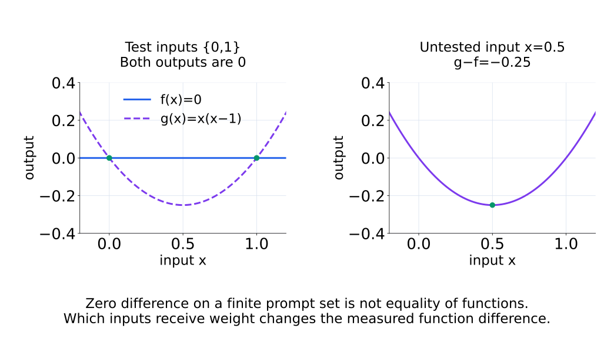
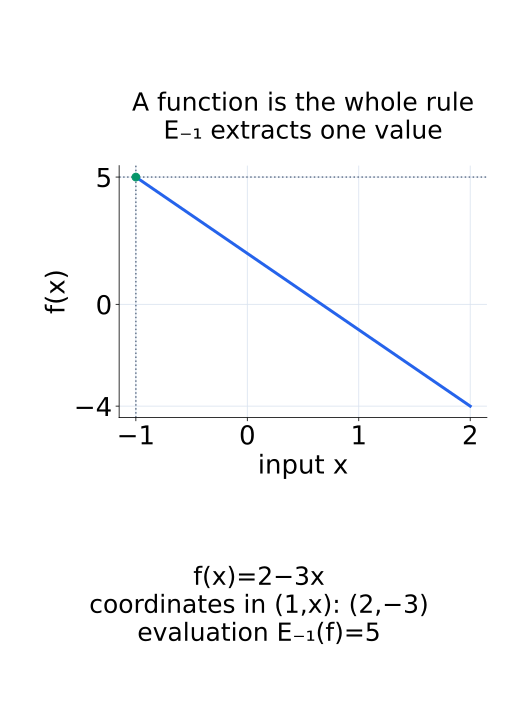

# A09-KER-01. 함수공간과 operator

## 이 단원이 필요한 이유

신경망 학습은 parameter vector를 움직이지만 연구자는 그 결과를 input과 output 사이의 함수 변화로 해석한다. 함수도 더하고 scalar를 곱할 수 있으므로 vector space를 이루며, 함수에 작용하는 map은 operator로 다룰 수 있다. 이 관점은 kernel method와 neural tangent kernel의 출발점이다.

## 학습 목표

- 함수 집합이 vector space가 되는 조건을 확인할 수 있다.
- linear operator와 nonlinear operator를 구분할 수 있다.
- evaluation operator와 integral operator의 입력·출력을 쓸 수 있다.
- parameter-space 변화와 function-space 변화를 구분할 수 있다.

## 선수지식 확인

- 선수 단원: [M02-05 행렬을 선형변환으로 보기](../../part-1-foundations/M02/M02-05-matrix-as-linear-transformation.md), [M03-01 추상 벡터공간](../../part-1-foundations/M03/M03-01-abstract-vector-spaces.md), [M03-02 선형사상과 행렬 표현](../../part-1-foundations/M03/M03-02-linear-maps-matrix-representation.md)
- 확인 질문: 두 vector를 더하고 scalar를 곱하는 규칙만 알 때 좌표를 고르지 않고 linearity를 어떻게 검사하는가?

## 기호와 용어

| 기호·용어 | Common spoken reading | 의미 | shape·범위 |
|---|---|---|---|
| $\mathcal F$ | `the function space F` | 같은 domain과 codomain을 가진 함수공간 | set of functions |
| $T:\mathcal F\to\mathcal G$ | `T maps F to G` | 함수를 다른 함수나 값으로 보내는 operator | map between spaces |
| $E_x(f)=f(x)$ | `the evaluation operator at x applied to f` | 지정 input에서 함수값을 꺼내는 operator | scalar or vector |
| $\lVert f\rVert_{\mathcal F}$ | `the norm of f in F` | 함수의 크기 | nonnegative scalar |
| $T_K$ | `T sub K` | kernel $K$로 정의한 integral operator | function-to-function map |

## 핵심 개념

### 함수 하나를 vector로 본다

같은 set $\mathcal X$에서 실수로 가는 함수들의 집합을 생각한다. $f,g\in\mathcal F$와 scalar $a,b$에 대해

$$
(af+bg)(x)=af(x)+bg(x)
$$

로 pointwise 연산을 정의한다. 왼쪽의 $af+bg$는 함수 하나이고, 그 함수를 input $x$에서 평가한 값이 오른쪽의 실수다. domain이 다른 두 함수를 그대로 더할 수는 없으므로 같은 domain과 vector-space codomain을 정한다. 함수 집합이 비어 있지 않고 이러한 모든 linear combination에 닫혀 있으면 zero function·반대 함수가 포함되고, 실수 연산의 법칙이 pointwise로 이어져 vector space를 이룬다. 같은 domain을 가진 함수의 임의 부분집합이 자동으로 vector space가 되는 것은 아니다.

degree가 $d$ 이하인 polynomial 공간은 $(1,x,\ldots,x^d)$를 basis로 써서 계수 $d+1$개로 함수를 정한다. 반면 구간 $[0,1]$의 continuous function 전체에는 임의의 높은 차수 polynomial도 들어가므로 고정된 유한 basis로 모두 표현할 수 없다. 입력 $x$가 scalar여도 함수들의 공간은 infinite-dimensional일 수 있다. 차원은 input 성분 수가 아니라 독립적으로 선택할 수 있는 함수 방향의 수를 센다.

다음 그림에서는 같은 x의 함수값을 조합한 결과를 곡선 전체로 따라간다.

<figure class="lesson-figure" markdown="1">

<figcaption>입력 x=1을 고정하면 3·2−2·1=4가 된다. 이 계산을 모든 입력에서 수행한 녹색 곡선이 함수 3f−2g이다.</figcaption>
</figure>

### operator의 입력과 출력

operator $T$가

$$
T(af+bg)=aT(f)+bT(g)
$$

를 만족하면 linear operator이다. 여기서 $aT(f)+bT(g)$는 출력 공간에서의 연산이다. evaluation $E_x$의 입력은 함수 $f$이고 출력은 지정된 점의 값 $f(x)$다. $x$를 고정하면 $E_x(af+bg)=aE_x(f)+bE_x(g)$가 성립한다. 평가할 점이 함수에 따라 달라지는 별도 규칙과는 구분한다.

함수를 함수로 보내는 예는 differentiation이다. continuously differentiable function에 작용해 $T(f)=f'$로 두면 출력은 continuous function이다. 미분이 존재할 입력 공간을 정해야 하며, 그 공간에서 $(af+bg)'=af'+bg'$이므로 linear하다. $f\mapsto f^2$은 $f(x)=1$에서 $T(2f)=4$와 $2T(f)=2$가 달라 일반적으로 nonlinear하다. 함수가 입력이라는 사실과 linearity는 서로 다른 조건이다.

다음 그림의 왼쪽은 연산 순서를 바꾸어도 겹치는 두 곡선이고, 오른쪽은 서로 다른 두 출력이다.

<figure class="lesson-figure lesson-figure--wide" markdown="1">

<figcaption>미분에서는 함수 조합 전후의 결과가 같다. 제곱 operator에서는 입력을 두 배로 만든 결과와 출력을 두 배로 만든 결과가 다르다.</figcaption>
</figure>

### integral operator는 함수를 가중 합한다

input 함수 $f$와 고정한 kernel $K(x,z)$, 적분 기준 $\mu$에 대해

$$
(T_Kf)(x)=\int K(x,z)f(z)\,d\mu(z)
$$

로 integral operator를 정의한다. $z$는 적분으로 없애는 변수이고 $x$는 출력 함수의 입력으로 남는다. 고정한 $x$에서 $K(x,z)$가 각 위치의 $f(z)$에 주는 가중치를 정한다. 유한한 점에 둔 균등 기준이면 이 적분은 $\sum_jK(x,z_j)f(z_j)/n$ 같은 평균으로 읽을 수 있다. 적분이 존재하고 출력이 정한 함수공간에 속하는 입력들을 domain으로 삼는다. $K$와 $\mu$가 고정돼 있으므로 적분의 linearity로 $T_K(af+bg)=aT_Kf+bT_Kg$가 성립한다. kernel을 $f$에 따라 다시 정하면 같은 선형성을 가정할 수 없다.

행렬은 basis를 고른 finite-dimensional linear operator의 표현이다. 유한 입력점에서 함수값만 모으면 integral operator도 행렬과 vector의 곱으로 계산할 수 있지만, 그 계산은 선택한 점과 적분 근사에 관한 것이다. finite matrix를 만들었다는 이유만으로 원래 함수공간까지 finite-dimensional이 되지는 않는다.

다음 그림에서는 z에 놓인 함수값이 두 출력 위치 x에 서로 다른 가중치로 모인다.

<figure class="lesson-figure lesson-figure--wide" markdown="1">

<figcaption>z₁, z₂, z₃의 값을 합한 뒤에도 출력 위치 x₁과 x₂는 남는다. 화살표는 가중치 1인 항만 표시하며, 각 출력에는 균등 질량 1/3이 적용된다.</figcaption>
</figure>

### parameter를 바꾸는 것과 함수를 바꾸는 것

모델 $f_\theta$에서는 서로 다른 $\theta$가 같은 함수를 나타낼 수 있다. parameter distance가 커도 $f_\theta(x)$가 data distribution에서 거의 같을 수 있으므로 두 공간의 거리를 따로 기록해야 한다.

parameter-space에서 비교하는 것은 계수들의 차이이며, function-space에서 비교하는 것은 같은 input을 넣었을 때의 output 차이다. 예를 들어 두 checkpoint의 output 차이를 evaluation prompt마다 제곱해 평균하면 그 prompt 집합에서의 변화 크기를 얻는다. 어떤 input을 어떤 비중으로 평가했는지에 따라 이 값이 달라진다. 모든 함수에 적용하는 norm을 쓰려면 함수공간과 그 norm을 먼저 정해야 한다. 유한 prompt에서 차이가 0이어도 측정하지 않은 input에서 같은 함수라고 결론 내릴 수는 없다.

다음 두 그림은 parameter가 달라도 같은 함수인 경우와, 일부 입력의 값만 같은 경우를 구분한다.

<figure class="lesson-figure lesson-figure--wide" markdown="1">

<figcaption>왼쪽의 서로 다른 두 parameter 점은 오른쪽에서 완전히 겹치는 함수 2x를 나타낸다. parameter 거리와 출력 함수의 차이는 별도의 양이다.</figcaption>
</figure>

<figure class="lesson-figure lesson-figure--wide" markdown="1">

<figcaption>두 평가 입력 0과 1에서는 함수값이 같아도, 측정하지 않은 입력 0.5에서는 −0.25만큼 다르다.</figcaption>
</figure>

## 작은 예제

$\mathcal F=\operatorname{span}\{1,x\}$에서 $f(x)=a+bx$이다. evaluation operator $E_2$는 $E_2(f)=a+2b$를 반환한다. basis $(1,x)$를 쓰면 $E_2$는 row vector $(1,2)$처럼 작용한다.

함수 $f$의 좌표는 column vector $(a,b)^\top$이고 $E_2$의 matrix shape은 $1\times2$다. 곱 $(1,2)(a,b)^\top$가 scalar $a+2b$를 준다. 함수 자체 $a+bx$, 좌표 $(a,b)^\top$, 한 점의 값 $a+2b$는 서로 다른 객체다. basis를 바꾸면 좌표와 operator의 행렬은 함께 바뀌지만 동일한 함수의 평가값은 유지된다.

다음 그림에서는 함수의 곡선과 한 점에서 꺼낸 값을 구분한다.

<figure class="lesson-figure" markdown="1">

<figcaption>함수 2−3x의 좌표는 (2,−3)이고, evaluation E₋₁의 출력은 녹색 점의 높이 5이다. 좌표 두 개와 평가값 한 개를 같은 객체로 읽지 않는다.</figcaption>
</figure>

## 흔한 오해

- 함수공간의 한 원소는 input vector가 아니라 함수 하나이다.
- operator를 행렬로 쓰려면 basis와 좌표가 필요하다.

## 연습문제

### 1. closure
$f(x)=1+x$와 $g(x)=x^2$가 degree 2 이하 polynomial 공간에 있을 때 $3f-2g$도 같은 공간에 있는지 확인하라.

해설 보기

$3f(x)-2g(x)=3+3x-2x^2$이므로 degree가 2 이하이고 같은 공간에 속한다.

### 2. linearity
$T(f)=f(0)+1$은 linear operator인가?

해설 보기

$T(0)=1$이므로 linear map이 만족해야 할 $T(0)=0$을 어긴다. affine operator이다.

### 3. evaluation
$f(x)=2-3x$일 때 $E_{-1}(f)$를 구하라.

해설 보기

$f(-1)=2+3=5$이다.

### 4. 모델 해석
두 checkpoint의 parameter distance가 큰데 모든 evaluation prompt에서 output 차이가 작다. 어느 공간의 변화가 작다고 말할 수 있는가?

해설 보기

측정한 prompt distribution에서 function-space 변화가 작다고 말할 수 있다. 측정하지 않은 input 전체나 parameter-space의 가까움을 주장할 수는 없다.

## 근거와 갱신 경계

이 단원은 vector space와 linear operator의 정의를 함수에 적용한다. topology, operator norm의 완전한 이론과 unbounded operator의 domain 문제는 다루지 않는다.

## 단원 요약

- 함수도 pointwise 연산 아래 vector space를 이룰 수 있다.
- operator는 함수를 입력으로 받는 map이다.
- 행렬은 basis를 고른 linear operator의 좌표 표현이다.
- parameter-space와 function-space 거리는 서로 다른 질문에 답한다.

## 통과 기준

- 함수공간의 closure와 operator의 linearity를 검사할 수 있는가?
- parameter 변화와 함수 변화를 구분해 서술할 수 있는가?

## 다음 단원

- [A09-KER-02 positive definite kernel](A09-KER-02-positive-definite-kernel.md)

## 집필자 점검표

- [x] 함수공간·operator·좌표 표현을 구분했다.
- [x] 문제 4개에 해설이 있다.
- [x] Common spoken reading이 실제 영어 학술 발화이며 한글 음역이나 기계적 직역을 포함하지 않는다.
- [x] 선수지식과 링크를 확인했다.
