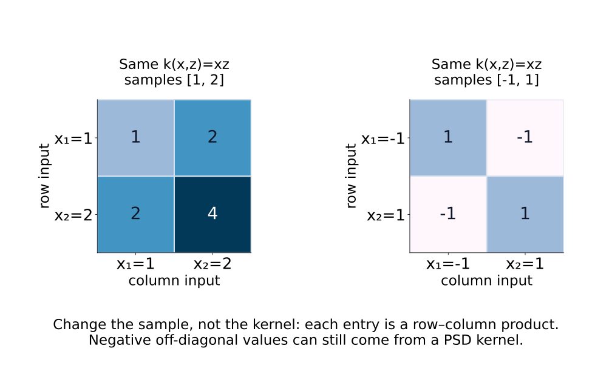
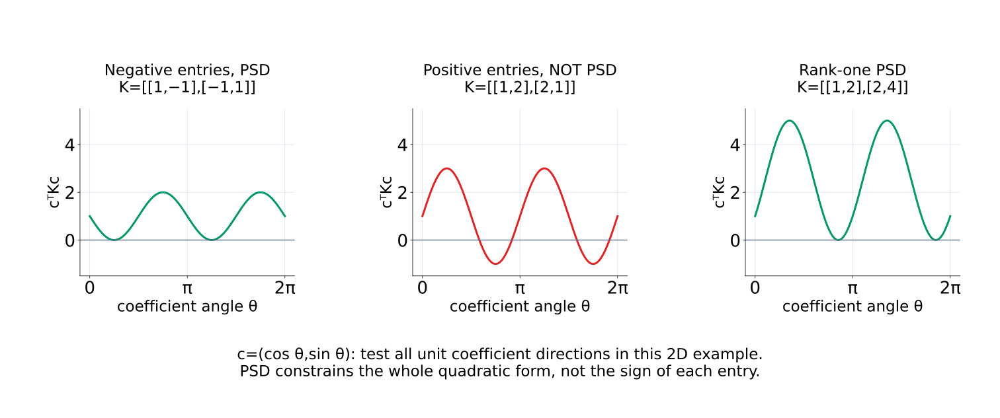
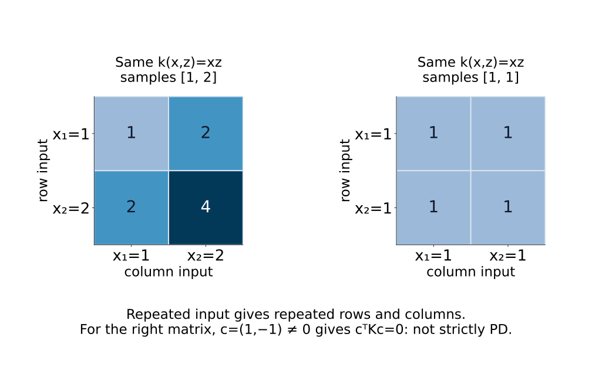
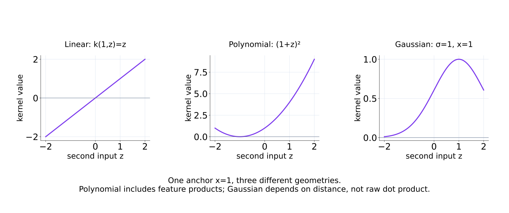
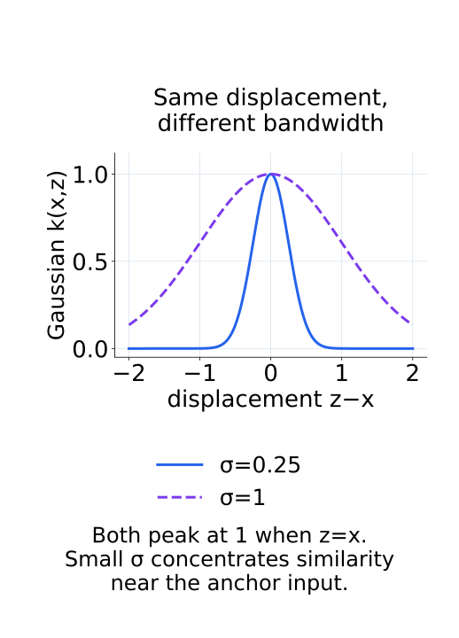
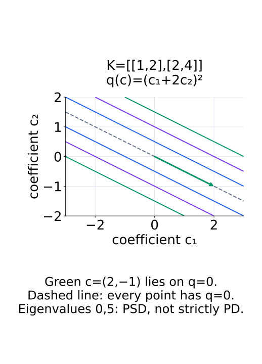

# A09-KER-02. positive definite kernel

## 이 단원이 필요한 이유

kernel method는 sample 쌍의 similarity를 Gram matrix로 모은다. 임의의 similarity function이 inner product처럼 작동하지는 않는다. positive semidefinite 조건을 확인해야 optimization과 함수공간 해석에 필요한 geometry를 얻는다.

## 학습 목표

- kernel function에서 Gram matrix를 만들 수 있다.
- positive semidefinite 조건을 quadratic form으로 검사할 수 있다.
- linear·polynomial·Gaussian kernel의 성질을 비교할 수 있다.
- kernel 값과 causal·semantic similarity를 구분할 수 있다.

## 선수지식 확인

- 선수 단원: [M02-03 내적, 길이와 각도](../../part-1-foundations/M02/M02-03-inner-product-length-angle.md), [M02-12 대칭행렬과 스펙트럼 정리](../../part-1-foundations/M02/M02-12-symmetric-matrices-spectral-theorem.md), [A09-KER-01 함수공간과 operator](A09-KER-01-function-spaces-operators.md)
- 확인 질문: symmetric matrix가 positive semidefinite라는 말은 모든 vector의 quadratic form에 어떤 조건을 거는가?

## 기호와 용어

| 기호·용어 | Common spoken reading | 의미 | shape·범위 |
|---|---|---|---|
| $k(x,x')$ | `k of x and x prime` | 두 input 사이의 kernel value | scalar |
| $K_{ij}=k(x_i,x_j)$ | `K sub i j equals k of x sub i and x sub j` | sample Gram matrix | $n\times n$ |
| $c^\top Kc$ | `c transpose K c` | Gram matrix의 quadratic form | nonnegative scalar |
| $\lambda_{\min}(K)$ | `the smallest eigenvalue of K` | PSD 진단에 쓰는 최소 고유값 | scalar |

## 핵심 개념

### function과 sample matrix

kernel function $k$는 두 input을 받아 scalar 하나를 반환한다. 입력 $x_1,\ldots,x_n$을 고르면 $K_{ij}=k(x_i,x_j)$로 모든 쌍을 모은 Gram matrix가 생긴다. $k$는 input 쌍 전체에 정의된 함수이고 $K$는 선택한 sample에서의 $n\times n$ 배열이다. sample을 바꾸면 같은 kernel에서도 다른 matrix를 얻는다. real inner-product geometry로 해석하려면 symmetry뿐 아니라 PSD 조건이 필요하다.

다음 그림에서는 같은 kernel에 넣는 입력을 바꾸어 행·열과 각 원소의 대응을 비교한다.

<figure class="lesson-figure lesson-figure--wide" markdown="1">

<figcaption>각 원소는 해당 행의 입력과 열의 입력을 곱한 값이다. 오른쪽의 음수 원소도 linear kernel에서 나온다.</figcaption>
</figure>

대칭 함수 $k:\mathcal X\times\mathcal X\to\mathbb R$가 positive semidefinite kernel이라는 뜻은 임의의 sample $x_1,\ldots,x_n$과 coefficient $c\in\mathbb R^n$에 대해

$$
\sum_{i=1}^n\sum_{j=1}^n c_i c_j k(x_i,x_j)=c^\top Kc\ge 0
$$

가 성립한다는 것이다. coefficient는 label이 아니라 여러 input의 kernel 관계를 합쳐 보는 임의의 실수 가중치다. 이 조건은 각 원소 $k(x_i,x_j)$가 양수여야 한다는 뜻이 아니다. 음수인 inner product가 있어도 전체 quadratic form은 음수가 아닐 수 있다. 특히 $n=1$에서 $k(x,x)\ge0$이어야 하지만 대각 원소가 모두 양수라는 사실만으로 전체 PSD가 증명되지는 않는다.

다음 그림은 coefficient의 방향을 한 바퀴 돌리며 quadratic form의 부호를 확인한다.

<figure class="lesson-figure lesson-figure--wide" markdown="1">

<figcaption>가운데 행렬은 모든 원소가 양수여도 일부 coefficient 방향에서 곡선이 0 아래로 내려간다. PSD 검사는 원소별 부호 검사가 아니다.</figcaption>
</figure>

### PSD matrix와 PSD kernel의 검사 범위

대칭 Gram matrix의 eigenvalue가 모두 음수가 아니면 해당 finite sample에서 $c^\top Kc\ge0$가 모든 $c$에 대해 성립한다. eigenbasis에서 각 coefficient 제곱에 eigenvalue를 곱해 더하는 계산이기 때문이다. 그러나 kernel 정의는 sample 크기와 위치를 임의로 바꿔도 성립해야 한다. 한 sample의 검사 통과는 전체 kernel의 증명이 아니며, 한 sample에서 실제 음의 quadratic form을 찾으면 전체 PSD 주장을 반박할 수 있다.

문헌은 positive definite kernel이라는 이름으로 semidefinite 조건을 포함해 쓰기도 한다. 이 단원의 기본 조건은 $\ge0$다. strict positive definite를 별도로 말할 때는 서로 다른 input들에서 $c\ne0$이면 $c^\top Kc>0$인 조건을 뜻한다. 같은 input을 두 번 넣으면 동일한 행·열이 생기므로 이 strict matrix 조건은 유지되지 않는다. 용어를 비교할 때 strict 여부와 중복 input 허용 여부를 확인한다.

다음 그림의 오른쪽에서는 같은 입력의 반복이 같은 행과 열을 만든다.

<figure class="lesson-figure lesson-figure--wide" markdown="1">

<figcaption>중복 입력에서 coefficient (1,−1)은 두 동일한 행의 기여를 상쇄한다. PSD 조건과 strict 양의 조건을 구분해야 하는 한 이유다.</figcaption>
</figure>

### 대표 kernel이 정하는 geometry

linear kernel은 $k(x,x')=x^\top x'$이다. 이때 quadratic form은

$$
\sum_{i,j}c_ic_jx_i^\top x_j
=\left\|\sum_i c_i x_i\right\|_2^2\ge0
$$

이므로 모든 sample에서 PSD다. 큰 값에는 방향의 유사성뿐 아니라 input norm도 들어가며, 방향만 비교하는 cosine과 동일한 수치가 아니다.

polynomial kernel $(x^\top x'+b)^p$는 $b\ge0$, $p$가 nonnegative integer일 때 PSD다. $p=0$에서는 constant kernel 1로 정의한다. 내적의 거듭제곱과 상수항을 더한 feature들의 내적에 대응하며, 차수에 따라 input 성분 사이의 곱을 포함한다. Gaussian kernel은 Euclidean distance와 $\sigma>0$에 대해

$$
k(x,x')=\exp\left(-\frac{\lVert x-x'\rVert^2}{2\sigma^2}\right)
$$

로 정의한 PSD kernel이다. $\sigma$가 작으면 같은 거리에서 값이 더 빠르게 줄어들어 가까운 input 위주로 비교하고, 크면 더 넓은 범위의 input에 큰 값을 준다. 이 결과는 위 parameter 조건에서의 kernel 성질이며, 모든 임의의 similarity function에 적용되는 규칙은 아니다. Gaussian의 PSD 증명 전체는 여기서 다루지 않는다.

다음 두 그림은 kernel 종류의 차이와 Gaussian bandwidth의 차이를 각각 보여 준다.

<figure class="lesson-figure lesson-figure--wide" markdown="1">

<figcaption>입력 하나를 1로 고정해도 kernel 선택에 따라 두 번째 입력을 비교하는 곡선이 달라진다.</figcaption>
</figure>

<figure class="lesson-figure" markdown="1">

<figcaption>두 곡선은 같은 입력에서 값 1을 갖지만, σ=0.25인 곡선은 입력 차이가 커질 때 더 빠르게 줄어든다.</figcaption>
</figure>

kernel은 정한 input 표현·scale·parameter의 geometry를 반영한다. activation 두 개의 kernel 값이 크다는 것은 그 계산 기준에서 가깝다는 관측이다. label 의미의 동일성, feature identity나 모델의 causal dependence는 그 값의 정의에 들어 있지 않으므로 별도 증거가 필요하다.

## 작은 예제

$x_1=1$, $x_2=2$에 linear kernel을 쓰면

$$
K=\begin{bmatrix}1&2\\2&4\end{bmatrix}.
$$

$K=vv^\top$ with $v=(1,2)^\top$이므로 $c^\top Kc=(v^\top c)^2\ge0$이다.

따라서 $c=(c_1,c_2)^\top$에서 값은 $(c_1+2c_2)^2$다. $c=(2,-1)^\top$를 넣으면 $c\ne0$인데도 0이므로 이 matrix는 PSD지만 strict positive definite는 아니다. eigenvalue도 0과 5다. 서로 다른 두 scalar input을 사용했어도 linear feature 방향이 하나뿐이므로 Gram matrix가 full rank일 필요는 없다.

다음 그림에서는 quadratic form이 0인 coefficient들이 한 직선을 이룬다.

<figure class="lesson-figure" markdown="1">

<figcaption>점선 위에서는 c₁+2c₂=0이다. 녹색 화살표는 길이가 0이 아닌 coefficient이지만 quadratic form의 값은 0이다.</figcaption>
</figure>

## 흔한 오해

- kernel function의 kernel은 linear map의 null space와 다른 용어이다.
- finite precision에서 매우 작은 음의 eigenvalue가 나오면 tolerance와 matrix symmetrization을 먼저 확인한다.

## 연습문제

### 1. Gram matrix
$x_1=(1,0)$, $x_2=(1,1)$에 linear kernel을 적용해 $K$를 구하라.

해설 보기

내적을 계산하면 $K=\begin{bmatrix}1&1\\1&2\end{bmatrix}$이다.

### 2. PSD
$K=\begin{bmatrix}1&-1\\-1&1\end{bmatrix}$가 PSD인지 eigenvalue로 판단하라.

해설 보기

eigenvalue는 $0$과 $2$이므로 둘 다 음수가 아니며 PSD이다.

### 3. symmetry
$k(x,x')\ne k(x',x)$인 함수를 그대로 real inner-product kernel로 쓸 수 있는가?

해설 보기

real inner product가 대칭이므로 그대로는 쓸 수 없다. 대칭화만으로 PSD가 자동 성립하지도 않는다.

### 4. 모델 해석
activation kernel 값이 큰 두 prompt를 찾았다. 바로 같은 feature를 사용한다고 결론내릴 수 있는가?

해설 보기

해당 kernel이 정한 similarity가 크다는 증거이다. feature identity나 causal mechanism에는 추가 alignment와 intervention 검증이 필요하다.

## 근거와 갱신 경계

이 단원은 real-valued symmetric PSD kernel을 다룬다. conditionally positive definite kernel과 indefinite similarity method는 범위 밖이다.

- [Stanford CS229, Kernels](https://cs229.stanford.edu/summer2022/cs229-notes3.pdf): 모든 finite Gram matrix의 symmetry/PSD 조건과 polynomial·Gaussian kernel의 feature 해석을 대조했다. PSD kernel 존재 조건과 추가 연속성·적분 조건이 필요한 Mercer 전개는 구분한다.

## 단원 요약

- kernel은 sample 쌍을 scalar로 비교한다.
- PSD 조건은 모든 finite Gram matrix의 quadratic form에 적용된다.
- kernel 선택은 분석 geometry를 정한다.
- 높은 kernel similarity만으로 기능적 동일성을 주장할 수 없다.

## 통과 기준

- kernel에서 Gram matrix를 만들고 PSD를 검사할 수 있는가?
- kernel similarity의 주장 범위를 제한할 수 있는가?

## 다음 단원

- [A09-KER-03 feature map과 kernel trick](A09-KER-03-feature-map-kernel-trick.md)

## 집필자 점검표

- [x] symmetric PSD 조건과 finite Gram matrix를 연결했다.
- [x] 문제 4개에 해설이 있다.
- [x] Common spoken reading이 실제 영어 학술 발화이며 한글 음역이나 기계적 직역을 포함하지 않는다.
- [x] 선수지식과 링크를 확인했다.
