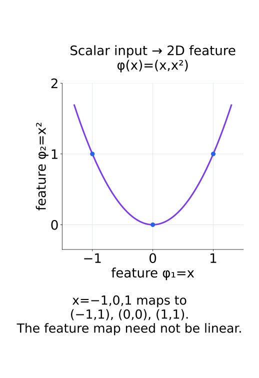
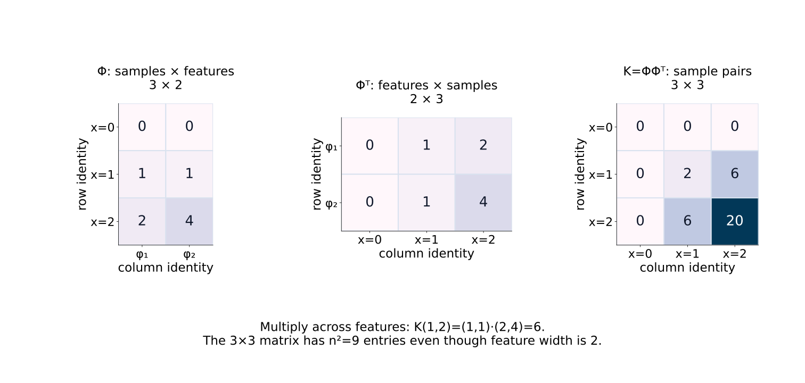
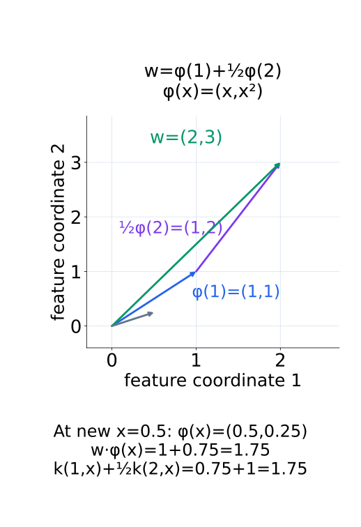
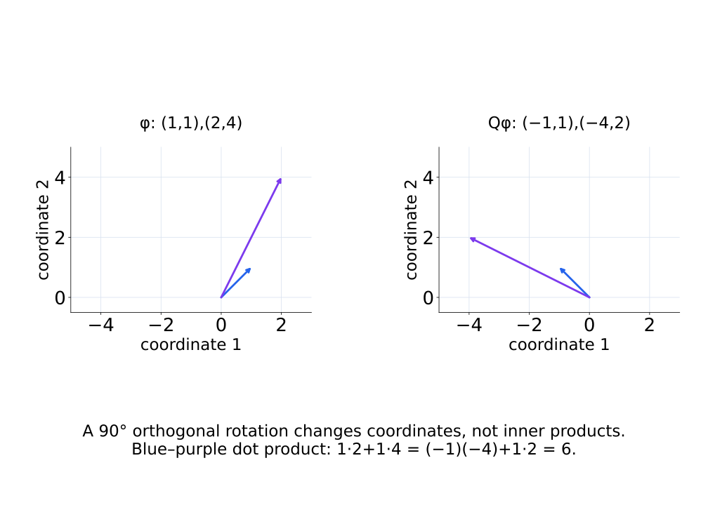
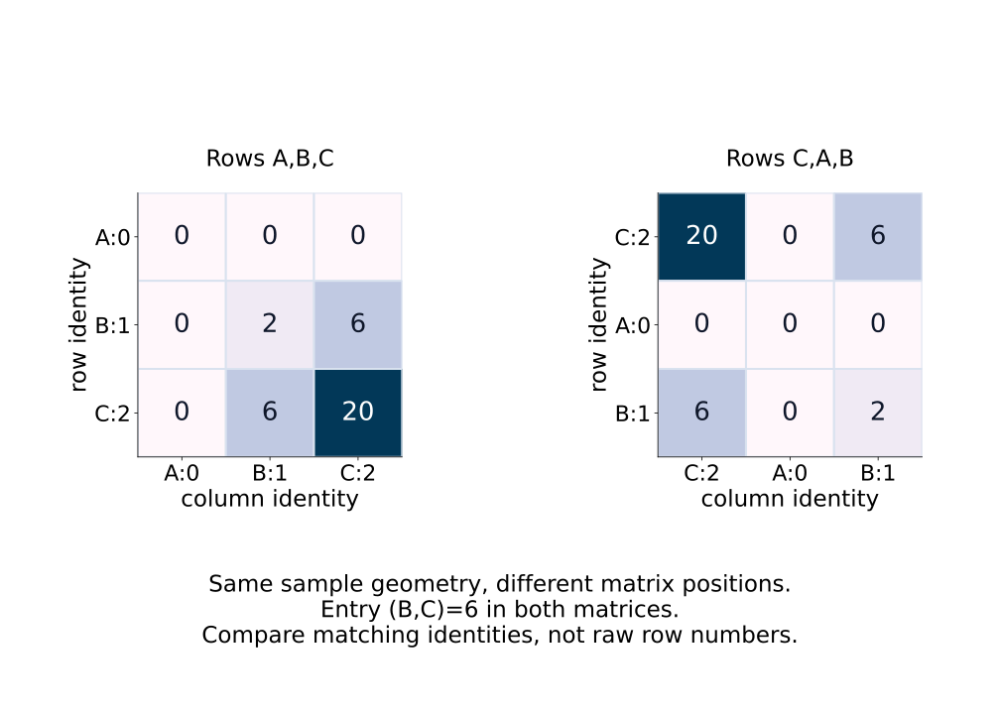
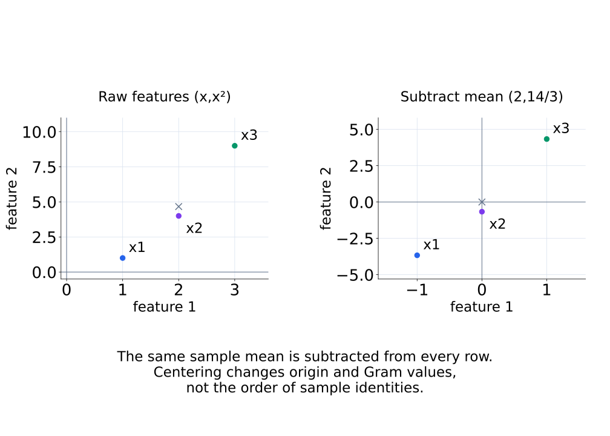
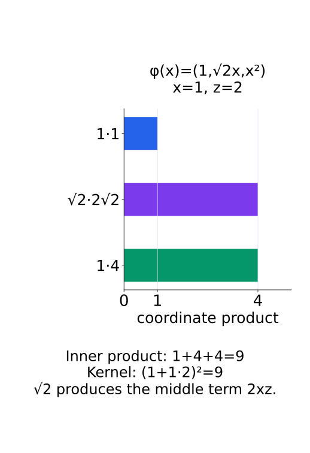

# A09-KER-03. feature map과 kernel trick

## 이 단원이 필요한 이유

positive semidefinite kernel은 어떤 feature space의 inner product로 표현할 수 있다. algorithm이 feature coordinate를 직접 만들지 않고 kernel value만 사용하면 높은 차원이나 infinite-dimensional space에서도 계산할 수 있다. 이 계산 절약이 kernel trick이다.

## 학습 목표

- explicit feature map에서 대응 kernel을 계산할 수 있다.
- Gram matrix만으로 inner product 계산을 바꾸는 과정을 설명할 수 있다.
- 같은 kernel을 만드는 feature map의 비유일성을 설명할 수 있다.
- kernel similarity 분석의 계산 단위와 대조군을 정할 수 있다.

## 선수지식 확인

- 선수 단원: [M02-02 선형결합과 span](../../part-1-foundations/M02/M02-02-linear-combinations-span.md), [M02-03 내적, 길이와 각도](../../part-1-foundations/M02/M02-03-inner-product-length-angle.md), [A09-KER-02 positive definite kernel](A09-KER-02-positive-definite-kernel.md)
- 확인 질문: feature vector 두 개의 모든 coordinate를 몰라도 inner product만 계산할 수 있다면 어떤 algorithm을 그대로 실행할 수 있는가?

## 기호와 용어

| 기호·용어 | Common spoken reading | 의미 | shape·범위 |
|---|---|---|---|
| $\phi:\mathcal X\to\mathcal H$ | `phi maps X to H` | input을 feature space로 보내는 map | function |
| $k(x,x')=\langle\phi(x),\phi(x')\rangle_{\mathcal H}$ | `k of x and x prime equals the inner product of phi of x and phi of x prime in H` | feature inner product로 표현한 kernel | scalar |
| $\Phi$ | `capital phi` | sample feature matrix | $n\times d_\phi$ |
| $K=\Phi\Phi^\top$ | `K equals Phi Phi transpose` | feature Gram matrix | $n\times n$ |

## 핵심 개념

### input을 feature vector로 보낸다

feature map $\phi$는 input $x$를 inner-product space $\mathcal H$의 vector로 보낸다. 이 map 자체가 input에 대해 linear일 필요는 없다. 두 feature vector의 inner product를

$$
k(x,x')=\langle\phi(x),\phi(x')\rangle_{\mathcal H}
$$

로 정의하면, 임의의 coefficient에 대한 kernel quadratic form이 $\|\sum_i c_i\phi(x_i)\|_{\mathcal H}^2$이므로 PSD kernel을 만든다. 반대로 PSD kernel에는 이 내적 관계를 실현하는 Hilbert feature space와 map이 존재한다. 그 map을 직접 계산할 수 있거나 유한 차원이라는 조건까지 따라오는 것은 아니다.

다음 그림에서는 scalar 입력들이 두 feature 좌표로 옮겨지는 모양을 확인한다.

<figure class="lesson-figure" markdown="1">

<figcaption>가로축과 세로축은 입력 공간의 두 축이 아니라 feature의 두 성분이다. scalar 입력 하나로도 nonlinear feature 곡선 위의 위치를 정할 수 있다.</figcaption>
</figure>

유한 feature dimension $d_\phi$에서는 $\phi(x_i)$를 column vector로 두고 전치를 row로 쌓아 $\Phi\in\mathbb R^{n\times d_\phi}$를 만든다. $\Phi\Phi^\top$의 $(i,j)$ entry가 두 row의 내적이므로 $K=\Phi\Phi^\top$이다. infinite-dimensional feature space에서도 kernel value로 유한한 $n\times n$ Gram matrix를 만들 수 있지만, 그때 $\Phi$를 보통의 유한-width 숫자 배열로 만들었다고 가정하지 않는다.

다음 그림은 feature index를 합하는 곱셈과 남는 sample index 두 개를 보여 준다.

<figure class="lesson-figure lesson-figure--wide" markdown="1">

<figcaption>Φ의 feature 열 두 개를 따라 곱하고 더하면 K의 sample 쌍 하나가 나온다. feature 폭은 2이지만 Gram 원소 수는 3²=9이다.</figcaption>
</figure>

### 내적을 kernel value로 대체하는 계산

algorithm의 input 의존성이 feature inner product와 sample feature의 linear combination으로 표현된다면, explicit $\Phi$ 대신 kernel value로 계산할 수 있다. 예를 들어 $w=\sum_i\alpha_i\phi(x_i)$인 predictor는

$$
\langle w,\phi(x)\rangle_{\mathcal H}
=\sum_i\alpha_i k(x_i,x)
$$

로 평가한다. training sample에서의 prediction vector는 $K\alpha$이고, $\|w\|_{\mathcal H}^2=\alpha^\top K\alpha$다. prediction과 이 norm만 사용하는 objective는 coefficient $\alpha$와 Gram matrix로 쓸 수 있다. 이것이 kernel trick의 계산상 의미다. feature coordinate별 절댓값 penalty나 특정 coordinate의 activation을 요구하는 algorithm은 같은 Gram matrix만으로 곧바로 대체되지 않는다.

training Gram matrix만으로 새로운 input의 prediction까지 정해지는 것은 아니다. 새 $x$에는 $k(x_i,x)$를 추가로 계산해야 한다. input 전체에 정의한 kernel function과 training에서 저장한 Gram matrix를 이 단계에서도 구분한다.

다음 그림에서는 같은 predictor를 feature vector의 합과 새 입력의 kernel 값으로 각각 평가한다.

<figure class="lesson-figure" markdown="1">

<figcaption>파란 벡터와 보라 벡터를 이어 더한 녹색 w를 새 feature와 내적해도, 새 입력의 kernel 두 값을 합해도 1.75가 나온다. 회색 짧은 벡터는 새 입력의 feature이다.</figcaption>
</figure>

### polynomial feature의 scale과 비유일성

예를 들어 scalar input에 $k(x,z)=(1+xz)^2$를 쓰면

$$
\phi(x)=(1,\sqrt2x,x^2)
$$

를 택할 수 있다. 실제로 $\phi(x)^\top\phi(z)=1+2xz+x^2z^2$이다. 가운데 coordinate의 $\sqrt2$는 내적에서 두 번 곱해져 $2xz$를 만드는 scale이다. $(1,x,x^2)$를 그대로 사용하면 가운데 항이 $xz$가 되어 다른 kernel을 만든다. nonlinear input map을 통해서도 feature space의 predictor는 $w$에 대해 linear하게 계산할 수 있다.

orthogonal transformation $Q$를 적용한 $Q\phi(x)$도 $Q^\top Q=I$ 때문에 같은 inner product를 만든다. row feature matrix는 $\tilde\Phi=\Phi Q^\top$로 바뀌고 $\tilde\Phi\tilde\Phi^\top=K$를 유지한다. 따라서 kernel이 정하는 내적 geometry와 각 feature coordinate의 이름·의미는 구분해야 한다. 같은 kernel을 만드는 map은 차원이 다른 공간으로의 embedding 등을 통해서도 비유일할 수 있으므로, coordinate identity를 orthogonal 예 하나로 고정하지 않는다.

다음 그림은 두 feature를 함께 회전할 때 좌표와 내적이 어떻게 달라지는지 비교한다.

<figure class="lesson-figure lesson-figure--wide" markdown="1">

<figcaption>각 성분의 수치는 바뀌지만 두 벡터의 길이·각도와 내적 6은 유지된다. 같은 kernel을 얻어도 coordinate의 이름을 동일시할 수는 없다.</figcaption>
</figure>

### 계산 비용과 비교 단위

kernel trick은 계산 표현을 바꾼다. dense Gram matrix는 sample 쌍마다 값을 저장하므로 entry 수가 $n^2$다. explicit feature dimension이 큰 비용을 피할 수 있어도 sample 수가 크면 저장과 matrix 계산이 병목이 된다. 모든 algorithm의 비용을 자동으로 줄이는 원리는 아니다.

두 layer의 kernel을 비교할 때 matrix의 $i$번째 row가 같은 prompt·token 또는 동일하게 정의한 summary를 뜻해야 한다. sample 수가 같아도 row 순서나 sampling 조건이 다르면 같은 위치의 entry를 직접 비교할 수 없다. centering은 각 feature에서 sample 평균을 빼는 연산이며, 어떤 sample과 평균을 사용했는지도 고정한다. 평가 unit을 정렬한 뒤 row 대응을 섞는 control이나 동일한 dimension·scale의 random-feature control을 비교 목적에 맞게 정의한다. 이런 비교가 답하는 것은 sample 간 geometry의 유사성이며 coordinate별 feature identity는 아니다.

다음 두 그림은 sample 순서의 변경과 feature 평균의 제거를 구분한다.

<figure class="lesson-figure lesson-figure--wide" markdown="1">

<figcaption>sample B와 C의 관계는 두 행렬에서 값 6으로 같다. 배열 위치만 비교하면 서로 다른 sample 쌍을 비교하게 된다.</figcaption>
</figure>

<figure class="lesson-figure lesson-figure--wide" markdown="1">

<figcaption>회색 ×는 sample 평균이다. 같은 평균을 모든 점에서 빼면 평균이 원점으로 오지만 x₁, x₂, x₃의 대응은 그대로다.</figcaption>
</figure>

## 작은 예제

$x=1$, $z=2$이면 polynomial kernel 값은 $(1+2)^2=9$이다. explicit feature로 계산해도 $(1,\sqrt2,1)\cdot(1,2\sqrt2,4)=1+4+4=9$이다.

kernel 계산은 scalar $1+xz$를 만든 뒤 제곱하고, explicit 계산은 세 coordinate의 곱을 더한다. 중간 표현은 달라도 최종 내적은 같다. 여러 sample에서 이 등식을 적용하면 explicit feature Gram과 kernel Gram의 모든 entry가 일치한다. feature map을 쓰지 않아도 계산할 수 있는 것은 이 내적이지 세 coordinate의 개별 의미가 아니다.

다음 그림에서는 세 coordinate 곱의 기여를 각각 확인한다.

<figure class="lesson-figure" markdown="1">

<figcaption>가운데 성분의 √2가 양쪽에서 곱해져 기여 4를 만든다. 세 막대의 값을 더한 9가 직접 계산한 kernel 값과 같다.</figcaption>
</figure>

## 흔한 오해

- kernel trick이 모든 계산을 싸게 만드는 것은 아니다. feature dimension 대신 sample 수가 비용을 지배할 수 있다.
- kernel이 같은 두 feature map에서 coordinate별 의미까지 같지는 않다.

## 연습문제

### 1. feature map
$\phi(x)=(x,x^2)$일 때 대응 kernel을 쓰라.

해설 보기

$k(x,z)=xz+x^2z^2$이다.

### 2. Gram factorization
$\Phi$가 $5\times3$이면 $K=\Phi\Phi^\top$의 shape은 무엇인가?

해설 보기

$K$는 sample 쌍을 비교하므로 $5\times5$이다.

### 3. non-uniqueness
orthogonal $Q$에 대해 $\tilde\phi(x)=Q\phi(x)$가 같은 kernel을 만드는 이유를 보이라.

해설 보기

$\tilde\phi(x)^\top\tilde\phi(z)=\phi(x)^\top Q^\top Q\phi(z)=\phi(x)^\top\phi(z)$이다.

### 4. 모델 해석
두 layer의 centered Gram matrix를 비교할 때 token 수가 다르면 바로 같은 shape의 matrix를 비교할 수 있는가?

해설 보기

없다. 같은 experimental unit을 정렬하거나 unit 간 summary를 정의해야 한다. token sampling 차이가 representation 차이와 섞이지 않게 고정한다.

## 근거와 갱신 경계

PSD kernel의 feature-space 표현은 표준 kernel theory에 따른다. Mercer expansion의 측도 조건과 수렴 증명은 뒤 단원에서 제한적으로 다룬다.

## 단원 요약

- feature map의 inner product가 kernel을 만든다.
- kernel trick은 explicit coordinate 없이 Gram matrix로 계산한다.
- feature map은 orthogonal transformation까지 포함해 비유일하다.
- Gram method의 비용은 sample 수에 따라 커진다.

## 통과 기준

- explicit feature map과 kernel을 서로 변환할 수 있는가?
- 같은 kernel이 coordinate identity를 정하지 않는 이유를 설명할 수 있는가?

## 다음 단원

- [A09-KER-04 RKHS 입문](A09-KER-04-rkhs-introduction.md)

## 집필자 점검표

- [x] feature map·Gram matrix·kernel trick을 연결했다.
- [x] 문제 4개에 해설이 있다.
- [x] Common spoken reading이 실제 영어 학술 발화이며 한글 음역이나 기계적 직역을 포함하지 않는다.
- [x] 선수지식과 링크를 확인했다.
