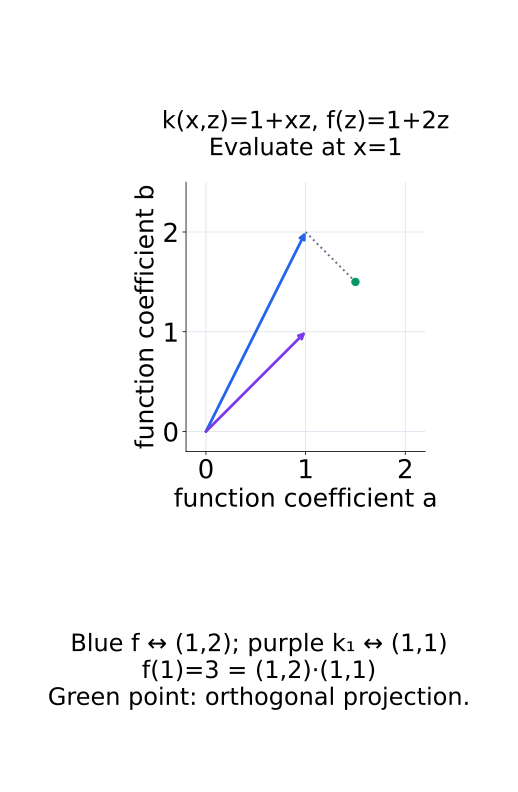
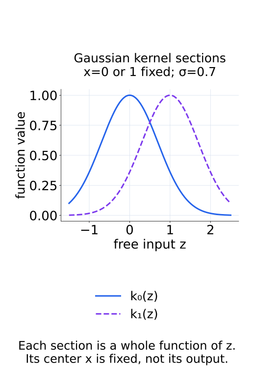
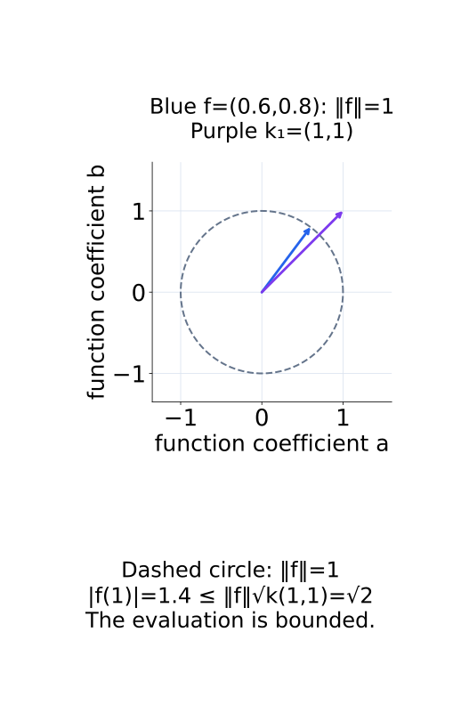
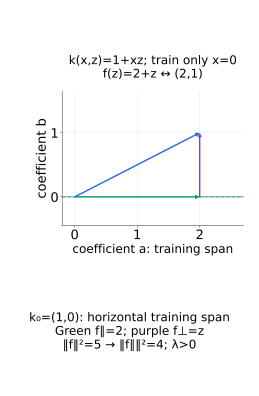
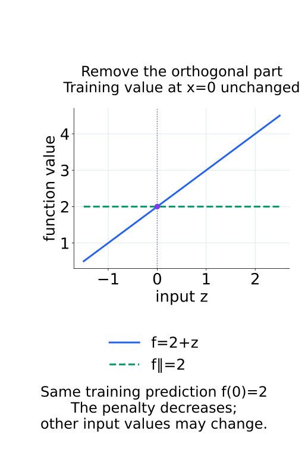
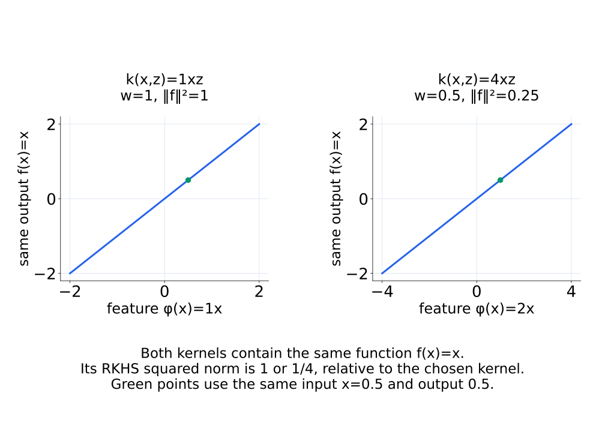
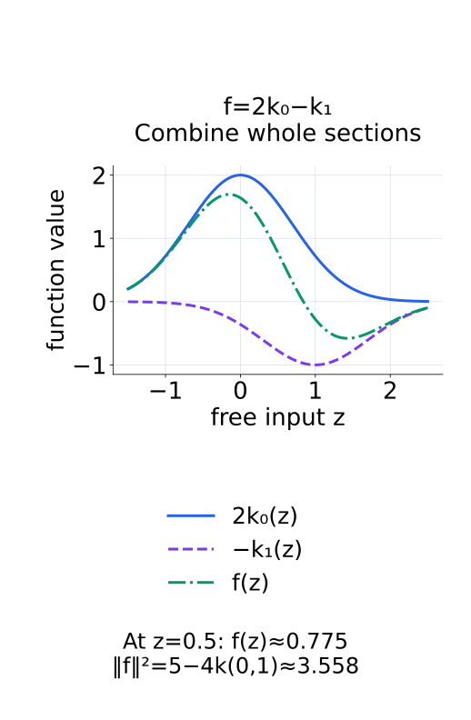

# A09-KER-04. RKHS 입문

## 이 단원이 필요한 이유

positive semidefinite kernel은 함수들의 Hilbert space를 정한다. 이 공간에서는 point evaluation을 inner product로 표현할 수 있다. reproducing property와 RKHS norm을 알면 kernel regression의 해가 왜 training sample을 중심으로 한 kernel section의 합으로 나타나는지 이해할 수 있다.

## 학습 목표

- RKHS의 reproducing property를 쓸 수 있다.
- kernel section $k(x,\cdot)$의 역할을 설명할 수 있다.
- RKHS norm이 kernel에 의존하는 complexity measure임을 설명할 수 있다.
- representer theorem의 결론을 finite expansion으로 표현할 수 있다.

## 선수지식 확인

- 선수 단원: [A09-KER-01 함수공간과 operator](A09-KER-01-function-spaces-operators.md), [A09-KER-02 positive definite kernel](A09-KER-02-positive-definite-kernel.md), [A09-KER-03 feature map과 kernel trick](A09-KER-03-feature-map-kernel-trick.md)
- 확인 질문: vector $v$와의 inner product $\langle w,v\rangle$가 $w$에 대한 linear functional인 이유는 무엇인가?

## 기호와 용어

| 기호·용어 | Common spoken reading | 의미 | shape·범위 |
|---|---|---|---|
| $\mathcal H_k$ | `the R K H S associated with k` | kernel $k$가 정한 reproducing kernel Hilbert space | function space |
| $k_x(\cdot)=k(x,\cdot)$ | `the kernel section at x` | evaluation을 대표하는 함수 | element of $\mathcal H_k$ |
| $f(x)=\langle f,k_x\rangle_{\mathcal H_k}$ | `f of x equals the inner product of f and k sub x in H sub k` | reproducing property | scalar identity |
| $\lVert f\rVert_{\mathcal H_k}$ | `the R K H S norm of f` | kernel 기준 함수 complexity | nonnegative scalar |

## 핵심 개념

### evaluation이 bounded하다는 뜻

Hilbert space는 inner product로 norm을 정하며, 그 norm에서 Cauchy sequence의 극한이 공간 안에 남는 complete vector space다. Cauchy sequence는 충분히 뒤쪽의 항들끼리 norm 거리가 임의로 작아지는 sequence를 뜻한다. 이 단원은 completeness를 증명하지 않고 함수들에 내적을 주어 만든 공간을 사용한다. RKHS(reproducing kernel Hilbert space) $\mathcal H_k$에서는 각 고정한 $x$의 evaluation $f\mapsto f(x)$가 bounded linear functional이다. 즉 해당 $x$의 유한한 상수로 $|f(x)|$를 $\|f\|_{\mathcal H_k}$에 비례해 제한할 수 있다. 이 조건은 함수들이 norm에서 가까우면 그 점의 평가값도 가까움을 뜻한다.

여기서 continuous라는 말은 $f$를 norm에서 바꾸었을 때의 evaluation 연속성이다. input $x$를 바꾸었을 때 모든 $f(x)$가 continuous하다는 정의와는 다르다. 후자의 성질은 kernel 등에 추가 조건이 필요하다. Riesz representation은 Hilbert space의 bounded linear functional을 공간 안 vector와의 내적으로 나타낸다. 따라서 evaluation을 대표하는 함수 $k_x\in\mathcal H_k$가 있고

$$
f(x)=\langle f,k_x\rangle_{\mathcal H_k}
$$

가 성립한다. $k_x$는 지정한 위치 $x$를 고정하고 다른 input에서 값을 내는 함수다. 점 $x$ 자체나 scalar $k(x,x)$와 구분한다.

다음 그림에서는 함수들을 계수 평면에 표시해 evaluation이 내적으로 나오는 한 경우를 확인한다.

<figure class="lesson-figure" markdown="1">

<figcaption>파란 화살표와 보라 화살표는 입력점이 아니라 함수의 계수다. 이 kernel의 내적은 계수 내적이므로 두 화살표의 내적 3이 f(1)을 돌려준다.</figcaption>
</figure>

### kernel section과 reproducing property

$k_x(\cdot)=k(x,\cdot)$를 kernel section이라고 부른다. 위 내적에서 $f=k_{x'}$를 대입하면 $k(x',x)=\langle k_{x'},k_x\rangle_{\mathcal H_k}$를 얻는다. 특히 $\|k_x\|_{\mathcal H_k}^2=k(x,x)$다. Cauchy–Schwarz를 적용하면

$$
|f(x)|\le\|f\|_{\mathcal H_k}\sqrt{k(x,x)}
$$

이므로 evaluation의 유한 상수를 확인할 수 있다. reproducing은 함수값을 inner product로 다시 얻는다는 뜻이다. 모든 PSD kernel에는 이러한 property를 가진 RKHS가 대응한다. kernel section의 finite linear combination에 $\langle k_x,k_z\rangle=k(x,z)$를 주고, 그 norm에서 극한을 포함하도록 완성하는 것이 구성의 출발점이다. 구성의 세부 증명은 여기서 다루지 않는다.

다음 두 그림은 section의 함수 모양과 evaluation bound의 기하를 각각 보여 준다.

<figure class="lesson-figure" markdown="1">

<figcaption>고정한 위치가 0인지 1인지에 따라 다른 section을 얻는다. 각 곡선은 z 전체에 정의된 함수이며 정점의 값 하나가 아니다.</figcaption>
</figure>

<figure class="lesson-figure" markdown="1">

<figcaption>점선 원은 함수 norm 1의 경계다. 파란 함수와 보라 section의 내적 1.4는 section의 길이 √2보다 크지 않다.</figcaption>
</figure>

### regularization이 finite span 밖의 방향을 제거한다

regularized empirical risk

$$
\min_{f\in\mathcal H_k}
\frac1n\sum_{i=1}^n \ell(f(x_i),y_i)+\lambda\lVert f\rVert_{\mathcal H_k}^2
$$

에서 $\lambda>0$이고 minimum을 달성하는 함수가 존재한다고 하자. loss는 training 값 $f(x_i)$에만 의존한다. 이때 모든 최소해는

$$
\hat f(\cdot)=\sum_{i=1}^n\alpha_i k(x_i,\cdot)
$$

형태를 갖는다. 이유는 training section들의 span에 평행한 부분과 그 span에 수직인 부분으로 $f$를 나누면 보인다. 수직 부분은 모든 $k_{x_i}$와의 내적이 0이므로 reproducing property에 따라 모든 training 점에서 값이 0이다. 따라서 그 부분을 제거해도 training prediction과 loss는 변하지 않는다. 반면 orthogonal 분해의 norm 제곱은 두 부분의 norm 제곱 합이므로, 수직 부분이 0이 아니면 제거할 때 penalty가 줄어든다. $\lambda>0$인 최소해는 이 부분을 남길 수 없다.

이것이 representer theorem의 finite expansion 결론이다. 해의 존재나 coefficient의 값, 독립 test에서의 성능까지 보장하는 명제는 아니다. section들이 선형 종속이면 서로 다른 $\alpha$가 같은 함수를 나타낼 수도 있다. loss가 다른 input에서의 함수값이나 derivative 등에 추가로 의존하면 위 training section만의 논증을 그대로 적용하지 않는다.

다음 두 그림은 training section의 수직 성분을 제거할 때 norm과 training 값에 생기는 변화를 구분한다.

<figure class="lesson-figure" markdown="1">

<figcaption>training section k₀=(1,0)의 span은 가로축이다. 보라 수직 성분을 제거하면 norm 제곱이 5에서 4로 줄어든다.</figcaption>
</figure>

<figure class="lesson-figure" markdown="1">

<figcaption>training 입력 0에서는 두 곡선이 같은 값 2를 갖는다. 수직 성분을 제거해도 training loss는 변하지 않지만 다른 입력의 값은 바뀔 수 있다.</figcaption>
</figure>

### RKHS norm과 계수 norm

$f=\sum_i\alpha_i k_{x_i}$이면 내적을 전개하여 $\|f\|_{\mathcal H_k}^2=\sum_{i,j}\alpha_i\alpha_j k(x_i,x_j)=\alpha^\top K\alpha$를 얻는다. $\alpha$의 Euclidean norm 제곱이 아니라 kernel Gram의 geometry가 들어간 양이다. 작은 norm은 그 kernel이 정한 함수공간에서의 complexity 제약이다. 평균 prediction error나 모든 관점의 단순성을 뜻하지 않는다.

kernel을 바꾸면 동일 함수가 새 RKHS에도 속하는지부터 확인해야 한다. 양쪽에 속하더라도 norm과 smoothness 해석은 다를 수 있다. bandwidth가 다른 Gaussian kernel의 norm을 하나의 절대 scale처럼 비교하지 않는 이유다.

다음 그림은 같은 함수 x가 두 kernel에서 서로 다른 norm을 갖는 경우다.

<figure class="lesson-figure lesson-figure--wide" markdown="1">

<figcaption>두 녹색 점은 같은 입력 0.5와 출력 0.5를 나타낸다. feature scale을 kernel과 함께 바꾸면 같은 함수의 norm 제곱은 1에서 1/4로 달라진다.</figcaption>
</figure>

## 작은 예제

$f=2k_{x_1}-k_{x_2}$이면 reproducing property로

$$
f(z)=2k(x_1,z)-k(x_2,z)
$$

를 바로 계산한다. 별도의 coordinate representation이 필요하지 않다.

계수 2와 $-1$은 두 section을 얼마나 더하고 빼는지 정한다. 함수값을 평가할 때는 각 section을 새 점 $z$에 넣어 합친다. 같은 함수의 norm 제곱은 $4k(x_1,x_1)+k(x_2,x_2)-4k(x_1,x_2)$다. 평가값의 합과 함수 norm의 quadratic form은 같은 kernel에서 나오지만 서로 다른 계산이다.

다음 그림에서는 Gaussian section 두 개의 가중 합을 함수 전체로 확인한다.

<figure class="lesson-figure" markdown="1">

<figcaption>파란 값과 보라 값을 같은 z에서 더하면 녹색 함수값이 나온다. 그림 아래의 norm 제곱은 곡선의 높이가 아니라 section들 사이의 kernel 내적으로 계산한 값이다.</figcaption>
</figure>

## 흔한 오해

- RKHS norm이 작은 함수를 모든 관점에서 단순하다고 부를 수는 없다. 단순성은 kernel에 상대적이다.
- representer theorem은 선택한 loss와 regularizer 아래 해의 형태를 정하며 coefficient 값이나 generalization을 자동 보장하지 않는다.

## 연습문제

### 1. reproducing
$f=3k_a+2k_b$일 때 $f(x)$를 kernel 값으로 쓰라.

해설 보기

$f(x)=3k(a,x)+2k(b,x)$이다.

### 2. inner product
$\langle k_a,k_b\rangle_{\mathcal H_k}$를 구하라.

해설 보기

reproducing property에 따라 $k(a,b)$이다.

### 3. finite expansion
training sample이 20개이면 representer form에는 최대 몇 개의 kernel section이 필요한가?

해설 보기

training sample마다 하나씩 최대 20개가 필요하다. coefficient 일부가 0이면 더 적을 수 있다.

### 4. 모델 해석
두 representation에 같은 Gaussian kernel을 적용했지만 bandwidth가 다르다. RKHS norm을 그대로 비교해도 되는가?

해설 보기

bandwidth가 다른 kernel은 서로 다른 함수공간 geometry를 정한다. norm의 scale과 선호 함수가 달라지므로 kernel parameter를 맞추거나 별도의 calibration을 해야 한다.

## 근거와 갱신 경계

이 단원은 scalar-valued RKHS와 quadratic norm regularization의 representer form을 다룬다. Hilbert space의 completeness 증명과 vector-valued RKHS는 다루지 않는다.

- [Stanford STATS305C, RKHS](https://web.stanford.edu/class/stats305c/lectures/RKHS.html): reproducing property와 training 값 보존, orthogonal projection을 통한 norm regularization의 representer 논증을 대조했다.

## 단원 요약

- RKHS에서는 evaluation을 kernel section과의 inner product로 계산한다.
- kernel section은 sample 위치를 중심으로 한 함수이다.
- representer form은 해를 training sample 기반 finite expansion으로 쓴다.
- RKHS norm의 의미는 kernel 선택에 의존한다.

## 통과 기준

- reproducing property로 함수값과 inner product를 계산할 수 있는가?
- RKHS norm을 kernel-relative complexity로 설명할 수 있는가?

## 다음 단원

- [A09-KER-05 spectrum과 compact operator 입문](A09-KER-05-spectrum-compact-operators.md)

## 집필자 점검표

- [x] reproducing property·kernel section·representer form을 연결했다.
- [x] 문제 4개에 해설이 있다.
- [x] Common spoken reading이 실제 영어 학술 발화이며 한글 음역이나 기계적 직역을 포함하지 않는다.
- [x] 선수지식과 링크를 확인했다.
