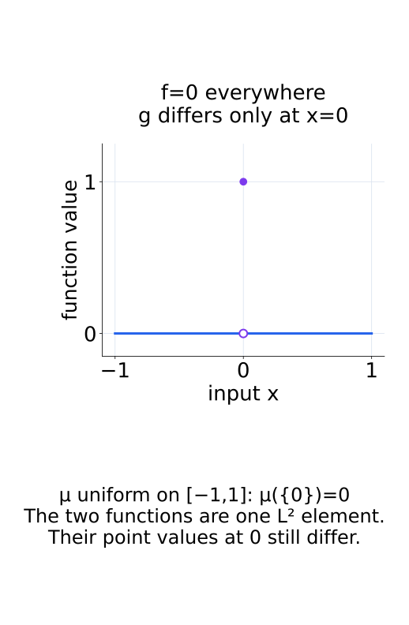
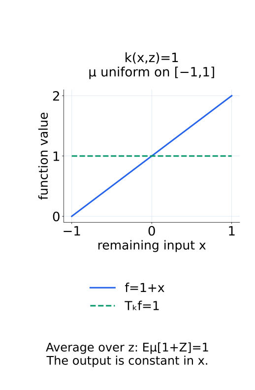
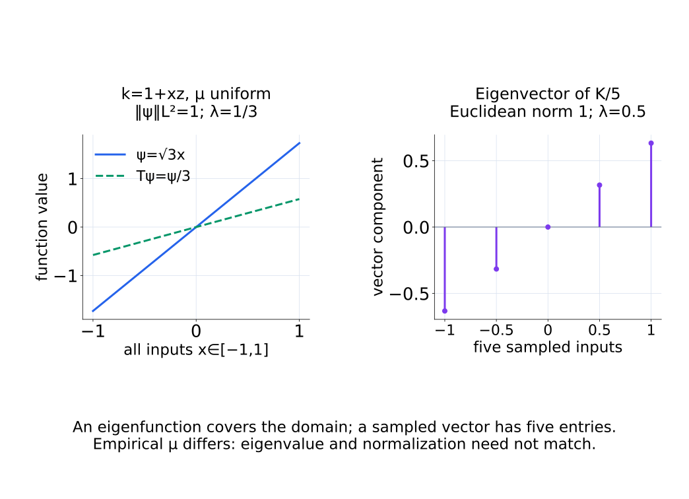
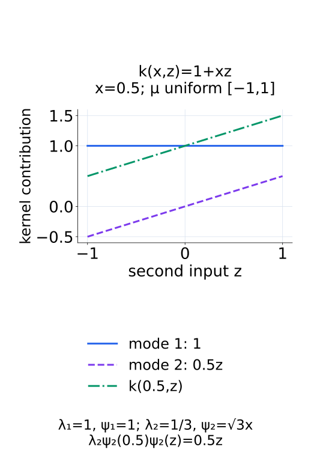
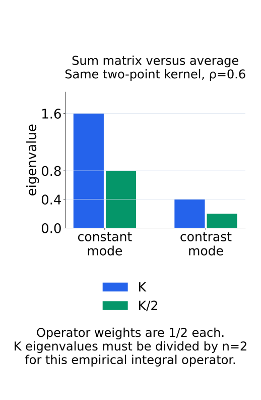
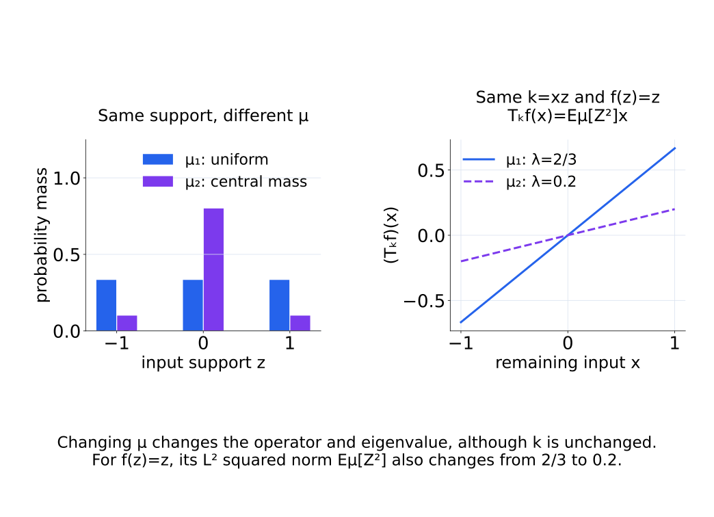
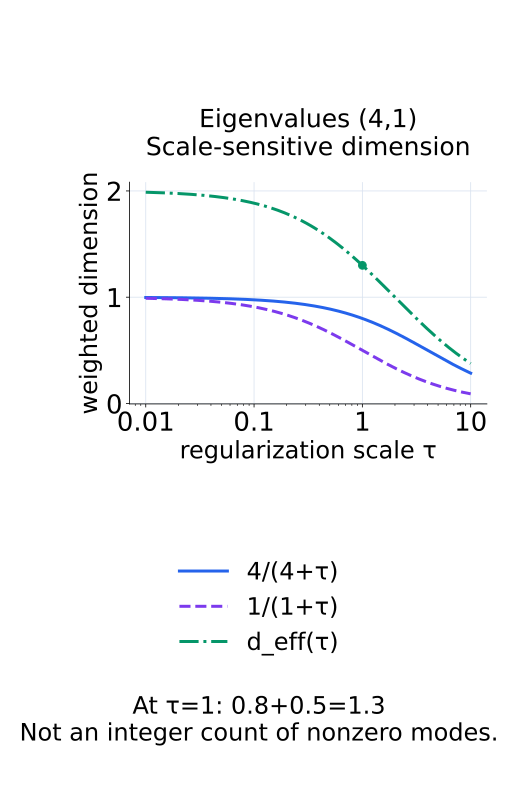
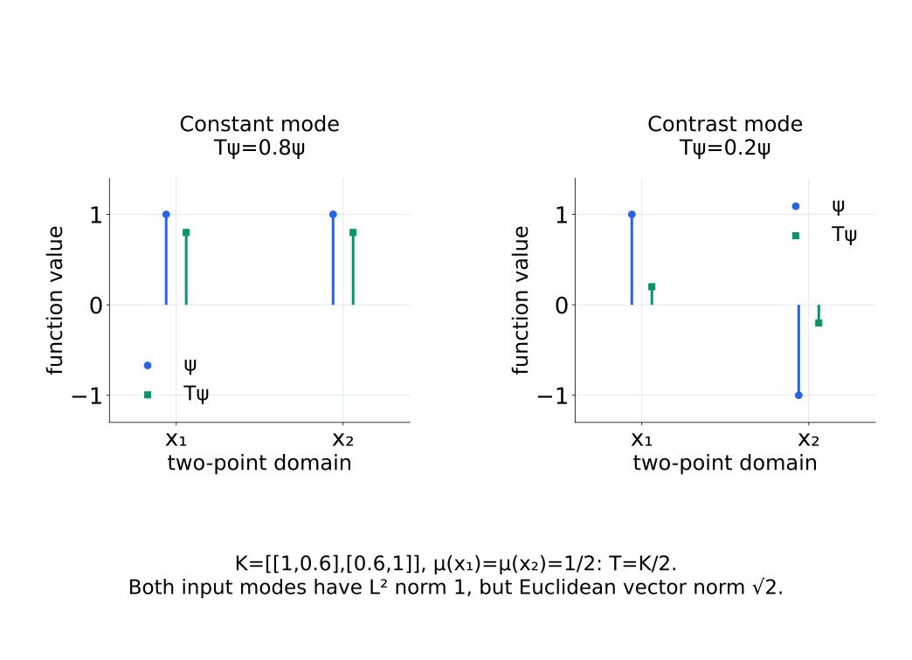

# A09-KER-05. spectrum과 compact operator 입문

## 이 단원이 필요한 이유

Gram matrix의 eigenvector는 finite sample에만 정의된다. population 수준의 kernel geometry를 말하려면 data distribution에 대한 integral operator를 정의해야 한다. compact self-adjoint operator의 spectrum은 행렬의 spectral decomposition을 함수공간으로 옮기는 통로를 제공한다.

## 학습 목표

- kernel integral operator를 정의할 수 있다.
- operator eigenfunction과 matrix eigenvector를 구분할 수 있다.
- kernel expansion에서 eigenvalue와 eigenfunction의 역할을 설명할 수 있다.
- empirical spectrum이 sample과 measure에 의존함을 설명할 수 있다.

## 선수지식 확인

- 선수 단원: [M02-11 고유값과 고유벡터](../../part-1-foundations/M02/M02-11-eigenvalues-eigenvectors.md), [M02-12 대칭행렬과 스펙트럼 정리](../../part-1-foundations/M02/M02-12-symmetric-matrices-spectral-theorem.md), [A09-KER-04 RKHS 입문](A09-KER-04-rkhs-introduction.md)
- 확인 질문: symmetric matrix의 eigenvector basis에서 quadratic form은 어떻게 분해되는가?

## 기호와 용어

| 기호·용어 | Common spoken reading | 의미 | shape·범위 |
|---|---|---|---|
| $(T_kf)(x)$ | `T sub k applied to f at x` | 출력 함수 $T_kf$를 $x$에서 평가한 값 | scalar |
| $T_k\psi_j=\lambda_j\psi_j$ | `T sub k applied to psi sub j equals lambda sub j psi sub j` | operator eigenfunction equation | function identity |
| $\mu$ | `mu` | input space의 reference distribution | probability measure |
| $d_{\mathrm{eff}}(\tau)$ | `the effective dimension at tau` | threshold에 따른 spectral dimension | nonnegative scalar |
| $L^2(\mu)$ | `L two of mu` | 제곱을 적분할 수 있는 함수의 공간 | 같은 함수인지도 $\mu$ 기준으로 판단 |

## 핵심 개념

### 함수의 크기를 재는 distribution

여기서는 $\int |f(x)|^2d\mu(x)<\infty$인 함수들을 다루며, 이 공간을 $L^2(\mu)$로 쓴다. inner product는 $\langle f,g\rangle_{L^2(\mu)}=\int f(x)g(x)d\mu(x)$이고 norm의 제곱은 $E_\mu[f(X)^2]$이다. 행렬 계산의 성분별 합 대신 distribution에 따른 평균을 사용한다. 따라서 같은 함수라도 $\mu$를 바꾸면 norm과 직교 관계가 달라질 수 있다.

$L^2(\mu)$에서는 확률 0인 집합에서만 값이 다른 두 함수를 같은 원소로 취급한다. 특정 point에서의 값이 항상 구분되는 RKHS와는 다른 기준이다. 아래 pointwise 표현에서는 연속인 대표 함수를 사용하는 조건을 함께 둔다.

다음 그림에서는 한 점의 함수값 차이가 L²의 원소 구분에 반영되지 않는 경우를 확인한다.

<figure class="lesson-figure" markdown="1">

<figcaption>보라색 빈 점과 채운 점은 g가 0에서만 다른 값을 갖는다는 뜻이다. 균등한 연속 distribution에서 그 한 점의 확률은 0이므로 L²에서는 두 함수를 같은 원소로 다룬다.</figcaption>
</figure>

### kernel integral operator와 compact 조건

distribution $\mu$와 kernel $k$에 대해 integral operator를

$$
(T_kf)(x)=\int_{\mathcal X}k(x,x')f(x')\,d\mu(x')
$$

로 정의한다. $x$는 출력 위치로 남고 $x'$를 적분한다. 각 위치에서 $f(x')$를 $k(x,x')$로 가중한 뒤 평균하여 새로운 함수 $T_kf$를 만든다. kernel과 distribution을 고정하면 적분의 선형성 때문에 $T_k(af+bg)=aT_kf+bT_kg$이다.

다음 그림에서 constant kernel은 입력 함수의 평균을 출력 함수로 만든다.

<figure class="lesson-figure" markdown="1">

<figcaption>파란 함수의 평균은 1이다. z를 평균으로 없앤 뒤 남는 녹색 출력은 모든 x에서 같은 값 1을 갖는다.</figcaption>
</figure>

구체적인 충분조건은 Euclidean space의 compact input domain에서 $k$가 continuous, symmetric, positive semidefinite이고 $\mu$가 probability measure인 경우다. 예를 들어 닫힌 구간 위의 continuous PSD kernel이 여기에 해당한다. 이때 $T_k$는 $L^2(\mu)$의 bounded linear operator이며, symmetry는 $\langle f,T_kg\rangle=\langle T_kf,g\rangle$인 self-adjoint 성질로, PSD는 $\langle f,T_kf\rangle\geq0$인 positive 성질로 이어진다.

compact는 bounded와 같은 말이 아니다. norm이 제한된 함수열을 $T_k$로 보냈을 때, 출력 중에는 norm으로 수렴하는 부분열이 존재한다는 조건이다. 무한차원 identity operator는 bounded이지만 compact가 아니다.

operator의 spectrum은 $T_k-\lambda I$에 bounded inverse가 존재하지 않는 $\lambda$들의 집합이다. 행렬에서는 eigenvalue 집합과 같지만 무한차원에서는 구분이 필요하다. compact self-adjoint operator의 0이 아닌 spectral 값은 eigenvalue이고 각 eigenspace는 유한차원이다. 그런 값이 무한히 많다면 모일 수 있는 곳은 0뿐이다. 다만 0은 spectrum에 속하더라도 eigenvalue가 아닐 수 있다. spectrum 전체를 무조건 eigenvalue 목록과 동일시하지 않는다.

### eigenfunction과 kernel 전개

$T_k\psi_j=\lambda_j\psi_j$에서 $\psi_j$는 zero function이 아닌 함수다. operator를 적용해도 함수의 형태는 같고 크기만 $\lambda_j$배 된다는 뜻이다. finite matrix에서는 $n$개 성분의 vector를 변환하지만 여기서는 input 전체에 정의된 함수를 변환한다. normalized eigenfunction의 기준은 $\int\psi_j(x)^2d\mu(x)=1$이며, 서로 다른 직교 mode는 $\int\psi_i(x)\psi_j(x)d\mu(x)=0$을 만족한다. 이 inner product는 RKHS inner product와 구분한다.

위 충분조건에 더해 $\mu$가 input domain의 모든 열린 근방에 양의 확률을 주면, 연속인 eigenfunction 대표를 사용하여 kernel을

$$
k(x,x')=\sum_{j:\lambda_j>0}\lambda_j\psi_j(x)\psi_j(x')
$$

로 전개할 수 있다. 이 Mercer expansion은 모든 input pair에서 성립하고 이 조건 아래 급수는 균등 수렴한다. compact self-adjoint operator의 spectral decomposition만으로 이와 같은 pointwise kernel 전개까지 자동 보장되는 것은 아니다.

각 항은 mode $\psi_j$의 두 평가값을 곱한 것이고 $\lambda_j$는 그 가중치다. 앞 단원의 feature map과 연결하면 $j$번째 feature를 $\sqrt{\lambda_j}\psi_j(x)$로 둘 수 있다. 큰 eigenvalue는 이 정규화 아래 kernel에 큰 가중치로 들어가는 방향을 뜻한다. label과 맞는 방향인지, 모델의 인과적 기능을 담는지는 이 전개만으로 알 수 없다.

다음 두 그림은 eigenfunction의 정의역과 kernel 전개의 mode 기여를 구분한다.

<figure class="lesson-figure lesson-figure--wide" markdown="1">

<figcaption>왼쪽은 구간 전체의 함수이고 오른쪽은 다섯 sample의 성분이다. 오른쪽의 균등한 유한 measure는 왼쪽의 연속 measure와 다르므로 norm 기준과 eigenvalue도 구분한다.</figcaption>
</figure>

<figure class="lesson-figure" markdown="1">

<figcaption>kernel 1+xz에서 x=0.5를 고정하면 constant 기여 1과 linear 기여 0.5z를 합한다. normalized eigenfunction의 √3은 eigenvalue 1/3과 함께 실제 kernel 항을 만든다.</figcaption>
</figure>

### sample matrix와 effective dimension

$n$개 point에 각각 $1/n$의 확률을 두면 적분이 평균으로 바뀌어

$$
(T_{k,n}f)(x_i)=\frac{1}{n}\sum_{r=1}^{n}k(x_i,x_r)f(x_r)
$$

가 된다. observed point에서의 함수값 vector에 작용하는 matrix가 정확히 $K/n$이다. $K$의 eigenvalue를 그대로 population operator eigenvalue와 비교하면 이 평균 normalization을 빠뜨린다. sample을 다른 distribution에서 뽑으면 근사 대상 operator도 달라진다. 같은 $\mu$에서 iid로 뽑더라도 유한 sample의 eigenpair는 추정값이며, 가까운 eigenvalue들에 속하는 개별 방향은 작은 변화로 섞일 수 있다.

다음 두 그림은 평균 normalization과 distribution 변경의 효과를 각각 보여 준다.

<figure class="lesson-figure" markdown="1">

<figcaption>두 점을 각각 1/2로 평균하면 두 eigenvalue가 모두 절반이 된다. K의 합 scale과 K/n의 평균 scale을 그대로 비교하지 않는다.</figcaption>
</figure>

<figure class="lesson-figure lesson-figure--wide" markdown="1">

<figcaption>kernel과 입력 위치가 같아도 평균에 쓰는 질량을 바꾸면 Eμ[Z²]가 2/3에서 0.2로 달라진다. 이 예에서는 함수 z의 L² norm 제곱과 operator의 eigenvalue가 모두 이 기대값으로 정해진다.</figcaption>
</figure>

regularization scale $\tau>0$에서

$$
d_{\mathrm{eff}}(\tau)=\sum_j\frac{\lambda_j}{\lambda_j+\tau}
$$

를 쓰면 hard rank보다 scale-sensitive한 dimension을 얻는다. $\lambda_j\gg\tau$인 mode는 거의 1, $\lambda_j\ll\tau$인 mode는 약 $\lambda_j/\tau$만 기여한다. 0인 eigenvalue의 기여는 0이다. 정수 개수를 세는 hard threshold가 아니라 각 방향의 가중치를 더하므로 값이 1.3처럼 나올 수 있다.

무한 합의 유한성도 확인해야 한다. $\sum_j\lambda_j<\infty$이면 $\lambda_j/(\lambda_j+\tau)\leq\lambda_j/\tau$이므로 합은 유한하다. 위 Mercer 조건에서는 $\sum_j\lambda_j=\int k(x,x)d\mu(x)<\infty$이다. compact라는 사실이나 $\lambda_j\to0$만으로 이 합의 유한성이 보장되지는 않는다. finite Gram matrix에서는 항이 유한 개지만, 무한차원 정의에 그대로 옮길 때는 이 조건이 필요하다.

다음 그림에서는 τ가 커질 때 각 mode의 기여와 그 합이 함께 줄어든다.

<figure class="lesson-figure" markdown="1">

<figcaption>τ=1에서 두 기여는 0.8과 0.5이다. effective dimension 1.3은 방향 두 개를 세는 hard rank가 아니라 scale에 따른 가중 합이다.</figcaption>
</figure>

## 작은 예제

두 point에 uniform measure를 두고 $K=\begin{bmatrix}1&\rho\\\rho&1\end{bmatrix}$를 쓴다. PSD를 유지하려면 $|\rho|\leq1$이어야 한다. 함수는 두 평가값 $(f(x_1),f(x_2))$로 표시할 수 있고 integral operator는 $K/2$이다.

constant mode의 값 vector $(1,1)$을 곱하면 $\frac{1+\rho}{2}(1,1)$, contrast mode $(1,-1)$을 곱하면 $\frac{1-\rho}{2}(1,-1)$이 된다. 이 함수들은 $L^2(\mu)$ norm이 $\sqrt{(1^2+1^2)/2}=1$이고 서로 직교한다. Euclidean norm으로 정규화한 matrix eigenvector $(1,\pm1)/\sqrt2$와는 normalization이 다르다. $\rho=1$이면 constant mode의 eigenvalue는 1이고 contrast mode는 0이다. eigenvalue 0의 mode도 nonzero function이며, zero function 자체를 eigenfunction으로 부르는 것은 아니다.

다음 그림에서는 ρ=0.6일 때 두 mode의 값이 각각 0.8배와 0.2배 된다.

<figure class="lesson-figure lesson-figure--wide" markdown="1">

<figcaption>파란 원은 입력 함수의 두 값, 녹색 사각형은 operator를 적용한 두 값이다. 값의 비율만 바뀌고 constant 또는 contrast라는 mode 형태는 유지된다.</figcaption>
</figure>

## 흔한 오해

- Gram matrix eigenvalue와 population operator eigenvalue는 normalization 없이 같지 않다.
- 빠른 spectral decay가 곧 label prediction이나 causal mechanism을 뜻하지 않는다.

## 연습문제

### 1. operator
$k(x,x')=1$이고 $\mu$가 probability measure일 때 $(T_kf)(x)$를 쓰라.

해설 보기

$(T_kf)(x)=\int f(x')d\mu(x')=E_\mu[f(X)]$이며 $x$와 무관한 constant function이다.

### 2. eigenmode
위 constant kernel operator에서 eigenvalue 1을 갖는 normalized constant function 외의 mean-zero 함수는 어느 eigenvalue를 갖는가?

해설 보기

mean-zero 함수는 적분값이 0이므로 operator가 zero function으로 보내며 eigenvalue 0을 갖는다.

### 3. effective dimension
eigenvalue가 $(4,1)$이고 $\tau=1$이면 $d_{\mathrm{eff}}(1)$을 구하라.

해설 보기

$4/(4+1)+1/(1+1)=0.8+0.5=1.3$이다.

### 4. 모델 해석
두 model의 activation Gram spectrum을 비교할 때 prompt distribution을 맞춰야 하는 이유는 무엇인가?

해설 보기

integral operator 자체가 reference distribution $\mu$에 의존한다. prompt distribution이 다르면 model 차이와 measure 차이가 spectrum에 함께 들어간다.

## 근거와 갱신 경계

spectral expansion은 kernel, domain과 measure에 관한 regularity 조건을 요구한다. 이 단원은 조건의 역할만 밝히며 functional analysis의 증명은 다루지 않는다.

- [MIT 18.102, Compact operators](https://ocw.mit.edu/courses/18-102-introduction-to-functional-analysis-spring-2021/9eaaf363541d01d53c330ee7931fc715_MIT18_102s21_lec20.pdf): compact 정의, identity 반례와 0의 spectrum/eigenvalue 구분을 대조했다.
- [MIT 18.102, Spectral theorem](https://ocw.mit.edu/courses/18-102-introduction-to-functional-analysis-spring-2021/57596554e180e442c9487f580303147b_MIT18_102s21_lec22.pdf): compact self-adjoint operator의 nonzero spectrum과 유한차원 eigenspace 조건을 대조했다.
- [Duke STA941, RKHS fundamentals](https://www2.stat.duke.edu/~st118/sta941/rkhs-fundamentals.pdf): §6의 $L^2$ operator와 Mercer expansion 조건을 대조했다. effective dimension의 유한성은 본문의 항별 부등식과 diagonal 적분으로 확인한다.

## 단원 요약

- kernel integral operator는 population distribution을 포함한다.
- eigenfunction은 함수공간의 spectral direction이다.
- Gram spectrum은 finite-sample approximation이며 normalization이 필요하다.
- effective dimension은 regularization scale에 따라 달라진다.

## 통과 기준

- integral operator와 eigenfunction equation을 쓸 수 있는가?
- empirical spectrum을 population spectrum과 구분할 수 있는가?

## 다음 단원

- [A09-KER-06 neural tangent kernel](A09-KER-06-neural-tangent-kernel.md)

## 집필자 점검표

- [x] Gram matrix와 population integral operator를 구분했다.
- [x] 문제 4개에 해설이 있다.
- [x] Common spoken reading이 실제 영어 학술 발화이며 한글 음역이나 기계적 직역을 포함하지 않는다.
- [x] 선수지식과 링크를 확인했다.
