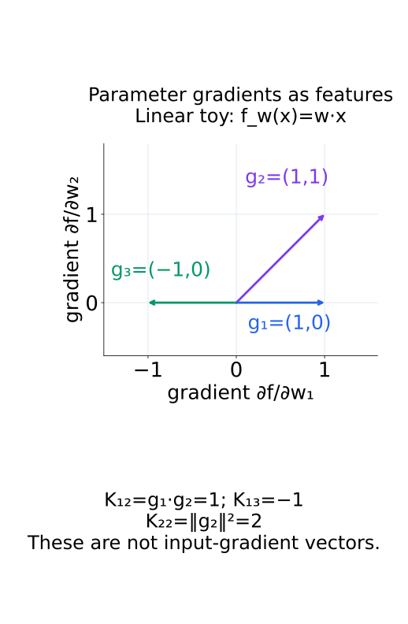
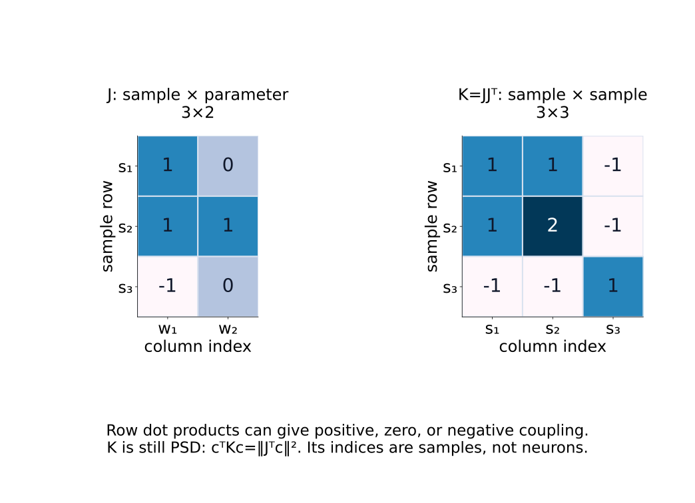
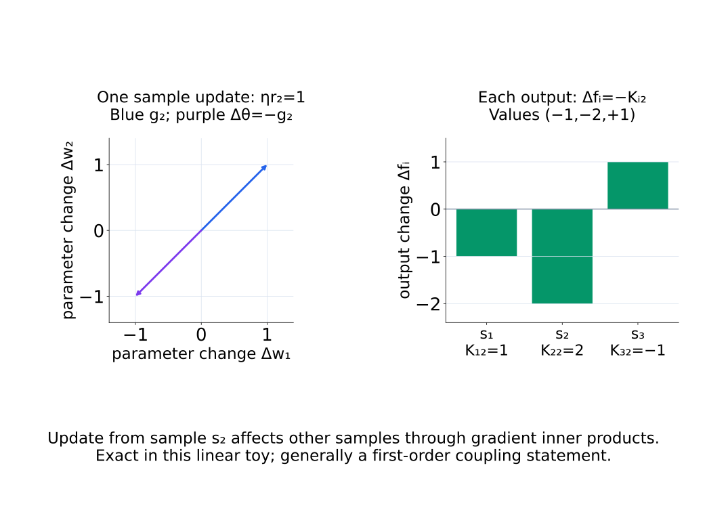
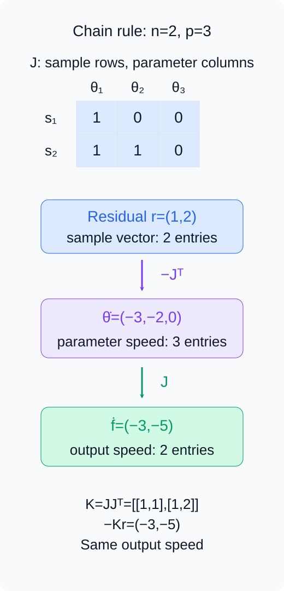
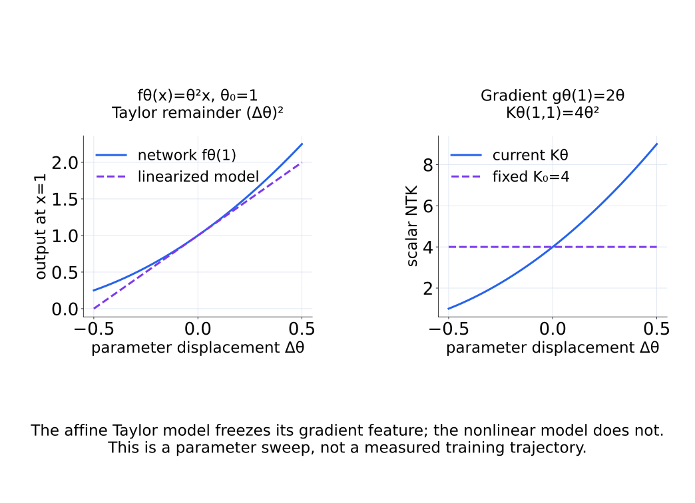
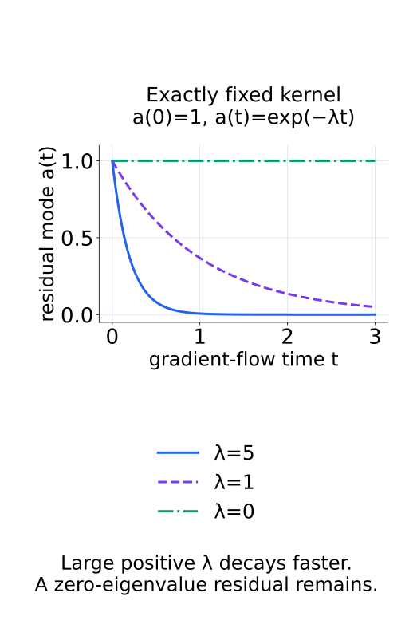
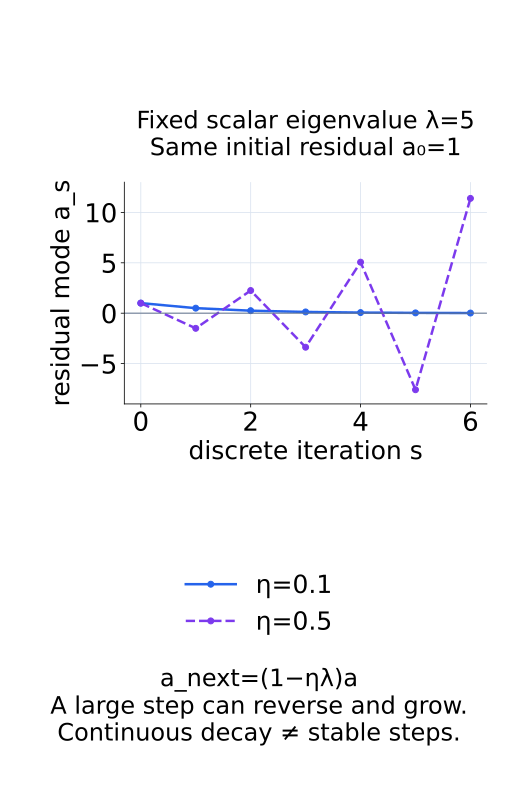

# A09-KER-06. neural tangent kernel

## 이 단원이 필요한 이유

neural tangent kernel은 parameter gradient의 inner product로 training sample 사이의 local coupling을 측정한다. network를 initialization 근처에서 linearize하면 squared-loss gradient flow를 kernel dynamics로 쓸 수 있다. 이 근사는 넓은 network의 학습 이론과 finite model 진단을 연결한다.

## 학습 목표

- model Jacobian에서 empirical NTK를 계산할 수 있다.
- squared-loss gradient flow의 output dynamics를 쓸 수 있다.
- fixed-kernel approximation의 가정을 설명할 수 있다.
- NTK similarity와 learned feature semantics를 구분할 수 있다.

## 선수지식 확인

- 선수 단원: [M03-11 Jacobian](../../part-1-foundations/M03/M03-11-jacobian.md), [N05-06 backpropagation](../../part-2-neural-computation/N05/N05-06-backpropagation.md), [A09-KER-03 feature map과 kernel trick](A09-KER-03-feature-map-kernel-trick.md)
- 확인 질문: scalar output $f_\theta(x)$의 parameter gradient는 parameter 수와 같은 길이의 어떤 vector인가?

## 기호와 용어

| 기호·용어 | Common spoken reading | 의미 | shape·범위 |
|---|---|---|---|
| $g_\theta(x)=\nabla_\theta f_\theta(x)$ | `g sub theta of x equals the parameter gradient of f sub theta of x` | input별 parameter gradient | column $p$-vector for scalar output |
| $K_\theta(x,x')$ | `K sub theta of x and x prime` | neural tangent kernel | scalar |
| $K_\theta=JJ^\top$ | `K sub theta equals J J transpose` | training sample empirical NTK | $n\times n$ |
| $\dot f_t$ | `f dot at time t` | training output의 시간 미분 | $n$-vector |

## 핵심 개념

### parameter gradient를 feature로 사용한다

input $x$를 고정하고 scalar output $f_\theta(x)$를 parameter $\theta\in\mathbb R^p$로 미분한다. column gradient $g_\theta(x)$의 $a$번째 성분은 $\partial f_\theta(x)/\partial\theta_a$이다. 이것은 input gradient가 아니며, 작은 parameter 변화 $\Delta\theta$가 output을 얼마나 바꾸는지를 $\Delta f(x)\approx g_\theta(x)^\top\Delta\theta$로 연결한다.

scalar-output network에서 empirical NTK는

$$
K_\theta(x,x')=\nabla_\theta f_\theta(x)^\top\nabla_\theta f_\theta(x')
$$

이다. 두 input에서 parameter 변화에 민감한 방향들이 얼마나 겹치는지 합산한 값이다. gradient 길이까지 포함하므로 cosine similarity와는 다르다. sample Jacobian $J\in\mathbb R^{n\times p}$의 $i$번째 row를 $g_\theta(x_i)^\top$로 두면 $K_\theta=JJ^\top$이다. 따라서 coefficient vector $c$에 대해 $c^\top K_\theta c=\lVert J^\top c\rVert^2\geq0$이며, 각 entry가 모두 양수여야 하는 것은 아니다.

아래 두 그림은 parameter gradient의 방향과 그 row inner product가 만드는 sample matrix를 구분한다.

<figure class="lesson-figure" markdown="1">

<figcaption>선형 toy에서 세 gradient의 내적을 비교한다. 반대 방향인 g₁과 g₃의 NTK entry는 −1이지만, g₂의 자기 내적은 2이다.</figcaption>
</figure>

<figure class="lesson-figure lesson-figure--wide" markdown="1">

<figcaption>J의 column은 parameter이고 JJᵀ의 두 index는 모두 sample이다. 음수 entry가 있어도 이 Gram matrix는 PSD이다.</figcaption>
</figure>

한 sample $x_j$의 residual $r_j=f_\theta(x_j)-y_j$만 사용해 $\Delta\theta=-\eta r_jg_\theta(x_j)$로 갱신하면 다른 sample의 변화는 $\Delta f(x_i)\approx-\eta r_jK_\theta(x_i,x_j)$이다. 이 식에서 NTK의 sample 간 coupling이라는 뜻이 나온다. $K_\theta(x_i,x_j)=0$이면 이 갱신의 first-order 영향이 0이지, 두 input의 의미가 무관하다는 결론은 아니다.

그림에서는 같은 parameter 갱신이 세 sample의 output을 서로 다르게 바꾼다.

<figure class="lesson-figure lesson-figure--wide" markdown="1">

<figcaption>ηr₂=1로 놓으면 Δθ=−g₂이고 output 변화는 NTK의 둘째 column에 음수를 붙인 (−1,−2,+1)이다. 이 선형 toy에서는 정확한 계산이며 일반 network에서는 first-order 관계이다.</figcaption>
</figure>

### chain rule로 output dynamics를 유도한다

$f_t=(f_{\theta_t}(x_1),\ldots,f_{\theta_t}(x_n))^\top$와 고정 label vector $y$를 사용한다. squared loss $L=\tfrac12\lVert f-y\rVert^2$는 sample별 loss의 합이며 평균이 아니다. output에 대한 loss gradient는 $f-y$이고 chain rule을 적용하면

$$
\nabla_\theta L=J^\top(f-y),\qquad
\dot\theta_t=-J_t^\top(f_t-y)
$$

이다. continuous-time gradient flow는 시간에 따른 parameter 속도를 negative gradient로 놓는 규칙이다. 다시 output을 시간으로 미분하면

$$
\dot f_t=J_t\dot\theta_t
=-J_tJ_t^\top(f_t-y)
$$

이므로 training output은

$$
\dot f_t=-K_{\theta_t}(f_t-y)
$$

를 따른다. 이 식 자체는 network가 parameter에 대해 미분 가능하고 위 loss와 Euclidean gradient flow를 사용하면 finite network에도 성립한다. 아직 kernel이 고정된다는 가정은 쓰지 않았다. loss를 $1/n$으로 평균하면 오른쪽에 $1/n$이 붙는다. 앞 단원의 empirical integral operator가 $K/n$인 것과 같은 normalization이므로 논문 간 decay rate를 비교할 때 맞춰야 한다.

다음 수치 흐름은 sample vector가 parameter vector를 거쳐 다시 sample vector로 돌아오는 chain rule을 보여 준다.

<figure class="lesson-figure" markdown="1">

<figcaption>r=(1,2)를 −Jᵀ로 옮기면 parameter 속도는 (−3,−2,0)이다. 다시 J를 곱한 output 속도 (−3,−5)는 −Kr과 같으며, 중간과 마지막 vector의 길이는 서로 다르다.</figcaption>
</figure>

### fixed kernel은 별도의 근사다

initialization $\theta_0$에서 first-order model을 만들면

$$
f_\theta^{\mathrm{lin}}(x)
=f_{\theta_0}(x)+g_{\theta_0}(x)^\top(\theta-\theta_0)
$$

이다. 이 모델은 gradient feature를 $g_{\theta_0}(x)$에 고정한다. input에 대해서는 nonlinear일 수 있어도 parameter 변화에 대해서는 affine이고, NTK는 $K_{\theta_0}$로 고정된다. 원래 network에서 같은 dynamics를 근사하려면 training 동안 NTK가 충분히 안정적인지 확인해야 한다. parameter 변화의 수치가 작다는 사실만으로 이 조건을 대신하지 않는다.

아래 parameter sweep은 원래 network의 kernel과 affine 근사의 kernel을 비교한다. 측정한 training trajectory는 아니다.

<figure class="lesson-figure lesson-figure--wide" markdown="1">

<figcaption>fθ(x)=θ²x에서 θ₀=1의 affine 근사는 gradient를 2x로 고정한다. 원래 network의 output에는 (Δθ)²가 남고, x=1의 current NTK는 4θ²로 변한다.</figcaption>
</figure>

정확히 고정된 kernel $K_0$의 orthonormal eigenvector를 $q_j$, eigenvalue를 $\lambda_j\geq0$이라 하자. residual $r_t=f_t-y$의 mode coefficient $a_j(t)=q_j^\top r_t$는

$$
\dot a_j(t)=-\lambda_j a_j(t),\qquad
a_j(t)=\exp(-\lambda_jt)a_j(0)
$$

를 만족한다. 같은 초기 amplitude라면 큰 positive eigenvalue의 mode가 더 빠르게 줄어든다. zero eigenvalue의 residual mode는 줄지 않는다. kernel이 단지 근사적으로 고정된 경우에는 이 고정 mode 해도 근사이며, 변하는 eigenvector를 따라가며 같은 식을 그대로 적용할 수 없다.

같은 초기 residual을 놓고 eigenvalue만 바꾸면 다음 세 곡선이 나온다.

<figure class="lesson-figure" markdown="1">

<figcaption>λ=5의 mode는 λ=1보다 빠르게 줄고, λ=0의 mode는 처음 값에 머문다. 고정 kernel의 gradient flow를 계산한 곡선이다.</figcaption>
</figure>

finite-width network에서는 Jacobian과 NTK가 변할 수 있다. infinite-width의 fixed-NTK 결론은 architecture, initialization, width scaling과 training 조건을 둔 극한 정리이지 모든 넓은 모델에 자동 적용되는 규칙이 아니다. finite model에서는 learning rate와 optimizer도 확인한다. discrete step의 큰 learning rate가 continuous-time decay와 같은 안정성을 보장하지 않으며, adaptive optimizer나 추가 regularization을 쓰면 위 parameter flow부터 달라진다.

다음 discrete mode 계산에서는 kernel이 정확히 고정돼 있어도 step 크기에 따라 결과가 갈린다.

<figure class="lesson-figure" markdown="1">

<figcaption>λ=5일 때 η=0.1이면 한 step의 배율이 0.5여서 줄어든다. η=0.5이면 배율이 −1.5여서 부호를 번갈아 바꾸며 커진다. continuous decay 식만으로 discrete stability를 판단할 수 없다.</figcaption>
</figure>

### 학습 mode와 semantic feature를 구분한다

NTK eigenvector의 성분은 sample별 값이다. neuron 하나의 activation 좌표도, parameter 공간의 vector도 아니다. kernel이 같아도 gradient feature의 좌표 표현은 달라질 수 있고, initialization output이나 label이 다르면 같은 fixed kernel 아래에서도 residual trajectory가 달라질 수 있다. finite training에서는 initialization NTK의 일치만으로 trajectory가 같다는 결론을 내리지 않고 이후 kernel 변화도 확인한다. NTK는 local training dynamics를 설명하지만 neuron이나 feature의 semantic identity를 정하지 않는다.

## 작은 예제

linear model $f_w(x)=w^\top x$에서는 $\nabla_w f_w(x)=x$이므로 NTK는 $K(x,x')=x^\top x'$이다. parameter가 변해도 kernel은 고정되어 kernel dynamics가 정확하다.

여기서 sample matrix $X$의 row를 $x_i^\top$로 두면 $J=X$이고 $K=XX^\top$이다. $p$개의 parameter와 $n$개의 sample을 구분하면 output flow는 $n$차원, parameter flow는 $p$차원에서 일어남을 확인할 수 있다. 위 정확성은 같은 squared loss와 gradient flow 조건에서의 말이며, 임의의 optimizer까지 뜻하지 않는다.

## 흔한 오해

- initialization NTK가 같다고 finite training trajectory 전체가 같다고 결론낼 수는 없다.
- NTK eigenvector는 sample-level learning mode이며 neuron basis의 feature 하나와 같지 않다.

## 연습문제

### 1. NTK
$f_w(x)=wx$인 scalar model에서 두 input $x=2$, $x'=3$의 NTK를 구하라.

해설 보기

$\partial f/\partial w=x$이므로 $K(2,3)=2\cdot3=6$이다.

### 2. shape
sample이 10개이고 parameter가 100개이면 scalar-output Jacobian $J$와 $JJ^\top$의 shape은 무엇인가?

해설 보기

$J$는 $10\times100$, empirical NTK는 $10\times10$이다.

### 3. eigenmode
fixed NTK eigenvalue가 5인 residual mode와 1인 mode 중 gradient flow에서 어느 쪽이 빠르게 감소하는가?

해설 보기

동일한 초기 amplitude라면 decay rate가 eigenvalue에 비례하므로 eigenvalue 5인 mode가 빠르다.

### 4. 모델 해석
한 layer를 ablate한 뒤 NTK가 크게 변했다. 그 layer가 특정 concept을 표현한다고 결론내릴 수 있는가?

해설 보기

ablation이 local parameter-gradient geometry를 바꿨다는 증거이다. concept 표현에는 labeled behavior, representation control과 intervention specificity가 더 필요하다.

## 근거와 갱신 경계

output dynamics 식은 continuous-time gradient flow와 squared loss에서 제시했다. discrete optimizer, cross entropy와 multi-output kernel에는 수정이 필요하다.

- [Jacot, Gabriel, Hongler, Neural Tangent Kernel](https://arxiv.org/html/1806.07572): §4의 parameter derivative kernel, 정리 2의 width·smoothness·training 조건과 §5의 least-squares mode dynamics를 대조했다. 본문은 scalar output과 합으로 정규화한 loss에서 chain rule을 직접 전개했다.

## 단원 요약

- NTK는 parameter gradient feature의 Gram kernel이다.
- squared-loss output dynamics는 현재 NTK가 residual에 작용하는 식으로 쓴다.
- fixed-kernel regime에서는 eigenvalue가 mode별 학습 속도를 정한다.
- finite network의 NTK는 training 동안 변할 수 있다.

## 통과 기준

- Jacobian에서 empirical NTK와 shape을 계산할 수 있는가?
- fixed-NTK 결론의 가정과 해석 한계를 말할 수 있는가?

## 다음 단원

- [A09-KER-07 parameter-space와 function-space 비교](A09-KER-07-parameter-function-space.md)

## 집필자 점검표

- [x] Jacobian Gram matrix와 output dynamics를 연결했다.
- [x] 문제 4개에 해설이 있다.
- [x] Common spoken reading이 실제 영어 학술 발화이며 한글 음역이나 기계적 직역을 포함하지 않는다.
- [x] 선수지식과 링크를 확인했다.
