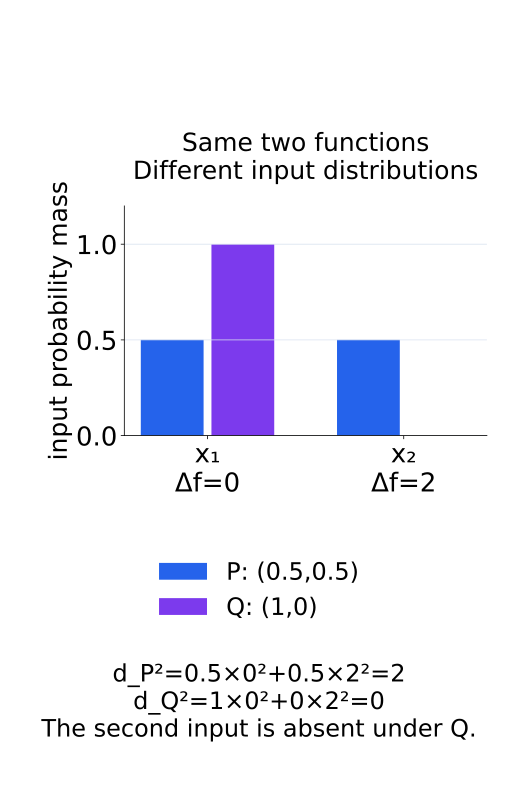
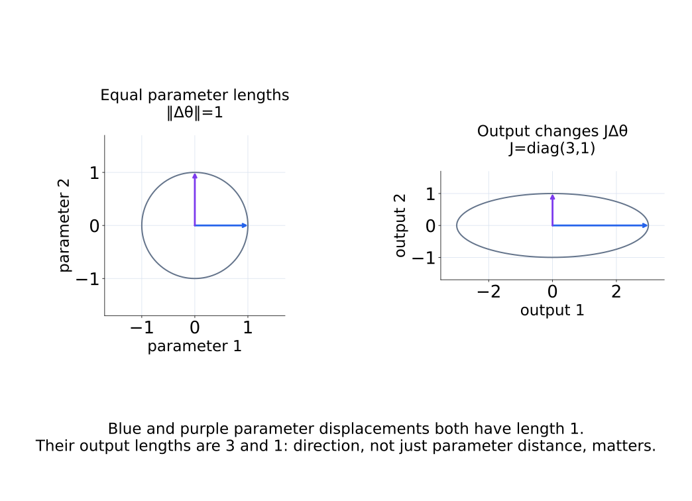
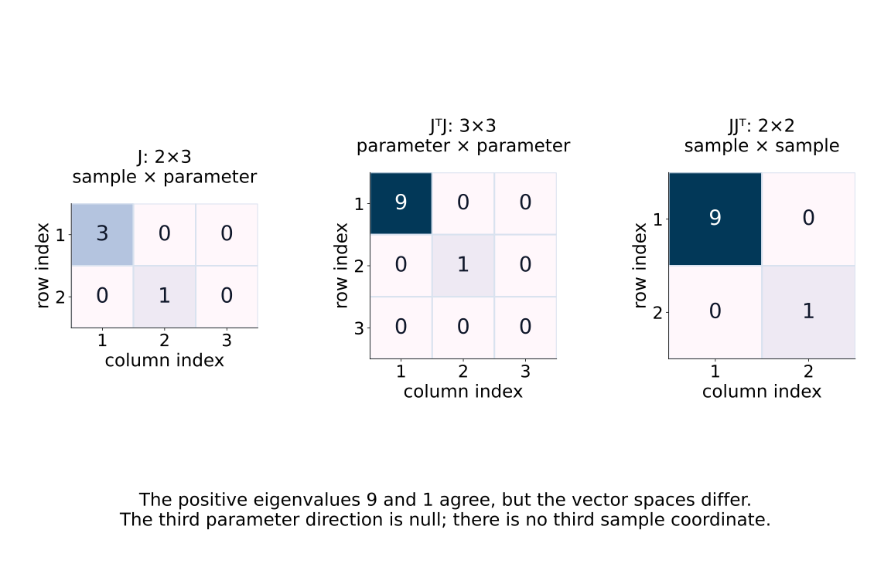
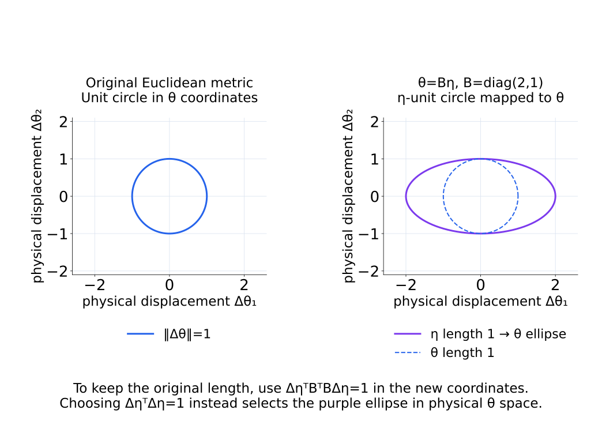
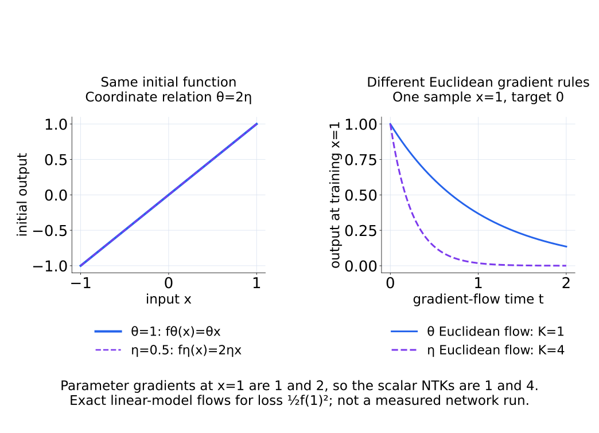
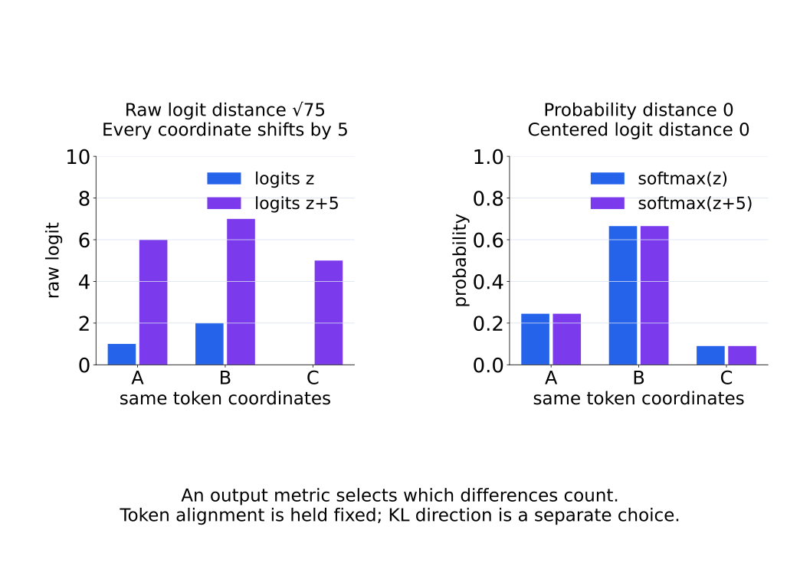
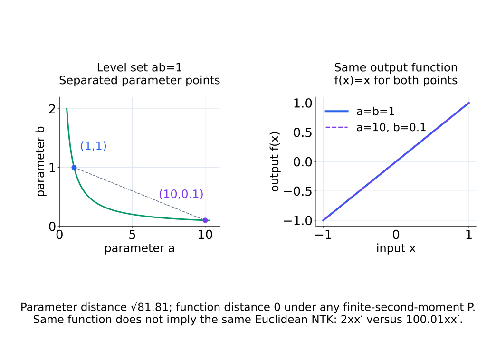
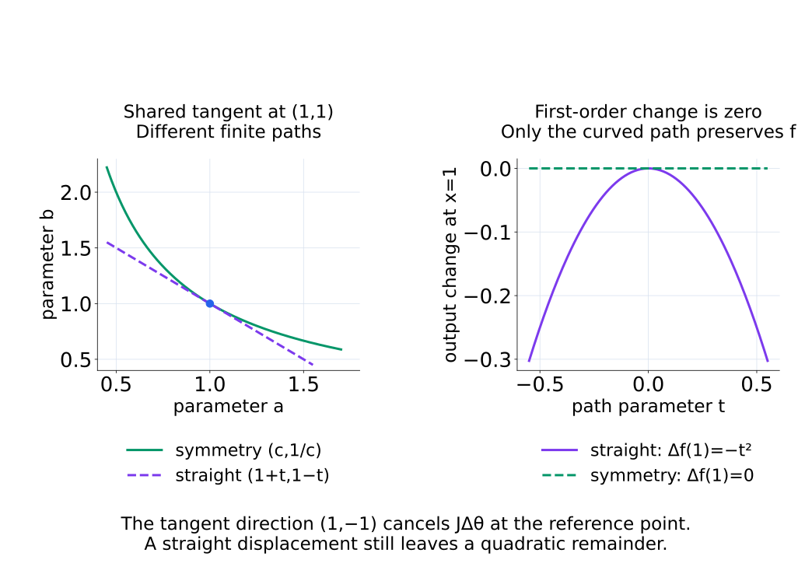

# A09-KER-07. parameter-space와 function-space 비교

## 이 단원이 필요한 이유

neural network의 parameterization에는 permutation과 scaling symmetry가 있다. 같은 함수를 나타내는 parameter point 사이의 Euclidean distance가 클 수 있다. 반대로 작은 parameter perturbation도 Jacobian의 큰 singular direction을 따르면 output을 크게 바꾼다. kernel 관점은 local parameter displacement를 function change와 연결한다.

## 학습 목표

- parameter distance와 function distance의 측정 대상을 구분할 수 있다.
- Jacobian linearization으로 local function change를 근사할 수 있다.
- reparameterization이 parameter metric과 NTK를 바꿀 수 있음을 설명할 수 있다.
- model 비교에 필요한 input distribution과 output metric을 명시할 수 있다.

## 선수지식 확인

- 선수 단원: [M03-15 재매개화와 모델 대칭성 입문](../../part-1-foundations/M03/M03-15-reparameterization-model-symmetries.md), [N05-03 MLP forward pass](../../part-2-neural-computation/N05/N05-03-mlp-forward-pass.md), [A09-KER-06 neural tangent kernel](A09-KER-06-neural-tangent-kernel.md)
- 확인 질문: hidden unit 두 개의 순서를 함께 바꾸어도 MLP output이 유지되는 이유는 무엇인가?

## 기호와 용어

| 기호·용어 | Common spoken reading | 의미 | shape·범위 |
|---|---|---|---|
| $\Delta\theta$ | `delta theta` | parameter displacement | $p$-vector |
| $J_\theta(x)\Delta\theta$ | `J sub theta of x times delta theta` | local output change의 first-order 근사 | output-shaped vector |
| $d_\Theta(\theta,\theta')$ | `d sub theta of theta and theta prime` | parameter-space distance | nonnegative scalar |
| $d_P(f,g)$ | `d sub P of f and g` | distribution $P$ 아래 function distance | nonnegative scalar |
| $B=Dg(\eta)$ | `B equals the derivative of g at eta` | parameter coordinate change의 Jacobian | 같은 차원의 local reparameterization에서는 $p\times p$ |

## 핵심 개념

### 무엇 사이의 거리를 재는가

parameter distance의 한 예는 $d_\Theta(\theta,\theta')=\lVert\theta-\theta'\rVert_2$이다. 같은 parameter 배열과 순서, 단위를 정한 뒤 weight 좌표들을 직접 비교한다. network symmetry로 좌표가 달라져도 같은 함수를 나타낼 수 있으므로 이 거리가 곧 behavior 차이는 아니다.

function distance는 input distribution $P$와 output metric을 정해

$$
d_P(f_\theta,f_{\theta'})^2
=E_{X\sim P}\left[\lVert f_\theta(X)-f_{\theta'}(X)\rVert_2^2\right]
$$

처럼 정의한다. 오른쪽 제곱 차이의 평균이 유한한 경우를 다룬다. 먼저 같은 input에서 output 차이의 제곱 norm을 구하고, 그다음 $P$에 따라 평균한다. raw parameter를 비교하는 것이 아니라 어떤 input들에서 output이 얼마나 다른지를 비교한다.

이 값이 0이라는 결론도 $P$ 기준이다. $P$가 finite prompt set에만 확률을 주면 그 set에서의 일치를 뜻하며 다른 prompt에서는 다를 수 있다. 일반적으로도 $P$-확률 0인 input에서의 차이는 반영되지 않는다. 따라서 input 전체에서 다를 수 있는 함수들을 대상으로는 엄밀한 metric이 아니라 pseudometric이고, $P$ 아래 같은 함수를 하나로 묶으면 metric으로 다룰 수 있다.

P를 바꾸면 같은 두 함수의 차이를 평균하는 위치와 비중이 달라진다.

<figure class="lesson-figure" markdown="1">

<figcaption>두 input의 output 차이를 0과 2로 고정했다. 둘 다 관찰하는 P에서는 squared distance가 2이고, 첫 input만 관찰하는 Q에서는 0이다.</figcaption>
</figure>

### Jacobian이 두 공간을 국소적으로 연결한다

작은 displacement에서는

$$
f_{\theta+\Delta\theta}(x)-f_\theta(x)
\approx J_\theta(x)\Delta\theta
$$

이다. output이 $q$차원이면 $J_\theta(x)$는 $q\times p$이고 parameter 방향을 output 방향으로 보낸다. scalar output에서는 앞 단원의 column gradient를 전치한 row가 된다. 이는 현재 point의 first-order 근사이며, $J_\theta(x)\Delta\theta=0$이어도 더 높은 차수의 변화까지 0이라는 뜻은 아니다.

사용하는 input에서 remainder가 충분히 작고 제곱 평균을 취할 수 있으면 위 근사를 distance 식에 넣어

$$
d_P(f_\theta,f_{\theta+\Delta\theta})^2
\approx\Delta\theta^\top
E_{X\sim P}[J_\theta(X)^\top J_\theta(X)]\Delta\theta
$$

를 얻는다. 같은 parameter displacement라도 Jacobian이 얼마나 증폭하거나 소거하는지에 따라 function change가 달라진다. 이 식을 population에 사용할 때는 기대값의 유한성과 근사 오차도 확인한다.

scalar output의 $n$개 sample에서 row를 쌓은 $J\in\mathbb R^{n\times p}$를 사용하면 uniform empirical squared distance는 $\lVert J\Delta\theta\rVert^2/n=\Delta\theta^\top J^\top J\Delta\theta/n$으로 근사된다. $J^\top J$는 parameter 방향의 sensitivity를, $JJ^\top$는 sample 사이의 NTK coupling을 나타낸다. SVD $J=U\Sigma V^\top$를 넣으면 각각 $V\Sigma^\top\Sigma V^\top$와 $U\Sigma\Sigma^\top U^\top$이다. nonzero eigenvalue는 같은 singular value의 제곱이지만 방향이 놓이는 공간과 index는 다르다.

다음 두 그림은 방향별 증폭과 두 Gram matrix의 index 차이를 각각 보여 준다.

<figure class="lesson-figure lesson-figure--wide" markdown="1">

<figcaption>같은 길이의 parameter displacement를 J=diag(3,1)로 보내면 output 길이는 방향에 따라 3 또는 1이다. 원과 ellipse의 각 축은 이 local gain을 나타낸다.</figcaption>
</figure>

<figure class="lesson-figure lesson-figure--wide" markdown="1">

<figcaption>JᵀJ는 세 parameter 방향을, JJᵀ는 두 sample 방향을 비교한다. positive eigenvalue 9와 1은 같지만, 세 번째 parameter의 null 방향에 해당하는 세 번째 sample 좌표는 없다.</figcaption>
</figure>

### coordinate change와 metric 선택을 구분한다

같은 차원의 smooth local reparameterization $\theta=g(\eta)$와 $B=Dg(\eta)$를 두자. 작은 displacement는 $\Delta\theta\approx B\Delta\eta$이고 chain rule로 $J_\eta=J_\theta B$가 된다. 같은 함수의 변화가 두 좌표에서 $J_\theta\Delta\theta\approx J_\eta\Delta\eta$로 표현되는 것이다.

원래 parameter의 Euclidean squared 길이를 새 좌표로 표현하면 $\lVert\Delta\theta\rVert^2\approx\Delta\eta^\top B^\top B\Delta\eta$이다. 좌표만 바꾸면서 같은 길이를 유지하려면 이 변환을 함께 사용한다. 반면 새 좌표에서도 단순히 $\lVert\Delta\eta\rVert^2$를 길이로 선택하면 일반적으로 다른 metric을 선택한 셈이다.

아래에서는 두 길이 규칙을 모두 같은 물리적 θ 좌표에 그려 비교한다.

<figure class="lesson-figure lesson-figure--wide" markdown="1">

<figcaption>θ=diag(2,1)η에서 η의 Euclidean unit circle은 θ 공간의 ellipse가 된다. 원래 θ 길이를 보존하는 규칙은 ΔηᵀBᵀBΔη를 사용하므로 두 선택은 같지 않다.</figcaption>
</figure>

두 좌표 각각의 ordinary Euclidean gradient로 NTK를 정의하면

$$
K_\eta=J_\eta J_\eta^\top
=J_\theta BB^\top J_\theta^\top
$$

이다. 이는 일반적으로 $K_\theta=J_\theta J_\theta^\top$와 다르다. $B$가 orthogonal이면 두 kernel은 같다. 함수값은 같아도 각 좌표에서 Euclidean gradient descent를 새로 정의하면 local output dynamics가 달라질 수 있다는 뜻이다. 함수값의 좌표 독립성과 optimizer의 좌표 의존성을 혼동하지 않는다.

다음 선형 toy에서는 초기 함수가 같아도 ordinary gradient를 정의하는 좌표에 따라 output 감소 속도가 달라진다.

<figure class="lesson-figure lesson-figure--wide" markdown="1">

<figcaption>θ=2η로 같은 함수를 표현해도 Euclidean parameter gradient는 1과 2이고 NTK는 1과 4이다. 한 sample의 합 squared loss 아래에서 각각 exp(−t), exp(−4t)로 줄어드는 정확한 선형 계산이다.</figcaption>
</figure>

### input과 output 비교 기준을 맞춘다

language model 비교에서는 prompt뿐 아니라 token position과 각 위치의 가중치까지 $P$에 포함한다. 두 모델의 output 좌표도 같아야 한다. 예를 들어 vocabulary 순서가 다르면 그대로 뺀 logit vector는 같은 token을 비교하지 않는다.

raw logit의 squared norm, centered logit의 norm과 probability 차이는 서로 다른 비교다. 모든 logit에 같은 상수를 더하면 softmax probability는 그대로지만 raw logit 거리는 달라진다. KL divergence를 사용한다면 비교 방향도 명시한다. KL은 일반적으로 비대칭이므로 위 Euclidean norm distance와 같은 metric이라고 부르지 않는다. 어떤 output 성질을 보존하려는지에 맞추어 비교량을 선택한다.

다음 비교는 동일한 logit 차이를 metric에 따라 다르게 취급한다.

<figure class="lesson-figure lesson-figure--wide" markdown="1">

<figcaption>세 logit에 5를 더하면 raw distance는 √75지만 centered logit과 probability의 차이는 0이다. token 좌표는 두 비교에서 동일하게 맞췄다.</figcaption>
</figure>

## 작은 예제

두 layer scalar linear network $f_{a,b}(x)=abx$에서 $(a,b)=(1,1)$과 $(10,0.1)$은 모든 $x$에 같은 함수 $f(x)=x$를 만든다. parameter distance는 크지만 function distance는 0이다.

parameter distance는 $\sqrt{9^2+(-0.9)^2}=\sqrt{81.81}$이다. 한편 $J_{a,b}(x)=(bx,ax)$이므로 scalar NTK는 $(a^2+b^2)xx'$이다. 두 point에서는 각각 $2xx'$와 $100.01xx'$가 된다. 현재 output 함수의 일치는 같은 Euclidean training geometry까지 뜻하지 않음을 볼 수 있다.

아래 그림은 parameter의 두 점과 output 함수를 나란히 보여 준다.

<figure class="lesson-figure lesson-figure--wide" markdown="1">

<figcaption>(1,1)과 (10,0.1)은 parameter 공간에서는 √81.81만큼 떨어져 있지만, 둘 다 f(x)=x이다. 같은 함수여도 두 점의 Euclidean NTK는 같지 않다.</figcaption>
</figure>

$(1,1)$에서 $(t,-t)$로 곧게 이동하면 first-order change는 $x(t-t)=0$이다. 실제 output은 $(1+t)(1-t)x=(1-t^2)x$이므로 변화가 $-t^2x$ 남는다. symmetry를 따라 $(c,1/c)$로 이동하면 곱이 정확히 1이지만, 그 곡선의 tangent 방향을 직선으로 이동하는 것은 같은 일이 아니다.

그림에서 곡선 symmetry 경로와 그 tangent를 따르는 직선 경로를 구분한다.

<figure class="lesson-figure lesson-figure--wide" markdown="1">

<figcaption>두 경로는 (1,1)에서 같은 tangent를 갖는다. 곡선은 곱 ab=1을 유지하지만 직선에는 −t²의 output 변화가 남는다.</figcaption>
</figure>

## 흔한 오해

- weight distance가 작다는 사실만으로 behavior가 비슷하다고 결론낼 수 없다.
- finite prompt set에서 function distance가 0이어도 input space 전체에서 같은 함수라고 할 수 없다.

## 연습문제

### 1. symmetry
$f_{a,b}(x)=abx$에서 $(a,b)=(2,3)$과 같은 함수를 만드는 다른 parameter pair 하나를 쓰라.

해설 보기

곱이 6이면 된다. 예를 들어 $(a,b)=(1,6)$이 같은 함수를 만든다.

### 2. linearization
$J=(2,1)$이고 $\Delta\theta=(0.1,-0.2)^\top$일 때 first-order output change를 구하라.

해설 보기

$J\Delta\theta=2(0.1)+1(-0.2)=0$이다.

### 3. two Gram matrices
$J$가 $n\times p$이면 $JJ^\top$와 $J^\top J$의 shape과 index 대상을 쓰라.

해설 보기

$JJ^\top$는 $n\times n$ sample Gram matrix이고 $J^\top J$는 $p\times p$ parameter sensitivity matrix이다.

### 4. 모델 해석
두 language model의 logits를 비교할 때 $P$와 output metric에 무엇을 명시해야 하는가?

해설 보기

prompt·token position sampling으로 $P$를 정하고 raw logits, centered logits, probability 또는 KL divergence 중 어느 output comparison을 쓰는지 명시한다.

## 근거와 갱신 경계

Jacobian linearization은 local approximation이다. displacement가 크거나 activation pattern이 바뀌면 remainder가 커질 수 있다. 자연 gradient와 quotient geometry는 이름만 언급하고 전개하지 않는다.

## 단원 요약

- parameter distance와 function distance는 측정 공간이 다르다.
- Jacobian은 local parameter displacement를 output change로 보낸다.
- $JJ^\top$와 $J^\top J$는 같은 nonzero singular spectrum을 공유하지만 index가 다르다.
- parameterization을 바꾸면 Euclidean metric과 NTK가 바뀔 수 있다.

## 통과 기준

- 두 공간의 distance를 각각 정의할 수 있는가?
- symmetry와 input sampling이 비교 결론을 제한하는 이유를 설명할 수 있는가?

## 다음 단원

- [A09-KER-08 종합 실습: kernel 관점의 학습](A09-KER-08-capstone-kernel-learning.md)

## 집필자 점검표

- [x] parameter·function distance와 Jacobian geometry를 구분했다.
- [x] 문제 4개에 해설이 있다.
- [x] Common spoken reading이 실제 영어 학술 발화이며 한글 음역이나 기계적 직역을 포함하지 않는다.
- [x] 선수지식과 링크를 확인했다.
