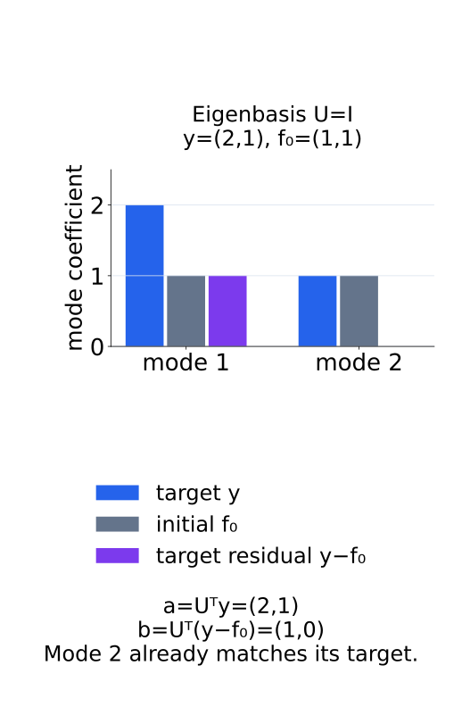
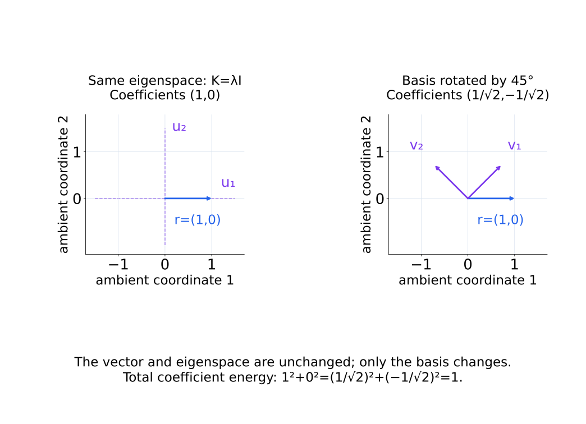
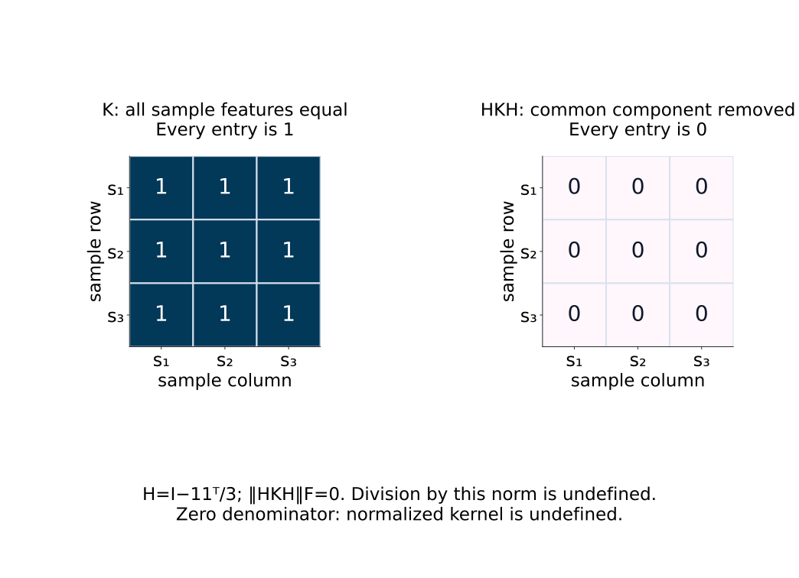
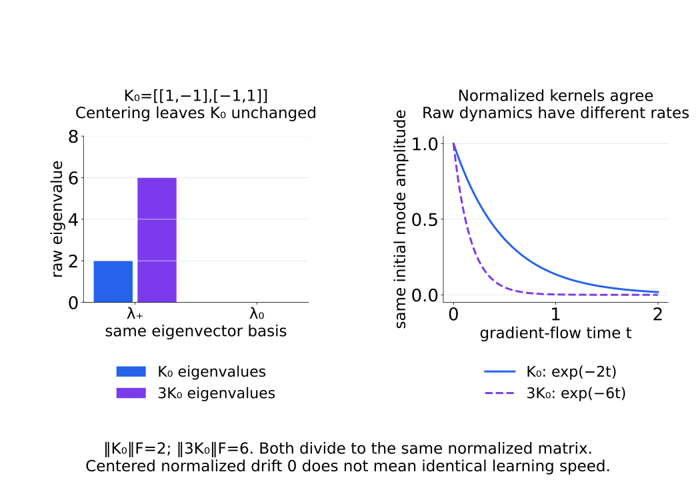
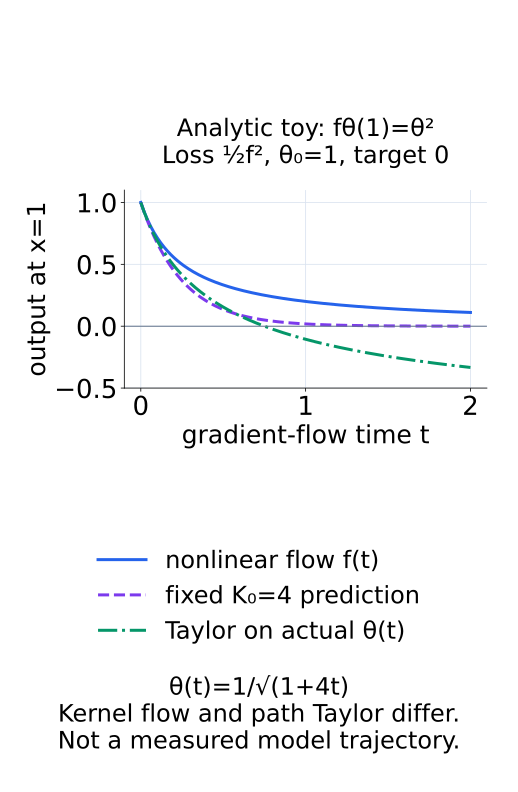
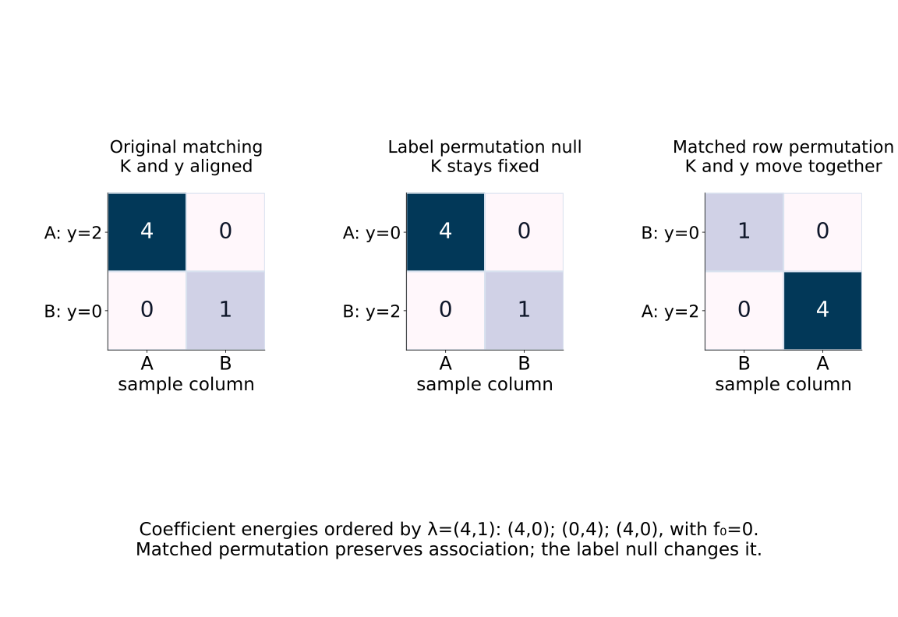
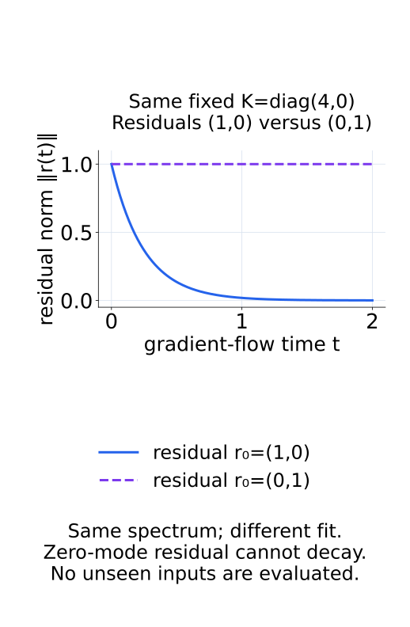

# A09-KER-08. 종합 실습: kernel 관점의 학습

## 이 단원이 필요한 이유

kernel 분석은 Gram matrix 하나를 그리는 작업으로 끝나지 않는다. input unit, centering, normalization, target, checkpoint와 null model을 고정해야 spectrum과 learning dynamics를 연결할 수 있다. 이 실습은 empirical NTK가 실제 output 변화와 얼마나 맞는지 검증하는 계약을 만든다.

## 학습 목표

- checkpoint별 empirical NTK 분석 계약을 설계할 수 있다.
- kernel spectrum과 target alignment를 계산할 수 있다.
- linearized prediction과 실제 training trajectory를 비교할 수 있다.
- 결과를 parameterization과 sampled input에 한정해 보고할 수 있다.

## 선수지식 확인

- 선수 단원: [A09-KER-01~07](A09-KER-07-parameter-function-space.md)
- 확인 질문: initialization NTK spectrum만으로 finite network의 training 전체를 예측하기 어려운 이유는 무엇인가?

## 기호와 용어

| 기호·용어 | Common spoken reading | 의미 | shape·범위 |
|---|---|---|---|
| $K_t$ | `K at checkpoint t` | checkpoint $t$의 empirical NTK | $n\times n$ |
| $\widetilde K_t$ | `the centered normalized kernel at checkpoint t` | 비교용으로 전처리한 kernel | $n\times n$ |
| $a_j=u_j^\top y$ | `a sub j equals u sub j transpose y` | target의 kernel eigenmode coefficient | scalar |
| $e_{\mathrm{lin}}(t)$ | `the linearization error at time t` | linearized prediction과 실제 output 차이 | nonnegative scalar |
| $b_j=u_j^\top(y-f_0)$ | `b sub j equals u sub j transpose times the quantity y minus f at zero` | 초기 target residual의 mode coefficient | scalar |

## 분석 계약

작은 scalar-output MLP 두 seed를 같은 data order와 optimizer 설정으로 학습하는 계약을 작성한다. 이 단원에서는 새 학습을 실행하거나 결과를 가정하지 않는다. 고정한 $n$개 input의 순서와 scalar target $y$, initialization output $f_0$를 기록하고 같은 input에서 여러 checkpoint의 Jacobian을 비교한다. sample row가 바뀌면 kernel entry의 대상도 달라지므로 순서는 checkpoint 전체에서 유지한다.

아래 예측식은 full-batch ordinary gradient descent, 합으로 정규화한 squared loss $\tfrac12\lVert f-y\rVert^2$, 추가 regularization이 없는 설정을 기준으로 한다. learning rate와 parameter 배열·dtype도 기록한다. mini-batch, adaptive optimizer나 다른 loss를 사용한 결과에 이 예측식을 그대로 맞추지 않는다.

output scale을 변환한다면 target과 output에 사용할 규칙을 먼저 정하고 모든 checkpoint에 고정한다. checkpoint마다 output을 사후 재정규화한 뒤 원래 Jacobian과 비교하면 같은 dynamics를 측정하지 않는다. kernel의 centering·normalization은 구조 비교용 전처리로 별도 관리하고, 학습 속도 예측에는 원래의 $K_t=J_tJ_t^\top$와 loss normalization을 사용한다.

sample은 input 비교 단위이며 seed는 initialization을 바꾼 반복이다. 같은 prompt의 여러 token을 사용하면 uncertainty의 최상위 단위는 prompt로 둔다. 두 seed는 seed별 차이를 보여 주지만 그 수만으로 안정적인 seed 분포나 정밀한 confidence interval을 보장하지 않는다.

## 측정 절차

1. 각 checkpoint에서 $J_t\in\mathbb R^{n\times p}$와 $K_t=J_tJ_t^\top$를 계산한다. 수치 symmetry와 dtype, matrix scale에 맞춘 PSD tolerance를 확인한다.
2. population operator와 연결할 spectrum·effective dimension에는 $K_t/n$을 사용하고 $\tau$를 같은 scale에 둔다. fixed-kernel dynamics에는 합 loss의 $K_0$를 사용한다. target coefficient와 초기 residual coefficient를 구분한다.
3. 구조 비교용 kernel drift와 원래 kernel의 scale 변화를 따로 기록한다.
4. fixed $K_0$ prediction과 실제 output을 같은 initialization, target, learning rate에서 비교한다. 실제 parameter 경로를 넣은 Taylor prediction과도 구분한다.
5. label permutation의 alignment null과 input 순서 변경의 consistency control을 구분한다.
6. hidden-unit permutation으로 function과 NTK를 보존하는 control을 정의하고 raw parameter distance의 변화를 확인한다.

### target coefficient와 학습 residual

$K_0u_j=\lambda_ju_j$의 orthonormal eigenvector basis를 사용하면 $a_j=u_j^\top y$는 target 자체의 성분이다. 학습이 줄여야 하는 차이는 $y-f_0$이므로 그 성분은 $b_j=a_j-u_j^\top f_0$이다. $f_0$가 0이 아니면 $a_j$와 $b_j$를 바꾸어 쓰지 않는다. zero eigenvalue에 놓인 residual은 fixed-kernel flow에서 남는다. spectrum만으로 fit을 말하려면 residual이 어느 mode에 얼마나 놓였는지도 필요하다.

아래 수치 그림에서는 target coefficient가 있어도 이미 맞춘 mode의 초기 residual은 0이다.

<figure class="lesson-figure" markdown="1">

<figcaption>U=I, y=(2,1), f₀=(1,1)인 계산 예시이다. target에는 두 mode가 있지만 실제로 줄여야 하는 차이 y−f₀는 첫 mode에만 있다.</figcaption>
</figure>

eigenvector는 부호를 바꿀 수 있고 반복 eigenvalue의 eigenspace 안에서는 basis도 바꿀 수 있다. 따라서 coefficient의 부호나 개별 축만 비교하지 않고 제곱 coefficient, 반복 eigenvalue subspace의 coefficient 제곱 합을 사용한다. checkpoint마다 eigenbasis를 다시 구한 local alignment와 고정한 $u_j$에서 추적하는 residual decay는 다른 기록이다.

다음 basis 회전은 같은 residual의 개별 coefficient가 달라져도 subspace의 총량은 유지됨을 보여 준다.

<figure class="lesson-figure lesson-figure--wide" markdown="1">

<figcaption>K=λI의 eigenspace에서 basis를 45° 회전하면 coefficient (1,0)은 (1/√2,−1/√2)로 바뀐다. vector와 coefficient 제곱 합 1은 바뀌지 않는다.</figcaption>
</figure>

### 구조 drift와 scale drift

예를 들어 $H=I-\mathbf1\mathbf1^\top/n$으로 centering하고 $\widetilde K_t=HK_tH/\lVert HK_tH\rVert_F$로 정규화할 수 있다. 분모가 0이면 이 normalized kernel은 정의하지 않고 그 사실을 기록한다. centered kernel로 target alignment를 계산하면 target과 residual도 각각 $Hy$, $H(y-f_0)$로 맞춘다.

아래에서는 centering으로 모든 성분이 사라지는 경우를 먼저 확인한다.

<figure class="lesson-figure lesson-figure--wide" markdown="1">

<figcaption>모든 sample의 feature가 같아 K의 entry가 1이면 HKH는 0이다. 분모가 0이므로 normalized kernel을 정의할 수 없고, 0 matrix를 정규화 결과로 기록해서는 안 된다.</figcaption>
</figure>

$\lVert\widetilde K_t-\widetilde K_0\rVert_F$는 centered geometry의 형태가 얼마나 달라졌는지를 본다. $K_t=cK_0$이고 $c>0$이면 이 drift는 0일 수 있지만 합 loss의 학습 속도는 $c$배 달라진다. 그러므로 $\lVert K_t\rVert_F$와 raw drift도 함께 기록한다. relative raw drift $\lVert K_t-K_0\rVert_F/\lVert K_0\rVert_F$는 $\lVert K_0\rVert_F>0$일 때만 사용한다.

다음 두 kernel은 normalized 형태가 같지만 raw eigenvalue와 decay rate는 다르다.

<figure class="lesson-figure lesson-figure--wide" markdown="1">

<figcaption>K₀와 3K₀는 Frobenius norm으로 나누면 같은 matrix가 된다. 그러나 positive mode의 raw eigenvalue는 2와 6이므로 동일 초기 residual의 감소 속도는 세 배 다르다.</figcaption>
</figure>

### 같은 경로에서 무엇을 예측하는가

columns가 $u_j$인 matrix를 $U$로 두면 continuous-time 기준은 $\widehat f_t=y+U\operatorname{diag}(\exp(-\lambda_jt))U^\top(f_0-y)$이다. 실제 full-batch step과 비교할 때는 iteration $s$에서

$$
\widehat f_{s+1}=\widehat f_s-\eta_sK_0(\widehat f_s-y),\qquad
\widehat f_0=f_0
$$

로 fixed-kernel prediction을 만든다. 평균 loss이면 $K_0/n$으로 바꾼다. 동일 초기 조건과 step을 사용해야 kernel 근사 오차와 시간·loss scale 불일치를 구분할 수 있다. $e_{\mathrm{lin}}(t)=\lVert\widehat f_t-f_t\rVert/\sqrt n$은 이 예측의 sample당 root-mean-square 차이로 둔다.

반면 $f_0+J_0(\theta_t-\theta_0)$는 실제 parameter 경로에 초기 Taylor 식을 적용한 output이다. 이것을 $f_t$와 비교하면 해당 경로의 first-order remainder를 본다. fixed-kernel model은 자체 갱신 경로를 예측하므로 두 비교를 같은 error로 합치지 않는다. drift와 두 error가 다르게 움직일 때에는 scale, loss/step 계약과 remainder를 각각 확인한다.

아래 analytic toy는 두 prediction이 같은 곡선이 아님을 보인다. 새 network 실험 결과는 아니다.

<figure class="lesson-figure" markdown="1">

<figcaption>fθ(1)=θ², θ₀=1, target 0, loss ½f²에서 θ(t)=1/√(1+4t)이다. 원래 output θ(t)², fixed K₀=4의 exp(−4t), 실제 경로에 적용한 Taylor output 1+2(θ(t)−1)을 구분한다.</figcaption>
</figure>

### null과 symmetry control의 역할

초기 $K_0$를 고정하고 label의 sample 대응을 섞으면 spectrum은 그대로이고 target/residual alignment만 바뀐다. 이 null을 확률적 검정으로 해석하려면 label이 해당 sampling unit 안에서 교환 가능하다는 가정이 필요하다. 원래 label로 학습한 후의 $K_t$를 고정한 permutation은 이미 label을 반영한 geometry의 조건부 진단이다. 학습 pipeline 전체의 null과 같다고 하지 않으며, 전체 null을 설계할 때는 label을 바꾼 재학습 여부도 명시한다.

input row의 순서를 permutation matrix $\Pi$로 바꾸면 kernel은 $\Pi K\Pi^\top$가 되어 spectrum이 보존된다. target과 initialization output도 같은 $\Pi$로 바꾸면 alignment도 보존된다. 이것은 구현의 consistency control이다. input만 바꾸고 target을 그대로 두면 대응을 끊는 별도 control이므로 두 절차를 혼동하지 않는다.

다음 그림에서는 label만 섞는 경우와 sample 대응을 유지하며 row를 옮기는 경우를 비교한다.

<figure class="lesson-figure lesson-figure--wide" markdown="1">

<figcaption>f₀=0이고 eigenvalue를 (4,1) 순서로 정렬했다. label null에서는 target energy가 (4,0)에서 (0,4)로 옮겨가지만, kernel과 label을 함께 옮긴 consistency control에서는 (4,0)이 유지된다.</figcaption>
</figure>

hidden-unit permutation은 incoming/outgoing weight와 bias를 모두 맞게 바꿀 때 같은 함수를 보존한다. trainable parameter 전체에 대한 orthogonal permutation이므로 Euclidean NTK도 보존된다. raw parameter distance는 달라질 수 있지만 output과 NTK 차이는 수치 tolerance 안이어야 한다. 이 결론은 permutation control에 관한 것이며, 앞 단원의 scaling symmetry처럼 같은 함수여도 NTK가 달라지는 경우까지 확장하지 않는다.

## 결과 기록표

| 측정 | 답하는 질문 | 해석 제한 |
|---|---|---|
| NTK spectrum | sampled input의 local learning modes | feature semantics |
| target alignment | label residual이 어느 mode에 놓이는가 | population generalization |
| kernel drift | fixed-kernel 근사가 얼마나 변하는가 | drift의 원인 |
| linearization error | $K_0$ dynamics의 예측 적합도 | 다른 optimizer regime |
| symmetry control | raw parameter distance의 비식별성 | 모든 reparameterization |

NTK spectrum의 큰 eigenvalue, 초기 residual의 큰 coefficient, 작은 구조 drift와 작은 output prediction error는 서로 대체할 수 없는 관찰이다. 같은 normalized geometry여도 scale이 달라질 수 있고, 안정적인 geometry여도 residual이 zero mode에 놓이면 fit되지 않는다. 이 연결을 수치와 함께 보고하되, 실제 측정하지 않은 칸에는 예상 결과를 채우지 않는다. unseen input을 평가하지 않았다면 sampled training input의 local geometry와 fit에 한정한다.

그림은 같은 spectrum만으로 두 fit 결과를 구분할 수 없는 이유를 보여 준다.

<figure class="lesson-figure" markdown="1">

<figcaption>K=diag(4,0)을 고정해도 초기 residual이 (1,0)이면 줄어들고 (0,1)이면 남는다. 계산한 training mode의 결과이며 unseen input의 성능을 보여 주지는 않는다.</figcaption>
</figure>

## 흔한 오해

- centered normalized kernel이 비슷해도 output function이 같다고 결론낼 수 없다.
- target alignment가 높아도 test split과 null label에서 검증하지 않으면 generalization 증거가 아니다.

## 연습문제

### 1. unit
token 1,000개를 같은 prompt 20개에서 얻었다. uncertainty를 계산할 때 최상위 resampling unit을 무엇으로 두는가?

해설 보기

같은 prompt의 token이 의존하므로 prompt를 최상위 resampling unit으로 둔다.

### 2. PSD
수치 계산한 $K$의 최소 eigenvalue가 $-10^{-10}$이고 최대 eigenvalue가 $20$이다. 무엇을 먼저 확인하는가?

해설 보기

$K$를 $(K+K^\top)/2$로 대칭화했는지와 dtype·relative tolerance를 확인한다. 이 크기는 floating-point error일 수 있다.

### 3. drift
kernel drift는 작지만 linearization error가 커졌다. 어떤 항목을 점검하는가?

해설 보기

kernel normalization이 scale 변화를 숨겼는지, discrete learning rate와 loss 가정이 맞는지, output offset과 Jacobian linearization remainder를 점검한다.

### 4. claim
두 seed에서 초기 NTK target alignment가 높았고 training이 빨랐지만 unseen input을 평가하지 않았다. 결론을 어떻게 제한하는가?

해설 보기

측정한 training input에서 초기 tangent geometry가 target residual과 정렬되었고 빠른 fit과 함께 관찰됐다고 쓴다. population generalization은 주장하지 않는다.

## 근거와 갱신 경계

이 실습은 squared-loss gradient-flow 식을 finite-step training의 진단 기준으로 사용한다. optimizer와 loss가 다르면 예측식을 바꾸며, NTK 결과를 representation의 유일한 설명으로 쓰지 않는다.

## 단원 요약

- NTK 분석은 input unit과 parameterization을 포함한 계약이 필요하다.
- spectrum, target alignment와 kernel drift는 서로 다른 양이다.
- fixed-kernel prediction은 실제 output trajectory와 비교해야 한다.
- null label과 symmetry control이 해석 범위를 드러낸다.

## 통과 기준

- input–Jacobian–kernel–target–trajectory 계약을 완성할 수 있는가?
- spectrum 증거와 function prediction 증거를 분리할 수 있는가?

## 다음 단원

- 다음 선택 모듈은 A09-RMT이다.

## 집필자 점검표

- [x] kernel spectrum과 실제 학습 trajectory의 검증 계약을 완성했다.
- [x] 문제 4개에 해설이 있다.
- [x] Common spoken reading이 실제 영어 학술 발화이며 한글 음역이나 기계적 직역을 포함하지 않는다.
- [x] 선수지식과 링크를 확인했다.
