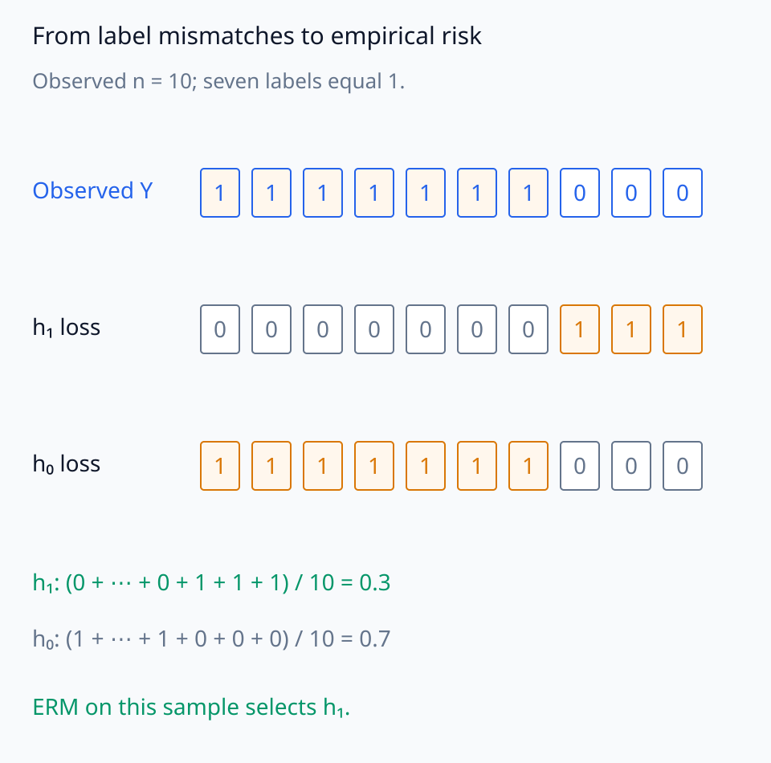
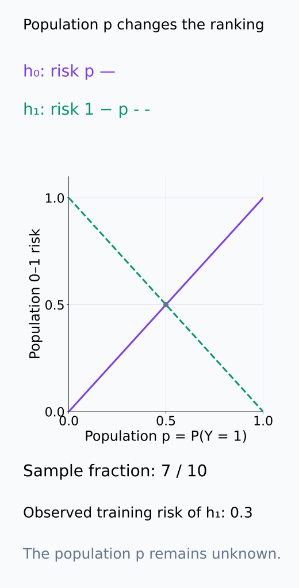

# A09-LRN-01. hypothesis class와 risk

## 이 단원이 필요한 이유

학습 algorithm은 가능한 predictor 전체가 아니라 정한 hypothesis class 안에서 data에 맞는 함수를 고른다. population risk와 empirical risk를 구분해야 training fit, approximation error와 generalization을 분해할 수 있다.

## 학습 목표

- hypothesis class와 learning algorithm을 구분할 수 있다.
- population·empirical risk를 쓸 수 있다.
- empirical risk minimization의 목적과 한계를 설명할 수 있다.
- loss·data distribution·class가 estimand를 정하는 방식을 설명할 수 있다.

## 선수지식 확인

- 선수 단원: [M04-06 표본과 모집단](../../part-1-foundations/M04/M04-06-samples-populations-sampling-distributions.md), [M04-08 회귀와 분류](../../part-1-foundations/M04/M04-08-regression-classification.md)
- 확인 질문: sample average loss와 새로운 sample에서의 expected loss는 왜 같은 random quantity가 아닌가?

## 기호와 용어

| 기호·용어 | Common spoken reading | 의미 | shape·범위 |
|---|---|---|---|
| $\mathcal H$ | `the hypothesis class H` | candidate predictor 집합 | set of functions |
| $R(h)$ | `the risk of h` | population expected loss | scalar |
| $\hat R_n(h)$ | `the empirical risk of h on n samples` | sample average loss | scalar |
| $\hat h$ | `h hat` | data-dependent selected hypothesis | element of $\mathcal H$ |

## 핵심 개념

### 가능한 함수와 함수를 고르는 규칙

hypothesis class $\mathcal H$는 입력을 예측값으로 보내는 함수의 집합이다. 예를 들어 affine linear probe의 class는 허용한 $w,b$로 표현되는 모든 $h(x)=w^\top x+b$를 포함한다. 특정 학습 결과 하나가 class 전체인 것은 아니다. learning algorithm은 training data를 받아 이 집합에서 하나의 함수를 선택하는 규칙이며, initialization이나 sampling에 무작위성이 있으면 같은 data에서도 선택 결과가 달라질 수 있다.

class가 같은 두 algorithm도 같은 predictor를 내놓을 필요는 없다. optimizer의 시작점·종료 조건·동률 처리나 regularization이 선택을 바꾸기 때문이다. 따라서 class가 허용하는 함수와 실제 절차가 선택하는 함수를 구분한다.

아래 후보 직선과 표시한 두 선택 결과를 구별한다.

<figure class="lesson-figure" markdown="1">

<figcaption>affine class의 일부 직선을 회색으로 그렸다. 설명용 A의 h(x) = x와 B의 h(x) = 0.5x + 1도 같은 class 안에 있지만 서로 다른 선택 결과다. 회색 직선 몇 개가 class 전체라는 뜻이나 두 선택이 ERM이라는 뜻은 아니다.</figcaption>

</figure>

### population 평균과 관측한 평균

data $Z=(X,Y)\sim P$와 loss $\ell$에 대해

$$
R(h)=E_P[\ell(h(X),Y)],
\qquad
\hat R_n(h)=\frac1n\sum_{i=1}^n\ell(h(X_i),Y_i).
$$

$R(h)$는 predictor $h$를 고정하고 target distribution $P$에서 새로운 $(X,Y)$를 뽑을 때의 평균 loss다. $\hat R_n(h)$는 실제로 얻은 $n$개 관측값의 loss를 더해 나눈 값이다. 같은 $h$라도 sample이 바뀌면 empirical risk가 바뀐다. loss의 기대값이 존재하고 관측값이 $P$에서 i.i.d.로 뽑혔다면, 미리 고정한 $h$에 대해서는 $E[\hat R_n(h)]=R(h)$이다.

학습한 $\hat h$는 training data로 선택한 함수다. $R(\hat h)$를 평가할 때는 선택된 함수를 고정하고 training data와 독립인 새 관측값을 평균한다. 같은 training data에서 계산한 $\hat R_n(\hat h)$에는 함수 선택의 영향이 들어가므로, 고정된 $h$에 대한 위 등식을 그대로 적용할 수 없다.

loss와 distribution을 바꾸면 동일한 predictor의 risk도 바뀐다. 예를 들어 prompt별 비중을 바꾸면 각 prompt의 loss가 평균에 들어가는 가중치가 달라진다. class는 고정한 $h$의 risk 정의를 바꾸지 않지만, 비교하거나 최적화할 수 있는 함수의 범위를 정한다. probe 성능을 해석하려면 무엇을 예측했는지뿐 아니라 어떤 population과 loss, 어떤 class 안에서 평가했는지도 명시해야 한다.

함수 선택의 영향과 population 가중치의 영향을 아래 별개 그림에서 확인한다.

<figure class="lesson-figure lesson-figure--tall" markdown="1">

<figcaption>설명용 p = 0.5, n = 10에서 모든 label-count 경우의 정확한 확률을 계산했다. 고정 h₁의 empirical risk 평균은 0.5지만 매 sample에서 더 잘 맞는 constant를 고르면 training 평균은 약 0.377이다. 두 constant의 population risk는 모두 0.5라 선택 후에도 0.5이다.</figcaption>

</figure>

<figure class="lesson-figure" markdown="1">

<figcaption>같은 predictor와 group별 mean loss 0.1·0.9를 고정한 설명용 계산이다. A의 population 비중 w가 0.5이면 risk는 0.5이고, w = 0.9이면 0.18이다. 가설군은 비교 가능한 함수의 범위를 정하며, 이 고정 predictor의 가중 risk를 직접 바꾸는 것은 P의 비중이다.</figcaption>

</figure>

### ERM과 세 가지 오차 원인

empirical risk minimization(ERM)은 $\hat h\in\arg\min_{h\in\mathcal H}\hat R_n(h)$를 고른다. 이 표기는 minimum을 달성하는 함수가 존재한다고 가정한다. 실제 optimizer가 거기에 도달하지 못할 수 있고, regularized loss를 최소화하는 절차는 일반적으로 원래 loss의 ERM과 다른 문제를 푼다.

오차 원인을 구분하려면 비교 대상을 나누어야 한다. 허용한 모든 predictor 중 population risk가 가장 작은 predictor와 $\mathcal H$ 안의 최선 사이의 차이는 approximation error다. 유한한 sample로 함수를 고르기 때문에 class 안 population 최선을 놓치는 문제는 estimation error와 관련된다. 정한 training objective의 최솟값까지 계산이 도달하지 못한 차이는 optimization error다. 여기서는 최적해가 존재하는 경우로 설명하며, 존재하지 않으면 최소값 대신 infimum으로 비교한다. 이 구분만으로 임의의 학습 결과에 세 개의 비음수 항을 정확히 더하는 분해식이 생기는 것은 아니다.

class가 너무 제한적이면 data를 늘려도 approximation error가 남을 수 있다. 반대로 class가 풍부하면 training sample의 우연한 패턴까지 따라가며 empirical risk를 낮출 수 있다. ERM의 목적은 training 평균을 최소화하는 것이므로, 그 결과가 새 sample에서도 좋은지는 별도의 generalization 문제다.

아래 두 목적함수 축에서 각 오차가 쓰는 비교 대상을 확인한다.

<figure class="lesson-figure lesson-figure--tall" markdown="1">

<figcaption>설명용으로 위 population risk의 unrestricted 최선 0.1, class 안 최선 0.2, 선택 결과 0.35를 놓았다. 아래 optimization 비교는 별도 training objective의 최소 0.05와 실제 값 0.08이다. 두 축의 차이를 임의로 세 항의 비음수 합으로 묶지 않는다.</figcaption>

</figure>

## 작은 예제

constant classifier class $\mathcal H=\{h_0,h_1\}$에서 label 10개 중 7개가 1이면 empirical 0–1 risk는 $\hat R(h_1)=0.3$, $\hat R(h_0)=0.7$이다.

$h_1$은 항상 1을 예측하므로 label이 0인 세 관측값에서만 틀린다. ERM은 이 sample에서 $h_1$을 선택한다. 그러나 population에서 label 1의 확률이 $p$라면 $R(h_1)=1-p$, $R(h_0)=p$다. 관측한 비율 $7/10$과 알지 못하는 population 확률 $p$를 구분해야 하며, training risk $0.3$을 곧바로 population risk라고 부를 수 없다.

아래 sample별 loss 계산과 population p의 risk 곡선을 구분해 읽는다.

<figure class="lesson-figure lesson-figure--wide" markdown="1">

<figcaption>기존 10개 label 예제에서 순서는 설명을 위해 1 일곱 개 뒤에 0 세 개로 정했다. loss 행의 1은 오답, 0은 정답이다. h₁의 loss 합 3과 h₀의 loss 합 7을 각각 10으로 나눠 ERM의 sample 선택을 확인한다.</figcaption>

</figure>

<figure class="lesson-figure" markdown="1">

<figcaption>가로축은 sample의 7/10이 아니라 population의 알지 못하는 p이다. h₀와 h₁의 population risk는 각각 p와 1 − p라 p = 1/2에서 순위가 바뀐다. training sample에서 선택한 h₁의 0.3은 이 곡선의 어느 p인지 확정하지 못한다.</figcaption>

</figure>

## 흔한 오해

- hypothesis class 크기만으로 실제 optimizer가 탐색한 effective class가 정해지는 것은 아니다.
- test set으로 hypothesis를 반복 선택하면 test risk도 낙관적으로 편향된다.

## 연습문제

### 1. empirical risk
loss가 $(0,1,0,1)$이면 empirical risk를 구하라.

해설 보기

평균은 $2/4=0.5$이다.

### 2. class
linear probe의 hypothesis class를 $h(x)=w^\top x+b$로 제한하면 무엇이 제한되는가?

해설 보기

activation에서 label을 복원하는 decision function의 형태가 affine linear map으로 제한된다.

### 3. approximation
Bayes predictor가 $\mathcal H$에 없으면 empirical data가 무한히 많아져도 무엇이 남을 수 있는가?

해설 보기

class 안 최선과 Bayes risk 사이의 approximation error가 남을 수 있다.

### 4. 모델 해석
probe test accuracy를 population claim으로 읽으려면 distribution을 어떻게 명시해야 하는가?

해설 보기

prompt·label·token·layer sampling을 포함한 target population과 train/test sampling protocol을 명시해야 한다.

## 근거와 갱신 경계

hypothesis class, risk와 ERM은 statistical learning theory의 표준 정의를 따른다. optimization error의 정밀 분석은 다루지 않는다.

## 단원 요약

- hypothesis class는 가능한 predictor의 집합이다.
- population risk와 empirical risk는 서로 다른 양이다.
- ERM은 sample loss를 최소화하지만 generalization을 자동 보장하지 않는다.
- loss와 target distribution이 학습 주장의 대상을 정한다.

## 통과 기준

- population·empirical risk를 계산할 수 있는가?
- approximation·estimation·optimization 문제를 구분할 수 있는가?

## 다음 단원

- [A09-LRN-02 bias–variance decomposition](A09-LRN-02-bias-variance-decomposition.md)

## 집필자 점검표

- [x] hypothesis class·algorithm·risk를 구분했다.
- [x] 문제 4개에 해설이 있다.
- [x] Common spoken reading이 실제 영어 학술 발화이며 한글 음역이나 기계적 직역을 포함하지 않는다.
- [x] 선수지식과 링크를 확인했다.
