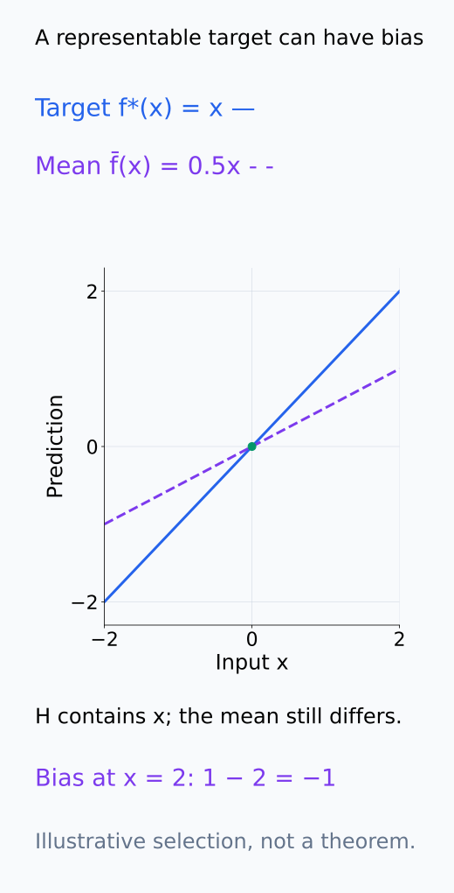
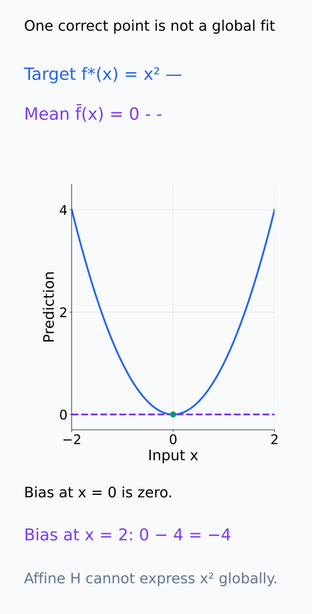
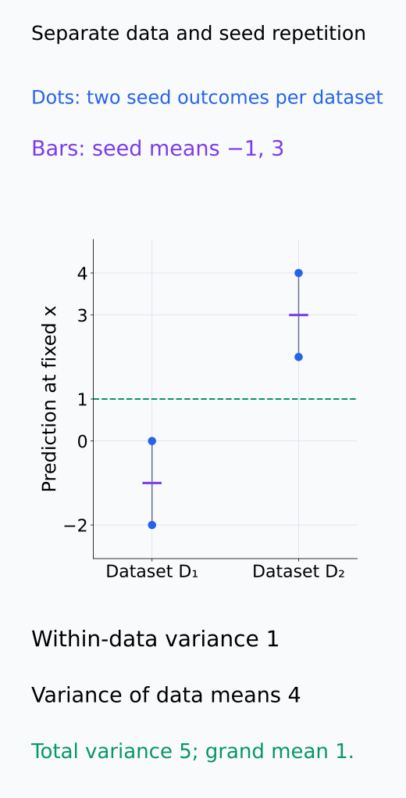
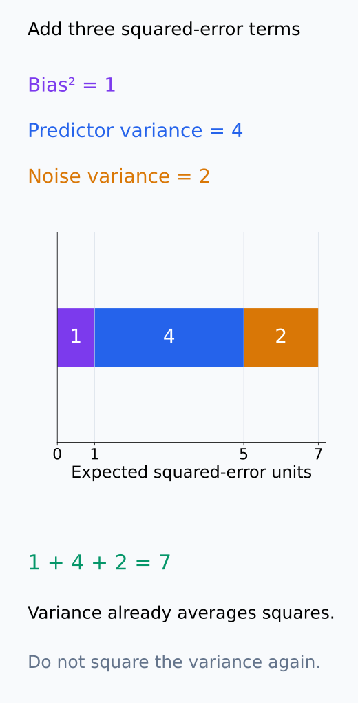

# A09-LRN-02. bias–variance decomposition

## 이 단원이 필요한 이유

training set을 바꾸었을 때 predictor가 얼마나 흔들리는지와 평균 predictor가 target에서 얼마나 벗어나는지는 다른 오차 원인이다. squared-loss bias–variance decomposition은 이 둘과 irreducible noise를 분리한다.

## 학습 목표

- pointwise squared prediction error를 bias·variance·noise로 분해할 수 있다.
- estimator bias와 model misspecification을 구분할 수 있다.
- decomposition의 loss·sampling 가정을 설명할 수 있다.
- seed variance와 data-sampling variance를 분리할 수 있다.

## 선수지식 확인

- 선수 단원: [A09-LRN-01 hypothesis class와 risk](A09-LRN-01-hypothesis-class-risk.md), [M04-07 추정의 bias와 variance](../../part-1-foundations/M04/M04-07-estimation-bias-variance.md)
- 확인 질문: estimator의 expectation은 무엇에 대한 반복을 뜻하는가?

## 기호와 용어

| 기호·용어 | Common spoken reading | 의미 | shape·범위 |
|---|---|---|---|
| $\hat f_D(x)$ | `f hat trained on D evaluated at x` | dataset $D$로 학습한 predictor | scalar |
| $\bar f(x)$ | `f bar of x` | dataset 평균 predictor | scalar |
| $\operatorname{Bias}(x)$ | `the bias at x` | $\bar f(x)-f^*(x)$ | scalar |
| $\operatorname{Var}(x)$ | `the variance at x` | predictor의 dataset 변동 | nonnegative scalar |
| $f^*(x)$ | `f star of x` | $E[Y\mid X=x]$인 regression target | scalar |

## 핵심 개념

### 하나의 입력에서 무엇을 반복하는가

먼저 평가할 입력 $x$를 고정한다. $f^*(x)=E[Y\mid X=x]$는 같은 입력에서 관측할 수 있는 label의 조건부 평균이다. training dataset $D$를 다시 뽑고 같은 학습 절차를 적용하면 $\hat f_D(x)$가 바뀐다. $\bar f(x)=E_D[\hat f_D(x)]$는 이 반복에서 얻는 예측값의 평균이지, 한 번 학습한 predictor의 예측값이 아니다.

이때 $\operatorname{Bias}(x)=\bar f(x)-f^*(x)$이고 $\operatorname{Var}(x)=E_D[(\hat f_D(x)-\bar f(x))^2]$다. bias는 평균 예측의 어긋남이고 variance는 개별 예측이 그 평균 주위에서 흔들리는 정도다. variance의 중심은 target $f^*(x)$가 아니라 평균 predictor $\bar f(x)$라는 점을 구분한다.

아래 두 분포의 중심과 거리에서 bias·variance·noise를 구별한다.

<figure class="lesson-figure lesson-figure--tall" markdown="1">

<figcaption>기존 bias 1, predictor variance 4, noise variance 2를 설명하려고 f* = 0, 예측 −1·3과 독립 label ±√2를 각각 같은 확률로 두었다. predictor의 중심은 1이고 label의 중심은 0이다. predictor variance를 target 0 주위에서 계산하지 않는다.</figcaption>

</figure>

### 세 항으로 나뉘는 계산

$Y=f^*(X)+\varepsilon$, $E[\varepsilon\mid X]=0$, $\operatorname{Var}(\varepsilon\mid X=x)=\sigma^2(x)$이고 test label이 training dataset과 독립이라고 하자. 각 항의 두 번째 moment가 유한하면

$$
E_{D,Y\mid x}[(\hat f_D(x)-Y)^2]
=\operatorname{Bias}(x)^2+\operatorname{Var}(x)+\sigma^2(x).
$$

왜 세 항만 남는지는 예측 오차를 다음처럼 나누면 확인할 수 있다.

$$
\hat f_D(x)-Y
=\bigl(\hat f_D(x)-\bar f(x)\bigr)
+\bigl(\bar f(x)-f^*(x)\bigr)-\varepsilon.
$$

첫 괄호는 dataset 반복 평균이 0이고 둘째 괄호는 고정된 값이다. 따라서 두 괄호의 곱은 기대값을 취하면 0이 된다. test noise도 평균이 0이고 training dataset과 독립이므로 나머지 교차항의 평균이 0이다. 제곱을 전개하고 평균하면 세 항의 제곱 평균만 남는다. bias에는 제곱이 붙지만 variance와 noise variance는 이미 제곱의 평균이므로 다시 제곱하지 않는다.

이것은 고정한 $x$에서의 항등식이다. 전체 population risk를 얻으려면 마지막에 target distribution의 $X$에 대해서도 평균한다. noise variance가 입력에 따라 달라도 같은 계산을 할 수 있으며, 모든 입력에서 동일한 상수일 필요는 없다. 반면 training label을 test label처럼 재사용하면 독립성 조건이 깨져 위 교차항 소거를 그대로 주장할 수 없다.

교차항의 소거를 아래 독립 조합의 실제 곱으로 확인한다.

<figure class="lesson-figure" markdown="1">

<figcaption>위 설명용 두 예측에서 r = f̂ − f̄ = ±2이고 ε = ±√2이다. 독립인 네 조합의 확률이 각각 1/4라 E[rε] = 0이다. r과 ε 각각의 평균이 0이므로 고정 bias와의 나머지 교차항도 평균 0이 된다. 한 번의 곱 자체가 0이라는 뜻은 아니다.</figcaption>

</figure>

### bias와 class 제약의 관계

여기서 bias는 $f^*(x)$를 추정하는 예측값의 통계적 bias다. parameter estimator의 bias와는 target과 단위가 다를 수 있다. model misspecification은 class가 target 관계를 표현하지 못하는 문제인 반면, 이 bias는 class와 학습 절차, sample 크기가 함께 정하는 평균 예측의 오차다. class가 $f^*$를 포함해도 regularization이나 유한 sample에서의 선택 때문에 bias가 남을 수 있다. 한 입력에서 bias가 0이라는 사실도 class가 전체 target 함수를 표현한다는 증거는 아니다.

classification 0–1 loss나 cross entropy에는 같은 단순한 additive decomposition이 그대로 적용되지 않는다. 위 계산은 차이를 제곱하고 전개하는 구조를 이용했으므로, 다른 loss에서는 그 loss에 맞는 정의와 분해를 따로 확인해야 한다.

아래 class 포함 관계와 한 점의 일치를 다른 질문으로 읽는다.

<figure class="lesson-figure" markdown="1">

<figcaption>설명용 target f*(x) = x는 affine class 안에 있다. 그 class에서 학습 절차가 평균 f̄(x) = 0.5x를 선택한다고 두면 x ≠ 0의 bias가 남는다. class의 표현 가능성과 절차의 평균 선택을 비교한 것이며 특정 regularization의 보편적 효과를 증명하지 않는다.</figcaption>

</figure>

<figure class="lesson-figure" markdown="1">

<figcaption>설명용 target x²와 affine class 안 평균 predictor 0을 비교했다. x = 0에서는 bias가 0이지만 다른 입력에서는 차이가 있다. 한 점의 일치로 affine class가 target 함수 x² 전체를 표현한다고 판단하지 않는다.</figcaption>

</figure>

### data 반복과 seed 반복

위 식은 training dataset sampling을 반복 대상으로 삼는다. 학습 randomness까지 포함하려면 seed도 함께 반복하도록 expectation을 정해야 한다. 전체 predictor 변동에는 같은 data 안에서의 seed 변동과, 각 data에서 seed 평균을 낸 predictor가 dataset 사이에서 달라지는 변동이 모두 들어간다. 같은 data에서 initialization만 20번 바꾸면 전자를 주로 측정하며, 후자까지 포함한 전체 sampling variance를 측정하지는 않는다. dataset과 seed 중 무엇을 고정하고 바꾸었는지 적어야 variance 수치를 비교할 수 있다.

아래 dataset별 seed 점과 평균 막대에서 반복의 중심을 확인한다.

<figure class="lesson-figure" markdown="1">

<figcaption>설명용 D₁의 seed 예측 −2·0, D₂의 예측 2·4를 같은 확률로 두었다. 각 data 안 variance는 1이고, data별 seed 평균 −1·3의 variance는 4이며 전체 variance는 5이다. 같은 D₁에서 seed만 반복하면 dataset 사이의 이 4를 측정하지 않는다.</figcaption>

</figure>

## 작은 예제

$\bar f(x)-f^*(x)=1$, predictor variance가 4, noise variance가 2이면 expected squared error는 $1+4+2=7$이다.

이 7은 한 predictor가 한 label에서 낸 squared error가 아니다. 여러 training dataset에서 학습한 predictor와 독립인 새 label을 반복 평가한 평균이다. 첫 항 1은 평균 predictor 자체의 어긋남, 둘째 항 4는 predictor 사이의 흔들림, 셋째 항 2는 동일 입력에서도 label이 달라지는 변동을 뜻한다.

개별 오차와 세 항의 기대값 합을 아래에서 따로 확인한다.

<figure class="lesson-figure" markdown="1">

<figcaption>D₁·D₂의 예측 −1·3과 label −√2·+√2의 네 독립 조합을 계산했다. D₁−처럼 아래 첨자 뒤 부호는 label의 부호다. 각 squared error는 다르지만 네 값의 평균이 7이다. 모델 반복 실험값이 아닌 정확한 설명용 계산이다.</figcaption>

</figure>

<figure class="lesson-figure" markdown="1">

<figcaption>기존 예제의 세 항 1·4·2를 squared-error 단위의 한 축에서 더했다. bias 1을 제곱한 첫 항도 1이고, variance 4와 noise variance 2는 이미 제곱의 평균이다. 4²나 2²를 더하는 그림이 아니다.</figcaption>

</figure>

## 흔한 오해

- regularization이 언제나 bias를 늘리고 variance를 줄인다는 설명은 모든 regime의 theorem이 아니다.
- seed variance가 작다고 dataset shift에 안정적인 것은 아니다.

## 연습문제

### 1. 합산
bias가 $-2$, variance가 3, noise variance가 1이면 expected squared error는 얼마인가?

해설 보기

$(-2)^2+3+1=8$이다.

### 2. noise
irreducible noise가 learner를 바꾸어도 남는 이유는 무엇인가?

해설 보기

같은 $X=x$에서도 $Y$가 조건부로 변하는 data-generating randomness이기 때문이다.

### 3. 반복 단위
data split을 고정하고 probe initialization만 20번 바꾸면 어떤 variance를 주로 측정하는가?

해설 보기

고정 data에서 optimizer·initialization에 따른 algorithmic variance를 측정한다.

### 4. 적용 범위
accuracy에 squared-loss decomposition 숫자를 그대로 붙이면 안 되는 이유는 무엇인가?

해설 보기

0–1 loss는 quadratic expansion의 교차항 소거 구조를 그대로 갖지 않기 때문이다.

## 근거와 갱신 경계

squared-loss bias–variance decomposition은 regression의 표준 항등식이다. modern overparameterized regime의 double descent는 이 항등식만으로 설명하지 않는다.

- [Stanford CS229 Bias–Variance, pp. 40–45](https://cs229.stanford.edu/notes2022fall/bias-variance-annotated.pdf): training-set 평균과 독립 label에 대한 제곱 오차 전개를 대조했다. bias의 부호는 본문의 $\bar f-f^*$ convention을 따른다.

## 단원 요약

- squared error는 bias squared, variance와 noise로 분해된다.
- expectation이 반복하는 data·seed source를 명시한다.
- seed stability와 sampling stability는 다르다.
- 다른 loss에는 같은 식을 자동 적용하지 않는다.

## 통과 기준

- 주어진 bias·variance·noise에서 error를 계산할 수 있는가?
- probe 반복 설계가 어떤 variance를 측정하는지 말할 수 있는가?

## 다음 단원

- [A09-LRN-03 generalization gap](A09-LRN-03-generalization-gap.md)

## 집필자 점검표

- [x] decomposition의 loss와 반복 단위를 명시했다.
- [x] 문제 4개에 해설이 있다.
- [x] Common spoken reading이 실제 영어 학술 발화이며 한글 음역이나 기계적 직역을 포함하지 않는다.
- [x] 선수지식과 링크를 확인했다.
