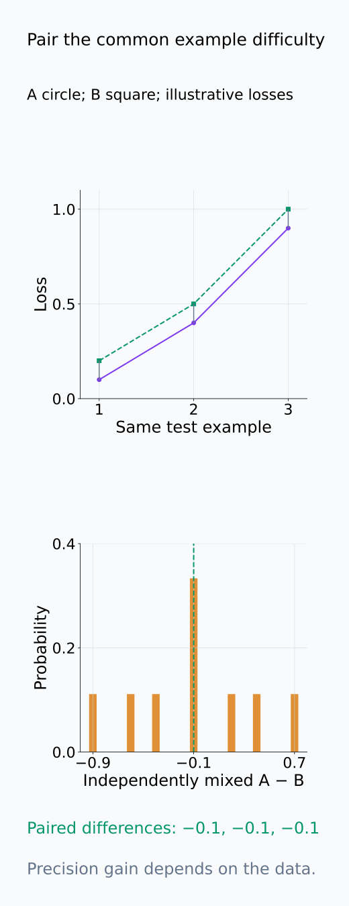

# A09-LRN-03. generalization gap

## 이 단원이 필요한 이유

train performance와 unseen performance의 차이는 학습된 predictor의 sample dependence를 드러낸다. generalization gap은 하나의 측정량이며, 작은 gap만으로 낮은 population risk나 distribution shift robustness가 보장되지는 않는다.

## 학습 목표

- expected·observed generalization gap을 구분할 수 있다.
- fixed hypothesis와 data-dependent hypothesis의 차이를 설명할 수 있다.
- validation reuse가 gap 추정을 편향시키는 이유를 설명할 수 있다.
- confidence interval과 paired comparison을 설계할 수 있다.

## 선수지식 확인

- 선수 단원: [A09-LRN-01 hypothesis class와 risk](A09-LRN-01-hypothesis-class-risk.md), [M04-09 신뢰구간](../../part-1-foundations/M04/M04-09-confidence-intervals-bootstrap.md)
- 확인 질문: 학습된 $\hat h$가 training sample의 함수라는 사실은 왜 중요한가?

## 기호와 용어

| 기호·용어 | Common spoken reading | 의미 | shape·범위 |
|---|---|---|---|
| $R(\hat h)-\hat R_n(\hat h)$ | `the generalization gap of h hat` | population minus train risk | scalar |
| $\hat R_{\mathrm{test}}(\hat h)$ | `the test risk of h hat` | held-out risk estimate | scalar |
| $E_S$ | `expectation over samples S` | dataset 반복 expectation | operator |
| $\Delta_i$ | `delta sub i` | paired loss difference | scalar |

## 핵심 개념

### 한 번의 gap과 반복 평균

학습 sample $S$에서 얻은 $\hat h_S$의 generalization gap은

$$
R(\hat h_S)-\hat R_S(\hat h_S)
$$

이다. $\hat R_S$의 아래첨자 $S$는 평균을 낸 training sample을, $\hat h_S$의 아래첨자는 그 sample로 선택한 predictor를 가리킨다. $S$를 다시 뽑아 학습하면 predictor와 training 평균이 함께 바뀐다. expected generalization gap은 이 전체 차이의 $E_S$이며, 하나의 학습 결과에서 얻은 차이와 구분한다. seed도 반복하려면 expectation에 그 randomness를 포함한다.

population risk $R$을 모르므로, 선택에 쓰지 않은 독립 test sample의 평균으로 대체한 것이 observed gap이다. training 결과를 고정했을 때 이 test 평균은 같은 target distribution의 risk를 추정한다. test가 유한하면 observed gap과 population-minus-training gap 사이에는 test sampling 오차가 남는다. test prompt만 bootstrap한 구간은 이 학습 결과를 조건으로 한 불확실성을 다루며, training sample을 바꾸어 재학습했을 때의 변동까지 포함하지 않는다.

아래 training 결과별 population target과 유한 test 관측을 구별한다.

<figure class="lesson-figure" markdown="1">

<figcaption>네 training 결과를 같은 확률의 설명용 law로 두었다. population-minus-train gap 0.10·0.05·0.05·0.05의 평균은 0.0625이다. 빈 원의 observed gap 0.14·0·0.07·0.04에는 각 유한 test의 오차가 더해졌다. 실제 retraining 실험이나 empirical test 평균을 이론적 기댓값으로 확정한 그림이 아니다.</figcaption>

</figure>

### 고정한 함수의 법칙을 그대로 옮길 수 없는 이유

loss의 기대값이 존재하고 $S$가 i.i.d. sample이면, sample을 보기 전에 고정한 $h$에 대해 $E_S[\hat R_S(h)]=R(h)$이다. 따라서 그 함수의 expected gap은 0이다. 반면 $\hat h_S$는 sample을 보고 선택했으므로, 평균 연산 안의 함수도 $S$와 함께 움직인다. 미리 고정한 함수의 표본 평균 법칙만으로 이 선택 결과의 expected gap이 0이라고 결론 낼 수 없다.

gap은 risk 자체의 크기를 말하지 않는다. 같은 loss에서 train과 test error가 모두 0.45면 차이는 작아도 예측이 좋은지는 별개다. gap은 항상 양수라는 정의도 아니다. test sampling 오차로 observed gap이 음수가 될 수 있으며, 비교하는 train/test loss나 augmentation 조건이 다르면 차이에는 그 조건 차이까지 들어간다. learning-theory gap으로 읽으려면 동일한 loss와 target distribution에서 비교해야 한다.

아래 risk 좌표와 대각선에서 gap의 크기와 error의 수준을 따로 읽는다.

<figure class="lesson-figure" markdown="1">

<figcaption>기존 0.10·0.16 예제는 대각선보다 0.06 위에 있다. 0.45·0.45는 gap 0이어도 두 error가 높다. 설명용 0.25·0.20은 observed gap −0.05이다. 이 그림의 test 평균은 population risk와 동일한 것으로 확정하지 않는다.</figcaption>

</figure>

### validation 선택을 포함한 학습 절차

hyperparameter·layer·probe type을 validation 결과로 반복 선택하면 selection process 전체가 learner가 된다. 후보마다 validation 오차가 있고, 그중 가장 좋은 관측값을 고르면 우연히 유리했던 후보가 선택될 수 있다. 그 validation 평균을 선택된 모델의 새 population 성능처럼 다시 보고하면 selection 효과를 무시하게 된다. 최종 평가는 선택에 사용하지 않은 test set에서 수행하고, 어떤 후보들을 어떤 규칙으로 골랐는지 기록한다.

동일 template 안의 독립 test와 새로운 template의 test는 목표가 다르다. 전자는 같은 sampling distribution에서의 risk를, 후자는 새 target distribution에서의 risk를 평가한다. 후자의 차이를 training risk와 빼면 학습 sample 의존성뿐 아니라 distribution 차이도 섞이므로 iid gap과 동일한 양으로 해석하지 않는다.

validation의 후보 선택과 평가 population의 변화를 아래에서 분리한다.

<figure class="lesson-figure" markdown="1">

<figcaption>설명용 네 후보의 population risk를 모두 0.20으로 두고 validation 관측만 0.23·0.18·0.11·0.25로 달라지게 했다. C를 고르면 가장 유리하게 낮아진 관측값 0.11도 함께 고른다. 이 한 예는 selection의 가능 경로를 설명하며 bias의 보편적 크기나 test 결과를 측정한 것은 아니다.</figcaption>

</figure>

<figure class="lesson-figure lesson-figure--tall" markdown="1">

<figcaption>설명용 동일 h의 A·B group error 0.1·0.9를 고정했다. source P와 같은 population은 A 비중 0.9이고 risk 0.18이다. Q에서 A 비중이 0.2이면 risk는 0.74가 된다. 이 비교는 population 목표의 차이이며 관측 training risk를 포함한 iid gap이라고 부르지 않는다.</figcaption>

</figure>

### 같은 test example에서의 paired 비교

두 probe A와 B를 동일한 test example에서 비교할 때 $\Delta_i=\ell_A(i)-\ell_B(i)$로 둔다. 이 차이의 평균은 두 population risk 차이를 추정한다. 각 example이 쉬운지 어려운지에 따른 공통 변동을 함께 유지하려면 A와 B의 loss를 따로 재표집하지 않고, example 또는 독립 prompt 묶음을 단위로 paired bootstrap한다. pairing은 공통 변동이 큰 경우 비교의 불확실성을 줄일 수 있지만, 반드시 더 정밀하다는 보장은 아니다.

두 generalization gap의 차이를 구하려면 test loss 차이의 평균에서 두 training risk의 차이도 빼야 한다. 학습한 두 probe와 training risk를 고정한 구간에서는 이 training 차이가 상수다. 학습 절차 자체를 비교하려면 training data·seed의 반복까지 별도로 설계해야 한다. 같은 prompt의 token들을 독립 sample처럼 재표집해서 그 반복을 대신할 수는 없다.

아래 같은 example의 연결과 training 차이 보정에서 paired 비교의 대상을 확인한다.

<figure class="lesson-figure lesson-figure--tall" markdown="1">

<figcaption>설명용 세 example에서 A loss 0.1·0.4·0.9와 B loss 0.2·0.5·1을 썼다. 같은 example의 차이는 모두 −0.1이지만 A·B를 따로 뽑으면 서로 다른 난이도를 섞는다. 이 구성의 공통 변동은 pairing의 효용을 보여 주며 모든 실험에서 variance가 줄어든다는 보장은 아니다.</figcaption>

</figure>

<figure class="lesson-figure" markdown="1">

<figcaption>A는 기존 train 0.10·test 0.16이고 설명용 B는 0.12·0.15이다. test 차이 0.01에서 train 차이 −0.02를 빼면 gap 차이 0.03이다. A·B와 training risk를 고정한 paired test 구간에서는 이 train 차이는 상수다.</figcaption>

</figure>

## 작은 예제

train error 0.10, 독립 test error 0.16이면 observed gap은 0.06이다. test set uncertainty를 함께 보고해야 한다.

두 error가 같은 0–1 loss라면 $0.16-0.10$은 오류율 6 percentage points 차이다. 그러나 test sample 수와 독립 sampling 단위를 모르면 이 차이의 정밀도는 알 수 없다. training 결과를 고정하고 test example이 독립이면 test 오류율의 standard error는 대략 $\sqrt{\hat p(1-\hat p)/m}$이며, 여기서 $\hat p=0.16$, $m$은 test example 수다. prompt 안의 여러 관측값이 종속이면 이 식의 $m$에 전체 row 수를 그대로 넣지 않는다.

아래 test 수의 비교는 학습 결과를 고정한 조건부 sampling으로 읽는다.

<figure class="lesson-figure lesson-figure--tall" markdown="1">

<figcaption>설명용으로 학습한 h와 train error 0.10, population test error 0.16을 고정했다. iid test 수 25·400의 정확한 binomial law는 같은 gap 0.06 주위에서 다른 spread를 갖는다. 이는 고정 h의 test sampling이며 data·seed를 바꾼 재학습 변동은 포함하지 않는다.</figcaption>

</figure>

## 흔한 오해

- train과 test error가 둘 다 높으면 gap이 작아도 좋은 model이 아니다.
- iid gap이 작다는 사실은 다른 domain으로의 generalization을 보장하지 않는다.

## 연습문제

### 1. gap
train loss 0.25, test loss 0.31의 observed gap을 구하라.

해설 보기

$0.31-0.25=0.06$이다.

### 2. negative gap
observed gap이 음수가 될 수 있는가?

해설 보기

가능하다. finite sample variation, regularized training objective 차이, augmentation 등으로 test estimate가 train loss보다 작을 수 있다.

### 3. validation reuse
100개 layer 중 validation accuracy가 가장 높은 layer를 골랐다면 무엇을 기록해야 하는가?

해설 보기

layer search 전체를 selection procedure로 기록하고 독립 test set에서 선택된 layer를 한 번 평가해야 한다.

### 4. shift
held-out prompt template가 train template와 같으면 어떤 일반화만 검사하는가?

해설 보기

그 template population 안의 iid generalization을 주로 검사하며 새로운 template·domain 일반화는 별도 split이 필요하다.

## 근거와 갱신 경계

generalization gap과 held-out evaluation은 learning theory와 experimental design의 표준 정의를 따른다. adaptive data analysis의 정량 bound는 다루지 않는다.

- [Cornell CS4783 Lecture 2, §2](https://www.cs.cornell.edu/courses/cs4783/2022sp/notes02.pdf): 고정 hypothesis의 concentration과 sample-dependent selection의 차이를 대조했다.

## 단원 요약

- gap은 population risk와 train risk의 차이다.
- test risk도 finite sample estimate다.
- model selection을 한 validation set은 최종 test가 아니다.
- iid generalization과 distribution shift를 구분한다.

## 통과 기준

- observed gap과 uncertainty를 계산할 수 있는가?
- selection procedure를 평가 split 설계에 반영할 수 있는가?

## 다음 단원

- [A09-LRN-04 VC dimension](A09-LRN-04-vc-dimension.md)

## 집필자 점검표

- [x] gap·test uncertainty·selection bias를 연결했다.
- [x] 문제 4개에 해설이 있다.
- [x] Common spoken reading이 실제 영어 학술 발화이며 한글 음역이나 기계적 직역을 포함하지 않는다.
- [x] 선수지식과 링크를 확인했다.
