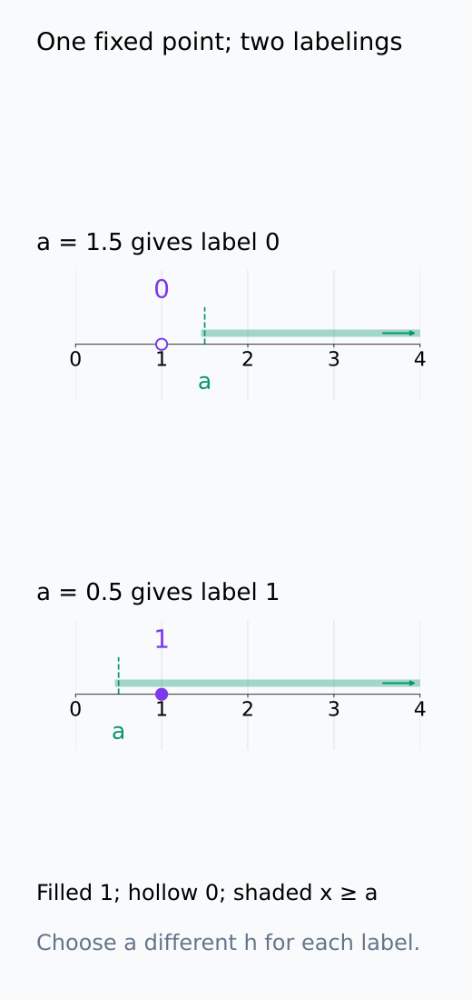
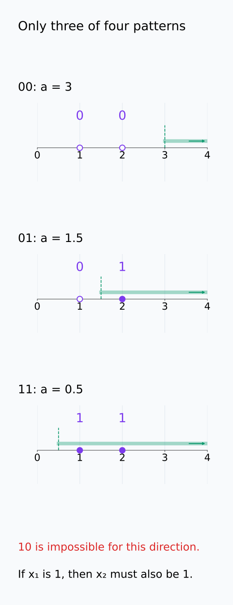
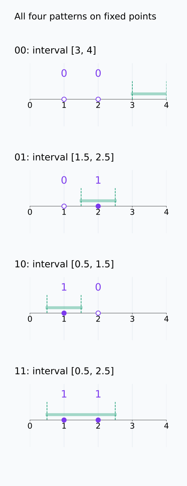
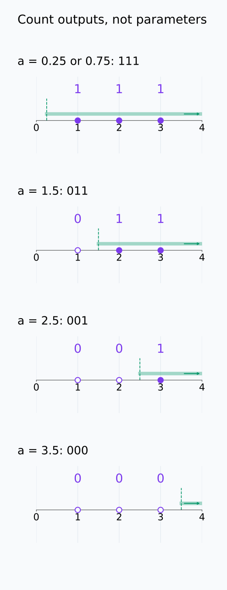
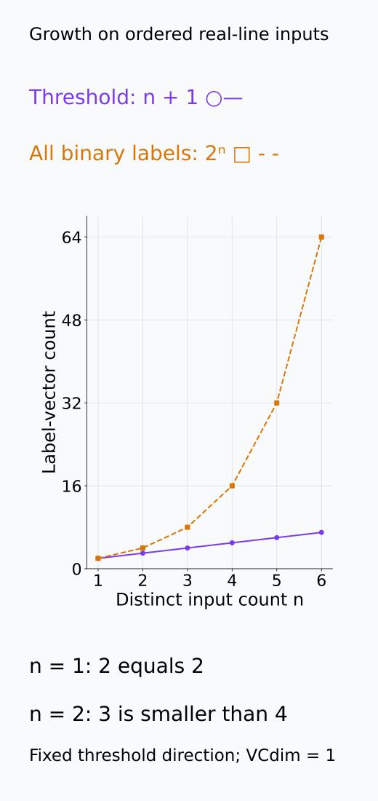
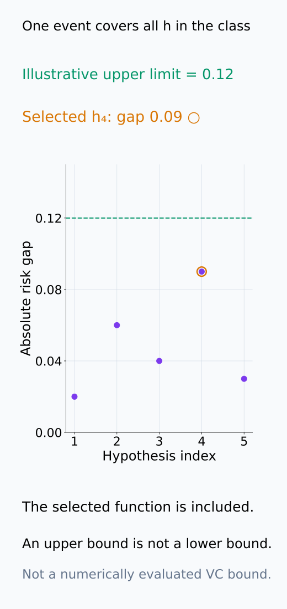
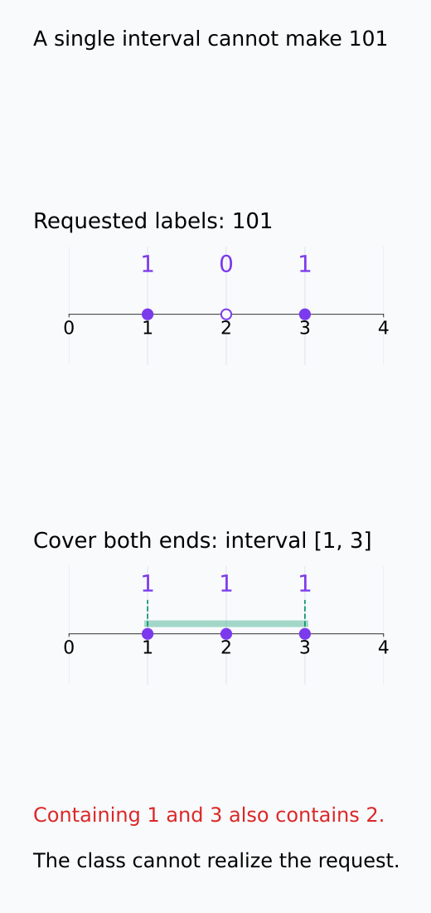

# A09-LRN-04. VC dimension

## 이 단원이 필요한 이유

parameter 수만으로 binary classifier class의 표현력을 비교하기 어려울 때 shattering은 가능한 label pattern 전체를 기준으로 capacity를 정의한다. VC dimension은 distribution-free uniform generalization bound의 대표적 complexity measure다.

## 학습 목표

- shattering과 VC dimension을 정의할 수 있다.
- 간단한 threshold·interval class의 VC dimension을 구할 수 있다.
- growth function과 uniform convergence의 관계를 설명할 수 있다.
- VC bound의 worst-case 성격을 설명할 수 있다.

## 선수지식 확인

- 선수 단원: [A09-LRN-01 hypothesis class와 risk](A09-LRN-01-hypothesis-class-risk.md), [M00-07 집합과 논리](../../part-1-foundations/M00/M00-07-sets-conditions-logic.md)
- 확인 질문: $n$개 점의 binary label pattern은 모두 몇 개인가?

## 기호와 용어

| 기호·용어 | Common spoken reading | 의미 | shape·범위 |
|---|---|---|---|
| $\operatorname{VCdim}(\mathcal H)$ | `the V C dimension of H` | 최대 shatter 가능한 점 수 | nonnegative integer or infinity |
| $\Pi_{\mathcal H}(n)$ | `the growth function of H at n` | $n$개 점에서 가능한 label 수의 최댓값 | integer |
| $S$ | `S` | finite input set | set of points |
| $2^n$ | `two to the n` | 모든 binary labeling 수 | positive integer |

## 핵심 개념

### shattering의 두 양화사

$S=\{x_1,\ldots,x_n\}$의 모든 $2^n$ binary labeling을 $\mathcal H$가 실현하면 $S$를 shatter한다고 한다. 서로 다른 입력점을 고정한 뒤, 임의의 $(y_1,\ldots,y_n)\in\{0,1\}^n$에 대해 $h(x_i)=y_i$를 모든 $i$에서 만족하는 $h\in\mathcal H$가 있어야 한다. label pattern이 바뀔 때 다른 $h$를 선택해도 된다. 한 함수가 여러 pattern을 동시에 출력해야 한다는 뜻은 아니다.

VC dimension은 shatter 가능한 가장 큰 점 수다. 이때 어떤 위치의 점 집합이 하나라도 shatter되면 그 크기는 가능하다. 모든 위치의 점 집합이 shatter되어야 하는 것은 아니다. 반대로 VC dimension이 $d$라고 증명하려면 $d$개 점을 shatter하는 예를 보이고, $d+1$개 점의 어떤 집합도 shatter할 수 없음을 보여야 한다. 임의로 큰 유한 집합을 shatter할 수 있으면 dimension은 infinity다.

한 점을 고정한 채 다른 함수를 고르는 모습을 먼저 보면 shattering의 함수 선택 순서가 드러난다.

<figure class="lesson-figure" markdown="1">

<figcaption>동일한 점 x₁=1을 고정하고 threshold a를 바꾸면 label 0과 1을 각각 실현한다. 한 함수가 두 label을 동시에 내는 것이 아니라 labeling마다 함수를 다르게 고른다.</figcaption>

</figure>

### threshold와 interval의 label 순서

real line의 threshold class $h_a(x)=1[x\ge a]$에서 $1[\cdot]$는 조건이 참이면 1, 거짓이면 0을 내는 indicator다. 한 점 $x_1$의 label은 $a\le x_1$이면 1, $a>x_1$이면 0으로 만들 수 있다. 그러나 두 점 $x_1<x_2$에서 왼쪽이 1이면 오른쪽도 1이다. threshold를 어디로 옮겨도 $(1,0)$을 만들 수 없으므로 VC dimension은 1이다. threshold의 방향도 반대로 허용하는 다른 class와 혼동하지 않는다.

interval indicator는 하나의 구간 안에서만 1을 낸다. 두 정렬된 점에서는 둘 다 포함하거나, 하나씩 포함하거나, 둘 다 제외하는 구간을 골라 네 pattern을 모두 만든다. 세 정렬된 점에서는 양 끝을 포함하는 구간이 가운데도 포함하므로 $(1,0,1)$은 불가능하다. 모든 세 점 집합에 이 정렬 논리가 적용되므로 VC dimension은 2다.

다음 두 그림은 같은 두 점에 가능한 label을 모두 대입해 threshold와 interval의 차이를 비교한다.

<figure class="lesson-figure lesson-figure--tall" markdown="1">

<figcaption>두 점 (1,2)에서 threshold는 00, 01, 11을 실현하지만 10은 실현하지 못한다. 색과 숫자 label을 함께 읽으면 positive 영역이 오른쪽으로 이어지는 제약이 보인다.</figcaption>

</figure>

<figure class="lesson-figure lesson-figure--tall" markdown="1">

<figcaption>점 (1,2)을 움직이지 않고 구간만 바꾸어 네 labeling을 모두 만든다. 구간을 점 밖으로 옮기는 경우는 두 점을 모두 제외하는 00에 해당한다.</figcaption>

</figure>

### growth function에서 uniform convergence로

growth function $\Pi_{\mathcal H}(n)$은 $n$개 입력에서 class가 만드는 서로 다른 label vector의 최대 개수다. 함수가 무한히 많아도 같은 $n$개 점에서 출력이 같으면 같은 vector 하나로 센다. 항상 $\Pi_{\mathcal H}(n)\le 2^n$이고, 등호이면 어떤 $n$개 점 집합을 shatter할 수 있다. 위 방향이 고정된 threshold에서는 정렬된 점 사이와 양 끝에서 경계를 옮기는 경우만 있으므로 $\Pi_{\mathcal H}(n)=n+1$이다.

binary classifier와 0–1 loss, 동일 population의 i.i.d. sampling이라는 조건에서 finite VC dimension은 uniform convergence를 제어한다. uniform이라는 말은 한 함수만 미리 골라 평균을 비교하는 것이 아니라, 높은 확률로 $\sup_{h\in\mathcal H}|R(h)-\hat R_n(h)|$가 작아진다는 뜻이다. 이 사건이 성립하면 sample을 보고 고른 $\hat h$에도 같은 차이의 상한을 적용할 수 있다. 유한 dimension에서는 충분히 큰 $n$에서 가능한 label vector 수의 증가가 제어되며, 이것이 class 전체의 우연한 training fit을 동시에 다루는 근거가 된다. 여기서는 통상적인 measurability 조건을 가정하고, 그 기술적 문제나 growth bound의 증명은 다루지 않는다.

sample 위에서 같은 출력은 한 번만 세며, uniform 사건은 선택한 함수 하나가 아니라 class 전체를 포함한다.

<figure class="lesson-figure lesson-figure--tall" markdown="1">

<figcaption>세 점 (1,2,3)에서 경계를 옮겨도 네 종류의 출력 vector만 생긴다. a=0.25와 a=0.75는 서로 다른 함수지만 이 sample에서는 같은 111이므로 한 번만 센다.</figcaption>

</figure>

<figure class="lesson-figure" markdown="1">

<figcaption>고정 방향 threshold의 가능한 pattern 수는 n+1이다. n=1에서는 모든 labeling과 같지만 n=2부터는 2ⁿ보다 작아서 그 크기의 집합을 shatter하지 못한다.</figcaption>

</figure>

<figure class="lesson-figure" markdown="1">

<figcaption>이는 uniform 사건의 포함 관계를 보여 주는 설명용 수치이며 계산한 VC bound가 아니다. 모든 h의 차이가 공통 상한 아래에 있으면 sample을 보고 선택한 h₄도 포함된다. 상한 0.12는 실제 gap이 0.12라는 주장이나 하한이 아니다.</figcaption>

</figure>

### worst-case capacity와 실제 학습 결과

VC dimension은 training에 실제로 등장한 점만 세는 값이 아니다. class가 어떤 점 배치에서 어떤 label을 표현할 수 있는지를 최대화한 값이며, distribution-free bound는 특정 population을 유리하게 고르지 않고 그 범위의 distribution에 공통으로 성립한다. 그래서 data geometry나 optimizer가 실제로 선택한 함수의 제약을 반영한 분석보다 느슨할 수 있다. 같은 class를 쓰더라도 regularization과 선택 절차에 따라 관측 gap은 달라진다.

finite VC dimension이 주는 binary 0–1 loss의 보장을 unbounded regression loss에 그대로 적용하지 않는다. 또한 상한이 크다는 것은 실제 gap도 크다는 하한이 아니다. bound가 실용적인 숫자를 주지 못해도 독립 test 평가는 여전히 실제 성능의 근거가 된다.

## 작은 예제

세 점 $x_1<x_2<x_3$에 interval classifier는 $x_1,x_3$만 positive이고 가운데는 negative인 pattern을 만들 수 없다.

예를 들어 $(x_1,x_2,x_3)=(1,2,3)$에서 label $(1,0,1)$을 요구하면, 1과 3을 포함하는 하나의 구간은 2도 포함한다. 따라서 실패하는 것은 optimizer가 구간을 못 찾았기 때문이 아니라 class 안에 그런 함수가 없기 때문이다. 두 점에서는 네 pattern이 모두 가능하지만 세 점에서는 이 pattern 하나가 빠지므로 shattering이 깨진다.

세 점의 반례는 positive 구간의 연결 관계를 통해 확인할 수 있다.

<figure class="lesson-figure" markdown="1">

<figcaption>요구한 101과 실제 구간 [1,3]의 111을 비교한다. 한 구간이 양 끝의 점을 포함하면 가운데 점도 포함되므로 실패는 optimizer가 아니라 class의 제약에서 온다.</figcaption>

</figure>

## 흔한 오해

- VC dimension이 크다고 특정 dataset에서 반드시 overfit하는 것은 아니다.
- VC bound가 느슨하다는 사실은 generalization 측정이 불필요하다는 뜻이 아니다.

## 연습문제

### 1. label 수
4개 점의 binary labeling은 몇 개인가?

해설 보기

$2^4=16$개다.

### 2. constant class
$\mathcal H=\{h_0,h_1\}$ 두 constant classifier의 VC dimension은 얼마인가?

해설 보기

한 점은 두 label을 모두 만들 수 있어 shatter하지만 두 점의 mixed label은 못 만들므로 1이다.

### 3. threshold 반례
두 정렬된 점에서 threshold가 만들 수 없는 pattern을 하나 쓰라.

해설 보기

왼쪽이 1이고 오른쪽이 0인 pattern은 $h_a(x)=1[x\ge a]$로 만들 수 없다.

### 4. probe capacity
linear probe와 MLP probe의 성능 차이를 VC dimension 하나로 설명하기 어려운 이유는 무엇인가?

해설 보기

실제 regularization·optimizer·data geometry·loss와 finite sample 선택이 effective capacity와 성능에 함께 작용하기 때문이다.

## 근거와 갱신 경계

shattering·VC dimension·growth function은 Vapnik–Chervonenkis theory의 표준 정의를 따른다. Sauer–Shelah lemma의 증명과 tight constant는 다루지 않는다.

- [Cornell CS4783 Lecture 4, §2](https://www.cs.cornell.edu/courses/cs4783/2022sp/notes04.pdf): growth function의 최대화 대상, shattering과 finite-dimension bound의 관계를 대조했다.

## 단원 요약

- shattering은 finite set의 모든 binary labeling 실현을 뜻한다.
- VC dimension은 최대 shattering 크기다.
- finite VC dimension은 distribution-free uniform bound를 가능하게 한다.
- 실제 deep learning gap의 정밀 예측값으로 사용하지 않는다.

## 통과 기준

- threshold·interval class의 VC dimension을 설명할 수 있는가?
- worst-case capacity bound와 empirical evaluation을 구분할 수 있는가?

## 다음 단원

- [A09-LRN-05 Rademacher complexity](A09-LRN-05-rademacher-complexity.md)

## 집필자 점검표

- [x] shattering과 VC dimension을 반례로 설명했다.
- [x] 문제 4개에 해설이 있다.
- [x] Common spoken reading이 실제 영어 학술 발화이며 한글 음역이나 기계적 직역을 포함하지 않는다.
- [x] 선수지식과 링크를 확인했다.
