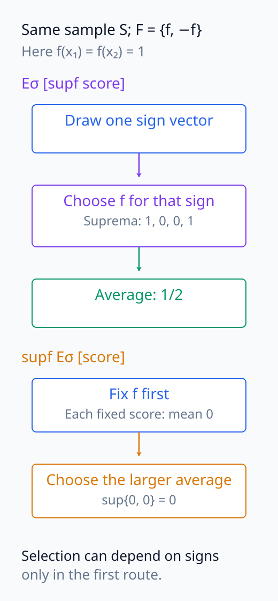
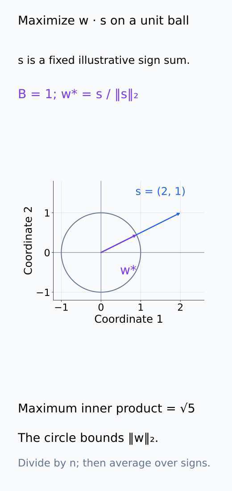
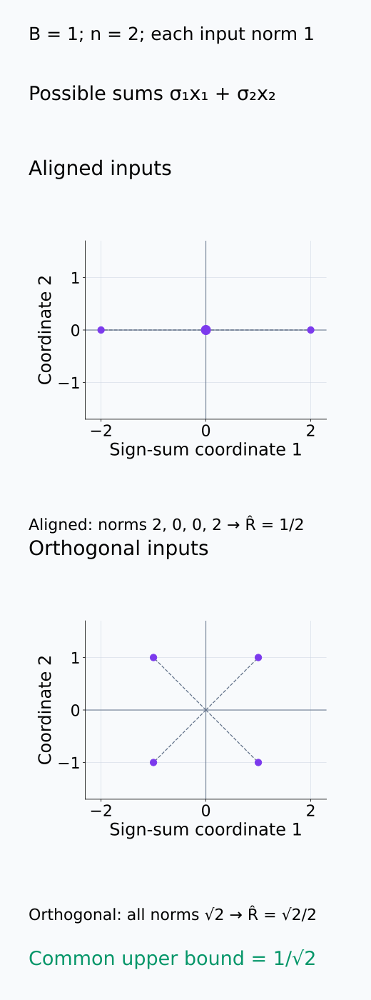
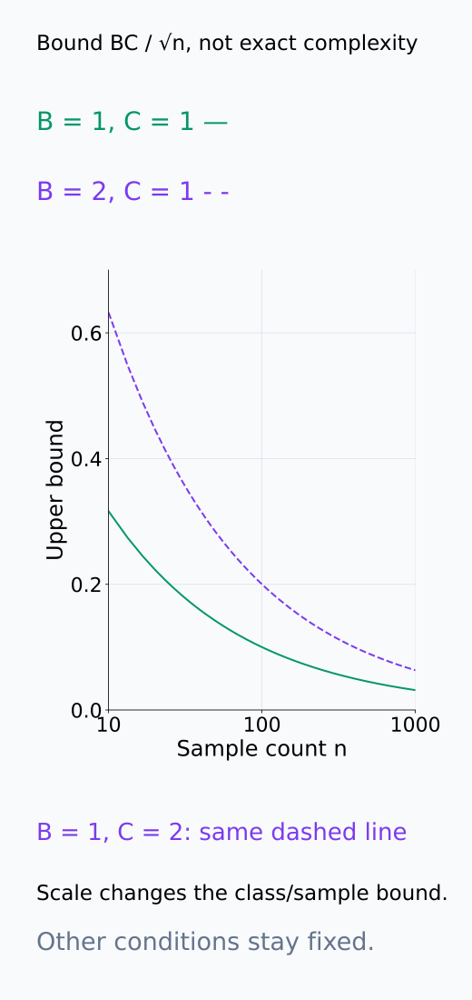
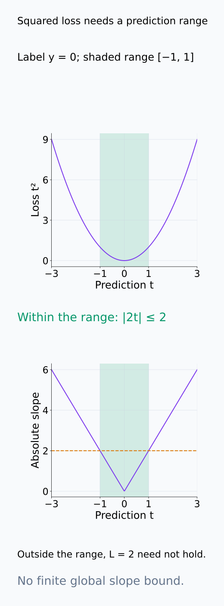
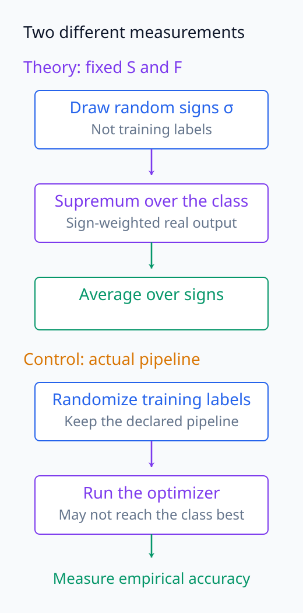
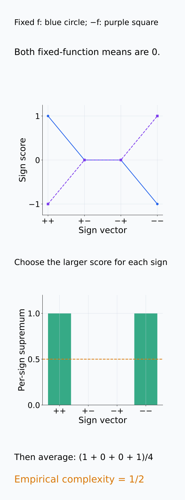

# A09-LRN-05. Rademacher complexity

## 이 단원이 필요한 이유

VC dimension은 class의 worst-case combinatorial capacity를 보지만 실제 sample geometry는 반영하지 않는다. empirical Rademacher complexity는 주어진 sample에서 random sign을 얼마나 잘 맞출 수 있는지로 function class의 data-dependent richness를 잰다.

## 학습 목표

- empirical Rademacher complexity의 각 random source를 설명할 수 있다.
- 작은 finite class의 값을 계산할 수 있다.
- contraction과 norm constraint의 역할을 설명할 수 있다.
- random-label control과 learning-theory complexity를 구분할 수 있다.

## 선수지식 확인

- 선수 단원: [A09-LRN-03 generalization gap](A09-LRN-03-generalization-gap.md), [M04-04 기댓값과 분산](../../part-1-foundations/M04/M04-04-expectation-variance-covariance.md)
- 확인 질문: independent random sign의 평균과 분산은 얼마인가?

## 기호와 용어

| 기호·용어 | Common spoken reading | 의미 | shape·범위 |
|---|---|---|---|
| $\sigma_i$ | `sigma sub i` | independent Rademacher sign | $\{-1,+1\}$ |
| $\hat{\mathfrak R}_S(\mathcal F)$ | `the empirical Rademacher complexity of F on S` | sample-dependent complexity | nonnegative scalar |
| $\sup_{f\in\mathcal F}$ | `the supremum over f in F` | random signs에 가장 잘 맞는 function | operator |
| $B$ | `B` | norm bound | positive scalar |

## 핵심 개념

### sample은 고정하고 sign을 반복한다

sample $S=(x_1,\ldots,x_n)$와 real-valued function class $\mathcal F$를 고정한다. 각 $\sigma_i$는 $+1,-1$을 같은 확률로 갖고 서로 독립인 random sign이다. 이 sign은 training label이나 optimizer seed와 다른, complexity 정의 안에서 도입한 무작위 변수다. empirical Rademacher complexity는

$$
\hat{\mathfrak R}_S(\mathcal F)
=E_\sigma\left[\sup_{f\in\mathcal F}
\frac1n\sum_{i=1}^n\sigma_i f(x_i)\right].
$$

로 정의한다. 먼저 sign vector 하나를 뽑고, 그 sign에 대해 $\sum_i\sigma_i f(x_i)/n$이 가장 커지는 함수를 class에서 찾는다. 그 supremum을 여러 sign vector에 걸쳐 평균한다. sign에 맞춰 함수 선택을 바꿀 수 있으므로 $E_\sigma[\sup_f]$와 $\sup_f E_\sigma$의 순서를 바꾸면 안 된다. 각 $f$를 미리 고정하면 sign 평균이 0이지만, sign을 본 뒤 최선의 $f$를 고르는 이 값은 일반적으로 0이 아니다.

이 단원은 합 안에 절댓값을 넣지 않고 $1/n$으로 정규화하는 convention을 사용한다. 절댓값이나 $2/n$을 사용하는 문헌과 숫자를 비교할 때 정의를 맞춘다. nonempty class와 유한한 기대값을 가정하면, supremum은 임의의 고정 함수의 값을 포함하므로 그 sign 평균은 0 이상이다. empirical라는 말은 $S$를 고정했다는 뜻이며, $S$까지 다시 뽑아 평균한 expected Rademacher complexity와 구분한다.

두 평균·선택 경로를 나란히 읽으면 함수 선택이 sign에 의존하는 위치를 구분할 수 있다.

<figure class="lesson-figure" markdown="1">

<figcaption>두 경로 모두 같은 sample과 같은 {f,−f}를 쓴다. 위 경로에서는 sign을 본 뒤 함수를 바꾸지만 아래 경로에서는 각 함수를 먼저 고정하므로 두 계산은 일반적으로 같지 않다.</figcaption>

</figure>

### norm 제약이 supremum을 막는 방식

bounded linear class $f_w(x)=w^\top x$, $\|w\|\le B$에서 sign 합은 $w^\top\sum_i\sigma_i x_i/n$이다. sign을 고정하면 $w$를 이 합과 잘 정렬해 값을 키울 수 있지만, norm 제한 때문에 크기를 무한히 키울 수는 없다. 일반 norm에서는 unit ball에서 내적의 최대값을 주는 dual norm이 나타난다. Euclidean norm을 쓰면 Cauchy–Schwarz와 같은 방향의 $w$ 선택으로

$$
\hat{\mathfrak R}_S(\mathcal F)
=\frac Bn E_\sigma\left\|\sum_i\sigma_i x_i\right\|_2
\le\frac Bn\sqrt{\sum_i\|x_i\|_2^2}
$$

를 얻는다. 마지막 상한은 norm 제곱의 기대값에서 서로 다른 sign의 교차항 평균이 0이 되는 계산을 이용한다. 모든 input norm이 $C$ 이하이면 상한은 $BC/\sqrt n$이다. weight 크기뿐 아니라 input scale도 같은 값을 바꾸므로 feature scaling을 명시해야 한다. 적어도 하나의 $x_i$가 0이 아니고 $w$에 제한이 없으면 어떤 sign vector에서는 supremum을 무한히 키울 수 있어 finite complexity를 얻지 못한다.

Euclidean ball의 방향 정렬, sample 기하, norm 상한의 변화는 서로 다른 질문이므로 다음 그림에서 따로 확인한다.

<figure class="lesson-figure" markdown="1">

<figcaption>설명용 sign 합 s=(2,1)에 대해 B=1이면 최적 weight는 s/‖s‖₂=(2/√5,1/√5)이고 내적의 최대값은 √5다. s와 같은 방향으로 weight를 늘리되 unit ball 밖으로는 나갈 수 없다는 기하를 보여 준다. complexity에서는 이 최대값을 n으로 나누고 sign에 걸쳐 평균한다.</figcaption>

</figure>

<figure class="lesson-figure lesson-figure--tall" markdown="1">

<figcaption>B=1, n=2와 각 input norm 1을 고정한 설명용 예다. 정렬된 두 input의 sign 합 norm 평균은 1이라 complexity가 1/2이며, 직교 input에서는 모든 합의 norm이 √2라 √2/2다. 두 경우의 공통 상한은 1/√2이므로 상한과 실제 값도 구분된다.</figcaption>

</figure>

<figure class="lesson-figure" markdown="1">

<figcaption>곡선은 실제 complexity의 추정값이 아니라 본문의 상한 BC/√n이다. B 또는 C를 두 배로 바꾸면 같은 n에서 상한이 두 배가 된다. n을 늘릴 때는 동일 class와 동일 norm 조건을 유지한다.</figcaption>

</figure>

### predictor class에서 loss class로

risk의 generalization을 제어할 때는 예측값 함수뿐 아니라 $(x,y)\mapsto\ell(f(x),y)$라는 loss 함수들의 집합이 필요하다. 각 label $y_i$를 고정하고 loss가 예측값에 대해 $L$-Lipschitz이면, 두 예측값의 차이가 loss에서는 최대 $L$배로 커진다. contraction inequality는 이 제한을 random-sign supremum에도 적용해 loss class의 empirical complexity를 predictor class complexity의 $L$배로 제어한다. 이 단원의 절댓값 없는 convention을 기준으로 하며, 사용하는 loss와 예측 범위에서 Lipschitz 조건을 확인해야 한다. squared loss는 예측값과 label 범위를 제한하지 않으면 전역 Lipschitz가 아니다.

complexity 값만으로 아무 loss의 risk bound가 생기는 것은 아니다. concentration에 필요한 boundedness 같은 조건, sample의 i.i.d. 가정과 class가 어떻게 정해졌는지도 확인해야 한다. class를 같은 sample로 다시 선택하면 고정 class의 theorem을 그대로 적용할 수 없을 수 있다.

loss class로 옮기기 전에 Lipschitz 조건이 어느 예측 범위에서 성립하는지 확인해야 한다.

<figure class="lesson-figure lesson-figure--tall" markdown="1">

<figcaption>label 0을 고정한 squared loss t²에서 예측 범위 [−1,1]의 slope 크기는 최대 2다. 범위 밖으로 나가면 같은 L=2를 그대로 사용할 수 없고 전역 slope는 제한되지 않는다. 그림은 contraction을 적용하기 전의 조건을 확인하며 risk bound 자체를 증명하지 않는다.</figcaption>

</figure>

### random-label 학습과 다른 점

random-label control은 label을 무작위화한 뒤 실제 optimizer·regularization·selection pipeline을 실행하여 성능을 측정한다. Rademacher complexity는 특정 training algorithm이 찾은 함수가 아니라, 각 sign vector에 대해 지정한 class 전체의 supremum을 평균한 값이다. 실제 optimizer는 그 최선에 도달하지 않을 수 있고, accuracy와 sign-weighted real output은 측정 척도도 다르다. 따라서 random-label accuracy는 pipeline의 memorization 가능성을 점검하는 경험적 control이며, complexity와 같은 값의 추정이라고 부르지 않는다.

이론 정의와 경험적 control에서 무엇을 선택하고 평균하는지 비교한다.

<figure class="lesson-figure" markdown="1">

<figcaption>class 전체의 supremum과 실제 optimizer가 찾은 결과는 다른 선택 대상이다. sign-weighted 실수 score의 기대값과 random-label accuracy도 다른 측정량이므로 경험적 control을 이론 complexity의 같은 값으로 읽지 않는다.</figcaption>

</figure>

## 작은 예제

$\mathcal F=\{f,-f\}$이면 fixed signs에서 supremum은 $|n^{-1}\sum_i\sigma_if(x_i)|$이고 sign expectation을 취한다.

$f(x_1)=f(x_2)=1$인 두 점을 생각하자. sign이 $(+,+)$ 또는 $(-,-)$이면 두 함수 중 하나를 골라 평균 1을 얻고, $(+,-)$ 또는 $(-,+)$이면 합이 0이다. 네 경우가 같은 확률이므로 complexity는 $(1+1+0+0)/4=1/2$다. 이 예제에서 절댓값이 나온 것은 원래 정의에 추가했기 때문이 아니라, $f$와 $-f$ 중 큰 값을 고른 결과다.

네 sign 경우에서 함수별 score와 선택 후 score를 차례로 계산한다.

<figure class="lesson-figure lesson-figure--tall" markdown="1">

<figcaption>본문의 f(x₁)=f(x₂)=1에 대해 네 sign vector를 모두 계산했다. 각 고정 함수의 score 평균은 0이지만 sign마다 큰 값을 고른 뒤 평균하면 1/2가 된다. 절댓값은 ±f 중 선택한 결과다.</figcaption>

</figure>

## 흔한 오해

- empirical Rademacher complexity는 training label을 randomize한 accuracy와 동일하지 않다.
- unconstrained real-valued linear class는 scale을 무한히 키울 수 있어 유용한 finite bound가 없다.

## 연습문제

### 1. singleton class
$\mathcal F=\{f_0\}$이고 $f_0(x)=0$이면 complexity는 얼마인가?

해설 보기

모든 sign 합이 0이므로 0이다.

### 2. constant pair
$n=1$, $\mathcal F=\{f_+,f_-\}$, $f_+(x)=1$, $f_-(x)=-1$이면 complexity는 얼마인가?

해설 보기

sign이 어느 쪽이든 맞는 constant를 골라 supremum이 1이므로 expectation도 1이다.

### 3. norm constraint
linear class의 weight norm bound를 두 배로 늘리면 표준 upper bound는 어떻게 변하는가?

해설 보기

다른 조건이 같으면 $B$에 선형이므로 두 배가 된다.

### 4. probe control
random-label accuracy와 Rademacher bound를 함께 쓰면 각각 무엇을 알려주는가?

해설 보기

random-label accuracy는 실제 pipeline의 memorization control이고 Rademacher bound는 지정 class·sample의 uniform deviation capacity를 이론적으로 제어한다.

## 근거와 갱신 경계

empirical Rademacher complexity와 contraction은 learning theory의 표준 정의를 따른다. deep network의 최신 norm-based bound 비교는 다루지 않는다.

- [Cornell CS4783 Lecture 6, §§2–3](https://www.cs.cornell.edu/courses/cs4783/2022sp/notes06.pdf): Lipschitz contraction과 Euclidean norm 제약 linear class의 계산을 대조했다. 문헌별 절댓값 convention은 위 본문의 정의와 구분한다.
- [UBC CPSC532D Rademacher complexity, §3.1](https://www.cs.ubc.ca/~dsuth/532D/23w1/notes/5-rademacher.pdf): 본문과 같은 절댓값 없는 convention에서 coordinatewise Lipschitz contraction을 확인했다.

## 단원 요약

- Rademacher complexity는 sample 위 random sign 적합 능력을 잰다.
- supremum과 sign expectation을 구분한다.
- norm constraint와 input geometry가 finite bound를 만든다.
- random-label 실험과 이론 complexity를 같은 값으로 보지 않는다.

## 통과 기준

- 작은 function class의 empirical complexity를 계산할 수 있는가?
- norm bound와 random-label control의 역할을 설명할 수 있는가?

## 다음 단원

- [A09-LRN-06 PAC learning](A09-LRN-06-pac-learning.md)

## 집필자 점검표

- [x] Rademacher random source와 supremum을 구분했다.
- [x] 문제 4개에 해설이 있다.
- [x] Common spoken reading이 실제 영어 학술 발화이며 한글 음역이나 기계적 직역을 포함하지 않는다.
- [x] 선수지식과 링크를 확인했다.
