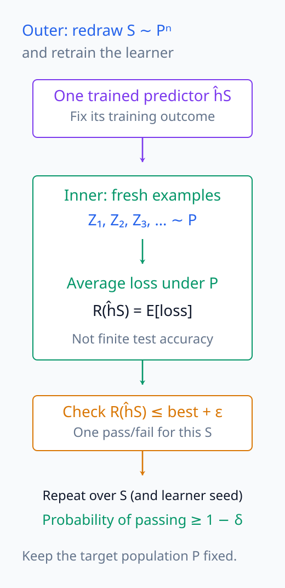
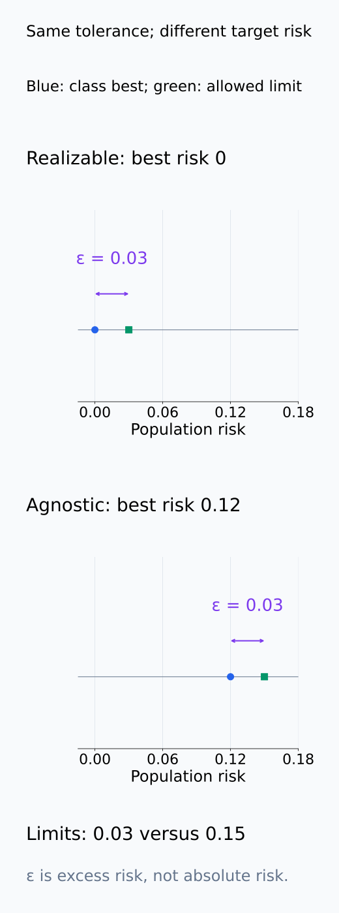
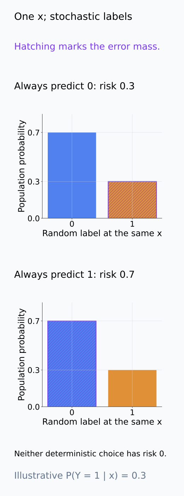
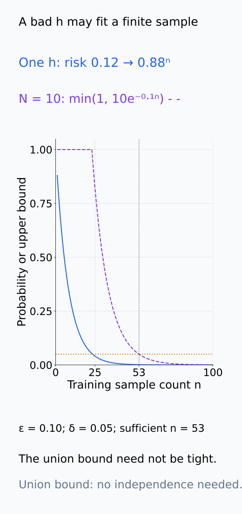
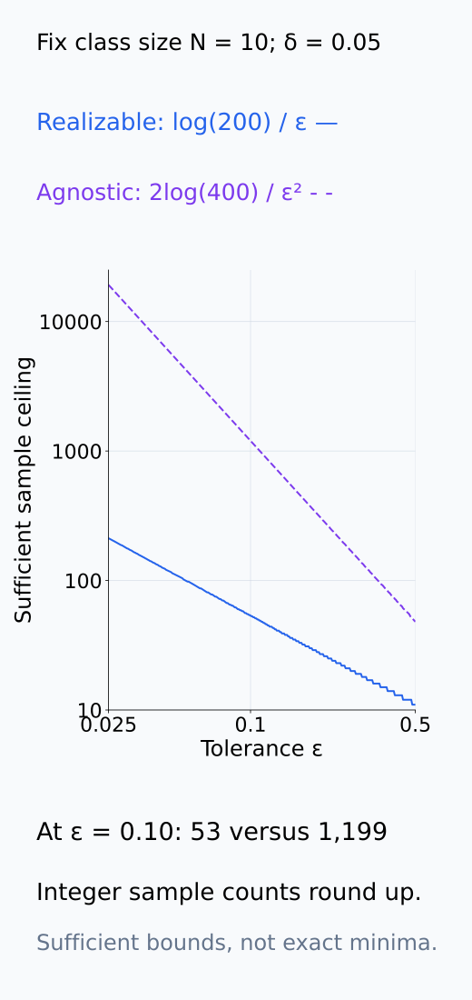
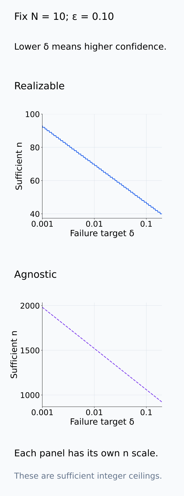
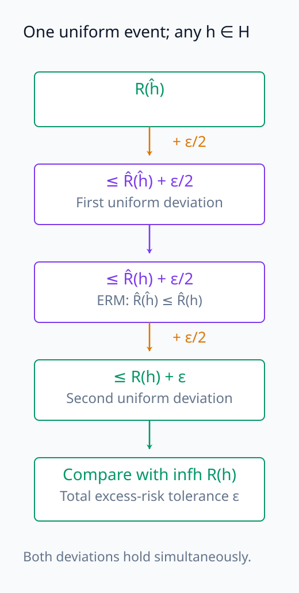
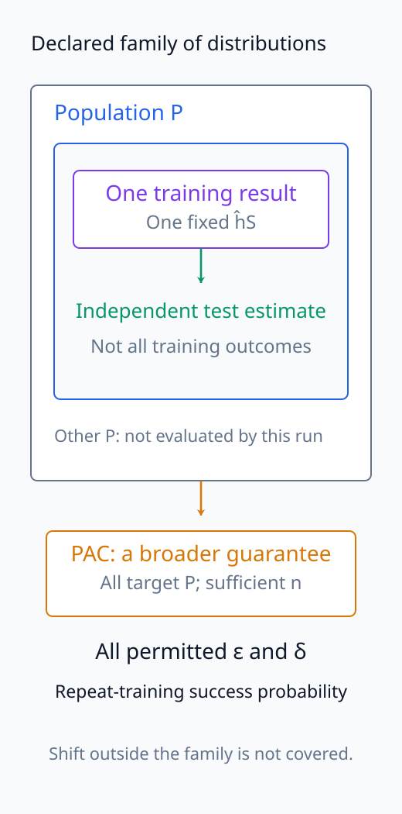
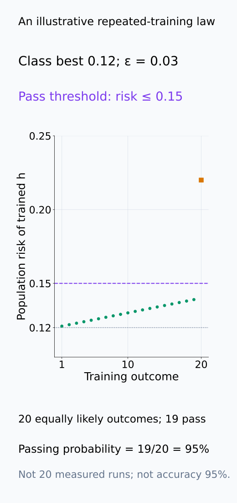

# A09-LRN-06. PAC learning

## 이 단원이 필요한 이유

학습 가능성을 말하려면 얼마나 작은 error를 얼마나 높은 probability로 달성하며 sample 수가 어떻게 증가하는지를 정해야 한다. PAC framework는 accuracy $\varepsilon$와 confidence $1-\delta$를 분리해 sample complexity를 표현한다.

## 학습 목표

- PAC guarantee의 probability statement를 읽을 수 있다.
- realizable·agnostic setting을 구분할 수 있다.
- sample complexity에서 $\varepsilon,\delta$의 역할을 설명할 수 있다.
- theorem guarantee와 한 번의 empirical result를 구분할 수 있다.

## 선수지식 확인

- 선수 단원: [A09-LRN-04 VC dimension](A09-LRN-04-vc-dimension.md), [M04-10 가설검정](../../part-1-foundations/M04/M04-10-hypothesis-testing-multiple-comparisons.md)
- 확인 질문: 확률 $1-\delta$는 test example 하나의 예측 확률인가, training sample 반복의 확률인가?

## 기호와 용어

| 기호·용어 | Common spoken reading | 의미 | shape·범위 |
|---|---|---|---|
| $\varepsilon$ | `epsilon` | 허용 excess risk | positive scalar |
| $\delta$ | `delta` | failure probability | $(0,1)$ |
| $m_{\mathcal H}(\varepsilon,\delta)$ | `the sample complexity of H at epsilon and delta` | 필요한 sample 수 | positive integer |
| $R(\hat h)\le\inf_{h\in\mathcal H}R(h)+\varepsilon$ | `the risk of h hat is at most the best risk in H plus epsilon` | agnostic target | inequality |

## 핵심 개념

### probability statement의 두 수준

agnostic PAC guarantee의 전형적 형태는 training sample $S\sim P^n$에 대해

$$
P_S\left(
R(\hat h_S)\le \inf_{h\in\mathcal H}R(h)+\varepsilon
\right)\ge1-\delta
$$

이다. $P^n$은 동일한 distribution $P$에서 $n$개 관측값을 서로 독립으로 뽑는 sampling을 뜻한다. 괄호 안의 $R(\hat h_S)$는 그 training 결과를 고정하고 새 관측값에서 평균한 loss다. 괄호 밖의 $P_S$는 training sample을 다시 뽑고 재학습했을 때 이 risk 부등식이 성립하는 확률이다. risk 안의 새 example 평균과 바깥의 training 반복을 구분해야 한다. randomized learner의 보장이라면 seed randomness도 바깥 확률에 포함한다.

$\varepsilon$은 best-in-class보다 얼마나 나빠도 허용하는지 정하는 risk 차이이고, $\delta$는 그 부등식이 실패할 training 반복의 확률 상한이다. 0–1 loss라면 $\varepsilon$은 오류율 차이이며, $1-\delta$는 model이 내놓은 개별 prediction의 confidence가 아니다. best-in-class risk가 높으면 그보다 $\varepsilon$만큼 나쁜 결과도 높을 수 있으므로, excess risk의 보장과 절대적 성능 보장을 구분한다.

risk 안의 평균과 바깥 확률을 계산하는 순서를 분리해서 읽는다.

<figure class="lesson-figure" markdown="1">

<figcaption>바깥 확률은 training sample을 다시 뽑는 반복이며, 각 반복의 risk는 학습된 함수를 고정하고 새 example의 loss를 평균한 값이다. model의 개별 prediction confidence나 유한 test 오류율과는 다르다.</figcaption>

</figure>

### realizable과 agnostic의 비교 기준

binary 0–1 loss에서 realizable setting은 class 안에 population risk가 0인 target이 있다고 가정한다. 이때 best-in-class risk가 0이므로 목표는 $R(\hat h_S)\le\varepsilon$로 줄어든다. training error가 0이라는 관측만으로 realizability가 확인되는 것은 아니다. class가 관측 sample의 label을 외웠어도 새 input에서 틀릴 수 있기 때문이다.

agnostic setting은 zero-risk target을 가정하지 않으며 $\inf_{h\in\mathcal H}R(h)$와의 excess risk를 제어한다. class 안의 최선도 label noise나 표현 제약 때문에 양의 risk를 가질 수 있다. 같은 input에서 label이 확률적으로 바뀌는 상황은 이 구분의 한 예다. 여기서 realizability는 population에 대한 가정이지 optimizer가 training loss를 얼마나 줄였는지에 대한 말이 아니다.

허용 risk의 기준점과 population의 zero-risk 가정은 서로 다른 조건이다.

<figure class="lesson-figure lesson-figure--tall" markdown="1">

<figcaption>같은 ε=0.03이라도 best-in-class risk가 0이면 목표 risk는 0.03이며, 본문의 agnostic 예에서는 0.12+0.03=0.15다. excess risk의 허용 폭이 같다고 절대 risk가 같지는 않다.</figcaption>

</figure>

<figure class="lesson-figure lesson-figure--tall" markdown="1">

<figcaption>설명용 population에서 동일 input의 label이 0일 확률 0.7, 1일 확률 0.3이라고 했다. 항상 0 또는 항상 1을 출력해도 각각 오류 mass 0.3, 0.7이 남는다. 이 population의 realizability는 training sample을 얼마나 잘 맞췄는지와 별개다.</figcaption>

</figure>

### 필요한 sample 수의 의미

PAC learnability는 하나의 $P$, 하나의 $n$에서 성공했다는 주장보다 강하다. 정한 class와 loss에 대해, 모든 허용 $\varepsilon,\delta$에 sample 수 기준을 정할 수 있고, learner가 그 기준 이상에서 모든 대상 distribution에 위 확률 보장을 만족해야 한다. realizable 정의에서는 class 안 zero-risk target이 있는 distribution들을 대상으로 한다. distribution-free sample complexity는 unknown $P$마다 유리한 sample 수를 따로 고르는 것이 아니다.

정확한 최소 필요 sample 수와 theorem이 주는 충분 sample 수의 상한도 구분한다. 예를 들어 $N$개의 binary classifier를 미리 고정하고 i.i.d. data에서 0–1 loss를 쓰자. realizable이면 consistent ERM에 대해 $n\ge(\log N+\log(1/\delta))/\varepsilon$가 충분하다. risk가 $\varepsilon$보다 큰 고정 함수가 $n$개 모두 맞힐 확률은 $(1-\varepsilon)^n$ 이하이고, $N$개 후보 중 하나라도 그렇게 될 확률은 $Ne^{-n\varepsilon}$ 이하라는 계산에서 나온다. 여기서 log는 자연로그다.

agnostic finite class에서는 uniform risk 오차를 $\varepsilon/2$ 이하로 제어하면 ERM의 excess risk가 $\varepsilon$ 이하가 된다. Hoeffding inequality와 후보별 union bound로 $n\ge 2\log(2N/\delta)/\varepsilon^2$라는 충분 조건을 얻는다. 이때 empirical 최소를 고르는 조건과 양쪽의 risk 추정 오차가 더해져 factor 2가 생긴다. 두 식 모두 정수 sample 수는 위로 올려 잡으며, tight한 필요조건이라고 부르지 않는다. $\varepsilon$을 줄이면 risk 정밀도를 더 높여야 하고, $\delta$를 줄이면 실패 확률을 더 낮춰야 하므로 충분 sample 수가 커진다.

위 factor 2는 임의의 $h\in\mathcal H$와 ERM을 비교하면 보인다. uniform 사건에서는 $R(\hat h)\le\hat R_n(\hat h)+\varepsilon/2$이고, ERM이므로 $\hat R_n(\hat h)\le\hat R_n(h)$다. 다시 uniform 사건을 적용하면 $\hat R_n(h)\le R(h)+\varepsilon/2$다. 세 부등식을 이어 붙여 $R(\hat h)\le R(h)+\varepsilon$를 얻고, 모든 $h$에 성립하므로 best-in-class infimum과 비교할 수 있다.

training consistency의 failure 상한에서 충분 sample 기준을 얻고, ERM의 두 추정 오차를 연결하는 순서를 확인한다.

<figure class="lesson-figure" markdown="1">

<figcaption>설명용 고정 함수 risk 0.12의 training consistency 확률은 0.88ⁿ이다. ε=0.10, N=10의 후보 전체에 대한 상한은 min(1,10e⁻⁰·¹ⁿ)이며 실제 failure 확률과 같다고 하지 않는다. δ=0.05를 만족하는 충분 정수 n은 53이다. 후보 간 사건의 독립성은 union bound에 필요하지 않다.</figcaption>

</figure>

<figure class="lesson-figure" markdown="1">

<figcaption>N=10, δ=0.05를 고정하고 본문의 두 충분조건을 정수로 올려 그렸다. ε=0.10에서는 realizable 53, agnostic 1,199가 충분하다. 정확한 최소 필요 sample 수나 실제 학습 시간을 나타내지 않는다.</figcaption>

</figure>

<figure class="lesson-figure lesson-figure--tall" markdown="1">

<figcaption>N=10, ε=0.10을 고정했다. δ가 작아질수록 더 높은 반복 성공 확률을 요구하므로 두 충분 sample 상한이 커진다. 세로축이 다른 두 setting을 별도 패널로 읽으며 ε의 정밀도와 δ의 확률을 혼동하지 않는다.</figcaption>

</figure>

<figure class="lesson-figure" markdown="1">

<figcaption>첫 단계와 마지막 단계에서 각각 uniform 오차 ε/2를 사용하고 가운데에서 ERM의 empirical 최소 성질을 사용한다. 비교 대상 h는 class의 임의 함수이므로 마지막에 best-in-class infimum과 비교할 수 있다. 동일 uniform 사건에서 이 연결을 읽는다.</figcaption>

</figure>

### theorem과 한 번의 실험

무한 class에서도 finite VC dimension이나 적절한 Rademacher complexity bound로 sample complexity를 제어할 수 있다. 각 theorem의 loss·norm·sampling·class 조건이 충족돼야 하며, 위 finite-class 식의 $N$에 parameter 수를 대신 넣어서는 안 된다. PAC learnable이라는 사실은 bound가 실무 sample size에서 tight하다는 뜻도, optimization이 효율적이라는 뜻도 아니다.

한 split에서 얻은 test accuracy는 그 학습 결과의 성능 추정이다. 그것만으로 모든 distribution·충분 sample 크기·반복 training에 대한 quantifier를 만족했다고 증명할 수 없다. 또한 theorem의 train/test 동일 distribution 조건을 벗어난 shift에는 원래 보장이 자동으로 이어지지 않는다.

한 번의 평가가 포함하는 범위와 theorem이 요구하는 범위를 구분한다.

<figure class="lesson-figure" markdown="1">

<figcaption>한 학습 결과의 독립 test 평가는 그 predictor와 population의 성능 추정이다. PAC 주장에는 대상 distribution 범위와 충분 sample 기준, training 반복 확률이 추가로 필요하다. 지정하지 않은 shift와 모든 domain의 보장으로 확장하지 않는다.</figcaption>

</figure>

## 작은 예제

$\delta=0.05$는 동일한 data-generating process에서 training sample을 반복했을 때 guarantee가 실패할 확률을 5% 이하로 제한한다는 뜻이다.

이를 model의 정확도가 95%라는 뜻으로 읽으면 안 된다. 예를 들어 best-in-class risk가 0.12이고 $\varepsilon=0.03$이면, 충분한 sample 크기와 theorem 조건 아래에서 training 반복의 적어도 95%가 risk 0.15 이하인 predictor를 내놓는다는 보장이다. 남은 반복의 risk가 정확히 0.15라는 뜻도, test sample의 관측 오류율이 반드시 0.15 이하라는 뜻도 아니다.

본문의 95%를 training 결과의 사건 확률로 읽으면 개별 predictor의 risk와 혼동하지 않는다.

<figure class="lesson-figure" markdown="1">

<figcaption>이는 20회의 실제 실험이 아니라 같은 확률인 20개 training 결과로 만든 설명용 법칙이다. 19개 결과가 risk 0.15 이하이면 그 사건의 확률은 95%다. 각 predictor의 risk는 0.12 주변이며 accuracy 95%를 뜻하지 않는다. 실제 theorem의 보장을 이 임의 법칙 하나로 증명하지도 않는다.</figcaption>

</figure>

## 흔한 오해

- $1-\delta$를 개별 prediction confidence로 읽으면 안 된다.
- PAC guarantee는 distribution shift 뒤에도 자동 유지되지 않는다.

## 연습문제

### 1. confidence
$\delta=0.01$이면 guarantee probability는 얼마인가?

해설 보기

$1-0.01=0.99$다.

### 2. excess risk
best-in-class risk가 0.12, $\varepsilon=0.03$이면 허용 upper bound는 얼마인가?

해설 보기

$0.15$다.

### 3. realizability
label noise가 있고 deterministic classifier class만 쓰면 realizable assumption이 실패할 수 있는 이유는 무엇인가?

해설 보기

같은 input에 서로 다른 label이 생기면 class 안 어떤 deterministic function도 population error 0을 달성하지 못할 수 있다.

### 4. 모델 해석
probe 하나의 test accuracy가 PAC learnability를 증명하지 않는 이유는 무엇인가?

해설 보기

PAC는 sample size에 따른 uniform probability guarantee이며 한 split의 point estimate는 class·algorithm 전체의 guarantee가 아니다.

## 근거와 갱신 경계

PAC·realizable·agnostic learning은 computational learning theory의 표준 정의를 따른다. computational efficiency와 online learning은 다루지 않는다.

- [Cornell CS4783 Lecture 1, §2.1](https://www.cs.cornell.edu/courses/cs4783/2022sp/notes01.pdf): finite realizable class의 failure bound와 training-sample 확률 해석을 대조했다.

## 단원 요약

- PAC는 accuracy와 confidence를 분리한다.
- probability는 training sample 반복에 대한 것이다.
- agnostic setting은 best-in-class excess risk를 제어한다.
- 이론 sample bound와 한 번의 empirical accuracy를 구분한다.

## 통과 기준

- PAC probability statement를 말로 풀 수 있는가?
- realizable·agnostic·distribution shift를 구분할 수 있는가?

## 다음 단원

- [A09-LRN-07 probe와 해석의 일반화](A09-LRN-07-probe-interpretation-generalization.md)

## 집필자 점검표

- [x] PAC의 두 probability 수준을 혼동하지 않았다.
- [x] 문제 4개에 해설이 있다.
- [x] Common spoken reading이 실제 영어 학술 발화이며 한글 음역이나 기계적 직역을 포함하지 않는다.
- [x] 선수지식과 링크를 확인했다.
