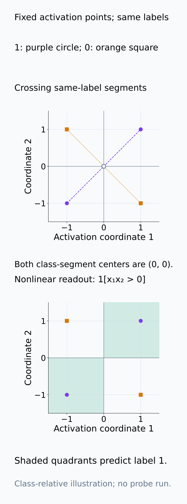
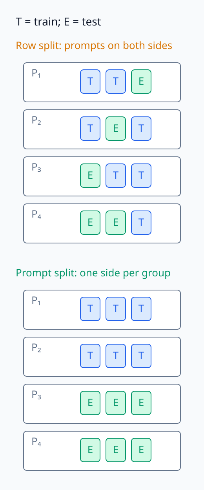
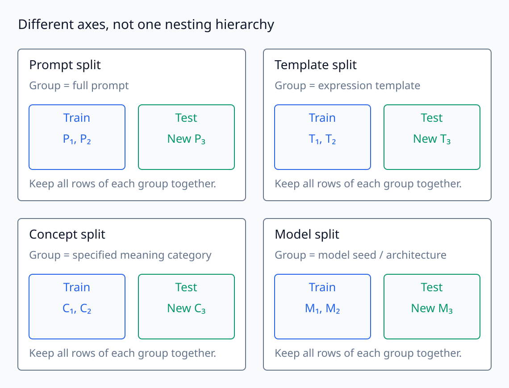
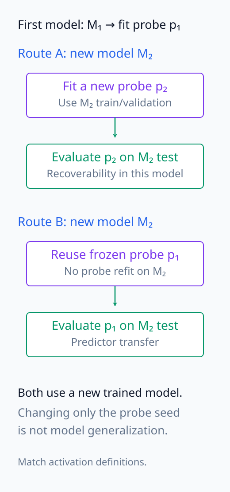
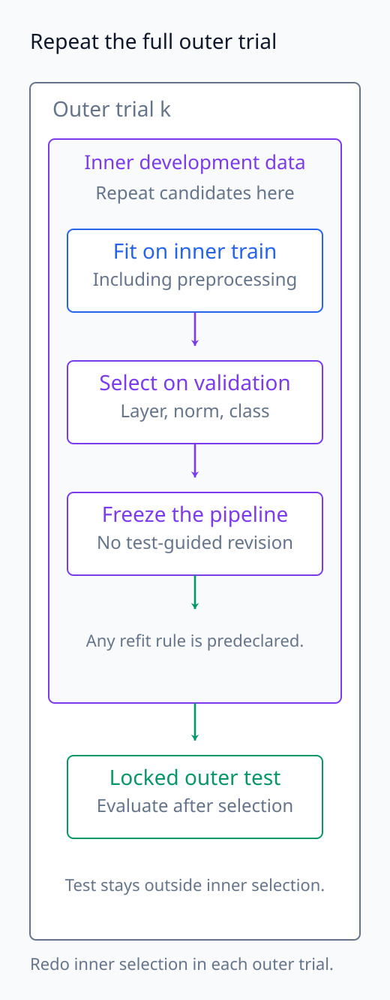
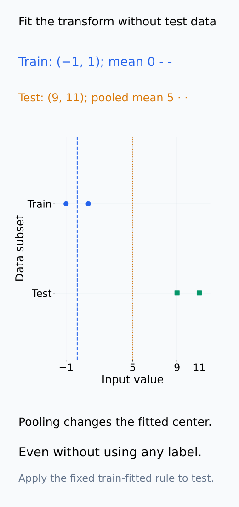
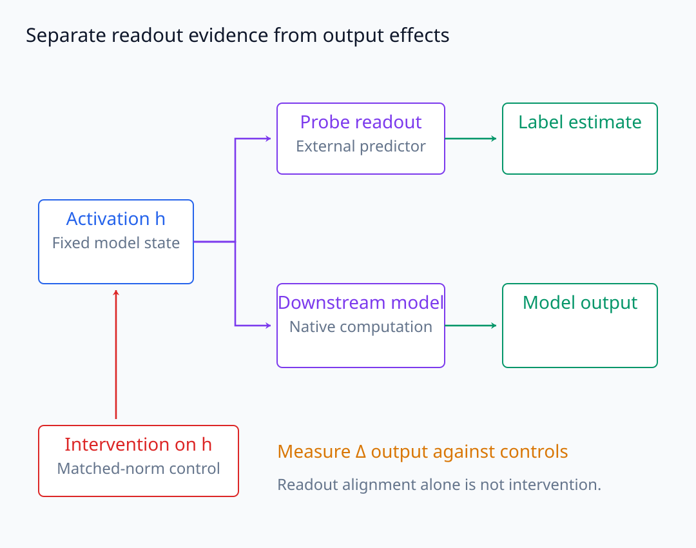
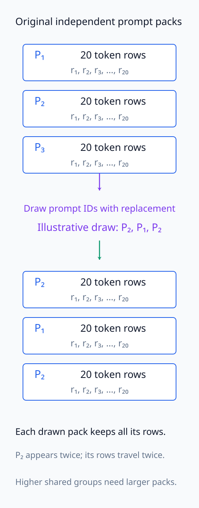
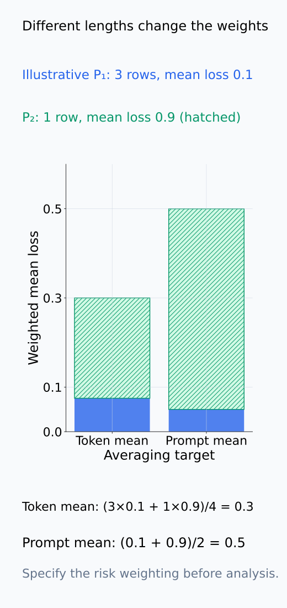

# A09-LRN-07. probe와 해석의 일반화

## 이 단원이 필요한 이유

probe가 held-out row에서 잘 작동해도 새로운 prompt template, concept paraphrase, model seed와 layer에서 일반화된다는 뜻은 아니다. 해석 연구에는 여러 population 축과 selection procedure가 있으므로 split을 claim 단위에 맞춰 설계해야 한다.

## 학습 목표

- probe의 experimental unit과 hypothesis class를 명시할 수 있다.
- row·prompt·template·concept·model split을 구분할 수 있다.
- nested selection과 control task를 설계할 수 있다.
- 복원 가능성과 모델의 기능적 사용을 구분할 수 있다.

## 선수지식 확인

- 선수 단원: [A09-LRN-03 generalization gap](A09-LRN-03-generalization-gap.md), [A09-LRN-05 Rademacher complexity](A09-LRN-05-rademacher-complexity.md), [I06-06 linear probe](../../part-3-interpretability/I06/I06-06-linear-probe.md), [I06-07 probe control](../../part-3-interpretability/I06/I06-07-probe-controls-selectivity.md)
- 확인 질문: 같은 prompt의 여러 token row를 train과 test에 나누면 어떤 leakage가 생기는가?

## 기호와 용어

| 기호·용어 | Common spoken reading | 의미 | shape·범위 |
|---|---|---|---|
| $D_{\mathrm{train}},D_{\mathrm{test}}$ | `D train and D test` | 독립 평가 split | datasets |
| $\mathcal H_{\mathrm{probe}}$ | `the probe hypothesis class` | probe predictor family | function class |
| $s$ | `s` | model seed 또는 split seed | index |
| $\Delta_{\mathrm{sel}}$ | `selection optimism delta` | selection으로 생긴 낙관 편향 | scalar |

## 핵심 개념

### predictor class와 sampling unit

probe는 고정한 activation을 입력으로 받아 label을 예측하는 별도의 learner다. $\mathcal H_{\mathrm{probe}}$는 linear/MLP 형태와 허용한 parameter·norm 제약 등으로 정해지며, layer나 preprocessing 선택도 최종 predictor를 바꾼다. probe가 복원할 수 있는 관계는 이 class에 상대적이다. linear probe의 낮은 성능이 모든 함수 class에서 information이 없다는 뜻은 아니다.

activation row 하나가 곧 독립 experimental unit인 것은 아니다. 같은 prompt의 여러 token, 같은 원문의 paraphrase, 같은 template로 만든 문장들은 정보를 공유할 수 있다. 무엇을 독립으로 새로 얻었는지에 따라 sampling 단위를 정하고, train/test 사이에 함께 움직여야 할 row들을 같은 묶음으로 둔다. model seed, probe initialization seed, split seed도 서로 다른 반복이므로 하나의 $s$라는 이름으로 합쳐 보고하지 않는다.

같은 activation에서도 label 관계를 복원할 수 있는 readout의 형태는 class에 따라 달라진다.

<figure class="lesson-figure lesson-figure--tall" markdown="1">

<figcaption>설명용 네 activation에서 1-label 두 점과 0-label 두 점의 선분이 원점에서 교차한다. 두 label을 strict하게 분리하는 affine score는 각 선분의 중점에서 서로 다른 판정을 요구하므로 존재하지 않는다. 반면 비선형 readout 1[x₁x₂>0]은 네 점을 복원한다. 실제 MLP를 학습한 결과가 아니라 함수 class에 상대적인 복원의 기하 예다.</figcaption>

</figure>

### split 축이 바꾸는 일반화 주장

probe claim을 다음 축으로 분해한다.

- row generalization: 같은 prompt population의 unseen activation row
- prompt generalization: unseen prompt
- template·concept generalization: held-out 표현 형식·의미 범주
- model generalization: unseen training seed·architecture

row split은 관측하지 않은 row를 평가하지만, 동일 prompt가 양쪽에 들어가면 새로운 prompt를 평가한 것이 아니다. prompt split은 prompt 묶음 전체를 분리한다. 다만 같은 template의 새 prompt가 잘 복원됐다고 새 template까지 복원된다는 보장은 없다. template split은 표현 형식의 묶음을, concept split은 정한 의미 범주의 묶음을 분리하므로 서로 다른 질문에 답한다. 어떤 concept을 hold out했는지와 lexical overlap을 어떻게 제한했는지를 함께 적어야 한다.

model generalization에서는 실제로 다른 training seed나 architecture의 model을 평가해야 한다. 같은 model의 probe seed만 바꾸는 것으로 대신할 수 없다. model마다 probe를 새로 학습했는지, 한 model에서 학습한 probe를 그대로 옮겼는지도 구분한다. 전자는 각 model에서의 recoverability 반복이고 후자는 predictor transfer에 대한 주장이다. split 축을 바꾸면 평가 distribution도 바뀌므로 모든 결과를 같은 iid gap으로 묶지 않는다.

row 묶음, hold-out 축, 새 model의 refit과 transfer를 분리하면 평가가 답하는 질문도 분명해진다.

<figure class="lesson-figure" markdown="1">

<figcaption>각 prompt에서 일부 token row를 train과 test에 나누면 prompt는 양쪽에 반복된다. prompt split은 한 prompt의 row를 통째로 같은 쪽에 둔다. 도식의 네 prompt와 세 row는 설명용 축약이며 본문의 100 prompt·20 token 수치를 바꾸지 않는다.</figcaption>

</figure>

<figure class="lesson-figure lesson-figure--wide" markdown="1">

<figcaption>hold out하는 묶음이 바뀌면 주장도 달라진다. template와 concept은 하나의 자동 계층이 아니라 서로 다른 분류 축이다. model split에는 새로운 model training seed나 architecture가 필요하며 probe initialization seed 변화만으로 대신하지 않는다.</figcaption>

</figure>

<figure class="lesson-figure" markdown="1">

<figcaption>두 경로 모두 새 model을 평가하지만 위 경로는 그 model에서 새 probe를 fit하고 아래 경로는 기존 predictor를 고정하여 옮긴다. recoverability의 model별 반복과 predictor transfer를 같은 성공 주장으로 합치지 않는다.</figcaption>

</figure>

### 선택은 안쪽, 평가는 바깥쪽

layer, regularization, feature preprocessing과 probe class를 validation으로 고른 뒤 독립 test를 사용한다. 후보를 비교하는 동안의 validation은 선택용 data다. nested resampling에서는 outer test를 제외한 data 안에서 다시 train/validation을 나누고, 그 안쪽에서만 후보를 고른 뒤 outer test를 평가한다. 각 outer 반복마다 선택을 다시 해야 전체 pipeline의 성능을 평가할 수 있다. 모든 data로 먼저 layer를 고르고 나서 cross-validation하는 것은 이 독립성을 지키지 못한다.

평균·scale·projection 같은 학습되는 preprocessing도 평가 전에 training 부분에서 fit하고 test에는 고정하여 적용한다. label을 쓰지 않는 fit이라도 test distribution의 정보를 사용했다면 순수 held-out 평가와 구분해야 한다. random-label control에도 정한 class·선택 절차·data 크기 조건을 맞춰야 한다. MLP의 성능 향상은 더 풍부한 함수 집합의 복원 가능성과 training/selection 효과가 함께 만든 결과이므로, control과 held-out gap을 따로 확인한다.

prompt가 experimental unit이면 confidence interval은 prompt 묶음을 재표집해 구하고, permutation도 null 아래 교환 가능한 묶음과 label 관계를 보존해 설계한다. row별 permutation을 무조건 prompt permutation으로 바꾸는 것만으로 타당해지지는 않는다. token별 label 구조와 template 묶음이 있다면 무엇이 교환 가능한지부터 정한다.

선택 경계와 preprocessing의 정보 경로를 따로 확인한다.

<figure class="lesson-figure lesson-figure--tall" markdown="1">

<figcaption>각 outer 반복에서 train/validation 안의 후보 선택을 다시 수행하고 outer test는 선택에 사용하지 않는다. preprocessing도 training fit에 포함된다. 그림은 설계 경계를 보여 주며 새 resampling이나 학습 결과를 생성하지 않는다.</figcaption>

</figure>

<figure class="lesson-figure" markdown="1">

<figcaption>설명용 train input (−1,1)의 평균은 0이고 test input (9,11)까지 합친 평균은 5다. label을 쓰지 않아도 test 분포가 fit된 변환을 바꾼다. 순수 held-out 평가에서는 train에서 fit한 규칙을 고정하여 test에 적용한다.</figcaption>

</figure>

### 복원, 일반화, 사용의 차이

독립 test에서 잘 작동하는 probe는 지정한 class와 평가 population에서 label 관련 information이 recoverable하다는 증거다. label leakage나 단순 cue만으로 같은 성능이 가능한지 control로 확인해야 한다. 이 결과는 model 내부의 downstream 계산이 probe와 같은 함수를 쓴다는 증거는 아니다.

functional use를 주장하려면 해당 information을 바꾸는 ablation·patching의 output 효과와 적절한 control이 필요하다. readout alignment는 direction과 output 계산의 관계를 보여 줄 수 있지만 그 자체는 intervention이 아니다. intervention도 다른 feature를 함께 바꾸거나 비정상 state를 만들 수 있으므로, matched-norm control과 개입의 선택성을 확인한 범위에서 주장한다. probe의 일반화와 개입 효과는 서로 보완하지만 같은 측정량은 아니다.

probe의 별도 readout과 model의 native 계산은 같은 activation에서 출발해도 서로 다른 경로다.

<figure class="lesson-figure lesson-figure--wide" markdown="1">

<figcaption>probe의 별도 label 경로에서 복원이 성공해도 model downstream 경로가 같은 정보를 사용한다는 결론은 나오지 않는다. functional use는 activation의 선택적 개입과 matched-norm control의 output 효과로 따로 확인한다. alignment만 보거나 비정상 state를 만든 개입은 이 한계를 없애지 않는다.</figcaption>

</figure>

## 작은 예제

문장마다 20 token이 있어도 문장 100개라면 prompt-level generalization의 독립 unit은 2,000개가 아니라 100개에 가깝다.

100개 문장이 독립 prompt이고 문장 내부 token들이 종속이라고 가정하면, prompt split은 한 문장의 20 row를 같은 쪽에 둔다. prompt bootstrap도 그 20 row를 묶어서 뽑는다. token-level risk를 평균할지 prompt마다 먼저 평균한 risk를 다시 평균할지도 정해야 한다. 길이가 서로 다르면 두 평균의 가중치가 달라진다. 동일 template나 원문을 공유하는 prompt 사이에도 종속성이 있다면 100개를 모두 독립이라고 가정할 수 없으므로 더 큰 묶음이 필요하다.

prompt pack을 재표집하는 단위와 loss를 평균하는 가중치는 각각 정해야 한다.

<figure class="lesson-figure lesson-figure--tall" markdown="1">

<figcaption>설명용 draw에서 prompt P₂, P₁, P₂를 복원추출했다. prompt를 뽑으면 그 안의 token rows도 함께 뽑는다. 본문의 각 prompt 20 token은 pack 안의 생략부를 포함한 수이며 prompt 사이 template·원문 종속성이 있으면 더 큰 묶음이 필요하다.</figcaption>

</figure>

<figure class="lesson-figure" markdown="1">

<figcaption>서로 길이가 다른 설명용 두 prompt의 평균 loss를 0.1, 0.9로 두었다. token 평균은 길이 3과 1로 가중하여 0.3, prompt 평균은 두 prompt를 같은 무게로 두어 0.5다. 어느 평균을 목표로 했는지를 split·interval과 함께 정한다.</figcaption>

</figure>

## 흔한 오해

- test accuracy가 높아도 label leakage나 template cue를 이용했을 수 있다.
- nonlinear probe 성능 향상은 activation에 단순하고 사용 가능한 feature가 있다는 뜻이 아니다.

## 연습문제

### 1. split
paraphrase 일반화를 보려면 어떤 split이 필요한가?

해설 보기

동일 의미의 표현 변형을 train과 test에 분리하고 lexical overlap control을 둔 template·paraphrase split이 필요하다.

### 2. nested selection
layer와 regularization을 고른 validation set을 최종 성능 보고에 다시 쓰면 어떤 문제가 생기는가?

해설 보기

selection noise에 맞춘 낙관 편향이 포함된다. 독립 test set이나 nested resampling이 필요하다.

### 3. complexity
MLP probe가 linear probe보다 좋을 때 무엇을 함께 보고해야 하는가?

해설 보기

capacity·regularization·sample size·random-label control과 held-out gap을 함께 보고해 memorization과 nonlinear recoverability를 구분한다.

### 4. 사용 증거
probe가 복원한 direction을 모델이 사용한다는 주장을 강화하는 실험은 무엇인가?

해설 보기

해당 direction을 selective ablation·patching하고 matched-norm control과 함께 output effect를 측정한다.

## 근거와 갱신 경계

이 단원은 learning-theory split과 probe control을 모델 해석 주장에 적용한다. 특정 probe architecture의 우열은 고정하지 않는다.

- [Hewitt and Liang (2019), Designing and Interpreting Probes with Control Tasks](https://aclanthology.org/D19-1275/): probe가 학습한 것과 representation의 information을 구분하는 control의 근거다. 해당 control task를 모든 split의 보장이나 causal-use 증거로 확대하지 않는다.

## 단원 요약

- generalization claim마다 독립 unit과 split 축이 다르다.
- selection은 validation에서, 최종 평가는 독립 test에서 한다.
- probe capacity와 random-label control을 함께 본다.
- recoverability와 functional use는 다른 증거다.

## 통과 기준

- probe claim에 맞는 split과 unit을 선택할 수 있는가?
- 복원·일반화·사용 주장을 구분할 수 있는가?

## 다음 단원

- [A09-LRN-08 종합 실습: 복잡도와 일반화](A09-LRN-08-capstone-complexity-generalization.md)

## 집필자 점검표

- [x] probe의 여러 일반화 축과 인과 한계를 밝혔다.
- [x] 문제 4개에 해설이 있다.
- [x] Common spoken reading이 실제 영어 학술 발화이며 한글 음역이나 기계적 직역을 포함하지 않는다.
- [x] 선수지식과 링크를 확인했다.
