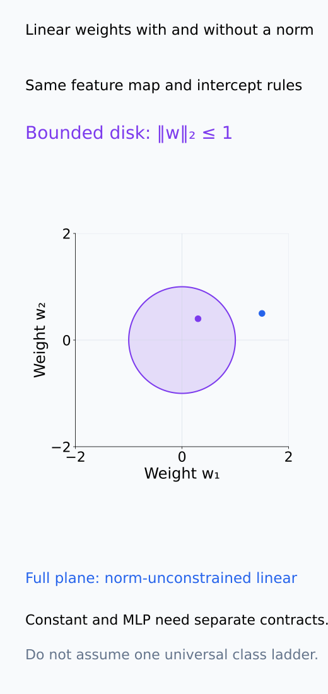
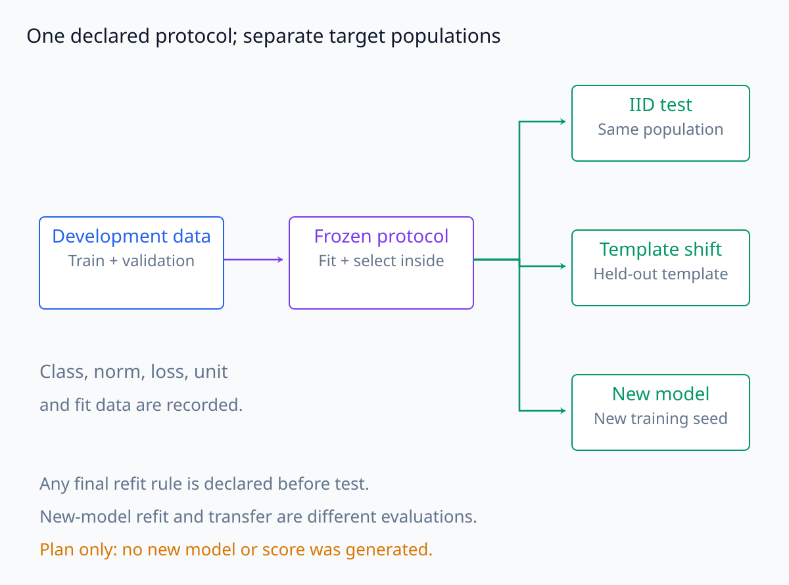
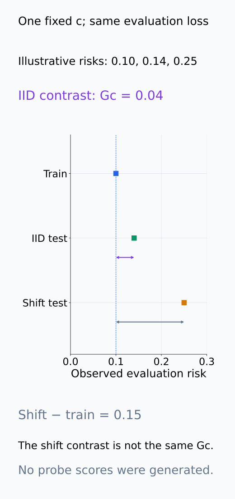
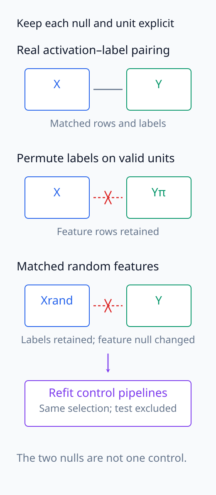
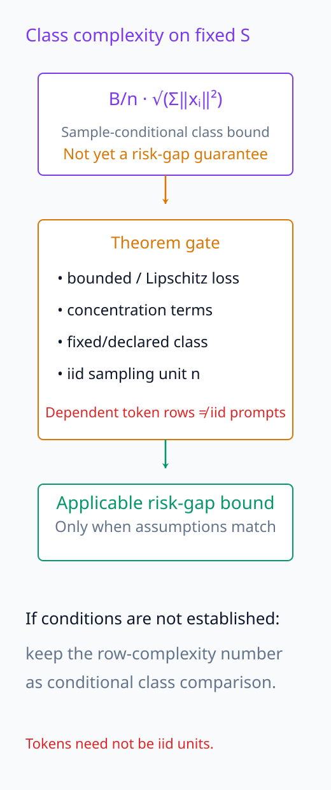
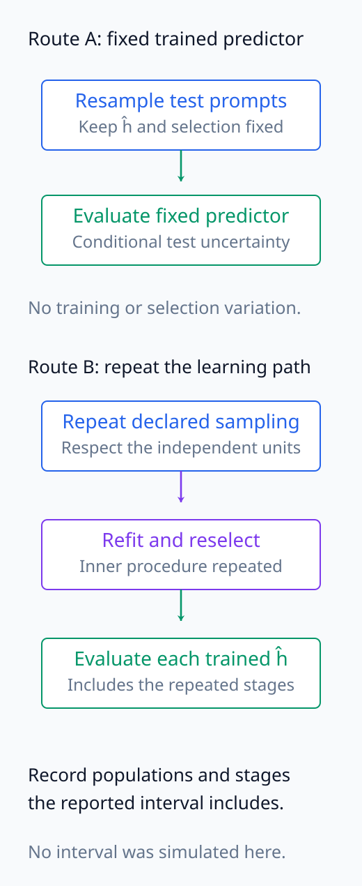
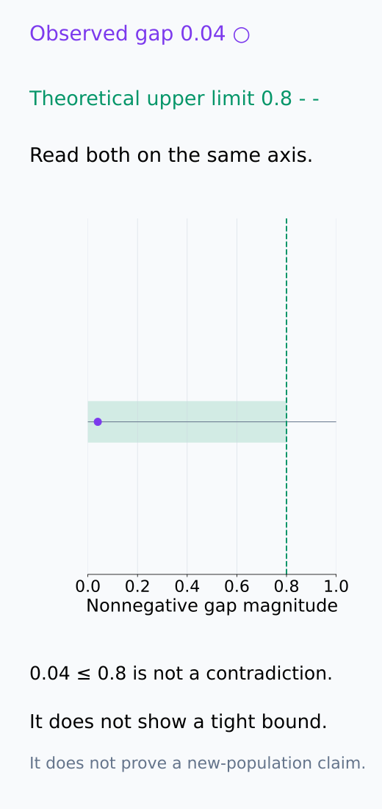
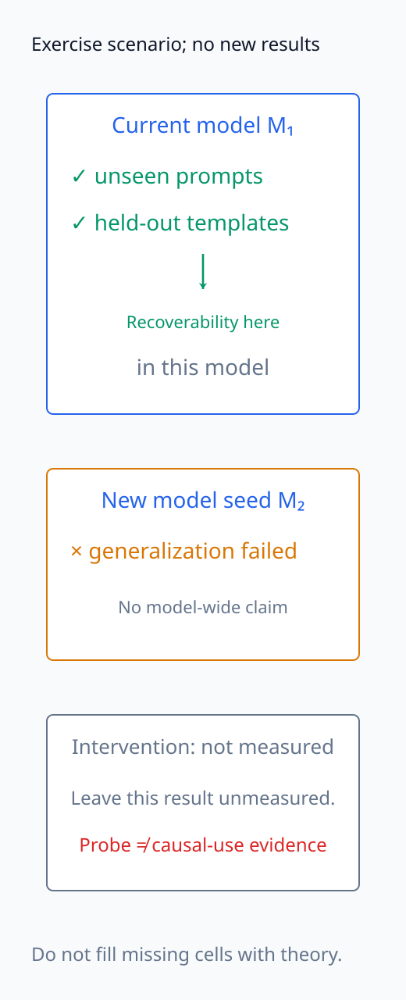

# A09-LRN-08. 종합 실습: 복잡도와 일반화

## 이 단원이 필요한 이유

complexity theory를 해석 실험에 적용하려면 theorem 이름을 붙이는 것보다 class, norm constraint, sample unit, selection과 target population을 고정해야 한다. 이 실습은 probe capacity ladder와 여러 generalization split을 한 계약으로 묶는다.

## 학습 목표

- probe capacity ladder와 nested evaluation을 설계할 수 있다.
- empirical gap·random-label control·complexity bound를 분리할 수 있다.
- prompt·template·model generalization을 동시에 기록할 수 있다.
- 결과에 맞는 recoverability claim을 작성할 수 있다.

## 선수지식 확인

- 선수 단원: [A09-LRN-01~07](A09-LRN-07-probe-interpretation-generalization.md)
- 확인 질문: 더 복잡한 probe가 높은 train score를 얻는 것은 왜 예상 가능한가?

## 기호와 용어

| 기호·용어 | Common spoken reading | 의미 | shape·범위 |
|---|---|---|---|
| $c\in\mathcal C$ | `c in the capacity set C` | probe capacity setting | discrete index |
| $G_c$ | `G sub c` | capacity별 generalization gap | scalar |
| $A_{\mathrm{null}}$ | `null-control accuracy` | random-label·random-feature score | scalar |
| $R_{\mathrm{shift}}$ | `risk under distribution shift` | shifted population risk | scalar |

## 분석 계약

같은 activation dataset에 constant, linear, norm-constrained linear, 작은 MLP probe를 사용한다. prompt를 최상위 experimental unit으로 두고 train·validation·iid test·template-shift test를 분리한다. layer·capacity·regularization 선택은 validation 안에서 끝낸다.

capacity ladder의 순서는 실제 함수 집합과 제약을 보고 정한다. norm-constrained linear class는 해당 norm 제약을 없앤 linear class의 부분집합이지만, constant baseline과 특정 MLP까지 자동으로 하나의 포함 관계를 이루는 것은 아니다. intercept의 허용 여부·norm 종류와 상한·MLP 폭과 activation을 기록해야 $c$가 어떤 class를 뜻하는지 정해진다. optimizer가 계산하는 objective와 평가에 사용하는 loss도 구분하고, train/test risk는 같은 평가 loss로 계산한다.

각 prompt의 token·paraphrase row가 split을 넘지 않도록 묶고, token 평균인지 prompt 평균인지 정한다. 같은 template를 공유하는 새 prompt의 iid test와 template 전체를 제외한 shift test는 다른 target population이다. outer test를 잠근 뒤 안쪽 train/validation에서 모든 preprocessing과 후보 선택을 수행한다. 최종 선택 후 train과 validation을 합쳐 refit한다면 그 절차를 미리 정하고, training risk가 어떤 data에서 계산됐는지도 바꾸어 기록한다. 최종 test를 보고 다시 후보를 고르면 더 이상 독립 평가가 아니다.

class의 실제 포함 관계와 선택 후 평가 population의 분기를 먼저 고정한다.

<figure class="lesson-figure" markdown="1">

<figcaption>동일 feature map과 intercept 규칙을 고정한 linear class에서는 norm 제한 B=1의 weight disk가 전체 weight 공간의 부분집합이다. 이 관계만으로 constant와 특정 MLP까지 자동 포함되지는 않는다. 그림의 weight 점은 설명용이며 학습된 probe가 아니다.</figcaption>

</figure>

<figure class="lesson-figure lesson-figure--wide" markdown="1">

<figcaption>train/validation에서 선택을 마친 protocol을 고정한 뒤 IID·template shift·독립 model seed 평가를 분리한다. model마다 refit할지 기존 probe를 transfer할지도 미리 정한다. 이는 실험 설계도이며 실행한 score를 보여 주지 않는다.</figcaption>

</figure>

## 측정 절차

1. 각 capacity의 train·iid test·shift test risk를 계산한다.
2. prompt bootstrap으로 gap과 model difference interval을 구한다.
3. label permutation과 matched random feature에서 같은 selection pipeline을 반복한다.
4. linear class에는 weight·input norm과 empirical Rademacher upper bound를 기록한다.
5. 독립 model seed에서 선택된 probe protocol을 그대로 반복한다.
6. selected direction intervention을 별도 기능 검증으로 수행한다.

각 $c$의 observed gap $G_c$는 iid test risk에서 해당 training risk를 뺀 값이다. shift risk를 training risk와 뺀 값은 distribution 변화까지 섞이므로 동일한 $G_c$라고 부르지 않는다. 두 model/probe를 비교할 때는 같은 test prompt에서의 loss 차이를 재표집하고, gap 차이를 보고하려면 training risk 차이도 빼야 한다. test bootstrap은 고정한 학습 결과의 평가 불확실성이며, 학습과 선택의 변동을 포함하려면 재표집마다 그 안쪽 절차도 반복해야 한다.

random-label과 random-feature control은 어느 관계를 끊는 null인지 먼저 정한다. prompt별 label이 있는지 token별 label이 있는지에 따라 교환 가능한 단위가 달라진다. 각 control에서 preprocessing·validation 선택까지 같은 규칙으로 다시 수행하고, test를 선택에 사용하지 않는다. 두 control은 같은 accuracy 기호로 기록할 수 있어도 서로 다른 null이므로 결과를 합쳐 하나의 control처럼 보고하지 않는다.

linear class의 $B/n\sqrt{\sum_i\|x_i\|_2^2}$는 고정한 sample에서의 empirical Rademacher complexity 상한이다. 그 숫자 자체가 고확률 risk-gap 상한은 아니다. loss의 Lipschitz·boundedness 조건과 concentration 항을 더해야 하고, $n$의 sampling 단위도 theorem과 맞아야 한다. 종속 token row 수를 $n$에 넣어 prompt 일반화 보장이 강해졌다고 주장하지 않는다. prompt마다 독립적인 입력 하나를 정의한 probe를 분석하거나, prompt 평균 loss 함수들의 class를 기준으로 bound를 구성해야 한다. 기존 row 단위 complexity 수치는 그 조건이 없으면 조건부 class 비교로만 기록한다.

독립 model seed에서는 선택 규칙·split 생성 규칙·hook/label 정의를 고정한 protocol을 반복한다. model마다 probe를 새로 fit하는 평가와 기존 probe를 그대로 transfer하는 평가는 구분하고, 후자를 요구하지 않은 실험에서 transfer 성공을 주장하지 않는다. direction intervention은 probe 평가와 별도의 output 효과를 재며, 새 model에서 동일 feature index가 같은 방향을 뜻한다고 가정하지 않는다. 이 단원은 이 절차를 설계하고 기록하는 실습이며, 새 model 실행이나 결과 생성을 요구하지 않는다.

아래 그림은 각 측정량이 만드는 비교, null, 보장과 interval의 범위를 서로 구분한다.

<figure class="lesson-figure" markdown="1">

<figcaption>설명용 수치 train 0.10, IID test 0.14, shift test 0.25에서 IID gap은 0.04다. shift−train=0.15에는 distribution 변화도 섞여 같은 IID gap으로 부르지 않는다. 본문의 observed gap 0.04와 일치시키기 위한 작은 계산이며 실제 probe 실험값이 아니다.</figcaption>

</figure>

<figure class="lesson-figure" markdown="1">

<figcaption>random-label은 선언한 교환 가능한 단위의 label 대응을 바꾸고 random-feature는 feature 쪽의 관계를 바꾼다. 둘 다 같은 preprocessing·selection 규칙을 다시 수행하지만 서로 다른 null이다. 그림의 대응선은 데이터 pairing이며 model의 causal 경로가 아니다.</figcaption>

</figure>

<figure class="lesson-figure lesson-figure--tall" markdown="1">

<figcaption>B/n·√Σ‖xᵢ‖²는 고정 sample의 class complexity 상한이다. loss 조건과 concentration 항, theorem에 맞는 독립 sampling unit이 확인돼야 risk-gap bound로 연결할 수 있다. 종속 token row 수를 독립 n으로 대체하면 이 연결이 성립하지 않는다.</figcaption>

</figure>

<figure class="lesson-figure lesson-figure--tall" markdown="1">

<figcaption>위 경로는 이미 고정한 predictor의 test sampling 불확실성만 다룬다. 아래 경로에서 학습과 선택의 변동을 포함하려면 반복마다 안쪽 fit·selection도 다시 수행해야 한다. row·prompt·model의 어떤 단위를 재표집했는지는 별도로 기록한다.</figcaption>

</figure>

## 결과 기록표

| 증거 | 답하는 질문 | 답하지 못하는 질문 |
|---|---|---|
| iid test risk | 같은 population의 prediction | distribution shift |
| shift risk | 지정 shift의 transfer | 모든 domain |
| random-label control | pipeline memorization | causal use |
| complexity bound | uniform deviation 상한 | 정확한 observed gap |
| intervention | 지정 조작의 output effect | 유일한 mechanism |

기록표의 값에는 사용한 loss·class·선택된 layer·fit data·독립 unit 수·평가 population을 함께 붙인다. bound는 어떤 theorem 조건에서 나온 어느 양의 상한인지, interval은 test sampling만 포함하는지 재학습까지 포함하는지를 적는다. 실제 측정하지 않은 cell은 미측정으로 남기고 이론값이나 다른 split의 숫자로 채우지 않는다.

예를 들어 observed gap이 0.04이고 이론 상한이 0.8이면, 작은 실측값은 큰 상한과 모순되지 않는다. 그러나 이것만으로 bound가 tight하다고 하거나 다른 population에서도 gap이 0.04라고 주장할 수는 없다. iid·template shift·model seed의 결과를 나누어, 확인한 범위의 recoverability와 별도 intervention에서 확인한 output 효과를 각각 결론으로 쓴다.

상한과 실측값을 함께 읽고, 확인한 population과 model 범위 안에서 결론을 남긴다.

<figure class="lesson-figure" markdown="1">

<figcaption>본문의 0.04와 상한 0.8을 공통 축에 표시했다. 작은 실측값이 큰 상한 아래에 있는 것은 모순이 아니며 상한이 tight하다는 증거도 아니다. 해당 상한의 theorem 조건과 불확실성 범위가 실제로 확인됐는지는 기록표에서 따로 밝혀야 한다.</figcaption>

</figure>

<figure class="lesson-figure lesson-figure--tall" markdown="1">

<figcaption>기존 문제 4의 시나리오를 시각화했다. 해당 model의 prompt·template 일반화와 새 model seed에서의 실패를 분리해 기록한다. 별도 intervention을 측정하지 않았다면 기능적 사용이나 모든 model의 일반화로 빈칸을 채우지 않는다. 새 결과를 생성한 그림이 아니다.</figcaption>

</figure>

## 흔한 오해

- 가장 높은 test score의 probe가 representation의 유일한 올바른 설명은 아니다.
- loose bound와 좋은 empirical generalization은 모순이 아니다.

## 연습문제

### 1. selection
네 capacity 중 하나를 validation으로 고른 뒤 어느 split에서 최종 iid score를 보고하는가?

해설 보기

capacity 선택에 사용하지 않은 독립 iid test split에서 보고한다.

### 2. null
real-label score와 random-label score가 둘 다 높으면 무엇을 의심하는가?

해설 보기

probe capacity 과다, leakage 또는 non-independent split으로 인한 memorization을 의심한다.

### 3. bound
theoretical upper bound가 0.8인데 observed gap이 0.04여도 모순이 아닌 이유는 무엇인가?

해설 보기

upper bound는 worst-case 허용 범위이며 실제 data·algorithm에서 tight할 필요가 없기 때문이다.

### 4. claim
iid와 template shift에서는 잘 되지만 unseen model seed에서 실패했다. 어떻게 결론내리는가?

해설 보기

해당 model에서 prompt·template generalization은 보였지만 seed 간 representation 일반화는 확인되지 않았다고 제한한다.

## 근거와 갱신 경계

이 실습은 VC·Rademacher·PAC의 역할을 empirical probe protocol과 연결한다. theory bound를 post hoc으로 맞추기 위해 class·norm을 바꾸지 않는다.

## 단원 요약

- capacity selection과 final evaluation을 분리한다.
- iid·shift·model generalization을 별도 risk로 기록한다.
- null control과 complexity bound는 서로 다른 역할을 한다.
- intervention을 recoverability와 분리된 기능 증거로 둔다.

## 통과 기준

- class–sample–selection–risk–control 계약을 완성할 수 있는가?
- bound·empirical gap·functional use를 구분할 수 있는가?

## 다음 단원

- 다음 선택 모듈은 A09-KER이다.

## 집필자 점검표

- [x] complexity와 여러 일반화 축의 분석 계약을 완성했다.
- [x] 문제 4개에 해설이 있다.
- [x] Common spoken reading이 실제 영어 학술 발화이며 한글 음역이나 기계적 직역을 포함하지 않는다.
- [x] 선수지식과 링크를 확인했다.
