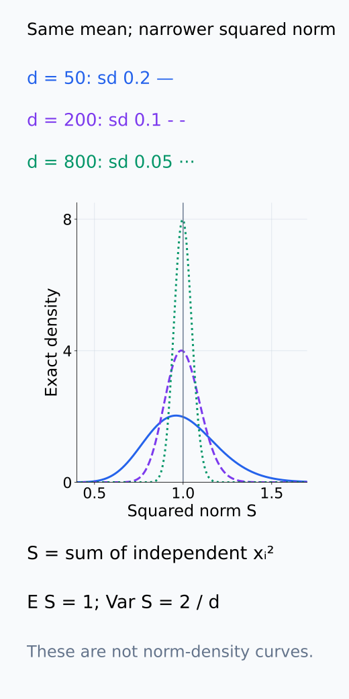
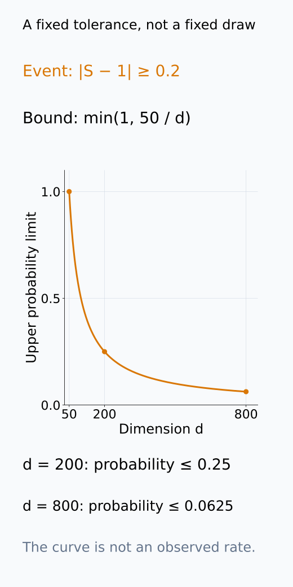
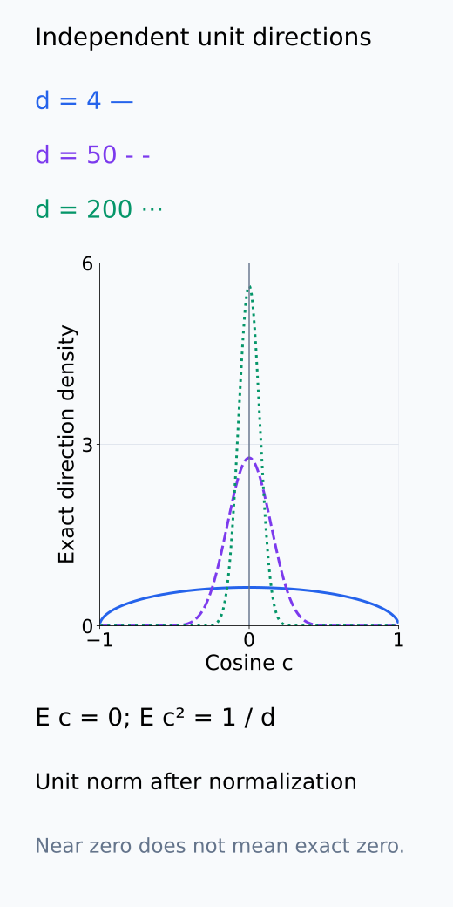
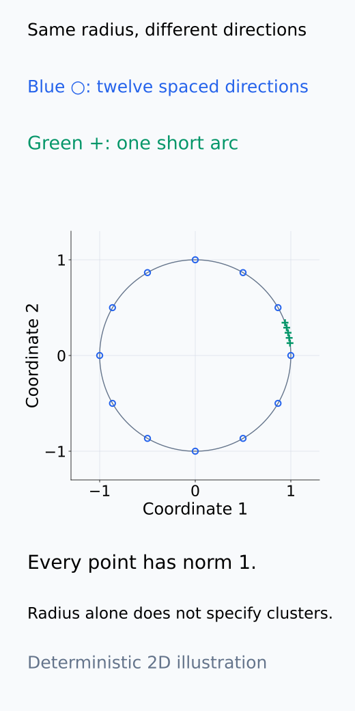
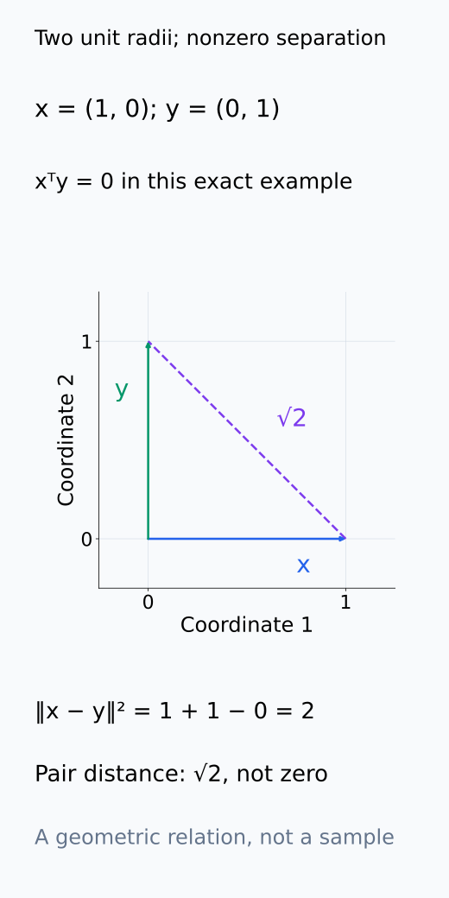
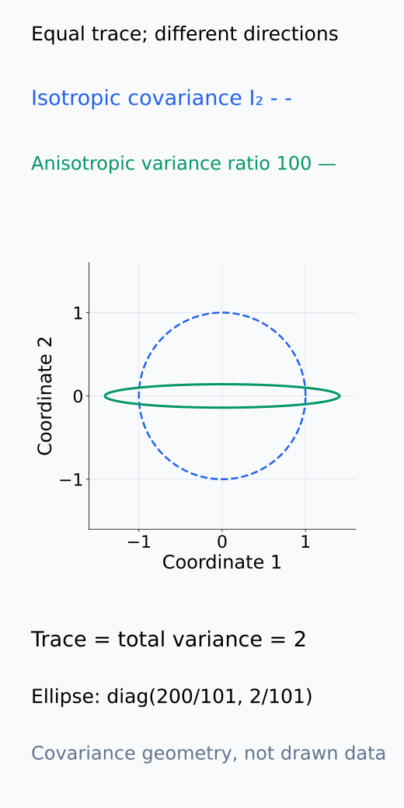
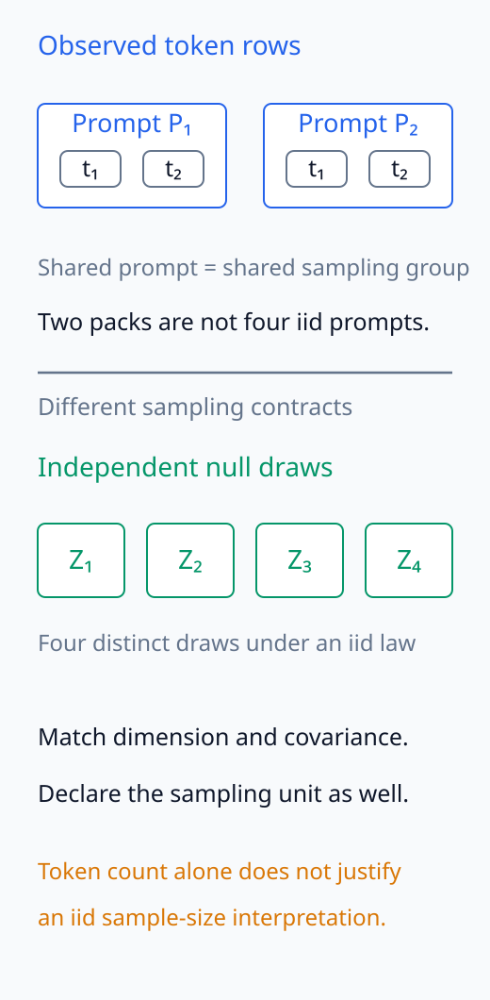
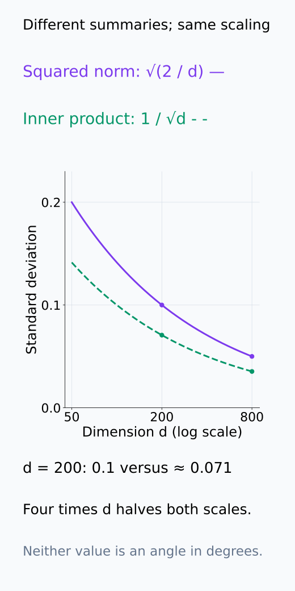

# A09-RMT-01. 고차원 공간의 집중현상

## 이 단원이 필요한 이유

고차원 random vector의 좌표는 흔들려도 norm과 pairwise inner product 같은 집계량은 좁은 범위에 모일 수 있다. activation의 cosine similarity나 random baseline을 해석하려면 차원이 커질 때 무엇이 집중되는지 먼저 확인해야 한다.

## 학습 목표

- isotropic Gaussian vector의 squared norm 평균과 분산을 계산할 수 있다.
- 독립 random direction의 inner product scale을 설명할 수 있다.
- concentration과 low-dimensional clustering을 구분할 수 있다.
- activation geometry에 dimension-matched null model을 설정할 수 있다.

## 선수지식 확인

- 선수 단원: [M02-03 내적, 길이와 각도](../../part-1-foundations/M02/M02-03-inner-product-length-angle.md), [M04-04 기댓값, 분산과 공분산](../../part-1-foundations/M04/M04-04-expectation-variance-covariance.md), [M04-05 주요 분포](../../part-1-foundations/M04/M04-05-common-distributions.md)
- 확인 질문: 독립 random variable의 합에서 variance는 어떤 조건 아래 더해지는가?

## 기호와 용어

| 기호·용어 | Common spoken reading | 의미 | shape·범위 |
|---|---|---|---|
| $x\sim\mathcal N(0,I_d/d)$ | `x is Gaussian with mean zero and covariance I sub d over d` | expected squared norm이 1인 scaled isotropic vector | $d$-vector |
| $\lVert x\rVert_2^2$ | `the squared Euclidean norm of x` | coordinate 제곱의 합 | nonnegative scalar |
| $x^\top y$ | `x transpose y` | 두 vector의 inner product | scalar |
| $d$ | `the ambient dimension d` | vector가 놓인 ambient dimension | positive integer |

## 핵심 개념

### coordinate의 분산에서 squared norm의 분산으로

$x_i\overset{\mathrm{iid}}\sim\mathcal N(0,1/d)$는 각 coordinate의 평균이 0, variance가 $1/d$이고 coordinate들이 독립이라는 뜻이다. covariance가 identity의 상수배여서 특정 방향에 더 큰 variance를 주지 않는다. 보통 isotropic vector를 covariance $I_d$로 정규화하기도 하지만, 여기서는 그 vector를 $1/\sqrt d$배 하여 expected squared norm을 1로 맞춘다.

standard normal $Z$의 $E[Z^2]=1$, $E[Z^4]=3$을 사용하면 $x_i=Z_i/\sqrt d$에서

$$
E[x_i^2]=\frac1d,\qquad
\operatorname{Var}(x_i^2)
=E[x_i^4]-(E[x_i^2])^2
=\frac{3}{d^2}-\frac{1}{d^2}
=\frac{2}{d^2}
$$

이다. $x_i$의 variance와 그 제곱 $x_i^2$의 variance는 다른 계산이다. coordinate 제곱들도 독립이므로 합의 variance에는 covariance 항이 남지 않아

$$
\lVert x\rVert_2^2=\sum_{i=1}^d x_i^2,
\qquad
E\lVert x\rVert_2^2=1,
\qquad
\operatorname{Var}(\lVert x\rVert_2^2)=\frac{2}{d}.
$$

를 얻는다. 평균은 $d$개의 $1/d$를, variance는 $d$개의 $2/d^2$를 더한 것이다. dimension이 커질수록 squared norm의 standard deviation $\sqrt{2/d}$가 줄어든다. scale을 맞추지 않고 covariance $I_d$를 사용하면 평균은 $d$, variance는 $2d$이므로 정규화 없이 두 결과를 섞지 않는다.

집중은 지정한 오차 밖에 있을 확률이 작아진다는 뜻이다. $S=\lVert x\rVert^2$에 대해 $|S-1|\geq\epsilon$인 경우에는 $(S-1)^2\geq\epsilon^2$이므로 $E[(S-1)^2]\geq\epsilon^2P(|S-1|\geq\epsilon)$이다. 따라서 $\epsilon>0$에서

$$
P\bigl(|\lVert x\rVert^2-1|\geq\epsilon\bigr)
\leq\frac{2}{d\epsilon^2}
$$

이다. 고정한 오차 폭에서 $d$가 커지면 이 상한이 줄어든다. 모든 draw의 norm이 정확히 1이거나 standard deviation 안에 반드시 들어간다는 뜻은 아니다.

다음 두 그림은 squared norm의 분포 폭과 고정한 오차 사건의 상한을 구분한다. 첫 축의 S와 둘째 그림의 확률 상한을 같은 측정값으로 읽지 않는다.

<figure class="lesson-figure" markdown="1">

<figcaption>d=50, 200, 800에서 S=‖x‖²의 정확한 Gaussian 예제 분포를 그렸다. 평균은 1로 같고 standard deviation은 0.2, 0.1, 0.05이다. 이 축은 norm이 아니라 squared norm이며 선의 폭이 줄어도 모든 draw가 1이 되는 것은 아니다.</figcaption>

</figure>

<figure class="lesson-figure" markdown="1">

<figcaption>설명용 ε=0.2를 고정하여 min(1, 2/(dε²))를 그렸다. d=50에서는 1, d=200에서는 0.25, d=800에서는 0.0625라는 상한이다. 실제 이탈 확률이나 모든 draw의 최대 오차를 측정한 곡선이 아니다.</figcaption>

</figure>

### 독립 vector의 inner product scale

독립인 $x,y\sim\mathcal N(0,I_d/d)$에서 $x_i y_i$의 평균은 $E[x_i]E[y_i]=0$이고 제곱의 평균은 $E[x_i^2]E[y_i^2]=1/d^2$이다. 서로 다른 coordinate의 곱들도 독립이므로

$$
E[x^\top y]=0,\qquad
\operatorname{Var}(x^\top y)
=\sum_{i=1}^d\operatorname{Var}(x_i y_i)
=\frac1d
$$

이다. inner product의 typical fluctuation은 $1/\sqrt d$ scale이다. cosine은 여기에 두 norm의 곱으로 나누지만 그 norm들이 1 근처에 집중하므로 같은 scale로 작아진다. Gaussian 방향을 unit vector로 정규화한 경우에는 독립 uniform direction의 squared cosine 평균도 정확히 $1/d$이다. 거의 orthogonal하다는 말은 cosine이 0 근처에 있다는 뜻이며, 유한 $d$에서 정확한 직교를 보장하지 않는다. 하나의 독립 pair에 관한 scale을 큰 dataset의 모든 pair에 대한 동시 보장으로 바꾸어 쓰지도 않는다.

unit direction으로 정규화한 경우에는 아래 분포에서 dimension별 cosine의 집중을 비교할 수 있다.

<figure class="lesson-figure" markdown="1">

<figcaption>Gaussian vector를 unit norm으로 정규화한 독립 두 방향의 cosine 분포를 그렸다. d=4, 50, 200에서 평균은 0이고 squared cosine의 평균은 1/d이다. 높아진 곡선은 0 근처의 집중을 나타내지만 유한 d에서 각 pair가 정확히 직교한다는 뜻은 아니다.</figcaption>

</figure>

### sphere 근처에 있다는 것과 cluster

$\lVert x\rVert$가 1 근처라는 결과는 원점으로부터의 거리만 제한한다. 방향은 서로 달라질 수 있다. 독립 두 vector의 squared distance는 $\lVert x-y\rVert^2=\lVert x\rVert^2+\lVert y\rVert^2-2x^\top y$이므로 위 scaling에서는 2 근처, distance는 $\sqrt2$ 근처에 놓인다. 각 norm이 비슷해져도 두 point가 서로 같은 위치로 모이는 것은 아니다. low-dimensional clustering은 특정 부분공간이나 몇 개의 중심 근처에 모인다는 추가적인 구조를 말한다.

다음 평면 그림은 radius와 방향 분포를 분리하고, 같은 norm을 가진 두 점 사이의 거리 계산을 직접 따라가게 한다.

<figure class="lesson-figure" markdown="1">

<figcaption>2차원 설명용 점들이다. 파란 원들과 초록 +들은 모두 radius 1이지만 파란 점들은 여러 방향에, 초록 점들은 짧은 arc에 놓였다. 같은 radial 분포만으로 방향별 clustering을 알 수 없으며 이 평면 그림 자체를 고차원 Gaussian draw의 시뮬레이션으로 해석하지 않는다.</figcaption>

</figure>

<figure class="lesson-figure" markdown="1">

<figcaption>x=(1,0), y=(0,1)의 정확한 평면 계산이다. 두 norm은 1, inner product는 0이므로 ‖x−y‖²=1+1−0=2이다. 고차원 예제에서 norm≈1과 inner product≈0을 함께 쓰는 관계를 보여 주며 이 두 점이 random draw라는 주장은 하지 않는다.</figcaption>

</figure>

### 관찰 geometry와 null의 조건

concentration은 모든 dataset이 sphere에 균일하게 놓인다는 뜻이 아니다. anisotropy, dependence와 low-dimensional signal이 있으면 norm과 angle distribution이 달라진다. 관찰값을 해석할 때 dimension, marginal variance와 sample dependence를 맞춘 null distribution과 비교해야 한다.

width가 다른 두 layer의 cosine을 비교할 때는 각각의 $d$에서 독립 isotropic null의 scale을 구한다. covariance anisotropy가 큰 activation에는 그 null만으로 충분하지 않다. covariance를 보존하는 null이나 whitening 후의 비교는 각각 무엇을 고정하고 무엇을 제거하는지 명시한다. 같은 prompt의 token들은 독립 Gaussian draw와 다른 sampling 구조를 가지므로 token 수를 독립 반복 수로 취급하지 않는다.

null을 맞출 때에는 아래 covariance geometry와 sampling pack의 차이를 함께 확인한다. 같은 전체 variance나 같은 row 수만으로 같은 null이 되지는 않는다.

<figure class="lesson-figure" markdown="1">

<figcaption>2차원 설명용 covariance I₂와 diag(200/101, 2/101)의 geometry를 비교했다. 둘 다 trace 2이지만 뒤 covariance의 좌표 variance 비율은 100이라 특정 방향으로 길어진다. 선은 covariance의 주축 scale을 나타내며 실제 activation 분포나 sample cloud를 그린 것이 아니다.</figcaption>

</figure>

<figure class="lesson-figure" markdown="1">

<figcaption>설명용 네 token row를 두 prompt pack으로 묶었다. 같은 prompt의 row는 독립이라는 보장이 없으므로 네 row를 네 iid prompt로 세지 않는다. 아래의 Z₁~Z₄는 독립 null draw라는 별도 계약이다. 묶음은 공통 prompt를 표시하며 특정 covariance 값을 가정하지 않는다.</figcaption>

</figure>

## 작은 예제

$d=200$이면 squared norm의 standard deviation은 $\sqrt{2/200}=0.1$이다. 같은 scaling에서 독립 inner product의 standard deviation은 $1/\sqrt{200}\approx0.071$이다.

첫 0.1은 squared norm의 흔들림이고 둘째 0.071은 inner product의 흔들림이다. 둘을 norm 자체의 standard deviation이나 angle의 도 단위로 읽지 않는다. 같은 normalization에서 $d$를 네 배로 늘리면 두 standard deviation은 모두 절반이 된다.

아래에서는 기존 d=200 예제의 두 standard deviation을 서로 다른 곡선으로 표시하여 width 변화와 함께 비교한다.

<figure class="lesson-figure" markdown="1">

<figcaption>squared norm의 standard deviation √(2/d)와 독립 inner product의 standard deviation 1/√d는 서로 다른 집계량의 흔들림이다. 기존 d=200 예제의 0.1과 약 0.071을 표시했다. d를 800으로 네 배 늘리면 두 값 모두 절반이므로 layer별 width에 맞는 null scale을 사용한다.</figcaption>

</figure>

## 흔한 오해

- distance가 집중된다는 사실이 모든 point가 같은 의미를 가진다는 뜻은 아니다.
- 높은 dimension만으로 empirical sample이 population concentration regime에 들어가지는 않는다. sample dependence와 tail behavior를 확인해야 한다.

## 연습문제

### 1. norm variance
$d=50$일 때 $\lVert x\rVert^2$의 variance를 구하라.

해설 보기

$2/d=2/50=0.04$이다.

### 2. inner product scale
$d$가 100에서 400으로 늘면 독립 inner product의 standard deviation은 몇 배가 되는가?

해설 보기

$1/\sqrt d$ scaling이므로 $1/2$배가 된다.

### 3. anisotropy
한 coordinate의 variance가 다른 coordinate보다 100배 크면 isotropic null의 angle 예측을 그대로 써도 되는가?

해설 보기

쓸 수 없다. covariance anisotropy가 특정 방향을 지배하므로 covariance를 맞춘 null이나 whitening 뒤 비교가 필요하다.

### 4. 모델 해석
layer width가 다른 두 activation의 raw cosine histogram을 비교할 때 어떤 null을 함께 보고해야 하는가?

해설 보기

각 layer의 dimension, norm 또는 covariance와 sampling unit을 맞춘 random-vector cosine distribution을 함께 보고한다.

## 근거와 갱신 경계

계산은 iid Gaussian 예제에 한정한다. sub-Gaussian concentration inequality의 상수와 heavy-tailed 분포의 별도 이론은 다루지 않는다.

- [Vershynin, High-Dimensional Probability](https://webapps.math.uci.edu/~rvershyn/papers/HDP-book/HDP-1.pdf): §3.1~3.2의 norm concentration·isotropy·독립 vector geometry를 대조했다. 본문은 Gaussian moment와 variance의 합, 오차 사건에 대한 항별 부등식으로 scale을 직접 계산한다.

## 단원 요약

- isotropic Gaussian squared norm의 variance는 $2/d$이다.
- 독립 inner product의 scale은 $1/\sqrt d$이다.
- concentration은 random baseline이지 semantic structure의 부재를 뜻하지 않는다.
- null model은 dimension과 covariance 조건을 맞춰야 한다.

## 통과 기준

- norm과 inner product의 concentration scale을 계산할 수 있는가?
- observed geometry와 dimension effect를 분리하는 null을 제안할 수 있는가?

## 다음 단원

- [A09-RMT-02 random projection](A09-RMT-02-random-projection.md)

## 집필자 점검표

- [x] norm·inner product concentration과 null model을 연결했다.
- [x] 문제 4개에 해설이 있다.
- [x] Common spoken reading이 실제 영어 학술 발화이며 한글 음역이나 기계적 직역을 포함하지 않는다.
- [x] 선수지식과 링크를 확인했다.
