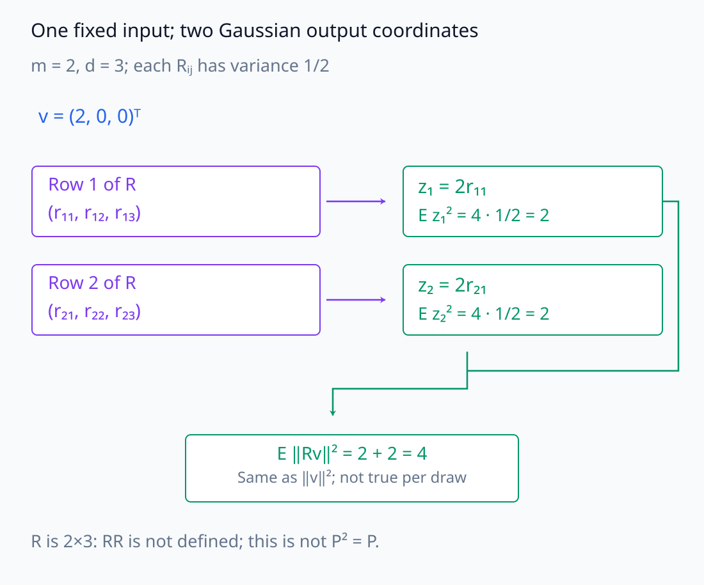
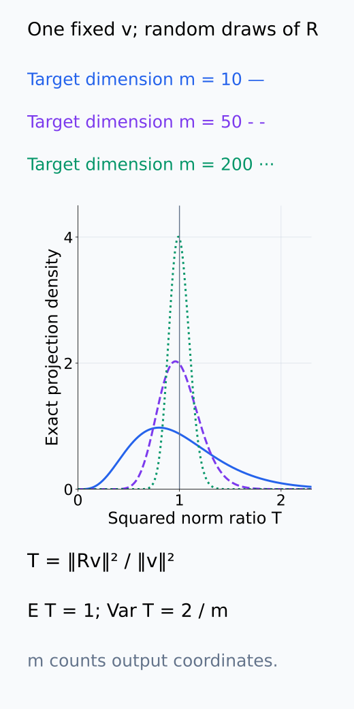
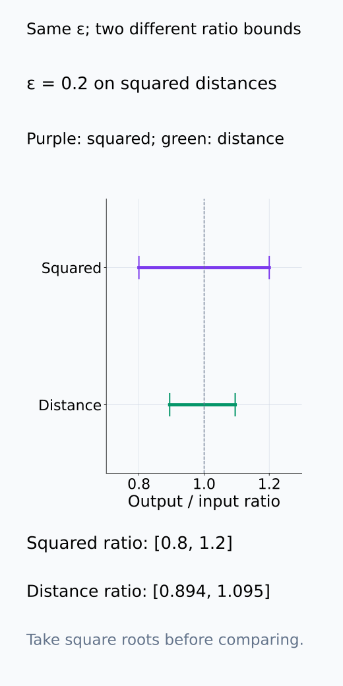
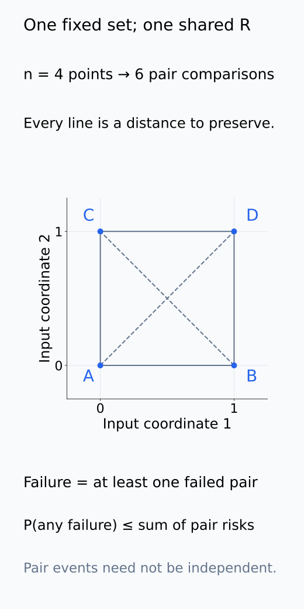
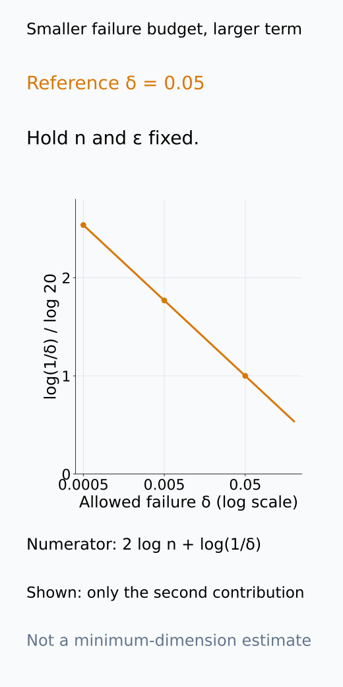
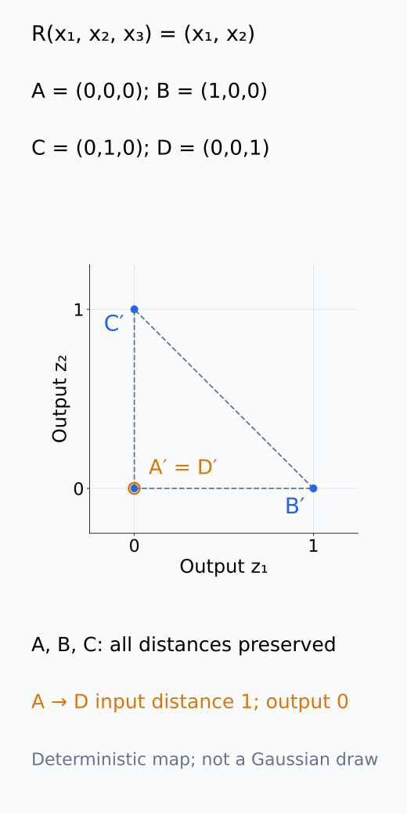
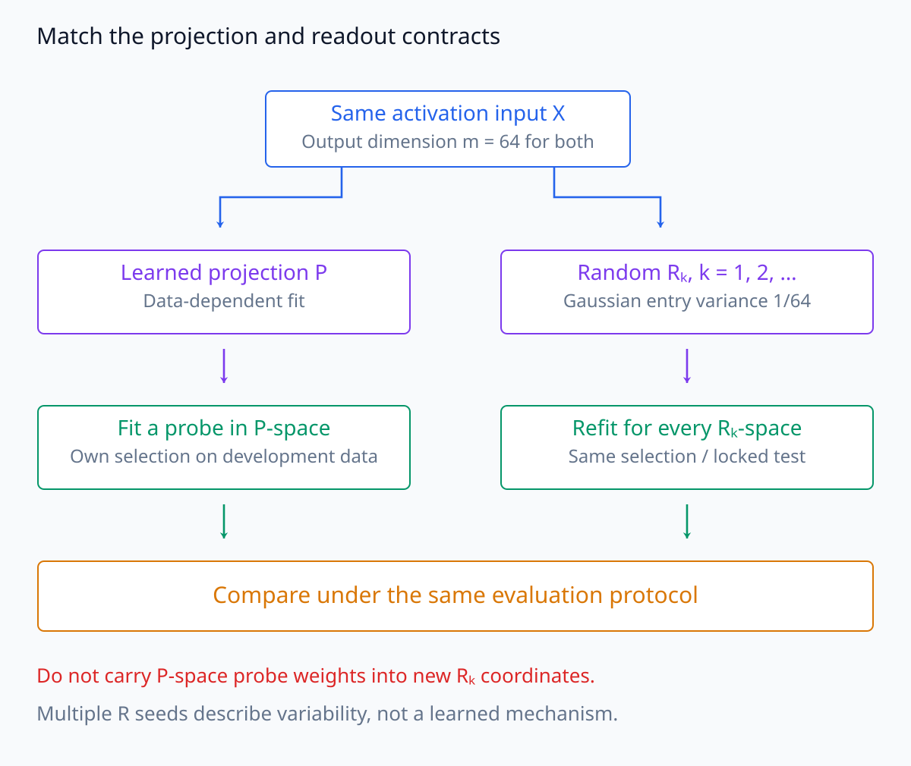
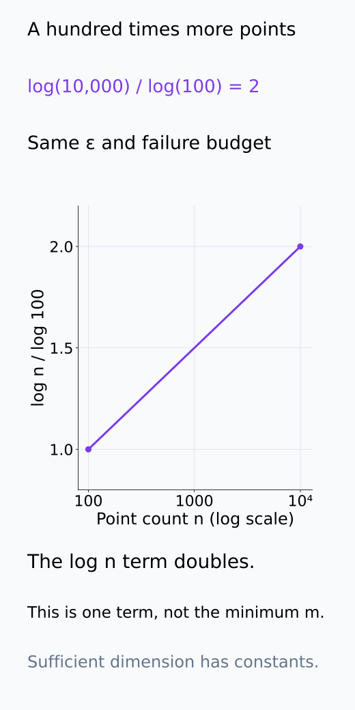
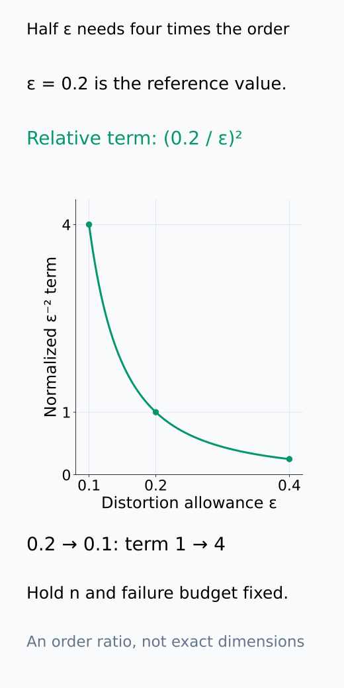

# A09-RMT-02. random projection

## 이 단원이 필요한 이유

representation dimension이 커도 finite point set의 pairwise distance를 보존하는 낮은 차원 random embedding을 만들 수 있다. random projection은 시각화나 압축의 대조군이며, learned projection이 얻은 성능을 dimension reduction 자체의 효과와 분리하는 데 쓴다.

## 학습 목표

- Gaussian random projection의 scaling을 쓸 수 있다.
- Johnson–Lindenstrauss 보장의 대상을 설명할 수 있다.
- target dimension이 point 수와 distortion에 의존하는 방식을 설명할 수 있다.
- random projection을 learned projection의 control로 설계할 수 있다.

## 선수지식 확인

- 선수 단원: [M02-04 행렬과 행렬곱](../../part-1-foundations/M02/M02-04-matrices-matrix-multiplication.md), [M02-09 직교기저와 정사영](../../part-1-foundations/M02/M02-09-orthogonal-basis-projection.md), [A09-RMT-01 고차원 공간의 집중현상](A09-RMT-01-high-dimensional-concentration.md)
- 확인 질문: matrix $R\in\mathbb R^{m\times d}$가 $d$-vector에 작용하면 output shape은 무엇인가?

## 기호와 용어

| 기호·용어 | Common spoken reading | 의미 | shape·범위 |
|---|---|---|---|
| $R\in\mathbb R^{m\times d}$ | `R is an m by d matrix` | random projection matrix | $m\times d$ |
| $z=Rx$ | `z equals R x` | projected representation | $m$-vector |
| $\varepsilon$ | `epsilon` | 허용 relative squared-distance distortion | number in $(0,1)$ |
| $\delta$ | `delta` | 허용 전체 실패 확률 | number in $(0,1)$ |
| $m=O(\varepsilon^{-2}\log n)$ | `m is on the order of epsilon to the minus two log n` | JL target dimension scaling | positive integer order |

## 핵심 개념

### Gaussian matrix의 scaling

$R_{ij}\sim\mathcal N(0,1/m)$로 독립 추출하고 $z=Rx$로 둔다. $R$의 한 row는 input coordinate들을 서로 다른 random coefficient로 합해 output coordinate 하나를 만든다. 고정 vector $v$에 대해 $(Rv)_i=\sum_j R_{ij}v_j$의 평균은 0이며, 독립 coefficient의 분산을 합하면

$$
\operatorname{Var}((Rv)_i)=\sum_{j=1}^d\frac{v_j^2}{m}
=\frac{\lVert v\rVert^2}{m}
$$

이다. 평균이 0이므로 이것이 $E[(Rv)_i^2]$이기도 하다. output coordinate $m$개의 제곱을 더하면 $E\lVert Rv\rVert^2=\lVert v\rVert^2$가 된다. variance를 $1/d$가 아닌 $1/m$으로 정하는 이유가 이 합산에 있다.

$v\ne0$이면 Gaussian 합의 성질에 따라 $\sqrt m(Rv)_i/\lVert v\rVert$는 독립 standard Gaussian이다. 따라서 $\lVert Rv\rVert^2/\lVert v\rVert^2$는 앞 단원의 $m$차원 squared norm과 같은 분포이며, 평균 1과 분산 $2/m$을 갖는다. 평균 보존은 모든 $R$에서 norm이 같다는 뜻이 아니고, 집중은 큰 $m$에서 상대 오차가 작을 확률이 높다는 뜻이다.

여기서 projection이라는 이름은 낮은 차원으로 보내는 linear map을 가리킨다. Gaussian $R$의 row는 보통 서로 직교하지 않는다. M02-09의 같은 공간 위 정사영처럼 $P^2=P$를 요구하지 않으며, $m<d$에서는 이 식을 $m\times d$ matrix $R$에 적용하는 것부터 shape이 맞지 않는다.

아래에서는 한 input의 row별 expected square를 합하는 경로와, 같은 input을 유지한 R draw의 norm-ratio 분포를 나누어 읽는다.

<figure class="lesson-figure lesson-figure--wide" markdown="1">

<figcaption>설명용 m=2, d=3과 v=(2,0,0)ᵀ를 사용했다. z₁=2r₁₁, z₂=2r₂₁의 expected square는 각각 2이고 합은 원래 ‖v‖²=4이다. 평균 보존이지 매번 뽑은 R의 norm 보존은 아니며 2×3의 R에 RR이나 P²=P를 요구하지 않는다.</figcaption>

</figure>

<figure class="lesson-figure" markdown="1">

<figcaption>고정한 v≠0에서 T=‖Rv‖²/‖v‖²의 분포를 m=10, 50, 200으로 비교했다. 평균은 모두 1, 분산은 2/m이다. m은 output dimension이며 원래 ambient d로 바꾸어 읽지 않는다.</figcaption>

</figure>

### 한 vector의 길이에서 모든 점 쌍의 거리로

Johnson–Lindenstrauss lemma는 $n$개 point의 finite set에 대해 $m=O(\varepsilon^{-2}\log n)$ 차원으로 보내는 map이 존재하며 모든 pairwise squared distance를 대략

$$
(1-\varepsilon)\lVert x_i-x_j\rVert^2
\le
\lVert Rx_i-Rx_j\rVert^2
\le
(1+\varepsilon)\lVert x_i-x_j\rVert^2
$$

범위에 보존할 수 있다고 말한다. linearity로 $Rx_i-Rx_j=R(x_i-x_j)$이므로, distance 보존은 각 차이 vector의 norm 보존 문제다. 부등식은 squared distance에 관한 것이며 distance 자체의 비율은 $\sqrt{1-\varepsilon}$과 $\sqrt{1+\varepsilon}$ 사이에 놓인다.

한 쌍에 대한 보장만으로 모든 쌍의 보장이 되지는 않는다. 점 쌍은 최대 $n(n-1)/2$개이고, 전체 실패는 그중 적어도 하나의 실패다. 각 실패 확률을 더한 값으로 전체 실패 확률을 상한할 수 있으며, 쌍 사이의 사건이 독립일 필요는 없다. 반대로 같은 하나의 $R$을 모든 점에 적용해야 하나의 embedding이 된다.

다음 그림은 squared distance와 distance 비율의 차이를 표시하고, 동시에 보존해야 하는 pair들을 같은 point set에서 연결한다.

<figure class="lesson-figure" markdown="1">

<figcaption>ε=0.2의 설명용 비교이다. squared distance 비율은 [0.8,1.2]이고 distance 비율은 [√0.8,√1.2]≈[0.894,1.095]이다. 두 선은 같은 종류의 distance를 두 번 그린 것이 아니라 제곱 여부가 다른 비율이다.</figcaption>

</figure>

<figure class="lesson-figure" markdown="1">

<figcaption>설명용 네 점에서는 여섯 pair가 있다. 선은 pairwise distance 비교 대상을 나타내며 모든 점에 같은 하나의 R을 적용한다. 어느 하나의 실패가 전체 실패가 되므로 각 실패 확률을 합해 상한한다. 여섯 사건이 독립이라고 가정하지 않는다.</figcaption>

</figure>

### dimension과 실패 확률

Gaussian projection에는 고정된 차이 vector의 상대 squared-norm 오차가 $\varepsilon$을 넘을 확률이 $2\exp(-c m\varepsilon^2)$ 이하라는 상한이 있다. $0<\varepsilon<1$이며 $c>0$은 고정 상수다. 이 exponential 상한의 증명은 여기서 다루지 않지만, 앞 단원의 분산 상한보다 빠르게 감소한다는 점이 JL scaling의 핵심이다. 모든 쌍에 합하면 실패 확률의 상한은 $n^2\exp(-c m\varepsilon^2)$이다. 이를 $\delta$ 이하로 두려면 충분한 dimension은

$$
m\ge \frac{2\log n+\log(1/\delta)}{c\varepsilon^2}
$$

형태다. 고정된 failure probability에서는 $\varepsilon^{-2}\log n$ order가 남는다. 이는 충분한 dimension의 scaling이지 정확한 최소 dimension이나 모든 dataset에 필요한 차원 수를 주는 식은 아니다. 정확한 상수는 projection distribution과 허용 실패 확률에 따라 달라진다.

아래에서는 충분 dimension 식 가운데 failure-budget 항만 떼어 δ 변화와 비교한다.

<figure class="lesson-figure" markdown="1">

<figcaption>설명용 δ=0.05의 log(1/δ) 항을 1로 정규화했다. 더 작은 δ는 이 항을 키우며 m의 충분 조건에서는 2log n과 함께 더해진다. plotted 값은 dimension 전체가 아니라 failure-budget 항의 변화이다.</figcaption>

</figure>

### finite set의 보장과 random control

random projection은 지정 finite set의 distance 보존을 다룬다. unseen population, label separation이나 nonlinear manifold의 topology를 자동 보장하지 않는다.

확률은 고정된 point set에 대해 $R$을 추출하는 randomness에 관한 것이다. $R$을 보고 가장 크게 찌그러진 새 point를 고르는 경우는 같은 계약이 아니다. 특히 $m<d$이면 $R$에 nonzero null vector가 있어 그 방향의 거리는 0으로 줄어든다. 모든 가능한 input의 거리를 동시에 보존할 수는 없지만, 미리 지정한 finite set에서는 해당 방향을 피하며 보존할 수 있다는 것이 차이다.

learned projection과 비교할 때에는 input activation·output dimension·preprocessing을 맞추고, random $R$마다 probe를 다시 fit하여 동일한 selection/test 절차로 평가한다. learned representation의 좌표에 fit한 probe를 random 좌표에 그대로 적용하면 projection 품질과 readout 부정합을 섞는다. 여러 random seed는 우연히 잘 나온 한 matrix를 기준으로 삼지 않게 해 주며, 이것만으로 learned projection의 기제가 식별되지는 않는다.

다음 두 그림은 finite set 밖의 null direction과, projection마다 readout을 다시 맞추는 control 경로를 각각 보여 준다.

<figure class="lesson-figure" markdown="1">

<figcaption>설명용 R(x₁,x₂,x₃)=(x₁,x₂)이다. 미리 둔 A,B,C의 거리는 그대로지만 다른 D=(0,0,1)은 A와 같은 output으로 간다. 이 map은 Gaussian draw나 JL의 확률 보장 예제가 아니라 m&lt;d의 null direction과 finite-set 계약의 차이를 보여 주는 정확한 선형 계산이다.</figcaption>

</figure>

<figure class="lesson-figure lesson-figure--wide" markdown="1">

<figcaption>두 경로는 같은 activation과 output dimension 64를 사용한다. random Rₖ마다 그 좌표계의 probe를 다시 fit하여 같은 selection/test 규칙으로 평가한다. learned-space probe를 그대로 옮기는 비교나 여러 seed만으로 learned mechanism을 식별한다는 주장은 하지 않는다.</figcaption>

</figure>

## 작은 예제

point 수를 100배 늘리면 dimension 상한의 $\log n$ 항은 $\log(100n)$으로 바뀐다. 반면 허용 distortion을 절반으로 줄이면 $\varepsilon^{-2}$ scaling 때문에 필요한 dimension order가 4배로 커진다.

첫 문장의 logarithmic 증가는 $\log(100n)=\log n+\log100$이라는 뜻이다. 같은 상수·실패 확률에서 $n=100$을 $10{,}000$으로 바꾸면 log 항은 2배가 된다. point 수의 100배 증가를 dimension의 100배 증가로 읽으면 안 된다. 두 번째 비교는 다른 조건을 고정하고 $\varepsilon$만 바꾼 경우다.

아래 두 곡선에서는 n의 log 항 변화와 ε의 inverse-square 항 변화를 분리하여 기존 예제의 배율을 확인한다.

<figure class="lesson-figure" markdown="1">

<figcaption>기존 n=100→10,000 예제를 log n/log100이라는 공통 기준으로 그렸다. point 수는 100배지만 log 항은 2배이다. y축은 전체 충분 m이나 최소 dimension이 아니라 식 안의 log n 항이다.</figcaption>

</figure>

<figure class="lesson-figure" markdown="1">

<figcaption>다른 조건을 고정하고 ε⁻² 항을 ε=0.2에서 1로 정규화했다. ε=0.1에서는 4이므로 distortion 절반이 dimension order 네 배와 연결된다. 숨은 상수나 정확한 최소 m을 계산한 곡선이 아니다.</figcaption>

</figure>

## 흔한 오해

- random projection과 PCA는 목적이 다르다. PCA는 data variance를 사용하고 random projection은 data-independent matrix를 쓴다.
- 2차원 시각화가 pairwise distance를 잘 보존할 것이라는 보장은 보통 없다.

## 연습문제

### 1. scaling
$R_{ij}$의 variance를 $1/m$로 두는 이유를 한 문장으로 설명하라.

해설 보기

$m$개 projected coordinate의 expected squared contribution을 합했을 때 원래 squared norm이 유지되도록 scaling한다.

### 2. distortion
$\varepsilon$을 $0.2$에서 $0.1$로 줄이면 JL dimension order는 몇 배가 되는가?

해설 보기

$\varepsilon^{-2}$에 비례하므로 4배가 된다.

### 3. finite set
training activation의 거리가 보존됐다는 결과가 unseen prompt에도 같은 distortion을 보장하는가?

해설 보기

보장하지 않는다. JL statement의 finite set에 unseen point가 포함되지 않았기 때문이다.

### 4. 모델 해석
learned 64-dimensional projection의 probe accuracy를 평가할 때 어떤 random control을 두는가?

해설 보기

같은 input activation과 output dimension에 여러 random projection seed를 적용하고 동일한 probe selection·test protocol을 반복한다.

## 근거와 갱신 경계

이 단원은 Gaussian random projection과 JL scaling의 역할을 다룬다. sparse transform의 계산 복잡도와 최적 상수는 범위 밖이다.

finite set의 동시 보장과 점 쌍에 대한 확률 합산은 [Dasgupta–Gupta, An elementary proof of a theorem of Johnson and Lindenstrauss](https://cseweb.ucsd.edu/~dasgupta/papers/jl.pdf)의 정리·증명 구조를 기준으로 한다. 본문의 Gaussian row 분산과 dimension 식은 이 단원의 normalization에 맞춰 전개했다.

## 단원 요약

- Gaussian projection은 expected squared norm을 보존하도록 scale한다.
- JL lemma는 finite point set의 pairwise distance를 낮은 차원에서 보존한다.
- 필요한 dimension은 $\log n$과 $\varepsilon^{-2}$에 따라 증가한다.
- random projection은 learned compression의 data-independent control이다.

## 통과 기준

- projection shape과 scaling을 쓸 수 있는가?
- JL 보장이 답하지 않는 population 질문을 구분할 수 있는가?

## 다음 단원

- [A09-RMT-03 표본 공분산의 spectrum](A09-RMT-03-sample-covariance-spectrum.md)

## 집필자 점검표

- [x] JL 보장의 대상·dimension scaling·control 역할을 구분했다.
- [x] 문제 4개에 해설이 있다.
- [x] Common spoken reading이 실제 영어 학술 발화이며 한글 음역이나 기계적 직역을 포함하지 않는다.
- [x] 선수지식과 링크를 확인했다.
