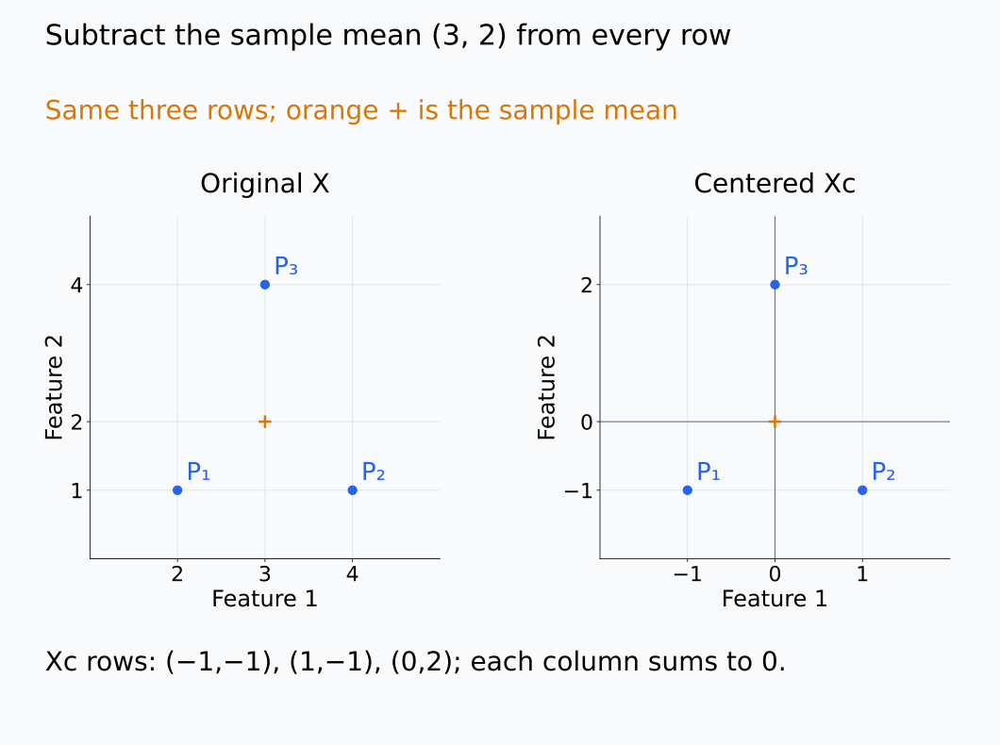
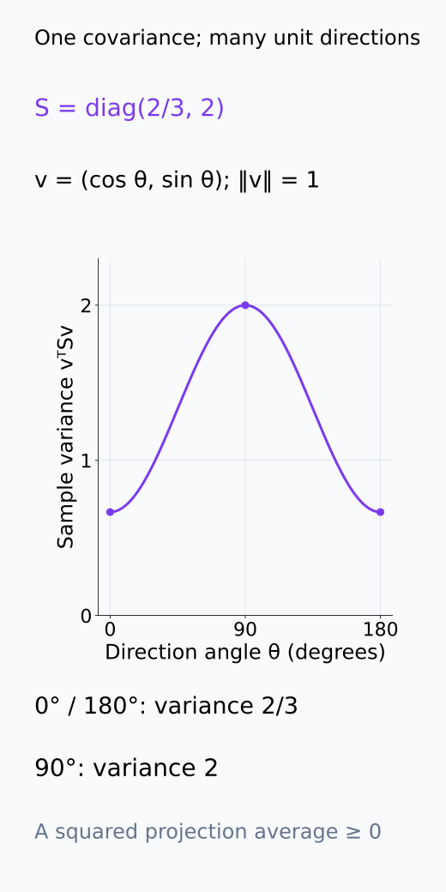
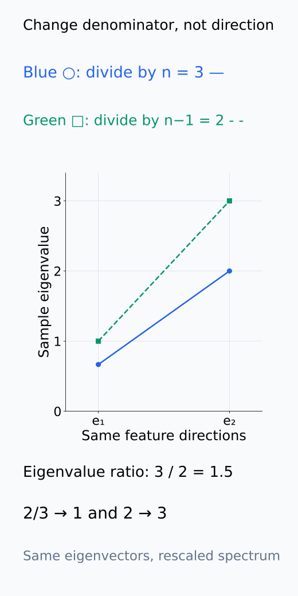
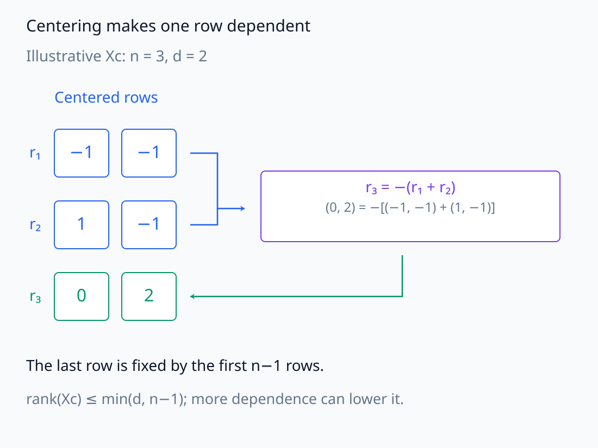
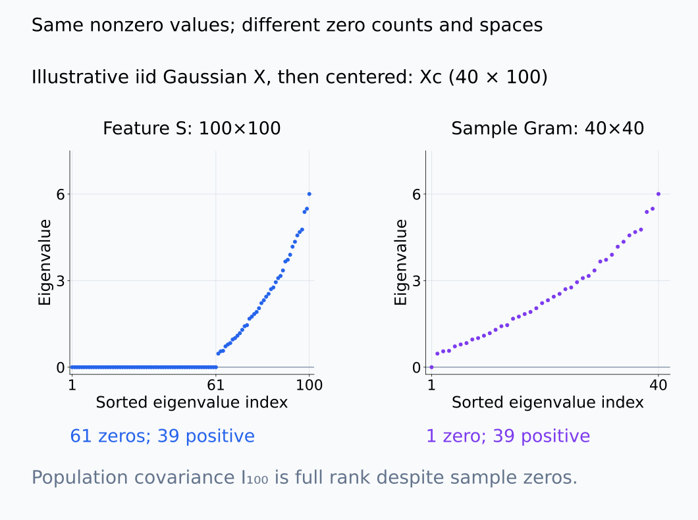
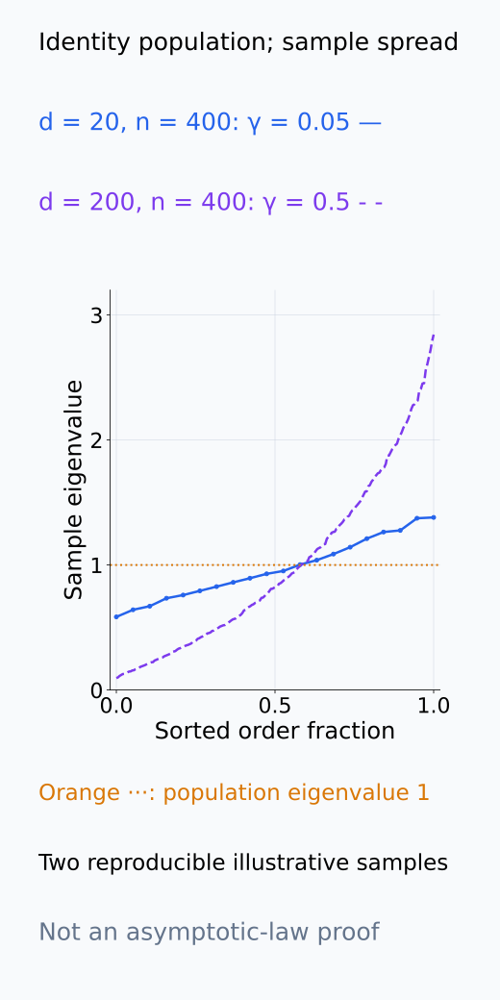
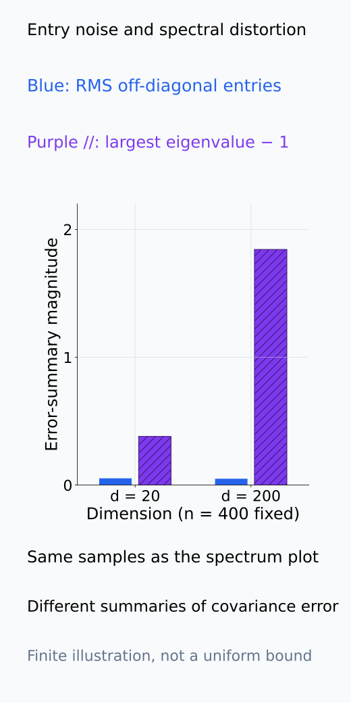
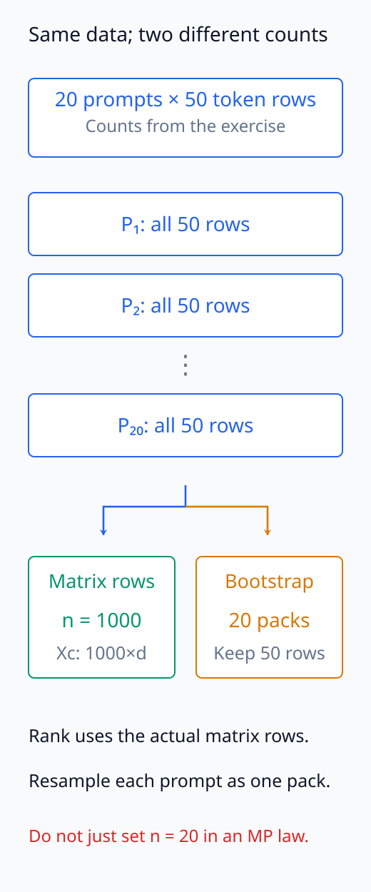

# A09-RMT-03. 표본 공분산의 spectrum

## 이 단원이 필요한 이유

activation covariance의 eigenvalue를 population variance direction으로 읽으려면 finite sample noise를 고려해야 한다. dimension $d$가 sample 수 $n$과 비슷하면 population covariance가 identity여도 sample eigenvalue가 넓게 퍼진다.

## 학습 목표

- centered data matrix에서 sample covariance를 계산할 수 있다.
- covariance rank가 sample 수와 dimension에 제한되는 방식을 설명할 수 있다.
- aspect ratio가 spectral noise에 미치는 영향을 설명할 수 있다.
- activation covariance 비교에서 experimental unit을 정할 수 있다.

## 선수지식 확인

- 선수 단원: [M02-12 대칭행렬과 스펙트럼 정리](../../part-1-foundations/M02/M02-12-symmetric-matrices-spectral-theorem.md), [M02-14 공분산과 PCA](../../part-1-foundations/M02/M02-14-covariance-pca.md), [M04-06 표본, 모집단과 표본분포](../../part-1-foundations/M04/M04-06-samples-populations-sampling-distributions.md)
- 확인 질문: centered data matrix $X\in\mathbb R^{n\times d}$에서 $X^\top X$의 shape은 무엇인가?

## 기호와 용어

| 기호·용어 | Common spoken reading | 의미 | shape·범위 |
|---|---|---|---|
| $X_c$ | `X sub c` | feature별 sample mean을 뺀 data matrix | $n\times d$ |
| $S=\frac1nX_c^\top X_c$ | `S equals one over n times X sub c transpose X sub c` | sample covariance convention | $d\times d$ |
| $\gamma=d/n$ | `gamma equals d over n` | dimension-to-sample aspect ratio | positive scalar |
| $\lambda_j(S)$ | `lambda sub j of S` | sample variance eigenvalue | nonnegative scalar |

## 핵심 개념

### centering과 covariance의 방향별 의미

row가 sample이고 column이 feature인 data matrix에서 column $j$의 평균 $\bar x_j=n^{-1}\sum_i x_{ij}$를 뺀다. 따라서 $(X_c)_{ij}=x_{ij}-\bar x_j$이며 각 column의 row 합은 0이다. centered matrix $X_c$에 대해

$$
S=\frac1nX_c^\top X_c
$$

를 sample covariance로 둔다. 원소 $S_{jk}=n^{-1}\sum_i(x_{ij}-\bar x_j)(x_{ik}-\bar x_k)$는 두 feature가 sample들에서 함께 변하는 정도다. feature를 합하는 unit direction $v\in\mathbb R^d$를 고르면

$$
v^\top Sv=\frac1n\lVert X_cv\rVert^2
=\frac1n\sum_i\bigl((x_i-\bar x)^\top v\bigr)^2
$$

이다. 이는 그 방향으로 투영한 값의 sample variance이며 항상 nonnegative다. 이 식으로 $S$가 PSD임을 확인한다. unit eigenvector $v_j$에는 $v_j^\top Sv_j=\lambda_j(S)$가 되어 eigenvalue를 방향별 variance로 읽을 수 있다.

$1/(n-1)$ convention도 있으므로 보고서에 denominator를 적는다. iid row의 population covariance가 $\Sigma$이면 sample mean을 뺀 위 $1/n$ 식은 $E[S]=(n-1)\Sigma/n$이고, $n>1$에서 $1/(n-1)$ 식은 unbiased다. 같은 데이터에서 denominator만 바꾸면 eigenvector는 유지되고 eigenvalue가 $n/(n-1)$배 된다. 서로 다른 normalization의 spectrum을 그대로 비교하면 scale 차이를 구조 차이로 오인할 수 있다.

다음 그림은 같은 작은 data의 mean 이동, unit direction별 variance와 denominator 변경을 나누어 추적한다.

<figure class="lesson-figure lesson-figure--wide" markdown="1">

<figcaption>설명용 세 row (2,1),(4,1),(3,4)의 sample mean은 (3,2)이다. 오른쪽은 같은 row에서 mean을 뺀 (−1,−1),(1,−1),(0,2)이며 각 column 합이 0이다. 평행이동은 point 사이의 상대 위치를 바꾸지 않는다.</figcaption>

</figure>

<figure class="lesson-figure" markdown="1">

<figcaption>앞 그림의 centered row에서 S=diag(2/3,2)이다. unit direction v=(cosθ,sinθ)의 projected variance vᵀSv는 0°·180°에서 2/3, 90°에서 2이다. 언제나 nonnegative이고 eigenvector 방향에서는 해당 eigenvalue가 된다.</figcaption>

</figure>

<figure class="lesson-figure" markdown="1">

<figcaption>같은 세 row의 denominator를 3에서 2로 바꾸면 eigenvalue는 n/(n−1)=1.5배가 된다. e₁·e₂라는 방향은 유지되고 값만 2/3→1, 2→3으로 커진다. 이를 새 anisotropy 방향으로 해석하지 않는다.</figcaption>

</figure>

### centering과 rank 제한

$X_c$의 column들은 모두 row 합이 0인 $\mathbb R^n$의 subspace에 있다. 이 subspace의 dimension은 $n-1$이므로 $\operatorname{rank}(X_c)\le\min(d,n-1)$이다. 또한 $Sv=0$이면 $v^\top Sv=\lVert X_cv\rVert^2/n=0$이므로 $X_cv=0$이고, 역방향도 성립한다. 두 matrix는 같은 feature-space null directions를 가지며 $\operatorname{rank}(S)=\operatorname{rank}(X_c)$다.

따라서 $d\ge n$이면 적어도 $d-n+1$개의 zero eigenvalue가 생긴다. 데이터 중복이나 추가 선형 제약이 있으면 rank는 더 작을 수 있다. zero eigenvalue는 수집한 centered row들에 대해 변화가 관측되지 않은 방향을 뜻하며, 새로운 sample도 그 방향으로 변하지 않는다는 결론은 아니다.

$X_c=U\Sigma_XV^\top$의 nonzero singular value를 $s_j$라 쓰면 $S$의 nonzero eigenvalue는 $s_j^2/n$이다. 이때 $V$는 feature 방향이고 $U$는 sample 방향이다. $X_cX_c^\top/n$도 같은 nonzero eigenvalue를 갖지만 $n\times n$ matrix이며, 두 spectrum의 zero 개수와 방향의 의미는 다르다.

아래에서는 centered row의 종속성과 두 Gram matrix가 공유하는 nonzero spectrum을 서로 다른 구조로 표시한다.

<figure class="lesson-figure lesson-figure--wide" markdown="1">

<figcaption>같은 n=3, d=2 예제에서 마지막 row (0,2)는 앞 두 row의 합에 minus를 붙인 값이다. centering의 row 합 0은 하나의 row를 다른 n−1 row로 정하게 하므로 rank는 min(d,n−1) 이하이다. 다른 종속성이 있으면 더 작을 수 있다.</figcaption>

</figure>

<figure class="lesson-figure lesson-figure--wide" markdown="1">

<figcaption>기존 n=40, d=100 계약의 설명용 iid Gaussian X를 추출한 뒤 centering하여 Xc를 얻었다. centering 후의 rank 39에서 feature covariance는 61개, sample Gram은 1개의 zero를 갖고 같은 39개 nonzero eigenvalue를 공유한다. sample 방향과 feature 방향은 다르다. 그림에서는 수치 오차 수준의 zero를 0으로 표시했으며 population covariance I₁₀₀의 null을 뜻하지 않는다.</figcaption>

</figure>

### entry의 오차와 spectrum의 오차

고정된 작은 $d$에서 iid row를 늘리고 second moment가 유한하면 각 sample covariance entry가 population 값에 접근한다. matrix 크기가 고정이므로 이 entrywise 접근은 spectrum의 접근으로 이어진다. 이것이 classical regime이다.

$d/n\to\gamma>0$인 high-dimensional regime에서는 matrix의 크기도 함께 늘어난다. 각 entry의 작은 오차만으로 전체 방향에서의 오차가 작다고 할 수 없다. 예를 들어 $\Sigma=I_d$여도 finite sample에서 off-diagonal entry가 정확히 0일 이유는 없다. 그 entry들이 함께 작용하면 eigenvalue들은 1 주위로 퍼진다. $\gamma$가 고정되면 이 퍼짐의 폭은 일반적으로 0으로 줄지 않는다.

여기서 남는 것은 population eigenvalue와 sample spectrum 사이의 distortion이다. 각 sample eigenvalue가 계속 크게 random하게 흔들린다는 뜻은 아니다. iid isotropic null에서는 큰 matrix의 eigenvalue 분포 자체가 일정한 bulk 형태로 안정될 수 있으며, 다음 단원이 이 구분을 설명한다.

다음 설명용 sample은 identity population에서도 sample spectrum이 퍼질 수 있음을 보여 준다. entry 오차와 eigenvalue distortion은 같은 값으로 취급하지 않는다.

<figure class="lesson-figure" markdown="1">

<figcaption>둘 다 population covariance I이고 n=400인 설명용 Gaussian sample이다. d=20의 γ=0.05와 d=200의 γ=0.5를 비교하여 sample eigenvalue의 정렬된 퍼짐을 보여 준다. 이 한 쌍의 finite sample은 asymptotic law의 증명이나 실제 layer의 관찰 결과가 아니다.</figcaption>

</figure>

<figure class="lesson-figure" markdown="1">

<figcaption>앞 그림과 같은 sample에서 off-diagonal entry의 root mean square와 max eigenvalue−1을 비교했다. 두 값은 서로 다른 오차 요약이며, 작은 entry들이 모인 큰 matrix의 spectrum을 각 entry 하나의 크기로 대체하지 않는 이유를 보여 준다. 일반적인 동시 상한이나 asymptotic 변동량을 새로 주장하지 않는다.</figcaption>

</figure>

### matrix row와 독립 관찰 단위

activation row가 token이면 같은 prompt 안 token의 dependence가 effective sample size를 줄일 수 있다. rank 계산의 $n$과 uncertainty를 위한 independent unit 수를 구분해야 한다.

rank와 $d/n$ 계산에는 실제 matrix에 넣은 row 수를 쓴다. prompt 단위 bootstrap은 같은 prompt의 token 묶음을 함께 resample하여 dependence를 유지한다. 독립 prompt 수를 $n$ 대신 대입한 MP 식이 자동으로 맞아지는 것은 아니다. iid row model을 쓰려면 그 가정을 별도로 확인해야 하며, row dependence를 보존한 null은 다른 spectral distribution을 가질 수 있다.

아래에서는 실제 matrix row 수와 prompt pack의 수를 서로 다른 계산 경로에 배치한다.

<figure class="lesson-figure lesson-figure--tall" markdown="1">

<figcaption>기존 문제의 20 prompt·50 token이면 matrix에는 1,000 row가 있고 prompt bootstrap에는 20 pack이 있다. 하나를 뽑으면 그 안의 50 row를 함께 뽑는다. 이는 rank의 n을 20으로 바꾸거나 iid MP 식에 20을 대입하는 규칙이 아니다.</figcaption>

</figure>

## 작은 예제

$n=40$, $d=100$인 centered data에서는 rank가 최대 39이다. $S$는 최소 61개의 zero eigenvalue를 가지며, 이 zero들은 population covariance의 61개 정확한 null direction을 증명하지 않는다.

matrix를 39개 이하의 nonzero sample 방향으로만 관찰했기 때문에 나머지 feature 방향이 구분되지 않는 것이다. population covariance가 $I_{100}$인 경우에도 이 rank 제한은 그대로 성립한다. 이 예제의 $\gamma=100/40=2.5$이며 denominator를 $n-1$로 바꾸어도 zero 개수는 바뀌지 않는다.

## 흔한 오해

- sample eigenvalue가 서로 다르다는 사실만으로 population anisotropy를 증명할 수 없다.
- token 수를 independent sample 수로 그대로 쓰면 prompt-level dependence를 무시할 수 있다.

## 연습문제

### 1. shape
$X_c$가 $80\times300$이면 $S$의 shape은 무엇인가?

해설 보기

$X_c^\top X_c$이므로 $S$는 $300\times300$이다.

### 2. rank
$n=25$, $d=60$인 centered data의 covariance rank와 zero eigenvalue 수에 대한 상한·하한을 쓰라.

해설 보기

rank는 최대 $n-1=24$이고 zero eigenvalue는 최소 $60-24=36$개이다.

### 3. aspect ratio
$d=500$, $n=1000$이면 $\gamma$는 얼마인가?

해설 보기

$\gamma=d/n=0.5$이다.

### 4. 모델 해석
한 prompt당 token 50개씩 20개 prompt를 모았다. covariance matrix의 row 수와 bootstrap unit을 각각 무엇으로 둘 수 있는가?

해설 보기

조건을 고정하면 matrix row는 token 1,000개로 둘 수 있지만 uncertainty bootstrap의 최상위 unit은 prompt 20개로 둔다.

## 근거와 갱신 경계

sample covariance normalization은 $1/n$을 사용한다. dependent row는 다음 null model의 iid 가정을 어긴다. heavy tail은 iid일 수 있지만 moment 조건과 극단 eigenvalue의 거동을 따로 확인해야 한다.

centered Gram matrix와 PCA 방향의 관계는 [CMU, Once More with PCA](https://stat.cmu.edu/~cshalizi/dm/20/lectures/13/lecture-13.html)를 기준으로 한다. centering의 rank 제한·normalization 차이는 본문에서 직접 전개했으며, high-dimensional bulk와 finite-size eigenvalue 변동은 다음 단원에서 가정과 함께 구분한다.

## 단원 요약

- sample covariance는 centered data의 Gram operator이다.
- rank는 $d$와 $n-1$ 중 작은 값에 제한된다.
- high-dimensional regime에서는 identity population도 넓은 sample spectrum을 만든다.
- matrix row 수와 independent resampling unit 수는 다를 수 있다.

## 통과 기준

- sample covariance의 shape·rank·aspect ratio를 계산할 수 있는가?
- sample eigenvalue dispersion과 population signal을 구분해야 하는 이유를 설명할 수 있는가?

## 다음 단원

- [A09-RMT-04 Marchenko–Pastur 법칙의 직관](A09-RMT-04-marchenko-pastur-intuition.md)

## 집필자 점검표

- [x] covariance spectrum의 rank와 high-dimensional noise를 설명했다.
- [x] 문제 4개에 해설이 있다.
- [x] Common spoken reading이 실제 영어 학술 발화이며 한글 음역이나 기계적 직역을 포함하지 않는다.
- [x] 선수지식과 링크를 확인했다.
